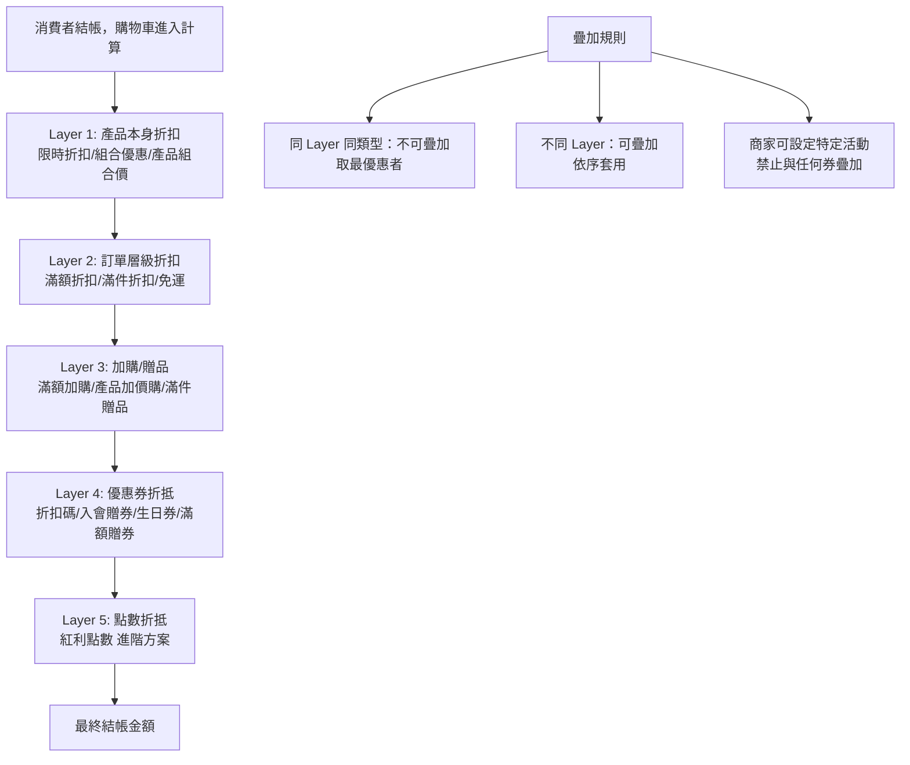
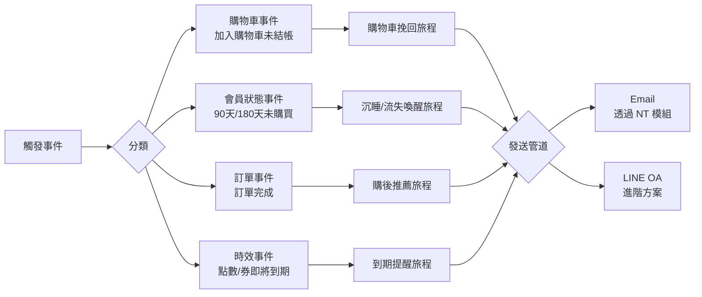
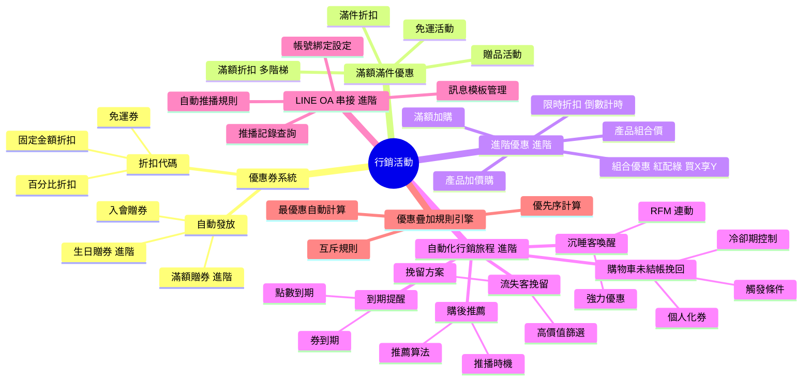
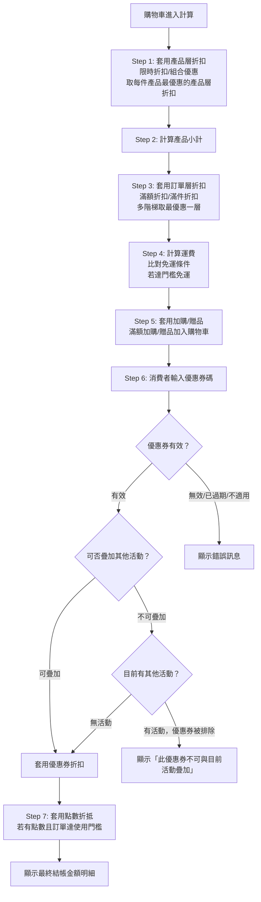
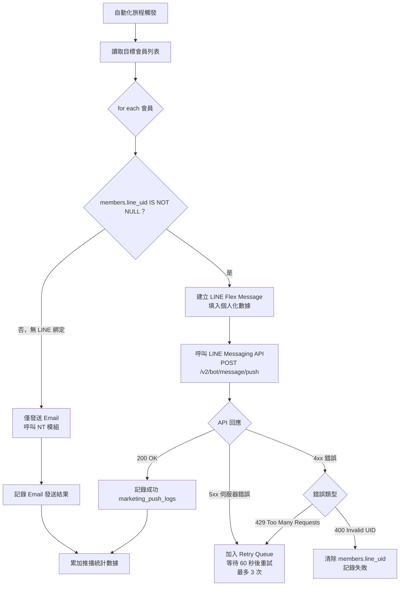

# Evomni — 行銷活動 產品需求文件 (PRD) v1.0

## 1. 文件資訊

| 屬性 | 內容 |
| --- | --- |
| 版本 | v1.0 |
| 日期 | 2026/04/27 |
| 需求來源 | Master PRD v1.0 Chapter 5（P0）、方案規格 V1.1、PRD V3 §3.2.7 |
| 文件狀態 | **P0 補寫版** — 原 PRD V3 有行銷活動架構，但 LINE OA 串接觸發邏輯完全空白；自動化行銷旅程引擎為首次規格化 |
| 作者 | Claude（依廖紫茵授權產出） |
| 對應方案 | 電商啟航方案 ✅（基礎行銷）/ 進階電商包 ✅（自動化行銷 + LINE 串接） |
| 特別說明 | LINE Open API 串接可行性待確認（Master PRD 議題 #10），本文件依「可行」前提規格化；如評估後不可行，LINE 觸發部分改為純 Email 觸發 |
| 開發時程 | 階段一 5–8月（電商啟航方案）/ 階段二 9–12月（進階電商包）|

---

## 2. 目標與功能總覽

### 2.1 核心願景與相依性

**核心問題：**
PRD V3 的行銷活動模組定義了優惠券類型和滿額優惠規則，但以下四大自動化核心邏輯完全空白：
1. 購物車未結帳挽回的觸發條件、冷卻期、LINE/Email 發送邏輯
2. 沉睡客與流失客自動喚醒的觸發判斷 + RFM 連動
3. 購後關聯產品自動推薦的推薦算法觸發點
4. 點數/優惠券即將到期的促購提醒觸發

這四個功能全部屬於「進階電商包」專屬，是本方案最核心的差異化賣點。

**系統相依性（串接的 Evomni 模組）：**

| 模組 | 用途 |
| --- | --- |
| NT（發信模組） | 所有 Email 行銷觸發的實際發信介面；開信/點擊數據回傳 |
| Part 6 會員管理 | 分眾標籤（沉睡/流失/高價值）；點數到期資料；等級資料 |
| Part 3 訂單管理 | 購物車資料；訂單完成事件；退換貨事件 |
| Part 5 數據中心 | RFM 分群計算結果；購物車轉換漏斗數據 |
| LINE OA API | 進階電商包：自動化 LINE 訊息推播（需商家綁定 LINE Official Account）|
| ML（媒體庫） | 行銷 Email 內嵌產品圖片；Banner 圖片 |

---

### 2.2 功能總覽表

| 主功能模組 | 子功能項目 | 方案歸屬 | 功能目的 | 功能詳細描述 | 影響之使用者 |
| --- | --- | --- | --- | --- | --- |
| 優惠券系統 | 折扣代碼（活動贈券） | 兩方案共有 | 拉新與促購 | 商家建立折扣碼，消費者結帳時輸入；支援百分比/固定金額/免運；可設定使用次數、有效期、指定產品/分類 | 商家管理員、消費者 |
| 優惠券系統 | 入會贈券 | 兩方案共有 | 歡迎新會員 | 新會員完成帳號啟用後，系統自動發放設定的優惠券至會員帳戶 | 消費者 |
| 優惠券系統 | 滿額贈券 | 進階電商包 | 鼓勵提高客單價 | 訂單滿額後自動發放下次使用的優惠券（非折抵本筆訂單） | 消費者 |
| 優惠券系統 | 生日贈券 | 進階電商包 | 會員關懷 | 會員生日月份第一天自動發放生日優惠券，NT 同步發送生日祝福信 | 消費者 |
| 滿額/滿件優惠 | 滿額/滿件贈品 | 兩方案共有 | 帶動銷量 | 訂單達金額或件數門檻，自動加入贈品（指定產品）至購物車 | 消費者 |
| 滿額/滿件優惠 | 免運活動 | 兩方案共有 | 降低消費阻力 | 訂單達金額門檻自動免除運費；可設定時間範圍、適用產品/分類 | 消費者 |
| 滿額/滿件優惠 | 滿額折扣 | 兩方案共有 | 階梯式促購 | 訂單金額達門檻享折扣（百分比 or 固定金額），可設多階梯 | 消費者 |
| 滿額/滿件優惠 | 滿件折扣 | 兩方案共有 | 鼓勵多件購買 | 同款或指定分類產品買 N 件享折扣 | 消費者 |
| 進階優惠（進階電商包）| 滿額加購 | 進階電商包 | 提升客單價 | 訂單達門檻可以優惠價加購指定產品 | 消費者 |
| 進階優惠（進階電商包）| 產品加價購 | 進階電商包 | 帶動配件銷售 | 產品頁/購物車顯示可加價購的配件產品 | 消費者 |
| 進階優惠（進階電商包）| 產品組合價 | 進階電商包 | 組合銷售 | 指定多款產品組合一起購買享優惠價，庫存各自管理 | 消費者 |
| 進階優惠（進階電商包）| 限時折扣 | 進階電商包 | 製造購買緊迫感 | 產品指定時間區間內打折，產品頁顯示倒數計時 | 消費者 |
| 進階優惠（進階電商包）| 組合優惠（紅配綠/買X享Y）| 進階電商包 | 交叉銷售 | 指定 A 類產品 + B 類產品組合購買享優惠；或買 X 件享特定折扣 | 消費者 |
| 自動化行銷旅程 | 購物車未結帳挽回 | 進階電商包 | 提升結帳轉換率 | 加入購物車 N 小時未結帳，自動觸發 Email/LINE 推播含個人化優惠券 | 消費者 |
| 自動化行銷旅程 | 沉睡客喚醒 | 進階電商包 | 挽回沉睡會員 | 會員 90 天未購買，自動觸發喚醒 Email/LINE，帶專屬優惠 | 消費者 |
| 自動化行銷旅程 | 流失客挽留 | 進階電商包 | 挽回高價值流失客 | 高價值流失客（180 天未購 + RFM 高等級）觸發強力挽留優惠 | 消費者 |
| 自動化行銷旅程 | 購後推薦再行銷 | 進階電商包 | 帶動回購 | 訂單完成 N 天後，依購買產品類型推薦相關產品 + LINE/Email 推播 | 消費者 |
| 自動化行銷旅程 | 點數/優惠券到期提醒 | 進階電商包 | 促進到期前消費 | 點數或優惠券距到期 N 天，自動觸發提醒 Email/LINE | 消費者 |
| LINE OA 串接 | LINE 帳號綁定設定 | 進階電商包 | 前置配置 | 商家後台設定 LINE Channel Secret / Channel Access Token | 商家管理員 |
| LINE OA 串接 | 自動推播規則管理 | 進階電商包 | 控制 LINE 推播行為 | 商家可設定每個自動化旅程是否啟用 LINE 推播，及推播訊息模板 | 商家管理員 |

---

## 3. 全局功能流程

### 3.1 優惠計算優先序與疊加規則



### 3.2 自動化行銷旅程觸發總覽



---

## 4. 功能結構圖



---

## 5. 使用者故事

| # | 角色 | 故事 |
| --- | --- | --- |
| US-01 | 商家管理員 | 身為商家管理員，我想要建立一個「滿 NT$3,000 送 NT$300 折扣券（下次使用）」的活動，以便鼓勵消費者回購。 |
| US-02 | 消費者 | 身為消費者，我想要在購物車頁面清楚看到目前離「免運門檻」還差多少金額，以便我決定是否加購。 |
| US-03 | 商家管理員 | 身為商家管理員，我想要設定購物車加入產品後 1 小時未結帳即自動發送挽回 Email + LINE，以便不讓潛在訂單流失。 |
| US-04 | 商家管理員 | 身為商家管理員，我想要設定「購物車挽回」功能每個會員每 7 天只觸發一次，以便不打擾消費者造成反感。 |
| US-05 | 商家管理員 | 身為商家管理員，我想要設定「90 天未購買的沉睡會員自動發送 9 折優惠券」的旅程，以便喚回這批會員。 |
| US-06 | 消費者 | 身為消費者，我想要在訂單完成 3 天後收到「根據我購買的產品推薦的相關產品」Line 訊息，以便發現可能需要的產品。 |
| US-07 | 商家管理員 | 身為商家管理員，我想要在 LINE OA 後台設定 Channel Access Token，以便電商系統可以透過我的官方帳號推播訊息。 |
| US-08 | 消費者 | 身為消費者，我想要在我的優惠券即將於 7 天後到期時收到 LINE 提醒，以便我不會忘記使用。 |
| US-09 | 商家管理員 | 身為商家管理員，我想要查看每個自動化旅程的觸發次數、Email 開信率、LINE 點擊率、最終轉換率，以便評估效果。 |
| US-10 | 商家管理員 | 身為商家管理員，我想要設定「任選 A 區產品 + B 區產品組合購買折 NT$200」的紅配綠活動，以便清庫存並帶動配件銷售。 |

---

## 6. UI/UX 與詳細功能需求

### 6.1 優惠券管理（後台）

#### A. 核心使用者流程
後台「行銷活動」→「優惠券管理」→ 查看優惠券列表 → 新增/編輯優惠券。

#### B. 優惠券列表頁

**頁面結構：**
```
[頁面標題：優惠券管理]
[Tab 列]  [折扣代碼] [自動發放券]
[工具列]  [搜尋框] [狀態篩選] [類型篩選] [新增優惠券]
[優惠券 Table]
```

**Table 欄位：**

| 欄位 | 寬度 | 說明 |
| --- | --- | --- |
| 券名稱/代碼 | 200px | 顯示券名稱；折扣代碼另起一行以 `code style` 顯示 |
| 類型 | 100px | `<el-tag>` 百分比折扣/固定金額/免運 |
| 折扣內容 | 120px | 文字描述，例：折 10% / 折 NT$200 |
| 有效期 | 160px | 開始 ~ 結束日期；已到期顯示「已到期」Tag（紅色）|
| 使用上限 / 已使用 | 120px | 例：100 / 已使用 32；無上限顯示「無上限」|
| 發放對象 | 120px | 全體會員 / 指定等級 / 指定標籤 / 手動發放 |
| 狀態 | 100px | `<el-tag>` 進行中（綠）/ 未開始（灰）/ 已到期（紅）/ 已停用（灰）|
| 操作 | 120px | 編輯 / 停用 / 複製 |

#### C. 新增/編輯優惠券表單（`<el-dialog>` 或獨立頁面）

**基本設定區塊：**

| 欄位 | 元件 | 驗證規則 |
| --- | --- | --- |
| 券名稱 | `<el-input>` | 必填；最多 50 字；Placeholder：「例：新年感謝折扣券」|
| 優惠類型 | `<el-radio-group>` | 必選：百分比折扣 / 固定金額折扣 / 免運 |
| 折扣數值 | `<el-input-number>` | 必填；百分比：1-99 整數；固定金額：min 1；免運此欄隱藏 |
| 最高折扣上限（百分比） | `<el-input-number>` | 選填；設定後折扣金額不超過此值；Tooltip：「例：設定 9 折且上限 NT$500，消費 NT$10,000 也最多折 NT$500」|
| 優惠券代碼 | `<el-input>` + 「自動生成」按鈕 | 必填；英數字 4-20 碼；自動生成 8 碼英數組合；唯一性驗證（重複顯示：「此代碼已被使用，請更換」）|

**使用條件區塊：**

| 欄位 | 元件 | 說明 |
| --- | --- | --- |
| 最低訂單金額 | `<el-input-number>` NT$ | 選填；預設 0（無門檻）；Tooltip：「消費者訂單金額需達到此金額才可使用」|
| 適用產品/分類 | `<el-radio>` + 選擇器 | 選項：全部產品 / 指定分類 / 指定產品；選「指定」後顯示搜尋選擇器 |
| 排除產品 | `<el-select>` 多選 | 選填；顯示「此券不適用產品」（輸入產品名稱搜尋）|
| 可否與其他優惠疊加 | `<el-switch>` | 預設 OFF（不可疊加）；開啟代表此券可與任何活動疊加 |

**發放設定區塊：**

| 欄位 | 元件 | 說明 |
| --- | --- | --- |
| 有效期 | `<el-date-picker>` type="daterange" | 必填；開始日期不可早於今天 |
| 發放方式 | `<el-radio-group>` | 手動輸入代碼 / 自動發放（入會/生日/滿額）|
| 使用次數上限（全站） | `<el-input-number>` | 選填；0 代表無上限 |
| 每人使用次數上限 | `<el-input-number>` | 必填；預設 1；最大 99 |
| 發放對象（自動發放時）| `<el-select>` | 全體會員 / 指定等級 / 指定分眾標籤 |

---

### 6.2 滿額/滿件優惠設定（後台）

#### A. 活動列表

**路徑：** 後台「行銷活動」→「滿額/滿件優惠」

**Tab 分類：** 贈品活動 / 免運活動 / 折扣活動 / 加購活動（進階）/ 組合優惠（進階）

#### B. 建立活動通用欄位

| 欄位 | 元件 | 驗證規則 |
| --- | --- | --- |
| 活動名稱 | `<el-input>` | 必填；最多 50 字 |
| 活動期間 | `<el-date-picker>` type="datetimerange" | 必填 |
| 適用方案 | `<el-checkbox-group>` | 選填；可限定僅特定會員等級 |
| 適用產品範圍 | `<el-radio>` + 選擇器 | 全部產品 / 指定分類 / 指定產品 |
| 活動說明（前台顯示）| `<el-input type="textarea">` | 選填；最多 100 字；顯示於購物車旁說明文字 |
| 是否啟用 | `<el-switch>` | 預設 OFF，手動開啟生效 |

#### C. 各類活動特殊欄位

**贈品活動額外欄位：**

| 欄位 | 元件 | 說明 |
| --- | --- | --- |
| 條件類型 | `<el-radio>` | 滿 NT$X 送贈品 / 滿 N 件送贈品 |
| 條件數值 | `<el-input-number>` | 必填 |
| 贈品產品 | 產品搜尋選擇器（`<el-select>` 遠端搜尋）| 必填；贈品產品需有庫存；贈品單價建議設為 NT$0 |
| 贈品數量 | `<el-input-number>` | 必填；最少 1 |
| 贈品庫存不足時 | `<el-radio>` | 自動停止送贈品（推薦）/ 繼續但不發贈品 |

**限時折扣額外欄位（進階電商包）：**

| 欄位 | 元件 | 說明 |
| --- | --- | --- |
| 折扣類型 | `<el-radio>` | 百分比折扣 / 固定金額折扣 |
| 折扣數值 | `<el-input-number>` | 必填 |
| 前台倒數計時顯示 | `<el-switch>` | 開啟後產品頁顯示「距活動結束 HH:MM:SS」倒數 |
| 顯示原價劃除 | `<el-switch>` | 開啟後在折扣價旁顯示原價（劃除樣式）|

**組合優惠（紅配綠）額外欄位（進階電商包）：**

| 欄位 | 元件 | 說明 |
| --- | --- | --- |
| A 組產品 | 分類 or 產品多選 | 紅組；例：上衣系列 |
| B 組產品 | 分類 or 產品多選 | 綠組；例：褲子系列 |
| 優惠條件 | `<el-radio>` | A + B 各一件享折扣 / A + B 各一件享固定金額折扣 |
| 優惠數值 | `<el-input-number>` | 必填 |

---

### 6.3 自動化行銷旅程（進階電商包）

**後台路徑：** 「行銷活動」→「自動化行銷」

**頁面結構：**
```
[頁面標題：自動化行銷旅程]
[旅程卡片列表]（每個旅程一張卡片）
  每張卡片：旅程名稱 / 說明 / 觸發次數（本月）/ 轉換率 / [啟用開關] [設定按鈕]
```

---

#### 6.3.1 購物車未結帳挽回旅程（⚠️ P0 核心規格）

**旅程說明：** 消費者將產品加入購物車但未完成結帳時，在指定時間後自動觸發挽回訊息（Email + LINE），並可選擇自動附上專屬折扣券。

##### A. 觸發條件設定

| 設定欄位 | 元件 | 預設值 | 驗證規則 |
| --- | --- | --- | --- |
| 旅程啟用開關 | `<el-switch>` | OFF | — |
| 觸發等待時間 | `<el-input-number>` + `<el-select>` 分鐘/小時 | 1 小時 | 必填；最短 30 分鐘；最長 24 小時 |
| 觸發條件 | 固定邏輯，不可修改 | — | 購物車有產品 AND 未進入結帳流程 AND 等待時間已過 |
| 冷卻期 | `<el-input-number>` 天 | 7 天 | 必填；每個會員在冷卻期內不重複觸發；最短 1 天；最長 90 天 |
| 是否附上優惠券 | `<el-switch>` | OFF | — |
| 附上的優惠券 | `<el-select>`（選現有優惠券）| — | 「是否附上優惠券」開啟時必填 |
| 最低購物車金額 | `<el-input-number>` NT$ | 0（不限） | 選填；低於此金額的購物車不觸發 |

##### B. 觸發邏輯規格（⚠️ 工程師必讀）

**觸發判斷流程（後端排程，每 5 分鐘執行）：**

```
1. 查詢所有「有產品 + 最後更新時間距今 >= 觸發等待時間 + 尚未觸發過本次旅程」的購物車
2. 對每個購物車：
   a. 確認 member_id 非空（訪客購物車不觸發）
   b. 確認該 member_id 在冷卻期內未觸發過此旅程（查 marketing_triggers 表）
   c. 確認購物車金額 >= 最低購物車金額設定
3. 符合條件者：
   a. 產生個人化挽回連結（含 cart recovery token，有效期 48 小時）
   b. 若有設定優惠券：為該會員產生一次性優惠券（或發放至帳戶）
   c. 呼叫 NT 模組發送 Email
   d. 若商家已綁定 LINE OA 且會員已綁定 LINE：呼叫 LINE OA API 發送訊息
   e. 寫入 marketing_triggers 表記錄（member_id, journey_type, triggered_at）
4. 消費者點擊挽回連結：還原購物車 + 套用優惠券（若有）
5. 消費者完成結帳：記錄轉換事件
```

**Cart Recovery Token 安全規格：**
- Token 格式：UUID v4
- 儲存：`cart_recovery_tokens` 表（token, member_id, cart_snapshot_json, expires_at, used）
- 有效期：48 小時
- 使用後標記 `used = true`，不可重複使用
- 點擊連結恢復購物車時，若產品已售完，顯示「部分產品已售完，已更新購物車」提示

##### C. Email 模板規格

**信件主旨（後台可設定）：**
- 預設：「🛒 您有產品等待帶走！」
- 可插入變數：`{會員姓名}`、`{購物車產品數}`、`{購物車金額}`

**Email 內容區塊（後台可編輯）：**

```
[問候區塊]
  Hi {會員姓名}，您的購物車還有 {N} 件產品正在等您！
[產品列表區塊]（最多顯示 3 件，超過顯示「+N 件」）
  產品縮圖 | 產品名稱 | 規格 | 單價
[優惠區塊（若有）]
  🎁 我們為您準備了專屬優惠！使用代碼 {折扣碼} 可享 X 折優惠
  有效期：{到期日}
[CTA 按鈕]
  [立即結帳] 連結至 cart recovery 連結
[警示文字]（小字）
  此連結有效期為 48 小時
```

##### D. LINE OA 訊息模板規格

**訊息類型：** Flex Message（卡片型）

**訊息結構：**

```json
{
  "type": "bubble",
  "header": {
    "type": "box",
    "contents": [
      {"type": "text", "text": "🛒 您的購物車有產品等您！", "size": "sm", "weight": "bold"}
    ]
  },
  "body": {
    "type": "box",
    "contents": [
      {"type": "text", "text": "{會員姓名} 您好", "size": "sm"},
      {"type": "text", "text": "購物車共 {N} 件產品，總計 NT${金額}", "size": "sm"},
      // 產品列表（最多 2 件）
      {
        "type": "image",
        "url": "{產品縮圖 URL}",
        "aspectRatio": "20:13"
      },
      {"type": "text", "text": "{產品名稱}", "size": "sm"},
      // 優惠碼（若有）
      {"type": "text", "text": "🎁 輸入 {折扣碼} 享 X 折", "color": "#F56C6C", "size": "sm"}
    ]
  },
  "footer": {
    "type": "box",
    "contents": [
      {
        "type": "button",
        "action": {
          "type": "uri",
          "label": "立即結帳",
          "uri": "{cart recovery 連結}"
        },
        "style": "primary",
        "color": "#303133"
      }
    ]
  }
}
```

---

#### 6.3.2 沉睡客與流失客自動喚醒旅程（⚠️ P0 核心規格）

**旅程說明：** 依 Part 6 會員管理的自動標籤（沉睡客：90-180 天未購；流失客：>180 天未購），自動觸發喚醒旅程。

##### A. 設定欄位

| 設定欄位 | 元件 | 說明 |
| --- | --- | --- |
| 旅程啟用開關 | `<el-switch>` | 沉睡客旅程和流失客旅程各自獨立設定 |
| 觸發條件 | 固定：連動 Part 6 沉睡/流失標籤 | 由每日排程計算；標籤更新時觸發 |
| 冷卻期 | `<el-input-number>` 天，預設 30 天 | 同一會員 30 天內不重複觸發 |
| 發送時間 | `<el-time-picker>` | 預設 10:00；避免深夜打擾 |
| 沉睡喚醒優惠券 | `<el-select>` 選優惠券 | 選填；建議設定 9 折或 NT$50 折扣 |
| 流失挽留優惠券 | `<el-select>` 選優惠券 | 選填；建議設定更強力的優惠 |
| RFM 連動（流失旅程）| `<el-switch>` | 開啟後，流失旅程只針對「RFM 高價值分群」觸發（避免對低價值流失客過度行銷）|

##### B. 觸發邏輯規格

**沉睡客觸發（每日排程，於設定發送時間執行）：**

```
1. 從 Part 6 取得當日標籤更新後的「沉睡客」會員列表
2. 過濾冷卻期（查 marketing_triggers 表）
3. 符合條件者：發送沉睡喚醒 Email + LINE（同購物車挽回的發送流程）
4. 寫入 marketing_triggers 記錄
```

**流失客觸發（每日排程，連動 RFM）：**

```
1. 從 Part 6 取得「流失客」標籤會員列表
2. 若開啟 RFM 連動：進一步篩選 RFM 分群中 R ≤ 4 個月（近期有消費過但現在流失）的會員
3. 過濾冷卻期
4. 觸發流失挽留旅程
```

##### C. Email/LINE 訊息模板規格

**沉睡喚醒 Email 主旨：**「{會員姓名}，我們想念您！回來看看有什麼新品 🎁」

**流失挽留 Email 主旨：**「{會員姓名}，我們為您保留了一份專屬優惠」

**LINE 訊息：** Flex Message（同購物車挽回格式），CTA 按鈕導至商店首頁或指定分類頁

---

#### 6.3.3 購後關聯產品自動推薦旅程（⚠️ P0 核心規格）

**旅程說明：** 訂單完成後 N 天，系統依消費者購買的產品類型，推薦相關產品（例：買了相機推薦相機包、記憶卡）。

##### A. 設定欄位

| 設定欄位 | 元件 | 說明 |
| --- | --- | --- |
| 旅程啟用開關 | `<el-switch>` | — |
| 觸發等待時間 | `<el-input-number>` 天，預設 3 天 | 訂單完成後 N 天觸發 |
| 推薦產品來源 | `<el-radio>` | 自動算法 / 手動設定交叉銷售規則 |
| 冷卻期 | `<el-input-number>` 天，預設 14 天 | 同一會員 14 天內不重複 |
| 是否附上優惠券 | `<el-switch>` | 選填 |

##### B. 推薦產品算法規格

**推薦算法（依優先序選擇）：**

| 優先序 | 算法 | 說明 |
| --- | --- | --- |
| 1 | 手動交叉銷售規則 | 商家在產品後台設定「購買此產品的人也常買：[產品列表]」|
| 2 | 分類關聯推薦 | 推薦同分類下近 30 天最熱銷的前 3 件產品（排除已購過的）|
| 3 | 全站熱銷推薦 | 若無同分類產品，推薦全站近 30 天熱銷前 5 件（排除已購過的）|

**排除規則：**
- 已購過的產品不推薦（查該會員所有已完成訂單）
- 庫存 = 0 的產品不推薦
- 已下架產品不推薦

##### C. LINE/Email 模板規格

**Email 主旨：**「您可能也需要這些 🛍️」

**Email 內容：**

```
[問候]：感謝您最近購買了 {產品名稱}！
[推薦區塊]：根據您的購買，我們為您推薦...
  [產品卡片 x 3]：圖片 / 名稱 / 價格 / [加入購物車] 按鈕
[CTA]：[瀏覽更多產品]
```

---

#### 6.3.4 點數/優惠券到期提醒旅程（⚠️ P0 核心規格）

**旅程說明：** 點數或優惠券即將到期時，主動提醒消費者趁期限前使用。

##### A. 設定欄位

| 設定欄位 | 元件 | 說明 |
| --- | --- | --- |
| 點數到期提醒啟用 | `<el-switch>` | — |
| 點數到期提醒提前天數 | `<el-input-number>` 天，預設 30 天 | 與 Part 6 點數設定同步（若 Part 6 已設定，此處同步顯示）|
| 優惠券到期提醒啟用 | `<el-switch>` | — |
| 優惠券到期提醒提前天數 | `<el-input-number>` 天，預設 7 天 | 最短 1 天；最長 30 天 |

##### B. 觸發邏輯規格

**點數到期提醒（由 Part 6 每日排程觸發，回調至此旅程）：**
- Part 6 排程在偵測到「N 天後到期的點數批次」時，呼叫行銷旅程 API
- 行銷旅程執行 Email + LINE 發送
- 同一到期批次只通知一次

**優惠券到期提醒（每日排程）：**
- 每日掃描會員帳戶中 `expires_at` 距今 ≤ 提醒天數 的優惠券
- 未通知過者（`reminder_sent_at IS NULL`）：觸發通知，更新 `reminder_sent_at`

---

### 6.4 LINE OA 串接設定（進階電商包）

#### A. 後台 LINE OA 設定頁

**路徑：** 後台「行銷活動」→「LINE OA 設定」（或「全域設定 > 電商進階設定 > LINE OA 設定」）

**設定欄位：**

| 欄位 | 元件 | 驗證規則 |
| --- | --- | --- |
| LINE Channel ID | `<el-input>` | 必填；數字字串 |
| LINE Channel Secret | `<el-input>` type="password" | 必填；儲存後顯示 `****`，提供「重新設定」按鈕 |
| LINE Channel Access Token | `<el-input>` type="password" | 必填；儲存後顯示 `****` |
| [驗證連線] 按鈕 | `<el-button type="primary">` | 點擊後呼叫 LINE API 驗證 Token 有效性，顯示成功/失敗結果 |
| Webhook URL | `<el-input>` disabled | 系統自動產生；消費者在 LINE 點擊連結後的 Webhook 接收位址 |

**驗證成功顯示：**
`<el-alert type="success">` 「LINE OA 連線成功！帳號名稱：{OA 名稱}，粉絲數：{N}人」

**驗證失敗顯示：**
`<el-alert type="error">` 「連線失敗，錯誤碼：{code}。請確認 Channel Access Token 是否正確，並確保 LINE OA 已啟用 Messaging API。」

#### B. LINE 推播授權機制

消費者需同意接收 LINE 推播，才可觸發 LINE 訊息：

1. 消費者在前台「個人資料」頁，顯示「LINE 推播通知」區塊
2. 點擊「綁定 LINE」→ 導向 LINE 授權頁（OAuth）
3. 消費者同意後，系統取得消費者的 LINE UID，儲存至 `members.line_uid`
4. 往後自動化旅程觸發時，先確認 `members.line_uid IS NOT NULL` 才發送 LINE

**取消推播：**
消費者可在「個人資料」頁點擊「解除 LINE 綁定」→ 清除 `members.line_uid`，往後不再發送 LINE 訊息。

#### C. 推播記錄查詢（後台）

**路徑：** 後台「行銷活動」→「推播記錄」

**Table 欄位：**

| 欄位 | 說明 |
| --- | --- |
| 發送時間 | `YYYY/MM/DD HH:mm` |
| 旅程名稱 | 購物車挽回/沉睡喚醒/流失挽留/購後推薦/到期提醒 |
| 發送管道 | Email / LINE |
| 發送對象（數量）| N 人 |
| 成功發送 | N 人 |
| 失敗/退信 | N 人 |
| 開信/點擊率（Email）| X% |
| 點擊率（LINE）| X% |
| 最終轉換（下單）| N 人（X%）|

---

### 6.5 購物車頁面優惠進度提示（前台）

消費者在購物車頁面，必須看到當前適用的優惠及距下一層優惠的差距：

**購物車優惠進度條（`<el-progress>`）：**

```
[免運進度條]
目前消費：NT$ X,XXX
還差 NT$ XXX 即可享免運！
[=====     ] 70%

[下一階優惠提示]
再消費 NT$ XXX 享 9 折優惠
```

- 已達到的優惠：顯示 ✅ + 優惠說明
- 贈品活動：顯示「再消費 NT$X 可獲贈 [贈品名稱]」

---

## 7. 細部邏輯流程圖

### 7.1 優惠套用優先序計算流程



### 7.2 LINE OA 發送完整流程



---

## 8. 非功能性需求

### 8.1 效能需求

| 項目 | 標準 |
| --- | --- |
| 優惠計算（購物車更新）| ≤ 500ms；每次更新購物車重新計算所有優惠 |
| 購物車挽回排程（每 5 分鐘）| 每次執行 ≤ 2 分鐘完成（10 萬活躍購物車以內）|
| LINE 推播批次速率 | 遵守 LINE API 限制：500 messages/second；超過限制使用 multicast API 分批發送 |
| 沉睡/流失旅程每日排程 | 00:00 ~ 02:00 完成 |
| 優惠券有效性驗證（結帳時）| ≤ 200ms |

### 8.2 安全性需求

| 項目 | 規格 |
| --- | --- |
| Cart Recovery Token | UUID v4；48 小時有效；使用後失效；不可重複使用 |
| LINE Channel Secret | 加密儲存（AES-256）；不可在前端顯示 |
| LINE Channel Access Token | 加密儲存；API 呼叫時解密使用；禁止在 Log 中出現 |
| 優惠券代碼唯一性 | DB 唯一索引；建立時驗證衝突 |
| 推播權限 | 消費者明確同意（opt-in）才可發送 LINE；取消後立即停止 |

### 8.3 資料一致性

- 優惠套用必須在訂單建立的 Transaction 內完成，確保優惠券「使用次數」和「會員已使用記錄」同步扣減
- LINE 推播失敗不影響主業務流程（Email 和 LINE 發送異步執行）
- Cart Recovery Token 使用後在同一 Transaction 內標記 `used = true`，防止並發重複使用

### 8.4 瀏覽器/裝置支援

| 環境 | 要求 |
| --- | --- |
| 後台 | Chrome 110+、Edge 110+、Firefox 110+；桌機最低 1280px |
| 前台購物車/優惠顯示 | 手機（375px+）、平板（768px+）、桌機；RWD |

---

## 8.5 工程師確認補充（v1.1 更新，2026/04/28）

### 8.5.1 購物車挽回計時：以最後一次異動時間為準

`carts` 表必須有 `last_updated_at DATETIME` 欄位，每次購物車有任何變動（新增/刪除/修改數量）時更新。購物車挽回旅程的觸發計時從 `last_updated_at` 起算，不是從第一次加入產品起算。

### 8.5.2 訪客購物車不觸發挽回旅程

**v1.0 明確規格**：購物車挽回旅程**僅針對已登入會員的購物車**，訪客（Cookie/Session 購物車）不觸發。

訪客在同一 Session 中登入後，購物車合併為會員購物車，**合併後的會員購物車**才納入挽回監控（計時從合併時重新開始）。

### 8.5.3 優惠券使用的 Race Condition 防護

使用 DB 唯一索引保證冪等性：

```sql
CREATE TABLE coupon_usages (
  id           BIGINT AUTO_INCREMENT PRIMARY KEY,
  coupon_id    BIGINT NOT NULL,
  member_id    BIGINT NOT NULL,
  order_id     BIGINT NOT NULL,
  used_at      DATETIME DEFAULT CURRENT_TIMESTAMP,
  UNIQUE KEY uq_coupon_member (coupon_id, member_id)  -- 每人每券限一次
);
```

結帳時嘗試 INSERT，若 Duplicate Key → 回傳 `409 COUPON_ALREADY_USED`。全域使用次數限制用 Redis `INCR coupon:{id}:usage_count` 原子操作。

### 8.5.4 優惠 5 層計算基準：每層以上一層折後金額為基準

**決策**：每一層的計算基準都是上一層折後的金額（非全部基於原價）。

滿額門檻判斷亦以折後金額為準（較嚴格）。例：原價 1,000 元，Layer 1 限時折扣後 900 元，「滿 1,000 才折」的活動**不適用**（因折後為 900 元）。

### 8.5.5 行銷旅程去重表正式 Schema

```sql
CREATE TABLE marketing_journey_logs (
  id              BIGINT AUTO_INCREMENT PRIMARY KEY,
  member_id       BIGINT NOT NULL,
  journey_type    ENUM('cart_recovery','sleep_wakeup','churn_winback',
                       'post_purchase','points_expiry','coupon_expiry'),
  triggered_at    DATETIME DEFAULT CURRENT_TIMESTAMP,
  cooldown_ends_at DATETIME NOT NULL,
  channel         ENUM('email','line','both'),
  reference_id    BIGINT DEFAULT NULL,
  result          ENUM('sent','failed','skipped'),
  INDEX idx_member_journey (member_id, journey_type, cooldown_ends_at)
);
```

去重查詢：`WHERE member_id = ? AND journey_type = ? AND cooldown_ends_at > NOW()`

---

## 與團隊溝通摘要

- 這次的規格是關於**行銷活動模組（Part 4）**，最關鍵的新增內容是「自動化行銷旅程」的四條旅程（購物車挽回、沉睡/流失喚醒、購後推薦、到期提醒）以及 LINE OA 串接的完整規格，這些都是進階電商包的核心差異化功能
- **工程師這邊需要注意：**
  1. 購物車挽回的排程每 5 分鐘執行一次，要注意不要因為執行時間過長導致「重複觸發」問題，建議加 distributed lock（Redis）防止排程重疊
  2. LINE Messaging API 有速率限制（500 msg/sec），超過時需使用 multicast API 分批發送，不可直接 loop 單發
  3. Cart Recovery Token 的並發保護：同一 Token 可能被點擊兩次（雙擊），需在 DB 用 SELECT FOR UPDATE 鎖定避免重複使用
  4. 優惠套用的計算邏輯（7.1 流程圖）必須完整實作優先序，不可自行調整順序，否則計算結果會不符商家設定
  5. LINE Channel Access Token 的加密存儲是安全性要求，需確認 Laravel 的加密設定（`APP_KEY`）
- **設計師這邊需要注意：**
  1. 前台購物車頁的「優惠進度條」是重要轉換設計，進度條和文案要讓消費者「想再多買一點」
  2. 限時折扣的倒數計時（HH:MM:SS）需用前端 JavaScript 即時更新，設計時預留計時數字的固定寬度避免版面跳動
  3. 自動化行銷旅程後台的「旅程卡片列表」要清楚顯示每個旅程的開關和本月數據，讓商家一眼評估效果
- 這個模組依賴 **Part 6 會員管理**（分眾標籤、點數到期資料）、**Part 3 訂單管理**（購物車資料、訂單完成事件）、**NT 發信模組**（Email 發送）
- **LINE 串接有一個重大待確認事項（Master PRD 議題 #10）：** LINE Open API 串接可行性與成本評估尚未完成。本文件依「可行」前提規格化，若評估後不可行，所有 LINE 觸發部分改為純 Email 觸發，整體旅程邏輯不變，只是發送管道調整
