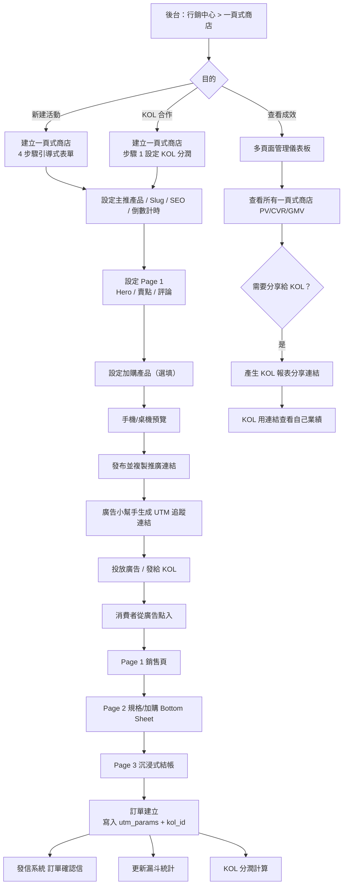
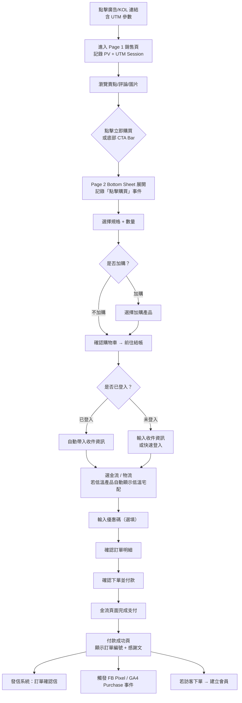
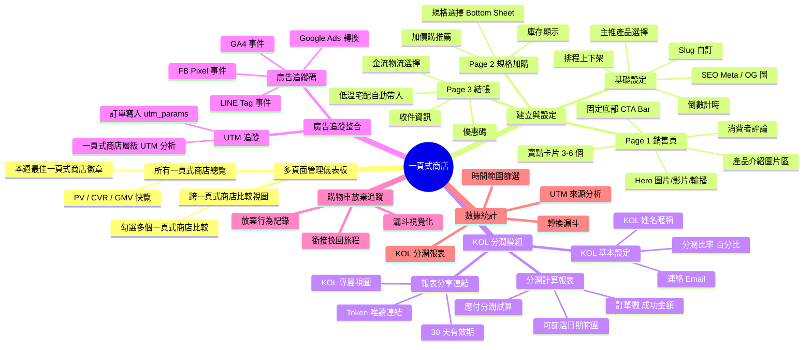
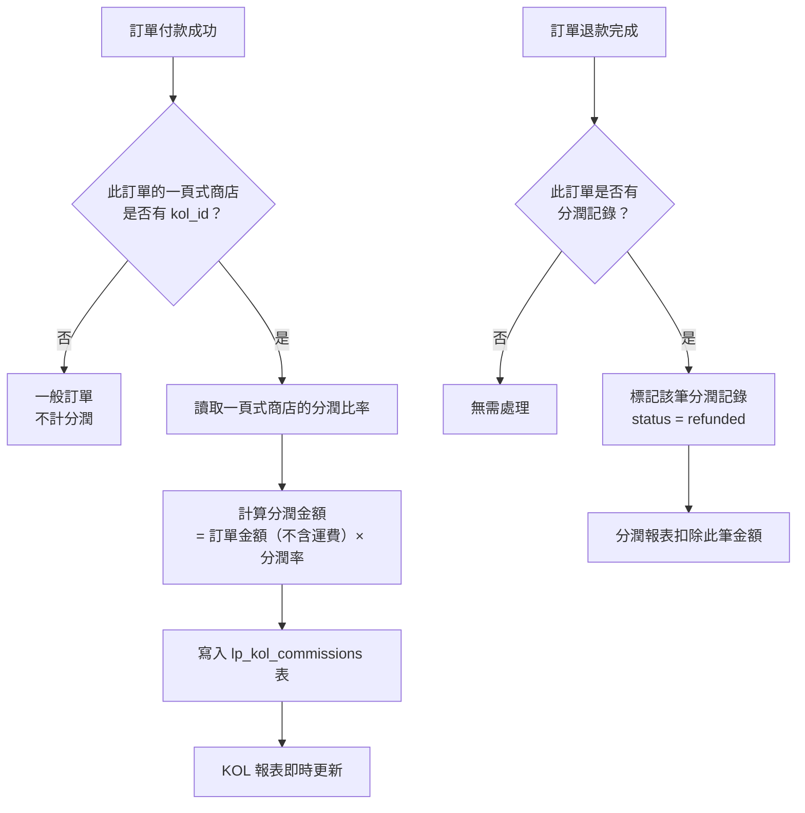
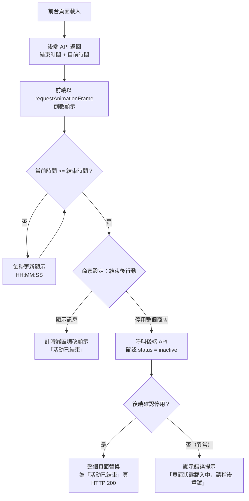
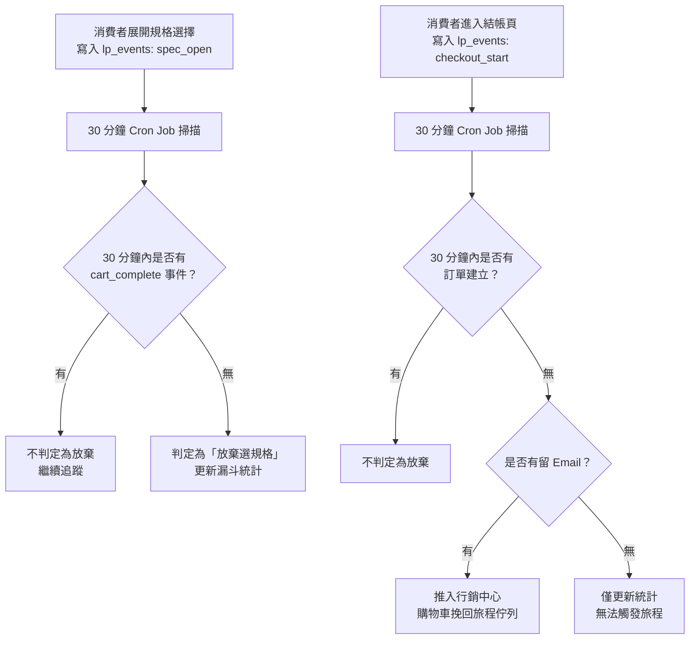
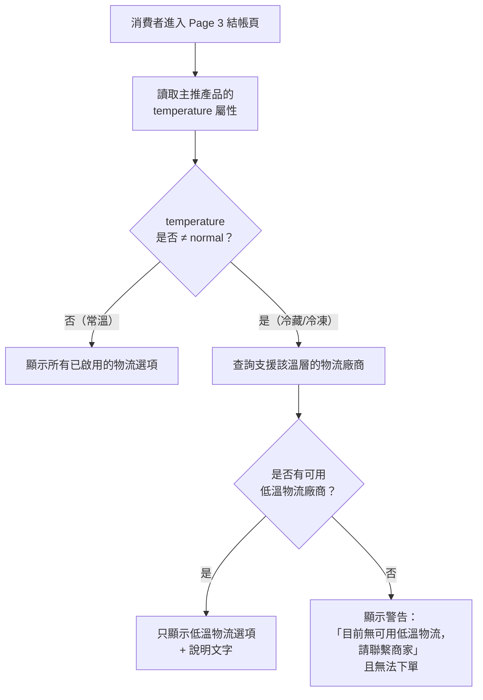
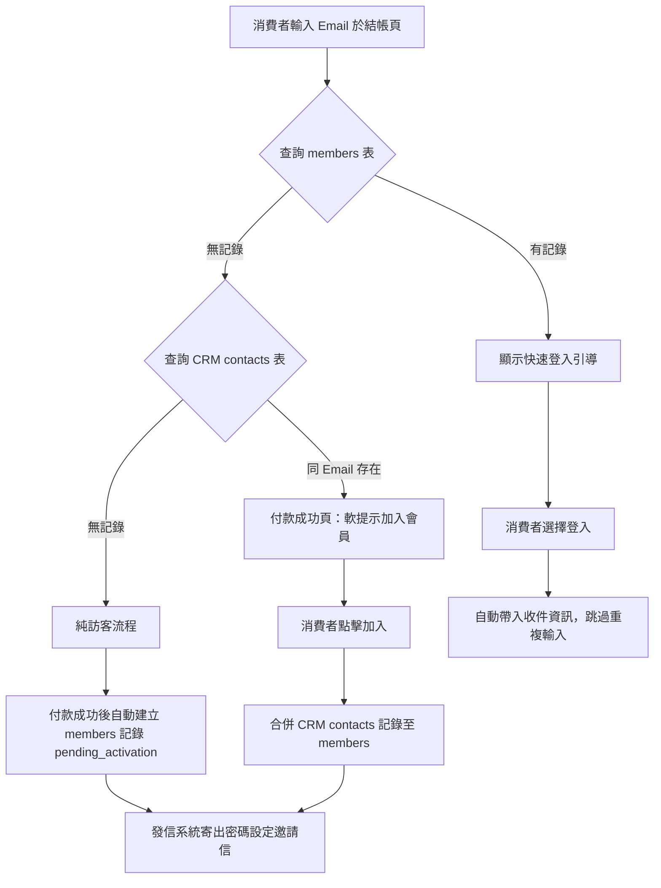

## 版本更新紀錄

| 版本 | 日期 | 修改內容 | 修改人 |
|------|------|----------|--------|
| v2.2 | 2026/05/03 | 新增 §6.11 會員資料連動機制（四大場景 + 資料流說明）；新增 §6.12 通知信與前台文字客製化規格 | Una |
| v2.1 | 2026/04/29 | 補充 GrapeJS 編輯器架構說明（電商專用版型與快速區塊）；新增前台路徑直接生成機制（不走選單管理）；「LP」縮寫全部還原為「一頁式商店」 | Una |
| v2.0 | 2026/04/29 | 依台灣市場分析全面升級：新增 KOL 分潤系統（獨立頁面＋分潤計算＋報表分享）、購物車放棄追蹤、多頁面管理儀表板、UTM 追蹤整合（連動廣告小幫手）；低溫物流明確規格；確認不開放客戶外送 CRM Webhook | Una |
| v1.0 | 2026/04/27 | 初稿建立：輕量 3 頁流程（銷售頁/規格加購/結帳）、倒數計時、基礎統計 | Una |

# Evomni — 一頁式商店 產品需求文件 (PRD)

## 1. 文件資訊

| 屬性 | 內容 |
| --- | --- |
| 需求來源 | 台灣一頁式商店市場分析、Master PRD Chapter 5、方案規格 V1.1 |
| 文件狀態 | **v2.1 補充** — GrapeJS 編輯器整合說明（電商版型 + 快速區塊）；前台路徑直接生成架構說明；術語統一 |
| 對應方案 | 進階電商包 ✅（電商啟航方案 ❌）|
| 開發時程 | 階段二 9–12月（進階電商包）|
| 撰寫視角 | 行銷人員（KOL 合作、廣告投放）+ FAE 工程師（效能、安全）+ UI/UX 設計師 |

> **📌 工程師實作說明：** 本文件以需求定義為主。文中所列技術規格（DB Schema、API 路由、資料結構等）為規劃建議，反映 PM 對系統的理解；工程師可依技術判斷調整實作方式。如有重大架構變更，請於 Git commit 說明原因，並同步更新本文件，保持版控一致。

---

## 2. 目標與功能總覽

### 2.1 核心願景與相依性

**產品定位：廣告流量承接 + KOL 合作管理的變現工具**，不是電商主站的縮小版。

電商主站解決「品牌要存在」，一頁式商店解決「這波要變現」。消費者從廣告或 KOL 連結點進來，不離開這個頁面就完成購買，最大化單次活動轉換率。

**三大核心使用場景：**
- **廣告投放型品牌（保健食品、美妝、功能性產品）**：FB/IG 廣告大量投放，需要單一 Landing Page 承接流量、快速結帳，不希望消費者跑去主站分心
- **KOL / 團購合作商**：每個 KOL 各自的頁面，需要算分潤、查各自業績、分享專屬報表給 KOL
- **單一活動 / 新品測市場**：主站已有，但某次新品發表或會員專屬優惠不想在主站做，另開一頁衝轉換

**核心問題與解決方案：**

| 痛點 | 解決方式 |
| --- | --- |
| 廣告導流進主站後消費者分心瀏覽不結帳 | 獨立前台路由、無導覽選單、直線式購買流程 |
| 多個 KOL 分開管理、算分潤很麻煩 | KOL 分潤模組：每個一頁式商店綁定 KOL + 設定分潤比率，系統自動計算 |
| KOL 想看自己業績但商家不想給後台帳號 | 報表分享連結：時效性唯讀連結，只顯示該 KOL 一頁式商店的數據 |
| 不知道哪個廣告素材真正帶來轉換 | UTM 追蹤連動廣告小幫手，一頁式商店層級的廣告來源分析 |
| 台灣食品類客戶需要低溫宅配 | 繼承主站產品的溫層屬性，結帳自動套用低溫物流規則 |

**系統相依性：**

| 模組 | 用途 |
| --- | --- |
| Part 2 產品中心 | 產品資料來源（庫存/規格/價格/溫層屬性）；訂單建立時原子扣庫存 |
| Part 3 訂單管理 | 結帳完成後建立訂單、電子發票、發信系統通知；KOL 分潤標籤寫入 |
| 全域設定 > 金物流串接 | 結帳頁金流選擇；溫層物流費率計算（繼承主站規則） |
| Part 4 行銷活動 | 加價購推薦產品來源；購物車放棄追蹤數據提供給挽回旅程 |
| 媒體庫 | 產品圖、Banner 圖、影片；自動 WebP 轉換 |
| Part 6 會員管理 | 消費者登入後自動帶入資料；完成購買自動建立會員 |
| 產品廣告小幫手 | Pixel 追蹤碼（FB Pixel/GA4/Google Ads/LINE Tag）自動注入；UTM 連動分析 |
| Part 5 數據中心 | 一頁式商店層級的廣告來源轉換數據整合至數據中心 |

---

### 2.2 功能總覽表

本文件涵蓋一頁式商店從建立、推廣、結帳到數據回報的完整功能鏈，以下依操作流程排序。

| 主功能模組 | 子功能項目 | 功能目的 | 功能詳細描述 | 影響之使用者 |
| --- | --- | --- | --- | --- |
| 多頁面管理儀表板 | 所有一頁式商店總覽 | 快速掌握所有活動成效 | 列出所有一頁式商店的即時數據（PV/CVR/GMV）；支援依成效排序；顯示本週最佳一頁式商店徽章 | 商家管理員 |
| 多頁面管理儀表板 | 跨一頁式商店比較視圖 | 橫向比較不同活動或 KOL | 可勾選多個一頁式商店比較 PV、CVR、GMV、平均客單價 | 商家管理員 |
| 一頁式商店設定 | 建立一頁式商店 | 快速建立獨立銷售頁 | 4 步驟流程：基礎設定（Slug/SEO/倒數/KOL）→ GrapeJS 頁面設計 → 加購設定 → 預覽與發布 | 商家管理員 |
| 一頁式商店設定 | GrapeJS 頁面編輯器 | 視覺化設計銷售頁 | 沿用 Evomni 現有 GrapeJS 編輯器；提供電商專用快速版型（單品爆款、KOL合作、限時搶購）；內建電商區塊可拖拉組合；商家可自由換版型 | 商家管理員 |
| 一頁式商店設定 | 前台路徑直接生成 | 發布即上線，無需選單管理 | 發布後自動生成 `https://{店家網域}/lp/{slug}`；不經過 Evomni 選單管理流程；URL 可直接複製用於廣告投放 | 商家管理員 |
| 一頁式商店設定 | 獨立網址設定 | 廣告投放直達 | 自動產生 Slug；可自訂；可綁定獨立子網域 | 商家管理員 |
| 一頁式商店設定 | 頁面排程控制 | 精準控制活動時間 | 設定上架時間（到時自動啟用）；設定倒數結束時間（到時顯示結束訊息 or 自動停用）| 商家管理員 |
| 一頁式商店設定 | 低溫物流支援 | 食品類產品正確運費 | 主推產品有溫層屬性時，結帳頁自動顯示低溫宅配選項，並套用主站溫層運費規則 | 消費者、商家管理員 |
| KOL 分潤模組 | KOL 設定 | 建立 KOL 合作關係 | 在一頁式商店層級設定：KOL 姓名/暱稱、分潤比率（%）、連絡 Email；系統自動建議以 KOL 名稱為 Slug | 商家管理員 |
| KOL 分潤模組 | 分潤計算報表 | 結算 KOL 業績 | 統計該 KOL 一頁式商店的：訂單數、成功訂單總金額（扣除退款）、應付分潤金額（= 訂單金額 × 分潤率）；可依日期範圍篩選 | 商家管理員 |
| KOL 分潤模組 | KOL 報表分享連結 | 讓 KOL 自行查看業績 | 產生含 Token 的唯讀分享連結（有效期 30 天可重設）；KOL 只能看到自己那個一頁式商店的數據，無法存取其他一頁式商店或後台 | 商家管理員、KOL |
| 前台銷售頁 | Hero 區塊 | 第一印象 CTA | 全寬圖片/影片/輪播 + 主標題 + 副標題 + 立即購買 CTA 按鈕 | 消費者 |
| 前台銷售頁 | 賣點圖文卡片 | 說服消費者 | 3-6 個可自訂的賣點卡片（icon + 標題 + 說明）| 消費者 |
| 前台銷售頁 | 消費者評論 | 社會證明 | 手動維護的評論清單（文字 + 星等 + 圖片選填）；最多 10 則 | 消費者 |
| 前台銷售頁 | 倒數計時 | 製造緊迫感 | 活動結束倒數 `HH:MM:SS`；後端控制狀態，前端不可繞過 | 消費者 |
| 前台銷售頁 | 固定底部 CTA Bar | 永遠可見的購買入口 | 全程固定在頁面底部，顯示產品名稱 + 價格 + 購買按鈕 | 消費者 |
| 前台規格/加購頁 | 規格選擇（Bottom Sheet）| 選擇產品規格 | 最多 3 層規格；無庫存灰色顯示；未選規格時防呆提示 | 消費者 |
| 前台規格/加購頁 | 加價購推薦 | 提升客單價 | 2-4 件加購產品橫向捲動；來自行銷中心加價購設定 | 消費者 |
| 前台結帳頁 | 沉浸式結帳 | 降低結帳流失 | 無導覽選單、無離開連結；進度條 3 步驟；已登入自動帶入資料 | 消費者 |
| 前台結帳頁 | 優惠碼輸入 | 套用折扣 | 即時計算折扣後金額；從行銷中心設定的優惠碼 | 消費者 |
| 購物車放棄追蹤 | 放棄行為可視化 | 了解流失點 | 記錄進入 Page 2（選規格）但未完成結帳的行為；顯示於 一頁式商店統計頁的漏斗圖 | 商家管理員 |
| 購物車放棄追蹤 | 銜接挽回旅程 | 自動行銷跟進 | 若消費者已登入或留下 Email，放棄事件寫入行銷中心的挽回旅程觸發佇列 | 商家管理員、消費者 |
| UTM 追蹤整合 | 一頁式商店層級廣告來源分析 | 知道哪個廣告帶來轉換 | 訂單建立時記錄 utm_source/medium/campaign；一頁式商店統計頁呈現各 UTM 維度的轉換漏斗和 GMV | 商家管理員 |
| UTM 追蹤整合 | 廣告追蹤碼注入 | 精準廣告回報 | 一頁式商店前台自動注入廣告小幫手設定的 FB Pixel/GA4/Google Ads/LINE Tag；觸發 ViewContent/AddToCart/Purchase 事件 | 商家管理員 |
| 數據統計 | 轉換漏斗 | 精準找出流失點 | PV → 點擊購買 → 選規格完成 → 進入結帳 → 完成付款；各層轉換率 | 商家管理員 |
| 數據統計 | UTM 來源分析 | 廣告 ROI 歸因 | 依 utm_source/medium/campaign 分組，顯示各來源的 PV/CVR/GMV | 商家管理員 |
| 數據統計 | KOL 分潤報表 | KOL 業績結算 | 僅 KOL 一頁式商店顯示：分潤比率、訂單總額、應付分潤金額 | 商家管理員 |

---

## 3. 全局功能流程

### 3.1 商家操作全流程



### 3.2 消費者購買流程



---

## 4. 功能結構圖



---

## 5. 使用者故事

| # | 角色 | 故事 |
| --- | --- | --- |
| US-01 | 商家管理員 | 身為商家管理員，我想要為爆款保健食品建立一個獨立的廣告落地頁，以便配合 IG 廣告投放直接導流到購買頁面，不讓消費者分心逛主站。 |
| US-02 | 商家管理員 | 身為商家管理員，我想要在一頁式商店設定「48 小時限時」倒數計時，以便製造緊迫感提升轉換率。 |
| US-03 | 商家管理員 | 身為商家管理員，我想要為每個合作 KOL 建立專屬頁面並設定 10% 分潤比率，以便月底自動算出每位 KOL 應拿的金額，不用手動對帳。 |
| US-04 | KOL | 身為 KOL，我想要用商家給的分享連結查看我那個頁面的業績數字，以便了解自己帶來了多少銷售，且不需要後台帳號。 |
| US-05 | 商家管理員 | 身為商家管理員，我想要看到「哪個廣告素材帶來最多轉換」的 UTM 分析，以便決定下一波廣告預算要怎麼分配。 |
| US-06 | 商家管理員 | 身為商家管理員，我想要在多頁面管理儀表板一眼看到所有進行中的一頁式商店的 PV/CVR/GMV，以便快速判斷哪個活動需要調整。 |
| US-07 | 消費者 | 身為消費者，我想要在選完規格後看到推薦的加購產品，以便一次買齊需要的配件。 |
| US-08 | 消費者（購買冷凍食品）| 身為消費者，我想要在結帳時看到低溫宅配選項且運費正確顯示，以便放心購買需要冷藏/冷凍運送的食品。 |

---

## 6. UI/UX 與詳細功能需求

### 6.1 多頁面管理儀表板

**路徑：** 行銷中心 > 一頁式商店

#### A. 核心使用者流程

商家管理員進入一頁式商店首頁 → 看到所有一頁式商店的即時成效卡片 → 可排序找出表現最佳/最差 → 點擊進入單一一頁式商店管理

#### B. 介面佈局與元件拆解

**頁面頂部：全局統計列**

```
今日所有一頁式商店合計：
[總 PV]  [總訂單數]  [總 GMV]  [平均 CVR]
（每 5 分鐘自動刷新）
```

- 元件：4 個 `<el-statistic>` 數字卡片，水平排列
- 狀態：Loading 時顯示 Skeleton；資料異常時顯示「—」

**頁面主體：LP 列表（Table 模式）**

| 欄位 | 寬度 | 說明 |
| --- | --- | --- |
| 商店名稱 | 180px | 可點擊進入詳情；若有 KOL 設定則顯示 `<el-tag>` KOL 標籤 |
| 主推產品 | 150px | 產品名稱帶縮圖 |
| 網址 | 180px | 顯示完整 URL；一鍵複製按鈕 |
| 狀態 | 100px | `<el-tag rounded>` 啟用（綠）/ 停用（灰）/ 排程中（藍）/ 已結束（橘）|
| 今日 PV | 80px | 今日瀏覽量；點擊排序 |
| 購買轉換率 | 100px | 付款完成 / PV；點擊排序 |
| 今日 GMV | 100px | 今日訂單總金額；點擊排序 |
| KOL 分潤 | 100px | 若有 KOL 設定：顯示「分潤 X%」；否則 `—` |
| 操作 | 180px | 預覽 / 編輯 / 分享連結 / 啟用停用 / 刪除 |

**「本週最佳」徽章：** CVR 排名第一的一頁式商店在「商店名稱」旁顯示 🏆 徽章（自動計算）

**頂部篩選列：**

| 元件 | 說明 |
| --- | --- |
| `<el-select>` 狀態篩選 | 全部 / 啟用 / 停用 / 排程中 / 已結束 |
| `<el-input>` 搜尋 | 依商店名稱或產品名稱搜尋 |
| `<el-button>` 排序 | 依 CVR / GMV / PV / 建立時間 |
| `<el-button type="primary">` 新增商店 | 進入建立流程 |

#### C. 互動設計、狀態與系統反饋

- **空狀態（Empty State）：** 尚未建立任何一頁式商店時，顯示說明插圖 + 文案「還沒有一頁式商店。立即建立您的第一個廣告落地頁！」+ [新增商店] 按鈕
- **刪除確認：** `<el-message-box>` 確認彈窗，文案「確定刪除「{名稱}」嗎？此操作無法復原，相關統計數據也將一併刪除。」

#### D. 防呆機制與錯誤預防

- 若一頁式商店處於「啟用」狀態，刪除按鈕 Disabled，Tooltip：「請先停用此商店再刪除」

---

### 6.2 建立/編輯一頁式商店

**路徑：** 一頁式商店 → [新增商店] 按鈕

**步驟式表單（`<el-steps>` 4 步驟水平顯示於頁面頂部）：**

```
① 基礎設定 → ② 銷售頁內容 → ③ 加購設定 → ④ 預覽與發布
```

#### 步驟 1：基礎設定

| 欄位 | 元件 | 驗證規則 |
| --- | --- | --- |
| 商店名稱 | `<el-input>` | 必填；1–50 字；僅內部識別，不顯示於前台 |
| 主推產品 | `<el-select>` 遠端搜尋 | 必填；選後自動帶入產品基本資料；若產品有溫層屬性，顯示提示「⚠️ 此產品為低溫產品，結帳時將自動套用低溫物流規則」|
| 網址 Slug | `<el-input>` | 必填；格式 `/^[a-z0-9\-_]{3,50}$/`；唯一性即時驗證；自動從產品名稱產生建議 Slug（轉小寫、空格換 `-`）；重複時 Error：「此網址已被使用，請換一個」|
| SEO 標題 | `<el-input>` | 選填；最多 60 字；Placeholder：「預設使用產品名稱」；下方顯示字數計數器 |
| SEO 描述 | `<el-input type="textarea">` | 選填；最多 160 字 |
| OG 分享圖片 | `<el-upload>` | 選填；建議尺寸 1200×630px；上傳後呼叫媒體庫 API；Tooltip：「此圖片在 LINE / FB 分享時作為預覽圖，建議放產品主視覺」|
| 活動排程 | `<el-switch>` 啟用排程 | 選填；啟用後顯示上架時間與下架時間欄位 |
| 上架時間 | `<el-date-picker type="datetime">` | 啟用排程時必填；Placeholder：「到此時間自動啟用」|
| 倒數計時 | `<el-switch>` | 選填；啟用後顯示結束時間與結束後行動 |
| 倒數結束時間 | `<el-date-picker type="datetime">` | 倒數啟用時必填；必須晚於上架時間；錯誤文案：「結束時間不能早於上架時間」|
| 倒數結束後行動 | `<el-radio-group>` | 選項 A：顯示「活動已結束」訊息（頁面其他內容保留）；選項 B：整個頁面替換為「活動已結束」頁 |

**KOL 分潤設定區塊（可展開，預設收合）：**

```
[設定 KOL 分潤]  <el-collapse>
  此頁面是否為 KOL 合作專屬頁面？
  <el-switch> 啟用 KOL 分潤設定
  （展開後顯示：）
  KOL 姓名/暱稱        <el-input>  必填；會顯示於報表，不對消費者公開
  分潤比率（%）        <el-input-number min=0 max=100 step=0.5>  必填；例：10 = 訂單金額 × 10%
  連絡 Email          <el-input>  選填；用於發送報表分享連結
  Info Tooltip：「分潤金額 = 訂單完成金額（扣除退款）× 分潤比率。系統僅計算，不自動轉帳。」
```

#### 步驟 2：頁面設計（GrapeJS 編輯器）

> **架構說明：** 頁面設計沿用 Evomni 現有的 GrapeJS 編輯器（與 CMS 形象站頁面編輯器相同技術基礎）。商家進入此步驟後，直接在視覺化畫布上設計一頁式商店的銷售頁內容，不是填表單。

**編輯器介面佈局：**

```
[左側面板]
  ├── 版型           ← 選擇電商版型（套用後直接帶入全套區塊）
  │     ├── 選擇版型（下拉選單）
  │     ├── [+ 另存新版型]
  │     └── [更新版型]
  ├── 草稿           ← 儲存當前草稿版本
  └── 區塊           ← 可拖拉至畫布的元件

[中央畫布]           ← 拖放設計區，即時預覽成果

[右側面板]
  ├── 選擇器         ← 選取元素後顯示可套用的樣式類別
  ├── 樣式類別
  └── 樣式管理器     ← CSS 屬性調整
```

**電商專用快速版型（預設提供三種，商家可自行另存新版型）：**

| 版型名稱 | 適用場景 | 預設包含區塊 |
| --- | --- | --- |
| 單品爆款版 | 廣告投放、保健食品、美妝 | Hero 大圖 + 賣點卡片 × 3 + 產品圖輪播 + 消費者評論 + 倒數計時 + 固定底部 CTA |
| KOL 合作版 | 網紅推薦、開箱團購 | Hero 影片嵌入 + KOL 推薦文字區 + 賣點卡片 × 4 + 消費者評論 + 固定底部 CTA |
| 限時搶購版 | 限時活動、會員專屬 | 倒數計時（置頂大字）+ Hero 圖 + 賣點卡片 × 3 + 產品圖展示 + 固定底部 CTA（含剩餘庫存提示）|

> 商家選擇版型後，畫布立即帶入完整的區塊排列，可直接修改文字和圖片，也可新增/刪除/重排區塊，不受版型限制。若不想用預設版型，可選擇「空白版型」從零開始拖拉。

**電商專用內建區塊（在「區塊」面板的電商分類下）：**

| 區塊名稱 | 說明 | 對應前台 |
| --- | --- | --- |
| Hero 大圖/影片 | 全寬主視覺；支援單圖、輪播（最多 5 張）、YouTube/Vimeo URL 嵌入 | Page 1 頂部 |
| 賣點卡片組 | 3–6 個 icon + 標題 + 說明的卡片 Grid；可拖拉單張增刪排序 | Page 1 中段 |
| 產品圖片區 | 瀑布式或輪播圖片展示區；圖片自動呼叫媒體庫 API 轉 WebP | Page 1 中段 |
| 消費者評論 | 星等 + 評論文字 + 評論者名稱；最多 10 則；支援評論圖片 | Page 1 下段 |
| 倒數計時 | 活動結束倒數 `HH:MM:SS`；結束後行動由步驟 1 設定控制 | Page 1 任意位置 |
| 固定底部 CTA Bar | 始終固定於頁面底部；顯示產品名稱 + 售價 + 立即購買按鈕 | 全頁面固定 |
| 文字區塊 | 富文本段落、標題；適合產品詳細說明 | Page 1 中段 |
| 圖文並排 | 左圖右文或左文右圖的雙欄佈局 | Page 1 中段 |
| 分隔線 / 空白間距 | 版面調整用 | 任意位置 |

> **FAE 說明：** 產品規格選擇（Page 2）和結帳（Page 3）是系統自動接續的功能頁，不在 GrapeJS 編輯器的設計範圍內——消費者點擊任何「立即購買」或「固定底部 CTA」按鈕後，系統統一跳轉至規格選擇 Bottom Sheet，接著進入結帳頁。這兩個頁面的 UI 由系統統一管理，確保結帳體驗一致。

**操作說明提示（首次使用時顯示 Tooltip 引導）：**

```
💡 選擇右側的「版型」快速套用電商版面
   或從左側「區塊」拖入元件到畫布自由組合
```

#### 步驟 3：加購設定

| 欄位 | 元件 | 說明 |
| --- | --- | --- |
| 是否顯示加購區塊 | `<el-switch>` | 預設 OFF；Tooltip：「在消費者選完主產品規格後，推薦搭配產品可有效提升客單價 15–30%」|
| 加購區塊標題 | `<el-input>` | 選填；預設「搭配更划算」|
| 加購產品（最多 4 件）| `<el-select>` 遠端搜尋 × 可新增 | 從行銷中心「產品加購」活動中選擇已設定的加購產品；含加購價和原價 |

#### 步驟 4：預覽與發布

- 左側：**手機框模擬器**（375px 寬 iframe）、右側：**桌機模擬器**（1024px 寬 iframe）
- 切換 Tab：`[📱 手機預覽]` / `[🖥️ 桌機預覽]`
- 底部按鈕列：
  - `[儲存草稿]` — 狀態設為 `draft`，不公開
  - `[立即發布]` — 狀態設為 `active`；發布後顯示 Success Toast 並展開推廣連結面板：

```
✅ 商店已成功發布！

推廣連結：https://shop.brand.com/lp/summer-sale-2026
[複製連結]

💡 建議下一步：前往廣告小幫手為此連結加上 UTM 追蹤標籤
→ [前往廣告小幫手] （跳轉至行銷中心 > 廣告小幫手，並預填此一頁式商店為目標頁面）
```

---

### 6.3 KOL 分潤計算報表

**路徑：** 一頁式商店列表 → 點擊 KOL 一頁式商店 → [KOL 分潤報表] Tab

#### A. 核心使用者流程

商家管理員進入 KOL 一頁式商店 → 點擊分潤報表 Tab → 設定結算區間 → 查看訂單明細與應付分潤金額 → 可匯出 Excel

#### B. 介面佈局與元件拆解

**頁面頂部：結算摘要卡片**

```
結算期間：[日期選擇器]  ← el-date-picker type="daterange"

┌─────────────────┐ ┌─────────────────┐ ┌─────────────────┐
│  成功訂單數      │ │  訂單總金額      │ │  應付分潤金額    │
│     42 筆       │ │   NT$ 168,000   │ │   NT$ 16,800    │
│                 │ │                 │ │  （分潤率 10%）  │
└─────────────────┘ └─────────────────┘ └─────────────────┘
```

- 元件：3 個 `<el-statistic>` 卡片
- 說明文字：「金額計算基準：訂單完成金額（不含運費，退款訂單已扣除）× 分潤比率」
- Info Tooltip on「應付分潤金額」：「此為試算數字，實際撥款請依貴公司內部流程執行，系統不自動轉帳」

**訂單明細 Table：**

| 欄位 | 說明 |
| --- | --- |
| 訂單編號 | 可點擊跳轉至訂單管理詳情 |
| 下單時間 | |
| 消費者 | 顯示名稱（隱碼處理：王○○）|
| 產品 | 產品名稱 + 規格 |
| 訂單金額 | 不含運費 |
| 訂單狀態 | 完成 / 退款（退款訂單不計入分潤）|
| 計入分潤金額 | 退款訂單顯示 `$0`（劃除原金額）|

**匯出按鈕：** `[匯出 Excel]` — Toast：「報表產生中，完成後將寄送至您的信箱 📧」

#### C. 防呆機制

- 若結算區間內無訂單：顯示 Empty State「這段期間沒有訂單」，不顯示 0 元卡片
- 退款訂單在 Table 中仍顯示，但「計入分潤金額」欄位顯示 `$0` 並附說明 Tooltip：「此訂單已退款，不計入分潤」

---

### 6.4 KOL 報表分享連結

**路徑：** 一頁式商店列表 → KOL 一頁式商店操作欄 → [分享連結]

#### A. 核心使用者流程

商家管理員點擊分享連結 → 選擇有效期（30 天）→ 複製連結 → 傳給 KOL → KOL 用連結查看自己的業績

#### B. 介面佈局（`<el-dialog>` 彈窗）

```
分享 KOL 報表連結

此連結的 KOL：[KOL 姓名]
有效期設定：  ○ 30 天  ● 永久有效  ○ 自訂到期日

分享連結：
https://shop.brand.com/kol-report/abc123-token
[複製連結]

[重新產生連結]（舊連結立即失效）
[關閉]
```

#### C. KOL 唯讀報表頁（前台）

**URL 格式：** `https://shop.brand.com/kol-report/{token}`

**頁面結構：**

```
[商家 Logo]
[KOL 姓名] 的業績報表

查看期間：[時間選擇器]（預設近 30 天）

┌──────────┐ ┌──────────┐ ┌──────────────────────┐
│ 成功訂單數 │ │  銷售金額  │ │      應得分潤金額       │
└──────────┘ └──────────┘ └──────────────────────┘

轉換漏斗：
Page 1 瀏覽 → 點擊購買 → 選規格完成 → 完成付款

[此頁面僅供查看，資料為唯讀]
```

- **不顯示**：其他一頁式商店資料、訂單明細（含消費者姓名）、後台任何其他功能入口
- **消費者隱私**：不顯示個別消費者姓名、Email、手機

#### D. 防呆機制

- Token 過期後，頁面顯示「此分享連結已過期，請向商家索取新連結」
- Token 不存在，HTTP 404 頁面

---

### 6.5 前台 Page 1 銷售頁

**設計原則：手機優先（375px 基準），廣告流量 80%+ 來自手機。**

#### B. 介面佈局

```
[Hero 區塊]（全寬）
  圖片輪播 / 影片嵌入
  主標題（最大 28px，white, text-shadow）
  副標題（最大 16px）
  [立即購買] CTA 按鈕（寬 200px, 高 52px, !rounded-none, #303133）

[倒數計時區塊（若啟用）]
  背景 #303133，文字白色
  「限時優惠剩餘 」+ HH:MM:SS（等寬字體防跳動，使用 tabular-nums）
  時間到 → 依商家設定顯示「活動已結束」或整頁替換

[產品介紹圖片區]
  瀑布式或輪播
  Lazy loading

[賣點卡片區]
  手機：2 欄 Grid；桌機：3 欄 Grid
  每卡：icon（40px）+ 標題 + 說明

[消費者評論區]
  最多顯示 5 則；[查看更多] 展開剩餘
  評論若有圖片：顯示縮圖，點擊放大 Lightbox

[底部固定 CTA Bar]（position: fixed; bottom: 0; z-index: 999）
  產品縮圖（40×40px）+ 產品名稱（最多 1 行截斷）+ 售價 + [立即購買]（120px, 44px）
  背景 #FFFFFF；頂部 1px solid #DCDFE6
```

#### C. 互動設計

- 點擊「立即購買」或 CTA Bar → 向下 Smooth Scroll 至 Page 2 Bottom Sheet 展開
- 若頁面高度超過視窗，CTA Bar 滾動到超過 Hero 區塊時才顯示（避免 Hero 上方重疊）

---

### 6.6 前台 Page 2（規格選擇/加購）

**設計模式：** 手機用 Bottom Sheet（從底部滑入）；桌機用置中 Modal。不跳轉新頁面。

#### B. 介面佈局

```
[Bottom Sheet Header]
  [關閉 ×] 右上角

[產品圖縮圖 + 已選規格摘要]

[規格選擇區塊]
  規格名稱（如：口味）
  規格值 Tag 按鈕：
    可選中：border 2px #303133, bg #F5F7FA
    無庫存：color #C0C4CC, 斜線覆蓋, disabled, Tooltip「此規格目前無庫存」
    未選中點購買：整個規格區塊抖動動畫 + 提示「請先選擇{規格名稱}」

[數量選擇]
  [-] 數字 [+]；不可超過庫存；庫存 ≤ 5 顯示「剩餘 X 件」文字紅色

[加購推薦區（若啟用）]
  橫向捲動卡片列表
  每張卡片：產品圖（80×80）+ 名稱（最多 2 行）+ 劃除原價 + 加購價 + [+加購]

[購物車摘要]
  主產品小計 + 加購產品列表

[前往結帳] 按鈕（全寬, 52px, #303133）
```

---

### 6.7 前台 Page 3 結帳頁

**設計特色：** 無導覽選單、無「繼續購物」/「返回首頁」等離開連結，只保留完成購買的路徑。

```
[頁首：商家 Logo（置中）]
[進度條：填寫資料 → 確認訂單 → 完成付款]

[收件資訊表單]
  姓名、手機、Email、收件地址
  已登入會員：自動帶入，可修改

[物流選擇]
  若主推產品有溫層屬性（temperature ≠ 'normal'）：
    → 自動過濾顯示「低溫宅配」物流選項
    → 顯示提示：「此產品需低溫配送，請選擇低溫宅配服務」
    → 非低溫物流選項不顯示（避免選錯）
  否：顯示所有可用物流

[金流選擇]
  顯示商家已啟用的金流選項

[優惠碼輸入]
  <el-input> + [套用] 按鈕；即時顯示折扣金額

[訂單明細確認]
  產品項目列表 + 運費 + 折扣 + 總計

[確認下單並付款] CTA（全寬, 56px, #303133）

[付款成功頁]
  ✅ 圖示 + 感謝文字
  訂單編號：ORD-XXXXXXXX
  確認信已寄至 {Email}
  [商家自訂文字區塊]
  LINE 分享按鈕（選填）
```

#### D. 防呆機制與錯誤預防

- 低溫產品若無可用低溫物流廠商（商家未設定）：顯示警告「此產品需低溫配送，但您尚未設定低溫物流，請至全域設定 > 金物流串接 > 物流與運費 設定」，且該一頁式商店停用發布按鈕
- 提交時若收件資訊有誤：欄位邊框變紅 + 欄位下方顯示錯誤文案（不使用 Alert 彈窗）

---

### 6.8 UTM 追蹤整合

**FAE 說明：** 一頁式商店的 UTM 追蹤與廣告小幫手共用同一套機制，此處說明 一頁式商店層級的特定行為。

#### A. UTM 參數捕捉與傳遞

- 消費者進入一頁式商店時，URL 中的 utm_source/utm_medium/utm_campaign/utm_content/utm_term 存入 `sessionStorage`
- 整個購買流程（Page 1 → 2 → 3）都在同一 Session 內，UTM 不遺失
- 訂單建立時，將 Session 中的 UTM 寫入 `orders.utm_params`（JSON）

#### B. 一頁式商店層級 UTM 分析（統計頁子 Tab）

**Tab 標題：** 廣告來源分析

**介面：** 可展開的分組 Table

| 廣告來源 | 瀏覽次數 | 點擊購買 | 完成付款 | 轉換率 | GMV |
| --- | --- | --- | --- | --- | --- |
| Facebook / ig_story / summer2026 | 1,200 | 380 | 120 | 10.0% | NT$48,000 |
| Instagram / feed / summer2026 | 800 | 210 | 65 | 8.1% | NT$26,000 |
| LINE OA / edm / promo | 450 | 180 | 72 | 16.0% | NT$28,800 |
| (直接流量/無 UTM) | 300 | 90 | 28 | 9.3% | NT$11,200 |

- Tooltip on「轉換率」欄位：「轉換率 = 完成付款訂單數 ÷ 瀏覽次數 × 100%」
- 列下方可展開看 utm_content/utm_term 二層細節

**廣告小幫手串接入口：**
在 一頁式商店統計頁右上角顯示 `[前往廣告小幫手設定追蹤連結]` 快速入口按鈕。

---

### 6.9 購物車放棄追蹤

**說明：** 一頁式商店語境中的「購物車」= 進入 Page 2（選規格）但未完成結帳的行為。

#### A. 放棄行為觸發定義

| 事件 | 觸發條件 | 記錄欄位 |
| --- | --- | --- |
| 進入規格選擇 | 使用者展開 Bottom Sheet / Modal | `lp_events.event_type = 'spec_open'` |
| 加入購物車完成 | 使用者點擊「前往結帳」 | `lp_events.event_type = 'cart_complete'` |
| 進入結帳頁 | Page 3 載入完成 | `lp_events.event_type = 'checkout_start'` |
| 完成付款 | 訂單建立成功 | `orders` 表寫入 |
| 放棄判定 | 進入規格選擇後 30 分鐘內未完成訂單 | 後端定時 Job 判定 |

#### B. 前台漏斗視覺化（統計頁 Tab）

```
整體轉換漏斗

頁面瀏覽        1,000 次  ████████████████████ 100%
點擊購買          350 次  ███████              35%
選規格完成        280 次  █████▌               28%   ← 放棄點 1
進入結帳          200 次  ████                 20%   ← 放棄點 2
完成付款          120 次  ██▓                  12%
```

- 「放棄點 1」（選規格完成 → 進入結帳之間流失）數字標紅，Tooltip：「這 80 人選好規格但沒有進入結帳，可考慮優化 Page 2 的加購設計或結帳流程入口」
- 「放棄點 2」（進入結帳 → 完成付款之間流失）Tooltip：「這 80 人進入結帳頁後離開，常見原因：金流選項不足、運費超出預期。建議檢查金物流設定」

#### C. 銜接行銷中心購物車挽回旅程

- 若放棄的消費者在一頁式商店填寫了 Email（進入 Page 3 但未付款），自動觸發行銷中心「購物車挽回旅程」的候選佇列
- **觸發前提：** 消費者已提供 Email 且尚未完成付款
- **不自動發信，** 需行銷中心的旅程設定已啟用才生效
- Info 說明（顯示於 一頁式商店統計頁的放棄追蹤卡片下方）：「💡 已有 {N} 位消費者進入結帳後放棄，若您已啟用行銷中心的購物車挽回旅程，系統將自動發送挽回信件。前往設定 →」

---

### 6.10 數據統計頁（升級版）

**路徑：** 一頁式商店列表 → 點擊一頁式商店名稱 → [數據統計] Tab（預設 Tab）

**Tab 結構：**
```
[整體漏斗]  [廣告來源分析]  [KOL 分潤報表（KOL 一頁式商店才顯示）]
```

**整體漏斗 Tab 統計卡片：**

| 指標 | 說明 | Tooltip 說明 |
| --- | --- | --- |
| 頁面瀏覽次數（PV）| 總訪客瀏覽量 | 同一訪客 30 分鐘內重複訪問只計一次 |
| 不重複訪客（UV）| 以 Cookie + IP 去重 | 比 PV 更能反映真實到達人數 |
| 點擊「立即購買」次數 | 展開規格選擇人數 | 這個數字低代表頁面說服力不足，建議優化賣點文案或 Hero 圖片 |
| 加入購物車次數 | 完成規格選擇人數 | |
| 建立訂單次數 | 進入 Page 3 人數 | |
| 完成購買次數 | 付款成功訂單數 | |
| 購買轉換率 | 完成購買 / PV | 行業平均約 1–3%；廣告落地頁優化後可達 5–15% |
| 總銷售金額（GMV）| 所有成功訂單金額加總 | 退款訂單不計入 |
| 平均客單價 | GMV / 完成購買次數 | 加購產品有效的話此數字會高於主產品售價 |

**時間範圍篩選：** `<el-radio-group>` 今天 / 昨天 / 近 7 天 / 近 30 天 / 自訂區間

---

## 7. 細部邏輯流程圖

### 7.1 KOL 分潤計算邏輯



### 7.2 前台路徑路由規格

```
URL 格式：https://{店家網域}/lp/{slug}
範例：    https://shop.brand.com/lp/summer-sale-2026

後端路由處理：
GET /lp/{slug}
1. 查詢 one_page_shops WHERE slug = {slug} AND tenant_id = {當前商家}
2. 若 status = 'active'        → 渲染一頁式商店前台頁面（Vue 獨立路由，無主站導覽）
3. 若 status = 'draft'         → HTTP 404（草稿不公開）
4. 若 status = 'inactive'      → HTTP 200，顯示「活動已結束」頁（非 404）
5. 若 slug 不存在              → HTTP 404

重要架構備註：
- /lp/* 路由獨立於 Evomni 選單管理系統（menu_items 表）之外
- 不需要在選單管理中建立對應項目；發布後前台路徑立即有效
- /lp/* 前台不渲染主站的 Header / Footer / 導覽選單
- 保留字（後端拒絕）：api / admin / login / auth / webhook / assets 等系統前綴
- Slug 格式：/^[a-z0-9\-_]{3,50}$/；大寫自動轉小寫，空格自動轉 -
```

### 7.3 倒數計時結束邏輯



### 7.4 放棄購物車事件判定



### 7.5 低溫物流自動篩選邏輯



---

## 8. 非功能性需求

### 8.1 效能需求

| 項目 | 標準 | 說明 |
| --- | --- | --- |
| 一頁式商店首屏載入（手機 4G）| ≤ 2 秒 LCP | 廣告落地頁效能直接影響 Google Ads Quality Score；每增加 1 秒載入時間，轉換率下降約 7% |
| PageSpeed Insights 手機分數 | ≥ 75 | 避免廣告投放品質分數被扣 |
| 倒數計時更新 | 每秒，使用 `requestAnimationFrame` | 避免 `setInterval` 在背景 Tab 被節流導致計時不準 |
| 圖片格式 | 強制透過媒體庫 API 轉 WebP | 減少圖片體積 60%+，是達到 LCP ≤ 2 秒的關鍵 |
| KOL 報表分享頁載入 | ≤ 3 秒 | 純查詢頁面，可使用快取 |

### 8.2 安全性需求

| 項目 | 規格 |
| --- | --- |
| Slug 唯一性 | DB 唯一索引（同商家網域下不重複）；格式 `/^[a-z0-9\-_]{3,50}$/`；保留字拒絕（api / admin / login / webhook 等）|
| 倒數計時防繞過 | 停用狀態由後端判定，前端不可透過修改本地時間繞過 |
| 統計 PV 防刷 | Cookie 去重（有效期 30 分鐘）；同一 Session 不計重複 PV |
| KOL 報表 Token | UUID v4；存於 DB；支援手動失效（重新產生舊 Token 立即作廢）|
| KOL 報表頁資料範圍 | API 層依 Token 嚴格限制只返回對應一頁式商店資料，不可枚舉其他一頁式商店 |
| 超賣防護 | 訂單建立時原子更新：`UPDATE products SET stock = stock - qty WHERE id = ? AND stock >= qty`；`affected_rows = 0` 時返回 `409 OUT_OF_STOCK` |

### 8.3 SEO 與 Social 分享

- 一頁式商店需完整 `<meta og:title>`、`<meta og:description>`、`<meta og:image>` 設定
- 支援 SSR（Server-Side Rendering）或預渲染確保 SEO 可爬取
- KOL 報表分享頁：`<meta name="robots" content="noindex">` 防止被搜尋引擎收錄

### 8.4 瀏覽器/裝置支援

| 環境 | 要求 |
| --- | --- |
| 前台消費者 | 手機優先；iPhone 12+（iOS 16+）；Android Chrome 110+；375px 以上 RWD |
| 後台商家 | Chrome 110+；桌機 1280px+ |
| KOL 報表分享頁 | 手機 + 桌機皆需支援（KOL 可能用手機查看）|

### 8.5 DB Schema 補充

```sql
-- 一頁式商店基本表（原有，補充 kol 欄位）
ALTER TABLE one_page_shops ADD COLUMN kol_name VARCHAR(100) NULL;
ALTER TABLE one_page_shops ADD COLUMN kol_email VARCHAR(255) NULL;
ALTER TABLE one_page_shops ADD COLUMN kol_commission_rate DECIMAL(5,2) NULL COMMENT '分潤比率 0-100';
ALTER TABLE one_page_shops ADD COLUMN kol_report_token VARCHAR(64) NULL COMMENT 'UUID v4';
ALTER TABLE one_page_shops ADD COLUMN kol_report_token_expires_at TIMESTAMP NULL;

-- KOL 分潤記錄
CREATE TABLE lp_kol_commissions (
  id BIGINT UNSIGNED AUTO_INCREMENT PRIMARY KEY,
  one_page_shop_id BIGINT UNSIGNED NOT NULL,
  order_id BIGINT UNSIGNED NOT NULL,
  order_amount DECIMAL(10,2) NOT NULL COMMENT '不含運費的訂單金額',
  commission_rate DECIMAL(5,2) NOT NULL,
  commission_amount DECIMAL(10,2) NOT NULL,
  status ENUM('pending', 'settled', 'refunded') DEFAULT 'pending',
  created_at TIMESTAMP DEFAULT CURRENT_TIMESTAMP,
  FOREIGN KEY (one_page_shop_id) REFERENCES one_page_shops(id),
  FOREIGN KEY (order_id) REFERENCES orders(id)
);

-- 一頁式商店行為事件（漏斗追蹤）
CREATE TABLE lp_events (
  id BIGINT UNSIGNED AUTO_INCREMENT PRIMARY KEY,
  one_page_shop_id BIGINT UNSIGNED NOT NULL,
  session_id VARCHAR(64) NOT NULL,
  event_type ENUM('page_view', 'cta_click', 'spec_open', 'cart_complete', 'checkout_start') NOT NULL,
  utm_source VARCHAR(255) NULL,
  utm_medium VARCHAR(255) NULL,
  utm_campaign VARCHAR(255) NULL,
  utm_content VARCHAR(255) NULL,
  utm_term VARCHAR(255) NULL,
  created_at TIMESTAMP DEFAULT CURRENT_TIMESTAMP,
  INDEX idx_shop_event (one_page_shop_id, event_type, created_at)
);
```

---

### 6.11 會員資料連動機制

一頁式商店的消費者身份識別，以 **Email 為唯一錨點**，橫跨電商 `members` 表與 Evomni CRM 的聯絡人資料（`form_submissions` / `contacts`）進行比對，無論消費者從哪個入口進入都能串連其歷史資料。

#### A. 四大場景說明

| 場景 | 觸發條件 | 系統行為 | 使用者體驗 |
|------|----------|----------|-----------|
| **① 已是電商會員** | 結帳頁輸入的 Email 在 `members` 表中有對應記錄 | 自動帶入已儲存的預設收件資訊（姓名、電話、地址）；顯示「快速登入」引導 | 顯示 Toast：「偵測到您是會員，登入後可快速帶入收件資訊 →」；可選擇登入或繼續訪客流程 |
| **② 訪客結帳後建立會員** | 消費者以訪客身份完成結帳（Email 在 `members` 中不存在） | 系統後台自動建立 `members` 記錄（狀態：`pending_activation`）；透過發信系統寄出「設定密碼邀請信」 | 付款成功頁下方出現軟提示：「建立帳號享受下次快速結帳 → 已發送設定密碼邀請至 {email}」；**非強制，消費者可忽略** |
| **③ CRM 詢問單同 Email** | 訪客結帳成功後，系統查詢 CRM `contacts` 表，找到同 Email 聯絡人（非正式會員） | 在付款成功頁呈現軟性提示；**不干擾結帳流程**；記錄此次轉換事件於 CRM 聯絡人 Timeline | 付款成功頁顯示：「您曾透過 {品牌名} 官網詢問，是否一鍵加入會員？ → [立即加入]」；點擊後合併記錄並進入密碼設定流程 |
| **④ 第三方登入已綁定** | 消費者點擊快速登入，系統偵測該 Email 有綁定 LINE / Google / Facebook 第三方帳號 | 顯示可用的第三方登入選項；登入後帶入收件資訊 | 快速登入彈窗顯示已綁定的第三方登入按鈕（僅顯示已綁定的，未綁定的不顯示） |

> **⚠️ 場景③說明（Evomni 特有差異化）：** CMS 的 `contacts`（詢問單聯絡人）本質上不是「電商會員」，兩者資料庫不同。此場景的亮點在於 Evomni 同時擁有 CMS 形象站與電商的雙棲架構，可以將「已有互動意願」的潛在顧客在轉換後的自然時機引導成正式會員，不破壞結帳漏斗。**此功能僅在付款完成後的成功頁觸發，絕對不得在結帳流程中出現。**

#### B. 資料流圖



#### C. 介面規格（付款成功頁 — 軟提示區塊）

**場景②：自動建立會員提示**

```
┌──────────────────────────────────────────────────┐
│  ✅ 訂單已成立！訂單編號 #20260503001             │
│                                                  │
│  ─────────────────────────────────────────────  │
│  🎉 下次結帳更快速                               │
│  我們已寄送密碼設定信至 user@email.com           │
│  設定後即可享受會員快速結帳                       │
│  [前往信箱]          [略過]                      │
│  ─────────────────────────────────────────────  │
└──────────────────────────────────────────────────┘
```

- 元件：`<el-card>` 淺藍底 `#ecf5ff`，僅在付款成功頁顯示
- `[前往信箱]`：`<el-button>` type="primary" 文字按鈕，不跳轉，顯示 Toast「已發送，請至信箱查收」
- `[略過]`：`<el-button>` text type，點擊收合此卡片

**場景③：CRM 聯絡人提示**

```
┌──────────────────────────────────────────────────┐
│  👋 您曾透過官網聯繫 {品牌名}                    │
│  一鍵加入會員，讓我們記住您的資料                 │
│  [立即加入會員]      [不用了]                    │
└──────────────────────────────────────────────────┘
```

- 僅在 `contacts` 表有同 Email 記錄時顯示
- `[立即加入會員]`：點擊後進入輕量彈窗，僅需確認姓名 + 設定密碼（電話/地址已從訂單帶入）
- `[不用了]`：收合，不再提示

#### D. DB 規格補充

```sql
-- members 表新增狀態值（若尚未包含）
ALTER TABLE members
  MODIFY COLUMN status ENUM(
    'active',
    'pending_activation',  -- 訪客結帳後自動建立，等待設定密碼
    'suspended'
  ) NOT NULL DEFAULT 'active';

-- CRM contacts 表新增轉換記錄欄位
ALTER TABLE contacts
  ADD COLUMN converted_to_member_id BIGINT UNSIGNED NULL,
  ADD COLUMN converted_at TIMESTAMP NULL,
  ADD FOREIGN KEY (converted_to_member_id) REFERENCES members(id) ON DELETE SET NULL;
```

---

### 6.12 通知信與前台文字客製化

#### A. 一頁式商店觸發的通知信清單

以下郵件均透過 Evomni **發信系統**寄送，商家可在後台自訂信件主旨與本文（富文字編輯器）；預設提供標準範本。

| 信件類型 | 觸發時機 | 收件人 | 是否可自訂 | 必帶資料變數 |
|----------|----------|--------|-----------|-------------|
| **訂單確認信** | 消費者完成結帳（`orders.status = pending_payment`） | 消費者 | ✅ 是 | `{buyer_name}`, `{order_number}`, `{product_name}`, `{total_amount}`, `{payment_method}` |
| **付款成功確認信** | 金流回調確認付款完成（`orders.status = paid`） | 消費者 | ✅ 是 | `{buyer_name}`, `{order_number}`, `{product_name}`, `{paid_amount}`, `{shop_name}` |
| **出貨通知信** | 後台操作出貨（`orders.status = shipped`） | 消費者 | ✅ 是 | `{buyer_name}`, `{order_number}`, `{shipping_company}`, `{tracking_number}`, `{estimated_arrival}` |
| **新會員歡迎信（含密碼設定連結）** | 訪客結帳後系統自動建立帳號（場景②）或 CRM 聯絡人點擊加入（場景③） | 消費者 | ✅ 是 | `{buyer_name}`, `{shop_name}`, `{set_password_link}`（有效期 72 小時） |
| **KOL 報表分享通知信** | 商家點擊「發送報表連結給 KOL」 | KOL（商家自填 Email） | ✅ 是 | `{kol_name}`, `{shop_name}`, `{report_link}`, `{report_expires_at}` |

> **說明：** 以上信件範本管理入口位於一頁式商店後台：`[一頁式商店] > [選擇指定商店] > [通知設定]`，各商店獨立設定，不共用主電商商店的通知範本。

#### B. 通知設定頁面 UI 規格（後台）

**頁面路徑：** `/lp/shops/{id}/notifications`
**Breadcrumb：** 行銷中心 > 一頁式商店 > {商店名稱} > 通知設定

```
┌─ 通知設定 ────────────────────────────────────────────────────┐
│                                                               │
│  ┌─ 信件範本 ─ [訂單確認信 ▼] ──────────────────────────────┐ │
│  │  主旨：[______________________________________]          │ │
│  │  本文：[富文字編輯器，支援變數插入] {buyer_name} ...     │ │
│  │  可用變數：{buyer_name} {order_number} {product_name}... │ │
│  │                              [還原預設] [儲存範本]       │ │
│  └──────────────────────────────────────────────────────────┘ │
│                                                               │
│  ┌─ KOL 報表通知 ─────────────────────────────────────────┐  │
│  │  Toggle：自動發送通知信給 KOL ● 開啟 / 關閉            │  │
│  │  說明文字：開啟後，每次商家點擊「分享報表」時            │  │
│  │          自動寄出 KOL 報表分享通知信                    │  │
│  └──────────────────────────────────────────────────────────┘ │
└───────────────────────────────────────────────────────────────┘
```

- 信件類型下拉：`<el-select>` 列出上方 5 種信件
- 主旨：`<el-input>` maxlength="150"，Placeholder：「請輸入信件主旨」
- 本文：富文字編輯器（沿用發信系統現有編輯器元件）
- 可用變數：以 `<el-tag>` chips 顯示，點擊即插入到游標位置
- `[還原預設]`：確認 Dialog 後回復系統預設範本
- `[儲存範本]`：儲存成功 Toast「範本已儲存」；失敗時顯示 `<el-alert>` 錯誤訊息

#### C. 前台系統文字客製化

商家可自訂以下前台展示文字，入口位於 `[GrapeJS 編輯器] > [右側面板] > [頁面設定]` 或獨立的「頁面文字設定」分頁。

| 文字位置 | 預設文字 | 說明 | 最大字元 |
|----------|----------|------|---------|
| **付款成功頁 — 主感謝標題** | 「感謝您的購買！」 | 付款成功頁 H1 | 30 字 |
| **付款成功頁 — 副說明文字** | 「訂單確認信將寄至您的信箱，請稍候。」 | H1 下方說明 | 80 字 |
| **活動已結束頁 — 標題** | 「此活動已結束」 | 倒數結束或下架後顯示 | 30 字 |
| **活動已結束頁 — 說明文字** | 「感謝您的關注，期待下次活動再見！」 | 標題下方說明 | 80 字 |
| **主 CTA 按鈕文字（Page 1）** | 「立即購買」 | Hero 區或全頁固定按鈕 | 15 字 |
| **加購區塊標題（Page 2）** | 「加購優惠」 | 規格選擇頁上方標題 | 20 字 |
| **產品說明展開提示文字** | 「查看完整說明 ↓」 | 產品說明折疊收合時的展開按鈕 | 15 字 |
| **庫存不足提示文字** | 「此規格暫時售完」 | 規格選擇時庫存為 0 | 20 字 |

> **說明：** 以上文字欄位若留空，系統自動套用預設文字；不允許儲存空字串（驗證：trim 後長度 > 0）。

#### D. 後台「頁面文字設定」UI 區塊

**位置：** GrapeJS 編輯器右側面板 > 「頁面設定」分頁 > 「自訂文字」區塊，或獨立路由 `/lp/shops/{id}/text-settings`

```
┌─ 自訂文字 ─────────────────────────────────────────────────┐
│                                                            │
│  付款成功頁                                                │
│  感謝標題   [感謝您的購買！_____________] (30字)           │
│  副說明     [訂單確認信將寄至您的信箱，請稍候。______] (80字)│
│                                                            │
│  活動已結束頁                                              │
│  標題       [此活動已結束________________] (30字)          │
│  說明       [感謝您的關注，期待下次活動再見！______] (80字)│
│                                                            │
│  按鈕與互動文字                                            │
│  主CTA按鈕  [立即購買______________] (15字)                │
│  加購標題   [加購優惠______________] (20字)                │
│  說明展開   [查看完整說明 ↓_______] (15字)                 │
│  庫存不足   [此規格暫時售完________] (20字)                │
│                                                            │
│                          [還原全部預設值] [儲存設定]       │
└────────────────────────────────────────────────────────────┘
```

- 每個欄位右側顯示即時剩餘字數（`<span class="text-gray-400 text-xs">`)
- `[還原全部預設值]`：確認 Dialog「確定還原所有文字為預設值？此操作無法復原」→ 確認後還原
- `[儲存設定]`：儲存成功 Toast「頁面文字設定已更新，下次頁面訪問時生效」

---

## 與團隊溝通摘要

- 這次的規格是關於**一頁式商店 v2.0**，定位是「廣告流量承接 + KOL 合作管理的變現工具」，不是電商主站的縮小版。核心競爭力：KOL 分潤模組（台灣市場強需求）+ 低溫物流支援（食品業客戶大宗）+ UTM 深度整合（廣告主必備）
- **工程師需要注意：**
  1. 前台路由 `/lp/{slug}` 與 `/kol-report/{token}` 必須是完全獨立的 Vue 路由，不得包含後台導覽選單，不共用 App Shell
  2. **頁面設計沿用現有 GrapeJS 編輯器**；步驟 2 的電商區塊（Hero、倒數計時、規格選擇觸發）是電商專屬的預建區塊，需要與現有 GrapeJS 整合開發；產品規格選擇（Page 2）和結帳（Page 3）不在 GrapeJS 畫布範圍內，由系統統一接管
  3. **前台路徑直接生成**：`/lp/*` 路由必須獨立於選單管理（menu_items）之外；發布後狀態設為 active 時前台立即有效，不需要 menu_items 對應記錄
  4. 圖片務必透過媒體庫 API 轉 WebP，首屏 LCP ≤ 2 秒是硬性要求（影響廣告 Quality Score）
  5. 低溫物流篩選邏輯：讀取 `products.temperature`，只展示支援該溫層的物流廠商；若無可用廠商要阻擋發布
  6. KOL 報表 Token 查詢 API 必須嚴格限制資料範圍，Token 對應哪個一頁式商店就只能回傳該一頁式商店的數據
  7. 購物車放棄追蹤的判定由後端 Cron Job 處理（30 分鐘掃描），不依賴前端事件
  8. 倒數計時「停用整個商店」狀態必須後端判定，前端不可單純用 JS 時間繞過
- **設計師需要注意：**
  1. **GrapeJS 編輯器需要設計電商專用版型（三套）和電商專用區塊的預設樣式**；版型要在編輯器左側面板的「版型」下拉選單中可選擇；區塊在「區塊」面板的電商分類下可拖拉使用
  2. 整體是手機優先設計（375px 基準），Bottom Sheet 是 Page 2 的關鍵體驗，需細心設計滑入動畫和關閉手勢
  3. KOL 報表分享頁是面向 KOL（非商家）的唯讀頁面，語言風格要簡潔友好，設計要讓 KOL 一眼看懂自己賺了多少
  4. 「購物車放棄點」的 Tooltip 說明要有建議行動，不只是顯示數字，幫商家讀懂數據
  5. 低溫物流在 Page 3 必須有清楚提示（視覺上與一般物流有所區分），避免消費者選錯
- **確認事項：** 此次規格明確不開放商家自行設定外送 Webhook 至第三方 CRM/ERP（已於市場分析暫緩評估），現有 PRD 中的 Webhook 均為金流/物流廠商的 **入站** Webhook，與本決策無關，保持不動
- **§6.11 會員連動（工程師重點）：** Email 是唯一識別錨點；場景①快速登入帶入收件資料；場景②訪客結帳後自動建立 `pending_activation` 狀態會員並透過發信系統寄出密碼設定信；場景③需在付款成功後查詢 CRM `contacts` 表同 Email 記錄，**絕對不得在結帳流程中觸發此查詢或提示，避免干擾轉換**；場景④使用現有第三方登入模組
- **§6.11 DB 補充：** `members.status` 新增 `pending_activation` ENUM 值；`contacts` 表新增 `converted_to_member_id` 與 `converted_at` 欄位記錄轉換事件
- **§6.12 通知信（工程師重點）：** 5 種信件均透過發信系統發送；各商店獨立維護信件範本，不繼承主電商通知設定；`{set_password_link}` 有效期硬性 72 小時，過期後需重新觸發
- **§6.12 前台文字（工程師重點）：** 8 個可自訂文字欄位儲存於 `one_page_shops` 表（或獨立 `lp_text_settings` 表），空字串不允許儲存，前台渲染時若無自訂值則 fallback 系統預設文字
- **§6.12 設計師重點：** 通知設定頁面的「可用變數」chips 需要支援點擊插入游標位置的行為；前台文字設定區塊的字元計數要即時更新
- ⚠️ **本次修改（v2.2）已連動更新 Master PRD §6.1 子文件索引及 §8 版本紀錄；上次修改已確認所有現有 PRD 中無客戶側外送 CRM Webhook 功能，無需清除**
- ⚠️ 本文件已納入 Git 版控。技術規格（DB Schema、API 設計）為需求導向的建議，工程師可依技術判斷調整實作，重大變更請回寫文件。
