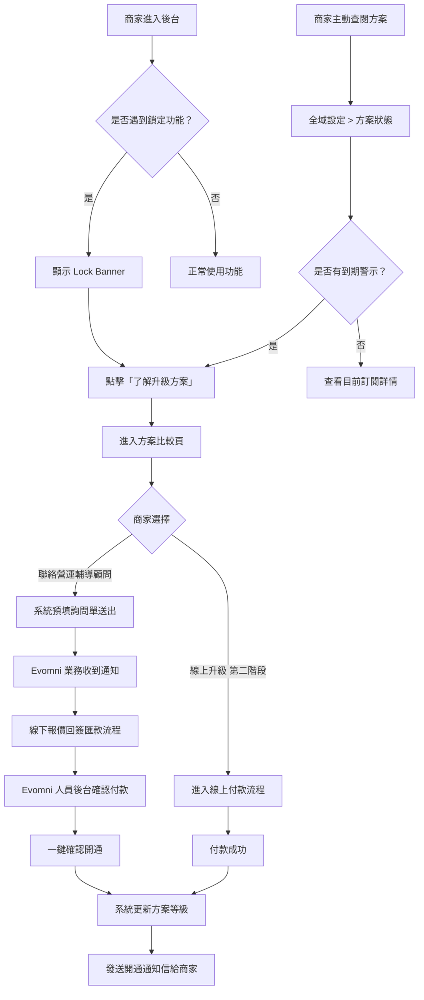
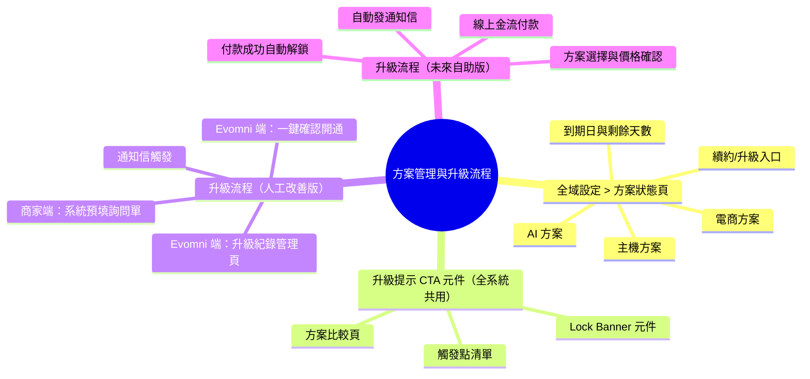
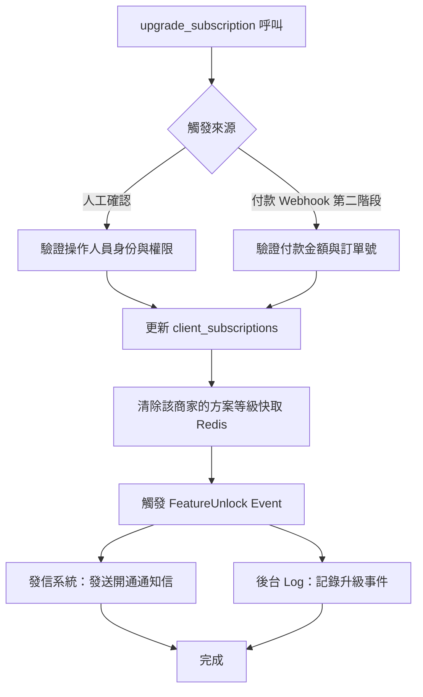
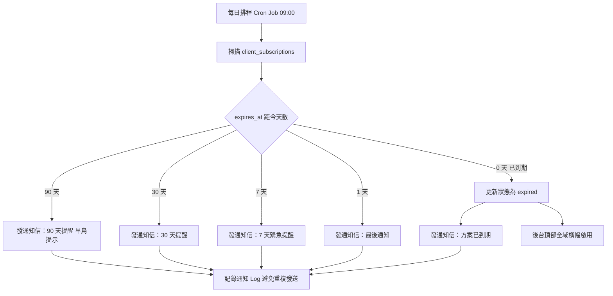

## 版本更新紀錄

| 版本 | 日期 | 修改內容 | 修改人 |
|------|------|----------|--------|
| v1.1 | 2026/05/03 | 補充 AI設定分層設計說明（方案狀態摘要 vs AI設定詳頁）；到期提醒新增 90 天；將所有「聯絡業務」改為「聯絡營運輔導顧問」；多網站場景架構說明 | Una |
| v1.0 | 2026/05/03 | 初稿建立：全域設定 > 方案狀態頁規格；全系統升級提示 CTA 機制；升級流程（人工改善版）；升級流程（未來自助版規劃） | Una |

# Evomni — 方案管理與升級流程 產品需求文件 (PRD)

## 1. 文件資訊

| 屬性 | 內容 |
|------|------|
| 需求來源 | PM 定義 — 全域設定補充、升級體驗改善 |
| 文件狀態 | v1.0 初稿 |
| 開發階段 | 電商啟航方案（階段一，目標 2026/8）：方案狀態頁 + 升級 CTA 機制 + 人工流程改善版；進階電商包（階段二，目標 2026/12）：自助升級付款流程 |
| 相關文件 | `Evomni_後台左側導覽架構規劃.md` / `Evomni_串接設定後台管理_PRD.md` / `Evomni_新電商系統_Master_PRD.md` |

> **📌 工程師實作說明：** 本文件以需求定義為主。文中所列技術規格（DB Schema、API 路由、資料結構等）為規劃建議，反映 PM 對系統的理解；工程師可依技術判斷調整實作方式。如有重大架構變更，請於 Git commit 說明原因，並同步更新本文件，保持版控一致。

---

## 2. 目標與功能總覽

### 2.1 核心願景與相依性

**核心問題：**
1. 商家進入鎖定功能時，只看到「聯絡營運輔導顧問」按鈕，不知道自己目前是哪個方案、差什麼功能、要怎麼升級
2. 升級流程全人工（報價單→回簽→匯款→查帳→手動開通），流程長、客戶體驗差、內部人力成本高
3. 全域設定沒有一個地方可以一眼看清楚自己目前的所有方案狀態（主機、AI、電商）

**解決方案：**
- 建立「全域設定 > 方案狀態」頁，彙整所有訂閱資訊於一處
- 建立全系統一致的升級提示 CTA 元件，點擊後進入引導式升級流程
- 第一階段：優化人工升級流程（系統產出預填報價單、線上確認、付款後 Evomni 內部人員一鍵開通）
- 第二階段（進階電商包開發期間規劃）：自助付款後系統自動解鎖功能

**系統相依性：**
- 會員認證模組（驗證商家身份與方案等級）
- 發信系統（報價確認信、付款提醒、開通通知）
- 全域設定現有模組（AI方案、系統版本等 CMS 原有項目）

### 2.2 功能總覽表

下表依使用情境順序排列：從「日常查閱方案」到「觸發升級需求」到「完成升級」。

| 主功能模組 | 子功能項目 | 功能目的 | 功能詳細描述 | 影響之使用者 |
|-----------|-----------|----------|-------------|-------------|
| 方案狀態頁 | 方案彙整顯示 | 讓商家一眼看清所有訂閱狀態 | 顯示主機方案、AI 方案、電商方案類型、各方案到期日、剩餘天數；到期前 30 天顯示警示 | 商家管理員 |
| 方案狀態頁 | 方案到期續約提示 | 主動提醒商家續約 | 到期前 90 天 / 30 天 / 7 天 / 1 天自動發通知信；頁面進度條顏色依剩餘天數動態變化 | 商家管理員 |
| 升級提示 CTA 元件 | 功能鎖定 Banner | 統一所有鎖定功能的升級入口 | 全系統使用同一套 Lock Banner 元件，顯示功能名稱、所屬方案、升級 CTA；取代現有各 PRD 散落的客服按鈕 | 商家管理員 |
| 升級提示 CTA 元件 | 升級引導頁 | 展示兩個方案差異，促進決策 | 點擊 Lock Banner 後進入方案比較頁，列出兩方案功能差異表；提供「聯絡營運輔導顧問詢問」與（第二階段）「線上升級」兩個 CTA | 商家管理員 |
| 升級流程（人工改善版） | 系統預填詢問單 | 降低業務報價前置工作 | 商家點擊「聯絡營運輔導顧問詢問」後，系統自動帶入站台資訊（商家名稱、目前方案、目標方案、聯絡人）送出詢問單 | 商家管理員、Evomni 業務 |
| 升級流程（人工改善版） | 內部開通操作 | 讓 Evomni 人員一鍵完成方案升級 | 後台提供「升級紀錄」管理頁；確認付款後點擊「確認開通」即更新商家方案等級並自動觸發通知信 | Evomni 內部人員（業務/PM） |
| 升級流程（未來自助版）| 線上付款升級 | 商家自助完成升級，無需人工介入 | 商家選擇目標方案 → 線上付款（串接金流） → 付款成功後系統自動更新方案等級並立即解鎖功能 | 商家管理員 |

---

## 3. 全局功能流程



---

## 4. 功能結構圖



---

## 5. 使用者故事

- 身為**商家管理員**，我想在全域設定中看到一個彙整所有方案的頁面，以便隨時確認主機容量、AI 方案、電商方案的類型與到期日，不需要聯絡營運輔導顧問才能知道自己的訂閱狀態。
- 身為**商家管理員**，我想在使用到鎖定功能時看到清楚的說明（這個功能屬於哪個方案），以便我可以快速判斷是否值得升級，而不是被一個「聯絡營運輔導顧問」按鈕擋住卻不知道下一步。
- 身為**商家管理員**，我想在送出升級詢問後不需要重複填寫公司資料，以便節省時間，讓業務可以快速回覆報價。
- 身為 **Evomni 業務人員**，我想在後台有一個升級紀錄頁，在確認收款後點一個按鈕就完成開通，以便取代目前需要手動修改 DB 的流程。
- 身為**商家管理員**（未來），我想在選定方案後直接線上付款並立即解鎖功能，以便在業務時間外也能完成升級。

---

## 6. UI/UX 與詳細功能需求

### 6.1 全域設定 > 方案狀態頁

**頁面路由：** `/global-settings/subscription`
**Breadcrumb：** 全域設定 > 方案狀態

#### A. 核心使用者流程

商家管理員 → 全域設定 → 方案狀態 → 查看所有訂閱資訊 → 點擊「了解升級方案」進入比較頁

#### B. 介面佈局與元件拆解

```
┌─ 方案狀態 ─────────────────────────────────────────────────────────┐
│                                                                    │
│  ┌─ 主機方案 ──────────────────┐  ┌─ AI 方案 ───────────────────┐  │
│  │  💻 企業主機方案             │  │  🤖 AI 進階版               │  │
│  │  到期日：2027/03/31          │  │  到期日：2027/03/31          │  │
│  │  剩餘 ███░░░░░ 334 天        │  │  剩餘 ███░░░░░ 334 天        │  │
│  │  [聯絡營運輔導顧問續約]              │  │  [聯絡營運輔導顧問續約]              │  │
│  └─────────────────────────────┘  └─────────────────────────────┘  │
│                                                                    │
│  ┌─ 電商方案 ───────────────────────────────────────────────────┐   │
│  │                                                              │   │
│  │  🛒 電商啟航方案                                             │   │
│  │  到期日：2027/03/31    剩餘 334 天                           │   │
│  │                                                              │   │
│  │  ──────────────────────────────────────────────────────     │   │
│  │  已包含功能                          進階電商包專屬功能 🔒    │   │
│  │  ✅ 產品管理（無上限）               🔒 自動化行銷旅程        │   │
│  │  ✅ 訂單管理                         🔒 進階會員分眾系統      │   │
│  │  ✅ 會員系統                         🔒 RFM 會員價值分群      │   │
│  │  ✅ 金物流串接                       🔒 購後產品自動推薦      │   │
│  │  ✅ 一頁式商店                       🔒 沉睡客自動喚醒        │   │
│  │  ✅ 基礎數據分析                     🔒 進階促銷活動成效分析   │   │
│  │  ✅ KOL 分潤管理                     🔒 倉儲物流串接          │   │
│  │  ✅ 產品廣告小幫手                                            │   │
│  │                                                              │   │
│  │                      [了解進階電商包並升級 →]                │   │
│  └──────────────────────────────────────────────────────────────┘   │
│                                                                    │
└────────────────────────────────────────────────────────────────────┘
```

**元件規格：**

| 元件 | 類型 | 規格 |
|------|------|------|
| 方案卡片（主機/AI） | `<el-card>` shadow="hover" | 固定高度 160px；兩欄 grid |
| 電商方案卡片 | `<el-card>` shadow="hover" | 橫向全寬；包含功能對比清單 |
| 剩餘天數進度條 | `<el-progress>` | 藍色 `#409EFF`；≤30 天轉為橘色 `#E6A23C`；≤7 天轉為紅色 `#F56C6C` |
| 已包含功能清單 | `<ul>` + `<el-icon>` CircleCheck | 文字 `#606266`，icon 顏色 `#67C23A` |
| 進階專屬功能清單 | `<ul>` + 🔒 icon | 文字 `#909399`（灰化），鎖頭 icon |
| 升級 CTA 按鈕 | `<el-button type="primary" class="!rounded-none"` | 文字：「了解進階電商包並升級 →」|
| 續約 CTA 按鈕 | `<el-button type="default" class="!rounded-none"` | 文字：「聯絡營運輔導顧問續約」；點擊後開啟預填詢問表單（同 §6.3） |

**到期警示邏輯：**

| 剩餘天數 | 頁面提示 | 額外通知 | 信件主旨參考 |
|---------|----------|---------|------------|
| ≤ 90 天 | 進度條維持藍色，右側方案卡片底部出現淺灰提示文字：「方案將於 {日期} 到期，建議提前規劃續約」| 系統自動發通知信（發信系統） | 「{方案名稱} 將於 90 天後到期，現在聯繫享有早鳥服務安排」 |
| ≤ 30 天 | 進度條轉橘 + `<el-alert type="warning">` 顯示「您的 {方案名稱} 將於 {日期} 到期，請盡早聯絡營運輔導顧問續約」| 系統自動發通知信（發信系統） | 「{方案名稱} 剩餘 30 天，請盡早聯絡營運輔導顧問」 |
| ≤ 7 天 | 進度條轉紅 + `<el-alert type="error">` | 再次發通知信 | 「{方案名稱} 即將到期（剩 N 天），請立即聯絡營運輔導顧問」 |
| ≤ 1 天 | 同上 + 後台頂部 `<el-notification>` 全域橫幅提示 | 最後通知信 | 「{方案名稱} 明日到期，請立即確認續約事宜」 |
| 已到期 | 全頁遮罩提示到期，僅保留「聯絡營運輔導顧問」一個操作 | 到期當日通知信 | 「{方案名稱} 已到期，請盡速聯絡營運輔導顧問以恢復服務」 |

#### C. 互動設計與系統反饋

- 頁面資料由後端 API `/api/v1/subscription/status` 返回；前端快取 1 小時，可手動點擊「重整」圖示刷新
- 「進階電商包專屬功能」清單中的每個項目，Hover 時顯示 Tooltip 說明該功能的核心價值（一句話，25 字以內）
- 若商家已是進階電商包，不顯示升級 CTA；電商方案卡片改為全部功能打勾，不顯示鎖定清單

#### E. AI 方案卡片與現有 AI設定頁的分層關係

> **架構決策：方案狀態頁顯示 AI 方案摘要，AI設定頁維持現有完整功能，兩頁互補不重複。**

| 頁面 | 呈現深度 | 包含內容 |
|------|---------|---------|
| **全域設定 > 方案狀態**（本 PRD） | 摘要層 | AI 方案名稱、到期日、Token 使用進度（百分比）、「查看 AI 使用詳情 →」連結 |
| **全域設定 > AI設定**（CMS 原有頁） | 詳細層 | 完整 Token 使用量、重置時間、AI 使用紀錄（提示詞 / 類型 / 狀態 / 花費 / 操作者）、更改方案、購買更多 Tokens |

**實作說明：** 方案狀態頁的 AI 方案卡片中，Token 進度條數值從現有 AI設定 API 取用（或共用同一支 API endpoint），不另開新表。「查看 AI 使用詳情 →」連結跳轉至 `/global-settings/ai`（現有 AI設定頁路由），不重新開發。

#### F. 多網站（CMS + 電商）場景說明

Evomni 採單帳號單後台架構，**形象站（CMS）與電商模組共用同一個後台**，不存在「兩個獨立後台」的情境。方案狀態頁展示的是「此帳號目前所有啟用的訂閱」：

| 帳號狀態 | 方案狀態頁顯示 |
|---------|--------------|
| 純 CMS（無電商） | 主機方案卡片 + AI 方案卡片；電商方案區塊不顯示（或顯示「尚未啟用電商方案」+ 了解電商方案 CTA） |
| CMS + 電商啟航方案 | 三卡片全顯示（主機 + AI + 電商啟航方案） |
| CMS + 進階電商包 | 三卡片全顯示；電商卡片不顯示鎖定清單、不顯示升級 CTA |

#### D. DB 規格

```sql
-- 商家方案訂閱表（若 CMS 尚未有類似結構，則新增）
CREATE TABLE client_subscriptions (
  id BIGINT UNSIGNED AUTO_INCREMENT PRIMARY KEY,
  client_id BIGINT UNSIGNED NOT NULL,          -- 對應商家帳號
  plan_type ENUM(
    'hosting_basic',
    'hosting_enterprise',
    'ai_basic',
    'ai_advanced',
    'ecommerce_starter',    -- 電商啟航方案
    'ecommerce_advanced'    -- 進階電商包
  ) NOT NULL,
  status ENUM('active', 'expired', 'cancelled') NOT NULL DEFAULT 'active',
  started_at DATE NOT NULL,
  expires_at DATE NOT NULL,
  renewed_at DATE NULL,
  activated_by VARCHAR(100) NULL,             -- Evomni 內部操作人員帳號
  notes TEXT NULL,
  created_at TIMESTAMP DEFAULT CURRENT_TIMESTAMP,
  updated_at TIMESTAMP DEFAULT CURRENT_TIMESTAMP ON UPDATE CURRENT_TIMESTAMP,
  INDEX idx_client_plan (client_id, plan_type, status)
);
```

---

### 6.2 升級提示 CTA 元件（全系統共用）

這是一個全系統統一使用的 Vue 元件 `<UpgradeLockBanner>`，取代目前各 PRD 各自定義的升級提示 Banner。所有方案鎖定功能統一引用此元件，確保視覺與行為一致。

#### A. 元件規格

**Props：**

| Prop | 類型 | 必填 | 說明 |
|------|------|------|------|
| `feature-name` | String | ✅ | 被鎖定的功能名稱，例如「自動化行銷旅程」|
| `required-plan` | String | ✅ | 解鎖所需方案，例如「進階電商包」|
| `show-preview` | Boolean | ❌ | 是否顯示功能預覽截圖（預設 false）|

**元件外觀：**

```
┌─────────────────────────────────────────────────────────────────┐
│  🔒  此功能為「進階電商包」專屬                                   │
│      升級後即可使用「自動化行銷旅程」，                           │
│      讓行銷工作自動化、用數據驅動再行銷。                         │
│                                                                 │
│      [了解進階電商包]                                            │
└─────────────────────────────────────────────────────────────────┘
```

- 容器：`<el-card>` 背景 `#f5f7fa`，左側 4px 實線邊框 `#409EFF`
- 標題：`#303133` 14px bold，🔒 icon
- 說明文字：`#606266` 13px，最多 2 行
- CTA 按鈕：`<el-button type="primary" class="!rounded-none">` 文字「了解進階電商包」
- 點擊 CTA 後導向：`/subscription/upgrade`（方案升級引導頁，§6.3）

**現有各 PRD 中應替換為此元件的位置清單：**

| 文件 | 原描述 | 替換方式 |
|------|--------|---------|
| `Evomni_Part5_數據分析_PRD.md` §5.4 | 「聯絡客服了解升級方案」按鈕 | 引用 `<UpgradeLockBanner>` |
| `Evomni_Part5_數據分析_PRD.md` 進階分析區塊 | 升級說明文字 | 引用 `<UpgradeLockBanner>` |
| `Evomni_串接設定後台管理_PRD.md` §8.5 | 升級 Banner 文字描述 | 引用 `<UpgradeLockBanner>` |
| `Evomni_後台左側導覽架構規劃.md` 等級設定 | 「進階電商包顯示，啟航方案鎖定」備註 | 引用 `<UpgradeLockBanner>` |
| `Evomni_Part2_產品中心_PRD.md` 0元產品 | 「需升級進階電商包」文字 | 引用 `<UpgradeLockBanner>` |

---

### 6.3 方案升級引導頁（方案比較頁）

**頁面路由：** `/subscription/upgrade`
**入口：** 全系統所有 `<UpgradeLockBanner>` 的 CTA 按鈕、全域設定 > 方案狀態頁的升級按鈕

#### A. 核心使用者流程

進入方案比較頁 → 查看兩方案功能差異 → 選擇「聯絡營運輔導顧問詢問」或（第二階段）「立即線上升級」

#### B. 介面佈局

```
┌─ 升級您的電商方案 ──────────────────────────────────────────────┐
│                                                               │
│  根據您的使用需求，選擇最適合的方案：                           │
│                                                               │
│  ┌─ 電商啟航方案 ──────────┐  ┌─ 進階電商包 ─────────────────┐ │
│  │  ✦ 您目前的方案          │  │  ✦ 推薦升級                  │ │
│  │  NT$29,800 / 年          │  │  NT$39,800 / 年              │ │
│  │  ─────────────────────  │  │  ─────────────────────────   │ │
│  │  ✅ 產品管理             │  │  ✅ 所有啟航方案功能          │ │
│  │  ✅ 訂單管理             │  │  ✅ 自動化行銷旅程            │ │
│  │  ✅ 會員系統             │  │  ✅ 進階會員分眾系統          │ │
│  │  ✅ 金物流串接           │  │  ✅ RFM 會員價值分群          │ │
│  │  ✅ 基礎數據分析         │  │  ✅ 倉儲物流串接              │ │
│  │  ✅ KOL 分潤管理         │  │  ✅ 購後產品自動推薦          │ │
│  │  ✅ 廣告小幫手           │  │  ✅ 進階促銷活動分析          │ │
│  │                          │  │  ✅ 沉睡客自動喚醒            │ │
│  │                          │  │  ✅ 站內搜尋關鍵字分析        │ │
│  │                          │  │                              │ │
│  │  [目前方案（不可選）]    │  │  [聯絡營運輔導顧問詢問升級]          │ │
│  │                          │  │  [立即線上升級] ← 第二階段   │ │
│  └──────────────────────────┘  └──────────────────────────────┘ │
│                                                               │
│  ❓ 不確定哪個方案適合您？[預約 15 分鐘通話諮詢]              │
└───────────────────────────────────────────────────────────────┘
```

**元件規格：**
- 「您目前的方案」卡片：`<el-tag type="info">` 標籤 + 按鈕設為 disabled
- 推薦升級卡片：金色邊框 `#E6A23C` + `<el-tag type="warning">「推薦升級」`
- `[聯絡營運輔導顧問詢問升級]`：`<el-button type="primary" class="!rounded-none">`，點擊後開啟詢問表單 Dialog（§6.4）
- `[立即線上升級]`（第二階段）：`<el-button type="success" class="!rounded-none">`，第一階段以「即將推出」灰色顯示

---

### 6.4 升級詢問表單（人工改善版）

**觸發方式：** 點擊方案比較頁的「聯絡營運輔導顧問詢問升級」按鈕，彈出 `<el-dialog>`

#### A. 表單內容

```
┌─ 升級詢問 ─────────────────────────────────────────────────────┐
│                                                               │
│  我們已幫您預填以下資訊，確認後送出即可：                       │
│                                                               │
│  商家名稱：  [{自動帶入商家名稱}____________] （唯讀）          │
│  目前方案：  [電商啟航方案] （唯讀）                            │
│  目標方案：  [進階電商包 ✓] （唯讀）                           │
│  聯絡人：    [{自動帶入帳號姓名}___________]  ✏️ 可修改         │
│  聯絡電話：  [________________________]       ✏️ 請填寫        │
│  方便聯絡時段：[任何時間 ▼]                                    │
│               選項：早上 9-12 / 下午 1-5 / 任何時間           │
│  備註：      [如有特殊需求請說明____________]                   │
│                                                               │
│  ✅ 我確認以上資訊正確                                         │
│                        [取消]    [送出詢問]                   │
└───────────────────────────────────────────────────────────────┘
```

**驗證規則：**

| 欄位 | 驗證 | 錯誤訊息 |
|------|------|---------|
| 聯絡人 | 必填，1-50 字 | 「請輸入聯絡人姓名」|
| 聯絡電話 | 必填，台灣手機格式 `09xxxxxxxx` 或市話格式 | 「請輸入有效的聯絡電話」|
| 確認 Checkbox | 必勾 | 「請確認資訊正確後勾選」|

**送出後行為：**
- 成功：Dialog 關閉，顯示全頁 `<el-result>` 成功畫面：「詢問已送出 ✅ 我們的業務將在 1 個工作天內與您聯繫」；同時透過發信系統寄出「詢問確認信」給商家
- 系統後台寫入詢問紀錄至 `upgrade_requests` 表（§6.6），並通知 Evomni 業務人員
- 失敗：顯示 `<el-message type="error">` 「送出失敗，請稍後再試或直接聯絡客服 service@evomni.com」

---

### 6.5 Evomni 內部後台 — 升級紀錄管理頁

> 此頁面為 Evomni **內部後台**（非商家後台），僅供業務、PM、技術支援人員使用。路由位於內部管理系統，與商家後台分離。

#### A. 功能說明

此頁面讓 Evomni 人員在完成線下收款確認後，一鍵完成方案開通，取代目前直接修改資料庫的手動作業。

#### B. 升級紀錄列表頁

```
┌─ 方案升級紀錄 ───────────────────────────────────────────────────────────────┐
│  篩選：[全部狀態 ▼]  [搜尋商家名稱______________]  [搜尋]                    │
│                                                                              │
│  商家名稱     目前方案     目標方案     詢問時間          狀態      操作      │
│  ─────────────────────────────────────────────────────────────────────────  │
│  OO有限公司  電商啟航方案  進階電商包  2026/05/03 10:20  待處理🟡  [處理]    │
│  XX品牌館    電商啟航方案  進階電商包  2026/05/01 14:38  已開通✅  [查看]    │
│  YY工作室    電商啟航方案  進階電商包  2026/04/28 09:15  已取消❌  [查看]    │
└──────────────────────────────────────────────────────────────────────────────┘
```

#### C. 確認開通操作 Dialog

點擊「處理」後開啟 Dialog：

```
┌─ 確認方案開通 ────────────────────────────────────────────────┐
│                                                              │
│  商家：  OO有限公司                                          │
│  升級：  電商啟航方案 → 進階電商包                            │
│  新到期日：[2027/05/03___]  📅                               │
│  付款確認說明：[請輸入收款備注，例如：匯款後五碼 xxxxx___]    │
│                                                              │
│  ⚠️ 確認後將立即解鎖商家的進階電商包功能，並自動寄出開通通知  │
│                                                              │
│                [取消]    [確認開通]                          │
└──────────────────────────────────────────────────────────────┘
```

- 點擊「確認開通」後：
  1. 更新 `client_subscriptions` 表，將方案升級為 `ecommerce_advanced`
  2. 更新到期日
  3. 記錄操作人員帳號與時間戳
  4. 透過發信系統寄出「方案升級成功通知信」給商家
  5. `upgrade_requests` 狀態更新為 `completed`
- 成功後顯示 Toast：「✅ 已成功開通 OO有限公司 的進階電商包」

---

### 6.6 升級流程（未來自助版）規格說明

> **⚠️ 此章節為第二階段（進階電商包開發期，目標 2026/12）功能規劃。第一階段不實作，但預留資料結構與 UI 進入點。**

**流程：** 商家在方案比較頁點擊「立即線上升級」→ 確認訂單明細 → 選擇付款方式（串接 Evomni 主系統的商務金流，與電商金流分離）→ 付款成功 → 系統自動執行方案升級邏輯 → 立即解鎖功能 → 自動寄出通知信。

**關鍵設計原則：**
- 付款金流使用 Evomni **平台層級**的金流（非商家自行設定的電商金流），避免混用
- 自動升級邏輯與人工確認升級邏輯共用同一個底層 `upgrade_subscription()` 服務函式，差異只在觸發方式（人工 vs 付款 Webhook）
- 付款失敗必須有完整的重試流程（3 次重試、失敗後保留草稿訂單 24 小時）

---

## 7. 細部邏輯流程圖

### 7.1 方案升級觸發後的系統判斷流程



### 7.2 到期前通知排程邏輯



---

## 8. 非功能性需求

- **效能：** 方案狀態頁 API `/api/v1/subscription/status` 回應時間 ≤ 200ms（Redis 快取，TTL 1 小時）
- **安全性：** `upgrade_subscription()` 服務函式需做操作日誌，任何方案升級/降級事件都必須有時間戳與操作人員記錄；防止重複執行（冪等性保護）
- **資料一致性：** 方案等級快取（Redis）在升級完成後立即清除，確保商家後台即時反映新方案；後端 API 中 plan 等級判斷以 DB 為準，不以 JWT token 為準（避免 Token 過期前仍可存取舊功能）
- **通知可靠性：** 所有升級通知信透過發信系統佇列寄送，失敗時有重試機制（最多 3 次），並記錄發送 Log

---

## DB 補充

```sql
-- 升級詢問紀錄表
CREATE TABLE upgrade_requests (
  id BIGINT UNSIGNED AUTO_INCREMENT PRIMARY KEY,
  client_id BIGINT UNSIGNED NOT NULL,
  current_plan ENUM('ecommerce_starter', 'ecommerce_advanced') NOT NULL,
  target_plan ENUM('ecommerce_starter', 'ecommerce_advanced') NOT NULL,
  contact_name VARCHAR(100) NOT NULL,
  contact_phone VARCHAR(20) NOT NULL,
  preferred_contact_time VARCHAR(50) NULL,
  notes TEXT NULL,
  status ENUM('pending', 'in_progress', 'completed', 'cancelled') NOT NULL DEFAULT 'pending',
  handled_by VARCHAR(100) NULL,       -- Evomni 處理人員帳號
  handled_at TIMESTAMP NULL,
  payment_note VARCHAR(255) NULL,     -- 人工確認收款備注
  created_at TIMESTAMP DEFAULT CURRENT_TIMESTAMP,
  updated_at TIMESTAMP DEFAULT CURRENT_TIMESTAMP ON UPDATE CURRENT_TIMESTAMP,
  INDEX idx_client_status (client_id, status)
);
```

---

## 與團隊溝通摘要

- 這次的規格是關於**方案管理與升級流程**，解決兩個問題：(1) 商家在全域設定沒有地方看到自己目前的所有方案資訊；(2) 升級流程全人工，體驗差且耗人力
- **工程師需要注意：**
  1. 新增一個全域共用 Vue 元件 `<UpgradeLockBanner>`，取代現有各 PRD 各自寫的升級提示文字，統一 props 接口後，各功能頁面引用即可
  2. `upgrade_subscription()` 服務函式需設計成**人工觸發**和**自動觸發（第二階段）**都能呼叫的共用邏輯，差異只在觸發來源，不要各自寫一套
  3. 方案等級判斷必須以 DB（Redis 快取）為準，不可用 JWT token，升級後快取要立即清除
  4. `client_subscriptions` 表若 CMS 端已有類似結構，請評估是否合併，避免雙重維護
  5. 到期前通知的 Cron Job 需要防重複發送的 Log 機制（同一個方案同一個門檻點只發一次）
- **設計師需要注意：**
  1. `<UpgradeLockBanner>` 元件需要有統一設計稿，全系統使用同一視覺
  2. 方案狀態頁的剩餘天數進度條三段顏色（正常/警告/危險）需在設計稿中明確標示
  3. 升級詢問表單 Dialog 的「唯讀欄位」視覺要與「可修改欄位」有明顯區別（例如：唯讀用灰底）
  4. 方案比較頁中「目前方案」卡片的 disabled 樣式需讓商家一眼認出「這是我現在的狀態」
- **架構補充（工程師）：** Evomni 是單帳號單後台，CMS 與電商模組共用同一後台；方案狀態頁根據帳號已啟用的模組動態渲染卡片（純 CMS 不顯示電商方案卡、已是進階電商包不顯示升級 CTA）
- **AI設定不廢除（工程師）：** 方案狀態頁 AI 卡片為摘要層，Token 進度數值從 AI設定現有 API 取用；「查看 AI 使用詳情 →」連結跳轉至 `/global-settings/ai`，不重新開發
- **到期通知 Cron Job 共 5 個觸發點（工程師）：** 90天 / 30天 / 7天 / 1天 / 0天（已到期），每個觸發點用 Log 防重複發送；90天通知屬於早鳥提醒，語氣輕，不影響正常操作體驗
- 第二階段（自助線上升級）目前只保留 UI 入口（灰色「即將推出」按鈕）和資料表結構，實際付款流程在進階電商包開發期再補充
- ⚠️ **本次修改（v1.1）已連動更新 Master PRD §6 子文件索引及 §8 版本紀錄**
- ⚠️ 本文件已納入 Git 版控。技術規格（DB Schema、API 設計）為需求導向的建議，工程師可依技術判斷調整實作，重大變更請回寫文件。
