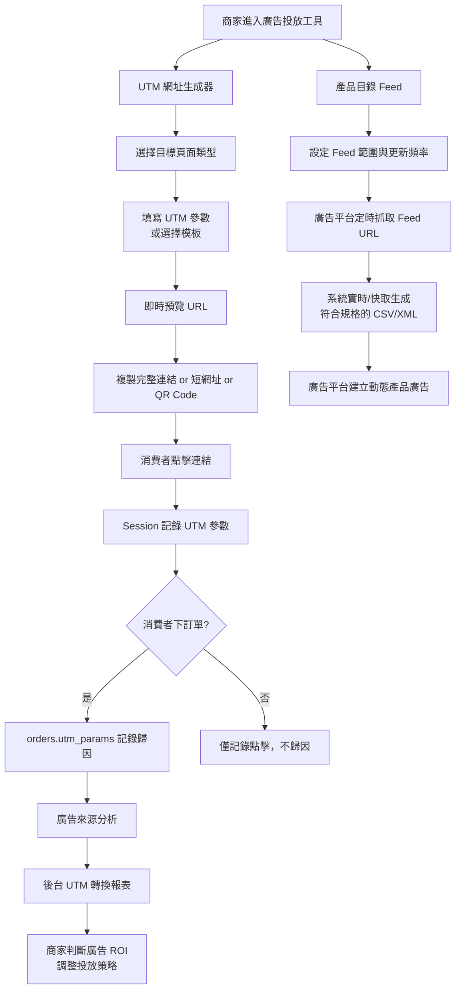
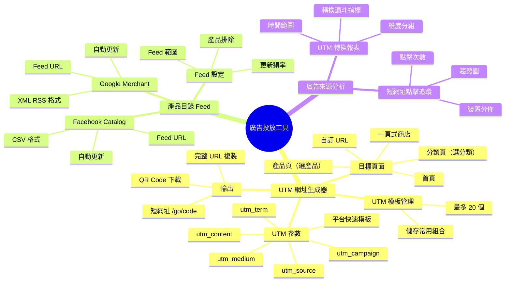
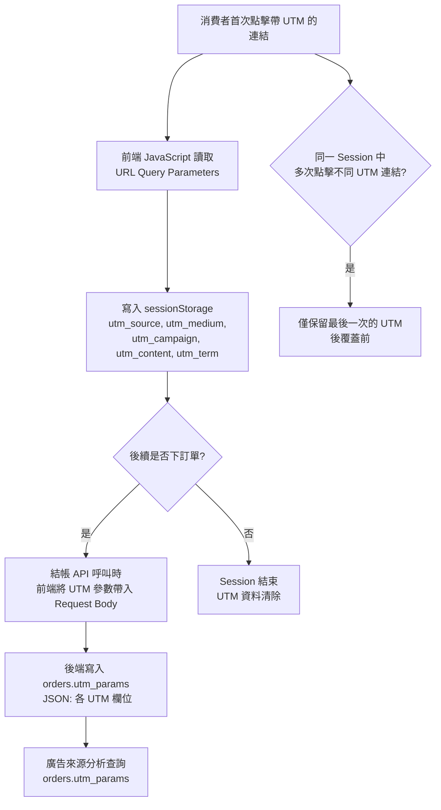
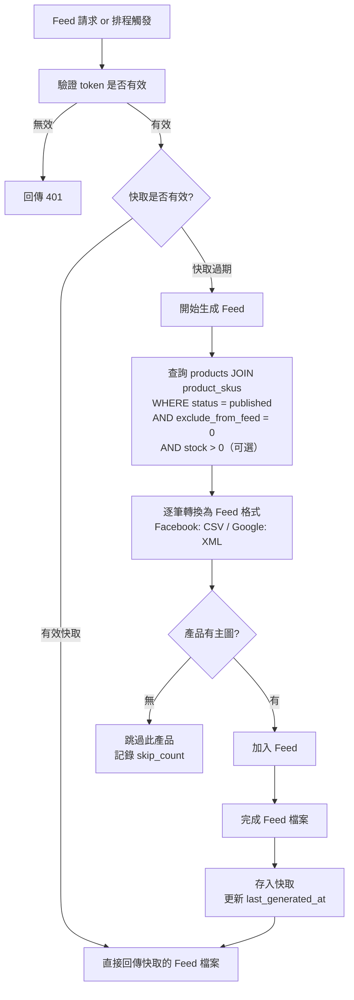

## 版本更新紀錄

| 版本 | 日期 | 修改內容 | 修改人 |
|------|------|----------|--------|
| v2.0 | 2026/05/03 | 移除廣告追蹤碼管理模組（與行銷管理 > 行銷工具設定重複）；更名為廣告投放工具；功能定位更新為三大工具；補充 info banner 與廣告來源分析定位說明；DB Schema 移除重複欄位 | Una |
| v1.0 | 2026/04/28 | 初稿建立 | 廖紫茵 |

# Evomni - 廣告投放工具 產品需求文件 (PRD)

## 1. 文件資訊

| 屬性 | 內容 |
| --- | --- |
| 版本 | v2.0 |
| 日期 | 2026/04/28 |
| 需求來源 | Evomni 新電商系統 Master PRD v1.2（§3.2 系統第三方整合 P1 待補：廣告投放工具）|
| 文件狀態 | **v2.0** — 移除廣告追蹤碼管理（已由行銷管理 > 行銷工具設定涵蓋）；功能聚焦三大工具：UTM 網址生成器 / 產品目錄 Feed / 廣告來源分析 |
| 作者 | 廖紫茵（Claude 依授權產出）|
| 開發時程 | 階段一 5–8月（電商啟航方案）/ 階段二 9–12月（進階電商包）|

---

## 2. 目標與功能總覽

### 2.1 核心願景與相依性

**核心問題：** 台灣中小型電商商家最大的痛點之一是「廣告預算花出去，卻不知道哪個廣告帶來的訂單」。在廣告後台建立動態產品廣告（DPA）需要上傳產品目錄，對非技術商家也是高門檻。

**功能定位：** 廣告追蹤碼（Facebook Pixel / GA4 / LINE Tag）由「**行銷管理 > 行銷工具設定**」統一管理，本功能定位為追蹤碼設定完成後的廣告操作層：幫商家生成帶追蹤參數的產品連結、自動維護產品目錄 Feed、並在系統內以訂單維度呈現各廣告來源的實際轉換成效。

**解決方案：** 後台提供三大工具：
1. **UTM 網址生成器**：選擇目標頁面 + 設定 UTM 參數，一鍵產生帶追蹤標籤的產品連結（含短網址、QR Code）
2. **產品目錄 Feed**：自動生成符合 Facebook Catalog 和 Google Merchant Center 規格的產品 Feed，商家只需複製 Feed URL 貼到廣告平台
3. **廣告來源分析**：後台呈現各廣告來源（UTM 維度）的轉換漏斗數據，讓商家知道哪個廣告 ROI 最高

**Evomni 價值對應：** 兩方案均標配，是商家購買電商系統的重要理由——「買就附贈廣告工具」，降低商家對獨立追蹤工具的依賴，增加系統黏著度。

**系統相依性：**
- `行銷管理 > 行銷工具設定`：廣告追蹤碼設定入口（FB Pixel / GA4 / GTM）；追蹤碼 ID 存於 `integration_settings` 表，本功能不重複儲存
- `Part 2 產品中心`：產品目錄 Feed 從 `products` 和 `product_skus` 表讀取產品資料、圖片、價格、庫存
- `Part 3 訂單管理`：UTM 追蹤資料在訂單建立時寫入 `orders.utm_params`（JSON），用於廣告歸因
- `Part 5 數據中心`：廣告來源分析報表整合至數據中心，依訂單的 UTM 資料彙整
- `媒體庫`：產品目錄 Feed 中的圖片 URL 指向 媒體庫 的 CDN 網址（WebP 格式）

---

### 2.2 功能總覽表

> 廣告投放工具聚焦廣告操作層：生成帶追蹤標籤的產品連結、自動維護產品目錄 Feed、並以訂單維度呈現廣告來源轉換成效。廣告追蹤碼設定請至「行銷管理 > 行銷工具設定」。

| 主功能模組 | 子功能項目 | 功能目的 | 功能詳細描述 | 影響之使用者 |
| --- | --- | --- | --- | --- |
| UTM 網址生成器 | 目標頁面選擇 | 選擇要追蹤的目標頁面 | 支援目標頁面類型：產品頁（選擇特定產品）/ 產品分類頁（選擇特定分類）/ 店鋪首頁 / 一頁式商店（若開通）/ 自訂 URL（輸入任意路徑）| 商家管理員 |
| UTM 網址生成器 | UTM 參數設定 | 設定廣告追蹤標籤 | 提供 utm_source / utm_medium / utm_campaign / utm_content / utm_term 五個欄位；提供常用平台快速填入模板（Facebook / Google Ads / LINE Ads / EDM / LINE OA）；即時預覽生成的完整 URL | 商家管理員 |
| UTM 網址生成器 | 網址操作功能 | 快速取用生成的追蹤網址 | 「複製完整連結」Button；「複製短網址」Button（使用系統內建短網址服務，格式 `{store_domain}/go/{code}`）；「下載 QR Code」Button（PNG 格式，含短網址）| 商家管理員 |
| UTM 網址生成器 | UTM 模板管理 | 儲存常用 UTM 組合供重複使用 | 可將常用的 UTM 參數組合儲存為模板（命名後存入）；下次使用可直接選擇模板快速填入；最多儲存 20 個模板 | 商家管理員 |
| 產品目錄 Feed | Facebook Catalog Feed | 提供 Facebook 動態產品廣告所需的產品目錄 | 系統自動生成符合 Facebook Product Catalog 規格的 CSV Feed；Feed URL 格式：`{store_domain}/feeds/facebook-catalog.csv`；包含欄位：id, title, description, availability, condition, price, sale_price, image_link, link, brand, product_type, google_product_category | 商家管理員 |
| 產品目錄 Feed | Google Merchant Center Feed | 提供 Google 購物廣告所需的產品目錄 | 系統自動生成符合 Google Merchant Center 規格的 XML Feed（RSS 2.0 格式）；Feed URL：`{store_domain}/feeds/google-merchant.xml`；包含欄位：g:id, g:title, g:description, g:link, g:image_link, g:availability, g:price, g:sale_price, g:condition, g:brand, g:product_type | 商家管理員 |
| 產品目錄 Feed | Feed 更新設定 | 控制產品目錄 Feed 的更新頻率 | 設定 Feed 快取更新間隔：即時（每次請求重新生成）/ 每小時 / 每天；Feed 範圍：全部上架產品 / 指定分類；可排除特定產品（勾選「排除此產品於廣告目錄」）| 商家管理員 |
| 廣告來源分析 | UTM 來源轉換報表 | 分析各廣告來源的實際轉換成效 | 依 utm_source / utm_medium / utm_campaign 維度分組，統計：點擊數（Session 數）、加購次數、結帳次數、訂單數、轉換率（訂單數/點擊數）、GMV；時間範圍：近7天 / 近30天 / 自訂 | 商家管理員 |
| 廣告來源分析 | 短網址點擊追蹤 | 追蹤每個短網址的點擊成效 | 每個短網址記錄點擊時間、來源 IP、裝置類型（桌機/手機）；後台可查看各短網址的點擊次數趨勢；短網址可停用（停用後 302 指向 404 頁）| 商家管理員 |

---

## 3. 全局功能流程



**流程說明：**

廣告投放工具以「商家 → 廣告平台 → 消費者 → 回到系統」的閉環設計。UTM 網址是廣告投放的識別標籤，讓系統知道流量來自哪個廣告活動；產品 Feed 是動態廣告的素材來源，系統代替商家維護最新的產品資訊；分析報表讓整個循環閉合，商家可以根據訂單維度的數據調整廣告策略。廣告追蹤碼（Pixel/GA4/GTM）已由「行銷管理 > 行銷工具設定」統一管理，本工具不重複處理。

---

## 4. 功能結構圖



---

## 5. 使用者故事

**作為商家管理員，** 我想要為「2026 春夏新品」系列快速生成帶 UTM 標籤的產品頁連結，以便於投放 LINE Ads 時能追蹤這次廣告帶來了多少訂單，並和上次的 Facebook 廣告效果比較。

**作為商家管理員，** 我想要在後台複製一個產品目錄 Feed URL 並貼到 Facebook Business Manager，讓系統自動保持產品目錄最新，以便於執行動態產品廣告（DPA），不需要每次手動更新產品資料。

**作為商家管理員，** 我想要在「廣告來源分析」報表看到每個廣告活動帶來了幾個訂單和多少 GMV，以便於評估哪個廣告活動 ROI 最好，並決定是否要加碼投放。

**作為商家管理員，** 我想要為產品生成 QR Code（含追蹤參數），以便於在實體展覽或傳單上印製 QR Code，追蹤線下引流到線上商店的轉換效果。

---

## 6. UI/UX 與詳細功能需求

### 6.1 UTM 網址生成器

> ℹ️ **廣告追蹤碼設定請前往「行銷管理 > 行銷工具設定」**
> Facebook Pixel / GA4 / LINE Tag 的追蹤碼 ID 設定、事件注入管理，均在「行銷管理 > 行銷工具設定」頁面完成，請勿在本頁面重複設定。

#### A. 核心使用者流程

點擊「UTM 網址生成器」Tab → 選擇目標頁面類型 → 選擇具體頁面（產品/分類）→ 填寫 UTM 參數（或選擇已儲存的模板）→ 即時預覽生成的 URL → 複製連結/短網址/QR Code。

#### B. 介面佈局與元件拆解（Figma Ready）

**頁面佈局（左右分欄）：**

```
┌──────────────────────────────────────┬────────────────────────────────────┐
│  目標頁面                              │  預覽與輸出                          │
│                                      │                                    │
│  頁面類型：[下拉選單]                   │  生成的完整連結：                      │
│                                      │  ┌────────────────────────────────┐ │
│  （依類型顯示第二層選擇）               │  │ https://yourstore.com/products/ │ │
│  產品：[搜尋選擇產品]                   │  │ winter-jacket?utm_source=line&  │ │
│  分類：[選擇分類]                       │  │ utm_medium=paid&utm_campaign=   │ │
│                                      │  │ 2026winter                     │ │
│  ───── UTM 參數 ─────                 │  └────────────────────────────────┘ │
│                                      │  [複製完整連結]                       │
│  來源（utm_source）*                  │                                    │
│  [line              ▼] [自訂]        │  短網址：                             │
│                                      │  https://yourstore.com/go/Xk3mP9   │
│  媒介（utm_medium）*                  │  [複製短網址]                          │
│  [paid              ▼] [自訂]        │                                    │
│                                      │  QR Code：                          │
│  廣告活動（utm_campaign）*            │  [QR Code 圖示]                       │
│  [2026winter____________]            │  [下載 QR Code（PNG）]                 │
│                                      │                                    │
│  廣告內容（utm_content）             │  點擊統計（短網址）：                    │
│  [_____________________]            │  今日 0 次 / 本月 0 次                  │
│                                      │                                    │
│  關鍵字（utm_term）                   │                                    │
│  [_____________________]            │                                    │
│                                      │                                    │
│  ───── 快速模板 ─────                 │                                    │
│  [Facebook 廣告] [LINE Ads]          │                                    │
│  [Google Ads] [EDM] [LINE OA]        │                                    │
│                                      │                                    │
│  [儲存為模板]                          │                                    │
└──────────────────────────────────────┴────────────────────────────────────┘
```

**目標頁面類型下拉選單選項：**

| 選項 | 說明 | 第二層輸入 |
| --- | --- | --- |
| 特定產品頁 | 連結到某個產品的詳情頁 | `<el-select>` 搜尋選擇產品（即時搜尋產品名稱）|
| 產品分類頁 | 連結到某個分類的產品列表 | `<el-tree-select>` 選擇分類 |
| 商店首頁 | 連結到商店的首頁 | 無 |
| 一頁式商店 | 連結到特定的一頁式商店 | `<el-select>` 選擇已建立的一頁式商店（若未開通此功能則不顯示此選項）|
| 自訂 URL | 手動輸入相對路徑 | `<el-input>` Placeholder：「輸入路徑，如 /products 或 /sale」|

**UTM 參數欄位元件：**

| 欄位 | 元件類型 | Required | 選項 / Placeholder |
| --- | --- | --- | --- |
| utm_source（來源）| `<el-autocomplete>` | ✅ | 預設建議選項：facebook, google, line, instagram, email, sms, qrcode；可自由輸入 |
| utm_medium（媒介）| `<el-autocomplete>` | ✅ | 預設建議選項：paid, cpc, cpm, organic, social, email, sms, banner；可自由輸入 |
| utm_campaign（活動）| `<el-input>` | ✅ | Placeholder：「廣告活動名稱，如 2026winter」；建議使用英文 + 數字，避免中文 URL Encode 問題；字元提示 |
| utm_content（廣告內容）| `<el-input>` | ❌ | Placeholder：「選填，用於區分同一活動中的不同廣告素材」|
| utm_term（關鍵字）| `<el-input>` | ❌ | Placeholder：「選填，通常用於關鍵字廣告（SEM）的關鍵字」|

**快速模板 Button 規格（點擊後自動填入對應值）：**

| 模板名稱 | 自動填入 utm_source | 自動填入 utm_medium |
| --- | --- | --- |
| Facebook 廣告 | facebook | paid |
| LINE Ads | line | paid |
| Google Ads | google | cpc |
| EDM（電子報）| email | email |
| LINE OA 推播 | line | social |

**輸出區塊元件：**

| 元件 | 規格 |
| --- | --- |
| 完整 URL 顯示 | `<el-input type="textarea" readonly>` 自動高度；URL 超過一行自動換行顯示 |
| 「複製完整連結」Button | 次要 Button；點擊後 Clipboard API 複製；Toast「連結已複製」|
| 短網址 | 格式 `{store_domain}/go/{6碼英數}` 系統自動生成；第一次生成後儲存於 `short_urls` 表；相同 UTM URL 再次生成時返回同一短網址 |
| 「複製短網址」Button | 次要 Button；複製後 Toast「短網址已複製」|
| QR Code 即時預覽 | 使用前端 qrcode 套件即時生成（短網址 QR Code，128×128px）；白底黑色 |
| 「下載 QR Code（PNG）」Button | 次要 Button；下載 300×300px 高解析度版本；檔名 `qrcode_{utm_campaign}_{日期}.png` |
| 短網址點擊統計 | 顯示：今日點擊 / 本月點擊（只有短網址有點擊統計，完整 URL 無法追蹤）|

**儲存為模板 Dialog：**
```
模板名稱：[___________________]
Placeholder：如「LINE Ads 冬季活動」

目前參數：
  來源：line
  媒介：paid
  活動：2026winter

[取消]  [儲存模板]
```

#### C. 互動設計、狀態與系統反饋

- utm_source 和 utm_medium 為必填，未填時「複製完整連結」和「複製短網址」Button Disabled，並在欄位旁顯示 `*` 提示
- URL 即時預覽：任何 UTM 欄位輸入後即時更新預覽區塊（debounce 200ms）
- 短網址生成：第一次點擊「複製短網址」時若還未生成，Button 進入 Loading 狀態（`API POST /api/v1/short-urls`），生成後顯示短網址 + Toast

#### D. 防呆機制與錯誤預防

- UTM 值中包含空格時，自動以 `+` 或 `_` 替換（如「2026 winter」→「2026_winter」），並 Tooltip 提示：「空格已自動替換為底線，以確保 URL 格式正確」
- utm_campaign 若包含中文，顯示 Warning（非阻擋）：「廣告活動名稱建議使用英文，避免中文在部分廣告平台無法正確讀取」

---

### 6.2 產品目錄 Feed 設定頁

#### A. 核心使用者流程

點擊「產品目錄 Feed」Tab → 看到 Facebook Catalog 和 Google Merchant 兩個 Feed 設定區塊 → 設定 Feed 範圍與更新頻率 → 複製 Feed URL → 貼到廣告平台。

#### B. 介面佈局與元件拆解（Figma Ready）

**Facebook Catalog Feed 卡片：**

```
┌─────────────────────────────────────────────────────────────────────┐
│  🔵 Facebook 產品目錄 Feed                                           │
│                                                                     │
│  Feed URL（複製此連結到 Facebook Business Manager）：                  │
│  [https://yourstore.com/feeds/facebook-catalog.csv?token=XXXX]      │
│  [複製連結]                                                           │
│                                                                     │
│  ─── Feed 範圍 ─────────────────────────────────────────────────    │
│  ○ 全部上架產品（共 {N} 件）                                          │
│  ○ 指定分類：[選擇分類（可多選）]                                       │
│                                                                     │
│  ─── 更新頻率 ────────────────────────────────────────────────      │
│  ○ 即時生成（每次廣告平台抓取時重新生成）                               │
│  ● 每小時更新（推薦）                                                 │
│  ○ 每天更新（每日 00:10 台灣時間）                                     │
│                                                                     │
│  上次更新：2026/04/28 12:00 | 產品數量：245 件                         │
│                                                                     │
│  [立即重新生成 Feed]  [下載 CSV 預覽]                                   │
│                                                                     │
│  ℹ️ 如何在 Facebook Business Manager 設定產品目錄 [查看說明 ↗]        │
└─────────────────────────────────────────────────────────────────────┘
```

**Google Merchant Center Feed 卡片（同結構）：**

```
┌─────────────────────────────────────────────────────────────────────┐
│  🟢 Google Merchant Center Feed                                      │
│                                                                     │
│  Feed URL（複製此連結到 Google Merchant Center）：                     │
│  [https://yourstore.com/feeds/google-merchant.xml?token=XXXX]       │
│  [複製連結]                                                           │
│  ... （同上結構）                                                     │
│                                                                     │
│  ℹ️ 如何在 Google Merchant Center 設定產品 Feed [查看說明 ↗]          │
└─────────────────────────────────────────────────────────────────────┘
```

**Feed 元件詳細規格：**

| 元件 | 規格 |
| --- | --- |
| Feed URL 顯示框 | `<el-input readonly>` 帶 lock icon 表示唯讀；URL 含一次性 `token` Query Parameter 防止未授權抓取 |
| 「複製連結」Button | 次要操作；Clipboard API；Toast「Feed URL 已複製」|
| Feed 範圍 | `<el-radio-group>`；選「指定分類」時出現 `<el-tree-select multiple>` 選擇分類 |
| 更新頻率 | `<el-radio-group>` 三選一 |
| 上次更新時間 | 灰色小字（`#909399`）；若 Feed 從未生成則顯示「尚未生成，請點擊立即重新生成」|
| 「立即重新生成 Feed」Button | 次要 Button；點擊後 Loading 動畫（後端開始重新生成）；完成後 Toast「Feed 已重新生成，共 {N} 件產品」|
| 「下載 CSV / XML 預覽」Button | 次要 Button；下載最新 Feed 檔案（前 100 筆，完整 Feed 僅供廣告平台抓取）|

**產品排除設定（在各產品的編輯頁提供）：**

在產品建立/編輯頁的「進階設定」區塊新增：
- `<el-checkbox>` 標籤：「排除此產品於廣告目錄 Feed（Facebook / Google）」
- Tooltip：「勾選後，此產品不會出現在廣告產品目錄中。適用於測試產品、內部使用產品等不希望出現在廣告中的產品。」
- 儲存後在 `products.exclude_from_feed` 欄位標記

#### C. 互動設計、狀態與系統反饋

- Feed 生成是後端 Queue Job；若產品數量 > 1000，「立即重新生成 Feed」後顯示：「Feed 正在後台生成中，大量產品可能需要 1-2 分鐘，完成後會自動更新上方狀態」
- Feed URL 的 `token` 值在後台可以「重新生成 Token」（Button），重新生成後舊 URL 立即失效，需重新貼到廣告平台

#### D. 防呆機制與錯誤預防

- Feed URL 含 token 但若有人嘗試不帶 token 訪問：回傳 `401 Unauthorized`
- 產品圖片若為空（無主圖）：該產品在 Feed 中自動跳過，並在「立即重新生成」後顯示：「有 {N} 件產品因無主圖而被排除於 Feed 外，[查看產品]」

---

### 6.3 廣告來源分析報表

> **📊 定位說明：** 本報表以系統訂單為數據基礎，呈現各 UTM 來源帶來的實際訂單數與 GMV。數字與訂單管理模組完全一致，定位為 GA4 的補充而非取代——GA4 追蹤的是使用者行為事件，本報表追蹤的是已成立訂單的廣告歸因，兩者維度不同。商家可同時使用兩者：GA4 看流量行為，本報表看實際成交。

#### A. 核心使用者流程

點擊「廣告來源分析」Tab → 選擇時間範圍 → 看到以 UTM 維度分組的轉換報表 → 了解各廣告活動的 ROI → 可展開查看各活動內的細項（utm_content）。

#### B. 介面佈局與元件拆解（Figma Ready）

**篩選列：**
- 時間範圍：`<el-date-picker type="daterange">`；快速選項：近 7 天 / 近 30 天 / 本月 / 上月
- 分組維度：`<el-select>` 選項：依來源（utm_source）/ 依媒介（utm_medium）/ 依廣告活動（utm_campaign）/ 依廣告內容（utm_content）

**轉換報表表格（`<el-table>`）：**

| 欄位 | 說明 |
| --- | --- |
| 來源 / 維度 | 依所選分組顯示（如「facebook」「google」「line」）；左側有展開箭頭（可展開到下一個維度層）|
| 工作階段（Session）數 | 透過此來源進站的 Session 數（含 UTM 標記的訪問）|
| 加入購物車 | Session 中有加購行為的次數 |
| 進入結帳 | Session 中進入結帳流程的次數 |
| 訂單數 | 最終成立訂單的次數 |
| 轉換率 | 訂單數 / Session 數（百分比）|
| 訂單 GMV | 所有歸因訂單的總金額（NTD）|
| 平均訂單金額 | GMV / 訂單數 |

**轉換漏斗視覺化（在報表上方）：**

```
工作階段 [===================] 2,450
加入購物車 [===============] 890 (36.3%)
進入結帳 [==========] 420 (17.1%)
訂單完成 [=====] 185 (7.6%)
```

使用 Element Plus `<el-progress>` 橫向進度條視覺化，各步驟的轉換率顯示於進度條右側。

**「無 UTM 來源」資料處理：**
- 表格最下方增加一列「直接流量 / 無追蹤標籤」顯示沒有 UTM 參數的訂單數量
- Tooltip：「這些訂單來自直接輸入網址、書籤、或未加追蹤標籤的連結」

#### C. 互動設計、狀態與系統反饋

- 展開某一 utm_source 後（如展開「facebook」）：顯示此來源下各 utm_campaign 的細項數據
- 點擊「訂單數」數字：開啟 Drawer 顯示此維度下的訂單清單（訂單編號、金額、時間），可進入訂單管理查看詳情
- 空狀態（無 UTM 數據）：顯示「近 7 天尚無廣告來源數據。請在廣告連結加上 UTM 參數，並使用 UTM 網址生成器產生追蹤連結。」+ 連結到 UTM 生成器 Tab

#### D. 防呆機制與錯誤預防

- 時間範圍超過 90 天：顯示 Warning「選擇超過 90 天的數據可能需要較長時間載入」，並提示建議改用 Part 5 數據中心的詳細報表
- 匯出 Button（依 Master PRD 規範）：Toast「報表產生中，完成後將寄送至您的信箱 📧」

---

## 7. 細部邏輯流程圖

### 7.1 UTM 歸因寫入邏輯



### 7.2 產品 Feed 生成邏輯



---

## 8. 非功能性需求

### 8.1 效能需求

| 指標 | 目標 |
| --- | --- |
| UTM 短網址生成 API | ≤ 300ms |
| QR Code 即時預覽（前端生成）| ≤ 100ms |
| Feed URL 回應（有快取）| ≤ 200ms |
| Feed 生成（1000 件產品）| ≤ 30 秒（Queue Job 非同步）|
| 廣告來源報表查詢（30 天）| ≤ 2 秒 |

### 8.2 安全性需求

- Feed URL 含隨機 UUID `token`，每次重新生成 token 後舊 token 立即失效；token 存於 `integration_settings.feed_token`
- Feed URL 僅供 GET 存取，不接受 POST/DELETE 等其他方法
- 短網址 `/go/{code}` 的 `code` 為 6 位隨機英數（不使用遞增 ID，防止枚舉）
- 廣告來源報表 API 需驗證商家 JWT Token，不允許跨商家存取數據

### 8.3 資料一致性

- UTM 歸因採「Last Click」原則（同一 Session 中最後一次帶 UTM 的點擊覆蓋前次）
- Feed 快取更新採「先生成後替換」原則（新 Feed 生成完成後才替換舊快取），確保廣告平台在生成期間不會取到空白 Feed
- 短網址點擊記錄非同步寫入（Queue Job），不影響重定向速度

### 8.4 瀏覽器/裝置支援

- QR Code 下載：使用 `<a download>` HTML5 API；Safari 需特殊處理（`Blob URL`）
- 廣告追蹤碼在消費者啟用 Ad Blocker 時可能被攔截（這是正常行為，系統不需要額外處理）

### 8.5 資料庫補充規格

```sql
-- 廣告追蹤碼欄位（pixel_facebook / ga4_id / google_ads_id / google_ads_label / line_tag_id）
-- 由「行銷管理 > 行銷工具設定」管理，已存於 integration_settings 表，本功能不重複建立
-- 本功能僅使用以下欄位：
-- integration_settings.feed_token       CHAR(36) NOT NULL   -- UUID，Feed URL 保護 token（與追蹤碼無關，保留）

-- 短網址表
CREATE TABLE short_urls (
    id              BIGINT UNSIGNED AUTO_INCREMENT PRIMARY KEY,
    code            CHAR(6) NOT NULL UNIQUE,     -- 6位隨機英數
    target_url      TEXT NOT NULL,               -- 完整目標 URL（含 UTM）
    utm_source      VARCHAR(100),
    utm_medium      VARCHAR(100),
    utm_campaign    VARCHAR(200),
    utm_content     VARCHAR(200),
    utm_term        VARCHAR(200),
    click_count     INT DEFAULT 0,
    is_active       TINYINT(1) DEFAULT 1,
    created_by      BIGINT UNSIGNED,             -- 商家管理員 ID
    created_at      DATETIME DEFAULT CURRENT_TIMESTAMP,
    INDEX idx_code (code),
    INDEX idx_created_by (created_by)
);

-- 短網址點擊紀錄
CREATE TABLE short_url_clicks (
    id              BIGINT UNSIGNED AUTO_INCREMENT PRIMARY KEY,
    short_url_id    BIGINT UNSIGNED NOT NULL,
    clicked_at      DATETIME DEFAULT CURRENT_TIMESTAMP,
    device_type     ENUM('desktop', 'mobile', 'tablet', 'unknown') DEFAULT 'unknown',
    ip_address      VARCHAR(45),
    user_agent      VARCHAR(500),
    INDEX idx_short_url_id_date (short_url_id, clicked_at)
);

-- UTM 模板
CREATE TABLE utm_templates (
    id              BIGINT UNSIGNED AUTO_INCREMENT PRIMARY KEY,
    name            VARCHAR(100) NOT NULL,
    utm_source      VARCHAR(100),
    utm_medium      VARCHAR(100),
    utm_campaign    VARCHAR(200),
    utm_content     VARCHAR(200),
    utm_term        VARCHAR(200),
    created_by      BIGINT UNSIGNED NOT NULL,
    created_at      DATETIME DEFAULT CURRENT_TIMESTAMP,
    INDEX idx_created_by (created_by)
);

-- orders 表新增欄位（補充 Part 3 PRD）：
-- utm_params    JSON NULL   -- {"utm_source":"facebook","utm_medium":"paid","utm_campaign":"2026winter"}

-- Feed 生成記錄
CREATE TABLE feed_generations (
    id              BIGINT UNSIGNED AUTO_INCREMENT PRIMARY KEY,
    feed_type       ENUM('facebook', 'google') NOT NULL,
    product_count   INT DEFAULT 0,
    skip_count      INT DEFAULT 0,
    generated_at    DATETIME DEFAULT CURRENT_TIMESTAMP,
    INDEX idx_feed_type_date (feed_type, generated_at)
);
```

---

## 與團隊溝通摘要

- 這次的規格是關於**廣告投放工具 v2.0**，定位為「廣告追蹤碼設定完成後的廣告操作層」，聚焦三大工具：UTM 網址生成器 / 產品目錄 Feed / 廣告來源分析。廣告追蹤碼（FB Pixel / GA4 / GTM）已由「行銷管理 > 行銷工具設定」統一管理，本模組不重複處理。
- **工程師這邊需要注意**：
  1. 廣告追蹤碼相關欄位（pixel_facebook / ga4_id 等）**不需要新增**，沿用行銷工具設定既有的 `integration_settings` 欄位；本模組僅新增 `feed_token` 欄位（若尚未存在）
  2. 產品 Feed 生成要走 Queue Job 避免 Timeout，1000 件產品大約需要 10-30 秒
  3. UTM 歸因要在前端的 `sessionStorage` 存住，結帳 API 時帶入；`orders` 表需要 `utm_params JSON` 欄位（請確認 Part 3 PRD 是否已包含）
  4. 廣告來源分析報表的「空狀態」說明已更新，不再要求商家確認追蹤碼設定
- **設計師這邊需要注意**：
  1. 頁面頂部 info banner 要清楚指引商家「追蹤碼設定請前往行銷工具設定」，減少商家找錯地方的困惑
  2. UTM 生成器的左右分欄設計：左邊填參數、右邊即時看預覽 URL，即時反饋很重要
  3. Feed 卡片的 Feed URL 和「複製連結」要很顯眼
- **這個模組依賴**：Part 2 產品中心（Feed 資料來源）；Part 3 訂單管理（`orders.utm_params` 欄位）；Part 5 數據中心（廣告來源報表整合）；行銷管理 > 行銷工具設定（追蹤碼 ID 來源）
- **待確認事項**：Feed URL 的快取策略——「每小時」快取對大多數商家足夠，是否需要「即時」模式（即時模式會帶來 DB 壓力，建議設「最快每 5 分鐘一次」而非真正即時）
- ⚠️ **本次修改（v2.0）已連動更新 Master PRD §6 子文件索引及 §8 版本紀錄**
- ⚠️ 本文件已納入 Git 版控。技術規格（DB Schema、API 設計）為需求導向的建議，工程師可依技術判斷調整實作，重大變更請回寫文件。
