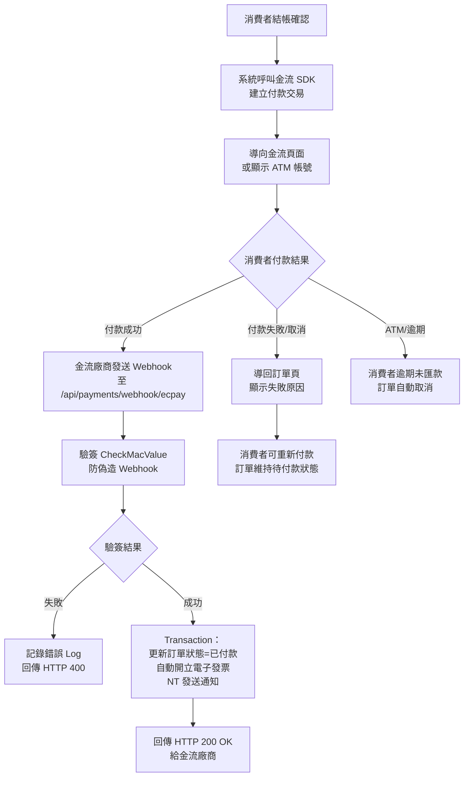
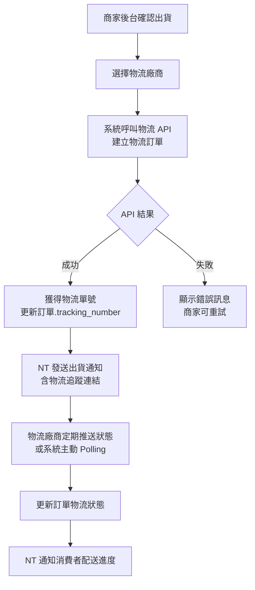
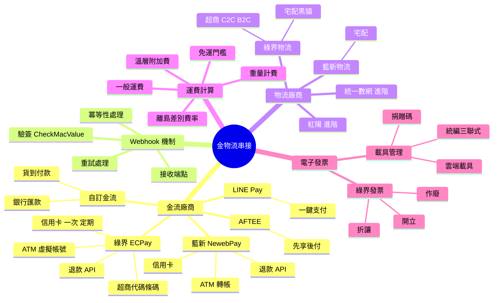
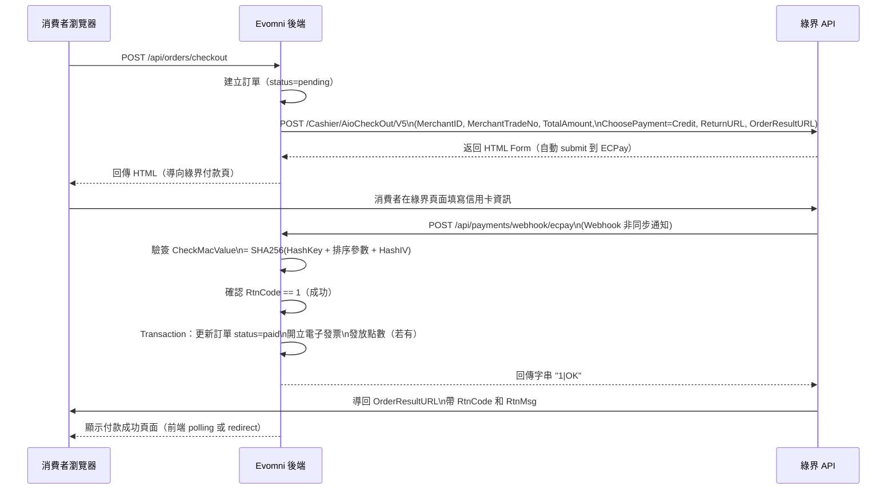
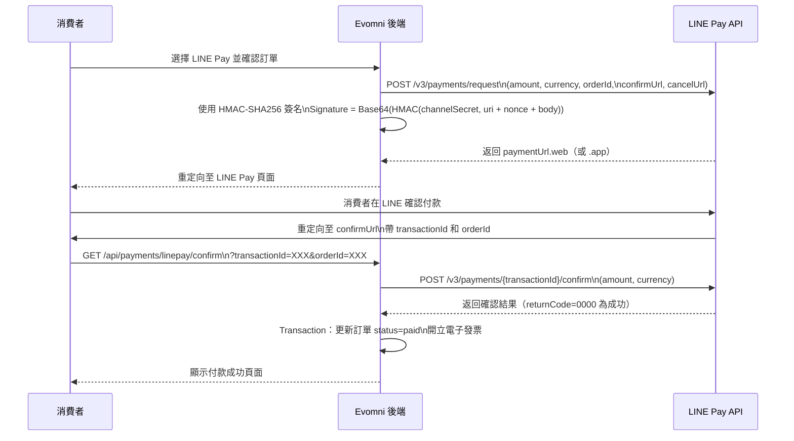
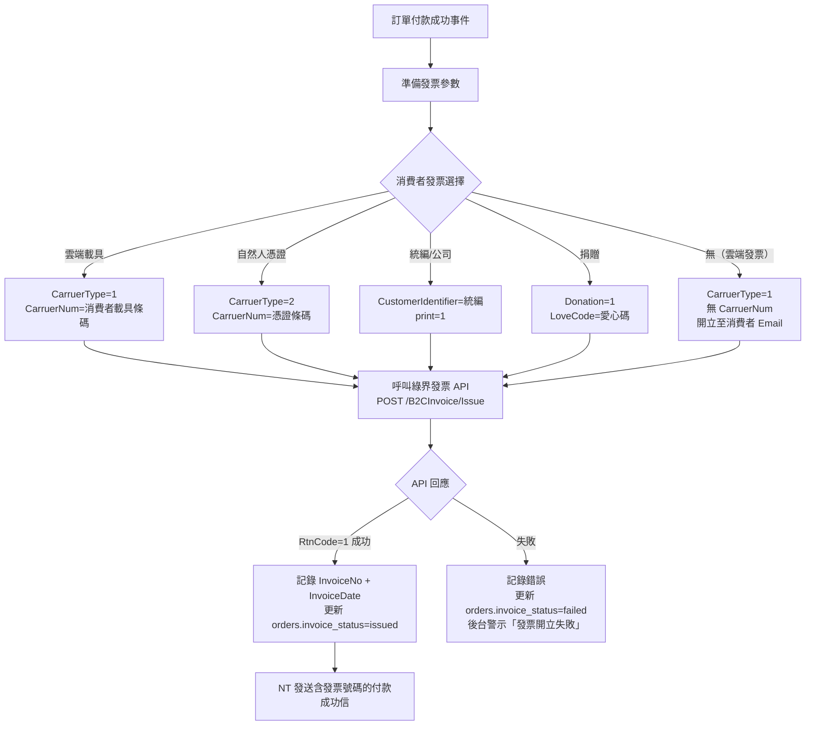
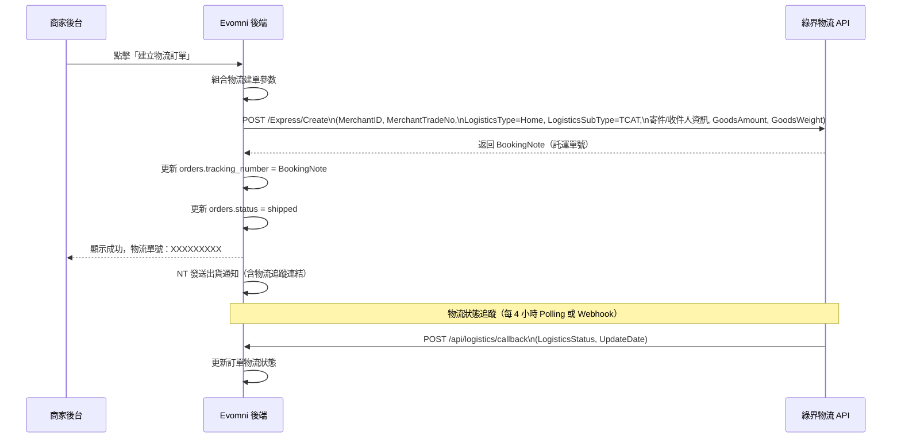

# Evomni — 金物流串接規格 產品需求文件 (PRD) v1.0

## 1. 文件資訊

| 屬性 | 內容 |
| --- | --- |
| 版本 | v1.0 |
| 日期 | 2026/04/27 |
| 需求來源 | Master PRD v1.0 Chapter 5（P0）、方案規格 V1.1、PRD V3 §3.2.5 |
| 文件狀態 | **P0 首次完整規格** — 原文件僅列廠商名稱，API 規格、錯誤處理、Webhook 機制均為空白 |
| 作者 | Claude（依廖紫茵授權產出） |
| 對應方案 | 電商啟航方案 ✅ / 進階電商包 ✅（差異見各節方案歸屬）|
| 特別說明 | 本文件規格化的金流廠商：綠界（ECPay）、藍新（NewebPay）、LINE Pay、AFTEE；物流：綠界、藍新、紅陽（進階）、統一數網（進階）；電子發票：綠界（標配），ezPay 加費條件待定（議題 #3）|
| 開發時程 | 階段一 5–8月（電商啟航方案）/ 階段二 9–12月（進階電商包）|

---

## 2. 目標與功能總覽

### 2.1 核心願景與相依性

**核心問題：**
金物流串接是訂單能否完成支付與出貨的關鍵底層，但原規格只有廠商名稱，缺乏：
1. 每個金流廠商的 API 呼叫規格與參數定義
2. 付款結果 Webhook 接收與驗簽機制
3. 付款失敗的錯誤碼處理邏輯
4. 物流 API 的建單、查詢、狀態回調規格
5. 電子發票開立、折讓、作廢的完整 API 流程

**系統相依性：**

| 模組 | 用途 |
| --- | --- |
| Part 3 訂單管理 | 接收金流付款成功 Webhook → 更新訂單狀態 |
| Part 3 訂單管理 | 退款 API 由退換貨流程呼叫 |
| NT（發信模組） | 付款成功/失敗通知信 |
| Part 1 全域設定 > 金物流串接 | 金物流帳號密碼設定頁面 |

---

### 2.2 功能總覽表

| 主功能模組 | 子功能項目 | 方案歸屬 | 功能目的 | 影響之使用者 |
| --- | --- | --- | --- | --- |
| 金流設定 | 後台金流帳號設定 | 兩方案共有 | 商家設定金流串接憑證 | 商家管理員 |
| 金流 - 綠界 | 信用卡一次付清 | 兩方案共有 | 最常用支付方式 | 消費者 |
| 金流 - 綠界 | 信用卡定期定額 | 兩方案共有 | 訂閱型產品支付 | 消費者 |
| 金流 - 綠界 | ATM 虛擬帳號 | 兩方案共有 | 無信用卡消費者 | 消費者 |
| 金流 - 綠界 | 超商代碼/條碼 | 兩方案共有 | 便利商店繳費 | 消費者 |
| 金流 - 藍新 | 信用卡一次付清 | 兩方案共有 | 備援/指定廠商 | 消費者 |
| 金流 - 藍新 | ATM 轉帳 | 兩方案共有 | 銀行轉帳支付 | 消費者 |
| 金流 - LINE Pay | 一鍵支付 | 兩方案共有 | 行動支付 | 消費者 |
| 金流 - AFTEE | 先享後付 | 兩方案共有 | 分期/後付 | 消費者 |
| 金流 - 自訂 | 貨到付款 / 銀行匯款 | 兩方案共有 | 線下支付 | 消費者 |
| 金流 - 退款 | 線上退款 API | 兩方案共有 | 退貨退款 | 商家管理員 |
| 物流 - 綠界 | 宅配建單/查詢 | 兩方案共有 | 物流建單自動化 | 商家管理員 |
| 物流 - 綠界 | 超商取貨（C2C/B2C）| 兩方案共有 | 超商取貨服務 | 消費者 |
| 物流 - 藍新 | 宅配建單/查詢 | 兩方案共有 | 備援物流 | 商家管理員 |
| 物流 - 紅陽 | 宅配建單/查詢 | 進階電商包 | 多元物流選擇 | 商家管理員 |
| 物流 - 統一數網 | 配送建單/查詢 | 進階電商包 | 統一超商物流 | 商家管理員 |
| 電子發票 - 綠界 | 自動開立發票 | 兩方案共有 | 稅務合規 | 消費者 |
| 電子發票 - 綠界 | 折讓/作廢 | 兩方案共有 | 退款對應發票 | 商家管理員 |
| 運費規則 | 一般/離島差別費率 | 兩方案共有 | 精確計算運費 | 消費者 |
| 運費規則 | 溫層運費設定 | 兩方案共有 | 食品冷凍冷藏附加費 | 消費者 |
| 運費規則 | 重量運費設定 | 兩方案共有 | 依重量計費 | 消費者 |

---

## 3. 全局功能流程

### 3.1 金流付款完整流程



### 3.2 物流建單流程



---

## 4. 功能結構圖



---

## 5. 使用者故事

| # | 角色 | 故事 |
| --- | --- | --- |
| US-01 | 商家管理員 | 身為商家管理員，我想要在後台輸入我的綠界商家代號和 HashKey，以便電商系統能透過我的綠界帳號收款。 |
| US-02 | 消費者 | 身為消費者，我想要在結帳時選擇 LINE Pay 付款並導向 LINE 完成支付，以便快速完成購物。 |
| US-03 | 消費者 | 身為消費者，選擇 ATM 轉帳後，我想要看到銀行代碼和虛擬帳號，以便我轉帳。 |
| US-04 | 商家管理員 | 身為商家管理員，付款成功後我想要訂單狀態自動更新、電子發票自動開立，以便我不需要手動處理。 |
| US-05 | 商家管理員 | 身為商家管理員，當退款時我想要系統自動呼叫綠界退款 API，以便我不需要登入綠界後台手動操作。 |
| US-06 | 商家管理員 | 身為商家管理員，我想要在後台一鍵建立物流訂單並得到追蹤號，以便出貨流程完全在我的後台完成。 |
| US-07 | 消費者 | 身為離島消費者，我想要在結帳時系統自動依我的地址判斷離島運費，以便我知道正確運費。 |

---

## 6. UI/UX 與詳細功能需求

### 6.1 金物流帳號設定頁（後台）

**路徑：** 後台「全域設定 > 金物流串接」

**頁面結構（`<el-tabs>` Tab 式）：**
```
[Tab] 金流設定  [Tab] 物流設定  [Tab] 電子發票設定  [Tab] 運費規則
```

---

#### 6.1.1 金流設定 Tab

**各金流廠商以 `<el-collapse>` 折疊面板呈現：**

**綠界（ECPay）設定：**

| 欄位 | 元件 | 驗證規則 |
| --- | --- | --- |
| 是否啟用 | `<el-switch>` | — |
| 商店代號（MerchantID）| `<el-input>` | 必填（啟用時）；格式：英數字，最多 10 碼 |
| HashKey | `<el-input>` type="password" | 必填；儲存後顯示 `****` |
| HashIV | `<el-input>` type="password" | 必填；儲存後顯示 `****` |
| 環境 | `<el-radio>` | 必填；測試環境 / 正式環境 |
| 啟用付款方式 | `<el-checkbox-group>` | 信用卡一次付清 ✅ / 信用卡定期定額 / ATM 虛擬帳號 / 超商代碼 / 超商條碼 |
| ATM 繳費期限（天）| `<el-input-number>` | 必填（ATM 啟用時）；預設 3 天；1-60 天 |
| [測試連線] 按鈕 | `<el-button>` | 呼叫綠界 QueryTradeInfo API 驗證憑證有效性 |

**藍新（NewebPay）設定：**

| 欄位 | 元件 | 驗證規則 |
| --- | --- | --- |
| 是否啟用 | `<el-switch>` | — |
| MerchantID | `<el-input>` | 必填；英數字 |
| HashKey | `<el-input>` type="password" | 必填 |
| HashIV | `<el-input>` type="password" | 必填 |
| 環境 | `<el-radio>` | 測試 / 正式 |
| 啟用付款方式 | `<el-checkbox-group>` | 信用卡 / ATM 轉帳 |

**LINE Pay 設定：**

| 欄位 | 元件 | 驗證規則 |
| --- | --- | --- |
| 是否啟用 | `<el-switch>` | — |
| Channel ID | `<el-input>` | 必填；數字 |
| Channel Secret Key | `<el-input>` type="password" | 必填 |
| 環境 | `<el-radio>` | Sandbox / 正式 |

**AFTEE 設定：**

| 欄位 | 元件 | 驗證規則 |
| --- | --- | --- |
| 是否啟用 | `<el-switch>` | — |
| Shop ID | `<el-input>` | 必填 |
| API Key | `<el-input>` type="password" | 必填 |
| 環境 | `<el-radio>` | Sandbox / 正式 |
| 最低訂單金額 | `<el-input-number>` | 選填；AFTEE 通常有最低使用金額限制 |

**自訂金流：**

| 欄位 | 元件 | 說明 |
| --- | --- | --- |
| 啟用貨到付款 | `<el-switch>` | — |
| 貨到付款說明（前台顯示）| `<el-input type="textarea">` | 最多 200 字；Placeholder：「請於取貨時以現金支付」|
| 啟用銀行匯款 | `<el-switch>` | — |
| 匯款銀行資訊 | `<el-input type="textarea">` | 必填（啟用時）；例：銀行：玉山銀行（808）/ 帳號：1234567890 / 戶名：○○○ |
| 匯款確認期限（天）| `<el-input-number>` | 預設 3 天；商家需在期限內確認匯款 |

---

#### 6.1.2 物流設定 Tab

**綠界物流設定：**

| 欄位 | 元件 | 說明 |
| --- | --- | --- |
| 是否啟用 | `<el-switch>` | — |
| MerchantID（同金流帳號）| `<el-input>` | 可使用金流 MerchantID；或另設物流專用帳號 |
| HashKey | `<el-input>` type="password" | 必填 |
| HashIV | `<el-input>` type="password" | 必填 |
| 環境 | `<el-radio>` | 測試 / 正式 |
| 啟用物流方式 | `<el-checkbox-group>` | 黑貓宅配 / 超商 C2C（7-11、全家）/ 超商 B2C |
| 寄件人姓名 | `<el-input>` | 必填 |
| 寄件人手機 | `<el-input>` | 必填；台灣手機格式 |
| 寄件人地址 | 縣市 + 區 + 地址 | 必填 |

**各物流方式獨立設定（`<el-collapse>`）：**

| 設定項目 | 說明 |
| --- | --- |
| 包裹規格（長 × 寬 × 高）預設值 | 商家設定預設尺寸，出貨時可個別調整 |
| 重量預設值 | 公斤，產品未設定重量時使用此預設值 |
| 到店取件期限 | 超商取貨預設 7 天 |

---

#### 6.1.3 電子發票設定 Tab（綠界）

| 欄位 | 元件 | 說明 |
| --- | --- | --- |
| 是否啟用自動開立 | `<el-switch>` | 預設 ON；關閉後需手動開立 |
| MerchantID | `<el-input>` | 可同金流帳號 |
| HashKey | `<el-input>` type="password" | 必填 |
| HashIV | `<el-input>` type="password" | 必填 |
| 環境 | `<el-radio>` | 測試 / 正式 |
| 開立時機 | `<el-radio>` | 付款成功立即開立（推薦）/ 商家手動觸發 |
| 貨到付款開立時機 | `<el-radio>` | 訂單狀態「已送達」後自動開立 / 商家手動開立 |
| 捐贈碼 | `<el-input>` | 選填；若消費者選擇捐贈發票，預設捐贈給此愛心碼 |

---

#### 6.1.4 運費規則 Tab

**一般運費設定：**

| 欄位 | 元件 | 說明 |
| --- | --- | --- |
| 依物流方式設定運費 | 各物流方式展開設定 | — |
| 本島基礎運費 | `<el-input-number>` NT$ | 必填 |
| 離島基礎運費 | `<el-input-number>` NT$ | 必填；郵遞區號判斷本島/離島 |
| 本島免運門檻 | `<el-input-number>` NT$ | 選填；0 代表無免運 |
| 離島免運門檻 | `<el-input-number>` NT$ | 選填 |

**離島地區定義（系統內建，不可修改）：**
- 澎湖縣（郵遞區 880-885）
- 金門縣（郵遞區 890-894）
- 連江縣（郵遞區 209-212）
- 綠島鄉（郵遞區 951）
- 蘭嶼鄉（郵遞區 952）
- 琉球鄉（郵遞區 929）

**溫層運費設定（見 Part 2 溫層/重量運費 PRD，此處連結）**

**重量運費設定（見 Part 2 溫層/重量運費 PRD，此處連結）**

---

## 7. 細部邏輯流程圖

### 7.1 綠界金流 API 流程（信用卡一次付清）



**CheckMacValue 計算規格：**

```
1. 將所有參數（除 CheckMacValue 本身）按照參數名稱英文字母順序排列
2. 組合字串：HashKey=<值>&參數1=值1&參數2=值2...&HashIV=<值>
3. URL Encode（小寫）
4. SHA256 加密
5. 轉大寫
```

**Webhook 接收端點（`POST /api/payments/webhook/ecpay`）規格：**

| 步驟 | 動作 | 失敗處理 |
| --- | --- | --- |
| 1 | 驗簽 CheckMacValue | 驗簽失敗：返回 HTTP 400，記錄 Log，不更新訂單 |
| 2 | 確認 MerchantTradeNo 對應訂單存在 | 不存在：返回 HTTP 400，記錄異常 Log |
| 3 | 冪等性檢查（已處理過的訂單不重複更新）| 已處理：直接返回 HTTP 200 "1\|OK" |
| 4 | 確認 RtnCode == "1"（付款成功）| RtnCode != 1：記錄失敗 Log，更新訂單 payment_note |
| 5 | Transaction：更新訂單狀態 | Transaction 失敗：Rollback，返回 HTTP 500，加入重試佇列 |
| 6 | 返回 "1\|OK" | — |

---

### 7.2 LINE Pay 付款流程



**LINE Pay 錯誤碼處理：**

| returnCode | 說明 | 系統處理 |
| --- | --- | --- |
| 0000 | 成功 | 更新訂單為已付款 |
| 1101 | Buyer cancel | 訂單保持待付款，顯示「付款已取消」|
| 1102 | Buyer purchase limit exceeded | 顯示「LINE Pay 消費額度不足，請選擇其他付款方式」|
| 1104 | Merchant not found | 顯示「系統錯誤，請聯繫客服」，記錄 Error Log |
| 1105 | Merchant payment not available | 同上 |
| 2101 | Invalid param | 記錄 Error Log，顯示「付款處理失敗，請重試」|
| 9000 | Internal error | 加入重試佇列，最多 3 次 |

---

### 7.3 綠界電子發票 API 流程



**發票 API 必填參數（綠界 B2CInvoice/Issue）：**

| 參數 | 說明 | 來源 |
| --- | --- | --- |
| MerchantID | 商家代號 | 系統設定 |
| RelateNumber | 商家自訂發票流水號（訂單 ID + 時間戳）| 系統產生 |
| CustomerEmail | 消費者 Email | 訂單資料 |
| CustomerPhone | 消費者手機（可選）| 訂單資料 |
| SalesAmount | 發票金額（含稅）| 訂單總金額 |
| InvoiceRemark | 備註 | 商店名稱 |
| Items | 產品明細陣列（ItemName, ItemCount, ItemUnit, ItemPrice, ItemAmount）| 訂單產品 |
| Vat | 課稅類別（1=應稅）| 固定值 1 |
| Print | 是否列印（0=不列印，1=列印）| 依發票類型 |
| Donation | 捐贈（0/1）| 消費者選擇 |
| LoveCode | 愛心碼 | 消費者填寫 |
| CarruerType | 載具類型（空=無，1=會員，2=自然人，3=企業）| 消費者選擇 |
| CarruerNum | 載具編號 | 消費者填寫 |
| CustomerIdentifier | 統一編號（B2B）| 消費者填寫 |
| TaxType | 稅率（1=應稅 5%）| 固定值 1 |
| CheckMacValue | 驗簽值 | SHA256 計算 |

---

### 7.4 退款 API 流程

```mermaid
graph TD
    A[退款流程觸發\n見 Part 3 §6.3C] --> B{原始付款方式}
    B -->|綠界信用卡| C[呼叫綠界退款 API\nPOST /CreditDetail/DoAction\nAction=C 全額退款 or Action=R 部分退款]
    B -->|藍新信用卡| D[呼叫藍新退款 API\nPOST /API/credit/dedobill]
    B -->|LINE Pay| E[呼叫 LINE Pay 退款 API\nPOST /v3/payments/refund/{transactionId}]
    B -->|ATM 轉帳/匯款/貨到付款| F[手動退款\n商家需手動匯款\n系統記錄退款資訊]
    C --> G{API 回應}
    D --> G
    E --> G
    G -->|成功| H[更新退換貨狀態=退款完成\n記錄退款交易號\nNT 通知消費者]
    G -->|失敗| I[狀態=退款異常\n記錄錯誤碼\n後台警示]
    I --> J[加入重試佇列\n最多 3 次，間隔 5 分鐘]
    J --> G
```

**綠界退款 API 規格（信用卡）：**

```
POST /CreditDetail/DoAction
Content-Type: application/x-www-form-urlencoded

MerchantID=XXXXXXXX
MerchantTradeNo=原訂單交易號
TradeNo=綠界交易號（從原始付款 Webhook 記錄）
Action=C（全額退款）或 R（部分退款）
TotalAmount=退款金額（部分退款時填寫）
CheckMacValue=SHA256 驗簽
```

---

### 7.5 物流建單流程（綠界宅配）



**物流建單必填參數（綠界宅配 TCAT）：**

| 參數 | 說明 |
| --- | --- |
| MerchantID | 商家代號 |
| MerchantTradeNo | 商家自訂物流單號（訂單 ID + 前綴）|
| LogisticsType | Home（宅配）/ CVS（超商）|
| LogisticsSubType | TCAT（黑貓）/ FAMI（全家）/ UNIMART（7-11）等 |
| GoodsName | 產品名稱（最多 50 字）|
| GoodsAmount | 貨物價值（保險用）|
| GoodsWeight | 重量（公克）|
| SenderName | 寄件人姓名（來自物流設定）|
| SenderPhone | 寄件人手機 |
| SenderZipCode | 寄件人郵遞區號 |
| SenderAddress | 寄件人地址 |
| ReceiverName | 收件人姓名（來自訂單）|
| ReceiverPhone | 收件人手機 |
| ReceiverZipCode | 收件人郵遞區號 |
| ReceiverAddress | 收件人地址 |
| ServerReplyURL | Webhook 回調 URL |
| CheckMacValue | SHA256 驗簽 |

**物流狀態碼對照（綠界）：**

| 代碼 | 說明 | 對應訂單狀態 |
| --- | --- | --- |
| 300 | 已到集貨倉 | 配送中 |
| 3024 | 配送中 | 配送中 |
| 3018 | 已送達 | 已送達 |
| 3022 | 拒收 | 退回（觸發後台通知）|
| 3023 | 配送異常 | 配送中（後台警示）|

---

## 8. 非功能性需求

### 8.1 效能需求

| 項目 | 標準 |
| --- | --- |
| 金流 API 呼叫逾時設定 | 30 秒；逾時後顯示「付款請求逾時，請重試」，不建立訂單 |
| Webhook 接收回應時間 | ≤ 5 秒內必須回傳 "1\|OK" 給綠界，否則綠界會重試 |
| 物流建單 API 逾時 | 30 秒；逾時後顯示錯誤，允許商家重試 |
| 電子發票 API 逾時 | 30 秒；逾時後標記 `invoice_status=pending`，加入重試佇列 |

### 8.2 安全性需求

| 項目 | 規格 |
| --- | --- |
| 所有金流/物流 API 憑證 | 加密儲存（Laravel Encrypt）；不得 Log 任何 key/secret |
| Webhook 驗簽 | 所有 Webhook 必須驗簽，驗簽失敗 HTTP 400 且不執行任何業務邏輯 |
| Webhook 冪等性 | 以 MerchantTradeNo 為 key，已處理的 Webhook 直接回傳成功，不重複執行 |
| Webhook 來源 IP 白名單（選配）| 可設定僅接受綠界/藍新官方 IP 的 Webhook 請求 |
| HTTPS 強制 | 所有金流 API 呼叫必須使用 HTTPS |

### 8.3 資料一致性

- Webhook 更新訂單狀態必須在 DB Transaction 內與電子發票開立一同執行
- 退款操作：金流 API 成功後才更新退款狀態，API 失敗時保持「退款處理中」不更新為「退款完成」
- 物流單號一旦寫入訂單，不可修改（需留審計記錄）

### 8.4 測試環境要求

- 所有金流廠商必須先以「測試環境」完成端對端測試，確認 Webhook 正確收到後，才可切換至正式環境
- 測試環境和正式環境的 API 憑證儲存在不同欄位（`is_sandbox` 標記）
- 上線前必須完成：信用卡付款 → Webhook 收到 → 訂單更新 → 發票開立 → 退款 的完整流程測試

### 8.5 瀏覽器/裝置支援

| 環境 | 要求 |
| --- | --- |
| 後台設定頁 | Chrome 110+；桌機 1280px+ |
| 前台結帳頁（消費者） | 手機（375px+）；iOS Safari 16+；Android Chrome 110+ |
| LINE Pay 導轉 | 需支援手機 App 導轉（`linepay://` URI Scheme）|

---

## 8.5 工程師確認補充（v1.1 更新，2026/04/28）

### 8.5.1 Webhook 冪等性 Key 與 payment_webhook_logs 表

冪等性 Key 使用 `vendor + merchant_trade_no + vendor_trade_no` 組合。正式 Schema：

```sql
CREATE TABLE payment_webhook_logs (
  id                  BIGINT AUTO_INCREMENT PRIMARY KEY,
  vendor              VARCHAR(20) NOT NULL,       -- 'ecpay'/'newebpay'/'linepay'/'aftee'
  merchant_trade_no   VARCHAR(50) NOT NULL,        -- 本系統訂單號
  vendor_trade_no     VARCHAR(50),                 -- 廠商端交易流水號
  received_at         DATETIME DEFAULT CURRENT_TIMESTAMP,
  raw_payload         TEXT,
  verification_result ENUM('pass','fail'),
  process_result      ENUM('processed','duplicated','error'),
  UNIQUE KEY uq_vendor_trade (vendor, merchant_trade_no, vendor_trade_no)
);
```

收到 Webhook 先 INSERT → 若 Duplicate Key，直接回 `1|OK`，不重複更新訂單。

### 8.5.2 Webhook 處理必須在 2 秒內回應

**強制要求**：Webhook Controller 必須在 **2 秒內**回傳 `1|OK`。

執行順序：
1. 驗簽 CheckMacValue
2. 冪等性檢查（INSERT `payment_webhook_logs`）
3. Transaction：更新訂單狀態為「已付款」
4. **立即回傳 `1|OK`**
5. 將「開立電子發票」、「NT 發送通知信」推入 Queue（非同步執行）

**絕對不能**在同步 Webhook 處理中呼叫外部 API（發票 API / NT API）。

各廠商超時限制：ECPay 5 秒重試 5 次、NewebPay 10 秒重試 3 次、LINE Pay 10 秒重試 3 次。

### 8.5.3 物流 Polling 頻率（當廠商無 Webhook 時）

- 優先接受廠商主動 Webhook 推送
- 廠商無 Webhook 或 Webhook 失敗時啟動主動 Polling
- 頻率：**每 2 小時**，每批最多 50 筆「已出貨 / 配送中」訂單
- 廠商 API 返回 429 時：指數退避重試（1h → 2h → 4h）並寫 Alert Log

### 8.5.4 Webhook URL 含商家唯一 Token

URL 格式調整為：`/api/webhooks/payment/{uuid_token}/{vendor}`

`uuid_token` 存於 `integration_settings.webhook_token`，每個商家不同。設定頁可點擊「重新產生 Token」（重設後需同步更新廠商 Webhook 設定）。

---

## 與團隊溝通摘要

- 這次的規格是關於**金物流串接規格 PRD**，最重要的是從廠商名稱擴展為可以直接開發的完整 API 規格，包括：綠界信用卡付款流程、LINE Pay 確認付款流程、Webhook 驗簽機制、電子發票開立 API、退款 API，以及物流建單 API
- **工程師這邊需要注意：**
  1. **Webhook 冪等性**是最重要的安全設計，同一筆 MerchantTradeNo 的 Webhook 可能被重複推送（網路問題），系統必須保證同一筆交易只處理一次，建議在 DB 建 `payment_webhooks` 表記錄已處理的交易號
  2. Webhook 接收端必須在 5 秒內回傳給綠界，因此發票開立、NT 通知等必須異步（放入 Queue），不可同步等待完成才回傳
  3. CheckMacValue 的計算順序（URL Encode → SHA256 → 大寫）必須嚴格遵守，錯一步就驗簽失敗
  4. LINE Pay 有兩步驟：第一步 Request（取得 paymentUrl）、第二步 Confirm（消費者確認後商家呼叫），**兩步都需要呼叫 API**，漏掉 Confirm 步驟訂單不會真的付款
  5. 退款 API 對於 ATM/貨到付款 是不支援自動退款的，系統需要提供「手動退款記錄」介面讓商家手動完成
- **設計師這邊需要注意：**
  1. 各金流的付款頁面都是導向金流廠商的頁面，Evomni 後台只需設計「選擇付款方式」的 UI，不需設計金流廠商的付款介面
  2. ATM 轉帳付款方式需要在結帳成功後顯示「銀行代碼 + 虛擬帳號 + 繳費期限」的資訊頁，請設計這個頁面
  3. 電子發票選擇介面（見 Part 3 §6.6B）需要在結帳頁設計，包含雲端載具/自然人憑證/統編/捐贈四種選項的表單
- 這個模組是 Part 3 訂單管理的前置條件，**必須在 Part 3 進入開發前完成金物流設定介面**，否則訂單無法走完支付流程
- 目前有 **2 個待確認事項：**
  1. 進階電商包「自選 6 種金流」的完整廠商清單尚未定義（Master PRD 議題 #2），本文件只規格化了 4 種（綠界、藍新、LINE Pay、AFTEE），其餘 2 種待確認後補寫
  2. ezPay 電子發票的加費條件未定（Master PRD 議題 #3），本文件只規格化綠界發票，ezPay 預留架構但不實作
