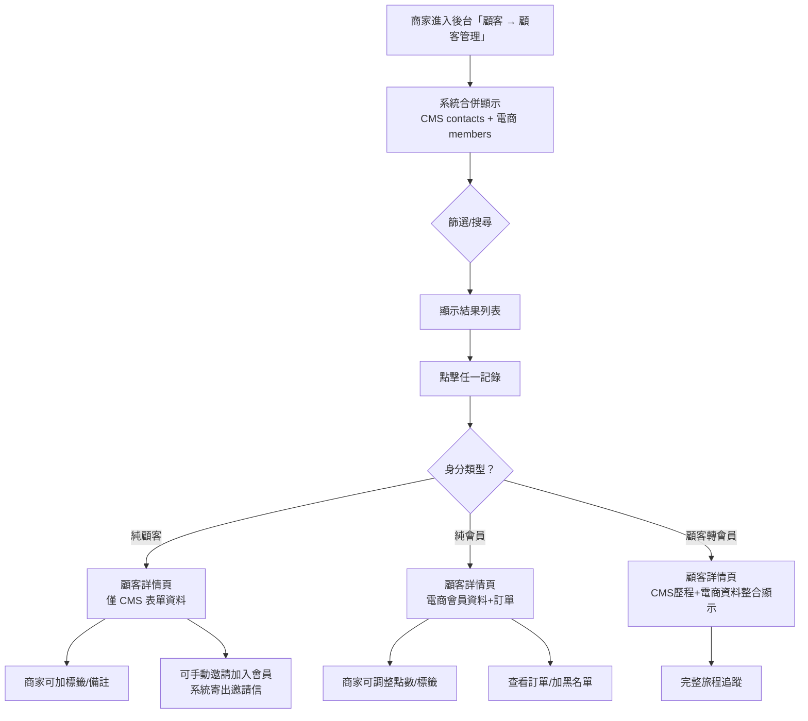
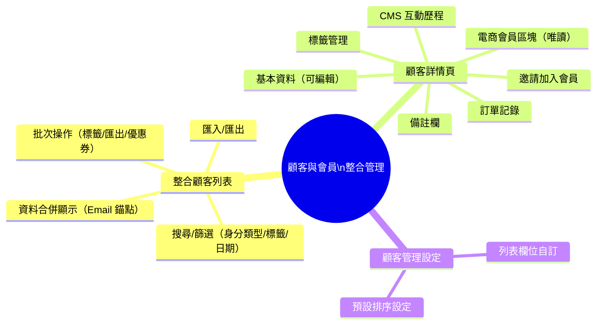
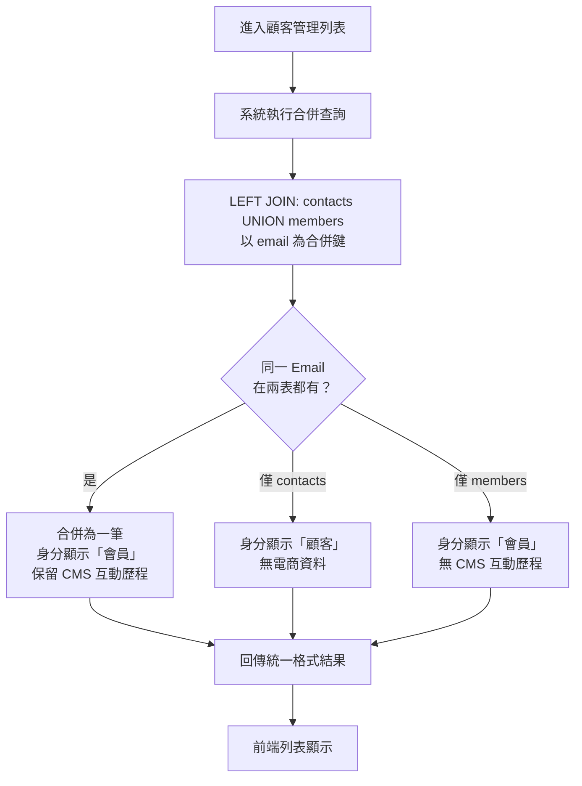
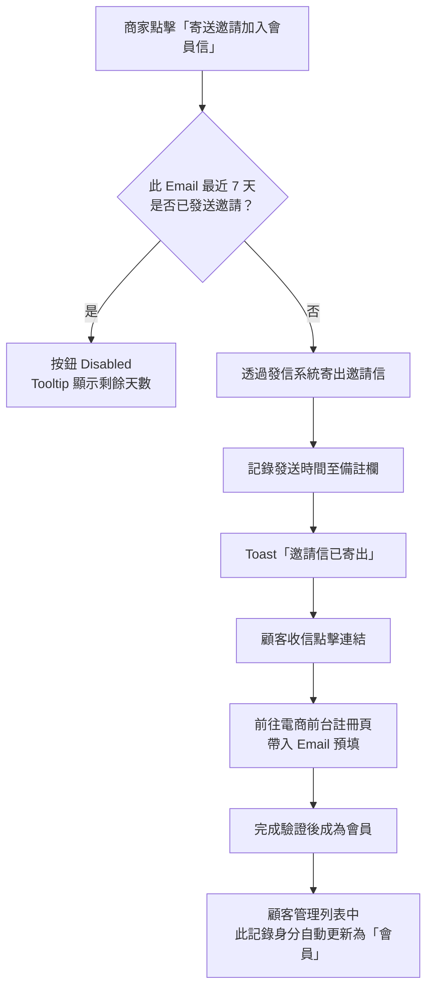

## 版本更新紀錄

| 版本 | 日期 | 修改內容 | 修改人 |
|------|------|----------|--------|
| v1.0 | 2026/05/04 | 初稿建立 | Una |

# Evomni — 顧客與會員整合管理 產品需求文件 (PRD)

## 1. 文件資訊

| 屬性 | 內容 |
| --- | --- |
| 模組名稱 | 顧客與會員整合管理（Unified Customer & Member Management） |
| 所屬方案 | 電商啟航方案 + 進階電商包（開啟電商模組後自動生效） |
| 所屬後台路徑 | 顧客 → 顧客管理 |
| 前置文件 | `Evomni_Part6_會員管理_PRD.md`（電商會員後台）、`Evomni_形象產品與電商產品整合架構規劃.md`（CRM 資料橋接） |
| 需求來源 | 2026/05/04 Una：CMS 顧客管理與電商會員應整合在同一後台頁面；統一用詞規範 |
| 文件狀態 | v1.0 首次完整規格 |
| 開發階段 | 階段一（5–8 月） |

> **📌 工程師實作說明：** 本文件以需求定義為主。文中所列技術規格（DB Schema、API 路由、資料結構等）為規劃建議，反映 PM 對系統的理解；工程師可依技術判斷調整實作方式。如有重大架構變更，請於 Git commit 說明原因，並同步更新本文件，保持版控一致。

---

## 用詞統一規範（全系統適用）

> ⚠️ 本節定義的術語適用於所有 Evomni PRD、後台介面、前台介面、客服話術。

| 術語 | 定義 | 資料來源 | 顯示 Tag 顏色 |
| --- | --- | --- | --- |
| **顧客** | 曾透過 CMS 表單（詢問單、報名、聯絡）留下聯絡資料，但**尚未申請並通過電商會員註冊**的聯絡人 | CMS `contacts` 表 | `#606266`（灰） |
| **會員** | 已在電商前台完成**會員申請並通過驗證**（Email 驗證或簡訊 OTP）的消費者 | 電商 `members` 表 | `#409EFF`（藍） |
| **顧客轉會員** | 原為顧客（CMS contacts），後來完成電商會員申請，同 Email 已被系統連結 | 兩表均有記錄 | 顯示「會員」tag + 附加「曾為顧客」說明 |

**不使用的術語（請在系統內全面替換）：**
- ❌ 「用戶」→ 改為「顧客」或「會員」
- ❌ 「客戶」（在後台顯示中）→ 改為「顧客」或「會員」
- ❌ Part 6 中的「顧客管理中心」標題 → 後台 UI 改為「顧客管理」（與 CMS 左側選單名稱保持一致）

---

## 2. 目標與功能總覽

### 2.1 核心願景與相依性

**核心問題：**
Evomni 同時擁有 CMS 形象站（有顧客資料）與電商模組（有會員資料），兩套資料目前分開管理，導致：
1. 商家在顧客管理看不到電商購買記錄
2. 商家在電商後台看不到 CMS 詢問/互動歷程
3. 同一個人被重複算成兩筆資料
4. 「顧客」「會員」術語混用導致操作困惑

**解決方案：**
以 **Email 為唯一識別錨點**，將 CMS `contacts` 資料與電商 `members` 資料整合顯示在 Evomni 後台的「顧客管理」頁面。同一個 Email 只顯示一筆記錄，以「身分類型」欄位區分。

**Evomni 價值對應：**
- 商家用一個頁面就能看到完整的顧客/會員資料
- 形象站問過的潛在客，在轉換為電商會員後能追蹤完整旅程
- 分眾行銷時可以同時針對「只是顧客」的族群做精準引導（轉換會員）

**系統相依性：**

| 相依模組 | 用途 |
| --- | --- |
| CMS 顧客管理（現有） | 讀取 `contacts` 表：姓名、Email、電話、公司、表單來源、標籤 |
| Part 6 電商會員管理 | 讀取 `members` 表：等級、點數、消費記錄、電商標籤 |
| Part 3 訂單管理 | 在顧客詳情頁顯示訂單列表 |
| Part 4 行銷活動 | 分眾篩選後發送優惠券 |
| 發信系統 | 顧客/會員匯出後寄送報表信 |

### 2.2 功能總覽表

開啟電商模組後，CMS 原有「顧客管理」頁面自動升級為「整合顧客管理」，同時顯示 CMS 顧客與電商會員資料。

| 主功能模組 | 子功能項目 | 功能目的 | 功能詳細描述 | 影響之使用者 |
| --- | --- | --- | --- | --- |
| 整合顧客列表 | 統一列表顯示 | 一處管理所有聯絡人 | 同時顯示 CMS 顧客（表單聯絡人）與電商會員，同 Email 合併為一筆；「身分類型」欄位標示區別 | 商家管理員 |
| 整合顧客列表 | 搜尋與篩選 | 快速定位目標顧客/會員 | 多條件篩選：關鍵字（姓名/Email/電話/公司）、標籤（可多選）、狀態、身分類型（顧客/會員/全部）、加入/註冊日期 | 商家管理員 |
| 整合顧客列表 | 批次操作 | 提升管理效率 | 批次加標籤、批次匯出、（進階方案）批次發優惠券 | 商家管理員 |
| 整合顧客列表 | 匯出與匯入 | 資料交換 | 匯出為 Excel/CSV；匯入為 CSV 格式新增顧客基本資料 | 商家管理員 |
| 顧客詳情頁 | 基本資料區塊 | 查看聯絡人資訊 | 顯示 CMS 表單留下的姓名/Email/電話/公司；可編輯 | 商家管理員 |
| 顧客詳情頁 | 電商會員區塊 | 查看電商購買資訊 | 若已是電商會員：顯示等級、點數餘額、累計消費金額、購買次數、最後購買日 | 商家管理員 |
| 顧客詳情頁 | 訂單記錄區塊 | 追蹤購買歷程 | 列出所有電商訂單（僅會員有此區塊）；可點擊連結至訂單詳情 | 商家管理員 |
| 顧客詳情頁 | CMS 互動歷程 | 查看表單提交記錄 | 列出此 Email 所有 CMS 表單提交紀錄（詢問單/報名/聯絡），含提交時間與內容摘要 | 商家管理員 |
| 顧客詳情頁 | 標籤管理 | 自定義分眾 | 新增/移除自定義標籤；系統自動標籤唯讀顯示 | 商家管理員 |
| 顧客詳情頁 | 備註欄 | 內部客服備忘 | 純文字備注，僅後台可見，不對顧客/會員顯示 | 商家管理員 |
| 設定（顧客管理設定） | 顯示欄位設定 | 自訂列表欄位 | 可選擇在列表中顯示哪些欄位（Email/電話/公司/標籤/最後訂單日/累計消費等） | 商家管理員 |

---

## 3. 全局功能流程



**資料合併邏輯：**
- 系統以 **Email 為唯一識別錨點**
- 同一 Email 若在 `contacts` 和 `members` 都有記錄 → 合併為一筆，身分類型顯示「會員」，CMS 互動歷程仍保留
- `contacts` 有但 `members` 沒有 → 身分類型「顧客」
- `members` 有但 `contacts` 沒有（直接從電商前台註冊）→ 身分類型「會員」，無 CMS 互動歷程區塊

---

## 4. 功能結構圖



---

## 5. 使用者故事

| ID | 角色 | 使用者故事 |
| --- | --- | --- |
| US-01 | 商家管理員 | 身為管理員，我想要在同一個頁面看到所有曾聯絡過我們的人（無論是表單詢問還是電商購買），以便不用切換兩個不同的功能才能了解一個人的完整歷史。 |
| US-02 | 商家管理員 | 身為管理員，我想要看到「顧客」和「會員」的區別，以便我能針對還沒成為電商會員的 CMS 顧客，主動寄出邀請加入。 |
| US-03 | 商家管理員 | 身為管理員，當我搜尋一個 Email 時，我只想看到一筆記錄而不是兩筆，以便清楚看到這個人的完整資料。 |
| US-04 | 商家管理員 | 身為管理員，我想要在顧客詳情頁看到這個人在 CMS 表單問過什麼、以及在電商買過什麼，以便客服回覆時有完整脈絡。 |
| US-05 | 商家管理員 | 身為管理員，我想要用篩選器篩出「只是顧客但還不是會員」的聯絡人，以便批次寄送轉換邀請。 |

---

## 6. UI/UX 與詳細功能需求

### 6.1 整合顧客列表頁

**後台路徑：** 顧客 → 顧客管理
**路由：** `/members`（沿用現有路由，後端資料來源擴充為合併查詢）

#### A. 核心使用者流程

進入「顧客管理」→ 系統顯示合併後的顧客+會員列表 → 篩選/搜尋定位目標 → 點擊查看詳情 → 編輯/操作。

#### B. 介面佈局與元件拆解（Figma Ready）

```
[頁面標題：顧客管理]  [麵包屑：顧客 / 顧客管理]

[篩選區塊]
  關鍵字                標籤（可多選）              狀態               身分類型
  [請輸入姓名/Email/電話/公司___]  [請選擇標籤▼]  [請選擇狀態▼]  [全部 ▼ 顧客/會員]

  註冊/加入日期
  [開始日期] 至 [結束日期]    [清除]  [搜尋]（黑色按鈕）

                                             [匯出全部]（藍色）  [匯入]（白色）

[資料列表]
  ☐  Email ↕     聯絡人姓名 ↕   電話      身分   加入日期 ↕   最後登入 ↕   標籤    操作
  ☐  email@...   王小明          0912...   [會員]  2026-03-20   2026-05-01   [test]  查看
  ☐  form@...    李大方          0987...   [顧客]  2026-02-15   —            —       查看
  ☐  both@...    陳志明          0955...   [會員]  2026-01-10   2026-04-28   [VIP]   查看
```

**「身分」欄位 Tag 規格：**

| 身分類型 | Tag 樣式 | 邏輯 |
| --- | --- | --- |
| 顧客 | `<el-tag class="!rounded-full" type="info" size="small">` 顯示「顧客」 | `contacts` 有記錄，`members` 無對應 Email |
| 會員 | `<el-tag class="!rounded-full" type="primary" size="small">` 顯示「會員」 | `members` 有記錄（無論是否也有 `contacts` 記錄）|

**「狀態」篩選選項：**
- 全部
- 正常
- 停用（會員帳號被停用）
- 黑名單

**「身分類型」篩選選項：**
- 全部
- 顧客（僅 CMS 表單聯絡人）
- 會員（有電商帳號，含曾為顧客者）

**列表預設排序：** 加入日期由新至舊。

**表格欄位規格：**

| 欄位 | 寬度 | 說明 |
| --- | --- | --- |
| Checkbox | 40px | 批次操作用 |
| Email | 200px | 可排序；可點擊進入詳情 |
| 聯絡人姓名 | 120px | 可排序；顯示 `—` 若未填 |
| 電話 | 120px | 顯示 `—` 若未填 |
| 身分 | 80px | 見上方 Tag 規格 |
| 加入日期 | 160px | 可排序；格式 `YYYY-MM-DD HH:mm:ss`；顧客以 CMS 表單提交時間為準，會員以 `members.created_at` 為準 |
| 最後登入日期 | 160px | 可排序；顧客（無登入）顯示 `—`；會員顯示最後登入時間 |
| 標籤 | 120px | 顯示最多 2 個 Tag，超過顯示 `+N`；Hover 顯示全部 Tooltip |
| 操作 | 60px | [查看]（`color: #409EFF`） |

**批次操作列（勾選後出現）：**
```
已選 N 筆  [加標籤]  [匯出已選]  [（進階方案）發送優惠券]  取消選取
```

#### C. 搜尋邏輯

- 關鍵字搜尋：跨 `contacts.name`、`contacts.email`、`contacts.phone`、`contacts.company`、`members.name`、`members.email`、`members.phone` 聯合搜尋
- 標籤篩選：同時篩選 CMS 標籤和電商會員標籤
- 日期篩選：顧客以 `contacts.created_at`；會員以 `members.created_at`；合併後以較早的時間為準

#### D. 匯出規格

匯出欄位（Excel）：

| 欄位 | 顧客 | 會員 |
| --- | --- | --- |
| Email | ✅ | ✅ |
| 姓名 | ✅ | ✅ |
| 電話 | ✅ | ✅ |
| 公司 | ✅（CMS）| — |
| 身分類型 | ✅ | ✅ |
| 加入日期 | ✅ | ✅ |
| 最後登入日期 | — | ✅ |
| 累計消費金額 | — | ✅ |
| 購買次數 | — | ✅ |
| 點數餘額 | — | ✅ |
| 會員等級 | — | ✅（進階方案）|
| 標籤 | ✅ | ✅ |

匯出按鈕行為：Toast「報表產生中，完成後將寄送至您的信箱 📧」

#### E. 防呆機制與錯誤預防

- 空列表 Empty State：「目前沒有符合條件的顧客/會員」+ [清除篩選] 按鈕
- 搜尋無結果：「找不到符合「○○」的記錄，請確認關鍵字後再試」
- 合併計算說明：頁面右上角 Info 圖示，Tooltip：「同一 Email 在 CMS 顧客與電商會員中只計算一筆，身分以電商會員為優先。」

---

### 6.2 顧客詳情頁

**路由：** `/members/:id`（id 為系統統一識別碼；純顧客的 id 為 `contact_id`，會員的 id 為 `member_id`，API 端自行判斷）

#### A. 核心使用者流程

從列表點擊「查看」→ 進入詳情頁 → 各區塊依身分類型動態顯示 → 可進行操作（編輯/標籤/備註/邀請/黑名單）

#### B. 介面佈局與元件拆解（Figma Ready）

**頁面整體結構：**
```
[← 返回顧客管理]

┌──────────────────────────────────────────────────────────────┐
│  [頭像 40x40]  王小明                                         │
│                [會員] tag  [高價值客] tag  [VIP] tag          │
│                Email：email@example.com                      │
│                電話：0912-345-678                             │
│  [編輯基本資料]  [（黑名單操作）]                              │
└──────────────────────────────────────────────────────────────┘

【區塊一：基本資料】（純顧客 + 會員均顯示）
【區塊二：電商會員資訊】（會員才顯示）
【區塊三：訂單記錄】（會員才顯示）
【區塊四：CMS 互動歷程】（有 CMS 表單記錄才顯示）
【區塊五：標籤管理】（均顯示）
【區塊六：備註欄】（均顯示）
【邀請加入會員按鈕區】（純顧客才顯示）
```

---

**【區塊一：基本資料】**

| 欄位 | 說明 |
| --- | --- |
| 姓名 | 可編輯；顧客來自 `contacts.name`，會員來自 `members.name` |
| Email | 唯讀（Email 為識別錨點，不允許在後台修改）；如需修改需聯絡工程師 |
| 電話 | 可編輯 |
| 公司 | 可編輯；CMS 表單填寫欄位；會員無此欄位時留空 |
| 加入來源 | 唯讀；例：「CMS 聯絡表單（2026/02/15）」、「電商前台自行註冊（2026/03/20）」、「第三方登入 Google（2026/03/21）」 |

「編輯基本資料」：點擊展開行內編輯；[儲存] [取消]；儲存後 Toast「資料已更新」。

---

**【區塊二：電商會員資訊】**（`members` 有記錄才顯示此區塊）

```
┌───────────────────────────────────────────────────────────────┐
│ 電商會員資訊                                                    │
├────────────┬──────────────────────────────────────────────────┤
│ 會員等級    │ 一般會員（進階方案才顯示等級名稱與圖示）              │
│ 點數餘額    │ 1,250 點  [查看明細 →]（連結至點數記錄區）           │
│ 累計消費    │ NT$ 28,400                                        │
│ 購買次數    │ 15 次                                             │
│ 最後購買日  │ 2026/04/28                                        │
│ 帳號狀態    │ [正常]（綠 Tag）/ [停用]（灰 Tag）/ [黑名單]（紅 Tag）│
│ 加入日期    │ 2026/03/20                                        │
└────────────┴──────────────────────────────────────────────────┘

（僅黑名單用途的操作，見 Part 6 §6.7）
```

---

**【區塊三：訂單記錄】**（`members` 有記錄才顯示）

```
訂單記錄  [查看全部訂單 →]（連結至訂單管理頁，帶入此會員篩選）

  訂單編號          日期          金額         狀態
  #EC-20260428-001  2026/04/28   NT$ 1,800    [已完成]
  #EC-20260410-002  2026/04/10   NT$ 3,200    [已完成]
  #EC-20260320-003  2026/03/20   NT$ 580      [已取消]
  （列出最近 5 筆；更多請點「查看全部訂單」）
```

表格規格：訂單編號可點擊跳轉至訂單詳情；金額顯示到個位數；狀態 `<el-tag>`。

---

**【區塊四：CMS 互動歷程】**（`contacts` 有記錄才顯示）

```
CMS 互動歷程（N 筆表單提交記錄）

  時間              表單類型        內容摘要（前 50 字）
  2026/02/15 14:20  聯絡表單        「請問貴公司的方案費用是...」
  2026/01/03 09:05  產品詢問單      「我想了解 XXX 產品的規格...」
  （展示最近 5 筆；[查看全部] 連結至 CMS 表單記錄）
```

> 僅顯示摘要和來源，詳細內容點擊「查看」可展開或連結至 CMS 表單詳情。

---

**【區塊五：標籤管理】**（均顯示）

```
標籤

  系統自動標籤（唯讀）：
  [活躍客] [高價值客] [品類愛好者]

  商家自定義標籤（可編輯）：
  [VIP] [test] × 
  [+ 新增標籤]（`<el-select>` 選擇或輸入建立新標籤）
```

---

**【區塊六：備註欄】**（均顯示）

```
內部備註（不對顧客/會員顯示）

  [______________________________________]
  [____________________________________]（textarea）

  最後更新：2026/04/20 by 管理員A  [儲存備註]
```

---

**【邀請加入會員】**（身分為「顧客」才顯示）

```
┌──────────────────────────────────────────────────────────────┐
│ 💡 此顧客尚未成為電商會員                                      │
│ 寄送邀請信，引導顧客在電商前台完成會員申請。                    │
│                            [寄送邀請加入會員信]（type="primary"）│
└──────────────────────────────────────────────────────────────┘
```

**邀請信規格：**
- 信件主旨：「[商店名稱] 邀請您加入會員，享受專屬優惠！」
- 信件內容：包含一鍵前往電商前台註冊的連結（連結有效期 30 天）
- 點擊發送後：Toast「邀請信已寄出至 [Email]」；同時記錄發送時間在備註欄（自動附加，不覆蓋原備註）
- 同一位顧客每 7 天只能發送一次（防刷）；超過限制時按鈕 Disabled + Tooltip：「已於 N 天前寄出邀請，請等待 N 天後再寄」

#### C. 互動設計、狀態與系統反饋

- 各區塊預設展開；點擊標題可收合（`<el-collapse>`）
- 各唯讀數字（累計消費、購買次數）Hover 顯示 Tooltip 說明計算基準：「僅計算電商模組內的已完成訂單」
- 操作（加標籤/加黑名單/手動調點數）均需二次確認

#### D. 防呆機制與錯誤預防

- 嘗試訪問不存在的記錄 ID：顯示「找不到此顧客/會員記錄」+ [返回顧客管理] 按鈕
- 邀請對象已是會員：邀請按鈕不顯示，顯示「此顧客已完成電商會員申請」

---

### 6.3 顧客管理設定頁

**路由：** `/members/settings`（在左側導覽「顧客 → 設定」）

#### B. 介面佈局與元件拆解（Figma Ready）

```
[頁面標題：顧客管理設定]

【區塊一：列表欄位設定】
說明：選擇顧客管理列表中要顯示的欄位，最多可顯示 8 個。

  ☑ Email（必選，不可關閉）
  ☑ 聯絡人姓名
  ☑ 電話
  ☑ 身分
  ☑ 加入日期
  ☑ 最後登入日期
  ☐ 公司
  ☐ 累計消費金額（會員才有資料）
  ☐ 購買次數（會員才有資料）
  ☑ 標籤
  ☑ 操作

【區塊二：預設排序】
  依 [加入日期 ▼] [由新至舊 ▼]

                        [儲存設定]
```

---

## 7. 細部邏輯流程圖

### 7.1 資料合併查詢邏輯



### 7.2 邀請加入會員流程



---

## 8. 非功能性需求

### 8.1 效能需求

| 功能 | 目標回應時間 |
| --- | --- |
| 列表初始載入（20 筆合併查詢） | ≤ 1.5 秒 |
| 搜尋關鍵字回應 | ≤ 1 秒 |
| 顧客詳情頁載入 | ≤ 1 秒 |
| 批次匯出（最大 5000 筆）| 非同步；後台處理後寄送信箱 |

### 8.2 安全性需求

- 顯示電話號碼：列表中遮蔽中間 4 碼（`0912-****-78`）；詳情頁完整顯示
- 後台帳號需有「顧客管理」讀取權限才能查看列表；需「顧客管理」編輯權限才能修改資料
- 批次匯出需留下操作 Log（誰匯出、時間、筆數）

### 8.3 資料一致性

- `contacts` 和 `members` 各自保持獨立表，後端合併查詢透過 Email JOIN
- 在後台顧客管理頁修改「姓名」：若為純顧客改 `contacts.name`；若為會員改 `members.name`；若為「顧客轉會員」同時更新兩表
- 電商消費資料（累計金額、購買次數）從 `orders` 即時計算，不做快取（顧客管理讀取量不像前台高頻，可接受即時計算）

### 8.4 DB Schema 補充

```sql
-- contacts 表補充欄位（已存在於 CMS，僅補充電商整合欄位）
ALTER TABLE contacts
  ADD COLUMN member_id BIGINT UNSIGNED NULL COMMENT '若已轉換為電商會員，關聯 members.id',
  ADD COLUMN member_linked_at TIMESTAMP NULL COMMENT '轉換為會員的時間',
  ADD COLUMN invite_sent_at TIMESTAMP NULL COMMENT '最近一次邀請加入會員信的寄送時間',
  ADD INDEX idx_member_id (member_id),
  ADD INDEX idx_email (email);

-- 邀請紀錄不另建表，直接存 contacts.invite_sent_at 即可（單一欄位判斷 7 天冷卻）
```

### 8.5 後台路由清單

| 路由 | 頁面 | 備註 |
| --- | --- | --- |
| `/members` | 整合顧客管理列表 | 原 CMS 顧客管理頁，擴充為合併顯示 |
| `/members/:id` | 顧客/會員詳情頁 | id 可為 contact_id 或 member_id；API 自行判斷 |
| `/members/settings` | 顧客管理設定 | 欄位顯示設定 |

---

## 與團隊溝通摘要

- 這份 PRD 是關於**將 CMS 顧客管理（表單聯絡人）和電商會員整合在同一個後台頁面**，以 Email 為唯一識別錨點合併顯示
- **用詞統一是最重要的事**：全系統「顧客」= CMS 表單聯絡人、「會員」= 電商已註冊驗證的消費者。Part 6 中「顧客管理中心」標題需在後台 UI 改為「顧客管理」，與左側導覽一致
- **工程師**注意：列表頁是跨兩張表（`contacts` + `members`）的合併查詢，不是複雜 JOIN，以 Email 為鍵做 UNION 後再篩選/排序即可；`contacts` 表需補兩個欄位（`member_id`, `invite_sent_at`）
- **設計師**注意：「身分」Tag 是列表中最重要的視覺識別，確保顧客（灰）/會員（藍）一眼可分辨；詳情頁採區塊收合設計，純顧客不顯示電商區塊，純會員不顯示 CMS 歷程區塊，設計需能動態 show/hide
- 本模組不影響電商前台，只是後台管理視角的整合
- ⚠️ 本文件已連動更新 Master PRD §6.2 子文件索引、§8 版本紀錄；Part 6 §6.1 標題備註已加入指引
- ⚠️ 本文件已納入 Git 版控。技術規格（DB Schema、API 設計）為需求導向的建議，工程師可依技術判斷調整實作，重大變更請回寫文件。
