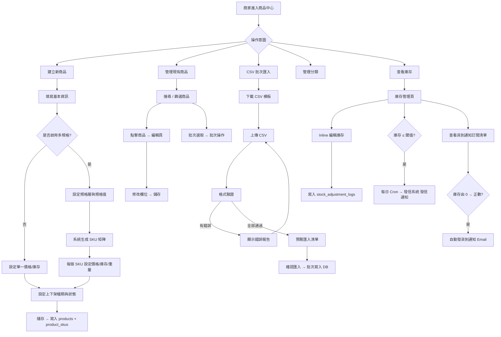
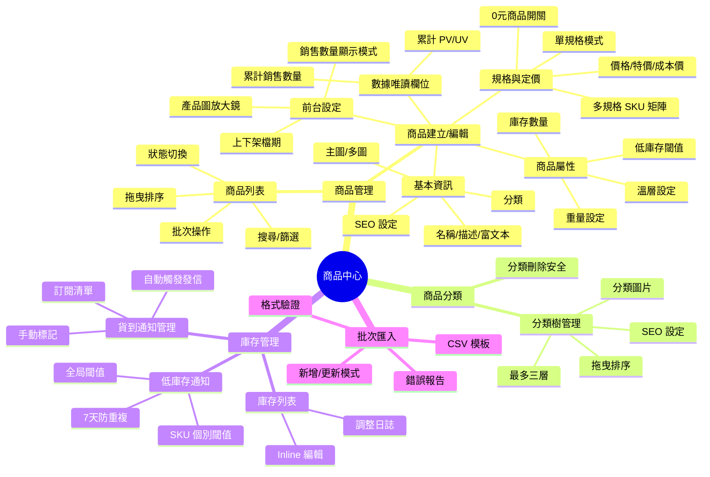
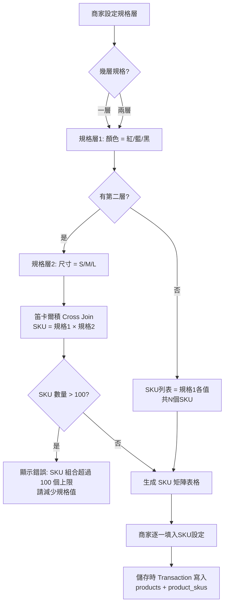
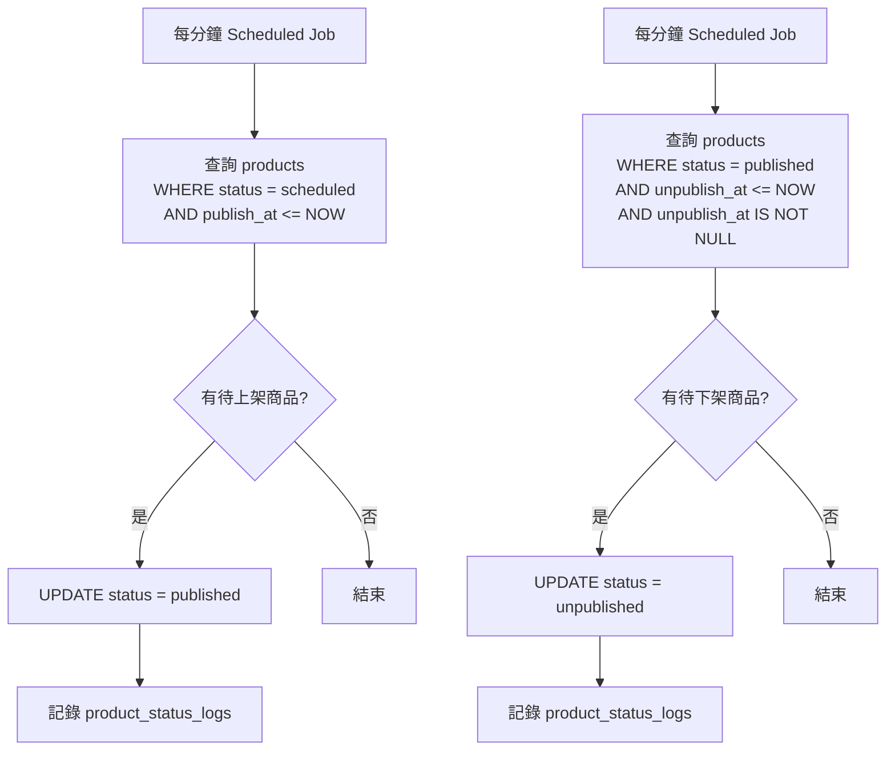
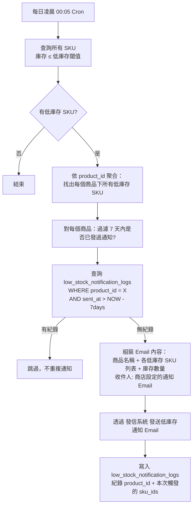
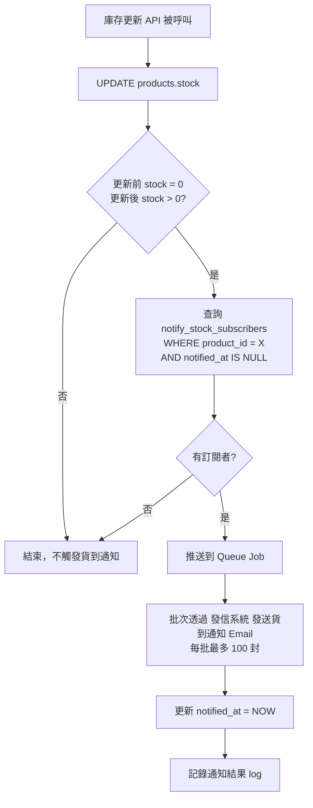

## 版本更新紀錄

| 版本 | 日期 | 修改內容 | 修改人 |
|------|------|----------|--------|
| v1.7 | 2026/05/29 | 依議題 2026-05-20-pv-track-rate-limit、2026-05-20-pv-visitor-id-source §8.5：補充 PV 計算規則——採兩層去重策略（30 分鐘去重視窗＋60 秒防刷保護），靠攏 GA4 / Shopify / 91APP 市場標準；visitor_id 採 first-party Cookie，符合業界普遍做法 | Una |
| v1.6 | 2026/05/29 | 依議題 2026-05-20-product-pending-order-definition §6.1 §8.2：移除商品刪除訂單阻擋邏輯，改採 Snapshot 模式；訂單成立時保留完整商品資訊，商品可隨時軟刪除；新增訂單圖片保留規則（媒體庫不得物理刪除已被訂單引用的圖片） | Una |
| v1.5 | 2026/05/28 | §8.5 技術規格改寫為業務資料規格：移除 SQL CREATE TABLE 語法，保留欄位業務說明、狀態值定義與業務規則；移除 API 路由標記；簡化工程師溝通摘要至業務需求層次 | Una |
| v1.4 | 2026/05/27 | 新增商品數量方案上限規格：電商啟航 1,000 件 / 進階電商包 2,500 件（含草稿）；新增 80% 警示、100% 禁新增防呆、CSV 匯入超限摘要規格 | Una |
| v1.3 | 2026/05/27 | 依議題 2026-05-20-product-status-enum-mapping §6.2 §8.5、2026-05-20-product-soft-delete-strategy §8.2 §8.5、2026-05-20-sku-code-uniqueness-scope §6.3 §8.5、2026-05-20-product-copy-scope §6.1、2026-05-20-product-slug-strategy §6.2、2026-05-20-product-sort-scope §6.1、2026-05-20-csv-image-import §6.6、2026-05-20-csv-mode-merge §6.6、2026-05-20-low-stock-notify-multi-sku-rule §7.3、2026-05-20-stock-notify-sku-vs-product §6.5 §8.5：10 筆商品中心議題決議更新 | Una |
| v1.2 | 2026/05/04 | §6.2 進階設定補齊溫層屬性 UI 規格（`<el-radio-group>` + Tooltip + 溫層 icon 說明）；§8.5 products 表新增 `temperature_layer`、`show_temp_label` 欄位；「數據分析」→「數據中心」名詞統一 | Claude（依廖紫茵授權產出）|
| v1.1 | 2026/05/01 | 新增電商商品 vs CMS 頁面路由架構差異說明（§6.2 callout + §6.6 CSV status 欄備注）；DB Schema `status` 欄位補充 published/unpublished/draft 說明 | Claude（依廖紫茵授權產出）|
| v1.0 | 2026/04/28 | 初稿建立 | 廖紫茵（Claude 依授權產出）|

# Evomni - 商品中心 產品需求文件 (PRD) v1.7

## 1. 文件資訊

| 屬性 | 內容 |
| --- | --- |
| 版本 | v1.7 |
| 日期 | 2026/05/29 |
| 需求來源 | Evomni 新電商系統 Master PRD v1.2（Part 2 P1 補寫）+ 後台左側導覽架構規劃 v1.0 |
| 文件狀態 | **P1 首次完整規格**（取代舊 PRD v3.2）— 涵蓋商品管理、多規格 SKU、分類管理、庫存管理、批次匯入、自動上下架、0元產品、產品圖放大鏡、瀏覽紀錄、貨到通知 |
| 相依 PRD | Part2_溫層重量運費設定_PRD.md（運費規則不在本文件，見附件 PRD）|
| 作者 | 廖紫茵（Claude 依授權產出）|
| 開發時程 | 階段一 5–8月（電商啟航方案）/ 階段二 9–12月（進階電商包）|

---

## 2. 目標與功能總覽

### 2.1 核心願景與相依性

**核心問題：** 商家需要一個結構清晰、操作流暢的商品管理後台，從單品建立、多規格 SKU 設定、分類整理、庫存追蹤到批次上架，全程不需要工程師介入。

**解決方案：** 打造「一頁完成商品設定」的直觀後台，支援最多兩層規格矩陣（最多 100 個 SKU 組合）、拖曳排序、自動上下架排程、CSV 批次匯入、低庫存自動通知，並整合貨到通知訂閱管理。

**Evomni 價值對應：** 商品中心是整個電商系統的資料源頭——訂單依賴商品庫存、行銷活動依賴商品設定、數據中心依賴商品 PV 與銷量。商品中心品質直接決定整個系統的可靠性。

**系統相依性：**
- `媒體庫`：所有商品圖片上傳、裁切、WebP 轉檔皆透過 媒體庫 API
- `發信系統 發信模組`：低庫存通知、貨到通知 Email 皆透過 發信系統 發送
- `Part 3 訂單管理`：下單時讀取 `products.stock`（原子扣減）
- `Part 4 行銷活動`：優惠活動依賴商品 ID 和分類 ID
- `Part 6 會員管理`：貨到通知訂閱關聯 `members.id`
- `Part2_溫層重量運費設定 PRD`：商品溫層欄位和重量欄位與運費計算串接

---

### 2.2 功能總覽表

> 商品中心覆蓋商品全生命週期——從建立、上架、銷售到下架，並包含商家日常的庫存監控與批次維護作業。

| 主功能模組 | 子功能項目 | 功能目的 | 功能詳細描述 | 影響之使用者 |
| --- | --- | --- | --- | --- |
| 商品管理 | 商品列表 | 商品總覽與快速操作 | 表格呈現所有商品，支援關鍵字搜尋、分類篩選、狀態篩選、批次上下架、批次刪除、拖曳排序 | 商家管理員 |
| 商品管理 | 商品建立 | 新增單一商品完整資料 | 設定商品名稱、描述（富文本）、主圖/多圖（最多10張）、價格、特價、成本價、SEO 標題/描述/關鍵字、商品狀態、上下架檔期、溫層設定、重量設定、0元商品開關；**方案上限：電商啟航 1,000 件 / 進階電商包 2,500 件**，達上限時禁止新增並提示升級 | 商家管理員 |
| 商品管理 | 商品編輯 | 修改已建立商品的任意欄位 | 與建立頁相同介面，額外顯示「建立時間」「最後修改時間」「累計銷售數量」「累計瀏覽數（PV）」唯讀欄位 | 商家管理員 |
| 商品管理 | 多規格 SKU | 設定多層規格並生成 SKU 矩陣 | 最多兩層規格（如顏色×尺寸），每個規格值可設定代表圖；系統自動生成所有 SKU 組合，每個 SKU 可獨立設定價格/特價/庫存/重量/SKU 編號；最多 10 個規格值/每層，最多 100 個 SKU 組合 | 商家管理員 |
| 商品管理 | 自動上下架檔期 | 預設商品上下架時間 | 設定「上架時間」和「下架時間」，系統在指定時間自動變更商品狀態；上架時間若留空則立即上架；下架時間若留空則永久上架 | 商家管理員 |
| 商品管理 | 前台銷售數量顯示 | 在前台商品頁顯示銷售量資訊 | 後台可選「顯示實際數字」「顯示『熱銷中』文字」「不顯示」三種模式；顯示數字時可設定起始基數（如已售 + 1000） | 商家管理員、消費者 |
| 商品管理 | 商品瀏覽紀錄 | 追蹤商品頁面 PV 與 UV | 後台每個商品詳情頁顯示近 30 天 PV/UV 趨勢折線圖；列表頁可依總 PV 排序；PV 數據每日凌晨批次彙整至 `product_stats` 表 | 商家管理員 |
| 商品管理 | 產品圖放大鏡 | 提升前台商品圖瀏覽體驗 | 消費者在商品頁 hover 主圖時觸發放大鏡效果，放大倍率固定 2x，放大視窗顯示在主圖右側；行動裝置則改為點擊放大至全螢幕燈箱（Lightbox） | 消費者 |
| 商品管理 | 0元商品設定 | 支援免費商品/贈品上架 | 進階電商包功能；商品定價允許設定為 0 元；結帳時不走金流，直接產生訂單；需設定「最大每人領取數量」（預設 1，最大 999）以防濫用；後台可設定 0 元商品是否需要登入才能購買 | 商家管理員、消費者 |
| 商品分類 | 分類管理 | 建立/編輯商品分類樹 | 最多三層分類（根 → 子 → 孫）；每個分類可設定名稱、SEO 標題、分類圖片、顯示/隱藏；拖曳調整同層排序；分類刪除時若有商品關聯，需選擇「移至未分類」或「取消關聯」 | 商家管理員 |
| 商品分類 | 分類排序 | 調整前台分類顯示順序 | 後台拖曳排序同層分類，即時儲存到 `categories.sort_order` 欄位；前台依 `sort_order ASC` 渲染 | 商家管理員 |
| 庫存管理 | 庫存查看與調整 | 統一管理所有 SKU 庫存 | 庫存管理頁以表格呈現所有商品（含 SKU 展開）的現有庫存量；支援直接在表格內編輯庫存數量（Inline Edit）；每次調整自動寫入 `stock_adjustment_logs`（含調整前/後數量、原因備註、操作人員） | 商家管理員 |
| 庫存管理 | 低庫存通知 | 自動通知商家補貨 | 商家可在「全域設定 > 電商進階設定 > 庫存警示門檻」設定全局低庫存閾值（預設 5）；每個商品/SKU 可覆寫個別閾值；每日凌晨 Cron 掃描庫存 ≤ 閾值的 SKU，透過 發信系統 發送 Email 通知商家；同一 SKU 7 天內只發一次通知 | 商家管理員 |
| 庫存管理 | 貨到通知管理 | 後台查看/管理消費者貨到通知訂閱 | 顯示訂閱特定商品「貨到通知」的會員清單；庫存由 0 補貨（`stock` 從 0 變為 >0）時，自動批次透過 發信系統 發送 Email 給所有訂閱者；後台可手動標記「已通知」；訂閱清單支援匯出 CSV | 商家管理員、消費者 |
| 批次匯入 | CSV 匯入商品 | 大量商品快速上架 | 提供 CSV 模板下載（含所有欄位說明）；上傳後系統進行格式驗證；顯示驗證結果（成功 N 筆 / 錯誤 N 筆 + 錯誤明細）；確認後才執行匯入；支援「新增模式」和「更新模式」（依商品 SKU 編號匹配更新現有商品） | 商家管理員 |
| 批次匯入 | 批次操作 | 對多個商品執行同一操作 | 列表頁勾選多個商品後，可批次執行：上架、下架、刪除（進軟刪除）、移動分類 | 商家管理員 |

---

## 3. 全局功能流程



**流程說明：**

商品建立是商品中心最核心的流程。進入建立頁後，商家先填寫基本資訊，接著決定是否啟用多規格。若啟用多規格，系統在商家設定規格層（如「顏色」「尺寸」）和規格值後，自動展開 SKU 矩陣供逐一設定價格與庫存。儲存時系統對 `products` 和 `product_skus` 兩張表進行 Transaction 寫入，確保資料一致。

---

## 4. 功能結構圖



---

## 5. 使用者故事

**作為商家管理員，** 我想要建立一個有兩層規格（顏色×尺寸）的商品，每個 SKU 可以設定不同售價和庫存，以便於提供完整的商品選擇而不需要建立多個單品。

**作為商家管理員，** 我想要預先設定商品的上下架時間，以便於在活動期間商品自動上架、活動結束後自動下架，不需要在凌晨手動操作。

**作為商家管理員，** 我想要在庫存低於設定值時自動收到 Email 通知，以便於即時補貨，不讓斷貨影響消費者購物。

**作為商家管理員，** 我想要上傳 CSV 批次匯入 100 個商品，以便於新店開張時快速完成商品上架，不需要逐一手動建立。

**作為商家管理員，** 我想要查看哪些消費者訂閱了某個缺貨商品的貨到通知，當補貨完成時系統自動發送通知，以便於快速轉換購買意願。

**作為消費者，** 我想要在商品頁 hover 圖片時能放大查看細節，以便於判斷商品品質再決定是否購買。

**作為消費者，** 我想要看到商品的銷售數量（如「已售 1,234 件」），以便於透過社會認同增加購買信心。

**作為商家管理員，** 我想要設定 0 元商品讓消費者免費領取贈品，以便於搭配行銷活動送出試用品，且可限制每人最多領取 1 件。

---

## 6. UI/UX 與詳細功能需求

### 6.1 商品列表頁

#### A. 核心使用者流程

商家進入商品中心 → 看到商品列表（預設顯示「全部」狀態，依「更新時間 DESC」排序） → 可搜尋/篩選/排序/批次操作 → 點擊商品名稱進入編輯頁，或點擊「+新增商品」進入建立頁。

#### B. 介面佈局與元件拆解（Figma Ready）

**頁面佈局：**
- 頁首：麵包屑（商品中心 > 商品管理） + 右上角「+ 新增商品」主要操作按鈕（`#303133`，`!rounded-none`）；商品數量接近或達上限時顯示提示（詳見商品數量上限規格）
- **商品數量上限規格：**
  - 電商啟航方案：上限 **1,000 件**；進階電商包：上限 **2,500 件**（含所有狀態：上架 / 下架 / 草稿）
  - 達 **80%** 時：列表頁頂部顯示 `<el-alert type="warning">` ：「您已建立 {N} 件商品，目前方案上限為 {上限} 件，建議考慮升級方案以繼續新增」
  - 達 **100%** 時：「+ 新增商品」按鈕變為 `disabled`；點擊時 Toast 提示：「已達方案商品數量上限（{上限} 件），請升級至 {下一方案} 以繼續新增商品」；列表頁頂部顯示 `<el-alert type="error">` 含升級 CTA 按鈕
  - CSV 批次匯入達上限時：匯入完成摘要顯示「已匯入 {N} 件，{M} 件因達方案上限未匯入」，並列出未匯入的商品名稱清單
- 篩選列：搜尋輸入框 + 分類下拉 + 狀態下拉 + 批次操作按鈕（Disabled 直到勾選商品）
- 商品列表：`<el-table>` 含勾選欄、主圖縮圖、商品名稱/SKU、分類、狀態 Tag、庫存數、售價、更新時間、操作欄
- 分頁：`<el-pagination>` 每頁 20 筆，顯示總筆數

**元件細節：**

| 元件 | 規格 |
| --- | --- |
| 搜尋框 | `<el-input>` Placeholder：「搜尋商品名稱、SKU 編號」；即時搜尋（debounce 300ms）；可按 Enter 觸發搜尋；清除按鈕（x icon）|
| 分類篩選 | `<el-select>` 顯示「所有分類」預設；下拉選項含縮排的三層分類樹；多選模式 |
| 狀態篩選 | `<el-select>` 選項：全部 / 已上架 / 已下架 / 草稿 / 已排程（含上下架時間） |
| 商品主圖縮圖 | 48×48px 正方形，`object-fit: cover`；無圖時顯示 `<el-icon><Picture /></el-icon>` 灰色佔位 |
| 狀態 Tag | `<el-tag class="!rounded-full">`：已上架=`success`；已下架=`info`；草稿=`warning`；已排程=`#409EFF` primary |
| 庫存欄 | 庫存 ≤ 全局低庫存閾值時，數字變紅色（`#F56C6C`）並加 `⚠` icon |
| 售價欄 | 若有特價則顯示「特價 發信系統$X」（紅字）+ 「原價 發信系統$Y」（刪除線）；0元商品顯示「免費」Tag |
| 操作欄 | 「編輯」文字按鈕（藍色）、「複製」icon 按鈕（Tooltip: 複製此商品，見下方複製範圍說明）、「刪除」icon 按鈕（紅色，二次確認）|
| 批次操作列 | 勾選後顯示：「已選 N 件商品」+ 批次按鈕（上架/下架/移至分類/刪除）；刪除顯示確認 Modal |

**批次操作 Dropdown 按鈕規格：**
- `<el-dropdown>` + `<el-button>` 觸發
- 下拉選項：批次上架 / 批次下架 / 移動分類（開 Drawer 選擇分類）/ 批次刪除（危險色）

**商品複製範圍規格（依議題 2026-05-20-product-copy-scope 決議）：**

點擊「複製」按鈕後，系統建立一份新商品草稿，複製以下欄位：

| 欄位 | 複製行為 |
| --- | --- |
| 商品名稱 | 複製並自動加上「-複製」後綴（如「棉質T恤-複製」）|
| 商品描述（富文本）| 完整複製 |
| 商品圖片（多圖 URL 參照）| 複製圖片參照連結（不重新上傳，參照相同媒體庫資源）|
| SEO 標題 | 複製並自動加上「-複製」後綴 |
| SEO 描述、SEO 關鍵字 | 完整複製 |
| Slug | 重新自動產生（不沿用原 slug，避免衝突）|
| SKU 規格選項名稱（如顏色、尺寸及規格值）| 完整複製 |
| SKU 售價、特價（compare_at_price）| 完整複製 |
| 商品分類歸屬 | 完整複製 |
| 溫層、重量、尺寸設定 | 完整複製 |
| 銷售數量顯示設定 | 完整複製 |

**不複製的欄位：**

| 欄位 | 說明 |
| --- | --- |
| SKU 編號（sku_code）| 留空，需手動填寫（sku_code 全域唯一，不允許重複）|
| 庫存數量 | 全部歸零（`stock = 0`）|
| 商品狀態 | 固定設為「草稿」（`draft`），不繼承原商品狀態 |
| 累計銷售量、瀏覽數 PV/UV | 歸零（新商品獨立計算）|

複製完成後：Toast 提示「商品已複製，已開啟新商品草稿」，並自動跳轉至新商品編輯頁。

**全局排序說明（依議題 2026-05-20-product-sort-scope 決議）：**

商品列表的拖曳排序為**全局排序**，使用單一 `products.sort_order` 欄位；不設分類內獨立排序。商家在商品列表中拖曳調整的順序會影響所有分類頁面的商品預設排列（各分類頁均依 `sort_order ASC` 呈現）。若需依不同條件篩選，支援狀態篩選後的顯示，但排序值為全局共用，不因分類篩選而獨立。

#### C. 互動設計、狀態與系統反饋

- 搜尋無結果：Empty State 圖示 + 「找不到符合的商品」文字 + 「清除篩選」Button
- 刪除確認 Modal：「確定要刪除「{商品名稱}」嗎？此操作無法復原。商品將進入回收狀態，歷史訂單資料不受影響（訂單成立時已快照完整商品資訊）。」確認按鈕為 `danger` 色

#### D. 防呆機制與錯誤預防

- 刪除有庫存的商品需二次確認
- 下架已排程商品時彈出提示：「此商品已設定自動上架時間（{日期}），下架後將清除排程。確定要繼續嗎？」

---

### 6.2 商品建立/編輯頁

#### A. 核心使用者流程

點擊「+新增商品」→ 進入商品建立頁（左側主要資訊，右側輔助設定面板）→ 填寫必填欄位 → 決定是否啟用多規格 → 設定庫存 → 設定上架狀態或排程 → 儲存。

#### B. 介面佈局與元件拆解（Figma Ready）

**頁面整體佈局：**
- 頂部：麵包屑（商品中心 > 新增商品 / 編輯：{商品名稱}）+ 右上角操作列（「儲存草稿」次要按鈕 + 「儲存並上架」主要按鈕）
- 左側主欄（寬度約 70%）：基本資訊 → 商品圖片 → 富文本描述 → 規格與定價 → SEO 設定
- 右側輔助欄（寬度約 30%）：商品狀態卡片 → 上下架檔期 → 商品分類 → 銷售數量顯示設定 → 進階設定（0元商品/溫層/重量）

**左側主欄元件：**

| 區塊 | 元件 | 規格 |
| --- | --- | --- |
| 基本資訊 | 商品名稱 | `<el-input>` Required；Placeholder：「請輸入商品名稱（最多 100 字）」；字元計數 0/100；超過時邊框變 `#F56C6C`，提示文字「商品名稱不可超過 100 個字元」|
| 基本資訊 | 商品簡短說明 | `<el-input type="textarea">` Optional；Placeholder：「選填，顯示於商品列表卡片下方（最多 200 字）」；字元計數 |
| 商品圖片 | 主圖上傳 | 呼叫 媒體庫 API；正方形拖放區（200×200px 預覽）；支援 JPG/PNG/WebP；最大 10MB；自動轉 WebP；上傳成功後顯示縮圖；可重新上傳；Required |
| 商品圖片 | 多圖上傳 | 最多 9 張附圖（含主圖共 10 張）；橫向縮圖列表；拖曳調整順序；每張都可刪除；點擊縮圖放大預覽 |
| 富文本描述 | 商品詳細說明 | 富文本編輯器（支援標題 H2/H3、粗體、斜體、列表、圖片插入（呼叫 媒體庫）、YouTube 嵌入、表格）；Placeholder：「請輸入商品詳細說明…」|
| SEO 設定 | SEO 標題 | `<el-input>` Placeholder：「留空則自動使用商品名稱」；字元計數 0/70；超出 60 字時變黃色警告：「建議 SEO 標題在 60 字元內」|
| SEO 設定 | SEO 描述 | `<el-input type="textarea">` Placeholder：「留空則自動截取商品說明前 160 字」；字元計數；超出 160 字警告 |
| SEO 設定 | SEO 關鍵字 | `<el-input>` Placeholder：「多個關鍵字以逗號分隔」|
| SEO 設定 | 商品網址 Slug | `<el-input>` 系統在商品名稱儲存時自動產生（轉換規則由工程師定義，如轉拼音或數字 ID）；允許商家手動修改；若與現有 slug 衝突，系統自動在末尾加流水號（如 `cotton-tee-2`）防止重名。Placeholder：「系統自動產生，可手動修改」；儲存後顯示完整前台 URL 預覽（如 `https://store.example.com/products/cotton-tee`）（依議題 2026-05-20-product-slug-strategy 決議）|

**右側輔助欄元件：**

| 區塊 | 元件 | 規格 |
| --- | --- | --- |
| 商品狀態 | 狀態切換 | `<el-select>`；選項：草稿（`draft`）/ 已上架（`published`）/ 已下架（`unpublished`）/ 排程（`scheduled`，系統設定上下架時間後自動套用）；預設「草稿」（新商品）。**注意：** 此狀態對應電商擴充表的 `ec_status`，與 CMS 形象站的 `basic_data.inuse` 完全獨立（依議題 2026-05-20-product-status-enum-mapping 決議）：draft=從未對外發布、published=現行已上架、unpublished=曾上架後手動下架、scheduled=已設定定時上下架 |
| 上下架檔期 | 上架時間 | `<el-date-picker type="datetime">`；Placeholder：「立即上架（留空）」；設定時間後狀態自動切換為「已排程」|
| 上下架檔期 | 下架時間 | `<el-date-picker type="datetime">`；Placeholder：「永久上架（留空）」；下架時間必須晚於上架時間，否則顯示「下架時間必須晚於上架時間」|
| 商品分類 | 分類選擇 | `<el-tree-select>` 多選；顯示三層分類樹；可不選（商品進「未分類」）|
| 銷售數量顯示 | 顯示模式 | `<el-select>` 選項：不顯示 / 顯示實際數字 / 顯示「熱銷中」文字；預設「不顯示」|
| 銷售數量顯示 | 起始基數 | 當模式為「顯示實際數字」時出現；`<el-input-number>` min=0，預設 0；Tooltip：「前台顯示數量 = 實際銷售量 + 此基數，用於初期商品增加社會認同感」|
| 進階設定 | 溫層屬性 | `<el-radio-group>`；選項：常溫 / 冷藏（7°C 以下）/ 冷凍（-18°C 以下）；預設「常溫」；Tooltip（`<el-tooltip>`）：「溫層屬性影響結帳時的運費計算，請至 全域設定 > 金物流串接 > 物流與運費 > 溫層運費規則 完成費率設定」；選擇冷藏/冷凍後商品頁顯示溫層 icon（❄️ 冷凍 / 🌡️ 冷藏）|
| 進階設定 | 溫層說明（前台顯示）| `<el-switch>` 預設 ON（當溫層為冷藏/冷凍時）；標籤：「在商品頁顯示溫層標示」；常溫商品此選項隱藏 |
| 進階設定 | 0元商品 | `<el-switch>` 預設關閉；標籤：「設為免費商品（0 元）」；啟用後隱藏所有價格輸入欄，並顯示「每人最大領取數量」設定；僅進階電商包顯示此選項（啟航方案顯示鎖頭 icon + 「需升級進階電商包」）|
| 進階設定 | 0元每人限量 | `<el-input-number>` min=1，max=999，預設 1；Tooltip：「限制每個會員帳號最多領取幾件，防止濫用」|
| 進階設定 | 0元是否需登入 | `<el-switch>` Tooltip：「開啟後，消費者需登入才能加入購物車免費領取」|

> **📌 架構差異說明（與形象網站不同）：**
>
> **電商商品的前台路由由「上架狀態」直接決定，不需加入選單管理。** 這與形象網站（CMS）的設計邏輯不同：
>
> | 狀態 | 形象網站（CMS 頁面） | 電商商品 |
> |---|---|---|
> | 草稿 | 無前台路徑（未加入選單） | `/products/{slug}` 返回 404 |
> | 已上架 | 需手動加入選單管理才有前台路徑 | `/products/{slug}` 自動啟用，消費者可瀏覽與購買 |
> | 已下架 | 從選單移除後路徑失效 | `/products/{slug}` 保留頁面，顯示「此商品目前無法購買」，不可加入購物車；SEO 權重保留 |
>
> **原因：** 電商商品是「交易型內容」，上架即代表商家宣告此商品可銷售，URL 存在與否不需另一層選單管理決定。CMS 頁面是「導覽型內容」，由設計師透過選單管理決定哪些頁面出現在網站架構中。

#### C. 互動設計、狀態與系統反饋

- 離開頁面前若有未儲存變更，顯示瀏覽器確認對話框：「您有未儲存的變更，確定要離開嗎？」
- 儲存成功：`<el-message>` Toast（`success`）：「商品已儲存」；若為「儲存並上架」則顯示：「商品已上架，消費者現在可以看到此商品」
- 儲存失敗：`<el-message>` Toast（`error`）：「儲存失敗，請重試。若問題持續發生請聯繫客服。」
- 圖片上傳進行中：圖片區域顯示進度條 + 百分比數字

#### D. 防呆機制與錯誤預防

- 商品名稱為 Required，儲存時未填則邊框變紅 + 頁面滾動到第一個錯誤欄位 + 顯示「請填寫商品名稱」
- 主圖為 Required，儲存時未上傳則圖片區域顯示紅色邊框 + 「請上傳商品主圖」
- 0元商品啟用時若價格欄位有值，系統自動清空並 Toast 提示：「已啟用免費商品模式，價格設定已清除」

---

### 6.3 多規格 SKU 設定區塊

#### A. 核心使用者流程

在商品建立/編輯頁的「規格與定價」區塊 → 預設為單規格模式（顯示價格/特價/成本價/庫存） → 勾選「啟用多規格」→ 出現規格設定區 → 新增規格層（如「顏色」）→ 輸入規格值（如「紅色, 藍色, 黑色」）→ 可選上傳各規格值的代表圖 → 新增第二層規格（如「尺寸」）→ 系統自動生成 SKU 矩陣 → 逐一或批次設定 SKU 的價格/庫存。

#### B. 介面佈局與元件拆解（Figma Ready）

**單規格模式（預設）：**

| 元件 | 規格 |
| --- | --- |
| 售價 | `<el-input-number>` Required；prefix 顯示「發信系統$」；min=0；步進 1；Placeholder「0」；0元商品啟用時隱藏 |
| 特價 | `<el-input-number>` Optional；prefix 顯示「發信系統$」；特價必須 < 售價，否則顯示「特價必須低於售價」|
| 成本價 | `<el-input-number>` Optional；Tooltip：「成本價不會顯示於前台，僅用於後台毛利計算」；prefix 顯示「發信系統$」|
| 庫存數量 | `<el-input-number>` min=0；Placeholder「0」；Tooltip：「設為 0 時前台顯示為「售完」」|
| 低庫存閾值 | `<el-input-number>` Optional；Placeholder：「使用全局設定（N）」；Tooltip：「低於此數量時發送低庫存通知 Email」|
| SKU 編號 | `<el-input>` Optional；Placeholder：「商品貨號（選填）」；最多 64 字元 |
| 重量 | `<el-input-number>` Optional；suffix「公斤」；保留 3 位小數（`DECIMAL(8,3)`）；Tooltip：「用於重量運費計算，留空則不啟用重量運費」|

**多規格模式（啟用後）：**

| 元件 | 規格 |
| --- | --- |
| 啟用多規格 Toggle | `<el-switch>` 標籤：「啟用多規格（如顏色、尺寸）」；開啟時將現有單規格庫存數據清空並彈出確認 |
| 規格層新增 | `<el-button class="!rounded-none">` 文字：「+ 新增規格層」；最多新增 2 層；超過 2 層時 Button Disabled + Tooltip：「最多設定兩層規格」|
| 規格層名稱 | `<el-input>` Placeholder：「規格名稱（如：顏色）」；Required；最多 20 字 |
| 規格值輸入 | 動態 Tag 輸入模式（輸入後按 Enter 或逗號確認）；`<el-tag class="!rounded-full">` 每個規格值可刪除；最多 10 個規格值/每層；超過 10 個顯示：「每層最多 10 個規格值」|
| 規格值圖片 | 每個規格值右側有「上傳圖片」icon；點擊呼叫 媒體庫 API 上傳；上傳後 Tag 左側顯示 16×16px 縮圖；Tooltip：「規格代表圖顯示於前台規格選擇器旁」|
| SKU 矩陣表格 | `<el-table>` 自動生成所有排列組合（規格值1 × 規格值2）；每列一個 SKU；每列可輸入：SKU 編號 / 售價 / 特價 / 庫存 / 重量 |
| SKU 矩陣批次填入 | 表格上方「批次填入」工具列：選擇欄位（售價/特價/庫存）+ 輸入值 + 「套用至所有 SKU」Button；Tooltip：「可快速為所有 SKU 設定相同的售價或庫存，再個別調整不同的項目」|
| SKU 啟用/停用 | 每個 SKU 列最後一欄：Toggle；關閉時前台該規格組合顯示為「無此選項」（不顯示於選擇器）|

**SKU 矩陣範例（顏色×尺寸）：**

| SKU 編號 | 顏色 | 尺寸 | 售價（發信系統$）| 特價（發信系統$）| 庫存 | 重量（kg）| 啟用 |
| --- | --- | --- | --- | --- | --- | --- | --- |
| TS-RED-S | 紅色 | S | 890 | 790 | 50 | 0.3 | ✅ |
| TS-RED-M | 紅色 | M | 890 | 790 | 80 | 0.35 | ✅ |
| TS-BLK-S | 黑色 | S | 890 | — | 0 | 0.3 | ✅ |

#### C. 互動設計、狀態與系統反饋

- 刪除規格值時若已有 SKU 矩陣：彈出確認對話框「刪除「紅色」規格值將同時刪除 3 個 SKU 組合，相關庫存資料將清除。確定繼續？」
- SKU 數量 > 50 時在矩陣上方顯示黃色提示：「您目前有 {N} 個 SKU 組合，建議考慮是否合併規格值以簡化管理」
- SKU 矩陣表格所有欄位支援 Tab 鍵切換聚焦，提升鍵盤操作效率

#### D. 防呆機制與錯誤預防

- 規格層名稱不可重複（如兩個「顏色」）：即時驗證，出現重複時邊框紅色 + 「規格名稱已存在，請使用不同名稱」
- 規格值不可在同一層內重複（如兩個「紅色」）：即時驗證提示
- SKU 售價為 Required（多規格模式）：儲存時若有 SKU 未填售價，滾動到矩陣並 highlight 空白格
- **SKU 編號全域唯一（依議題 2026-05-20-sku-code-uniqueness-scope 決議）**：SKU 編號在整個電商系統內全域唯一（不限同商品內）；輸入 SKU 編號時即時呼叫 API 驗證，若已被其他商品使用，即時顯示紅色邊框 + 「此 SKU 編號已被使用，請輸入不同的編號」；儲存時再做一次後端唯一性確認，衝突時回傳 `422` 錯誤並指出衝突的 SKU 列

---

### 6.4 商品分類管理

#### A. 核心使用者流程

進入「商品中心 > 商品分類」→ 看到分類樹列表 → 可新增根分類 → 展開後可在其下新增子分類（最多三層）→ 拖曳調整同層排序 → 點擊分類名稱進入編輯頁（名稱/圖片/SEO/顯示狀態）。

#### B. 介面佈局與元件拆解（Figma Ready）

**分類管理頁面佈局：**
- 頁首：麵包屑 + 右上角「+ 新增根分類」Button
- 分類樹：`<el-tree>` 可展開/收合；左側拖曳把手圖示；每個節點顯示：分類名稱 + 商品數量 Badge + 顯示/隱藏 Toggle + 操作按鈕（編輯/新增子分類/刪除）
- 分類層級：以縮排視覺化三層結構；層級1 字體 `font-weight: 600`；層級2 縮排 16px；層級3 縮排 32px

**分類節點操作按鈕：**
- 「編輯」→ 右側 Drawer 開啟（不跳頁，保持分類樹可見）
- 「新增子分類」→ 在該節點下建立子節點（若已三層則 Disabled + Tooltip「最多三層分類」）
- 「刪除」→ 確認對話框，選擇商品處理方式

**分類編輯 Drawer（600px 寬）：**

| 元件 | 規格 |
| --- | --- |
| 分類名稱 | `<el-input>` Required；Placeholder「請輸入分類名稱（最多 50 字）」|
| SEO 標題 | `<el-input>` Placeholder「留空則使用分類名稱」|
| SEO 描述 | `<el-input type="textarea">` |
| 分類圖片 | 呼叫 媒體庫 API；矩形區域（建議尺寸：600×300px）；Tooltip「顯示於前台分類頁頂部」|
| 顯示/隱藏 | `<el-switch>` 標籤：「在前台顯示此分類」；Tooltip「隱藏後前台分類選單不顯示，但已分類商品仍可透過直接連結存取」|

#### C. 互動設計、狀態與系統反饋

- 拖曳排序：拖曳完成後自動儲存新順序，Toast：「分類順序已更新」
- 拖曳跨層（企圖將層級1分類拖入層級2下方）：系統阻止並恢復原位，Toast：「不支援跨層拖曳，請在同層內調整順序」

#### D. 防呆機制與錯誤預防

**刪除分類確認對話框：**

```
確定要刪除「{分類名稱}」嗎？

此分類目前有 {N} 件商品。請選擇商品的處理方式：
○ 將商品移至「未分類」
○ 取消關聯（商品保留，僅移除此分類標籤）

[取消]  [確定刪除]
```

若分類有子分類，則提示：「此分類有 {N} 個子分類，刪除父分類將同時刪除所有子分類。子分類中共有 {M} 件商品需要處理。」

---

### 6.5 庫存管理頁

#### A. 核心使用者流程

進入「商品中心 > 庫存管理」→ 看到所有商品/SKU 的庫存總覽表 → 可依商品名稱搜尋、依低庫存篩選 → 點擊商品列展開查看各 SKU 庫存 → Inline 修改庫存數量 → 自動記錄 `stock_adjustment_logs`。

#### B. 介面佈局與元件拆解（Figma Ready）

**庫存管理表格：**

| 欄位 | 說明 |
| --- | --- |
| 商品名稱（可展開） | 左側展開箭頭 icon；展開後顯示各 SKU 行 |
| SKU（展開後） | 顯示規格組合（如「紅色 / M」）或單品 SKU 編號 |
| 現有庫存 | 數字；低庫存時顯示 `⚠ {N}（低庫存）`（紅色）|
| 低庫存閾值 | 顯示套用中的閾值（若 SKU 有個別設定顯示個別值，否則顯示「全局: {N}」）|
| Inline 編輯 | 點擊庫存數字進入編輯模式：顯示 `<el-input-number>` + 「備註（選填）」輸入框 + 確認/取消 icon；按 Enter 確認，按 Escape 取消 |
| 調整記錄 | 每行最右側「查看紀錄」Button → 開啟 Drawer 顯示此 SKU 的 `stock_adjustment_logs`（時間/調整前後數量/操作人員/備註）|

**低庫存篩選 Tab：**
- Tab 列：全部商品 / ⚠ 低庫存（N）/ 售完（庫存=0）
- 「低庫存」Tab 顯示所有庫存 ≤ 閾值的 SKU，方便批次處理

**貨到通知管理 Sub-Tab（在庫存管理頁內）：**

| 欄位 | 說明 |
| --- | --- |
| 商品名稱 | 有訂閱貨到通知的商品（庫存 = 0 才會有訂閱）|
| 訂閱人數 | 共 N 位會員訂閱 |
| 訂閱清單 | 點擊展開：顯示各訂閱者的 Email / 訂閱時間 |
| 通知狀態 | 「待通知」（庫存仍 = 0）/ 「已自動通知」（補貨後自動發送）/「已手動標記」|
| 操作 | 「手動發送通知」Button（已通知者 Disabled）；「匯出訂閱清單」Button → CSV |

**前台貨到通知訂閱粒度（依議題 2026-05-20-stock-notify-sku-vs-product 決議）：**

| 商品類型 | 前台訂閱行為 |
| --- | --- |
| 多規格商品 | 消費者訂閱**特定 SKU**（如「紅色 / M」），`notify_stock_subscribers.sku_id` 儲存具體 SKU ID；補貨觸發條件為該 SKU 的 `stock` 從 0 → > 0 |
| 單規格商品 | 消費者訂閱**商品層級**，`notify_stock_subscribers.sku_id` 為 NULL；補貨觸發條件為商品唯一 SKU 的庫存從 0 → > 0 |

後台貨到通知管理頁的「訂閱清單」中，多規格商品的訂閱者會顯示所訂閱的具體規格（如「紅色 / M」），方便商家了解哪個規格最受關注。

#### C. 互動設計、狀態與系統反饋

- Inline 編輯確認後 Toast：「庫存已更新（{調整前} → {調整後}），已記錄調整日誌」
- 貨到通知自動觸發條件：SKU 庫存從 0 變為 > 0 時，觸發 Queue Job 批次發送貨到通知 Email（透過 發信系統）；依訂閱粒度（SKU 層或商品層）篩選訂閱者；Job 完成後更新 `notify_stock_subscribers` 的 `notified_at`

#### D. 防呆機制與錯誤預防

- 庫存調整不允許輸入負數（`min=0`）
- 直接將庫存設為 0 時顯示確認：「將庫存設為 0 後，前台此商品將顯示為「售完」，消費者無法加入購物車。確定繼續？」

---

### 6.6 CSV 批次匯入

#### A. 核心使用者流程

進入商品列表頁 → 點擊「批次匯入」Button → 開啟匯入 Dialog → 下載 CSV 模板 → 填寫後上傳 → 查看驗證結果 → 確認匯入。

#### B. 介面佈局與元件拆解（Figma Ready）

**匯入 Dialog（寬度 720px）：**

**步驟 1 — 上傳檔案：**
- 「下載 CSV 模板」Button（`secondary`，icon: download）
- 拖放上傳區：「將 CSV 檔案拖放於此，或點擊選擇檔案」；支援 `.csv` 檔案；最大 10MB
- 模式選擇：`<el-radio-group>` 「新增模式（全部新增）」/ 「更新模式（依 SKU 編號匹配，新增不存在的，更新已存在的）」
  - **更新模式採 patch 語意（依議題 2026-05-20-csv-mode-merge 決議）**：只更新 CSV 中有填寫的欄位，未填寫的欄位保留資料庫原值，不清空。例如 CSV 僅填 `stock` 欄，則其他欄位（`special_price`、`weight` 等）維持原本資料不變。
- 「下一步」Button

**步驟 2 — 驗證結果：**

若有錯誤：
```
驗證完成：共 200 筆資料
✅ 可匯入：185 筆
❌ 有誤：15 筆（將跳過）

錯誤明細：
第 23 列：售價欄位為空（商品名稱：女款花漾T恤）
第 45 列：分類「春夏新品」不存在，請先建立分類
第 67 列：SKU 編號重複（TS-RED-M 已存在於系統）
... [展開查看全部 15 筆錯誤]
```

「繼續匯入（跳過錯誤）」Button + 「取消」Button + 「下載錯誤報告」Button（CSV）

**步驟 3 — 完成：**
- 成功圖示 + 「已成功匯入 185 件商品」
- 「查看已匯入商品」Button + 「關閉」Button

**CSV 模板欄位說明：**

| 欄位 | 必填 | 說明 |
| --- | --- | --- |
| product_name | ✅ | 商品名稱 |
| description | ❌ | 純文字描述（不支援 HTML）|
| category_name | ❌ | 分類名稱（必須與後台分類完全匹配）|
| price | ✅ | 售價（整數，0=免費，進階方案）|
| special_price | ❌ | 特價（整數，必須 < price）|
| cost_price | ❌ | 成本價 |
| sku_code | ❌ | SKU 編號（更新模式必填）|
| stock | ✅ | 庫存數量（整數，最小 0）|
| weight_kg | ❌ | 重量（小數，如 0.5）|
| temperature_layer | ❌ | 溫層（常溫/冷藏/冷凍）|
| primary_image_url | ❌ | 商品主圖（選填）；**僅接受媒體庫內的圖片路徑**（如 `/media/products/xxx.webp`），不接受外部 URL；欄位為空時商品匯入後自動設為草稿狀態（`draft`），主圖必填驗證僅在商品發布時觸發，不影響匯入本身（依議題 2026-05-20-csv-image-import 決議）|
| status | ❌ | 狀態（`published`=已上架 / `unpublished`=已下架 / `draft`=草稿，預設 draft）；**此欄位直接決定前台路由是否啟用，不需加入選單管理**（與 CMS 形象網站架構不同，詳見 §6.2 架構差異說明）|
| spec1_name | ❌ | 第一層規格名稱（如：顏色）|
| spec1_value | ❌ | 第一層規格值（如：紅色）|
| spec2_name | ❌ | 第二層規格名稱（如：尺寸）|
| spec2_value | ❌ | 第二層規格值（如：M）|

> 多規格商品需重複多列（同商品名稱，不同規格值）

#### C. 互動設計、狀態與系統反饋

- 上傳後立即顯示進度條；驗證耗時較長時（>3 秒）顯示 Loading 動畫 + 「正在驗證資料，請稍候…」
- 匯入完成後若有跳過的錯誤列，Toast 顯示：「批次匯入完成。185 件商品已匯入，15 件因格式錯誤已略過。可下載錯誤報告查看詳情。」

#### D. 防呆機制與錯誤預防

- 非 CSV 格式顯示：「請上傳 .csv 格式的檔案」
- 超過 10MB 顯示：「檔案大小超過 10MB，請分批上傳」
- 空白 CSV 顯示：「CSV 檔案沒有資料，請檢查後重試」

---

## 7. 細部邏輯流程圖

### 7.1 多規格 SKU 生成邏輯



### 7.2 自動上下架排程邏輯



### 7.3 低庫存通知觸發邏輯

**決議（依議題 2026-05-20-low-stock-notify-multi-sku-rule）：** 任一 SKU 庫存低於閾值即觸發通知，不需等所有 SKU 都低。通知 Email 以**商品為單位聚合**，列出具體哪幾個 SKU 及其當前庫存數量。



**Email 內容格式（示例）：**
```
主旨：⚠ 低庫存提醒 — 棉質T恤 有 3 個 SKU 需要補貨

商品：棉質T恤
以下規格庫存不足，請留意補貨：

  • 紅色 / S：剩餘 2 件（閾值：5）
  • 紅色 / M：剩餘 3 件（閾值：5）
  • 黑色 / S：剩餘 1 件（閾值：5）

前往後台管理庫存 →
```

### 7.4 貨到通知觸發邏輯



---

## 8. 非功能性需求

### 8.1 效能需求

| 指標 | 目標 |
| --- | --- |
| 商品列表頁載入（100 件商品）| ≤ 1 秒 |
| 商品建立/儲存 API 回應時間 | ≤ 500ms |
| CSV 批次匯入（200 筆）| ≤ 30 秒（後台 Job 處理，前台輪詢）|
| SKU 矩陣渲染（100 個 SKU）| ≤ 300ms（前端 Vue 渲染）|
| 圖片上傳（媒體庫 API）| ≤ 5 秒（10MB 以內）|
| 分類樹載入 | ≤ 500ms（最多 3 層 × 50 個節點）|

### 8.2 安全性需求

- 商品 API 全部需驗證 JWT Token（商家身份）
- 商品圖片上傳透過後端轉發至 媒體庫 API，不允許前端直接呼叫 （防止未授權上傳）
- CSV 匯入內容進行 XSS 清除（特別是 description 欄位）
- SKU 庫存調整寫入 `stock_adjustment_logs` 留存審計軌跡（不可刪除）
- **商品軟刪除採電商擴充表策略（依議題 2026-05-20-product-soft-delete-strategy 決議）：** 於 `product_ec_extensions` 新增 `ec_deleted_at` 欄位記錄刪除時間，不動 CMS 主表 `basic_data`；不提供復原功能；商品列表查詢時篩選 `ec_deleted_at IS NULL`（技術側實作細節待確認）
- **商品刪除不設訂單阻擋，改採 Snapshot 模式（依議題 2026-05-20-product-pending-order-definition 決議）：** 訂單成立時即保留下單當下的完整商品資訊（名稱、規格、售價、圖片等），商品軟刪除後歷史訂單與退換貨流程均不受影響。與 Shopify、Shopline、Magento 業界做法一致。
- **訂單圖片保留規則：** 訂單成立後，商品圖片需維持可瀏覽。媒體庫刪除圖片前，應確認該圖片是否被歷史訂單引用；若有引用，不允許物理刪除。

### 8.3 資料一致性

- 商品庫存扣減使用 `SELECT ... FOR UPDATE` 悲觀鎖（與訂單管理 PRD §8.5.1 一致）
- 多規格商品的 `products` 和 `product_skus` 寫入在同一 Transaction 內
- 分類刪除時商品關聯更新也在同一 Transaction 內
- 商品 `total_sold` 欄位由訂單完成後的 Event 更新（非即時，延遲 ≤ 1 分鐘）

### 8.4 瀏覽器/裝置支援

- 後台：Chrome / Edge / Safari 最近兩版；最小解析度 1280px 寬；不支援 IE
- 前台商品頁（放大鏡/貨到通知訂閱）：支援 iOS Safari、Android Chrome；放大鏡在行動裝置改為 Lightbox

### 8.5 核心資料規格

**商品主表**

| 欄位 | 業務說明 |
|------|---------|
| cms_product_id | CMS 商品橋接欄位；純電商自建商品可為空，不強制對應 CMS 商品 |
| slug | 商品固定網址；系統自動產生，允許手動修改；重名時系統自動加流水號 |
| 溫層 | 三種值：`normal`（常溫）/ `cold`（冷藏）/ `frozen`（冷凍）；影響運費計算，詳見溫層重量運費設定 PRD |
| 前台溫層 icon 顯示 | 開關；控制商品頁是否顯示溫層標示 |
| 0元商品 | 開關 + 每人最大領取數量 + 是否要求登入；詳見 §6 0元商品規格（進階電商包限定）|
| 銷售數量顯示模式 | 三種值：`none`（不顯示）/ `count`（顯示實際銷售數量）/ `hot`（顯示「熱賣中」）|
| 銷售基數 | 前台銷售數字的加成值，供新品冷啟動期使用（商家可設定）|
| 累計銷售數量 | 非即時計算，用於排序與統計參考 |

**電商上架狀態**

商品在電商的上架狀態與 CMS 狀態完全獨立，互不影響。四種值：

| 狀態值 | 說明 |
|--------|------|
| `draft` | 草稿，從未對外發布 |
| `published` | 已上架，現行開放購買 |
| `unpublished` | 已下架，曾上架後手動停售 |
| `scheduled` | 排程中，已設定定時上下架時間 |

電商刪除為標記刪除（軟刪除），不物理移除資料，且不提供復原功能。

**SKU 規格**

| 欄位 | 業務說明 |
|------|---------|
| SKU 代碼 | 全域唯一，跨商品不允許重複（依議題 2026-05-20-sku-code-uniqueness-scope 決議）|
| 規格值 | 儲存多規格組合，如：顏色=紅色、尺寸=M |
| 定價 / 特價 / 成本價 | 特價為空時前台顯示定價；成本價僅後台可見 |
| 低庫存門檻 | 可個別設定；未設定時沿用全域設定（全域設定 > 庫存警示門檻）|
| 重量 | 用於運費計算，詳見溫層重量運費設定 PRD |

**庫存異動紀錄**

每次庫存變動皆自動記錄異動前後數量、調整量（可為負）、原因與操作來源，供稽核與對帳使用。此紀錄僅供新增，不提供刪除。

來源四種值：`manual`（手動調整）/ `order`（訂單扣減）/ `return`（退貨回補）/ `import`（CSV 匯入）

**商品統計**

每日批次彙整每支商品的瀏覽數（PV）、不重複訪客數（UV）、加入購物車數，供數據中心商品分析使用。

**PV 計算規則（依議題 2026-05-20-pv-track-rate-limit、2026-05-20-pv-visitor-id-source 決議）**

PV 的語意為「一次商品瀏覽意圖」，而非「一次 HTTP 請求」，採兩層去重策略，靠攏 GA4、Shopify、91APP 市場標準：

**PV 去重視窗**
- 同一使用者 + 同一商品，**30 分鐘內只計 1 次 PV**（視窗定義來自 GA4 Session，業界普遍沿用）
- 超過 30 分鐘再次進入同一商品頁，計為新的一次瀏覽意圖
- 使用者識別優先順序：已登入會員 > 訪客 Cookie > IP（僅備援）

**訪客識別方式**
- 未登入訪客以 **first-party Cookie** 識別，與 GA4 機制一致
- 同一瀏覽器清除 Cookie 後視為新訪客，為業界折衷標準

**防刷保護**
- 同一使用者對同一商品，**60 秒內重複請求靜默丟棄**，不計入統計（此為請求保護層，與去重視窗各自獨立）
- 同一 IP 短時間大量請求（60 秒超過 20 次），靜默丟棄；IP 僅作輔助風控，不作主要計數依據，避免誤傷 NAT 後多用戶

**前台觸發行為**
- 商品詳情頁**僅在首次載入時觸發**瀏覽紀錄，重新整理不重複計算（由防刷保護機制兜底）

**貨到通知訂閱**

記錄消費者「到貨通知」訂閱資訊（依議題 2026-05-20-stock-notify-sku-vs-product 決議）：
- 多規格商品：訂閱對象為特定 SKU
- 單規格商品：訂閱對象為商品層級

庫存從 0 回補後寄出通知並記錄通知時間，避免重複發送。

---

## 與團隊溝通摘要

- 這次的規格是關於**商品中心（Part 2）**，是整個電商系統的資料源頭，訂單/行銷/數據全都依賴商品資料，這個模組品質很重要
- **工程師這邊需要注意**：多規格 SKU 建立與商品主資料需保持一致性；庫存扣減邏輯與 Part 3 訂單管理共用，請對齊；自動上下架為排程觸發，請確認排程機制正常運作
- **設計師這邊需要注意**：商品建立頁是「左主欄 + 右輔助欄」兩欄佈局；多規格 SKU 矩陣是這頁最複雜的元件，每個 SKU 列要能 Inline 輸入價格和庫存，手機版降格為 Accordion 展示；商品列表的低庫存警告用紅色 `#F56C6C` + ⚠ icon
- **這個模組依賴**：媒體庫（圖片上傳）、發信系統 發信（低庫存通知/貨到通知）、Part 3 訂單管理（庫存扣減邏輯共用）
- **特別注意**：0 元商品是進階電商包專屬，啟航方案要顯示鎖頭 icon 而不是隱藏；溫層和重量的詳細規則見獨立的 `Part2_溫層重量運費設定_PRD.md`，本文件只涵蓋欄位設定介面
- **目前有 1 個待確認事項**：0 元商品的「每人最大領取數量」是否要限制在「登入會員」才算，還是連訪客下單也算（建議：依裝置 fingerprint + Email 去重，若未登入則強制要求登入）
