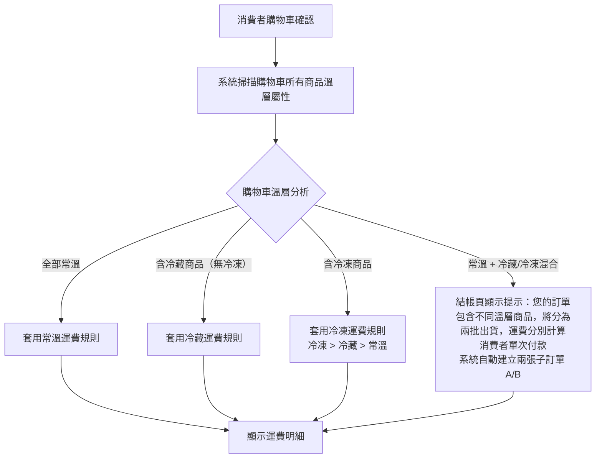
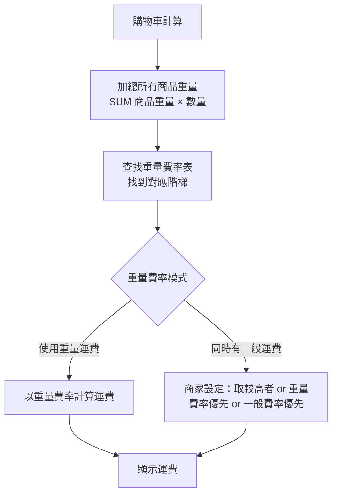
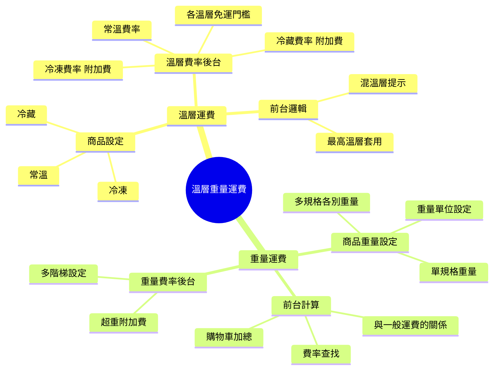
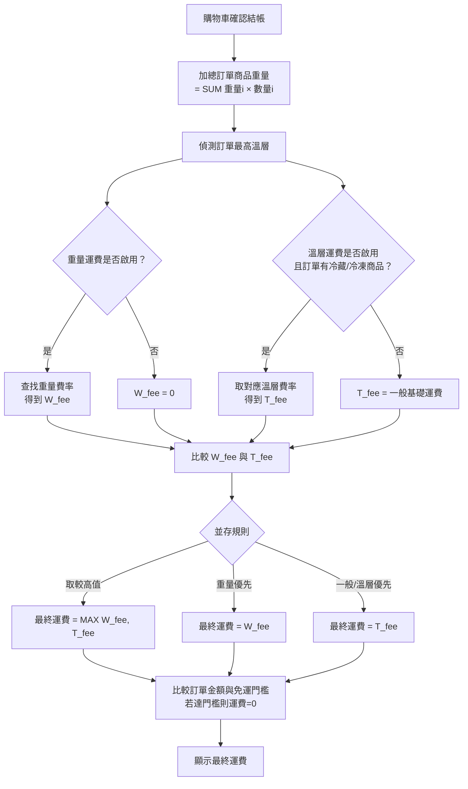

## 版本更新紀錄

| 版本 | 日期 | 修改內容 | 修改人 |
|------|------|----------|--------|
| v1.0 | 2026/04/27 | 初稿建立 | Una |
| v1.1 | 2026/05/27 | 確立混溫層訂單處理政策：消費者單次結帳付款，系統自動拆成兩張子訂單（A/B 後綴）分批出貨，各自獨立退換貨；確立離島判定策略：縣市層級清單用於運費計算，實際可否配送由物流 API 回傳錯誤處理 | Una |

# Evomni — 溫層/重量運費設定 產品需求文件 (PRD) v1.1

## 1. 文件資訊

| 屬性 | 內容 |
| --- | --- |
| 版本 | v1.1 |
| 日期 | 2026/05/27 |
| 需求來源 | Master PRD v1.0 Chapter 5（P0）、方案規格 V1.1 |
| 文件狀態 | v1.1 — 確立混溫層訂單自動拆單政策；確立離島判定策略 |
| 作者 | Una |
| 對應方案 | 電商啟航方案 ✅ / 進階電商包 ✅（兩方案均含）|
| 併入目標 | 本 PRD 作為 Part 2 商品中心的附屬規格；相關運費計算在金物流串接規格中被引用 |
| 開發時程 | 階段一 5–8月（電商啟航方案）/ 階段二 9–12月（進階電商包）|

---

## 2. 目標與功能總覽

### 2.1 核心願景與相依性

**核心問題：**
方案規格明確列出「溫層運費設定」與「重量運費設定」為兩方案共有功能，但整個 PRD 完全沒有規格。商家若販售生鮮食品（需冷藏/冷凍配送）或大型商品（需依重量計費），無法正確設定運費，導致實際收到的運費與成本不符。

**解決方案：**
1. 溫層運費：商家可對每件商品設定溫層屬性（常溫/冷藏/冷凍），結帳時系統依訂單內的最高溫層自動套用對應運費規則
2. 重量運費：商家可設定依重量計費的階梯運費，每件商品設定重量，系統自動加總計算

**系統相依性：**

| 模組 | 用途 |
| --- | --- |
| Part 2 商品中心 | 商品設定溫層屬性、商品重量欄位 |
| 金物流串接規格 | 基礎運費設定基準；溫層/重量為附加計算層 |
| Part 3 訂單管理 | 結帳時呼叫運費計算引擎 |

---

### 2.2 功能總覽表

| 主功能模組 | 子功能項目 | 功能目的 | 功能詳細描述 | 影響之使用者 |
| --- | --- | --- | --- | --- |
| 溫層運費 | 商品溫層屬性設定 | 標記商品所需運送溫層 | 商家在商品編輯頁設定溫層（常溫/冷藏/冷凍）；不同溫層商品不可混裝同一物流訂單 | 商家管理員 |
| 溫層運費 | 溫層運費規則設定 | 為不同溫層設定對應運費 | 後台可分別設定常溫/冷藏/冷凍的基礎運費、免運門檻 | 商家管理員 |
| 溫層運費 | 前台自動套用 | 結帳時自動計算溫層運費 | 系統偵測購物車內最高溫層，套用對應運費規則；混溫層訂單前台提示分批結帳 | 消費者 |
| 重量運費 | 商品重量設定 | 每件商品設定重量 | 商家在商品/規格編輯頁設定重量（公克 or 公斤）；多規格商品可各別設定 | 商家管理員 |
| 重量運費 | 重量階梯費率設定 | 設定依重量計費規則 | 後台設定多階梯重量費率（例：0-500g：NT$60，500g-1kg：NT$120）| 商家管理員 |
| 重量運費 | 前台自動計算 | 結帳時自動加總重量計費 | 系統加總購物車所有商品重量（含數量），查找對應費率階梯，顯示運費 | 消費者 |

---

## 3. 全局功能流程

### 3.1 溫層運費計算流程



### 3.2 重量運費計算流程



---

## 4. 功能結構圖



---

## 5. 使用者故事

| # | 角色 | 故事 |
| --- | --- | --- |
| US-01 | 商家管理員 | 身為販售生鮮食品的商家管理員，我想要將「牛肉捲」商品設定為「冷凍」，以便消費者購買時系統自動套用冷凍配送費用。 |
| US-02 | 消費者 | 身為消費者，當我同時購買常溫商品和冷凍商品時，我想要看到系統提示告知溫層差異，以便我決定是否分開下單。 |
| US-03 | 商家管理員 | 身為商家管理員，我想要設定「冷藏商品基礎運費 NT$150，滿 NT$1,500 免運」，以便正確反映冷藏配送成本。 |
| US-04 | 商家管理員 | 身為販售大型家具的商家，我想要設定「20kg 以下 NT$200，20-50kg NT$500，50kg 以上 NT$1,000」的重量費率，以便運費符合物流成本。 |
| US-05 | 消費者 | 身為消費者，我想要在購物車頁面看到「目前商品總重量 X.Xkg，運費 NT$XXX」，以便了解運費計算依據。 |

---

## 6. UI/UX 與詳細功能需求

### 6.1 商品溫層屬性設定（後台商品編輯頁）

**在 Part 2 商品中心的商品編輯表單中，新增「運送設定」區塊：**

**溫層設定欄位：**

| 欄位 | 元件 | 驗證規則 |
| --- | --- | --- |
| 溫層屬性 | `<el-radio-group>` | 必選（預設常溫）；選項：常溫 / 冷藏（7°C 以下）/ 冷凍（-18°C 以下）|
| 溫層說明標示（前台）| `<el-switch>` | 選填；開啟後商品頁顯示溫層 icon（❄️ 冷凍 / 🌡️ 冷藏）|

> Tooltip 說明（`<el-tooltip>`）：「溫層屬性影響結帳時的運費計算。冷藏/冷凍商品需要特殊物流，運費可能較高。」

**商品重量設定欄位（同一區塊）：**

| 欄位 | 元件 | 驗證規則 |
| --- | --- | --- |
| 商品重量 | `<el-input-number>` + `<el-select>` 公克/公斤 | 選填；最小 0；小數點 2 位；若使用重量運費則建議填寫 |
| 多規格商品 | 各規格欄位中分別顯示重量欄位 | 各規格可設定不同重量 |

**多規格商品重量設定說明：**
- 在規格設定的 Table 中，每個規格行新增「重量」欄位
- 規格未設定重量時，繼承商品主重量
- 商品主重量未設定時，使用物流設定中的「預設重量」

---

### 6.2 溫層運費規則設定（全域設定 > 金物流串接）

**路徑：** 全域設定 → 金物流串接 → 物流與運費 → Tab「溫層運費規則」

**頁面說明文字：**
「設定不同溫層商品的運費規則。系統將依照訂單中最高溫層的商品套用對應運費。若您的商品無需溫層管理，可忽略此設定。」

**溫層費率設定（`<el-form>` 三組，各溫層一組）：**

**常溫設定（`<el-collapse>` 展開）：**
- 說明：常溫商品使用一般運費設定（見金物流設定的一般運費），此區塊僅用於確認。
- 顯示目前常溫基礎運費：`NT$XX（來自一般運費設定）`

**冷藏設定（`<el-collapse>` 展開）：**

| 欄位 | 元件 | 驗證規則 |
| --- | --- | --- |
| 是否啟用冷藏運費 | `<el-switch>` | 預設 OFF；未啟用則冷藏商品套用常溫費率 |
| 冷藏基礎運費（本島） | `<el-input-number>` NT$ | 必填（啟用時）；通常高於常溫 |
| 冷藏基礎運費（離島） | `<el-input-number>` NT$ | 必填（啟用時）|
| 冷藏免運門檻（本島）| `<el-input-number>` NT$ | 選填；0 代表不設免運 |
| 冷藏免運門檻（離島）| `<el-input-number>` NT$ | 選填 |
| 前台顯示說明文字 | `<el-input>` | 選填；最多 50 字；例：「冷藏商品採低溫宅配，運費 NT$150 起」|

**冷凍設定（`<el-collapse>` 展開）：**
- 同冷藏設定，欄位完全相同
- 說明文字提示：「冷凍運費通常高於冷藏運費」

---

### 6.2.1 離島判定策略

**本島 / 離島判定層級：縣市**

系統以縣市層級維護本島/離島清單，用於運費計算（選擇冷藏/冷凍或重量費率時，系統自動套用對應的「離島運費」欄位）。

**確認離島縣市/鄉鎮：**

| 縣市 / 行政區 | 說明 |
| --- | --- |
| 澎湖縣 | 整縣離島 |
| 金門縣 | 整縣離島 |
| 連江縣（馬祖）| 整縣離島 |
| 台東縣綠島鄉 | 鄉鎮層級離島 |
| 台東縣蘭嶼鄉 | 鄉鎮層級離島 |
| 屏東縣琉球鄉 | 鄉鎮層級離島 |

> 以上清單用於判定「本島費率」或「離島費率」的切換依據，由系統維護，商家不可自行修改。

**物流實際配送可行性：**
- 系統**不維護**各物流廠商的個別配送覆蓋清單
- 實際能否配送由物流廠商 API 回應決定
- 若物流 API 回傳地址不可配送錯誤，前台顯示：

```
很抱歉，您選擇的物流方式無法配送至此地址，請選擇其他物流方式
```

---

### 6.3 重量運費規則設定（全域設定 > 金物流串接）

**路徑：** 全域設定 → 金物流串接 → 物流與運費 → Tab「重量運費規則」

**頁面說明文字：**
「設定依商品總重量計費的運費規則。系統將加總購物車內所有商品的重量（重量 × 數量），並依照階梯費率計算運費。」

**全域設定：**

| 欄位 | 元件 | 說明 |
| --- | --- | --- |
| 是否啟用重量運費 | `<el-switch>` | 預設 OFF |
| 重量單位 | `<el-radio>` 公克 / 公斤 | 必填（啟用時）；整個商店統一單位 |
| 未設定重量的商品預設重量 | `<el-input-number>` | 必填（啟用時）；商品未填重量時使用此值計費 |
| 當重量運費與一般運費並存時 | `<el-radio>` | 必填；選項：「取兩者較高值」/ 「使用重量運費（忽略一般運費）」/ 「使用一般運費（忽略重量運費）」|

**重量費率階梯（動態新增列，`<el-table>` + 新增行按鈕）：**

| 欄位 | 元件 | 驗證規則 |
| --- | --- | --- |
| 重量範圍（最小）| `<el-input-number>` 含單位 | 第一列固定為 0；後續列自動等於上一列最大值 |
| 重量範圍（最大）| `<el-input-number>` 含單位 | 必填；填 0 代表「以上」（最後一階）；必須 > 最小值 |
| 本島運費 | `<el-input-number>` NT$ | 必填 |
| 離島運費 | `<el-input-number>` NT$ | 必填 |
| 操作 | `<el-button>` 刪除 | 最少需有 1 個階梯，不可全部刪除 |

**費率範例（後台顯示示範表格，以淺紫背景 `#f5f0ff` 標示）：**

```
重量範圍          本島運費    離島運費
0 - 1 kg         NT$ 100    NT$ 200
1 kg - 5 kg      NT$ 180    NT$ 320
5 kg - 15 kg     NT$ 300    NT$ 500
15 kg 以上        NT$ 500    NT$ 800
```

**欄位驗證規則：**
- 各階梯的重量範圍必須連續且不重疊（最小值 = 上一列的最大值）
- 本島/離島運費必須 ≥ 0；NT$0 代表此重量段免運
- 最後一階的最大值設為 0，代表此重量以上均套用此費率

---

### 6.4 前台結帳頁運費顯示

**溫層運費顯示（結帳頁運費區塊）：**

```
運費：NT$ XXX
  ✅ 冷藏商品配送（依冷藏費率計算）
```

**混溫層提示（結帳頁金額明細區上方，`<el-alert type="warning" :closable="false">`）：**

```
您的訂單包含不同溫層商品，將分為兩批出貨，運費分別計算，付款金額為兩批運費之加總
```

> 說明：消費者僅需完成一次付款，系統在付款完成後自動拆成兩張子訂單（子訂單 A / 子訂單 B）分別出貨，各自獨立退換貨。

**重量運費顯示（結帳頁）：**

```
運費：NT$ XXX
  📦 商品總重量：X.X kg（依重量費率計算）
```

---

## 7. 細部邏輯流程圖

### 7.1 結帳運費最終計算邏輯



---

## 8. 非功能性需求

### 8.1 效能需求

- 運費計算（購物車更新時觸發）：≤ 300ms
- 重量費率查找：O(n)，n = 費率階梯數量；建議後台限制最多 20 個階梯

### 8.2 資料一致性

- 商品重量更新後，已在購物車的計算不即時更新（購物車快取）；消費者進入結帳頁時重新計算
- 溫層/重量費率更新後，僅影響新訂單；現有訂單不受影響（訂單已記錄當時運費）

### 8.3 瀏覽器/裝置支援

| 環境 | 要求 |
| --- | --- |
| 後台設定頁 | Chrome 110+；桌機 1280px+ |
| 前台結帳頁 | 手機（375px+）；RWD |

---

## 8.5 工程師確認補充（v1.1 更新，2026/04/28）

### 8.5.1 products 表新增 weight 欄位

`products` 表（Part 2 商品中心）必須新增：

```sql
weight DECIMAL(8,3) DEFAULT NULL  -- 單位：公斤，NULL = 未設定
```

若啟用重量計費，商品未填 weight 時：
- 後端計算以 `weight = 0`（最低重量區間）
- 結帳頁顯示：`<el-alert type="warning">「此訂單包含未設定重量的商品，運費以最低費率計算」`

商家後台商品設定頁：若已啟用重量計費，`weight` 欄位顯示「(建議填寫)」提示（非強制阻擋）。

### 8.5.2 運費計算時機

| 頁面 | 行為 |
| --- | --- |
| 購物車頁 | **不顯示**具體運費金額（尚未選擇物流/縣市）；若有混溫層商品，顯示溫層警示 Banner |
| 結帳頁 | 消費者選擇物流方式和縣市後，即時呼叫 `/api/v1/orders/calculate-shipping` 計算運費 |
| 物流方式或縣市變更 | 重新呼叫 API 更新運費顯示 |

---

## 與團隊溝通摘要

- 這次的規格是關於**溫層/重量運費設定**，這兩個功能在方案規格中是兩方案共有的標配功能，但之前完全沒有規格。主要影響食品類商家（溫層）和大型商品商家（重量）
- **工程師這邊需要注意：**
  1. 溫層判斷邏輯：取購物車內**最高溫層**套用（冷凍 > 冷藏 > 常溫），而不是分別計費
  2. 重量計算時需注意多規格商品：使用「規格級別」的重量，若規格無重量則回退到「商品級別」重量，若商品也無重量則使用「系統預設重量」
  3. 重量費率的查找需注意邊界值：購物車總重量 = 某個階梯的上限時，應歸入下一個階梯（不含等於，即左閉右開區間）
  4. 運費計算要在購物車的每一次更新時重算（加減商品、修改數量），確保顯示給消費者的運費即時準確
- **設計師這邊需要注意：**
  1. 溫層 icon（❄️ 冷凍、🌡️ 冷藏）要出現在：商品列表縮圖角落、商品詳情頁、購物車商品列表
  2. 混溫層警示使用橙色 Warning 樣式（`<el-alert type="warning">`），不要用錯誤紅色，因為這不是錯誤，只是提示
  3. 重量費率後台的新增行操作要設計清楚，建議重量範圍的「最小值」自動帶入上一行的「最大值」，避免商家填錯
- 這個模組依賴 **Part 2 商品中心**（商品重量欄位 + 溫層欄位）和**金物流串接規格**（基礎運費設定），需先確認這兩個模組的資料結構
