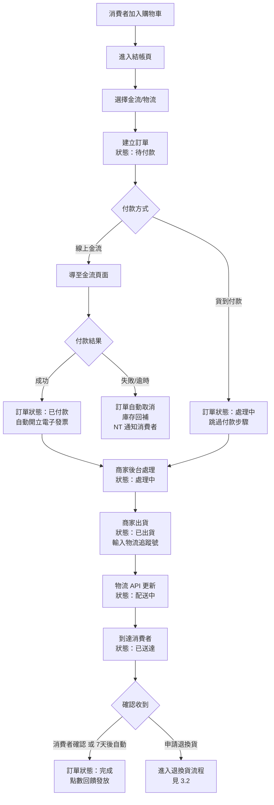
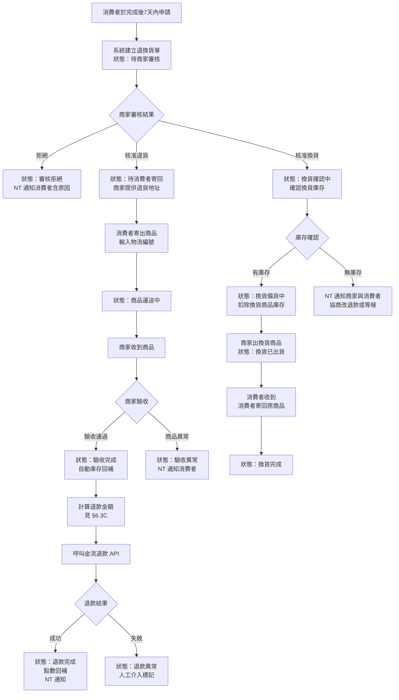
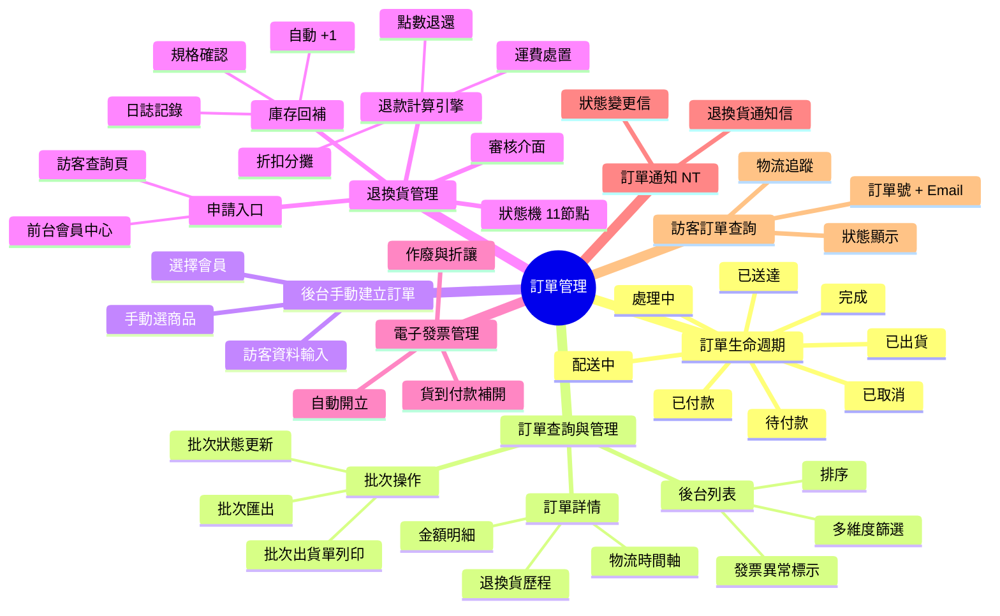
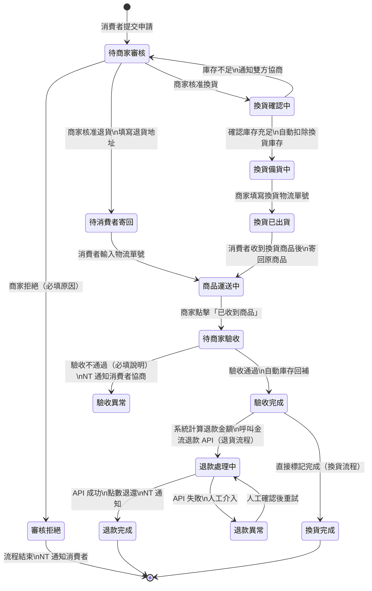
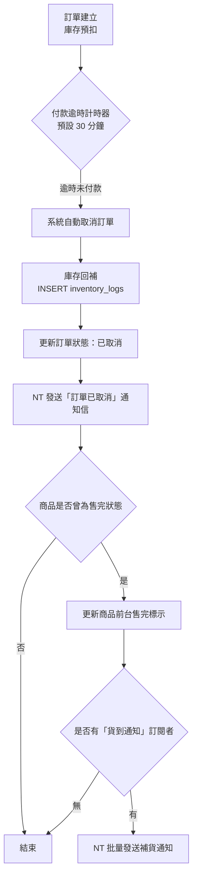
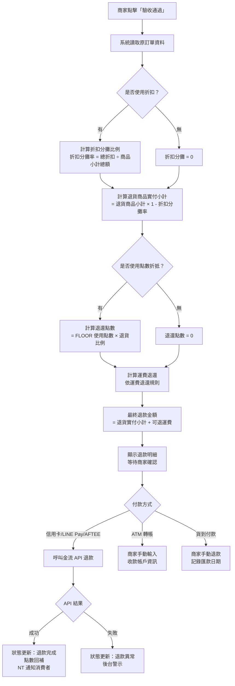

## 版本更新紀錄

| 版本 | 日期 | 修改內容 | 修改人 |
|------|------|----------|--------|
| v1.0 | 2026/04/27 | 初稿建立 | Una |
| v1.1 | 2026/05/21 | 連動 Part4 v1.2 修訂：§6.2.B 訂單詳情頁商品明細區新增「加購商品」分區；§6.2.B 金額計算區對齊 Part4 §6.7 結帳明細；§6.3.C 新增「加購退款邊界規格」與「回饋追回雙模式」章節；§8.5 新增工程師補充（應收記錄抵扣 Transaction）| Una |
| v1.2 | 2026/05/21 | 新增 §6.2.A 訂單狀態 Tag Tooltip 規格（R8 三層）：8 種訂單狀態（待付款 / 已付款 / 處理中 / 已出貨 / 配送中 / 已送達 / 已完成 / 已取消）補齊 What / Impact / Next Step 三層說明 | Una |
| v1.3 | 2026/05/27 | 新增訂單商品快照 6 欄位規格（soft delete 前提）（§8.5.8）；確立換貨政策 v1.0：僅支援等價換貨（同售價不同規格），跨價格換貨列後續擴充（§6.3.C-3）；§8 待確認事項新增跨價換貨後續擴充說明 | Una |
| v1.6 | 2026/06/03 | 依議題 2026-05-22-order-status-closed-tooltip-text §6.2.A：訂單狀態擴充為 10 種，新增 refunded（已退款）與 closed（已關閉）的 Tag 顏色與三層 Tooltip 文案；更新狀態總數標示 | Una |
| v1.5 | 2026/05/29 | 依議題 2026-05-20-guest-return-auth-flow §6.5B §6.5C §6.5E：訪客退換貨申請身分驗證定案——30 分鐘憑證有效期內沿用查詢憑證直接申請，無需重新輸入；憑證過期後導回查詢頁顯示「驗證已過期，請重新輸入訂單編號 + Email」；重新驗證成功後自動導回申請頁，已填內容透過 localStorage 暫存恢復 | Una |
| v1.4 | 2026/05/27 | 新增混溫層訂單自動拆單規格（單次付款後端拆兩張子訂單 A/B，各自獨立出貨與退換貨）；統一訪客身份驗證為訂單編號 + Email（移除手機末四碼雙軌邏輯）；新增組合優惠部分退貨折扣分攤明文規則（原始售價比例分攤，不強制連動）；確立離島運費判定為縣市層級清單，實際配送能力由物流 API 處理 | Una |

# Evomni — 訂單管理 產品需求文件 (PRD) v1.5

## 1. 文件資訊

| 屬性 | 內容 |
| --- | --- |
| 版本 | v1.6 |
| 日期 | 2026/06/03 |
| 需求來源 | Master PRD v1.0 Chapter 5（P0）、PRD V3 §3.2.6、方案規格 V1.1、**Part4 行銷活動 PRD v1.2 連動需求** |
| 文件狀態 | v1.6 — §6.2.A：訂單狀態擴充為 10 種，新增 refunded（已退款）/ closed（已關閉）Tooltip 文案 |
| 作者 | Una |
| 對應方案 | 電商啟航方案 ✅ / 進階電商包 ✅ |
| 關聯文件 | [Part4 行銷活動 PRD](Evomni_Part4_行銷活動_PRD.md)、[優惠計算引擎技術規格 PRD](Evomni_優惠計算引擎_技術規格_PRD.md) |
| 開發時程 | 階段一 5–8月（電商啟航方案）/ 階段二 9–12月（進階電商包）|

---

## 2. 目標與功能總覽

### 2.1 核心願景與相依性

**核心問題：**
訂單是電商系統的命脈，但現有規格（PRD V3）僅定義了「訂單狀態流程」的快樂路徑，缺乏以下關鍵規格：
1. 退換貨的完整狀態機（超過 10 個節點的分支流程）
2. 退款金額計算公式（含優惠券折扣分攤、點數退還、運費處置）
3. 退貨確認後的庫存自動回補邏輯
4. 訪客（未登入消費者）查詢訂單的完整流程

**解決方案：**
本文件補寫上述四大缺口，確保工程師可直接依此開發，設計師可直接依此繪製 Figma，QA 可直接依此撰寫測試案例。

**Evomni 價值對應：**
- 商家：清楚的退換貨 SOP 減少客訴與人工介入
- 消費者：訂單透明化（含訪客）提升信任度

**系統相依性（串接的 Evomni 模組）：**

| 模組 | 用途 |
| --- | --- |
| UA（會員認證） | 商家後台登入驗證；消費者會員身份驗證 |
| NT（發信模組） | 訂單狀態更新通知信、退換貨通知信 |
| ML（媒體庫） | 退換貨申請上傳附件圖片 |
| DC（數據中心） | 訂單報表整併至 DC 選單 |
| Part 2 商品中心 | 庫存回補 API；商品規格查詢 |
| Part 3 金物流串接 | 支付狀態回調；退款 API；物流狀態更新 |
| Part 6 會員管理 | 點數退還；消費紀錄更新 |

---

### 2.2 功能總覽表

本表涵蓋訂單管理模組所有子功能，依操作流程排序。商家管理員透過後台操作；消費者透過前台查詢。

| 主功能模組 | 子功能項目 | 功能目的 | 功能詳細描述 | 影響之使用者 |
| --- | --- | --- | --- | --- |
| 訂單生命週期 | 訂單狀態流轉 | 追蹤訂單完整進度 | 從「待付款」到「完成」共 10 個主要狀態（含 refunded 全額退款完成與 closed 商家強制終結），自動觸發金流/物流 API 及 NT 通知 | 商家管理員、消費者 |
| 訂單生命週期 | 超時未付款自動取消 | 釋放庫存佔用 | 訂單建立後 N 分鐘（後台可設定，預設 30 分鐘）未完成支付，系統自動取消並回補庫存 | 消費者、商家管理員 |
| 訂單查詢與管理 | 後台訂單列表與搜尋 | 快速定位目標訂單 | 支援多維度篩選（狀態、日期、金額、發票狀態）、排序、批次操作，含「貨到付款未開發票」醒目標示 | 商家管理員 |
| 訂單查詢與管理 | 訂單詳情頁 | 完整訂單資訊一覽 | 含商品明細、金額計算說明（折扣分攤）、物流狀態時間軸、發票資訊、退換貨歷程 | 商家管理員 |
| 訂單查詢與管理 | 批次操作 | 提升處理效率 | 批次列印出貨單、批次更新狀態、批次匯出 Excel/CSV | 商家管理員 |
| 後台手動建立訂單 | 手動開單 | 電話/現場訂單補錄 | 商家管理員可手動建立訂單，選擇已登入會員或輸入訪客資料 | 商家管理員 |
| 退換貨管理 | 申請入口（前台） | 消費者自助申請 | 消費者於會員中心或訪客查詢頁面提交退換貨申請，上傳附件圖片，說明原因 | 消費者 |
| 退換貨管理 | 退換貨狀態機 | 完整追蹤退換貨流程 | 定義 11 個狀態節點（見第 7 章），覆蓋正常流程、拒絕分支、換貨分支 | 商家管理員、消費者 |
| 退換貨管理 | 退款金額計算引擎 | 精確計算退款數字 | 依原始支付金額、折扣分攤比例、點數使用、運費條件，計算最終退款金額（見 §6.3C） | 商家管理員 |
| 退換貨管理 | 庫存回補 | 維持庫存準確性 | 退貨驗收完成後，系統自動將正確規格商品庫存數量 +1，並記錄異動日誌 | 商家管理員 |
| 退換貨管理 | 後台審核介面 | 商家審核與管理 | 退換貨申請列表、一鍵審核/拒絕、填寫退貨地址、標記收到商品、觸發退款 | 商家管理員 |
| 電子發票管理 | 發票自動開立 | 稅務合規 | 付款成功後自動呼叫綠界電子發票 API 開立；支援雲端載具、捐贈碼、統編 | 消費者 |
| 電子發票管理 | 發票作廢與折讓 | 退款對應發票處理 | 退款時依退款金額開立折讓單或作廢發票；「貨到付款」訂單完成後自動開立發票 | 商家管理員 |
| 訂單通知 | 全程 NT 通知 | 消費者與商家即時知悉 | 每個訂單狀態變更皆觸發對應 NT 信件，開信/點擊數據回傳後台 | 商家管理員、消費者 |
| 訪客訂單查詢 | 訪客查詢入口 | 非會員也能追蹤訂單 | 訪客輸入訂單編號 + 結帳時填寫的 Email，驗證後顯示訂單狀態與物流進度 | 消費者（訪客） |

---

## 3. 全局功能流程

### 3.1 正常訂單流程



### 3.2 退換貨流程總覽



---

## 4. 功能結構圖



---

## 5. 使用者故事

| # | 角色 | 故事 |
| --- | --- | --- |
| US-01 | 商家管理員 | 身為商家管理員，我想要在後台訂單列表看到所有「貨到付款且已完成但發票未開立」的訂單以醒目紅色標示，以便我不會漏開發票導致稅務問題。 |
| US-02 | 商家管理員 | 身為商家管理員，我想要一次批次選取多張訂單並列印出貨單，以便我在出貨旺季能有效率地完成揀貨出貨。 |
| US-03 | 消費者（會員） | 身為已登入的消費者，我想要在會員中心看到我的所有訂單，並可以在訂單完成後 7 天內一鍵申請退換貨，以便我遇到問題時不需要打電話。 |
| US-04 | 消費者（訪客） | 身為未登入的訪客消費者，我想要輸入訂單編號和結帳時填寫的 Email 就能查詢我的訂單狀態，以便我即使沒有帳號也能追蹤包裹。 |
| US-05 | 商家管理員 | 身為商家管理員，我想要審核退換貨申請時，系統自動計算退款金額（含折扣分攤），以便我不需要手動計算，避免算錯。 |
| US-06 | 商家管理員 | 身為商家管理員，我想要退貨商品驗收完成後，系統自動將正確規格的庫存數量加回，以便庫存資料永遠準確。 |
| US-07 | 消費者（會員） | 身為消費者，我想要在退款完成時收到電子郵件通知（含退款金額明細），以便我確認款項是否正確。 |
| US-08 | 商家管理員 | 身為商家管理員，我想要在退換貨審核時能選擇「拒絕」並填寫原因，以便系統自動通知消費者，不需要我手動寄信。 |
| US-09 | 商家管理員 | 身為商家管理員，我想要手動建立訂單（電話接單），並能選擇已有的會員或輸入新訪客資料，以便補錄線下訂單。 |
| US-10 | 消費者 | 身為消費者，我想要在結帳時選擇電子發票的載具或捐贈碼，以便發票符合我的需求。 |

---

## 6. UI/UX 與詳細功能需求

### 6.1 訂單列表頁（後台）

#### A. 核心使用者流程
商家管理員登入後台 → 點擊左側選單「訂單管理」→ 進入訂單列表頁 → 篩選/搜尋目標訂單 → 進入訂單詳情或批次操作。

#### B. 介面佈局與元件拆解（Figma Ready）

**頁面結構：**
```
[頁面標題：訂單管理]
[Tab 列]  [全部] [待付款] [處理中] [已出貨] [配送中] [已完成] [已取消] [已退款] [已關閉] [退換貨申請]
[工具列]  [搜尋框] [篩選按鈕] [日期選擇器] [匯出] [批次操作按鈕]
[訂單列表 Table]
[分頁器]
```

**Tab 元件（`<el-tabs>`）：**
- 每個 Tab 右上角顯示該狀態的訂單數量 Badge（`<el-badge>`，顏色 `#F56C6C`）
- 「退換貨申請」Tab：有新申請未處理時顯示紅點

**搜尋框（`<el-input>`）：**
- Type: text
- Placeholder: `搜尋訂單編號、收件人姓名、手機號碼`
- 寬度: 320px
- 支援 Enter 鍵觸發搜尋
- 右側附「搜尋」`<el-button type="primary" class="!rounded-none">`

**篩選面板（`<el-popover>`，點擊「篩選」按鈕展開）：**

| 篩選欄位 | 元件類型 | 選項/規則 |
| --- | --- | --- |
| 訂單狀態 | `<el-checkbox-group>` | 全部、待付款、已付款、處理中、已出貨、配送中、已送達、完成、已取消、已退款、已關閉 |
| 付款方式 | `<el-select>` multiple | 信用卡、LINE Pay、ATM 轉帳、貨到付款、AFTEE |
| 配送方式 | `<el-select>` multiple | 宅配、超商取貨（7-11）、超商取貨（全家）、超商取貨（萊爾富） |
| 訂單日期 | `<el-date-picker>` type="daterange" | 預設近 30 天；最大範圍 1 年 |
| 訂單金額 | 雙欄 `<el-input-number>` | 最小值 / 最大值；空白代表不限 |
| 發票狀態 | `<el-select>` multiple | 未開立、已開立、開立失敗、作廢/折讓 |

**訂單列表 Table（`<el-table>`）：**

| 欄位 | 寬度 | 說明 |
| --- | --- | --- |
| 勾選框 | 48px | `<el-checkbox>` 全選 |
| 訂單編號 | 180px | 可點擊連結，進入訂單詳情；格式：`ORD-YYYYMMDD-XXXXXX` |
| 訂單日期 | 160px | 格式：`YYYY/MM/DD HH:mm`；可排序 |
| 收件人 | 120px | 姓名；Hover 顯示手機號碼 Tooltip |
| 商品摘要 | 200px | 顯示前 2 件商品名稱，超過顯示「+N 件」 |
| 訂單金額 | 100px | 格式：`NT$ X,XXX`；可排序 |
| 訂單狀態 | 120px | `<el-tag class="!rounded-full">` 依狀態不同顏色，見下方對應表 |
| 付款方式 | 100px | 文字顯示 |
| 發票狀態 | 120px | `<el-tag class="!rounded-full">`；「未開立」且貨到付款已完成者，標籤顏色 `#F56C6C`（紅），加 `⚠️` icon |
| 操作 | 140px | `<el-button size="small">` 查看詳情、`<el-button size="small" type="danger">` 取消（僅限「待付款」狀態） |

**訂單狀態 Tag 顏色對應：**

| 狀態 | Tag 顏色 | 文字 |
| --- | --- | --- |
| 待付款 | `#E6A23C`（警告橙） | 待付款 |
| 已付款 | `#409EFF`（藍） | 已付款 |
| 處理中 | `#409EFF`（藍） | 處理中 |
| 已出貨 | `#67C23A`（綠） | 已出貨 |
| 配送中 | `#67C23A`（綠） | 配送中 |
| 已送達 | `#67C23A`（綠） | 已送達 |
| 完成 | `#909399`（灰） | 已完成 |
| 已取消 | `#F56C6C`（紅） | 已取消 |
| 已退款 | `#909399`（灰） | 已退款 |
| 已關閉 | `#909399`（灰） | 已關閉 |

**訂單狀態 Tag Tooltip 規格（R8）：**

> 訂單共 10 種狀態，符合 §15「同一頁面狀態 ≥ 3 種」條件，所有狀態標籤旁均需加 ⓘ icon（14px，`#909399`），hover 顯示三層 tooltip。

| 狀態 | What（這是什麼）| Impact（影響什麼）| Next Step（如何改變）|
|------|----------------|------------------|---------------------|
| 待付款 | 顧客已下單但尚未完成付款，訂單處於等待確認狀態 | 庫存已預扣但尚未正式扣減；此狀態下無法出貨、無法開立發票 | 顧客完成付款後自動進入「已付款」；超過設定時限未付款，訂單自動取消並釋出庫存 |
| 已付款 | 付款已確認，等待商家開始備貨處理 | 庫存正式扣減；可開立發票；消費者收到付款確認通知信 | 請前往處理，點擊「更新狀態 → 處理中」開始備貨 |
| 處理中 | 商家已確認並開始備貨，貨品尚未交給物流 | 消費者收到「備貨中」通知信；訂單不可取消 | 備貨完成後，點擊「更新狀態 → 已出貨」並填寫物流單號 |
| 已出貨 | 貨品已交付物流廠商，等待物流取件或掃描入庫 | 消費者收到出貨通知及物流追蹤連結；訂單不可取消 | 等待物流系統回傳配送狀態，自動更新為「配送中」 |
| 配送中 | 貨品正在物流運送途中，尚未抵達收件地址 | 消費者可用追蹤號查詢配送位置；商家無需操作 | 物流確認送達後自動更新為「已送達」 |
| 已送達 | 物流回報貨品已抵達收件地址 | 消費者收到送達通知；7 天後若未確認，系統自動完成訂單 | 等待消費者確認，或 7 天後系統自動完成；可主動聯繫消費者確認收貨 |
| 已完成 | 消費者已確認收貨，訂單正式結束 | 點數回饋已發放；訂單不可再修改 | —（終態）|
| 已取消 | 訂單已取消，庫存已自動回補 | 已付款訂單將依原付款方式退款（時程依金流廠商規定）；點數回饋不發放 | —（終態）|
| 已退款 | 訂單已完成全額退款，交易關閉 | 退款已依原付款方式退回；消費點數已扣回（若曾發放） | —（終態）如有疑問請聯繫客服 |
| 已關閉 | 訂單已由商家關閉 | 此訂單已終止，如有退款需求請聯繫客服確認 | —（終態）如有疑問請聯繫客服 |

**批次操作工具列（勾選 1 筆以上後顯示）：**
- 已選 N 筆訂單
- 批次列印出貨單（`<el-button>`）
- 批次更新狀態（`<el-button>`，展開下拉選單）
- 批次匯出（`<el-button>`）→ Toast：「報表產生中，完成後將寄送至您的信箱 📧」

**匯出按鈕（`<el-button class="!rounded-none">`）：**
- 點擊後不出現檔案下載，而是顯示 `<el-message type="success">`：`報表產生中，完成後將寄送至您的信箱 📧`

#### C. 互動設計、狀態與系統反饋

- Table 行 Hover 背景：`#F5F7FA`
- 表頭背景：`#F5F7FA`
- 點擊「訂單編號」連結：以當前分頁導覽至訂單詳情（非新分頁）
- 批次選取後上方浮現批次工具列（`position: sticky; top: 0`），避免上下捲動找不到按鈕
- 分頁器（`<el-pagination>`）：顯示「共 N 筆」，每頁 20 筆，可選 20/50/100

#### D. 防呆機制與錯誤預防

- 日期範圍選擇器：結束日期不可早於開始日期，違反時 Tooltip 提示「結束日期不可早於開始日期」
- 批次操作「取消訂單」：`<el-message-box confirm>` 確認框，文字：「確定要取消這 N 筆訂單嗎？此操作無法復原，被取消的訂單將自動回補庫存。」
- Empty State（無訂單）：顯示插圖 + 文字「目前沒有符合條件的訂單」+ 「清除篩選條件」`<el-button>`

---

### 6.1.1 混溫層訂單自動拆單規格

#### 混溫層訂單自動拆單規格

**觸發條件：** 購物車中同時存在不同溫層商品（常溫 + 冷藏，或常溫 + 冷凍，或冷藏 + 冷凍）

**前台提示（結帳頁）：**
- 元件：`<el-alert type="warning" :closable="false">`
- 文案：「您的訂單包含不同溫層商品，將分為兩批出貨，運費分別計算，付款金額為兩批運費之加總」
- 位置：結帳頁金額明細區上方

**訂單建立邏輯：**
1. 消費者完成付款 → 系統偵測商品溫層分組
2. 建立一筆「主付款紀錄」（payment record），金額 = 兩批商品 + 兩批運費加總
3. 自動產生兩張子訂單：
   - 子訂單 A（較低溫層商品，如常溫）：編號 `ORD-YYYYMMDD-XXXXX-A`
   - 子訂單 B（較高溫層商品，如冷凍）：編號 `ORD-YYYYMMDD-XXXXX-B`
4. 兩張子訂單各自顯示於後台訂單列表，可獨立操作出貨

**後台顯示：**
- 後台訂單列表中，兩張子訂單各自顯示一列
- 子訂單列顯示標籤 `<el-tag type="warning" class="!rounded-full">分批出貨</el-tag>`
- 點擊任一子訂單詳情頁，顯示「此為拆單訂單，關聯子訂單：[ORD-XXXXX-A / B]」提示

**退換貨：**
- 兩張子訂單各自獨立申請退換貨，互不影響
- 若消費者誤以為是同一筆訂單申請退款，客服以子訂單號為準分別處理

**邊界情境：**

| 情境 | 處理方式 |
|------|---------|
| 三種溫層混合（常溫 + 冷藏 + 冷凍） | 依溫層分為兩組：最低溫層一組，其餘合併為高溫層一組（以最高溫層運費計）|
| 拆單後其中一張訂單付款失敗（極少見） | 整筆交易回滾，兩張子訂單均取消，通知消費者重新下單 |
| 消費者查詢時只輸入主單號 | 顯示兩張子訂單連結 |

---

### 6.2 訂單詳情頁（後台）

#### A. 核心使用者流程
訂單列表 → 點擊訂單編號 → 進入詳情頁 → 查看資訊 / 更新狀態 / 開立發票 / 處理退換貨。

#### B. 介面佈局與元件拆解（Figma Ready）

**頁面結構（上下區塊）：**
```
[頁首] 訂單 #ORD-XXXXXXXX  [狀態 Tag]  [操作按鈕組]
[資訊區塊 三欄]
  左欄(60%)：[商品明細]  [金額計算區]  [退換貨歷程 Timeline]
  右欄(40%)：[收件人資訊]  [付款資訊]  [物流資訊]  [備註]
```

**商品明細區塊（`<el-table>`，v1.1 修訂為分區呈現）：**

> 連動 Part4 v1.2 §6.2H：訂單詳情頁商品區採「一般商品」/「加購商品」獨立分區，與購物車一致。

```
┌─ 一般商品 ─────────────────────────┐
│ <el-table> 商品圖 | 名稱 | 單價 | 數量 | 小計 │
└────────────────────────────────────┘

┌─ 加購商品（淡灰底 #f5f5f5）─────────┐
│ <el-table> 商品圖 | 名稱 | 單價 | 數量 | 小計 │
└────────────────────────────────────┘
```

| 欄位 | 說明 |
| --- | --- |
| 商品圖（40x40px） | 呼叫 ML API 取縮圖 |
| 商品名稱 + 規格 | 名稱加粗；規格以灰色文字標示 |
| 單價 | `NT$ X,XXX` |
| 數量 | 數字 |
| 小計 | `NT$ X,XXX` |

**分區規則：**
- 加購商品分區僅在訂單包含 `cart_items.is_addon = true` 的品項時顯示
- 加購商品卡片不顯示任何折扣標籤（即使該品在其他情境會有折扣）
- 加購商品「件數」不計入滿件門檻、「金額」計入滿額門檻（同 Part4 §3.1 Step 1 規則）

**金額計算區塊（v1.1 修訂為對齊 Part4 §6.7 結帳明細）：**

```
商品小計                NT$ X,XXX
  └ 一般商品           NT$ X,XXX
  └ 加購商品           NT$ X,XXX
─ [促銷活動名稱]       - NT$ XXX   ← 顯示活動名稱（非類型名稱）
─ [全店折扣名稱]       - NT$ XXX
─ [會員折扣 Lv.X]      - NT$ XXX
─ 自訂折扣             - NT$ XXX
─ 購物金折抵           - NT$ XXX
─ 點數折抵             - NT$ XXX
🎁 贈品：[贈品商品名]   NT$ 0       ← 獨立列出、不計入金額
─────────────────────────────────
訂單折扣後金額          NT$ X,XXX
＋ 運費 ⓘ              NT$ XXX     ← ⓘ 揭露計算基準（同 Part4 §6.2G.1）
＋ 稅費                 NT$ XX
─────────────────────────────────
訂單總計                NT$ X,XXX
已付款金額              NT$ X,XXX
```

> 設計師注意：金額區右側對齊，分隔線使用 `border-top: 1px solid #DCDFE6`。

**物流資訊時間軸（`<el-timeline>`）：**
- 每個狀態更新記錄一個節點（時間、狀態文字、操作人）
- 最新節點 icon 顏色：`#409EFF`
- 「已出貨」節點附「物流追蹤號」可點擊連結（另開新分頁至物流商官網）

**操作按鈕組（`<el-button-group>`，右上角）：**
- 更新訂單狀態（Primary）→ 展開下拉選單，顯示合法的下一個狀態
- 開立發票（Secondary）→ 僅限「未開立」或「開立失敗」時顯示
- 列印出貨單（Secondary）
- 取消訂單（Danger）→ 僅限「待付款」、「已付款」、「處理中」可操作
- 備註記錄（純文字 `<el-input type="textarea">`）→ 存檔按鈕

#### C. 互動設計、狀態與系統反饋

- 「更新狀態」操作成功後：`<el-message type="success">` 提示「訂單狀態已更新，NT 通知信已發送」
- 「開立發票」：呼叫綠界 API，成功顯示「發票開立成功，發票號碼：XX-XXXXXXXX」；失敗顯示「發票開立失敗，錯誤碼：[code]，請稍後再試或聯繫系統管理員」
- 取消訂單確認框：「確定取消此訂單？庫存將自動回補。若已付款，系統將自動發起退款。」

#### D. 防呆機制與錯誤預防

- 「取消訂單」在「已出貨」及之後的狀態中 Disabled，Tooltip：「訂單已出貨，如需取消請先進行退換貨申請流程」
- 手動更新狀態：只顯示合法下一狀態（不允許跳過中間狀態 or 倒退）；例外：管理員可將「配送中」直接標記為「完成」（模擬消費者確認收貨）

---

### 6.3 退換貨管理（後台）

#### A. 核心使用者流程

**商家視角：** 退換貨申請列表 → 查看申請內容（含圖片） → 填寫審核結果（核准/拒絕）→ 核准退貨時填寫退貨地址 → 系統追蹤消費者寄回狀態 → 標記收到並驗收 → 觸發退款/換貨出貨。

**消費者視角：** 訂單詳情頁 → 點擊「申請退換貨」→ 填寫表單 → 提交 → 等待商家審核 → 收到審核結果通知 → 依指示寄回商品 → 等待退款/換貨。

#### B. 介面佈局與元件拆解（Figma Ready）

**後台退換貨申請列表（獨立 Tab 或獨立選單頁）：**

```
[頁面標題：退換貨管理]
[篩選工具列]  [申請類型: 全部/退貨/換貨]  [狀態篩選]  [日期篩選]
[申請列表 Table]
```

**申請列表 Table 欄位：**

| 欄位 | 寬度 | 說明 |
| --- | --- | --- |
| 申請編號 | 160px | 格式：`RMA-YYYYMMDD-XXXXXX`；可點擊進入詳情 |
| 原訂單編號 | 180px | 可點擊連結至原訂單詳情 |
| 申請日期 | 140px | 可排序 |
| 申請類型 | 100px | `<el-tag>` 退貨（橙色） / 換貨（藍色） |
| 申請原因 | 160px | 文字截斷，Hover 顯示完整原因 Tooltip |
| 申請人 | 120px | 會員姓名 or 訪客（顯示電話） |
| 退款金額 | 100px | 系統預估退款金額（僅退貨顯示）；換貨顯示「-」 |
| 狀態 | 140px | `<el-tag class="!rounded-full">` 見下方狀態顏色表 |
| 操作 | 140px | 查看詳情按鈕；「待審核」狀態額外顯示快速審核按鈕 |

**退換貨狀態 Tag 顏色：**

| 狀態 | 顏色 |
| --- | --- |
| 待商家審核 | `#E6A23C`（橙）|
| 審核拒絕 | `#F56C6C`（紅）|
| 待消費者寄回 | `#409EFF`（藍）|
| 換貨確認中 | `#409EFF`（藍）|
| 商品運送中 | `#67C23A`（綠）|
| 換貨備貨中 | `#67C23A`（綠）|
| 待商家驗收 | `#E6A23C`（橙）|
| 驗收異常 | `#F56C6C`（紅）|
| 驗收完成 | `#67C23A`（綠）|
| 退款處理中 | `#409EFF`（藍）|
| 退款完成 | `#909399`（灰）|
| 換貨已出貨 | `#67C23A`（綠）|
| 換貨完成 | `#909399`（灰）|

**退換貨詳情頁（後台）：**

```
[頁首] 退換貨申請 #RMA-XXXXXXXX  [狀態 Tag]
[左欄 60%]
  [申請資訊]：申請類型、申請原因、申請說明文字、附件圖片（Grid，可點擊放大）
  [退款計算區]（退貨時顯示）：見 §6.3C 退款計算說明
  [操作記錄 Timeline]
[右欄 40%]
  [原訂單摘要]：訂單編號、商品、原付款金額
  [申請人資訊]：姓名、手機、Email
  [商家操作區]：依目前狀態顯示對應操作按鈕
```

**商家操作區（依狀態動態顯示按鈕）：**

| 當前狀態 | 顯示操作 |
| --- | --- |
| 待商家審核 | 核准退貨（Primary）/ 核准換貨（Primary）/ 拒絕（Danger）+ 拒絕原因輸入框（必填） |
| 待消費者寄回 | 填寫退貨地址（必填）/ 已填，顯示地址 + 「複製地址」按鈕 |
| 商品運送中 | 標記收到商品（Primary）|
| 待商家驗收 | 驗收通過（Primary）/ 驗收異常（Danger）+ 說明（必填）|
| 換貨確認中 | 確認庫存（Primary）→ 系統自動查詢換貨商品庫存量 |
| 換貨備貨中 | 填寫換貨出貨資訊（物流單號）（Primary）|
| 退款處理中 | （系統自動處理，顯示進度）|

**前台退換貨申請表單（消費者填寫，於會員中心訂單詳情頁）：**

| 欄位 | 元件類型 | 驗證規則 |
| --- | --- | --- |
| 申請類型 | `<el-radio-group>` 退貨 / 換貨 | 必選 |
| 申請原因 | `<el-select>` | 必選；選項：尺寸不符、顏色不符、商品瑕疵/損壞、收到錯誤商品、其他 |
| 詳細說明 | `<el-input type="textarea">` | 可選；最多 500 字；Placeholder：「請描述問題的具體狀況，有助商家快速處理」 |
| 附件圖片 | `<el-upload>` | 可選；最多 5 張；支援 JPG/PNG/WEBP；單張最大 10MB；呼叫 ML API 上傳 |
| 換貨規格 | `<el-select>` 多階（僅換貨顯示） | 換貨時必填；顯示同商品可換規格（庫存 > 0 者才顯示） |

送出前確認框：「確定提交退換貨申請？提交後商家將於 24 小時內回覆。」

#### C. 互動設計與退款計算邏輯（⚠️ P0 核心規格）

**退款計算引擎規格：**

退款金額的計算必須精確且透明。以下為標準計算公式：

**基本公式：**
```
退款金額 = 商品小計（依比例）- 折扣分攤金額 + 可退運費
```

**詳細計算步驟：**

**Step 1：計算退貨商品小計**
```
退貨商品小計 = SUM(退貨商品單價 × 退貨數量)
```

**Step 2：折扣分攤計算（滿額折扣 / 折扣代碼）**
若原訂單使用了「滿額折扣」或「折扣代碼」，折扣需按比例分攤至每件商品：

```
商品分攤折扣率 = 訂單總折扣金額 ÷ 訂單商品小計總額
退貨折扣分攤 = 退貨商品小計 × 商品分攤折扣率
退貨後商品實付小計 = 退貨商品小計 - 退貨折扣分攤
```

**Step 3：點數折抵退還**
- 若原訂單使用點數折抵（兌換購物金），退貨時退還等比例點數：
```
退還點數 = FLOOR(訂單使用點數 × 退貨商品小計 ÷ 訂單商品小計總額)
```
- 退還方式：退回消費者點數帳戶（不退現金）
- 若帳戶點數有效期已過，退還點數有效期重設為退款日起 12 個月

**Step 4：運費退還規則**

| 情況 | 運費處置 |
| --- | --- |
| 全部商品退貨 | 退還原運費（若消費者已付）|
| 部分商品退貨，剩餘訂單仍達免運門檻 | 不退運費 |
| 部分商品退貨，剩餘訂單低於免運門檻 | 不退運費（運費已產生於原始配送）|
| 退貨原因為商品瑕疵/錯誤商品 | 退還原運費 |

**Step 5：最終退款金額**
```
最終退款金額 = 退貨後商品實付小計 + 可退運費
```

**退款計算結果顯示方式（後台詳情頁退款計算區）：**

```
退貨商品小計           NT$ X,XXX
折扣分攤（-X%）         - NT$ XXX
運費退還               NT$ XXX  (或「不退運費」)
─────────────────────
預估退款金額            NT$ X,XXX
退還點數               XXX 點
```

> 說明文字（灰色）：「實際退款金額需商家確認後執行。退還點數將於退款完成後自動回補至會員帳戶。」

**退款方式規則：**
- 原始付款方式為信用卡/LINE Pay/AFTEE：退款至原付款帳戶（呼叫金流 API 退款）
- 原始付款方式為 ATM 轉帳：需商家手動輸入消費者銀行帳戶資訊，並記錄手動退款
- 原始付款方式為貨到付款：需商家手動退款（匯款），系統提供輸入匯款日期欄位

**組合優惠（紅配綠 / 買X享Y / 組合價）部分退貨分攤規則：**

當消費者僅退組合中的部分商品時，組合折扣依原始售價比例分攤：

```
組合折扣分攤（退貨商品）= 組合總折扣 × (退貨商品原始售價 ÷ 組合所有商品原始售價加總)
```

範例：紅配綠組合折扣 $200（A 商品 $600、B 商品 $400），消費者僅退 A：
- A 應分攤折扣 = $200 × ($600 ÷ $1,000) = $120
- A 退款金額 = $600 - $120 = $480
- B 商品保留，B 已享受之 $80 折扣不追回

注意：系統不強制連動退貨（退 A 不強制退 B），組合折扣按比例分攤即完結。

#### C-1. 加購退款邊界規格（v1.1 新增，連動 Part4 v1.2 §6.2J）

> 完整邏輯位於 [優惠計算引擎 §6.4](Evomni_優惠計算引擎_技術規格_PRD.md)；本章節聚焦訂單退款流程的執行細節。

**基本原則：** 訂單一旦完成視為定案，加購品退款時：
- 僅退加購品本身金額
- **不重算原訂單折扣**
- 不解除原訂單滿額折扣／不追討差額／不回扣點數回饋
- 不重新判定滿額門檻

**退款單揭露文案（v1.1 新增固定文案）：**

退款執行頁面下方固定位置顯示說明：

```
因加購品退回，原訂單滿額條件 NT$XXX 已未達成，差額由商家承擔。
```

- 文案來源：v1.1 系統內建固定（後續可編輯規劃見 [後續擴充規劃 §E-06](Evomni_Part4_行銷活動_後續擴充規劃_PRD.md)）
- 顯示時機：當退款動作的原訂單包含加購品且加購品「金額」是促成滿額門檻達成的關鍵時
- 文案定稿：Andy（客服）主筆 → PM + Eva 共審後定稿

**6 條邊界情境（測試案例必涵蓋）：**

| # | 情境 | 預期行為 |
|---|------|---------|
| 1 | 加購品有達原始門檻 + 退加購品 | 不影響原折扣（無揭露文案） |
| 2 | 加購品有達原始門檻 + 退原商品 | 原商品退了，加購品條件破壞，加購品改為加購未成立的處理（細部規格待開發前討論） |
| 3 | 加購品「金額」幫助達滿額門檻 + 退加購品 | 不解除原折扣 + 顯示揭露文案 |
| 4 | 加購品「件數」幫助達滿件門檻 | 規則明說件數不計入，此條 N/A |
| 5 | 部分退款（退一半加購品數量） | 比例退款；揭露文案視差額是否仍存在決定 |
| 6 | 多筆加購品 + 退其中一筆 | 不觸發重算 |

#### C-2. 回饋追回雙模式規格（v1.1 修訂，連動 Part4 v1.2 §6.6B）

> v1.0 原文「退還點數」邏輯保留；v1.1 補強「會員餘額不足時」的處理邏輯。

**雙模式對照：**

| 情境 | Mode A（v1.1 預設）| Mode B（介面已具備、後端 v1.3）|
|------|-------------------|--------------------------------|
| 全額退款 | 全額追回 | 同 Mode A |
| 部分退款 | 依比例追回：`原回饋 × (退款金額 / 訂單原始金額)` | 同 Mode A |
| 會員餘額充足 | 直接從會員錢包扣回 | 同 Mode A |
| 會員餘額不足 | 扣到 0 為止，差額記入 `reward_receivable_records` 表（應收記錄）| 直接顯示負餘額 |
| 訂單未完成（已申請退換貨但未發放）| 不發放、無需追回 | 同 Mode A |

**應收記錄基本規則：**
- 應收記錄資料表：`reward_receivable_records`（schema 詳見 Part4 v1.2 §6.6B）
- 註銷規則：**「應收產生日 + 6 個月」**為準
- 會員下次取得新回饋時，引擎自動先抵扣應收記錄
- 註銷時寫 audit log，但**會員交易明細不顯示**任何應收／註銷資訊

**Transaction 保護（連動 §8.5.2 退款金額精度規則）：**
- 退款 + 回饋追回 + 應收記錄寫入需在同一 Transaction 內完成
- 完整 SQL 流程詳見 §8.5.7（v1.1 新增）

**商家對帳：**
- 應收餘額異動報表由 Part4 §6.6C 提供（路徑：行銷活動 → 回饋活動設定 → 應收餘額對帳報表）

#### C-3. 換貨政策 v1.0（v1.2 新增）

**v1.0 政策：僅支援等價換貨**

本期換貨功能僅支援「相同售價的不同規格」替換，例如：顏色不符（紅換藍）、尺寸不符（M 換 L），但原商品售價相同。

| 換貨類型 | v1.0 支援 |
| --- | --- |
| 等價換貨（相同售價，不同規格如顏色/尺寸）| ✅ 支援 |
| 跨價格換貨（不同售價 SKU 之間，需補收或退還差額）| ❌ 本期不支援，列後續擴充 |

**邊界規則：**
- 消費者於換貨申請表單中選擇「換貨規格」時，僅顯示**售價相同且庫存 > 0** 的規格選項
- 若消費者選擇的換貨規格與原規格售價不同（因售價異動等特殊狀況），系統應拒絕並提示：「僅支援相同售價規格之換貨，若需跨規格換貨請聯繫客服」
- 換貨不涉及金流退款或補收，系統不呼叫退款 API

**後續擴充（非本期實作）：** 跨價格換貨（差額補收/退還）列入後續擴充規劃，詳見 §8 待確認事項。

#### D. 防呆機制與錯誤預防

- 消費者申請時：若訂單狀態非「已送達」或「完成」，申請按鈕 Disabled，Tooltip：「此訂單尚未確認收貨，目前無法申請退換貨」
- 超過 7 天申請期限：按鈕 Disabled，Tooltip：「申請退換貨期限已過（收貨後 7 天內）」
- 商家拒絕申請時：拒絕原因為必填，空白時按鈕 Disabled + 欄位邊框 `#F56C6C` + 提示「請填寫拒絕原因，系統將自動通知消費者」
- 退款 API 失敗：狀態標記為「退款異常」，後台顯示紅色警示區塊，文字：「退款 API 呼叫失敗，錯誤碼：[code]。請手動確認後重試，或聯繫系統管理員。」

---

### 6.4 庫存回補機制（⚠️ P0 核心規格）

#### A. 觸發條件

庫存自動回補在以下兩種情況觸發：

| 觸發事件 | 時機 |
| --- | --- |
| 訂單自動取消（付款逾時） | 超時未付款系統自動取消時，立即回補 |
| 商家確認退貨驗收通過 | 後台點擊「驗收通過」按鈕時，立即回補 |

> 注意：「訂單取消」由商家手動操作時，同樣觸發庫存回補。

#### B. 回補邏輯

**單規格商品：**
```
products.stock = products.stock + 退貨數量
```

**多規格商品：**
```
product_variants.stock WHERE variant_id = [原訂單規格 ID]
= product_variants.stock + 退貨數量
```

> ⚠️ 工程師注意：回補時必須使用原訂單的 `variant_id`，不可依商品名稱判斷，以防規格名稱相同但 ID 不同的情況。

#### C. 庫存異動日誌

每次回補，系統寫入一筆庫存異動日誌（`inventory_logs` 表）：

| 欄位 | 說明 |
| --- | --- |
| `product_id` | 商品 ID |
| `variant_id` | 規格 ID（無規格填 null） |
| `change_type` | `return_restore`（退貨回補）或 `order_cancel`（訂單取消） |
| `quantity_change` | 回補數量（正整數） |
| `reference_id` | 原訂單 ID 或退換貨申請 ID |
| `operated_by` | `system`（自動）或管理員 user ID |
| `created_at` | 時間戳記 |

#### D. 回補後通知

- 若該商品在回補前庫存為 0（售完），回補完成後自動觸發：
  1. 更新商品前台狀態（若原為「售完」Tag，移除）
  2. 若有消費者加入「貨到通知」清單，觸發 NT 模組發送「補貨通知信」

---

### 6.4.1 離島運費判定策略

**離島運費判定策略：**
- 系統以「縣市層級」維護本島/離島清單，用於運費計算
- 確認離島縣市：澎湖縣、金門縣、連江縣（馬祖）、台東縣綠島鄉、台東縣蘭嶼鄉、屏東縣琉球鄉
- 系統不維護各物流廠商的個別配送覆蓋清單；實際能否配送由物流廠商 API 回應決定
- 若物流 API 回傳地址不可配送錯誤，前台顯示：「很抱歉，您選擇的物流方式無法配送至此地址，請選擇其他物流方式」

---

### 6.5 訪客查詢訂單紀錄（⚠️ P0 核心規格）

#### A. 核心使用者流程

訪客消費者（未登入）進入前台商店首頁 → 點擊頁尾「查詢訂單」連結 → 進入訪客訂單查詢頁 → 輸入訂單編號 + 結帳時填寫的 Email → 驗證成功 → 顯示訂單狀態頁。

> 統一採用 Email 驗證（與訪客退換貨身分驗證一致），不使用手機末四碼，避免雙軌驗證邏輯。Email 為結帳必填欄位（永遠有值），且比手機末四碼更難猜測，與 SHOPLINE/91APP 業界標準一致。

#### B. 介面佈局與元件拆解（Figma Ready）

**訪客訂單查詢頁（前台）：**

```
[頁面標題]：查詢您的訂單
[說明文字]：輸入下單時的訂單編號及電子信箱即可查詢訂單狀態
[表單區塊]
  [訂單編號欄位]
  [電子信箱欄位]
  [查詢按鈕]
[查詢結果區塊]（查詢成功後出現）
```

**表單元件：**

| 欄位 | 元件 | 驗證規則 |
| --- | --- | --- |
| 訂單編號 | `<el-input>` | 必填；格式 `ORD-YYYYMMDD-XXXXXX`；Placeholder：`例：ORD-20260427-000001` |
| **Email（結帳時填寫的電子信箱）** | `<el-input>` type="email" | 必填；格式驗證：有效 Email；驗證失敗提示：「請輸入有效的電子信箱格式」 |
| 查詢按鈕 | `<el-button type="primary" class="!rounded-none">` 查詢訂單 | Loading 狀態顯示轉圈 icon |

**驗證邏輯：**
- 後端根據 `order_number` 查詢訂單，比對結帳時填寫的 `email`（不區分大小寫）
- 若訂單為「已登入會員下單」且消費者已登入，直接顯示（不需輸入 Email）
- 驗證失敗：顯示「查無此訂單，請確認訂單編號及電子信箱是否正確。如有問題請聯繫客服。」（不透露是哪個欄位錯誤，防止枚舉攻擊）
- 連續查詢失敗 5 次（同 IP）：顯示 CAPTCHA 驗證（整合 Google reCAPTCHA v3）

**訂單狀態查詢結果頁（查詢成功後顯示）：**

```
訂單編號：ORD-XXXXXXXX
下單日期：YYYY/MM/DD HH:mm
訂單狀態：[狀態 Tag]

[商品清單]（商品名稱、規格、數量、小計；不顯示金額細節）
訂單總計：NT$ X,XXX

[物流資訊時間軸]
物流方式：[物流商名稱]
物流追蹤號：XXXXXXXXX  [查看物流] 按鈕（外連物流官網）
最新狀態：[最新物流事件文字]

[行動呼籲]
已完成訂單且在7天內？[申請退換貨] 按鈕（導向退換貨申請頁；30 分鐘憑證有效期內訪客以本次查詢憑證直接進入申請表單，無需重新輸入訂單資訊；憑證過期時的處理詳見 §6.5E）
還沒有帳號？[立即加入會員] 按鈕（保留現有訂單資訊）
```

> 說明：訪客查詢結果頁「不顯示」消費者完整手機號碼、完整地址（僅顯示縣市），以保護個人資料。

#### C. 安全性防護

| 措施 | 規格 |
| --- | --- |
| Rate Limiting | 同 IP 每分鐘最多 10 次查詢請求 |
| 失敗鎖定 | 同 IP 5 次失敗後觸發 CAPTCHA |
| 個資遮蔽 | 手機號碼顯示 `0912-XXX-XXX`（中間遮蔽）；地址只顯示縣市 |
| HTTPS 強制 | 所有查詢請求強制 HTTPS |
| Session 時效 | 查詢結果頁憑證 30 分鐘後失效；有效期內訪客可憑本次查詢憑證直接申請退換貨，無需重新輸入；過期後的導回與恢復機制詳見 §6.5E |

#### D. 防呆機制與錯誤預防

- 訂單編號欄位：輸入時自動轉大寫（避免消費者輸入小寫 `ord-`）
- 查詢成功但訂單狀態為「已取消」：顯示取消原因（「付款逾時」/ 「商家取消」）與取消時間

#### E. 訪客退換貨申請 — 憑證過期處理

訪客從查詢結果頁進入退換貨申請表單後，若憑證在填寫過程中逾期（30 分鐘）：

| 步驟 | 行為 |
| --- | --- |
| 偵測憑證失效 | 消費者送出申請時系統偵測憑證失效，中斷送出 |
| 導回訪客查詢頁 | 顯示提示訊息：「驗證已過期，請重新輸入訂單編號 + Email」 |
| 重新驗證成功 | 自動導回退換貨申請頁，已填寫的文字內容透過 localStorage 暫存自動恢復 |
| 暫存範圍 | 申請原因、問題說明、消費者備註等文字欄位；上傳圖片不暫存（需重新上傳）|

---

### 6.6 電子發票管理

#### A. 核心流程

**自動開立（線上支付）：**
訂單付款成功 → NT 觸發後 → 系統自動呼叫綠界電子發票 API → 開立成功記錄發票號碼 → 更新訂單發票狀態為「已開立」→ NT 發送含發票連結的通知信。

**手動補開（貨到付款）：**
訂單狀態更新為「已送達」或「完成」 → 後台警示「發票未開立」→ 商家點擊「開立發票」→ 系統呼叫 API → 開立成功。

**退款折讓：**
退款計算完成 → 商家確認退款金額 → 系統自動呼叫綠界折讓 API → 開立折讓單 → 記錄折讓單號。

#### B. 結帳頁發票設定元件（前台）

| 選項 | 元件 | 額外欄位 |
| --- | --- | --- |
| 個人（雲端載具） | `<el-radio>` | 載具條碼（`/XXXXXXX`）：`<el-input>` Placeholder `/XXXXXXX`；格式驗證：`/` 開頭後接 7 位英數字 |
| 個人（自然人憑證） | `<el-radio>` | 憑證條碼（`P-XXXXXXXXXXXXXXXX`）：格式驗證 |
| 公司用途 | `<el-radio>` | 統一編號：`<el-input>` 8 位數字；發票抬頭：`<el-input>` 最多 30 字 |
| 捐贈 | `<el-radio>` | 愛心碼：`<el-input>` 3-7 位數字；Placeholder：`例：888` |

> 注意：選擇「公司用途」時，系統不可開立雲端載具，只能開立三聯式發票或電子發票（B2B）。

---

### 6.7 後台手動建立訂單

#### A. 核心使用者流程
後台訂單列表 → 點擊「新增訂單」→ 選擇會員 or 輸入訪客資料 → 選擇商品 → 設定金流/物流 → 確認送出。

#### B. 欄位規格

| 欄位 | 元件 | 驗證規則 |
| --- | --- | --- |
| 客戶選擇 | `<el-radio>` 會員 / 訪客 | 必選 |
| 會員搜尋（會員模式） | `<el-select>` 遠端搜尋 | 輸入姓名或電話模糊搜尋 |
| 姓名（訪客模式） | `<el-input>` | 必填；最多 20 字 |
| 手機（訪客模式） | `<el-input>` | 必填；台灣手機格式 `09XXXXXXXX` |
| Email（訪客模式） | `<el-input>` | 選填；格式驗證：有效 Email 格式 |
| 收件地址 | 縣市 `<el-select>` + 鄉鎮市區 `<el-select>` + 地址 `<el-input>` | 必填 |
| 商品選擇 | `<el-table>` + 搜尋加入 | 必填至少 1 件；可設定數量；超過庫存顯示警示 |
| 付款方式 | `<el-select>` | 必選；手動建立訂單預設可選「貨到付款」或「現場結帳（0 元金流）」 |
| 物流方式 | `<el-select>` | 必選 |
| 備註 | `<el-input type="textarea">` | 選填；最多 500 字 |

---

## 7. 細部邏輯流程圖

### 7.1 退換貨完整狀態機



### 7.2 訂單付款逾時取消與庫存回補流程



### 7.3 退款金額計算流程



---

## 8. 非功能性需求

### 8.1 效能需求

| 項目 | 標準 |
| --- | --- |
| 訂單列表頁載入（1000 筆訂單以內） | ≤ 1 秒 |
| 訂單詳情頁載入 | ≤ 0.5 秒 |
| 退款 API 呼叫逾時設定 | 30 秒；逾時標記「退款異常」，不阻塞主執行緒 |
| 批次匯出（1000 筆） | ≤ 10 秒；異步處理，完成後寄 Email |
| 訪客訂單查詢 | ≤ 0.5 秒 |
| 庫存回補寫入 | 與訂單狀態更新在同一 DB 事務（Transaction）內，確保原子性 |

### 8.2 安全性需求

| 項目 | 規格 |
| --- | --- |
| 後台訂單操作 | 所有 API 需驗證商家 Token（UA 模組），無效 Token 返回 401 |
| 訪客查詢 | Rate Limit：同 IP 每分鐘 10 次；失敗 5 次觸發 CAPTCHA |
| 退款 API 金鑰 | 存放於環境變數（`.env`），不得硬編碼於程式碼 |
| 個人資料 | 訂單 Email 傳輸加密；查詢結果頁遮蔽手機號碼 |
| 管理員操作日誌 | 所有訂單狀態變更記錄操作人 user_id + IP + 時間戳記 |

### 8.3 資料一致性

- 庫存回補與訂單狀態更新必須在同一 DB Transaction 內；任一失敗則全部 rollback
- 退款 API 呼叫成功後，才更新訂單狀態為「退款完成」；失敗時保持「退款處理中」狀態並設定重試佇列（Queue）
- 點數退還在退款完成後由 Part 6 會員管理模組的點數 API 執行；若失敗，加入補償佇列（Compensation Queue），不影響退款完成狀態

### 8.4 瀏覽器/裝置支援

| 環境 | 要求 |
| --- | --- |
| 後台（商家） | Chrome 110+、Edge 110+、Firefox 110+；桌機為主，最低 1280px 寬度 |
| 前台訪客查詢頁 | Chrome/Safari/Firefox 最新版；RWD 支援手機（375px 以上） |

---

## 8.5 工程師確認補充（v1.1 更新，2026/04/28）

> 本節為工程師閱讀 PRD 後提出技術疑問，PM 正式回覆後補充的規格細節。

### 8.5.1 訂單超時取消 — 付款方式分開計時 + Race Condition 保護

訂單 `expires_at` 依付款方式設定不同：

| 付款方式 | expires_at（從建單起算）|
| --- | --- |
| 信用卡 / LINE Pay / 街口 | 30 分鐘 |
| ATM 虛擬帳號 / 超商代碼 | 72 小時 |
| 貨到付款 | `NULL`（永不超時）|

超時取消 Job 必須使用樂觀鎖：
```sql
-- Job 執行時
BEGIN TRANSACTION;
SELECT * FROM orders WHERE id = ? AND status = 'pending_payment' AND expires_at <= NOW() FOR UPDATE;
-- 若查無結果（已被 Webhook 更新為 paid），直接結束，不執行取消
UPDATE orders SET status = 'cancelled' WHERE id = ? AND status = 'pending_payment';
COMMIT;
```

### 8.5.2 退款金額精度規則

- 所有退款金額以**新台幣整數**計算
- 折扣分攤：`FLOOR(退貨商品小計 × (原始總折扣 ÷ 原始商品小計))`
- 多次部分退貨時，折扣分攤**永遠以原始訂單為分母**（`orders` 表快照 `original_discount_amount`、`original_items_subtotal`，不可被後續退款行為改動）
- 所有退款的折扣分攤總和不得超過原始訂單總折扣，超過時以差值補齊最後一筆

### 8.5.3 ATM 退款的消費者帳戶收集介面

原付款方式為 ATM 轉帳時，前台退換貨申請表單新增「退款銀行帳戶」必填區塊：

| 欄位 | 驗證 |
| --- | --- |
| 銀行名稱 | 必填，`<el-select>` 台灣主要銀行 |
| 戶名 | 必填，最多 20 字 |
| 帳號 | 必填，10-16 位數字 |

儲存於 `return_requests.bank_account`（AES-256 加密），退款完成 90 天後系統自動遮蔽（`mask_bank_account` 排程）。

### 8.5.4 電子發票：作廢 vs. 折讓判斷規則

| 情況 | 處理 |
| --- | --- |
| 全退，發票當月 | 作廢 |
| 全退，跨月或已申報 | 折讓單 |
| 部分退（無論是否跨月）| 折讓單 |
| 退款金額 = 0（換貨）| 無需操作 |

系統自動判斷：`MONTH(invoice_issued_at) != MONTH(NOW())` → 強制折讓。

### 8.5.5 訂單編號唯一性機制

使用 Redis `INCR order:counter:YYYYMMDD` 原子遞增，Key 設定 `EXPIREAT` 至隔日 00:00。Redis 故障時降級使用 `SELECT MAX(order_number) FOR UPDATE`。

### 8.5.6 後台手動建立訂單的付款方式

手動開單不走線上金流，付款選項：

1. **貨到付款** — 出貨時收款
2. **已收款（現場/電話）** — 直接標記已付款，填入備註
3. **待消費者線上付款** — 系統產生付款連結，發送至消費者 Email

選擇「已收款」時，**跳過電子發票自動開立**（可能是現場紙本發票），需商家手動補開。

### 8.5.7 退款 + 應收記錄寫入的 Transaction 保護（v1.1 新增）

連動 Part4 v1.2 §6.6B 雙模式追回，退款 + 回饋追回 + 應收記錄須在同一 Transaction 內：

```
BEGIN TRANSACTION
  1. 呼叫金流退款 API
  2. IF 成功：
       a. 更新訂單狀態 = 退款完成
       b. 計算退款金額（依 §6.3C 公式）
       c. 計算追回回饋金額（依退款比例）
       d. IF 會員餘額 >= 追回金額：
             - 寫入 member_point_logs / member_wallet_logs（amount 為負數）
             - 更新 members.point_balance / wallet_balance
          ELSE（Mode A 預設）：
             - 扣到 0 為止
             - 差額寫入 reward_receivable_records（status = pending, expires_at = NOW() + 6 months）
          ELSE（Mode B，v1.3）：
             - 直接寫入負餘額
       e. 寫入 audit log
  3. COMMIT / ROLLBACK
```

**精度規則：** 同 §8.5.2，所有金額計算結果使用 `ROUND(value, 0)`。

**Mode 判斷：** 讀取 `system_settings.negative_balance_allowed`（v1.1 預設 false，固定走 Mode A）。

### 8.5.8 訂單商品快照規格（v1.2 新增）

訂單建立時，系統需對每筆訂單商品記錄最小快照，確保即使商品日後修改或停用，歷史訂單仍能完整呈現。

**前提條件：** 商品使用 soft delete（停用不硬刪），歷史訂單可透過 JOIN 回主表查詢額外欄位。

**確認 6 欄位最小快照（建單時寫入 `order_items` 表）：**

| 欄位 | 說明 |
| --- | --- |
| `name` | 商品名稱（快照當時） |
| `sku_code` | SKU 編碼 |
| `spec_labels` | 規格標籤，如「顏色:紅/尺寸:M」；無規格填 null |
| `unit_price` | 售價（快照當時售價，不隨商品主表改動而變）|
| `quantity` | 數量 |
| `main_image_url` | 主圖 URL（快照當時媒體庫路徑）|

> 工程師注意：以上 6 欄位在訂單建立時一次寫入，後續不得被主表商品資料覆蓋。其他商品資訊（如詳細說明、重量、溫層屬性）因 soft delete 前提，仍可透過 `order_items.product_id` JOIN 主表取得，無需全部快照。

---

## 與團隊溝通摘要

- 這次的規格是關於**訂單管理模組（Part 3）**，主要解決 PRD V3 中退換貨流程規格空白、退款計算邏輯未定義、庫存回補機制缺失，以及訪客查詢訂單完全沒有規格這四個 P0 缺口
- **工程師這邊需要注意：**
  1. 庫存回補必須與訂單狀態更新放在同一個 DB Transaction，確保原子性，不可分開執行
  2. 退款計算引擎的折扣分攤邏輯（Step 2）是本次最複雜的部分，建議先寫單元測試再實作，測試案例見 §6.3C
  3. 訪客查詢頁必須實作 Rate Limiting 和失敗鎖定（5 次失敗 → CAPTCHA），防止暴力枚舉攻擊
  4. 退換貨狀態機有 13 個狀態節點，需在 DB 設計對應的 `return_orders` 表和狀態流轉 Log 表
- **設計師這邊需要注意：**
  1. 訂單列表的「貨到付款未開發票」Tag 必須是紅色（`#F56C6C`）且加 `⚠️` icon，這是稅務合規的重要提示
  2. 退換貨詳情頁的商家操作區按鈕需依當前狀態動態顯示，不同狀態有不同按鈕組合（見 §6.3B 表格）
  3. 退款計算明細區需清楚顯示每一行計算依據，設計上要讓數字右側對齊，分隔線清晰
- 這個模組依賴 **Part 2 商品中心**（庫存 API）、**Part 6 會員管理**（點數退還 API）、**金物流串接規格 PRD**（退款 API 規格），需要先確認這三個模組的 API 介面
- 目前有 **3 個待確認事項：**
  1. ezPay 電子發票加費條件尚未定義（Master PRD 議題 #3）—— 本規格僅定義綠界發票，ezPay 發票預留介面但不實作
  2. 退款失敗後的重試機制：建議使用 Laravel Queue，最多重試 3 次，間隔 5 分鐘，請工程師確認基礎設施是否支援
  3. **跨價格換貨（差額補收/退還）為後續擴充項目，非本期（v1.0）實作範圍**：跨 SKU 差價換貨涉及金流補收或退款，需額外設計結帳補差額流程；列入後續版本規劃，規格確認後補寫

### v1.1 連動 Part4 v1.2 變更要點

- §6.2.B 商品明細區塊新增「加購商品」分區（淡灰底，與購物車一致）
- §6.2.B 金額計算區塊對齊 Part4 §6.7 結帳明細格式（含 ⓘ 揭露免運計算基準）
- §6.3.C-1 新增加購退款邊界規格（6 條測試案例 + 系統內建揭露文案）
- §6.3.C-2 新增回饋追回雙模式（Mode A 預設、Mode B 介面已具備後端 v1.3）
- §8.5.7 新增退款 + 應收記錄寫入的 Transaction 保護
- **設計取向待定（開發前與工程師討論確認）**：退款單揭露文案是否預留可編輯 schema 欄位（詳見 [優惠計算引擎 §8.3](Evomni_優惠計算引擎_技術規格_PRD.md)）
- **後續擴充提示**：加購退款的「揭露文案商家可編輯」屬後續階段擴充，詳見 [Part4 後續擴充規劃 §E-06](Evomni_Part4_行銷活動_後續擴充規劃_PRD.md)
