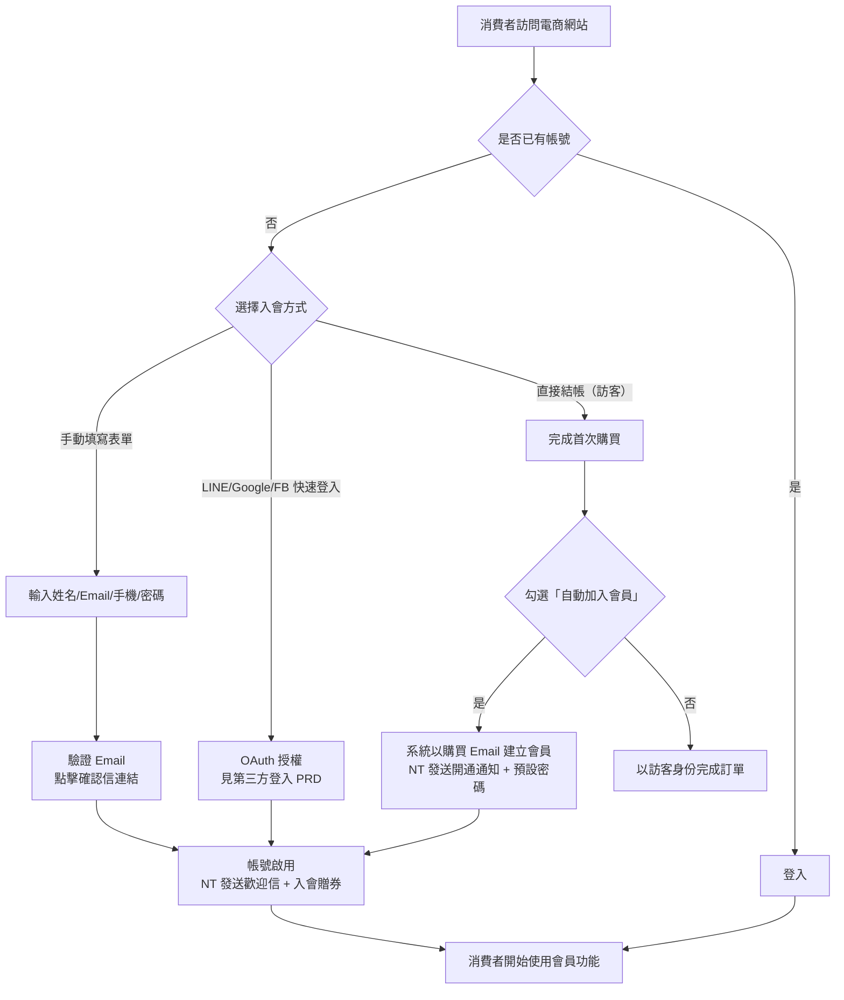
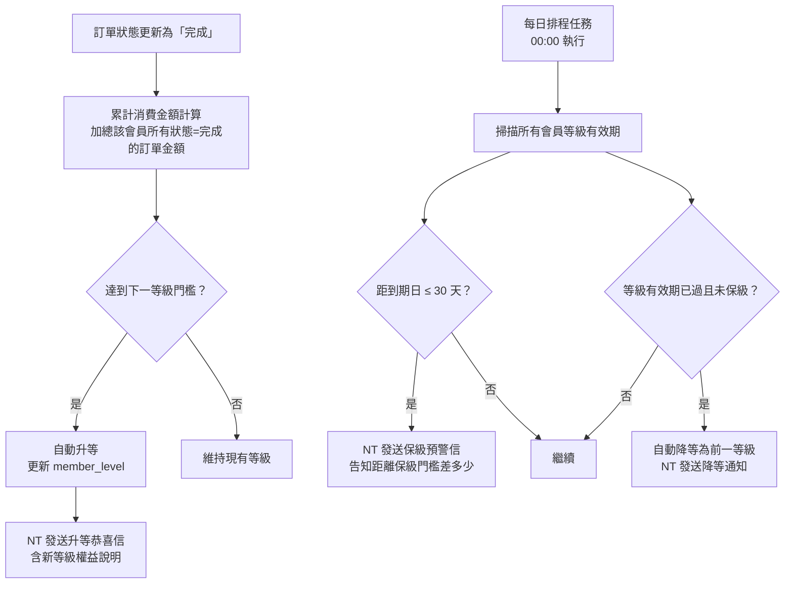
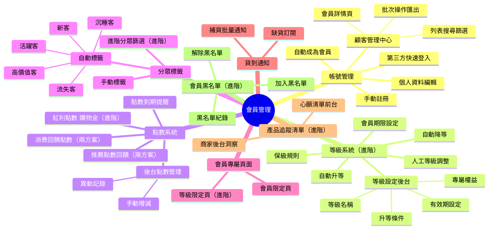
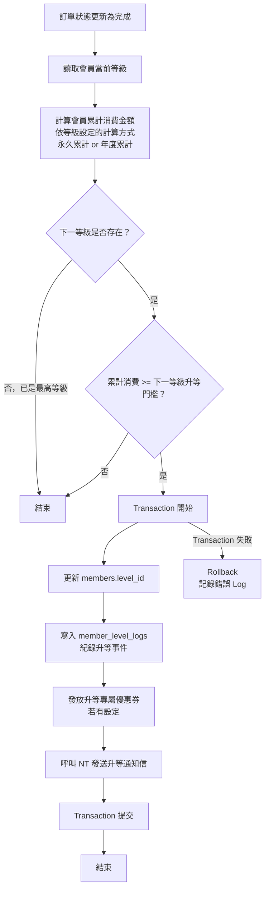
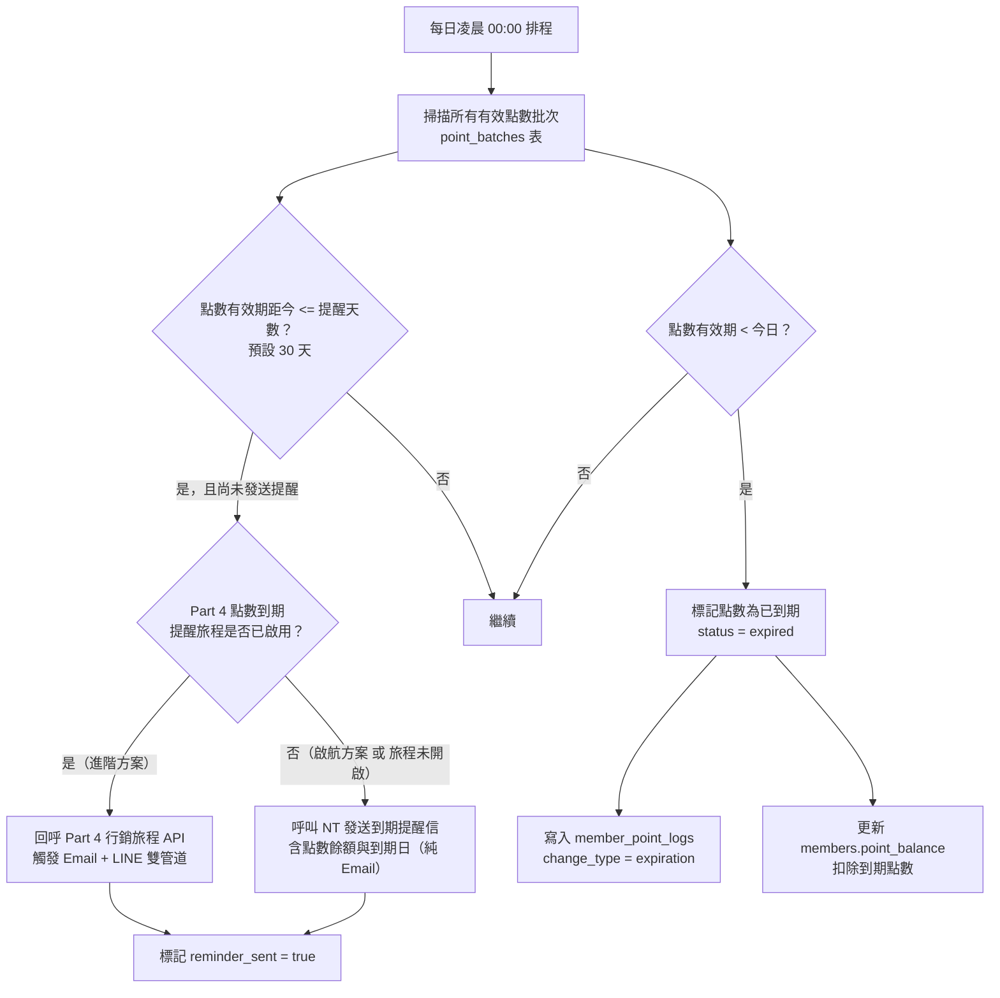
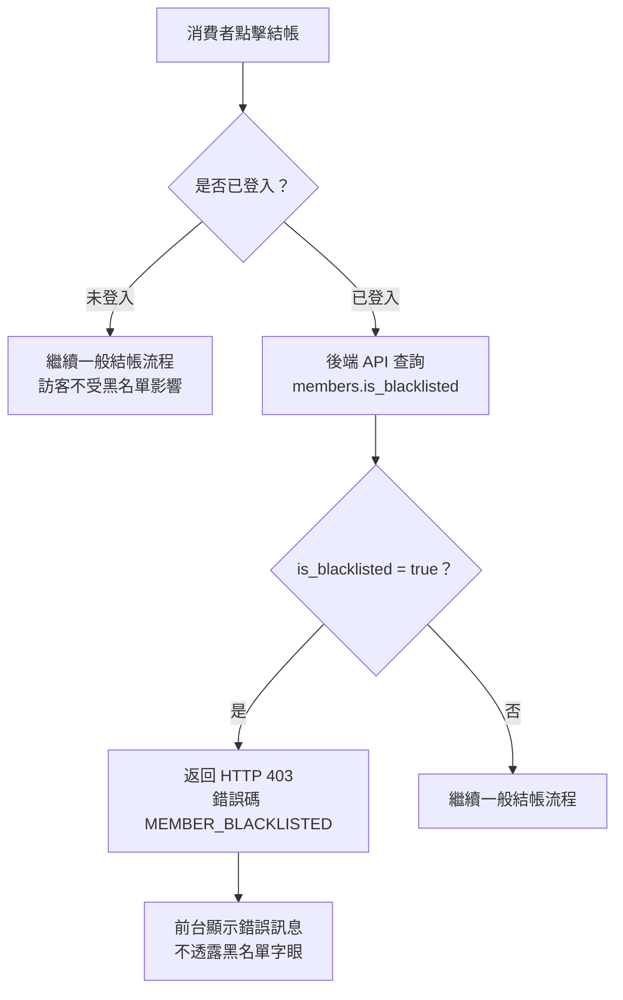

## 版本更新紀錄

| 版本 | 日期 | 修改內容 | 修改人 |
|------|------|----------|--------|
| v2.3 | 2026/06/03 | 依議題 2026-05-23-notification-template-preview-data-source §6.12.E（新增）：通知信預覽功能規格定案——預覽與實際發送共用相同模板資料來源；Sample 變數預設值由技術端維護；商店設定變數帶入實際值；「寄送測試信至我」列 Phase 2 | Una |
| v2.2 | 2026/05/29 | 依議題 2026-05-20-system-tag-flag-on-evo-tags §6.5A：補充系統自動標籤保護規則——商家不可刪除或改名（此 6 標籤為電商數據分析與行銷分眾的計算基礎）；僅對具備電商消費行為的會員計算與顯示（不套用純 CMS 顧客）；過濾由後端統一執行，不由各前端頁面個別判斷 | Una |
| v2.1 | 2026/05/28 | §8.5 移除 SQL 語法：§6.10D 驗證設定 INSERT INTO → 設定欄位需求表；§8.5.2 保級預警 SQL WHERE → 排程邏輯文字說明；§8.5.4 point_batches CREATE TABLE → 業務欄位表（保留 FIFO 扣除語意）；§8.5.8 system_settings INSERT → 資料需求說明；§6.13B DB Schema → 系統設定欄位需求表；工程師重點移除 Redis/SQL 索引語法等實作細節 | Una |
| v2.0 | 2026/05/28 | 23-1：§6.13 補入關閉會員制度後既有會員仍可正常登入的說明；23-2：§6.13 補入訪客結帳關閉後既有購物車保留 + 顯示「請登入後繼續」橫幅的行為說明；23-4：§6.10 補入手機 OTP 共用計量說明（更改手機 OTP 與註冊 OTP 共用同一服務商配額）| Una |
| v1.9 | 2026/05/27 | 實施 12 項議題決議：3-1 新增 `member.view_pii` 權限矩陣（§8.2 安全性）及稽核日誌規格；3-2/3-3 帳號刪除改為匿名化 + 訂單保留 10 年策略（新增 §8.2.1）；3-4 補完年度累計重置「先升等後重置」邏輯及 12/31 邊界處理（§6.3.B）；3-5 簡訊 OTP 啟用商家同意 Dialog + 每日發送上限 + Email fallback（§6.10）；3-6 黑名單加入時立即撤銷 Session + 既有訂單依狀態分流處置（§6.7.C）；3-7 品類愛好者改為僅計葉節點分類 + 業界說明（§6.5.A）；3-8 `points_owed` 後台管理介面含手動清除欄位與稽核日誌（§6.2 點數 Tab）；3-9 推薦連結 v1.0 明文 + 同 IP 速率限制 + 裝置去重規格（§6.4.B）；3-12 心願清單粒度確認為商品層級（§2.2、§6.6） | Una |
| v1.8 | 2026/05/22 | §6.12 通知信管理新增第 10 項「帳號系統自動停用通知」：登入失敗累計 6 次觸發系統自動停用時發送 Email 給消費者（含客服資訊）；進階電商包通知順移為 #11–#14；§6.12.D 防呆規則補入關閉此通知的警示文案；連動 Evomni_前台會員登入_PRD §5.4 | Una |
| v1.7 | 2026/05/22 | 新增 §6.12 通知信管理（SETTINGS 頁型，13 種通知：9 基本 + 4 進階電商包；含防呆警示與進階電商包 disabled 規格）；新增 §6.13 會員設定（全局三開關：啟用會員制度 / 訪客結帳 / 首購自動建立帳號；DB schema system_settings 補充）；補齊原型空白頁規格 | Una |
| v1.6 | 2026/05/21 | 新增 §6.2.B 會員等級 Tag Tooltip 規格（R8 三層）：補齊一般會員 / 銅卡 / 銀卡 / 金卡 / 鑽石卡五種等級的 What / Impact / Next Step；啟航方案下只顯示一般會員（不需 ⓘ）；進階電商包商家有 ≥2 個自定義等級時啟用 ⓘ tooltip | Una |
| v1.5 | 2026/05/21 | 連動 Part4 v1.2：新增 §6.11 會員回饋追回模式（雙模式 Mode A 預設 / Mode B 介面已具備後端 v1.3）；§6.6.C 點數/購物金頁補「待入帳」「待扣」狀態預留說明；§8.5 新增 negative_balance_allowed 設定行為說明 | Una |
| v1.4 | 2026/05/04 | §6.4 新增跨 PRD 連動說明：點數到期提醒提前天數與 Part 4 §6.3.4 旅程共用同一設定值，排程觸發時依進階旅程是否啟用分兩條路（Part 4 API 回呼 or NT 純 Email）；§7.2 流程圖補入 Part 4 旅程分支節點 | Claude（依廖紫茵授權產出）|
| v1.3 | 2026/05/04 | 新增 §6.9 前台會員註冊流程（含 Email 驗證連結 / 簡訊 OTP 完整規格、所有錯誤文案、驗證信/簡訊內容模板）；新增 §6.10 後台驗證方式設定（簡訊服務商設定、DB Schema）；§6.5 分眾補充跨 PRD 連動說明、排程順序、標籤共存互斥完整規則；§6.6 加入顧客管理整合指引備註 | Una |
| v1.2 | 2026/05/04 | §6.6 加入「詳見 Evomni_會員前台個人中心_PRD.md」備註 | Claude（依廖紫茵授權產出）|
| v1.1 | 2026/04/29 | 多處補充（見 Master PRD v1.8–v2.0 版本記錄）| Claude（依廖紫茵授權產出）|
| v1.0 | 2026/04/27 | 初稿建立 | Claude（依廖紫茵授權產出）|

# Evomni — 會員管理 產品需求文件 (PRD)

## 1. 文件資訊

| 屬性 | 內容 |
| --- | --- |
| 版本 | v2.3 |
| 日期 | 2026/06/03 |
| 需求來源 | Master PRD v1.0 Chapter 5（P0）、方案規格 V1.1、PRD V3 §3.2.8、**Part4 行銷活動 PRD v1.2 連動需求** |
| 文件狀態 | v2.3 — §6.12.E 新增：通知信預覽功能規格（資料來源一致性 / Sample 變數預設值 / 商店設定變數 / Phase 2 項目）|
| 作者 | Una |
| 對應方案 | 電商啟航方案 ✅（基礎功能）/ 進階電商包 ✅（進階功能） |
| 關聯文件 | [Part4 行銷活動 PRD](Evomni_Part4_行銷活動_PRD.md)、[Part3 訂單管理 PRD](Evomni_Part3_訂單管理_PRD.md)、[優惠計算引擎技術規格 PRD](Evomni_優惠計算引擎_技術規格_PRD.md) |
| 特別說明 | 會員黑名單（原列為獨立 PRD，P0）併入本文件 §6.7；會員保固/報修（P1）預留章節但標記 Phase 2 |
| 開發時程 | 階段一 5–8月（電商啟航方案）/ 階段二 9–12月（進階電商包）|

---

## 2. 目標與功能總覽

### 2.1 核心願景與相依性

**核心問題：**
會員管理是整個電商系統行銷自動化的底層數據基礎。PRD V3 僅有零散的概念描述，缺乏完整的系統規格。本模組需要定義：
1. 消費者如何成為會員（自動/手動）
2. 會員等級升降級的精確規則
3. 點數獲得、使用、到期的完整邏輯
4. 分眾標籤的自動化規則
5. 會員黑名單機制（阻止惡意消費者）
6. 與行銷模組、LINE OA 的數據介面

**系統相依性（串接的 Evomni 模組）：**

| 模組 | 用途 |
| --- | --- |
| UA（會員認證） | 商家後台登入；消費者帳號創建與身份驗證 |
| NT（發信模組） | 升等通知、點數到期提醒、歡迎信、生日信、降等預警信 |
| DC（數據中心） | 會員分析報表整併至 DC 選單 |
| Part 3 訂單管理 | 消費金額統計、購買次數統計 → 觸發升等/降等/自動標籤 |
| Part 4 行銷活動 | 分眾條件查詢介面；點數贈送入口；會員黑名單排除條件 |
| Part 5 數據中心 | RFM 分群資料來源；顧客消費回購分析 |

---

### 2.2 功能總覽表

本表涵蓋會員管理模組所有子功能，依方案分層標示。

| 主功能模組 | 子功能項目 | 方案歸屬 | 功能目的 | 功能詳細描述 | 影響之使用者 |
| --- | --- | --- | --- | --- | --- |
| 會員帳號管理 | 自動成為會員 | 兩方案共有 | 降低入會門檻 | 消費者完成首次購買即自動建立會員帳號，NT 發送開通通知含預設密碼 | 消費者 |
| 會員帳號管理 | 手動註冊 | 兩方案共有 | 消費者主動入會 | 前台提供標準註冊表單（姓名、Email、手機、密碼）；支援 LINE/Google/FB 快速登入（見獨立 PRD） | 消費者 |
| 會員帳號管理 | 會員資料管理 | 兩方案共有 | 維護會員基本資料 | 後台可查看、編輯、新增會員；前台消費者可編輯個人資料 | 商家管理員、消費者 |
| 會員帳號管理 | 顧客管理中心 | 兩方案共有 | 商家快速掌握會員狀況 | 後台會員列表，含搜尋、篩選、排序、匯出；顯示消費金額、購買次數、最後購買日等 KPI | 商家管理員 |
| 會員等級系統 | 等級設定 | 進階電商包 | 商家自定義會員階梯 | 最多 5 個等級，商家可設定等級名稱、升等條件、有效期、專屬權益 | 商家管理員 |
| 會員等級系統 | 自動升等 | 進階電商包 | 鼓勵消費達標升等 | 消費者訂單「完成」後即時計算累積消費金額，達升等門檻自動升等，NT 通知 | 消費者 |
| 會員等級系統 | 保級與降等 | 進階電商包 | 維護等級制度有效性 | 依年度消費門檻自動降等；到期前 30 天 NT 預警；人工調整介面 | 商家管理員、消費者 |
| 會員等級系統 | 會員期限 | 進階電商包 | 設定會員資格有效期 | 商家可設定會員有效年限（預設永久），期限內未消費自動降為一般會員 | 消費者 |
| 會員點數系統 | 消費回饋點數 | 兩方案共有 | 基礎回購激勵 | 每完成訂單依比例回饋點數（可設定換算比率），點數有效期可設定 | 消費者 |
| 會員點數系統 | 紅利點數（購物金） | 進階電商包 | 進階折抵機制 | 點數可兌換購物金折抵結帳金額，兌換比率商家可設定；含到期提醒機制 | 消費者 |
| 會員點數系統 | 推薦點數回饋 | 兩方案共有 | 口碑裂變成長 | 會員推薦新會員成功首購，雙方各獲得推薦獎勵點數 | 消費者 |
| 會員點數系統 | 點數管理後台 | 兩方案共有 | 商家管理點數發放 | 後台可查看所有會員點數異動記錄；支援手動增減點數（需記錄原因） | 商家管理員 |
| 分眾標籤系統 | 自動標籤規則 | 兩方案共有（基礎）| 自動識別客群 | 系統依消費行為自動標記新客/活躍/高價值/沉睡/流失標籤 | 商家管理員 |
| 分眾標籤系統 | 手動標籤 | 兩方案共有 | 商家自定義分群 | 商家可建立自定義標籤並手動/批次套用至會員 | 商家管理員 |
| 分眾標籤系統 | 進階分眾篩選 | 進階電商包 | 精準分眾行銷 | 多條件組合篩選（消費金額 AND 購買次數 AND 標籤 AND 日期...），結果可發送行銷活動 | 商家管理員 |
| 會員專屬頁面 | 專屬頁面設定 | 兩方案共有（無上限）| 限定會員瀏覽內容 | 商家可將任意頁面設定為「會員限定」，非會員瀏覽時顯示遮罩並引導登入/入會 | 消費者 |
| 會員專屬頁面 | 等級專屬限定頁面 | 進階電商包 | 等級差異化內容 | 頁面可設定最低等級限制；低於該等級的會員顯示「升等後可查看」提示 | 消費者 |
| 貨到通知 | 缺貨商品訂閱 | 兩方案共有 | 挽回潛在失單 | 商品售完時前台顯示「到貨通知」按鈕；消費者點擊登記；補貨時 NT 批量通知 | 消費者 |
| 產品追蹤清單 | 心願清單 | 進階電商包 | 追蹤感興趣商品 | 消費者可收藏商品至追蹤清單（以**商品**為粒度，非 SKU 規格層）；加入購物車時才選擇規格；商家後台可查看哪些商品被收藏最多次 | 消費者、商家管理員 |
| 會員黑名單 | 黑名單管理 | 進階電商包 | 阻止惡意消費者 | 商家可將會員加入黑名單，黑名單會員無法下單；支援加入原因記錄與解除黑名單 | 商家管理員 |

---

## 3. 全局功能流程

### 3.1 消費者入會旅程



### 3.2 會員等級升降級流程



---

## 4. 功能結構圖



---

## 5. 使用者故事

| # | 角色 | 故事 |
| --- | --- | --- |
| US-01 | 消費者 | 身為消費者，我想要在完成第一次購買後自動擁有會員帳號並收到密碼，以便我不需要額外填寫表單就能享有會員優惠。 |
| US-02 | 商家管理員 | 身為商家管理員，我想要在後台看到每位會員的消費總額、購買次數、最後購買日，以便我快速評估客戶價值。 |
| US-03 | 消費者 | 身為累積消費達門檻的消費者，我想要系統自動升等並收到通知，以便我知道自己已享有新等級的優惠。 |
| US-04 | 商家管理員 | 身為商家管理員，我想要設定「累計消費 NT$15,000 升銀卡」的規則，以便系統自動管理升等，不需我手動操作。 |
| US-05 | 消費者 | 身為會員，我想要在生日月份收到優惠券，以便感受到品牌的關懷並有動力消費。 |
| US-06 | 商家管理員 | 身為商家管理員，我想要將「90 天未購買」的會員自動標記為「沉睡客」，以便我能針對這群人發送喚回活動。 |
| US-07 | 消費者 | 身為心願清單使用者，我想要將喜歡的商品加入追蹤清單，以便我之後購買時不用重新搜尋。 |
| US-08 | 商家管理員 | 身為商家管理員，我想要將有惡意退貨記錄的消費者加入黑名單並記錄原因，以便系統阻止他再次下單，同時我有記錄可查。 |
| US-09 | 消費者 | 身為消費者，我想要在點數即將到期前 30 天收到 Email 通知，以便我不會因忘記而損失點數。 |
| US-10 | 商家管理員 | 身為商家管理員，我想要用「消費金額 > NT$5,000 且 最後購買日在 60 天內 且 有標籤『美妝』」這樣的多條件組合篩選出目標會員，以便精準發放特定優惠券。 |
| US-11 | 消費者 | 身為推薦人，我想要推薦朋友加入並首次購買後，雙方都獲得點數獎勵，以便我有動力分享給朋友。 |
| US-12 | 商家管理員 | 身為商家管理員，我想要為客戶手動調整點數（如客服補償），並且必須填寫調整原因，以便日後可追蹤異常。 |

---

## 6. UI/UX 與詳細功能需求

### 6.1 顧客管理中心（後台）

#### A. 核心使用者流程
後台左側選單「會員管理」→「顧客管理中心」→ 查看會員列表 → 篩選/搜尋 → 進入會員詳情頁 → 操作（編輯/加黑名單/調整點數/手動標籤）。

#### B. 介面佈局與元件拆解（Figma Ready）

**頁面結構：**
```
[頁面標題：顧客管理中心]
[統計卡片列]  [總會員數] [本月新增] [活躍會員數] [平均消費金額]
[篩選工具列]  [搜尋框] [等級篩選] [標籤篩選] [消費區間] [日期篩選] [匯出]
[會員列表 Table]
[分頁器]
```

**統計卡片（`<el-card>` 4 欄）：**

| 卡片 | 主數字 | 副文字 |
| --- | --- | --- |
| 總會員數 | 目前所有啟用會員總數 | 較上月 ▲N / ▼N |
| 本月新增 | 本月新增會員數 | 較上月 ▲N / ▼N |
| 活躍會員 | 近 30 天有購買的會員數 | 佔總會員 X% |
| 平均消費金額 | 所有會員的平均終身價值 | 較上月 ▲NT$X / ▼NT$X |

**篩選面板（`<el-popover>`）：**

| 篩選欄位 | 元件類型 | 說明 |
| --- | --- | --- |
| 會員等級 | `<el-checkbox-group>` | 全部、一般會員、銅卡、銀卡、金卡、鑽石卡（依商家設定顯示） |
| 會員標籤 | `<el-select>` multiple | 顯示所有系統標籤 + 商家自定義標籤 |
| 累計消費金額 | 雙欄 `<el-input-number>` | 最小值 / 最大值 |
| 購買次數 | 雙欄 `<el-input-number>` | 最小次 / 最大次 |
| 最後購買日 | `<el-date-picker>` type="daterange" | 日期範圍 |
| 註冊日期 | `<el-date-picker>` type="daterange" | 日期範圍 |
| 黑名單狀態 | `<el-radio>` | 全部、正常、黑名單 |

**會員列表 Table（`<el-table>`）：**

| 欄位 | 寬度 | 說明 |
| --- | --- | --- |
| 勾選框 | 48px | 全選 |
| 會員姓名 | 140px | 可點擊進入詳情；黑名單會員顯示 🚫 icon |
| 手機號碼 | 120px | 顯示 `0912-XXX-XXX`（遮蔽中間） |
| 會員等級 | 100px | `<el-tag class="!rounded-full">` 依等級不同顏色 |
| 標籤 | 160px | 最多顯示 3 個 Tag，超過顯示 `+N` |
| 累計消費 | 100px | `NT$ X,XXX` 右對齊；可排序 |
| 購買次數 | 80px | 數字右對齊；可排序 |
| 最後購買 | 120px | `YYYY/MM/DD` 格式；可排序 |
| 點數餘額 | 80px | 數字右對齊 |
| 加入日期 | 120px | `YYYY/MM/DD` |
| 操作 | 120px | 查看詳情、更多（下拉：加黑名單/移除黑名單/調整點數） |

**等級 Tag 顏色建議：**

| 等級 | Tag 顏色 |
| --- | --- |
| 一般會員 | `#909399`（灰） |
| 銅卡 | `#CD7F32`（銅棕，自定義色） |
| 銀卡 | `#A8A9AD`（銀，自定義色） |
| 金卡 | `#E6A23C`（金黃） |
| 鑽石卡 | `#409EFF`（藍） |

**會員等級 Tag Tooltip 規格（R8）：**

> 等級系統為「進階電商包」功能；啟航方案商家的會員列表僅顯示「一般會員」一種等級（自解釋，不需 ⓘ）。進階電商包商家有 ≥2 個自定義等級時，每個等級 Tag 旁加 ⓘ icon（14px，`#909399`），hover 顯示三層 tooltip。

| 等級類型 | What（這是什麼）| Impact（影響什麼）| Next Step（如何改變）|
|---------|----------------|------------------|---------------------|
| 一般會員 | 尚未達到任何升等門檻的新進會員 | 享有基本會員權益；尚未解鎖等級專屬折扣或優惠 | 顧客累積消費達商家設定的門檻後自動升等 |
| 銅卡（商家自定義）| 已達第一升等門檻的會員，享有初階等級權益 | 享有商家設定的銅卡專屬折扣或優惠券 | 繼續累積消費可升至銀卡；右側可查看各等級門檻 |
| 銀卡（商家自定義）| 已達第二升等門檻的會員，享有中階等級權益 | 享有商家設定的銀卡專屬折扣或優惠券 | 繼續累積消費可升至金卡 |
| 金卡（商家自定義）| 已達第三升等門檻的會員，享有高階等級權益 | 享有商家設定的金卡專屬折扣或優惠券 | 繼續累積消費可升至鑽石卡 |
| 鑽石卡（商家自定義）| 已達最高等級門檻的會員，享有最高等級權益 | 享有商家設定的最高等級專屬折扣或優惠券 | —（最高等級，終態）|

> 等級名稱、顏色、門檻均依商家在「等級設定」頁的設定顯示，tooltip 中的等級名稱使用動態欄位（非寫死「銅/銀/金/鑽石」）。

**批次操作工具列（勾選後顯示）：**
- 批次加標籤
- 批次發送優惠券（連結至 Part 4 行銷活動模組）
- 批次匯出（Excel）→ Toast：「報表產生中，完成後將寄送至您的信箱 📧」

#### C. 互動設計、狀態與系統反饋

- Table 行 Hover 背景 `#F5F7FA`
- 點擊會員姓名以 Router 導覽至會員詳情頁
- 「加黑名單」操作需 `<el-message-box confirm>` 確認框，並強制填寫原因（`<el-input>` 在 confirm 內）
- Empty State：顯示「目前沒有符合條件的會員」+ 「清除篩選條件」按鈕

#### D. 防呆機制與錯誤預防

- 匯出前若篩選結果超過 10,000 筆：`<el-message-box alert>` 提示「資料量較大，匯出完成後將寄至您的後台信箱，請勿重複點擊」
- 黑名單操作：拒絕批次操作（每次只能處理單一會員黑名單，確保操作謹慎）

---

### 6.2 會員詳情頁（後台）

#### A. 介面佈局與元件拆解（Figma Ready）

**頁面結構：**
```
[頁首] 會員：[姓名]  [等級 Tag]  [黑名單 Tag（如適用）]  [操作按鈕組]
[基本資訊 Card]  [姓名/Email/手機/生日/加入日期/來源]  [編輯]
[消費 KPI 卡片列]  [累計消費] [購買次數] [平均客單價] [最後購買日]
[標籤區塊]  [已套用標籤列表]  [新增標籤按鈕]
[Tabs 頁籤]
  [訂單記錄]
  [點數記錄]
  [優惠券]
  [心願清單]
  [黑名單歷程]（如有記錄則顯示）
  [備註]
```

**訂單記錄 Tab：**
- `<el-table>`；欄位：訂單編號（可點擊）、日期、商品摘要、金額、狀態
- 支援分頁，每頁 10 筆

**點數記錄 Tab：**

| 欄位 | 說明 |
| --- | --- |
| 異動日期 | `YYYY/MM/DD HH:mm` |
| 異動原因 | 消費回饋 / 手動增加 / 手動扣除 / 兌換折抵 / 點數到期 / 推薦獎勵 |
| 點數變化 | `+XXX` 綠色 / `-XXX` 紅色 |
| 異動後餘額 | 數字 |
| 備註 | 手動調整時顯示管理員填寫的原因 |

**手動調整點數操作（在點數記錄 Tab 內）：**
- 「調整點數」`<el-button>` → 展開表單（抽屜 `<el-drawer>` 右側滑入）
- 調整類型：`<el-radio-group>` 增加 / 扣除
- 調整數量：`<el-input-number>` min=1；最大值 99,999
- 調整原因：`<el-input type="textarea">` 必填；最多 200 字；Placeholder：「請填寫調整原因，例：客服補償、活動獎勵」
- 確認提交前顯示預覽：「確定為會員 [姓名] [增加/扣除] [N] 點，調整後餘額為 [X] 點」

**點數欠款（`points_owed`）後台管理員介面（3-8 決議）：**

會員詳情頁的「點數記錄 Tab」中，若該會員有 `points_owed > 0`（待扣除點數欠款），顯示以下區塊：

```
[待扣除點數（欠款）區塊]（背景 #FFF0F0，border #F56C6C）
  待扣除點數（欠款）：NT${amount} 點
  說明：此為消費者回饋追回差額，當點數餘額足夠時將自動扣除。
  [手動清除欠款]（<el-button type="danger" plain>）
```

「手動清除欠款」操作流程：
1. 點擊後展開輸入框：「清除原因」`<el-input type="textarea">` **必填**；最多 200 字
2. 確認後執行清除（`points_owed → 0`）
3. 操作記錄寫入稽核日誌（操作人 user_id / 時間 / 清除金額 / 原因）

#### C. 互動設計

- 「編輯基本資訊」：表單行內編輯（`<el-form>`），點擊「儲存」後 `<el-message type="success">` 提示「會員資料已更新」
- 操作按鈕組：發送優惠券 / 加入/移除黑名單 / 調整等級（Human override）

---

### 6.3 會員等級系統設定（後台）

#### A. 後台等級設定頁（進階電商包）

**路徑：** 後台左側選單「會員管理」→「等級設定」

**頁面結構：**
```
[頁面標題：會員等級設定]
[說明文字]：設定會員升等條件與專屬權益。設定儲存後，系統將於每日凌晨 00:00 重新計算所有會員等級。
[等級列表]（拖曳排序，`<el-table>` + drag handle）
[新增等級按鈕]  最多可新增 5 個等級
```

**等級項目設定表單（`<el-dialog>` or 行內展開）：**

| 欄位 | 元件類型 | 驗證規則 | 說明 |
| --- | --- | --- | --- |
| 等級名稱 | `<el-input>` | 必填；最多 10 字 | 例：銀卡、金卡 VIP |
| 等級圖示 | `<el-upload>` Icon 圖片 | 選填；支援 PNG/SVG；建議 64x64px | 顯示於前台會員中心 |
| 升等條件 | `<el-select>` + `<el-input-number>` | 必填 | 選項：累計消費金額 ≥ NT$X / 購買次數 ≥ N 次（二選一或 AND） |
| 累計計算方式 | `<el-radio>` | 必填 | 「永久累計」或「年度累計（每年 1/1 重置）」 |
| 保級條件 | `<el-input-number>` + `<el-select>` 期間 | 選填 | 例：12 個月內累計消費 ≥ NT$X；空白代表永久不降等 |
| 等級有效期 | `<el-input-number>` 月數 / `<el-radio>` 永久 | 必填 | 若設定有效期，期間未達保級條件則降等 |
| 專屬折扣 | `<el-input-number>` 0-99 整數 + % | 選填 | 此等級消費享有額外 X% 折扣 |
| 免運門檻調整 | `<el-input-number>` NT$ | 選填 | 此等級的免運門檻降至 NT$X（低於商店預設） |
| 專屬優惠券 | `<el-select>` 多選 | 選填 | 升等時自動發送選定的優惠券（連結 Part 4 優惠券清單） |
| 入會/升等禮 | `<el-input type="textarea">` | 選填 | NT 通知信中的自定義禮品說明文字，最多 100 字 |
| 是否啟用 | `<el-switch>` | 必填 | 停用的等級不會觸發自動升等，但已升等的會員保留 |

**等級設定驗證規則：**
- 升等條件金額必須遞增（第 N 等級的門檻 > 第 N-1 等級的門檻），違反時欄位邊框 `#F56C6C` + 提示「升等金額必須高於前一等級的門檻（NT$X）」
- 至少需有 1 個等級才能儲存設定

#### B. 升降等排程規格

**升等計算（即時觸發）：**
- 觸發時機：訂單狀態更新為「完成」時即時計算
- 計算邏輯：`SUM(orders.total WHERE member_id = X AND status = 'completed') >= next_level.threshold`
- 升等執行：Transaction 內同時更新 `members.level_id` 和新增 `member_level_logs` 記錄
- NT 通知：升等後立即觸發「升等恭喜信」

**降等計算（排程批次）：**
- 執行時機：每日凌晨 00:00 Cron Job
- 計算邏輯：掃描所有「有保級條件」等級的會員，計算在保級期間內的消費金額是否達保級門檻
- 預警通知：距等級有效期 30 天時觸發 NT 「保級預警信」（只發一次）
- 降等執行：期限到期且未保級，更新 `members.level_id` 至前一等級，NT 發送「等級調整通知」

**年度累計重置策略（確認決議）：**

採「先升等、後重置」邏輯，確保消費者年底達標時不受重置影響：

| 時間點 | 執行動作 |
|--------|---------|
| 12/31 23:59 | 執行所有待升等計算：若 `yearly_total_spent` 已跨越升等門檻 → 完成升等，NT 發升等通知 |
| 1/1 00:00 | 將 `yearly_total_spent` 重置為 0；**現有等級不變**，依 `level_expires_at` 維持等級有效期 |
| 後續排程 | 等級有效期到期後，依保級條件判斷是否降等（邏輯同上方「降等計算」） |

**Edge Case：12/31 達標邊界處理**
- 消費者在 12/31 完成訂單，訂單完成事件觸發即時升等計算（見「升等計算-即時觸發」）
- 12/31 23:59 年底排程執行前，即時升等已完成 → 排程確認無重複升等
- 1/1 00:00 重置 `yearly_total_spent` 時，消費者已持有新等級，保留至 `level_expires_at`

---

### 6.4 會員點數系統

#### A. 點數規則設定（後台）

**路徑：** 後台左側選單「會員管理」→「點數設定」

**設定欄位：**

| 欄位 | 元件 | 預設值 | 驗證規則 |
| --- | --- | --- | --- |
| 消費回饋比率 | `<el-input-number>` 每消費 NT$1 回饋 X 點 | 1 | 必填；最小 0（代表停用回饋）；最大 100 |
| 單筆訂單最高回饋點數 | `<el-input-number>` | 500 | 選填；0 代表無上限 |
| 兌換比率（進階方案） | `<el-input-number>` X 點 = NT$1 | 100 | 必填；最小 1 |
| 單筆最多折抵比例（進階方案） | `<el-input-number>` 最多折抵訂單金額 X% | 50 | 必填；0-100 整數 |
| 使用點數最低訂單金額 | `<el-input-number>` NT$ | 100 | 必填 |
| 點數有效期 | `<el-input-number>` 月數 + `<el-radio>` 永久 | 12 個月 | 必填 |
| 點數到期提醒提前天數 | `<el-input-number>` 天 | 30 | 必填；10-60 天 |

> **📌 跨 PRD 連動說明（進階電商包）：** 本節「點數到期提醒提前天數」設定值會**同步顯示**於 Part 4 行銷活動 §6.3.4「點數/優惠券到期提醒旅程」的設定頁（兩處共用同一數值，修改任一處即雙向同步）。
>
> 每日凌晨 00:00 排程偵測到即將到期的點數批次後，執行以下分支：
> - **若商家已在 Part 4 啟用「點數到期提醒旅程」** → 回呼 Part 4 行銷旅程 API，由旅程負責 Email + LINE 雙管道發送，並標記 `reminder_sent = true`
> - **若旅程未啟用（啟航方案 或 進階方案未開啟）** → 退回由 NT 單獨發送純 Email 提醒信
>
> 同一到期批次只通知一次（無論走哪條路）。詳見 §7.2 點數到期流程圖。

> 設定說明 Tooltip（`<el-tooltip>`）：
> - 消費回饋比率旁 ❓：「消費者每消費 NT$1 自動獲得 X 點。例：設定為 1，消費 NT$500 可獲得 500 點」
> - 兌換比率旁 ❓：「消費者使用 X 點可折抵 NT$1。例：設定為 100，則 1,000 點可折抵 NT$10」

#### B. 點數計算規格

**回饋時機：**
- 訂單狀態更新為「完成」時發放（非付款時，防止退款後點數問題）
- 計算公式：`FLOOR(訂單商品實付金額 ÷ 消費比率) 點`（不含運費、不含點數折抵部分）

**推薦機制：**
- 推薦人 A 分享推薦連結（含 `ref=A的會員ID` 參數，v1.0 採明文格式 `/ref/{memberId}`）
- 被推薦人 B 透過連結註冊並完成首次購買
- 事件觸發：B 的訂單狀態更新為「完成」後，系統：
  1. 發放 B 的「被推薦人首購獎勵點數」（數量於後台設定）
  2. 發放 A 的「推薦人成功獎勵點數」（數量於後台設定）
  3. 兩筆點數異動各記錄一筆 `member_point_logs`，`change_type = 'referral_reward'`

**推薦連結安全機制（v1.0，3-9 決議）：**

| 防護機制 | 規格 |
|---------|------|
| 同 IP 點擊速率限制 | 同一 IP 每小時最多點擊 N 次（N 可後台設定，建議預設 20）；超過後忽略該 IP 的後續點擊，不報錯給用戶 |
| 裝置去重 | 同一裝置（以 fingerprint 或 Cookie 識別）對同一推薦連結只計算一次；重複點擊不累計 |
| 獎勵觸發時機 | 綁定於**完成購買**（訂單狀態 `completed`），不綁定連結點擊或註冊行為 |
| 防自我推薦 | 後端驗證推薦人 ID 不可等於被推薦人 ID |

**v2.0 預留（Phase 2 評估）：** 將 `/ref/{memberId}` 改為簽名 Token 格式（含 HMAC 驗證），依 Phase 1 的詐騙率決定是否導入；v1.0 以購買觸發獎勵作為主要防詐手段，複雜度低且符合上線時程。

**生日雙倍點數（進階方案）：**
- 判斷邏輯：訂單成立日期的月份 == 會員生日月份 → 回饋點數 × 2
- NT 通知：生日月份第一天自動發送「本月生日雙倍點數」提醒信

---

### 6.5 分眾標籤系統

> **📌 跨 PRD 連動說明：** 本節的「沉睡客」與「流失客」系統自動標籤，是 Part 4 行銷活動 §6.3.2 **沉睡客喚醒旅程**和**流失客挽留旅程**的觸發依據。兩個 PRD 須對齊天數定義；若本節修改標籤判斷天數，Part 4 §6.3.2 的觸發條件必須同步更新。

#### A. 系統自動標籤規則

以下標籤由**每日凌晨 02:00（系統排程 Cron Job）**自動計算，商家無法修改規則，只能查看。

> **系統自動標籤保護規則（依議題 2026-05-20-system-tag-flag-on-evo-tags 決議）：**
>
> - **商家不可刪除、不可改名**：此 6 個系統標籤是電商數據分析與行銷分眾的計算基礎；若遭誤刪或改名，自動標記排程將失效，連帶導致行銷活動觸發條件失準。資料庫層的具體保護機制由技術端決定
> - **僅對具備電商消費行為的會員計算與顯示**：不套用於純 CMS 顧客（無電商消費記錄者）；過濾邏輯由後端統一執行，所有標籤顯示介面行為保持一致，不由各前端頁面個別判斷（避免新增標籤顯示入口時遺漏過濾邏輯）

| 標籤名稱 | 自動判斷條件 | 標籤 Tag 顏色 | Part 4 連動旅程 |
| --- | --- | --- | --- |
| 新客 | 首次購買後 30 天內（以第一筆 `status=completed` 訂單的 `completed_at` 為基準） | `#67C23A`（綠） | 無（新客本身不需要喚醒旅程） |
| 活躍客 | 近 30 天內有 `status=completed` 訂單 | `#409EFF`（藍） | 無 |
| 高價值客 | 近 365 天累計消費金額 > 所有活躍會員平均客單價 × 2；至少有 2 筆完成訂單 | `#E6A23C`（金） | 流失客挽留旅程開啟 RFM 連動時，優先觸發此標籤會員 |
| 沉睡客 | 最後一筆 `status=completed` 訂單距今 90 天以上且未超過 180 天 | `#909399`（灰） | **Part 4 §6.3.2 沉睡客喚醒旅程**（每日排程觸發） |
| 流失客 | 最後一筆 `status=completed` 訂單距今超過 180 天，或從未有任何完成訂單且加入超過 180 天 | `#F56C6C`（紅） | **Part 4 §6.3.2 流失客挽留旅程**（每日排程觸發） |
| 品類愛好者 | 同一商品**葉節點分類**（最底層分類，無子分類）完成訂單次數 ≥ 3 次；自動偵測購買頻次最高的葉節點分類，並記錄分類名稱；**不計入**父分類或中間層分類 | `#409EFF`（藍） | Part 4 優惠券發放可篩選此標籤 |

**品類愛好者標籤 — 葉節點規則說明（3-7 決議）：**

- **葉節點**定義：商品分類樹中無子分類的最底層節點（例：「服飾 > 上衣 > T恤」中，「T恤」為葉節點）
- 統計時只計算訂單中商品所屬的葉節點分類；父層分類（如「上衣」「服飾」）不納入計算
- 葉節點標籤可由後端資料彙總推算父類偏好，但介面標籤僅呈現葉節點名稱
- 業界標準：與 SHOPLINE 一致，葉節點才能精確反映消費者真實購買偏好

**標籤共存與互斥規則：**

| 組合 | 規則 |
| --- | --- |
| 新客 + 活躍客 | ✅ 可共存（首購後 30 天內同時有活躍行為） |
| 新客 + 沉睡客 | ❌ 互斥（新客期間不可能進入 90 天未購） |
| 沉睡客 + 流失客 | ❌ 互斥（時間區間不重疊）；達 180 天後系統自動移除「沉睡客」並改標「流失客」 |
| 活躍客 + 沉睡客 | ❌ 互斥；活躍客每日更新後若不再符合，隔日自動移除 |
| 高價值客 + 流失客 | ✅ 可共存（高價值但已超過 180 天未購）；流失旅程 RFM 連動時會優先處理此族群 |
| 品類愛好者 + 任何標籤 | ✅ 可共存 |

**排程執行順序（每日 02:00）：**
1. 計算所有會員最後購買日 → 更新沉睡/流失客標籤
2. 計算活躍客（近 30 天有訂單）
3. 計算高價值客（年度消費 × 客單價比較）
4. 計算品類愛好者
5. 移除不再符合條件的標籤（如：活躍客昨天符合、今天不符合 → 自動移除）
6. 觸發 Part 4 沉睡/流失旅程（若旅程已啟用）

**完成訂單的定義：** `orders.status = 'completed'`；退換貨成功後 `status` 變更為 `refunded`，不計入購買天數計算。

#### B. 商家自定義標籤

**後台路徑：** 「顧客」→「顧客管理」→ 會員詳情頁，或「會員管理」→「標籤管理」

**標籤建立表單：**

| 欄位 | 元件 | 驗證規則 |
| --- | --- | --- |
| 標籤名稱 | `<el-input>` | 必填；最多 15 字；不可與系統自動標籤同名（新客/活躍客/高價值客/沉睡客/流失客/品類愛好者） |
| 標籤顏色 | `<el-color-picker>` | 選填；預設 `#909399` |
| 說明備註 | `<el-input>` | 選填；最多 50 字；內部備忘用，不對消費者顯示 |

**套用方式：**
- 單一套用：顧客詳情頁「新增標籤」按鈕 → `<el-select>` 選擇標籤 → 儲存
- 批次套用：顧客管理列表勾選多名會員 → 批次工具列「加標籤」→ 選擇標籤 → 確認

**移除方式：**
- 在顧客詳情頁標籤區塊，點擊標籤右側 `×` 即可移除自定義標籤
- 系統自動標籤不提供手動移除按鈕（僅能由排程自動移除）

#### C. 進階分眾篩選器（進階電商包）

**後台路徑：** 「會員管理」→「分眾篩選」

**篩選條件介面（動態新增條件）：**

每個條件行由 3 個元件組成：
1. 篩選欄位 `<el-select>`：累計消費金額 / 購買次數 / 最後購買日距今天數 / 會員等級 / 會員標籤（含系統標籤+自定義標籤）/ 商品分類購買記錄 / 加入日期 / 身分類型（顧客/會員）
2. 比較運算子 `<el-select>`：大於 / 小於 / 等於 / 包含 / 介於
3. 比較值 `<el-input>` or `<el-select>`（依欄位類型動態切換）

條件間關係：`<el-radio>` 符合「所有條件（AND）」/ 「任一條件（OR）」

> ⚠️ v1.0 限制（見 §8.5.7）：AND/OR 為全域設定，不支援混合邏輯（如「條件A AND 條件B OR 條件C」的括號分組）。

**操作按鈕：**
- 新增條件（`+` 圖示按鈕）
- 預覽符合人數（`<el-button type="primary">`）→ Loading 後顯示「符合條件的顧客/會員共 **N 人**」
- 發送優惠券（`<el-button type="primary">`）→ 連結至 Part 4 優惠券發送介面，帶入篩選結果（僅對**會員**有效，顧客不在電商名單）
- 儲存為分眾群組（`<el-button>`）→ 輸入群組名稱後儲存，供日後重複使用

---

### 6.6 會員前台功能（消費者端）

> **📌 注意：** 本節為前台個人中心的頁面架構總覽與核心欄位規格。完整 Figma Ready 的 UI/UX 規格（含我的訂單、收件地址管理、優惠券頁、心願清單、帳號安全、RWD 佈局等）已獨立於 **`Evomni_會員前台個人中心_PRD.md`**，請設計師與工程師以該文件為實作依據。

#### A. 前台會員中心頁面結構

```
[頁面標題：我的帳戶]
[左側導覽 or Tab 列]
  [個人資料]
  [我的訂單]
  [點數/購物金]
  [優惠券]
  [心願清單]（進階方案；以商品粒度收藏，非 SKU 層；加入購物車時才選規格）
  [推薦好友]
  [帳號安全]
```

#### B. 個人資料頁

**可編輯欄位：**

| 欄位 | 元件 | 驗證規則 |
| --- | --- | --- |
| 姓名 | `<el-input>` | 必填；最多 20 字 |
| 手機號碼 | `<el-input>` | 必填；台灣手機格式 `09XXXXXXXX`；更改需 OTP 驗證 |
| Email | `<el-input>` | 必填；有效 Email 格式；更改需 Email 驗證連結 |
| 生日 | `<el-date-picker>` | 選填；年齡需 ≥ 7 歲；一旦設定後不可更改（防止刷生日禮） |
| 性別 | `<el-radio>` 男/女/不透露 | 選填 |
| 收件地址（可多筆） | 縣市 + 區 + 地址組合；最多 5 筆 | 選填 |

**手機號碼更改 OTP 流程：**
1. 點擊「更改手機」→ 輸入新手機號碼
2. 點擊「發送驗證碼」→ 系統透過 NT/簡訊發送 6 位數 OTP（有效期 5 分鐘）
3. 輸入 OTP → 驗證成功 → 更新手機號碼
4. OTP 錯誤提示：「驗證碼錯誤，請重新確認，剩餘 N 次嘗試機會」
5. 超過 5 次錯誤：鎖定 30 分鐘，提示「驗證次數超過上限，請於 30 分鐘後再試」

#### C. 點數/購物金頁（前台）

```
[點數概覽 Card]
  目前點數餘額：XXX 點
  等值購物金：NT$ XX（依兌換比率換算，進階方案顯示）
  [即將到期點數區塊]（若有）：N 點將於 YYYY/MM/DD 到期  ⚠️
  
[點數異動記錄 Table]
  日期 / 原因 / 點數變化 / 餘額
```

> 「即將到期點數」區塊：背景 `#FFF8E1`（淡黃）+ `⚠️` icon，強調促進使用。

**v1.5 補充 — 「待入帳」狀態預留：**

連動 Part4 v1.2 §6.6 回饋活動：訂單完成前的回饋（消費集點、購物金/點數回饋）預計顯示為「待入帳」狀態。

```
[點數概覽 Card]（v1.5 預留欄位）
  目前點數餘額：XXX 點
  待入帳點數：YYY 點（訂單完成後發放）   ← v1.5 預留
```

- v1.5 UI 預留此欄位但**不顯示應收／待扣資訊**（依 Part4 §6.6C 決議：會員端對應收完全透明）
- 「待入帳」資料來源：訂單狀態為「已送達」或「已完成 < 7 天」且尚未觸發回饋發放的訂單預估金額
- Mode B（負餘額，後端 v1.3 啟用）相關「待扣回饋」UI 規格詳見 [Part4 後續擴充規劃 §E-05](Evomni_Part4_行銷活動_後續擴充規劃_PRD.md)

#### D. 推薦好友頁（前台）

```
[說明文字]：推薦朋友加入，雙方各獲 XXX 點！
[我的推薦連結]：https://[shop-domain]/ref/[member-id]  [複製連結] 按鈕
[分享按鈕]：LINE / 複製連結
[推薦記錄 Table]：被推薦人姓名（隱藏）/ 加入日期 / 是否已首購 / 我獲得的點數
[目前已推薦 N 人，共獲得 X 點]
```

---

### 6.7 會員黑名單（⚠️ P0 核心規格，原獨立 PRD 併入）

#### A. 核心流程

商家後台發現惡意會員（異常退貨、詐騙下單、違反條款）→ 進入會員詳情頁 → 操作「加入黑名單」→ 填寫原因 → 確認 → 黑名單生效。

黑名單會員嘗試下單 → 系統阻擋 → 前台顯示錯誤訊息（不透露原因）。

#### B. 後台黑名單管理介面

**後台路徑：** 「會員管理」→「黑名單管理」（或在會員詳情頁直接操作）

**黑名單列表：**

| 欄位 | 說明 |
| --- | --- |
| 會員姓名 | 可點擊連結至詳情頁 |
| Email | 完整顯示 |
| 手機號碼 | 遮蔽中間 4 碼 |
| 加入黑名單日期 | `YYYY/MM/DD HH:mm` |
| 加入原因 | 文字；Hover 顯示完整內容 Tooltip |
| 操作人 | 管理員帳號名稱 |
| 操作 | 「解除黑名單」`<el-button type="primary">` |

**加入黑名單操作（`<el-dialog>`）：**

| 欄位 | 元件 | 驗證規則 |
| --- | --- | --- |
| 加入原因 | `<el-input type="textarea">` | **必填**；最少 10 字；最多 300 字；Placeholder：「請詳細說明將此會員加入黑名單的原因，例：惡意退貨 X 次、疑似詐騙下單等。此記錄不對消費者顯示，僅供內部查核。」 |
| 確認核對 | `<el-checkbox>` | 必勾選；文字：「我確認此操作，加入黑名單後該會員將無法在本商店下單」 |

**解除黑名單確認框：**
`<el-message-box confirm>` 文字：「確定要解除 [姓名] 的黑名單？解除後，該會員可以再次在本商店下單。如有疑慮，建議維持黑名單狀態。」

#### C. 黑名單攔截規格（前台 + 後端）

**加入黑名單立即生效的限制（3-6 決議）：**

加入黑名單後，以下功能**立即**對該會員限制：
- 限制登入（強制登出所有現有 Session；`session_tokens` 標記 `is_revoked = true`）
- 限制新訂單建立
- 限制付款
- 限制使用特定服務（依商家配置）

**攔截時機：**
1. 黑名單會員登入後加入購物車時：購物車仍可操作
2. 黑名單會員點擊「前往結帳」時：系統攔截

**前台錯誤訊息（結帳頁）：**
`<el-alert type="error">` 文字：「很抱歉，目前您的帳戶無法完成結帳。如有疑問，請聯繫客服。」

> 注意：不得透露「黑名單」字眼，避免引發爭議或消費者到處聲稱被不公平對待。

**後端攔截邏輯：**
- 建立訂單 API（`POST /api/orders`）在執行前檢查：`members.is_blacklisted = true` → 返回 HTTP 403，錯誤碼 `MEMBER_BLACKLISTED`
- 訪客結帳（未登入）：不受黑名單影響（黑名單僅針對已登入會員）

**既有訂單處置（加入黑名單時依訂單狀態分流）：**

| 訂單狀態 | 處置方式 |
|---------|---------|
| 待付款 | 限制繼續付款；訂單依原有逾時機制自動過期取消（不立即強制取消） |
| 已付款未出貨 | 進入人工審核佇列；後台訂單列表顯示 `<el-tag type="danger">黑名單待審</el-tag>` 警示標籤 |
| 已出貨 | 維持原出貨流程，不干預；客服可自行追蹤後續情況 |
| 已完成 | 維持不變；客服可自行追蹤後續情況 |

- **不自動取消任何既有訂單**（避免商家承擔退款成本與爭議）
- 後台被黑名單會員的訂單列表頂部顯示醒目警示 Banner：「此會員已被加入黑名單，訂單請依商家政策人工處理。」

#### D. 黑名單歷程記錄

每次加入/解除黑名單，寫入 `member_blacklist_logs` 表：

| 欄位 | 說明 |
| --- | --- |
| `member_id` | 會員 ID |
| `action` | `add` 或 `remove` |
| `reason` | 原因文字 |
| `operated_by` | 管理員 user_id |
| `ip_address` | 操作者 IP |
| `created_at` | 操作時間 |

---

### 6.8 貨到通知

#### A. 前台（消費者）

商品頁面商品售完（庫存 = 0）時，「加入購物車」按鈕替換為：
- 按鈕文字：「到貨通知我」
- 按鈕樣式：`<el-button type="default" class="!rounded-none">` + 🔔 icon
- 已登入會員：點擊直接訂閱，顯示 `<el-message type="success">` 「已訂閱到貨通知，補貨時將寄信通知您」
- 未登入訪客：點擊後顯示 Modal，要求輸入 Email → 輸入後訂閱

**Modal 欄位（未登入訪客用）：**

| 欄位 | 元件 | 驗證規則 |
| --- | --- | --- |
| Email | `<el-input>` | 必填；有效 Email 格式；錯誤提示：「請輸入有效的電子信箱格式」 |
| 隱私同意 | `<el-checkbox>` | 必勾選；文字：「我同意收到此商店的補貨通知電子郵件」 |

#### B. 後台（商家）

**後台路徑：** 「商品管理」→ 商品詳情 →「到貨通知訂閱者」Tab（或在「會員管理」→「貨到通知」）

**顯示資訊：**
- 商品名稱 / 規格
- 訂閱人數（含已登入會員數、訪客 Email 數）
- 訂閱列表（隱藏部分個資）

**補貨後自動通知觸發：**
- 庫存由 0 變為 > 0 時（無論是手動更新、退貨回補、或批次匯入）
- 系統自動呼叫 NT 批量發送補貨通知信（依訂閱列表）
- 通知發送後，清除該商品的訂閱記錄（避免重複通知）

---

### 6.9 前台會員註冊流程（含驗證機制）

> **📌 注意：** 本節定義消費者在電商前台的主動會員申請流程。驗證方式（Email 驗證連結 or 簡訊 OTP）由商家在後台「全域設定 > 電商進階設定 > 會員驗證設定」決定，前台 UI 依此動態切換。詳見 §6.10。

**路由：** `/register`（前台消費者頁面）

#### A. 核心使用者流程

消費者點擊前台「加入會員」→ 填寫基本資料 → 依商家設定進行 **Email 驗證** 或 **簡訊 OTP** → 驗證通過 → 帳號啟用 → 導向會員中心或原來的頁面。

#### B. 註冊表單元件規格（Figma Ready）

**共用欄位（兩種驗證方式均顯示）：**

| 欄位 | 元件 | Placeholder | 驗證規則 | 錯誤訊息 |
| --- | --- | --- | --- | --- |
| 姓名 | `<el-input>` | 請輸入您的姓名 | 必填；最多 20 字 | 「姓名為必填欄位」 |
| 密碼 | `<el-input type="password" show-password>` | 請設定密碼（8–30 個字元） | 必填；8–30 字；需含英文+數字 | 「密碼需為 8–30 個字元，且須包含英文字母與數字」 |
| 確認密碼 | `<el-input type="password" show-password>` | 請再次輸入密碼 | 必填；需與密碼一致 | 「兩次輸入的密碼不相同，請重新確認」 |
| 密碼強度指示條 | 進度條（同 §6.9 帳號安全規格） | — | 即時計算 | — |
| 服務條款同意 | `<el-checkbox>` | — | 必勾選 | 「請先閱讀並同意服務條款與隱私政策」 |

**模式一：Email 驗證連結（商家後台選擇此模式時顯示）：**

| 欄位 | 元件 | Placeholder | 驗證規則 | 錯誤訊息 |
| --- | --- | --- | --- | --- |
| Email | `<el-input>` | 請輸入您的電子信箱 | 必填；Email 格式；即時驗證 | 「請輸入有效的電子信箱格式，例：name@example.com」 |

**模式二：簡訊 OTP（商家後台選擇此模式時顯示）：**

| 欄位 | 元件 | Placeholder | 驗證規則 | 錯誤訊息 |
| --- | --- | --- | --- | --- |
| Email | `<el-input>` | 請輸入您的電子信箱 | 必填；Email 格式 | 「請輸入有效的電子信箱格式」 |
| 手機號碼 | `<el-input>` type="tel" | 請輸入台灣手機號碼（09開頭） | 必填；`09XXXXXXXX` 格式；即時驗證（blur） | 「請輸入有效的台灣手機號碼格式，例：0912345678」 |
| 驗證碼輸入 | `<el-input>` maxlength="6" | 請輸入 6 位數驗證碼 | 必填；6 位數字 | 「請輸入 6 位數驗證碼」 |
| 發送驗證碼按鈕 | `<el-button class="!rounded-none">` | — | 手機號碼格式正確後才 Enable | — |

**表單送出按鈕：**
- `<el-button type="primary" class="!rounded-none" size="large">` 文字：「立即加入」
- Loading 狀態：Disabled + Spinner
- 已有帳號連結：「已有帳號？[登入]」

#### C. 驗證流程詳細規格

---

**📧 模式一：Email 驗證連結流程（6 步驟）**

| 步驟 | 動作 | 前台顯示 |
| --- | --- | --- |
| 1 | 消費者填完表單，點擊「立即加入」 | 按鈕進入 Loading 狀態 |
| 2 | 後端建立帳號（`status = pending_activation`），透過發信系統寄出驗證信 | — |
| 3 | 頁面切換為「驗證等待畫面」 | 見下方規格 |
| 4 | 消費者點擊信件中驗證連結 | — |
| 5 | 後端驗證 Token → 帳號 `status` 更新為 `active` | — |
| 6 | 前台顯示「✅ 驗證成功！歡迎加入」→ 3 秒後導向會員中心 | — |

**「驗證等待畫面」元件規格：**

```
[✉️ 圖示]
驗證信已寄出！
請前往 [email@example.com] 收取驗證信，
點擊信件中的連結即可完成會員驗證。
連結有效期：[N] 小時（依商家設定，預設 24 小時）

[重新寄送驗證信]（按鈕，初始 60 秒倒數後才可點擊）
倒數文字：「重新寄送（58）」直到歸零顯示「重新寄送驗證信」

沒收到信？請檢查垃圾郵件資料夾，或確認信箱輸入正確。
[更換電子信箱] 連結 → 返回上一步重新填寫
```

**倒數計時器規格（重新寄送）：**
- 初始進入等待畫面後立即開始倒數 60 秒
- 倒數中：按鈕文字「重新寄送（N）」，`Disabled` 狀態，`color: #909399`
- 倒數結束：按鈕文字「重新寄送驗證信」，`Normal` 狀態，可點擊
- 點擊重送後：重新觸發 60 秒倒數；同一 Email 每分鐘最多發送 1 次（速率限制）；Toast「驗證信已重新寄出」

**驗證連結過期處理：**
- 消費者點擊過期連結：前台顯示「此驗證連結已過期，請重新申請驗證信」+ [重新發送驗證信] 按鈕
- Token 使用後即失效（一次性）；不得重複使用

**驗證信內容規格（透過發信系統）：**

| 項目 | 內容 |
| --- | --- |
| 寄件者 | [商店名稱] `<noreply@evomni.com>` |
| 主旨 | 「[{shop_name}] 請驗證您的電子信箱，完成會員申請」 |
| 內容變數 | `{member_name}`、`{shop_name}`、`{verify_link}`（含 Token 的完整 URL）、`{expire_hours}`（連結有效小時數） |
| 行動呼籲按鈕 | 「立即驗證我的信箱」→ `{verify_link}` |
| 備用文字連結 | 「若按鈕無法點擊，請複製以下連結至瀏覽器：{verify_link}」 |
| 安全聲明 | 「若您未申請過此帳號，請忽略此信，您的信箱不會被使用。」 |

---

**📱 模式二：簡訊 OTP 流程（7 步驟）**

| 步驟 | 動作 | 前台顯示 |
| --- | --- | --- |
| 1 | 消費者填寫手機號碼後，點擊「發送驗證碼」 | 按鈕進入 Disabled + 60 秒倒數 |
| 2 | 後端透過簡訊服務商 API 發送 6 位數 OTP | — |
| 3 | 消費者手機收到簡訊 | — |
| 4 | 消費者填完表單（含 OTP），點擊「立即加入」 | 按鈕 Loading |
| 5 | 後端驗證 OTP（格式、有效期、嘗試次數） | — |
| 6 | OTP 正確：帳號建立完成，`status = active` | Toast「歡迎加入！」|
| 7 | 導向會員中心 | — |

**發送驗證碼按鈕倒數計時規格：**
- 點擊後：按鈕文字改為「重新發送（60）」，Disabled，`color: #909399`
- 每秒遞減，歸零後：按鈕文字「重新發送驗證碼」，Normal，可點擊
- 重送：重新觸發 60 秒；同一手機每分鐘最多發送 1 次（Redis 速率限制）

**驗證碼輸入欄狀態規格：**

| 狀態 | 樣式 |
| --- | --- |
| 空白（初始）| 無邊框高亮 |
| 輸入中 | Focus 藍框 `border: 1px solid #409EFF` |
| 驗證成功 | ✅ 綠色 icon |
| 驗證錯誤（< 5 次）| 紅框 `border: 1px solid #F56C6C` + 錯誤訊息 |
| 驗證錯誤（= 5 次）| 整個表單鎖定 30 分鐘 |
| OTP 過期 | 特定錯誤訊息 |

**完整錯誤訊息文案：**

| 情境 | 錯誤訊息文案 |
| --- | --- |
| OTP 錯誤（第 1–4 次）| 「驗證碼錯誤，請重新確認，剩餘 N 次嘗試機會」 |
| OTP 錯誤（第 5 次，鎖定）| 「驗證次數超過上限，請於 30 分鐘後再試，或重新發送驗證碼」 |
| OTP 過期（5 分鐘後）| 「驗證碼已過期，請點擊重新發送驗證碼」 |
| 手機號碼格式錯誤 | 「請輸入有效的台灣手機號碼格式，例：0912345678」 |
| 手機號碼已被使用 | 「此手機號碼已被其他帳號使用，請直接登入或使用其他號碼」 |
| Email 已被使用 | 「此電子信箱已被使用，請直接登入或使用忘記密碼功能」 |
| 簡訊服務商發送失敗 | 「驗證碼發送失敗，請稍後再試。若持續失敗，請聯絡商店客服。」 |

**簡訊內容規格（透過簡訊服務商 API）：**

| 項目 | 內容 |
| --- | --- |
| 簡訊文字 | 「【{shop_name}】您的驗證碼為 {OTP}，有效期 {expire_minutes} 分鐘，請勿洩露給他人。」 |
| 變數 | `{shop_name}`（商店名稱最多 10 字，超過截斷）、`{OTP}`（6 位數字）、`{expire_minutes}`（依設定，預設 5） |
| 字數限制 | 建議不超過 70 字（單則簡訊）以控制費用 |

#### D. 已有帳號的防衝突機制

| 情境 | 系統行為 |
| --- | --- |
| Email 已存在（`members` 表）| 不允許重複申請；顯示錯誤訊息：「此電子信箱已被使用，請直接登入或使用忘記密碼功能」|
| 手機號碼已存在 | 同上：「此手機號碼已被其他帳號使用，請直接登入或使用其他號碼」|
| Email 重複但帳號為 `pending_activation`（未驗證）| 視為未完成帳號，允許重新申請並重送驗證，原 Token 失效 |
| Email 與 CMS `contacts` 表相符 | 不阻擋，照常建立電商會員；CMS 互動歷程保留（見 `Evomni_顧客與會員整合管理_PRD.md`）|

---

### 6.10 後台驗證方式設定

**後台路徑：** 全域設定 → 電商進階設定 → 會員驗證設定
**路由：** `/global-settings/ecommerce/member-verification`

> 此設定影響消費者前台整個驗證流程；修改後立即生效，不需重啟。

#### B. 介面佈局與元件拆解（Figma Ready）

```
[頁面標題：會員驗證設定]
說明文字：「選擇消費者在前台申請會員時的驗證方式。此設定影響所有新會員的申請流程。」

━━━━━━━━━━━━━━━━━━━━━━━━━━━━━━━━━━━━━━━━━━━━━
【驗證方式選擇】

  ○ Email 驗證連結（預設，推薦）
    系統寄出含驗證連結的 Email，消費者點擊後完成驗證。無額外費用。

    [展開設定]
    驗證連結有效期：[24 小時 ▼]（選項：12 小時 / 24 小時 / 48 小時 / 72 小時）
    重新寄送冷卻：[60 秒 ▼]（選項：30 秒 / 60 秒 / 120 秒）


  ● 簡訊 OTP（需設定簡訊服務商，費用由貴商家承擔）
    消費者手機收到 6 位數驗證碼，輸入後完成驗證。
    ⚠️ 每發送一則驗證簡訊將產生費用，請確認您已了解並同意。

    [展開設定]
    ┌────────────────────────────────────────────────────────────────────┐
    │ 簡訊服務商設定                                                      │
    │                                                                    │
    │ 服務商         [MITAKE 三竹簡訊 ▼]                                  │
    │                （可選：MITAKE 三竹簡訊 / Every8d / 自定義 API）      │
    │                                                                    │
    │ API 帳號       [________________________________]                  │
    │ API 密碼/Key   [________________________________]（隱藏顯示，可切換）│
    │                                                                    │
    │ 自定義 API（選自定義時才顯示）：                                     │
    │ API 端點 URL   [https://___________]                               │
    │ 請求格式說明   [僅顯示連結：查看自定義 API 串接說明文件]               │
    │                                                                    │
    │ [發送測試簡訊]                                                      │
    │   測試手機：[09__________]  [發送]                                  │
    │   ✅ 測試簡訊已發送至 0912345678（顯示成功狀態）                      │
    └────────────────────────────────────────────────────────────────────┘

    驗證碼有效期：[5 分鐘 ▼]（選項：3 分鐘 / 5 分鐘 / 10 分鐘）
    重新發送冷卻：[60 秒 ▼]（選項：30 秒 / 60 秒 / 120 秒）
    最大嘗試次數：[5 次 ▼]（達上限後鎖定 30 分鐘，不可設定）

━━━━━━━━━━━━━━━━━━━━━━━━━━━━━━━━━━━━━━━━━━━━━
                                          [儲存設定]
```

**各元件規格：**

| 元件 | 規格 |
| --- | --- |
| 驗證方式 Radio | `<el-radio-group>`；預設選中「Email 驗證連結」 |
| 有效期 Select | `<el-select class="w-40">` |
| 重送冷卻 Select | `<el-select class="w-40">` |
| 服務商 Select | `<el-select>`；選擇後展開對應設定欄位 |
| API 密碼欄位 | `<el-input type="password" show-password>`；value 顯示 `****` 以保護已存資料 |
| 發送測試簡訊 | 測試手機號碼格式驗證同前台；發送成功顯示 `✅`；失敗顯示 `❌` + 錯誤訊息 |
| 儲存設定按鈕 | `<el-button type="primary" class="!rounded-none">`；儲存前若選擇簡訊 OTP 但未完成服務商設定 → 顯示 Validation Error |

**儲存驗證規則：**
- 選擇「簡訊 OTP」時，「服務商」「API 帳號」「API 密碼/Key」為必填；未填時無法儲存，高亮紅框並顯示：「請完成簡訊服務商設定才能儲存」
- 選擇「自定義 API」時，「API 端點 URL」也為必填

**簡訊費用提示 Banner（選擇簡訊 OTP 時顯示）：**

```
⚠️  簡訊費用提示
每發送一則驗證簡訊將依您與簡訊服務商的合約計費，費用由貴商家自行承擔。
Evomni 不提供簡訊服務，亦不負擔相關費用。
建議先發送測試簡訊確認設定正確後再儲存。
```

顏色：`background: #FDF6EC`，`border: 1px solid #E6A23C`，`color: #E6A23C`

**啟用簡訊 OTP 商家同意確認機制（3-5 決議）：**

商家首次將驗證方式從「Email 驗證連結」切換至「簡訊 OTP」並點擊「儲存設定」時，系統顯示同意確認 Dialog，**必須完成確認才能儲存**：

```
┌────────────────────────────────────────────────────────────┐
│  確認啟用簡訊驗證功能                                         │
│                                                            │
│  啟用簡訊驗證功能後，每則驗證簡訊費用將由您的商家帳號承擔       │
│  （每則約 NT$X，依電信費率浮動）。請確認是否啟用。             │
│                                                            │
│  [☐ 我已了解並同意承擔簡訊費用]（必勾選）                     │
│                                                            │
│             [取消]  [確認啟用]（Checkbox 未勾選時 Disabled）  │
└────────────────────────────────────────────────────────────┘
```

- 商家勾選 Checkbox 後「確認啟用」按鈕才 Enable
- 後端記錄同意時間戳與操作人 user_id（寫入 `system_settings_audit_logs`）

**每日簡訊發送上限設定：**

在簡訊 OTP 設定展開區塊中，新增：

| 欄位 | 元件 | 預設值 | 說明 |
|------|------|--------|------|
| 每日簡訊發送上限 | `<el-input-number>` min=1 | 200 | 商家可調整；達上限後當日停止發送新 OTP 簡訊 |

**配額耗盡 Fallback 機制：**
- 當日簡訊發送數達上限時，自動改以 Email 發送 OTP
- 前台顯示提示：「簡訊發送失敗，驗證碼已改以電子信箱寄送」（`<el-alert type="warning">`）
- 後端 fallback 行為不影響 OTP 有效期設定，仍依同一規則計時與驗證

**設計說明：** 此機制防止商家因不知情產生超預期費用；每日上限保護商家免於惡意觸發大量簡訊；Email fallback 確保驗證流程不中斷。

> **OTP 共用計量（決議 23-4）：** 會員個人資料頁的「更改手機號碼 OTP」與會員註冊時的「簡訊 OTP 驗證」共用**同一個**簡訊服務商配額計量，統一計入商家的每日簡訊發送上限。商家不需要分別設定兩個配額，費用統一計算。

#### C. 設定切換的影響說明

- **切換驗證方式後**：僅影響「新會員申請」流程，**已存在的會員帳號不受影響**
- **切換後的提示**：儲存成功時顯示 `<el-alert type="success">` 文字：「設定已更新。新的驗證方式將立即套用至所有新會員申請。」
- **Email → 簡訊切換期間**：原本已發出但尚未點擊的 Email 驗證連結依然有效（不強制失效），避免影響正在申請的使用者
- **系統讀取設定**：前台每次發起申請時即時從後端讀取設定，不做快取（避免切換後仍用舊流程）

#### D. 驗證方式設定欄位需求

後台驗證方式設定需在系統設定表中保存以下項目：

| 設定項目 | 業務說明 | 預設值 |
|---------|---------|--------|
| 驗證方式 | Email 或 SMS；控制前台使用哪種驗證流程 | email |
| Email 連結有效期 | 12 / 24 / 48 / 72 小時（可選）| 24 小時 |
| Email 重發冷卻時間 | 兩次重發之間的間隔秒數 | 60 秒 |
| 簡訊服務商 | mitake / every8d / custom（自訂）| mitake |
| 簡訊 API 帳號 | 服務商帳號 | — |
| 簡訊 API 金鑰 | ⚠️ 敏感憑證，需加密儲存，不可明文存取 | — |
| 簡訊自訂 API URL | 選擇 custom 服務商時填入 | — |
| OTP 有效期 | OTP 驗證碼存活分鐘數 | 5 分鐘 |
| OTP 重發冷卻時間 | 兩次重發之間的間隔秒數 | 60 秒 |

---

### 6.11 會員回饋追回模式（v1.5 新增，連動 Part4 v1.2 §6.6B）

> 完整邏輯與資料表規格位於 [優惠計算引擎 §6](Evomni_優惠計算引擎_技術規格_PRD.md)；本章節聚焦會員模組的影響面與資料介面。

#### A. 兩種模式對照

| 模式 | v1.5 狀態 | 會員餘額不足時行為 |
|------|----------|------------------|
| Mode A | **預設啟用** | 扣到 0 為止，差額記入 `reward_receivable_records` 表（會員端不顯示） |
| Mode B | 商家後台已可開通（Part4 §6.2I），**後端 v1.3 啟用** | 直接顯示負餘額 |

#### B. 模式開關位置

- 商家後台路徑：**設定 → 行銷設定 → 進階功能 → 會員回饋負餘額**
- 對應系統設定：`system_settings.negative_balance_allowed`（預設 false）
- 介面規格詳見 [Part4 §6.2I](Evomni_Part4_行銷活動_PRD.md)

#### C. 會員端規範（重要）

> ⚠️ 會員交易明細與點數/購物金頁面**完全不顯示**應收／註銷資訊。

| 顯示欄位 | Mode A | Mode B（v1.3）|
|---------|--------|--------------|
| 點數餘額 | 不會低於 0 | 可顯示負值 |
| 應收記錄 | **不顯示** | N/A（已轉為負餘額）|
| 應收註銷 | **不顯示**（透明處理） | N/A |
| 待入帳預覽 | 顯示（§6.6.C v1.5 預留欄位）| 同 Mode A |

#### D. 對 §6.4 點數系統的影響

- 點數扣回邏輯（退款追回）由 [Part3 §6.3.C-2](Evomni_Part3_訂單管理_PRD.md) 控制，本模組僅負責資料存取
- 新回饋發放時，引擎自動先抵扣 `reward_receivable_records` 中 `status = pending` 的記錄（FIFO）
- 點數異動記錄 Table 仍如實顯示「退款扣回 -XX 點」交易，但**不顯示**「應收記錄產生」「應收註銷」這類內部事件

#### E. v1.5 範圍說明

- v1.5 **不變更** `members.point_balance` / `members.wallet_balance` schema（仍為非負整數）
- 應收記錄寫入新表 `reward_receivable_records`（schema 由 Part4 §6.6B 定義）
- Mode B（允許負餘額）於 v1.3 啟用時，須評估是否將 `point_balance` / `wallet_balance` 欄位放寬為允許負值，或維持非負 + 另增 `negative_balance` 表（取捨見 [後續擴充規劃 §E-05](Evomni_Part4_行銷活動_後續擴充規劃_PRD.md)）

---

## 7. 細部邏輯流程圖

### 7.1 自動升等完整邏輯



### 7.2 點數到期提醒與自動失效流程



### 7.3 黑名單攔截邏輯



---

## 8. 非功能性需求

### 8.1 效能需求

| 項目 | 標準 |
| --- | --- |
| 會員列表載入（10,000 筆以內） | ≤ 1.5 秒 |
| 進階分眾篩選預覽（全量計算） | ≤ 3 秒；超過 5 秒顯示「計算中，請稍候」Loading 動畫 |
| 升等計算（訂單完成觸發） | 在訂單狀態更新的同一 HTTP 請求中完成，總回應時間 ≤ 2 秒 |
| 每日排程（降等 + 點數到期） | 00:00 ~ 01:00 完成（10 萬筆會員以內） |
| NT 批量通知（補貨通知） | 異步處理；不阻塞主執行緒；每批次最多 500 封；間隔 1 秒 |

### 8.2 安全性需求

| 項目 | 規格 |
| --- | --- |
| 手機 OTP 更改 | 同號碼每小時最多發送 5 次；每次有效期 5 分鐘；過期自動失效 |
| 點數手動調整 | 需管理員登入且有「會員管理」權限才可操作；所有操作記錄操作人 user_id + IP |
| 黑名單操作 | 需管理員登入且有「會員管理」寫入權限；所有操作記錄完整審計 Log |
| 分眾篩選器 | 僅後台管理員可用；API 驗證 Token；不允許查詢完整個人資料（只返回人數和 member_id 列表）|
| 推薦連結 | `ref` 參數需驗證有效的 member_id；無效 ID 忽略，不報錯 |
| **PII 解蔽（`member.view_pii`）** | 擁有此權限者方可在後台查看未遮蔽的個人識別資料（姓名、Email、手機、生日、地址）；**所有解蔽查看行為**必須同步寫入稽核日誌（欄位：操作人 user_id / 操作時間 / 被查看的會員 ID / 查看欄位清單）；商家第一組帳號（最高權限帳號）預設擁有此權限；其他角色是否具備此權限由最高權限帳號在「設定 → 後台帳號與權限」頁面自行配置 |

### 8.2.1 帳號刪除策略（匿名化 + 10 年訂單保留）

**策略：匿名化 + 混合保留**

觸發條件：消費者完成帳號刪除確認流程（見前台會員個人中心 §6.9 刪除帳號流程）並通過冷靜期後，後端執行以下動作：

1. **立即撤銷登入憑證與 Session**：清除所有 `session_tokens`、OAuth Token，阻止任何後續登入
2. **PII 欄位匿名化（立即執行）**：清空以下欄位：姓名 → `"已刪除用戶"`、Email → `deleted_{member_id}@deleted.local`、手機 → `NULL`、生日 → `NULL`、頭像 → `NULL`、所有收件地址記錄刪除
3. **訂單與發票資料**：依稅捐稽徵法電子發票保存規定，**保留 10 年**後由排程自動清理；保留期間訂單列表中的「購買人」顯示為「已刪除用戶」，不顯示原始姓名或 Email
4. **點數、優惠券、心願清單**：立即清除

**排程清理規格：**
- Cron Job：每日 00:00 掃描 `members` 表中 `deleted_at <= NOW() - 10年`，批次清除對應訂單記錄
- 批次大小：每次最多 500 筆，避免 DB 鎖定

**法規依據：** 稅捐稽徵法（電子發票應保存 5 年，安全上限採 10 年）

---

### 8.3 資料一致性

- 升等/降等操作必須使用 DB Transaction，確保 `members.level_id` 和 `member_level_logs` 同步寫入
- 點數發放在訂單完成後的 Queue 任務中執行，允許最多 30 秒的延遲，但必須確保最終一致性
- 黑名單狀態更新（`is_blacklisted`）需立即生效，不允許快取延遲（Redis 快取需同步失效）

### 8.4 瀏覽器/裝置支援

| 環境 | 要求 |
| --- | --- |
| 後台 | Chrome 110+、Edge 110+、Firefox 110+；桌機為主，最低 1280px |
| 前台會員中心 | Chrome/Safari/Firefox 最新版；RWD 支援手機（375px 以上）；iPad（768px 以上）|

---

## 8.5 工程師確認補充（v1.1 更新，2026/04/28）

> 本節為工程師閱讀 PRD 後提出技術疑問，PM 正式回覆後補充的規格細節。

### 8.5.1 退款後累計消費金額即時扣回

退款確認後，**同一 Transaction 內**即時扣回 `members.total_spent`：
- 扣回公式：`total_spent -= 退款商品金額（不含可退運費）`
- 扣回後**立即重新計算等級**（與升等邏輯一致，不等排程）
- 若計算後等級降低，即時觸發「等級調整通知」NT（`change_reason = 'refund_downgrade'`）

### 8.5.2 保級預警信防重複發送

`members` 表（或關聯等級表）新增欄位：`retention_warning_sent_at DATETIME DEFAULT NULL`

每日排程邏輯：掃描等級到期日距今 30 天以內、且尚未發送過保級預警信的會員；發送後記錄發送時間，確保同一到期週期只通知一次。

### 8.5.3 推薦點數的退款處理規則

| 情況 | 處理 |
| --- | --- |
| B 全退（首購全額退款）| 扣回 B 的被推薦人首購獎勵點數（`change_type = 'referral_revoked'`）|
| B 部分退 | 不扣回（首購行為已達成）|
| A 的推薦點數 | 永遠不扣回（推薦行為已完成）|

### 8.5.4 point_batches 正式 Schema

點數批次記錄（`point_batches`）：每次點數發放建立一筆獨立記錄，含到期日，支援精確的到期計算與 FIFO 扣除：

| 欄位 | 業務說明 |
|------|---------|
| 會員 | 點數所屬會員 |
| 批次原始點數 | 本次發放的點數總量（正整數）|
| 剩餘可用點數 | 每次扣點後遞減；到期時歸零 |
| 到期時間 | 此批次點數的到期日 |
| 異動類型 | 七種值：order_reward（訂單回饋）/ manual_add（手動新增）/ manual_deduct（手動扣除）/ referral_reward（推薦獎勵）/ referral_revoked（推薦撤回）/ birthday_bonus（生日回饋）/ system_grant（系統發放）|
| 關聯對象 | 對應的訂單 ID 或其他觸發來源；依異動類型而定 |

點數扣除順序：先到期先扣（FIFO，依到期日由近至遠依序扣減）。扣點須與 `members.point_balance` 快取欄位在同一原子操作內同步更新。

### 8.5.5 point_balance 快取欄位 + 一致性保證

`members` 表新增 `point_balance INT UNSIGNED DEFAULT 0`（快取欄位）：
- 每次 `point_batches` 增減時，同一 Transaction 內同步更新 `point_balance`
- 每日 00:00 排程：掃描到期批次 → `remaining = 0` → 更新 `point_balance`
- 月底對帳排程：若 `SUM(point_batches.remaining)` ≠ `point_balance`，寫 Alert Log 並修正

### 8.5.6 生日欄位客服解鎖機制

- 後台管理員（擁有者權限）可操作「清除生日」按鈕（`birthday = NULL`）
- 清除記錄寫入 `member_audit_logs`（操作人、時間），不儲存明文舊生日
- 後端 API：若收到 `birthday` 更新且 DB 已有值，返回 `422 BIRTHDAY_ALREADY_SET`

### 8.5.7 分眾篩選 AND/OR 的 v1.0 限制聲明

**v1.0 明確限制**：條件組合僅支援「全部 AND」或「全部 OR」，不支援混合邏輯（如 A AND B OR C）。

DB 設計預留 `group_id` 欄位供 Phase 2 擴充，但 v1.0 前端只開放全局切換。

### 8.5.8 negative_balance_allowed 設定行為（v1.5 新增）

連動 Part4 v1.2 §6.2I：

- 設定欄位：`system_settings.negative_balance_allowed BOOLEAN DEFAULT false`
- v1.5 行為：商家後台可開可關，**但會員模組與引擎完全忽略此設定**，所有計算走 Mode A（應收記錄）
- 開關事件須寫 audit log（含操作人、時間、前後值），供未來 v1.3 上線時統計商家啟用意願
- v1.3 後端啟用 Mode B 時，可無痛切換 — 因 v1.5 已預留設定且 audit log 完整

**資料需求：**
- 系統設定表需有 `negative_balance_allowed` 欄位，布林值，預設 false
- 每次開關操作需寫入稽核日誌，記錄：設定名稱、變更前值、變更後值、操作人、操作時間

---

### 6.12 通知信管理（⚠️ P0 核心規格，原型空白頁）

> **背景說明**：後台原型的「會員管理 → 通知信管理」頁面目前為空白。本節補全此頁面規格，供工程師直接實作。

**頁面類型：** SETTINGS（一頁設定表，無搜尋、無分頁、無批次）
**後台路徑：** 「會員管理」→「通知信管理」

#### A. 核心功能說明

商家可在此頁面控制系統自動發送的通知信件：每種通知類型均可獨立開關。**禁止移除通知類型的定義欄位**；若特定通知對應的功能尚未上線，該列以 disabled 樣式顯示並標示「功能待開放」。

#### B. 介面佈局與元件拆解（Figma Ready）

**頁面結構：**
```
[頁面標題：通知信管理]                    [PageHeader 右側無額外操作]

[說明文字]  以下設定控制系統在各事件發生時，是否自動發送 Email 通知給消費者。
            部分通知（如訂單確認）建議維持開啟，關閉後消費者將無法即時了解訂單狀態。

[區塊一：訂單通知]（白色 card，section 標題 + 分隔線）
  [通知列 × N]

[區塊二：會員通知]（白色 card）
  [通知列 × N]

[區塊三：進階電商包通知]（白色 card，標題旁加進階標籤）
  [通知列 × N（啟航方案下整區 disabled）]

[底部固定 sticky bar：[儲存設定]（primary）]
```

**通知列元件規格（每列結構相同）：**
```
[通知名稱（14px bold）]  [觸發說明（12px #606266）]              [<el-switch>]  [預覽]
```
- 通知名稱：純文字，不用技術術語
- 觸發說明：1 句話描述「何時發送、發給誰」
- 開關：`<el-switch>`，預設 ON（已關閉時顯示橙色警示 Tooltip）
- 預覽按鈕：`<el-button size="small" plain>`，點擊後彈出 `<el-dialog>` 顯示信件 HTML 預覽（模板內容可見但不可編輯，template 修改列 Phase 2）

#### C. 通知類型完整清單

**區塊一：訂單通知（兩方案共有）**

| # | 通知名稱 | 觸發時機 | 收件人 | 預設 | 備註 |
|---|---------|---------|--------|------|------|
| 1 | 訂單建立確認 | 消費者下單後立即 | 消費者 | ON | 關閉後顯示警示：「消費者可能誤以為訂單未成立」|
| 2 | 付款確認通知 | 金流回調成功 | 消費者 | ON | — |
| 3 | 商家備貨/出貨通知 | 商家更新訂單為「已出貨」，含物流追蹤號 | 消費者 | ON | — |
| 4 | 訂單取消通知 | 任何原因取消訂單 | 消費者 | ON | 含取消原因（自動取消 or 商家取消）|
| 5 | 退換貨申請確認 | 消費者提交退換貨申請 | 消費者 + 商家 | ON | 商家端含申請明細 |
| 6 | 退款完成通知 | 退款 API 成功回調 | 消費者 | ON | 含退款金額、到帳預估時間 |
| 7 | 電子發票開立通知 | 電子發票成功開立 | 消費者 | ON | 附發票 PDF 連結；僅在電子發票功能啟用時有效 |
| 8 | 補貨到貨通知 | 已訂閱貨到通知的商品重新上架 | 已訂閱消費者 | ON | 依 §6.8 貨到通知訂閱列表批量發送 |

**區塊二：會員通知（兩方案共有）**

| # | 通知名稱 | 觸發時機 | 收件人 | 預設 | 備註 |
|---|---------|---------|--------|------|------|
| 9 | 帳號開通通知 | 新會員完成 Email 驗證 / 首購自動建立帳號 | 消費者 | ON | 含登入連結；自動建立帳號者含預設密碼提示 |
| 10 | **帳號系統自動停用通知** | 登入失敗累計 6 次（含暫鎖期間），系統自動停用帳號時 | 消費者 | ON | 含客服聯繫資訊（帶入商家設定之客服信箱 / 電話）；信件說明停用原因及如何恢復帳號；寄件名稱為商家名稱 |

> 第 10 項與 `Evomni_前台會員登入_PRD.md` §5.4 帳號鎖定機制連動：`members.status` 被寫入 `'disabled'`（`triggered_by = 'system'`）時由系統自動觸發發送，不可由消費者手動申請重發。商家關閉此通知時，停用事件仍正常記錄於 `member_logs`，僅不發信。

**區塊三：進階電商包通知（進階電商包功能，啟航方案整區 disabled）**

| # | 通知名稱 | 觸發時機 | 收件人 | 預設 |
|---|---------|---------|--------|------|
| 11 | 會員升等恭喜通知 | 達升等門檻自動升等後 | 消費者 | ON |
| 12 | 等級保級預警通知 | 距保級截止前 30 天（依 §6.3 設定）| 消費者 | ON |
| 13 | 等級調整通知 | 等級到期未保級，系統自動降等後 | 消費者 | ON |
| 14 | 點數到期提醒 | 點數到期前 N 天（N 由 §6.4 設定，預設 30 天）| 消費者 | ON |

> 第 14 項在啟航方案且未啟用進階旅程時，由 NT 模組直接發送純 Email；進階電商包啟用後，改由 Part 4 §6.3.4 自動化旅程觸發（Email + LINE）。兩條路徑在此設定頁共用同一開關。

#### D. 互動設計與防呆

- 關閉訂單類通知（#1~#6）時：顯示 `<el-message-box confirm>` 警告：「關閉此通知後，消費者將不再收到 [通知名稱] 信件，可能影響消費者體驗。確定關閉？」
- 關閉「帳號系統自動停用通知（#10）」時：顯示 `<el-message-box confirm>` 警告：「關閉後，帳號遭系統自動停用時消費者將不會收到通知信，可能造成消費者困惑。確定關閉？」
- 進階電商包整區在啟航方案下：`<el-tooltip>` 說明「此功能屬於進階電商包」
- 儲存後顯示 `<el-message type="success">` 提示「設定已儲存」
- 未儲存直接離開：`<el-message-box confirm>` 詢問是否放棄修改

#### E. 通知信預覽行為定案（依議題 2026-05-23-notification-template-preview-data-source）

- **預覽內容與實際發送一致**：商家點擊「預覽」看到的信件，與消費者實際收到的信件內容相同；系統不另備獨立預覽版本。
- **動態內容以範例值顯示**：預覽時，信件中個人化的動態部分（如會員姓名、訂單編號、點數餘額、到期日等）以技術端預設的範例值代入，商家無需手動輸入；範例值由技術端維護，PM 不介入。
- **商店資訊顯示實際值**：信件中的商家名稱、客服 Email、客服電話，預覽時直接帶入商家在「全域設定 → 基本設定」中已填寫的實際值，不顯示空白或佔位文字。商家客服 Email 與系統寄件帳號（SMTP）是兩件不同的設定，互不影響。
- **「寄送測試信至我」不在本期實作**：讓管理員收到實際測試信件的功能列 Phase 2，本期介面不呈現此按鈕。

---

### 6.13 會員設定（全局開關，⚠️ P0 原型空白頁）

> **背景說明**：後台原型的「會員管理 → 會員設定」頁面目前為空白。本節補全此頁面規格。

**頁面類型：** SETTINGS
**後台路徑：** 「會員管理」→「會員設定」

#### A. 介面佈局與元件拆解（Figma Ready）

```
[頁面標題：會員設定]

【區塊一：基本設定】

  啟用會員制度
  說明：開啟後，消費者可於前台申請加入會員，享有點數、優惠券等專屬功能。
  [<el-switch>] 預設 ON
  警告（關閉時）：「關閉後現有會員仍保留資料，但前台不顯示「加入會員」按鈕，也不接受新加入申請。」

  > **決議 23-1：關閉會員制度後既有會員仍可正常登入**
  > - 關閉「啟用會員制度」僅阻擋新加入申請，不影響既有會員的登入與購物權益
  > - 前台不顯示「加入會員」入口；已是會員者仍可從登入頁直接登入
  > - 如商家確實需要阻擋所有會員登入，需使用黑名單或手動停用個別帳號

  ---

  訪客結帳（未登入即可購物）
  說明：允許消費者不登入直接結帳，訂單歸類為訪客訂單。
  [<el-switch>] 預設 ON
  說明補充：訪客訂單無法累積點數；訪客仍可使用「訪客查詢訂單」查詢訂單狀態。

  > **決議 23-2：關閉訪客結帳時，既有瀏覽器購物車的處置**
  > - 商家將此開關切換為 OFF 時，消費者瀏覽器中已有的 localStorage 購物車**不主動清除**
  > - 前台顯示橫幅：「本商店目前需要登入後才可結帳，請先登入或建立帳號繼續購物」（附「登入」按鈕）
  > - 消費者登入後，localStorage 購物車自動合併至會員購物車，繼續完成結帳

  ---

  首次購買自動建立會員帳號
  說明：訪客完成付款後，系統自動以其 Email 建立會員帳號並發送開通通知信。
  [<el-switch>] 預設 ON
  依賴條件：「啟用會員制度」需開啟；關閉時此開關 disabled + Tooltip「需先啟用會員制度」

【區塊二：驗證設定】

  依 §6.10 後台驗證方式設定
  [前往驗證設定 →]（text link，跳至 §6.10 頁面）

                                                 [儲存設定]（primary，底部 sticky bar）
```

#### B. 系統設定欄位需求

系統設定表需支援以下三個全局開關：

| 設定項目 | 業務說明 | 預設值 |
|---------|---------|--------|
| 啟用會員制度 | 控制整個會員功能是否開放 | 開啟 |
| 啟用訪客結帳 | 允許未登入消費者直接結帳 | 開啟 |
| 首購自動建立帳號 | 訪客結帳完成後自動為其建立會員帳號 | 開啟 |

---

## 與團隊溝通摘要

- 這次的規格是關於**會員管理模組（Part 6）**，這是整個電商系統行銷自動化的數據底層，整個模組先前完全沒有規格，本文件是從零撰寫，工程師和設計師在閱讀時請從頭完整看過
- **工程師這邊需要注意：**
  1. 會員等級升等需同時考慮「即時觸發（訂單完成時）」和「每日排程（降等/點數到期）」兩種機制，請確保兩者不會互相衝突
  2. 黑名單狀態必須即時生效，不可從快取讀取，需直接查詢資料庫
  3. 點數系統以獨立的 `point_batches` 表管理每批次點數（含到期日），不僅儲存總餘額，以支援精確的到期計算與 FIFO 扣除
  4. 分眾篩選器的多條件 AND/OR 查詢需注意查詢效能，訂單相關欄位建議建立複合索引
- **設計師這邊需要注意：**
  1. 會員等級 Tag 顏色需要設計 5 個不同色票（銅/銀/金/鑽石/一般），系統色票裡沒有銅色和銀色，需要自定義
  2. 黑名單會員在列表中必須有視覺識別（🚫 icon），但不能太顯眼，以免其他員工操作時誤解
  3. 點數到期提醒區塊使用淡黃背景強調，這是促進消費的關鍵 UI，設計要讓消費者有一眼注意到的緊迫感
- 這個模組依賴 **Part 3 訂單管理**（消費金額/次數統計）、**Part 4 行銷活動**（優惠券發放、分眾行銷）、**NT 發信模組**（所有通知信件），需先確認這些介面
- 目前有 **3 個待確認事項：**
  1. 會員保固/報修功能（P1）僅預留架構，本文件未詳細規格化，待下一版本補寫
  2. 進階會員分眾系統的 LINE 串接觸發邏輯（自動化行銷旅程引擎）規格在 Part 4 行銷活動 PRD 中定義，本文件只定義分眾篩選資料介面
  3. 第三方快速登入（LINE/Google/FB）規格在獨立 PRD 中定義，本文件的「手動註冊」和「自動成為會員」流程假設第三方登入已實作

### v1.5 連動 Part4 v1.2 變更要點

- §6.6.C 點數/購物金頁前台：新增「待入帳」狀態預留欄位（**會員端不顯示任何應收／註銷資訊**）
- §6.11 新增「會員回饋追回模式」章節（Mode A 預設 / Mode B 介面已具備後端 v1.3）
- §8.5.8 新增 `negative_balance_allowed` 設定行為（v1.5 寫入 audit log 但忽略執行，預留 v1.3 切換）
- **設計取向待定（v1.3 啟用 Mode B 時討論）**：`point_balance` / `wallet_balance` 欄位是否放寬為允許負值，或另增 `negative_balance` 表
- **後續擴充提示**：負餘額後端實作詳見 [Part4 後續擴充規劃 §E-05](Evomni_Part4_行銷活動_後續擴充規劃_PRD.md)
