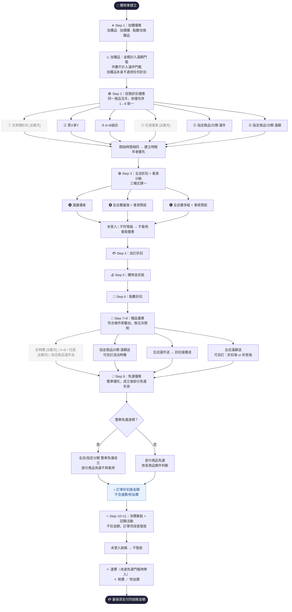

## 版本更新紀錄

| 版本 | 日期 | 修改內容 | 修改人 |
|------|------|----------|--------|
| v1.0 | 2026/04/27 | （繼承自 Part4 行銷活動 PRD §3）優惠計算 5 層架構初版 | Una |
| v1.1 | 2026/05/19 | （繼承自 Part4 行銷活動 PRD §3）依 SHOPLINE 2025.08 規則改為 11 步驟、補 Mermaid 流程圖、補各步驟邊界規格 | Una |
| v1.3 | 2026/05/28 | 定案兩項設計取向：20-1 §8.3 退款揭露文案改為預留可編輯欄位（`system_settings.addon_refund_disclosure_text`）；20-2 §8.2 daily snapshot 新增 `fiscal_period` 欄位（NULL），後台設定 UI 列 Phase 2；§6.4 退款說明文案說明同步更新 | Una |
| v1.2 | 2026/05/21 | 自 Part4／Part3／Part6 抽取共通優惠計算邏輯為獨立技術規格，作為跨模組單一事實來源（SSOT）；輕量版設計，僅寫計算邏輯、邊界、介面契約 | Una |

# Evomni — 優惠計算引擎 技術規格 PRD v1.3

> 📌 **定位**：本文件為跨模組共用的**優惠計算邏輯單一事實來源**，定義 11 步驟計算順序、邊界情境、各模組對外介面。
>
> 涉及模組：[Part4 行銷活動](../inputs/prd/01_核心模組/Evomni_Part4_行銷活動_PRD.md)、[Part3 訂單管理](../inputs/prd/01_核心模組/Evomni_Part3_訂單管理_PRD.md)、[Part5 數據中心](../inputs/prd/01_核心模組/Evomni_Part5_數據中心_PRD.md)、[Part6 會員管理](../inputs/prd/01_核心模組/Evomni_Part6_會員管理_PRD.md)、[金物流串接](../inputs/prd/02_獨立功能/Evomni_金物流串接規格_PRD.md)
>
> 設計原則（輕量版）：本文件只寫**計算邏輯、邊界、介面契約**；商家後台操作設定細節仍在 Part4 主規格內，不重複。

---

## 1. 文件資訊

| 屬性 | 內容 |
| --- | --- |
| 版本 | v1.3 |
| 日期 | 2026/05/28 |
| 規格基準 | SHOPLINE 2025.08 版商店優惠活動計算規則（見 `inputs/prd/promotion_rules_checklist.md`） |
| 文件狀態 | 已定稿；與 Part4 v1.2 同步上線 |
| 對應方案 | 啟航方案 + 進階電商包 共用引擎；單一 codebase |
| 後續擴充 | 與 [Part4 行銷活動 後續擴充規劃 PRD](Evomni_Part4_行銷活動_後續擴充規劃_PRD.md) 中的 E-01～E-03 對齊（任選／定期購／點數兌換贈品為引擎可擴充的計算節點） |

---

## 2. 引擎定位與範圍

### 2.1 引擎做什麼

| 範圍 | 內容 |
|------|------|
| ✅ 涵蓋 | 11 步驟優惠計算順序、各步驟之間的疊加／互斥規則、邊界情境處理、各模組對外的輸入／輸出介面契約 |
| ❌ 不涵蓋 | 商家後台活動建立／編輯 UI（屬 Part4）、訂單退款流程（屬 Part3）、會員錢包顯示（屬 Part6 / 會員前台） |

### 2.2 引擎被誰呼叫

| 呼叫方 | 場景 |
|--------|------|
| 購物車服務 | 每次購物車異動，重新計算優惠 |
| 結帳服務 | 結帳前最終確認金額 |
| 訂單服務 | 訂單建立時鎖定優惠快照 |
| 退款服務 | 退款時取出原優惠快照計算追回 |
| 一頁式商店 | 簡化呼叫，僅啟用部分步驟（詳見 §7） |

---

## 3. 11 步驟計算順序（核心規格）

### 3.1 主計算 9 步 + 事後發放 2 步

```
購物車輸入
  ↓
[Step 1] 加購優惠      ─ 加購品 / 加價購 / 點數兌換贈品
  ↓
[Step 2] 促銷折扣      ─ 同一商品互斥，優先序 1→6 取一
  ↓
[Step 3] 全店折扣 + 會員分級   ─ 三模式擇一（選最優 / 疊最後 / 疊多組）
  ↓
[Step 4] 自訂折扣
  ↓
[Step 5] 購物金折抵
  ↓
[Step 6] 點數折抵
  ↓
[Step 7] 贈品優惠（指定條件）  ─ 符合即套用，可疊加
  ↓
[Step 8] 贈品優惠（全店條件）  ─ 符合即套用，可疊加
  ↓
[Step 9] 免運優惠      ─ 整單免運優先，成立後部分免運失效
  ↓
═══════════════════════════════════
= 訂單優惠折扣後金額（不含運費／附加費）
═══════════════════════════════════
  ↓
[Step 10] 消費集點    ★ 不扣金額，影響集點計算
[Step 11] 回饋活動    ★ 不扣金額，訂單完成後發放
═══════════════════════════════════
+ 運費（未達免運門檻）+ 稅費 + 附加費
═══════════════════════════════════
= 最後須支付的結帳金額
```

### 3.2 Mermaid 流程圖（完整版）



> 流程圖中 `[⏳擴充]` 與虛線節點為 v1.2 不實作項目，詳見 [後續擴充規劃 PRD](Evomni_Part4_行銷活動_後續擴充規劃_PRD.md)。

### 3.3 每層計算基準（重要規格）

**每一層以上一層折後金額為計算基準**（非全部基於原價）。

- 滿額門檻判斷亦以折後金額為準（較嚴格）
- 例：原價 1,000 元，Step 2 限時折扣後 900 元，「滿 1,000 才折」的活動**不適用**（折後為 900 元）

---

## 4. 各步驟邊界規則彙整

### 4.1 Step 1：加購優惠邊界

| 規則 | 說明 |
|------|------|
| 加購品金額計入「滿額」門檻 | ✅ 計入 |
| 加購品件數計入「滿件」門檻 | ❌ 不計入 |
| 加購品本身可套用其他折扣 | ❌ 不可（百分比／固定金額均不適用）|
| 點數兌換贈品（⏳擴充） | 不計入金額／件數門檻；本身不適用折扣 |

### 4.2 Step 2：促銷折扣優先序

| 優先序 | 子類型 | v1.2 狀態 |
|--------|--------|----------|
| 1（最高） | 定期購折扣 | ⏳ 後續擴充 |
| 2 | 買X享Y | ✅ 進階電商包 |
| 3 | A+B 組合 | ✅ 進階電商包 |
| 4 | 任選優惠 | ⏳ 後續擴充 |
| 5 | 指定商品/分類 滿件 | ✅ 兩方案 |
| 6（最低） | 指定商品/分類 滿額 | ✅ 兩方案 |

開始時間相同 → 依活動 `created_at ASC` 取較早者。

### 4.3 Step 3：全店折扣 + 會員分級三模式

| 模式 | 套用規則 |
|------|---------|
| 🅐 選最優者 | 全店折扣 vs 會員預設優惠，取折扣金額較大者 |
| 🅑 全店疊最後 + 會員預設 | 全店折扣套用後再疊加會員預設優惠 |
| 🅒 全店疊多組 + 會員預設 | 多個全店折扣可同時疊加，再加會員預設 |

未登入 / 不符等級 → 不套用會員優惠，仍套用全店折扣。

### 4.4 Step 7+8：贈品送出時機

| 子類型 | 可自訂送出時機 | 選項 |
|--------|--------------|------|
| 定期購贈品 ⏳ | ❌ | — |
| A+B 組合贈品 | ❌ | — |
| 任選優惠贈品 ⏳ | ❌ | — |
| 指定商品/分類 滿件送 | ❌ | — |
| 指定商品/分類 滿額送 | ✅ | 折扣前 / 折扣後 / 折抵後 |
| 全店滿件送 | ❌ | 折扣後 |
| 全店滿額送 | ✅ | 折扣後 / 折抵後 |

### 4.5 Step 9：免運優先序

| 優先序 | 子類型 | 計算基準可自訂 |
|--------|--------|--------------|
| 1（最高） | 全店滿件整單免運 | ❌ |
| 1（最高） | 全店滿額整單免運 | ✅ 折扣後 / 折抵後 |
| 1（最高） | 指定商品/分類 滿件整單免運 | ❌ |
| 1（最高） | 指定商品/分類 滿額整單免運 | ✅ 折扣後 / 折抵後 |
| 2（最低） | 部分商品免運 | ❌ |

**整單免運成立後，部分商品免運自動失效**。

### 4.6 Step 10+11：回饋發送時機

| 規則 | 說明 |
|------|------|
| 發送時機 | 訂單狀態 → 「完成」時觸發 |
| 未登入結帳 | 不發放任何回饋 |
| 同時設定「消費集點 + 滿額送點數」 | 兩者均符合條件即同時發放 |

---

## 5. 邊界情境表（高風險場景）

| # | 場景 | 預期行為 | 風險等級 |
|---|------|---------|---------|
| 1 | 同一商品符合多個促銷折扣 | 依優先序 1→6 取一；前台顯示套用的活動名稱 | 🔴 高 |
| 2 | 開始時間相同的多個活動 | `created_at` 早者優先 | 🔴 高 |
| 3 | 未登入顧客進入結帳 | 不套用會員優惠、不發放回饋 | 🟡 中 |
| 4 | 加購品 + 全店滿件門檻邊界 | 件數不計入、金額計入 | 🔴 高 |
| 5 | 整單免運 + 部分商品免運同時成立 | 整單優先，部分免運不顯示／不套用 | 🟡 中 |
| 6 | 贈品「自訂送出時機」設為「折抵後」但顧客未折抵 | 依當下金額判斷，贈品條件不成立則不送 | 🟡 中 |
| 7 | 回饋活動訂單取消／部分退款 | 詳見 §6 退款追回規格 | 🔴 高 |
| 8 | 促銷組合（A+B）件數計入滿件門檻 | 計入全店滿件門檻 | 🟡 中 |
| 9 | 加購品退款是否解除原訂單折扣 | **不重算，退款單揭露差額**（詳見 §6.4） | 🔴 高 |
| 10 | 多組贈品同時達標超過軟上限 | 軟上限 10、硬上限 15；超過第 11 組阻擋並提示 | 🟡 中 |

---

## 6. 退款 / 追回計算規格

### 6.1 全額退款

訂單完成後全額退款 → 該筆訂單所發回饋全額追回。

### 6.2 部分退款

依退款比例按比例扣回：

```
追回金額 = 原回饋金額 × (退款金額 / 訂單原始金額)
```

### 6.3 追回時的會員錢包處理

| 模式 | 餘額充足 | 餘額不足 |
|------|---------|---------|
| **Mode A**（v1.2 預設）| 直接從會員錢包扣回 | 扣到 0 為止，差額記為「應收記錄」；6 個月內未發生新訂單則註銷 |
| **Mode B**（v1.2 開通介面已具備，後端後續實作）| 同上 | 直接顯示負餘額 |

「應收記錄」資料：
- 表：`reward_receivable_records`
- 欄位：`member_id`、`amount`、`source_order_id`、`created_at`、`expires_at`、`status`
- 註銷時間判定：`created_at + 6 個月`

### 6.4 加購品退款的特別規則

**不重算原訂單折扣**。

- 退加購品時僅退加購品本身金額
- 不解除原訂單滿額折扣／不追討差額／不回扣點數回饋
- 退款單下方揭露文案：「因加購品退回，原訂單滿額條件 NT$XXX 已未達成，差額由商家承擔」
  - **決議 20-1：預留可編輯欄位**。此文案不寫死，存入 `system_settings.addon_refund_disclosure_text`（TEXT 型，有預設值）；商家可在「電商進階設定 > 退款說明文案」中自訂；如欄位為空則顯示預設文案。DB 多 1 個欄位，但省去未來資料遷移成本。

詳細 6 條邊界（含部分退款、多筆加購品退一筆等）見 [Part4 v1.2 §6.2J](Evomni_Part4_行銷活動_PRD.md)。

---

## 7. 對外介面契約

### 7.1 計算 API（建議規格）

**Endpoint**：`POST /api/promotion/calculate`

**Request**：
```json
{
  "cart_id": "string",
  "member_id": "string | null",   // 訪客為 null
  "applied_wallet": 0,            // 消費者輸入的購物金折抵
  "applied_points": 0,            // 消費者輸入的點數折抵
  "coupon_codes": [],             // 消費者輸入的優惠券碼
  "shipping_method_id": "string",
  "skip_steps": []                // 一頁式商店可指定跳過某些 step
}
```

**Response**：
```json
{
  "subtotal": 0,                  // 原始小計
  "steps": [
    {
      "step": 1,
      "name": "加購優惠",
      "applied": [],              // 套用的活動列表
      "discount": 0,
      "running_total": 0          // 該 step 後的累計金額
    }
    // ... Step 1~9
  ],
  "discount_total": 0,            // 總折扣金額
  "shipping_fee": 0,
  "tax_fee": 0,
  "additional_fee": 0,
  "final_total": 0,               // 最後須支付金額
  "rewards_preview": {            // Step 10+11 預覽
    "points": 0,
    "wallet": 0
  },
  "gifts": [],                    // 贈品列表（is_gift = true 的 cart_items）
  "warnings": []                  // 例：贈品上限提示、整單免運成立提示
}
```

### 7.2 訂單建立時的優惠快照

訂單建立必須鎖定當下的優惠計算結果，存入 `orders.promotion_snapshot_json`，避免日後活動異動影響退款計算。

```json
{
  "engine_version": "v1.2",
  "calculated_at": "2026-05-21T10:00:00Z",
  "steps": [ /* 同 §7.1 Response.steps */ ],
  "applied_activities": [
    {"activity_id": 123, "name": "夏日清倉 9 折", "type": "shop_discount"}
  ]
}
```

### 7.3 一頁式商店的簡化呼叫

一頁式商店為快速結帳場景，計算邏輯**簡化**：

| Step | 一頁式商店行為 |
|------|--------------|
| Step 1 | 不適用（無加購） |
| Step 2 | 僅套用「指定商品 滿件 / 滿額」（其餘子類型不啟用）|
| Step 3 | 不適用（無會員優惠） |
| Step 4 | 不適用 |
| Step 5 | 不適用（無購物金） |
| Step 6 | 不適用（無點數） |
| Step 7+8 | 僅「指定商品 滿件送」 |
| Step 9 | 全部適用 |
| Step 10+11 | 不適用 |

呼叫方在 `skip_steps` 帶入 `[1, 3, 4, 5, 6, 10, 11]`。

### 7.4 與 Part5 數據中心的資料介面

引擎需提供以下資料表供 Part5 撈：

| 表 | 用途 |
|----|------|
| `promotion_calculation_logs` | 每次計算的快照，供分析活動套用率 |
| `coupon_usages` | 優惠券使用紀錄 |
| `reward_receivable_records` | 會員應收回饋紀錄 |
| `reward_receivable_daily_snapshot` | 應收餘額每日快照，供「應收餘額異動」報表 |

---

## 8. 設計取向待定（開發前與工程師討論確認）

### 8.1 應收註銷的開票事件觸發 [設計取向待定]

**目前狀態**：本題為系統商面對商家的設計選擇，需 PM 與工程師討論定案。

**取向 A — 系統只記錄資料**
- 系統行為：應收註銷時僅寫入 audit log 與 daily snapshot；不發任何事件
- 影響：商家若需開立紅字發票，須自行從報表撈資料、手動處理
- 工時：小（已在主規格內）
- 適合：發票需求簡單、自行對接會計軟體的商家

**取向 B — 系統提供開票事件 webhook**
- 系統行為：應收註銷時除記錄外，額外觸發 `receivable.voided` webhook 供商家串接發票系統
- 影響：新增 webhook 端點、商家後台需有 webhook 設定 UI、payload 需含應收金額／會員 ID／原訂單 ID／註銷原因
- 工時：中（約 5 人日）
- 適合：已串接電子發票系統的商家

**待定案題目**：
1. v1.2 是否提供 webhook 機制？
2. 若提供，payload 是否需含會計期間欄位？
3. 此功能屬啟航方案還是進階電商包？

**定案時機**：開發前與工程師討論確認。

---

### 8.2 daily snapshot 表的會計期間欄位 ✅ 定案（決議 20-2）

**決議**：採取向 B 的部分實作——**預留欄位但 UI 列 Phase 2**。

`reward_receivable_daily_snapshot` 表新增：
```sql
fiscal_period VARCHAR(7) NULL  COMMENT '會計期間標記，如 2026-Q1；NULL=尚未設定財年，預設依曆年（決議 20-2）'
```

- v1.2：欄位建好，值為 NULL；後台不顯示「會計年度設定」UI
- Phase 2：後台開放「會計年度起始月份」設定，啟用後引擎自動填入 `fiscal_period`
- 優點：DB 結構到位，Phase 2 開放 UI 時無需資料遷移

---

### 8.3 退款單揭露文案可編輯性 ✅ 定案（決議 20-1）

**決議**：採取向 B——**預留可編輯欄位**。

`system_settings` 表新增：
```sql
addon_refund_disclosure_text TEXT NULL COMMENT '加購品退款揭露文案；NULL 時系統顯示預設文案（決議 20-1）'
```

- v1.2：欄位建好，值為 NULL；系統顯示預設文案：「因加購品退回，原訂單滿額條件 NT$XXX 已未達成，差額由商家承擔」
- 後台「電商進階設定 > 退款說明文案」編輯 UI 時程由工程師決定
- 優點：DB 結構到位，開放 UI 時無需資料遷移；欄位為 NULL 時 fallback 至預設文案，向前相容

---

## 9. 引擎版本管理

- 引擎以 `engine_version` 字串標記版本（例：`v1.2`、`v1.3`）
- 訂單 `promotion_snapshot_json` 必含 `engine_version`，便於追溯計算邏輯
- 引擎升級時須評估對歷史訂單退款計算的影響；原則上**舊訂單以建單時的引擎版本計算退款**

---

## 與團隊溝通摘要

- **變更要點**：本文件為跨 4 模組（Part3／Part4／Part5／Part6）共用優惠計算邏輯的單一事實來源；採輕量版設計，只寫計算邏輯、邊界、介面契約，不重複各 PRD 已有的 UI／流程細節
- **影響範圍**：Part4 §3.1、Part3 §6.2/§6.6、Part5 報表規格、Part6 §6.6 均需以「計算規則詳見本文件 §X.X」的連結方式引用
- **待 PM 決策**：§8 三項設計取向待定項目，開發前與工程師討論定案
- **下一步**：
  1. Part4 v1.2 完稿後，本文件 §X 章節編號回頭對齊
  2. 與 Master PRD §6 子文件索引同步新增本文件
