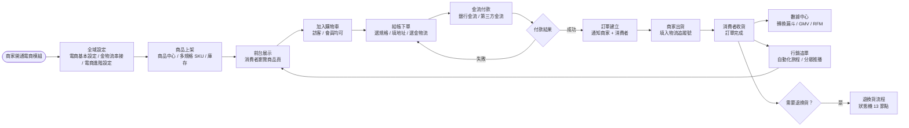
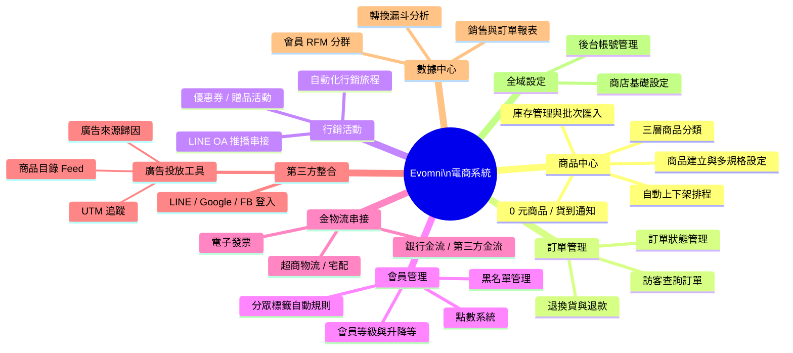
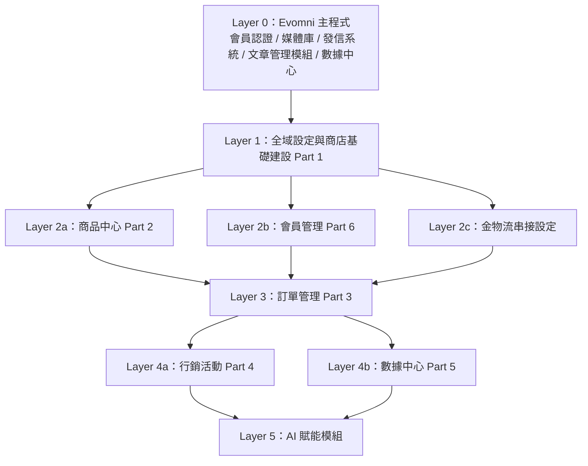

# Evomni 新電商系統 — Master PRD（總覽文件）

## 1. 文件資訊

| 屬性 | 內容 |
| --- | --- |
| 版本 | v7.2 |
| 日期 | 2026/06/03 |
| 作者 | Una |
| 文件狀態 | **v7.2** — §6.1 Part4 行銷活動 PRD v1.7→v1.8；§6.2F.1.D 批次操作補齊跨頁選取規格（兩段式、上限 500 筆、自動清除選取）|
| 說明 | 本文件為所有子模組 PRD 的導覽入口與系統總覽。工程師應先讀本文件，再進入各子模組 PRD。 |

---

## 2. 產品背景與目標

本章說明 Evomni 新電商系統的開發背景、對商家與公司的核心價值，以及本期開發的目標範圍。讓所有人在動工前對「為什麼做這件事、做到什麼程度」有一致認識。

### 2.1 產品背景

Evomni 現有產品以形象網站建置為核心，服務對象涵蓋品牌商家、服務業者與電商起步者。隨著電商市場成熟，愈來愈多現有客戶與新客戶需要在同一套後台同時管理「品牌形象展示」與「商品交易轉換」，但現有系統缺乏完整的訂單流程、金物流串接與行銷自動化能力。

Evomni 新電商系統以**擴充模組（Extension）**的方式掛載於主程式之下，讓客戶無需更換平台，即可在既有形象網站的基礎上開通完整電商功能，或以純電商模式開案。

### 2.2 核心價值

以下表格說明這套系統對不同對象創造的具體價值，開發時若有「這個功能值不值得做」的疑問，可回到此表對照。

| 對象 | 核心價值 |
| --- | --- |
| **商家** | 一套後台同時管理形象站 + 電商站；原有品牌頁設計不需重做；形象站產品可一鍵橋接推送至電商商品中心 |
| **消費者** | 在同一品牌下完成瀏覽 → 加購 → 結帳的完整流程；支援 LINE/Google/Facebook 快速登入 |
| **Evomni** | 現有客戶升級路徑明確，客戶黏著度提升；開拓純電商新客群；年費方案提升 ARPU |
| **開發團隊** | 複用既有模組（媒體庫、發信系統、文章管理等），不重複造輪子；模組化架構，各層可獨立迭代 |

### 2.3 目標與範圍

本表定義本期（v1.0）開發的目標。本期之外的項目不得在規格中混入。

| 目標面向 | 具體目標 |
| --- | --- |
| **商家完整閉環** | 商家可在後台完成：商品上架 → 接單 → 出貨 → 退換貨 的完整電商操作 |
| **行銷能力** | 支援優惠券、贈品活動、自動化行銷旅程、LINE OA 推播、UTM 追蹤與廣告來源分析（廣告追蹤碼由行銷工具設定管理）|
| **資料分析** | 訂單、商品、會員、行銷的數據可視化，支援 RFM 分群與轉換漏斗分析 |
| **技術架構** | 與 Evomni 主程式 API 互通但資料庫獨立；前端 Vue 3 + Element Plus；後端 Laravel 10 |
| **客戶情境** | 同時支援「純電商」、「純形象站」、「形象 + 電商」、「形象站升級電商」四種客戶情境 |

**不在電商 PRD 討論範圍：**
- **Omnichat**：行銷追蹤與智能客服均已確認不採納，不列入任何方案、任何階段
- **AI 智能分析模組 / AI 經理人**：屬於 AI 方案範疇，與電商方案分開定價與規格，不在本 PRD 討論
- **產品評論功能**：Phase 2 候選，尚無規格
- **全站分銷/分潤系統**：延後至 Phase 2，不納入電商啟航方案（一頁式商店 KOL 分潤為獨立機制，屬進階電商包，與全站分銷系統不同）

### 2.4 開發階段時程

以下為兩個開發階段的時間規劃。兩個階段採用相同的技術架構基礎，模組之間的依賴關係維持不變（詳見 §5 開發依賴圖）。工程師若開發進度超前，可連續推進，不受階段分界限制。

| 階段 | 方案 | 開發期 | 整合測試期 | 目標上線 |
| --- | --- | --- | --- | --- |
| 階段一 | 電商啟航方案 | 5月 – 7月（12 週）| 8月 | 8月底 |
| 階段二 | 進階電商包 | 9月 – 11月（12 週）| 12月 | 12月底 |

**關鍵里程碑：**

```
2026/05  ──► 階段一開發啟動（Layer 0–2：全域設定 + 商品中心 + 會員管理 + 金物流）
2026/06  ──► 階段一中期（Layer 3：訂單管理整合）
2026/07  ──► 階段一收尾（Layer 4：行銷活動 + 第三方整合）
2026/08  ──► 整合測試 → 8月底上線（電商啟航方案）
             ↕
2026/09  ──► 階段二開發啟動（進階功能層：自動化行銷 / 進階會員 / 數據中心）
2026/10  ──► 階段二中期
2026/11  ──► 階段二收尾
2026/12  ──► 整合測試 → 12月底上線（進階電商包完整功能）
```

---

## 3. 產品定位與核心架構

本章從技術層面說明電商系統在 Evomni 生態中的定位，以及與主程式各模組的整合關係。工程師開發前應先通讀本章，建立整體架構認識再進入各子模組 PRD。

### 3.1 系統定性

Evomni 新電商系統**不是獨立 SaaS**，而是 Evomni 主程式的「高階擴充模組（Extension）」。

- 掛載於 Evomni 主程式之下，共用會員認證、媒體庫、發信系統、文章管理模組、數據中心
- 採「服務式開通（Service-Led Onboarding）」，由內部人員協助客戶開通，不開放自助開通
- 後台左側選單依「開通模組」動態顯示，未訂閱的功能不出現在選單中

### 3.2 系統邊界圖

下圖示意電商模組（Extension）在 Evomni 主程式下的層級結構。電商功能以獨立資料庫運作，透過 API 與主程式各共用模組互通。

```
┌─────────────────────────────────────────────────────────────────┐
│                        Evomni 主程式                             │
│                                                                  │
│   ┌──────────┐  ┌──────────┐  ┌──────────┐  ┌──────────────┐  │
│   │  會員認證  │  │  媒體庫   │  │  發信系統  │  │ 文章管理 / 數據中心 │  │
│   └─────┬────┘  └─────┬────┘  └─────┬────┘  └──────┬───────┘  │
│         │             │             │              │            │
│   ══════╪═════════════╪═════════════╪══════════════╪════════    │
│         ↓             ↓             ↓              ↓            │
│   ┌──────────────────────────────────────────────────────────┐  │
│   │                  新電商模組（Extension）                   │  │
│   │                                                          │  │
│   │  ┌──────────┐  ┌──────────┐  ┌──────────┐              │  │
│   │  │ 商品中心  │  │ 訂單管理  │  │ 行銷活動  │              │  │
│   │  └──────────┘  └──────────┘  └──────────┘              │  │
│   │  ┌──────────┐  ┌──────────┐  ┌──────────┐              │  │
│   │  │ 會員管理  │  │ 數據分析  │  │ 全域設定  │              │  │
│   │  └──────────┘  └──────────┘  └──────────┘              │  │
│   └──────────────────────────────────────────────────────────┘  │
└─────────────────────────────────────────────────────────────────┘

獨立資料庫：電商系統使用獨立 DB，與 Evomni 主程式透過 API 互通
前端技術棧：Vue 3 + Vite + Element Plus + Tailwind CSS
後端技術棧：Laravel 10 / PHP 8.3 / MySQL 5.x+
```

### 3.3 整體功能流程圖

以下流程圖呈現消費者的完整電商體驗路徑，以及後台各模組在流程中對應的節點。這是理解「系統為誰服務、各模組在哪個環節介入」的最快方式。



### 3.4 功能結構圖

以下結構圖呈現電商系統所有功能模組的全景。開發前可用此圖確認自己負責的模組與相鄰模組的位置，以及各模組的主要子功能。



### 3.5 共用模組整合規則

以下表格說明電商模組與 Evomni 主程式各共用模組的整合方式。工程師在串接前請確認對應模組的 API 文件，確保整合規格一致。

| Evomni 模組 | 整合方式 | 電商側使用方式 |
| --- | --- | --- |
| 會員認證模組 | API 呼叫 | 商家登入沿用會員認證；消費者（End-User）資料存新電商 Member 表，並與 Evomni CRM DB 同步 |
| 媒體庫 | API 呼叫 | 商品圖、Banner 皆呼叫媒體庫 API，自動進行 WebP 轉檔 |
| 發信系統 | API 呼叫 | 所有訂單通知、會員信件、行銷自動化信件（購物車挽回、生日信）皆透過發信系統發送；開信/點擊數據回傳至電商後台 |
| 文章管理模組 | 直接共用 | 電商部落格直接繼承文章管理模組，不重複開發；文章以 `display_scope` 欄位區分形象站 / 電商站 / 兩站皆顯示 |
| 數據中心 | 擴充掛載 | 電商數據分析報表整併至數據中心選單下，依客戶類型（純形象 / 混合 / 純電商）動態渲染分頁 |
| CMS 形象站產品（cms_products）| 橋接推送 | 形象站原有「產品功能」（Grape.js 頁面 + 詢問單）與電商「商品中心」**維持分離架構**，透過橋接欄位 `products.cms_product_id` 實現「一鍵推送至電商」升級路徑；兩站共用媒體庫圖片資源，不重複上傳；詳見 `Evomni_形象產品與電商商品整合架構規劃.md` |

---

## 4. 方案架構與功能分層

本章定義兩種電商方案的功能邊界。功能分層總表是方案銷售、開發驗收、以及與客戶溝通時的共同語言——任何功能新增或調整，此表都必須同步更新。

### 4.1 兩方案定位

以下為兩種方案的定價與適用客群定位。開發時若有「這個功能歸哪個方案」的疑問，以本表精神為準。

| | 電商啟航方案 | 進階電商包 |
| --- | --- | --- |
| **定位** | 質感開店——頂規效能體質，輕量起步快速收單 | 自動變現——智能漏斗追單，靠數據驅動高成長 |
| **售價** | 29,800 元/年 | 39,800 元/年 |
| **底價** | 19,800 元/年 | 29,800 元/年 |
| **適合客群** | 剛起步、功能需求單純的商家 | 需要進階行銷、分眾、自動化的成熟商家 |

### 4.2 功能分層總表

以下表格完整列出所有功能項目的方案歸屬與 PRD 連結。**啟航＝兩方案共有基礎功能；進階專屬＝僅進階電商包包含。** Prototype 欄位供設計師填入對應原型連結，方便開發時快速對照視覺稿。

#### 【行銷贈券類】

| 功能項目 | 啟航方案 | 進階電商包 | PRD 子文件 | Prototype |
| --- | --- | --- | --- | --- |
| 滿額/滿件贈品 | ✅ | ✅ | Part 4 ✅ | |
| 免運活動 | ✅ | ✅ | Part 4 ✅ | |
| 滿額加購 | ❌ | ✅ | Part 4 ✅ | |
| 產品加價購 | ❌ | ✅ | Part 4 ✅ | |
| 滿額折扣 | ✅ | ✅ | Part 4 ✅ | |
| 滿件折扣 | ✅ | ✅ | Part 4 ✅ | |
| 產品組合價 | ❌ | ✅ | Part 4 ✅ | |
| 限時折扣 | ❌ | ✅ | Part 4 ✅ | |
| 組合優惠（紅配綠/買X享Y） | ❌ | ✅ | Part 4 ✅ | |
| 折扣代碼（活動贈券） | ✅ | ✅ | Part 4 ✅ | |
| 滿額贈券 | ❌ | ✅ | Part 4 ✅ | |
| 入會贈券 | ✅ | ✅ | Part 4 ✅ | |
| 生日贈券 | ❌ | ✅ | Part 4 ✅ | |

#### 【CRM 與自動化行銷模組】

| 功能項目 | 啟航方案 | 進階電商包 | PRD 子文件 | Prototype |
| --- | --- | --- | --- | --- |
| 顧客管理中心 | ✅ | ✅ | Part 6 ✅ | |
| 會員系統（註冊/紀錄/訂單查詢/回填通知） | ✅ | ✅ | Part 6 ✅ | |
| 自動成為會員 | ✅ | ✅ | Part 6 ✅ | |
| 貨到通知 | ✅ | ✅ | Part 6 ✅ | |
| 產品追蹤清單（心願清單）| ❌ | ✅ | `Evomni_會員前台個人中心_PRD.md` §6.7 ✅ | |
| 會員前台個人中心（訂單查詢/個人資料/地址/優惠券/帳號安全）| ✅ | ✅ | `Evomni_會員前台個人中心_PRD.md` ✅ | |
| 會員專屬頁面（無上限） | ✅ | ✅ | Part 6 ✅ | |
| 會員分級（含各分級專屬限定頁面）＋滿額自動升等 | ❌ | ✅ | Part 6 ✅ | |
| 會員期限 | ❌ | ✅ | Part 6 ✅ | |
| 會員推薦點數回饋 | ✅ | ✅ | Part 6 ✅ | |
| 紅利點數（購物金） | ❌ | ✅ | Part 6 ✅ | |
| 會員產品保固註冊 | ❌ | ✅ | `Evomni_會員產品保固註冊_PRD.md` v1.0 ⚠️ 草稿（依業界常見流程起草，待 PM 確認） | |
| 會員產品報修提交 | ❌ | ✅ | `Evomni_會員產品報修提交_PRD.md` v1.0 ⚠️ 草稿（依業界常見流程起草，待 PM 確認） | |
| 會員黑名單 | ❌ | ✅ | Part 6 ✅（已併入 Part 6 §6.7）| |
| 基礎會員分眾系統（純數據篩選） | ❌ | ✅ | Part 6 ✅ | |
| 進階會員分眾系統（自動化行銷旅程引擎＊串 LINE） | ❌ | ✅ | Part 4 ✅（LINE OA 定案為主要推播管道）| |
| 購物車未結帳挽回（自動發專屬折價券＊串 LINE） | ❌ | ✅ | Part 4 ✅（LINE OA 定案為主要推播管道）| |
| 沉睡客與流失客自動喚醒（連動 RFM＊串 LINE） | ❌ | ✅ | Part 4 ✅（LINE OA 定案為主要推播管道）| |
| 購後關聯商品自動推薦（加價購再行銷＊串 LINE） | ❌ | ✅ | Part 4 ✅（LINE OA 定案為主要推播管道）| |
| 點數/優惠券即將到期促購提醒（＊串 LINE） | ❌ | ✅ | Part 4 ✅（LINE OA 定案為主要推播管道）| |

#### 【數據中心】

| 功能項目 | 啟航方案 | 進階電商包 | PRD 子文件 | Prototype |
| --- | --- | --- | --- | --- |
| 基礎銷售與訂單報表 | ✅ | ✅ | Part 5 | |
| 熱銷與滯銷商品排行 | ✅ | ✅ | Part 5 | |
| 購物車與結帳轉換漏斗 | ❌ | ✅ | Part 5 | |
| 進階商品成效分析 | ❌ | ✅ | Part 5 | |
| 顧客消費與回購分析 | ❌ | ✅ | Part 5 | |
| RFM 會員價值分群洞察 | ❌ | ✅ | Part 5 | |
| 促銷與優惠券成效分析 | ❌ | ✅ | Part 5 | |
| 站內搜尋關鍵字分析 | ❌ | ✅ | Part 5 | |

#### 【產品管理類】

| 功能項目 | 啟航方案 | 進階電商包 | PRD 子文件 | Prototype |
| --- | --- | --- | --- | --- |
| 產品建立（無上限，依主機容量） | ✅ | ✅ | Part 2 | |
| 產品批次匯入 | ✅ | ✅ | Part 2 | |
| 產品庫存管理（含低庫存通知） | ✅ | ✅ | Part 2 | |
| 預設產品自動上下架檔期 | ✅ | ✅ | Part 2 | |
| 多規格產品 | ✅ | ✅ | Part 2 | |
| 產品排序 | ✅ | ✅ | Part 2 | |
| 產品圖放大鏡 | ✅ | ✅ | Part 2 | |
| 溫層運費設定 | ✅ | ✅ | ✅ Evomni_Part2_溫層重量運費設定_PRD.md | |
| 重量運費設定 | ✅ | ✅ | ✅ Evomni_Part2_溫層重量運費設定_PRD.md | |
| 0 元產品設定 | ❌ | ✅ | ✅ **已併入 Part 2 商品中心 PRD §6.2**（免費商品開關、每人最大領取數量、是否需登入）| |
| 產品評論功能 | ❌ | ✅ | Part 6 Phase 2 | |
| 條件搜尋 | ~~❌~~ | ~~✅~~ | 🚫 **已移出本期開發範圍** — 改以 Grape.js 範本機制實作，不在新電商系統 PRD 內規格化 | |
| 產品瀏覽紀錄 | ✅ | ✅ | Part 2 | |
| 前台顯示產品銷售數量 | ✅ | ✅ | Part 2 | |
| 360 度產品圖 | ❌ | ❌ | 兩方案均不含 | |

#### 【訂單管理】

| 功能項目 | 啟航方案 | 進階電商包 | PRD 子文件 | Prototype |
| --- | --- | --- | --- | --- |
| 訂單管理系統（含匯出功能） | ✅ | ✅ | Part 3 ✅ | |
| 訂單取消/退貨申請 | ✅ | ✅ | Part 3 ✅（退換貨狀態機 13 節點、退款計算公式（折扣分攤/點數退還/運費處置）、庫存回補原子性、訪客查詢訂單（防枚舉攻擊）| |
| 訪客查詢訂單紀錄 | ✅ | ✅ | Part 3 ✅（已併入 Part 3 §6.5）| |

#### 【金物流串接】

| 功能項目 | 啟航方案 | 進階電商包 | PRD 子文件 | Prototype |
| --- | --- | --- | --- | --- |
| 自訂金流 | ✅ | ✅ | ✅ Evomni_金物流串接規格_PRD.md（貨到付款/銀行匯款）| |
| 銀行金流（聯合信用卡中心） | ✅ 自選 1 種（14 家） | ✅ 自選 1 種（14 家） | ✅ Evomni_金物流串接規格_PRD.md §2.3（兩方案均自選 1 種，14 家廠商清單已定案）| |
| 第三方金流 | ✅ 內含 4 種（綠界/藍新/LINE Pay/AFTEE），加費 9 種 | ✅ 自選 6 種（13 家可選），其餘加費 | ✅ Evomni_金物流串接規格_PRD.md §2.3（方案完整規格對照表已定案）| |
| 第三方物流（含超商門市串接） | ✅ 支援 2 種（綠界/藍新），加費 5 種 | ✅ 支援 4 種（綠界/藍新/紅陽/統一數網），加費 3 種 | ✅ Evomni_金物流串接規格_PRD.md §2.3（方案完整規格對照表已定案）| |
| 電子發票（綠界科技） | ✅ 標配 | ✅ 標配 | ✅ Evomni_金物流串接規格_PRD.md（開立/折讓/作廢 API 完整規格）| |
| 電子發票（ezPay） | 可加費串接 | 可加費串接 | ✅ Evomni_金物流串接規格_PRD.md §2.3（兩方案均可加費串接，非標配；已定案）| |

#### 【系統第三方整合】

| 功能項目 | 啟航方案 | 進階電商包 | PRD 子文件 | Prototype |
| --- | --- | --- | --- | --- |
| LINE 快速註冊/登入 | ✅ | ✅ | ✅ `Evomni_第三方登入_PRD.md`（LINE OAuth 2.0 + LIFF 考量 + 帳號合併安全流程）| |
| Google 快速註冊/登入 | ✅ | ✅ | ✅ `Evomni_第三方登入_PRD.md`（Google OIDC + 帳號合併安全流程）| |
| Facebook 快速註冊/登入 | ✅ | ✅ | ✅ `Evomni_第三方登入_PRD.md`（Facebook Login + Email 補全頁）| |
| LINE OA 系統推播串接 | ✅ | ✅ | ✅ Part 4 §6.4（帳號綁定設定、OAuth 授權、Flex Message 推播規格）| |
| 廣告投放工具（UTM 追蹤 / 商品 Feed / 廣告歸因） | ✅ | ✅ | ✅ `Evomni_廣告投放工具_PRD.md`（UTM 網址生成器 + QR Code + 模板管理、商品目錄 Feed、廣告來源轉換分析；追蹤碼由行銷工具設定管理）| |
| 行銷追蹤碼管理（GA4 / FB Meta Pixel / FB 轉換 API / GTM） | ✅ | ✅ | ✅ `Evomni_行銷追蹤碼管理_PRD.md`（GA4 事件追蹤 / FB Pixel + CAPI 伺服器端轉換 / GTM 容器注入；AES-256 加密儲存；7 日觸發次數統計）| |
| 飛信電子報串接 | 可加費串接 | ✅ 標配 | ✅ `Evomni_飛信電子報串接_PRD.md`（Token 串接 + 頁面載入靜默驗證 + 非同步名單匯出 Job；Redis Lock 防重複；5 狀態機）| |
| 埋設 Omnichat 行銷追蹤 | — | — | 🚫 **已確認移出所有方案，不列入開發範圍** | |
| 美安串接 | 可加費串接 | 可加費串接 | ✅ `Evomni_美安串接_PRD.md`（Session 識別美安訂單 + XML Feed 每日 02:00 自動產生 + 訂單自動拋轉含 Idempotency Key；JPG Only 自動轉換）| |

#### 【進階電商包專屬功能】

| 功能項目 | PRD 子文件 | Prototype |
| --- | --- | --- |
| 一頁式商店 | ✅ Evomni_一頁式商店_PRD.md v2.4（「一頁」= 單一轉換目標單元；3 個操作步驟畫面：銷售頁／規格加購頁／結帳頁；已定案）| |

---

### 4.3 Prototype 分工總表

本表為工程師主管分工用的全局索引。每一列代表一份獨立 Prototype，涵蓋對應 PRD 範圍、介面屬性、主要互動頁面、預估頁數、方案歸屬與 PRD 狀態。**Prototype 網址欄**供設計師填入完成後的原型連結，工程師開發前應確認連結已填入且 PRD 狀態為 ✅。

> **全局數量：15 份 Prototype，約 88–96 個互動頁面**
>
> 介面屬性說明：**後台** = Evomni 商家後台（需登入）；**前台** = 消費者端網頁；**兩者** = 含後台設定＋前台對應畫面
>
> ⚠️ = PRD 規格不完整，Prototype 製作前需先補寫；✅ = PRD 可作業

| # | Prototype 名稱 | 對應 PRD | 介面屬性 | 主要互動頁面（含括號內為子頁面） | 預估頁數 | 方案歸屬 | PRD 狀態 | Prototype 網址 |
|---|---|---|---|---|---|---|---|---|
| 1 | 全域設定 & 儀表板 | **儀表板**：`儀表板_Dashboard_需求規格_v1.0_20260521.md` v1.3 ✅；**全域設定**：`Evomni_全域設定_電商設定_PRD.md` v1.0 ✅ | 後台 | 儀表板、電商基本設定（幣別 / 訂單編號格式 / 統一編號）、電商進階設定（購物車逾時 / 庫存警示門檻）| 4 | 兩方案 | ✅ 儀表板 v1.3 ✅；全域設定 v1.0 ✅ | |
| 2 | 商品中心 | Part 2 + 溫層重量運費設定 | 後台 | 商品列表、新增商品、編輯商品（含多規格 / 庫存）、批次匯入、溫層設定、重量運費費率設定 | 7 | 兩方案 | ✅ | `商品中心_Prototype.html` ✅ 2026/05/05 |
| 3 | 訂單管理 | Part 3 | 後台＋前台 | 訂單列表、訂單詳情、退換貨申請處理、退款計算確認、訪客查詢訂單（前台） | 5 | 兩方案 | ✅ | |
| 4 | 行銷活動 | Part 4 | 後台 | 活動列表、滿額贈品設定、優惠券列表 / 新增、折扣碼設定、自動化旅程列表、旅程編輯器、LINE OA 帳號設定 | 9 | 兩方案（進階功能更多） | ✅ | |
| 5 | 數據中心 | Part 5 | 後台 | 銷售概覽、商品分析、購物車漏斗、會員分析（含 RFM 分群）、行銷成效（含廣告 ROI） | 5 | 啟航基礎 / 進階全功能 | ✅ | |
| 6 | 會員管理（後台） | Part 6 + 顧客與會員整合管理 | 後台 | 顧客 / 會員整合列表、會員詳情、分級設定、點數管理、黑名單、分眾標籤 | 7 | 兩方案（進階功能更多） | ✅ | |
| 7 | 會員前台個人中心 | 會員前台個人中心 PRD | 前台 | 個人中心首頁、我的訂單、個人資料、地址管理、點數明細、優惠券、心願清單、推薦好友、帳號安全 | 9 | 兩方案（進階顯示差異） | ✅ | |
| 8 | 金物流串接設定 | 金物流串接規格 + 串接設定後台管理 | 後台 | 金流廠商總覽、各廠商設定頁（4 種模板 UI）、物流廠商總覽、各廠商設定頁、電子發票設定、Webhook 管理 | 8 | 兩方案（廠商數量差異） | ✅ | |
| 9 | 第三方登入 | 第三方登入 PRD | 後台＋前台 | 後台憑證設定（LINE / Google / FB）、前台登入選擇頁、OAuth 跳轉 / 回調頁、帳號合併確認頁、Email 補全頁 | 6 | 兩方案 | ✅ | |
| 10 | 廣告投放工具 | 廣告投放工具 PRD | 後台 | UTM 網址生成器（含短網址 / QR Code）、UTM 模板管理、商品目錄 Feed 設定（FB / Google）、廣告來源轉換分析 | 5 | 兩方案 | ✅ | |
| 11 | 行銷追蹤碼管理 | 行銷追蹤碼管理 PRD | 後台 | 追蹤碼總覽（狀態卡片）、GA4 設定頁、FB Pixel + CAPI 設定頁、GTM 設定頁、事件觸發統計 | 5 | 兩方案 | ✅ | |
| 12 | 飛信電子報串接 | 飛信電子報串接 PRD | 後台 | 飛信串接設定（Token 輸入 + 狀態顯示）、訂閱名單匯出操作、匯出記錄列表 | 3 | 啟航可加費 / 進階標配 | ✅ | |
| 13 | 美安串接 | 美安串接 PRD | 後台 | 美安串接設定（API 金鑰 + 類別映射）、XML Feed 預覽 / 下載、訂單拋轉記錄 | 3 | 可加費（兩方案） | ✅ | |
| 14 | 一頁式商店 | 一頁式商店 PRD | 後台＋前台 | 後台：LP 列表、LP 設定、KOL 分潤設定、購物車棄單分析；前台：銷售頁 / 規格加購頁 / 結帳頁 | 7 | 進階專屬 | ✅ | |
| 15 | 方案管理 | 方案管理與升級流程 PRD | 後台 | 方案狀態總覽頁（主機 / AI / 電商方案彙整 + 到期警示）、升級詢問表單 | 2 | 兩方案 | ✅ | |

**分工合併建議（人力有限時）：**

- **#10 + #11 合為「行銷工具設定」**：廣告投放工具與追蹤碼管理同屬後台行銷區塊，後端資料模型相近，適合同一工程師接手。
- **#12 + #13 合為「加費串接模組」**：飛信與美安頁面結構類似（設定頁 + 記錄列表），合併製作節省設計成本。
- **#4 拆分（人力充足時）**：行銷活動 9 頁中，「自動化旅程編輯器」互動複雜度遠高於其餘頁面，建議獨立為一份 Prototype 由專人製作。

**CMS 選單 SEO 保護（`Evomni_CMS選單SEO保護與路由邏輯_PRD.md`）** 為疊加在現有 CMS 選單管理介面的保護層（Warning callout + 301 redirect 彈窗），不需要獨立 Prototype，於既有 CMS 選單管理 Prototype 上局部補充互動即可。

---

## 5. 模組開發依賴圖

以下依賴圖定義各模組的開發順序。這不是建議——**是強制的開發前置條件**。上層模組未完成，下層模組不得進入開發，否則會在整合時產生無法預期的阻塞。



**關鍵依賴說明：**

- 金物流串接設定必須在訂單管理開發前完成，否則訂單無法走完支付流程
- 會員管理（Part 6）是行銷活動（分眾/自動化行銷）的前置條件，Part 6 若未完成，Part 4 的進階功能無法驗收
- 數據中心（Part 5）依賴訂單、商品、會員三個模組的資料寫入才能產生有意義的數據

---

## 6. 子文件索引與狀態

本章為所有子模組 PRD 的集中索引。工程師接到模組分配後，請在此確認對應文件狀態是否為 ✅；若非 ✅，需先推動補寫再開工。

> ⚠️ = 規格不足以驗收，需補寫；❌ = 完全沒有規格，需從零撰寫；✅ = 可作業；草稿 = 文件位於 drafts/，PM 確認後移入 outputs/prd/
>
> **最後更新：2026/05/28（v5.2）— §4.2 金物流/一頁式商店表格全面清整；§6.1/§6.2 各子 PRD 版本號補齊；移除所有殘留「待議題」備註；§7 維持 2 筆**

### 6.1 核心模組 PRD

| Part | 模組名稱 | 檔案名稱 | 版本 | 文件狀態 | 優先等級 |
| --- | --- | --- | --- | --- | --- |
| Part 1 | 系統架構與基礎建設 | （沿用 PRD v3.2）| v3.2 | ⚠️ 儀表板規格已獨立至 `儀表板_Dashboard_需求規格_v1.0_20260521.md` v1.3；全域設定電商設定已獨立至 `Evomni_全域設定_電商設定_PRD.md` v1.0；Part 1 本體仍有 AI 區塊判斷邏輯不完整、部分段落標示「260306 暫緩」 | ⚠️ AI 區塊待補 |
| Part 2 | 商品中心 | `Evomni_Part2_商品中心_PRD.md` | v1.2 | ✅ **v1.2 更新**（2026/05/04）— §6.2 進階設定補齊溫層屬性 UI 規格；§8.5 DB 補 `temperature_layer`/`show_temp_label` 欄位；名詞統一；v1.1：電商 vs CMS 路由架構差異說明；v1.0 首次完整規格 | ✅ 完成 |
| Part 2 附 | 溫層/重量運費設定 | `Evomni_Part2_溫層重量運費設定_PRD.md` | v1.0 | ✅ **P0 補寫完成**（2026/04/27）— 溫層最高套用邏輯、重量費率階梯、並存優先序 | ✅ 完成 |
| Part 3 | 訂單管理 | `Evomni_Part3_訂單管理_PRD.md` | v1.6 | ✅ **v1.6**（2026/06/03）— §6.2.A：訂單狀態擴充為 10 種，新增 refunded（已退款）與 closed（已關閉）Tag 顏色與三層 Tooltip 文案；v1.5：§6.5B/C/E 訪客退換貨憑證驗證流程定案；v1.4：混溫層自動拆單規格；訪客身份驗證統一為訂單編號+Email | ✅ 完成 |
| Part 4 | 行銷活動 | `Evomni_Part4_行銷活動_PRD.md` | v1.7 | ✅ **v1.7**（2026/06/02）— §8.5.2 §6.3B 新增 LP 訪客棄單 guest_email 路徑例外說明（cart_recovery_tokens.member_id 可 nullable）；v1.3：plan-lock UI 規格；v1.2：六章節大幅補強 | ✅ 完成 |
| Part 5 | 數據中心 | `Evomni_Part5_數據中心_PRD.md` | v2.2 | ✅ **v2.2 連動 Part4 v1.2**（2026/05/21）— §6.4 行銷成效新增「應收餘額異動分析」區塊（4 指標卡 + 趨勢折線圖 + 自動結論 + 下鑽連結）；§8.5 新增 `reward_receivable_daily_snapshot` schema；條件式自動顯示（商家有啟用回饋活動才出現）；v2.1：§6.4 UTM Last Click 歸因規格 | ✅ 完成 |
| Part 6 | 會員管理 | `Evomni_Part6_會員管理_PRD.md` | v2.3 | ✅ **v2.3**（2026/06/03）— §6.12.E 新增通知信預覽規格（資料來源一致性 / Sample 變數預設值 / 商店設定變數來源 / Phase 2 宣告）；v2.2：§6.5A 系統標籤保護規則；v2.1：§8.5 移除 SQL 語法；v2.0：§6.13 補充 | ✅ 完成 |

### 6.2 獨立規格 PRD

| 模組名稱 | 檔案名稱 | 版本 | 文件狀態 | 優先等級 |
| --- | --- | --- | --- | --- |
| 金物流串接規格 | `Evomni_金物流串接規格_PRD.md` | v1.2 | ✅ **v1.2**（2026/05/28）— 新增 §2.3 方案金流/物流/電子發票完整規格對照表（啟航：銀行自選1種/第三方內含4+加費9/物流內含2+加費5/發票綠界標配+ezPay加費；進階：銀行自選1種/第三方自選6共13家/物流內含4+加費3/發票同啟航）；§8 待確認事項全數關閉；v1.1：業務語意說明改寫；v1.0：P0 首次完整規格 | ✅ 完成 |
| 一頁式商店 | `Evomni_一頁式商店_PRD.md` | v2.7 | ✅ **v2.7**（2026/06/02）— §6.9C LP 訪客棄單挽回旅程本期正式支援：觸發條件（Email 提交 + 同意 checkbox + 60 分鐘未付款 + 7 天冷卻期）、1 小時發送、合規三要件（告知 + checkbox 未預設勾選 + lp_consent_records 紀錄）；v2.6：§6.12 密碼設定連結過期 + 自助重設；v2.4：LP 優惠雙軌架構；v2.3：「一頁」定義定案 | ✅ 完成 |
| 第三方登入（LINE/Google/FB） | `Evomni_第三方登入_PRD.md` | v1.1 | ✅ **v1.1**（2026/05/27）— LINE LIFF 支援確認納入 v1.0（liff.isInClient() 偵測 + 後台 LIFF App ID 設定）；social_only 模式啟用遷移流程（未綁社群帳號阻擋切換+批次綁定邀請信+1–90天寬限期）；v1.0：LINE/Google/Facebook OAuth 2.0 完整流程、帳號合併安全機制、Email 補全頁、後台憑證設定頁 | ✅ 完成 |
| 訪客查詢訂單紀錄 | — | — | ✅ **已併入 Part 3 §6.5**，無需獨立文件 | ✅ 已整合 |
| 會員黑名單 | — | — | ✅ **已併入 Part 6 §6.7**，無需獨立文件 | ✅ 已整合 |
| 會員產品保固註冊 | `drafts/Evomni_會員產品保固註冊_PRD.md` | v1.0 | ⚠️ **草稿首版**（2026/05/28）— 存放於 drafts/；保固申請（前台）、保固審核與商品保固設定（後台）、狀態機（申請中/生效/已到期/已拒絕）；依業界常見流程起草，W-01（保固起算基準）、W-02（拒絕後重申請）等 10 項待 PM 確認 | ⚠️ 草稿待確認 |
| 會員產品報修提交 | `drafts/Evomni_會員產品報修提交_PRD.md` | v1.0 | ⚠️ **草稿首版**（2026/05/28）— 存放於 drafts/；前台報修申請、後台報修審核與狀態更新、6 狀態機（已提交→審核中→已受理→維修中→已完成/已拒絕）；前置條件為有效保固；R-01（是否允許自費報修）等 12 項待 PM 確認 | ⚠️ 草稿待確認 |
| 0 元產品設定 | — | — | ✅ **已併入 Part 2 商品中心 PRD §6.2**，無需獨立文件 | ✅ 已整合 |
| LINE OA 系統推播串接 | — | — | ✅ **已規格化於 Part 4 §6.4**（帳號綁定/OAuth/Flex Message）；**PM 定案為進階電商包主要推播管道（2026/05/22）** | ✅ 已整合 |
| 廣告投放工具（UTM 追蹤 / 商品 Feed / 廣告歸因）| `Evomni_廣告投放工具_PRD.md` | v2.0 | ✅ **v2.0 大改版**（2026/05/03）— 移除廣告追蹤碼管理（已由行銷工具設定統一管理）；三大工具重新定位：UTM 網址生成器（短網址 + QR Code + 模板）、商品目錄 Feed（Facebook Catalog CSV / Google Merchant XML）、廣告來源轉換分析（後台訂單 UTM 歸因，與 GA4 互補）；含 DB Schema | ✅ 完成 |
| **前台會員登入** | `Evomni_前台會員登入_PRD.md` | v1.3 | ✅ **v1.3 全定案**（2026/05/22）— LG-5/LG-6 定案：暫鎖固定 15 分鐘；系統自動停用時 Email 通知消費者（含客服資訊）；管理員後台篩選可見（不主動推播）；v1.2：帳號鎖定兩層機制（5次暫鎖/第6次自動停用）、人工審核模式登入提示語、重發驗證信頁冷卻 UI、密碼重設後自動解鎖、fail_count / locked_until DB 欄位；v1.0 首版：登入頁 9 種錯誤情境 / CAPTCHA 三層防護 / 忘記密碼流程 / 密碼重設頁 / 帳號驗證成功頁 / 重發驗證信頁 | ✅ 完成 |
| 會員前台個人中心 | `Evomni_會員前台個人中心_PRD.md` | v1.3 | ✅ **v1.3**（2026/05/27）— 心願清單維持商品層級粒度（加入購物車時才選規格）；「待扣除點數」狀態卡（points_owed > 0 顯示）；帳號刪除匿名化流程（個資清空+訂單保留 10 年，顯示「已刪除用戶」）；v1.2：點數待入帳卡片 + Mode B 負餘額 UI 預留 | ✅ 完成 |
| CMS 選單 SEO 保護機制 | `Evomni_CMS選單SEO保護與路由邏輯_PRD.md` | v1.4 | ✅ **v1.4**（2026/06/03）— §6.3 §7.2 前台 redirect 預設透傳原請求 query string（UTM 保留），合併策略由工程師決定；v1.3：技術命名統一（`page_slug_history` → `web_menu_item_publish_history`，`pages` → `basic_data / article`）；v1.2：§8.3 DB Schema 改為業務語言欄位需求表（移除 SQL）；v1.1：分類頁 SEO 保護納入本期 + 所有警告確認為提示性（不阻擋操作）；v1.0 首次完整規格（2026/05/04） | ✅ 完成 |
| 行銷追蹤碼管理（GA4 / FB Pixel / FB CAPI / GTM） | `Evomni_行銷追蹤碼管理_PRD.md` | v1.4 | ✅ **v1.4**（2026/06/02）— §6.1「文章頁發送事件」改為不限 menu_id，依路由判斷；v1.3：§3 埋點責任歸屬表（7 事件）；search 由追蹤注入層被動偵測；v1.0：GA4 / FB Pixel / CAPI / GTM 完整規格 | ✅ 完成 |
| 飛信電子報串接 | `Evomni_飛信電子報串接_PRD.md` | v1.6 | ✅ **v1.6**（2026/06/02）— §6.3 移除 ⚠️ PM 待確認項，error_code 映射改為工程師實作備註；v1.5：失敗名單 CSV 欄位定案（Email + 姓名 + 失敗原因中文）；v1.4：訂閱者名單資料來源定案；v1.0：Token 串接、名單匯出 | ✅ 完成 |
| Omnichat 行銷追蹤埋設 | — | — | 🚫 **已確認移出所有方案，不列入開發範圍** | — |
| 美安串接 | `Evomni_美安串接_PRD.md` | v1.3 | ✅ **v1.3**（2026/05/29）— HasOffers 標準參數（RID / click_id）識別美安訂單 + 後端 Session 跨金流跳轉不遺失；訂單付款成功（paid）觸發傳送；轉 JPG 失敗退回原圖不中斷 XML；v1.2：DB Schema 業務欄位化；v1.1：RBAC + meian.* 權限命名空間、未完成交易觸發條件擴大；v1.0：完整基礎規格（XML Feed / Session 識別 / 訂單拋轉 / API Log）| ✅ 完成 |
| 顧客與會員整合管理 | `Evomni_顧客與會員整合管理_PRD.md` | v1.6 | ✅ **v1.6**（2026/05/29）— §6.1 §6.2 補充系統自動標籤不對純 CMS 顧客顯示，後端統一過濾；議題 2026-05-20-customer-tag-cms-vs-ecommerce-scope pm_resolved；v1.5：§8.4 移除 SQL 語法改以業務欄位需求表描述；v1.4：七項議題決議（CSV 匯入/applicable_to 欄位/registration_source/設定全店共用/備註無歷史/邀請 Token 被動驗證/通知信預覽）；v1.3：§6.1 系統自動停用選項 | ✅ 完成 |
| 方案管理與升級流程 | `Evomni_方案管理與升級流程_PRD.md` | v1.1 | ✅ **v1.1 更新**（2026/05/03）— 新增 AI設定分層說明（摘要 vs 詳頁）、多網站單帳號架構說明、到期提醒加入 90 天、聯絡用語全面更新為「營運輔導顧問」 | ✅ 完成 |
| 串接設定後台管理介面 | `Evomni_串接設定後台管理_PRD.md` | v1.6 | ✅ **v1.6**（2026/06/01）— §6.2 §8.2 修正決議 24-4：shop_domain 由系統指派唯讀，移除自訂網域優先邏輯（屬未來擴充項目）；v1.5：§6.2B 區塊五補齊兩者皆失敗時連線測試持久狀態顯示規格；v1.4：§6.1 Badge 判定定案（方案 c）；v1.2：24-2～24-4；v1.0：首次完整規格 | ✅ 完成 |
| 銀行金流（聯合信用卡中心）| — | — | ✅ **已規格化於串接設定後台管理 PRD**（§6.3 設定即用廠商模板）；兩方案均自選 1 種（14 家），詳見金物流串接規格 PRD §2.3 | ✅ 已整合 |
| ezPay 電子發票 | — | — | ✅ **加費串接條件已定案**（2026/05/28）— 兩方案均可加費串接 ezPay 電子發票，非標配；詳見金物流串接規格 PRD §2.3 | ✅ 已整合 |

### 6.3 架構規劃與補充文件

| 文件名稱 | 檔案名稱 | 版本 | 文件性質 | 狀態 |
| --- | --- | --- | --- | --- |
| 後台左側導覽架構規劃 | `Evomni_後台左側導覽架構規劃.md` | v1.0 | UI/UX + FAE 視角的選單整合分析；包含 7 大區塊結構圖、6 組跨模組關聯、合併優先表、FAE 路由清單；為 Prototype 開發前置文件 | ✅ 完成（2026/04/28）|
| 工程師 QA 與 PRD 補充說明 | `Evomni_工程師QA與PRD補充說明.md` | v1.0 | 28 個技術確認 Q&A（涵蓋 Part 2/3/4/6/金物流/一頁式商店/串接設定）；各 PRD §8.5 補充規格的彙整索引 | ✅ 完成（2026/04/28）|
| 形象產品與電商商品整合架構規劃 | `Evomni_形象產品與電商商品整合架構規劃.md` | v1.0 | FAE 與產品規劃視角的 CMS 產品（形象站）vs 電商商品中心整合分析；包含 4 個客戶情境、分離架構決策、橋接推送機制規格、後台導覽分組方案、文章跨站 display_scope 架構、SEO 分工策略；含 DB 橋接欄位實作指引 | ✅ 完成（2026/04/28）|
| **優惠計算引擎 技術規格** | `Evomni_優惠計算引擎_技術規格_PRD.md` | v1.2 | 跨 4 模組（Part3 / Part4 / Part5 / Part6）共用優惠計算邏輯的單一事實來源（SSOT）；含 11 步驟計算順序、Mermaid 流程圖、邊界規則、API 介面契約、退款追回規格、引擎版本管理；§8 含 3 項設計取向待定（開票事件 webhook、會計期間欄位、退款文案可編輯預留 schema）— 開發前與工程師討論確認 | ✅ **首次完整規格**（2026/05/21）|
| **Part4 行銷活動 後續擴充規劃** | `Evomni_Part4_行銷活動_後續擴充規劃_PRD.md` | v1.2 | 自 Part4 v1.2 分流的擴充功能規劃文件；收錄 6 項本期不實作但已定義的擴充項：E-01 任選優惠 / E-02 定期購折扣 / E-03 點數兌換贈品 / E-04 贈品上限排程切換 / E-05 Mode B 後端實作 / E-06 退款揭露文案可編輯；含 v1.3 啟動會議建議議程 | ✅ **首次完整規格**（2026/05/21）|
| **儀表板 Dashboard 需求規格** | `儀表板_Dashboard_需求規格_v1.0_20260521.md` | v1.3 | 自 Part 1 分流的獨立儀表板規格；定義情境 A（純電商）/ 情境 B（形象+電商）差異、四張 KPI 卡片（今日銷售額 / 訂單數 / 新會員 / 待出貨）、待處理事項快速入口（6 種條件 + 訪客查詢連結）、趨勢折線圖、熱銷商品 Top 5、系統初始化提示欄（4 步驟）、系統狀態右欄（主機空間 / AI方案 / 到期日）、最新訂單列表；依 evomni-ux-spec 8 條規則完整定義 DASHBOARD 頁型 UI 規格 | ✅ **首次完整規格**（2026/05/21）|
| **全域設定：電商設定** | `Evomni_全域設定_電商設定_PRD.md` | v1.3 | ✅ **v1.3**（2026/06/03）— 訂單序號上限處置定案：雙層預警（剩餘 20%/5%，Banner + Email）、達上限拒絕建單（不 reset）、延長由 Evomni 營運執行（與 ec-settings-lock-bypass 合併設計）；v1.2：購物車行為拆分為付款逾時 + 挽回觸發；v1.1：GS-1～4 四項定案（幣別/前綴鎖定/紅點/發票抬頭）；v1.0 首次完整規格（2026/05/22）| ✅ 完成 |
| **購物車與結帳流程** | `Evomni_購物車與結帳流程_PRD.md` | v1.7 | ✅ **v1.7**（2026/06/03）— §2.1 訂單終態重設計：refunded（全額退款完成）/ closed（商家強制終結），cancelled 限定出貨前取消，新增 triggered_by 值 pre_shipment_cancel；v1.6：§5.1.2 再次購買即時扣 hold；v1.5：§2.2 Snapshot 模式；v1.4：§5.4.2 移除 SQL；v1.3：19-1/19-2；v1.2：11-1～11-3；v1.1：CC-1～CC-5 | ✅ 完成 |

---

## 7. 待確認與未定案事項（集中管理）

以下議題尚未定案，直接影響對應模組的開發範圍。每項必須有人認領並在開發前確認——**未確認的議題，對應模組不可進入開發。**

| # | 議題 | 影響模組 | 認領人 | 狀態 |
| --- | --- | --- | --- | --- |
| 1 | 新電商銜接 WTO（Evomni）程式的依賴關係與開發時程 | 全域 | 張皓評/猩弟 | 🟡 待確認 |
| 2 | 美安串接 PRD 中提及「最高權限管理員」帳號可查看美安 Session 記錄與拋轉 Log——此「最高權限」是指 DB flag（`is_superadmin`）還是現有後台角色（Role-Based），尚無文件定義？ | 美安串接、後台角色控制 | 張皓評 | 🔴 **待定義** — `Evomni_美安串接_PRD.md` 提及權限控制但未規格化具體機制；需確認是另加 superadmin flag 還是整合進現有 RBAC；確認前工程師不可實作美安後台權限頁 |

---

## 8. 版本紀錄

| 版本 | 日期 | 說明 | 作者 |
| --- | --- | --- | --- |
| v7.2 | 2026/06/03 | 依議題 2026-05-23-promotion-batch-gift-limit-pagination §6.1：Part4 行銷活動 PRD v1.7→v1.8，§6.2F.1.D 批次操作規格定案（兩段式跨頁選取 / 上限 500 筆 / 操作後自動清除選取）| Una |
| v7.1 | 2026/06/03 | 依議題 2026-05-23-notification-template-preview-data-source §6.1：Part6 會員管理 PRD v2.2→v2.3，§6.12.E 新增通知信預覽規格（資料來源一致性 / Sample 變數預設值 / 商店設定變數 / Phase 2 宣告）| Una |
| v7.0 | 2026/06/03 | 依議題 2026-05-22-order-status-closed-tooltip-text §6.1 §6.3：訂單終態重設計——refunded（全額退款完成）/ closed（商家強制終結），cancelled 限定出貨前取消；Part3 PRD v1.5→v1.6，購物車PRD v1.6→v1.7 | Una |
| v6.9 | 2026/06/03 | 依議題 2026-05-22-ec-order-seq-overflow-policy §6.3：全域設定電商設定 PRD v1.2→v1.3，訂單序號上限雙層預警（20%/5%）、達上限拒絕建單不允許 reset、延長由 Evomni 營運執行 | Una |
| v6.8 | 2026/06/03 | 依議題 2026-05-21-redirect-query-string-strategy §6.2：CMS 選單 SEO 保護機制 PRD v1.3→v1.4，§6.3 §7.2 前台 redirect 預設透傳 query string（UTM 保留），合併邏輯由工程師決定 | Una |
| v6.7 | 2026/06/03 | 依議題 2026-05-21-cms-page-vs-basic-data-naming §6.2：CMS 選單 SEO 保護機制 PRD v1.2→v1.3，技術命名統一（page_slug_history → web_menu_item_publish_history，pages → basic_data / article） | Una |
| v6.6 | 2026/06/02 | §6.2 飛信 PRD v1.5→v1.6：§6.3 移除 ⚠️ PM 待確認項，error_code 映射屬工程師實作細節不需 PM 介入 | Una |
| v6.5 | 2026/06/02 | 依議題 2026-05-21-flyxin-failed-emails-csv-fields §6.2：飛信 PRD v1.4→v1.5，§6.3 失敗名單 CSV 欄位定案（Email + 姓名 + 失敗原因中文）；議題 resolved | Una |
| v6.4 | 2026/06/02 | 依議題 2026-05-21-flyxin-subscriber-source §6.2：飛信 PRD v1.3→v1.4，訂閱者名單資料來源定案為 CMS 主程式現有電子報訂閱名單模組（非 evo_customers），移除開發阻塞標記 | Una |
| v6.3 | 2026/06/02 | 依議題 2026-05-21-tracking-article-pageview-toggle §6.2：行銷追蹤碼管理 PRD v1.3→v1.4，§6.1「文章頁發送事件」改為追蹤所有 CMS 文章詳情頁（不限 menu_id，依路由判斷）；待 CMS 維護者確認文章路由格式 | Una |
| v6.2 | 2026/06/02 | 依議題 2026-05-21-tracking-event-emitter-source §6.2：行銷追蹤碼管理 PRD v1.2→v1.3，§3 新增各 domain 埋點責任歸屬表（7 事件），search 事件明確由追蹤注入層被動偵測，待 CMS 維護者確認 URL pattern | Una |
| v6.1 | 2026/06/02 | 依議題 2026-05-20-lp-guest-email-abandon-journey §6.2：一頁式商店 PRD v2.6→v2.7（§6.9C LP 訪客棄單挽回旅程本期正式支援，含合規三要件）；行銷活動 PRD v1.6→v1.7（§8.5.2 §6.3B 新增 guest_email 路徑例外說明）| Una |
| v6.0 | 2026/06/01 | 依議題 2026-05-20-integration-shop-domain-source §6.2 §8.2：串接設定 PRD v1.5→v1.6，修正決議 24-4 描述——shop_domain 由系統指派唯讀，現階段不支援自訂網域，移除「自訂網域優先，fallback 子網域」邏輯 | Una |
| v5.9 | 2026/06/01 | §6.2 串接設定後台管理 PRD v1.4→v1.5；§6.2B 區塊五補齊連線測試持久狀態顯示規格（兩者皆失敗時 warning Alert + 立即重新測試） | Una |
| v5.8 | 2026/06/01 | §6.2 串接設定後台管理 PRD v1.2→v1.4；§6.1「連線異常」Badge 判定定案（方案 c）：兩者任一失敗即顯示，文案依原因區分（連線測試失敗 / 串接異常），撤銷條件為兩者皆正常；議題 2026-05-20-integration-error-badge-source resolved | Una |
| v5.7 | 2026/06/01 | §6.3 購物車與結帳流程 PRD v1.5→v1.6；§5.1.2「再次購買」庫存策略改採即時扣 hold，與一般商品頁共用 hold 邏輯（取代原決議 19-2）；議題 2026-05-20-portal-repurchase-stock-check-timing resolved | Una |
| v5.6 | 2026/05/29 | §6.2 顧客與會員整合管理 PRD v1.3→v1.6；§6.1 §6.2 補充系統自動標籤不對純 CMS 顧客顯示，後端統一過濾；議題 2026-05-20-customer-tag-cms-vs-ecommerce-scope pm_resolved | Una |
| v5.5 | 2026/05/29 | §6.1 Part6 會員管理 PRD v2.0→v2.2；§6.5A 補充系統自動標籤保護規則（商家不可刪除/不可改名；僅電商會員計算；後端統一過濾）；議題 2026-05-20-system-tag-flag-on-evo-tags pm_resolved | Una |
| v5.4 | 2026/05/29 | §6.1 Part3 訂單管理 PRD v1.4→v1.5；§6.5B/C/E 訪客退換貨憑證驗證流程定案——30 分鐘憑證有效期內沿用查詢憑證直接申請，過期後導回查詢頁提示「驗證已過期，請重新輸入訂單編號 + Email」，重新驗證成功後自動導回並透過 localStorage 恢復已填內容；議題 2026-05-20-guest-return-auth-flow pm_resolved | Una |
| v5.3 | 2026/05/29 | §6.2 美安串接 PRD 版本更新 v1.0→v1.3（HasOffers 標準參數定案、後端 Session 跨金流跳轉不遺失、paid 狀態觸發傳送、轉 JPG 失敗退回原圖需求）；依議題 2026-05-21-meian-session-source-param、2026-05-21-meian-session-cross-redirect、2026-05-21-meian-order-confirmed-status 三筆 resolved | Una |
| v5.2 | 2026/05/28 | §4.2 金物流串接表格全面更新（銀行金流兩方案均自選1種14家；第三方金流啟航內含4+加費9/進階自選6共13家；物流規格補完；ezPay 加費串接定案）；§4.2 一頁式商店改名去「輕量 3 頁」、移除「待議題 #4 老闆確認」；§6.1 Part3→v1.4（拆單/換貨/訪客身份驗證）、Part6→v2.0（Section 三 12 議題全數定案）；§6.2 金物流串接→v1.2、一頁式商店→v2.4、第三方登入→v1.1（LIFF+social_only遷移）、會員前台→v1.3（心願清單/points_owed/匿名化）；銀行金流/ezPay 條目更新為已定案 | Una |
| v5.1 | 2026/05/28 | 依議題 2026-05-20-onepage-shop-3pages-definition §7：一頁式商店「3 步驟流程」定案（Page1 銷售頁/Page2 規格加購/Page3 結帳；「一頁」=單一轉換目標單元，非字面一頁）；依議題 2026-05-20-order-product-snapshot-fields §8.5.8：6 欄最小快照定案（name/sku_code/spec_labels/unit_price/quantity/main_image_url，以 soft delete 為前提）；§7 重新編號剩餘 2 筆 | Una |
| v5.0 | 2026/05/28 | 依 PM 決議批次關閉 Section 一商品中心 6 筆議題：§7 移除 ezPay 加費（方案內含綠界/加費 ezPay）、SMTP 沃德（不採用，商家自設）、分銷分潤系統（Phase 2）、CMS 分類共用（分開維護）；§3.2 換貨政策定案（v1.0 限同價，Phase 2 擴跨價差，Part3 v1.3 已更新）；§4.2 金物流方案規格定案（見 open_issues 議題 2026-05-20-integration-advanced-payment-list resolution）；§2.3 分銷/分潤說明更新；§7 重新編號剩餘 3 筆 | Una |
| v4.9 | 2026/05/28 | 依議題 2026-05-20-cms-product-cross-link / cms-related-products-cross / cms-bridge-batch-push / cms-buy-button-auto §7：延伸閱讀連結不採用；CMS 相關產品不跨系統；橋接批次推送列 Phase 2（工程師主導）；形象站購買按鈕不採用；數據中心跨站看板不在本期；§7 剩餘 7 筆 | Una |
| v4.8 | 2026/05/28 | 依議題 2026-05-20-omnichat-customer-service §7、2026-05-20-ai-analytics-pricing §7：Omnichat 智能客服確認不採納（Phase 2 亦不列入）；AI 智能分析模組移出電商 PRD 討論範疇（屬 AI 方案）；§2.3 非開發範圍說明補齊；§7 剩餘 12 筆重新編號 | Una |
| v4.7 | 2026/05/28 | **草稿 PRD 歸位 + §7 清整**：(1) 保固/報修兩份草稿 PRD 移入 `drafts/`，§6.2 路徑標注更新；(2) §7 刪除已定案 4 筆（原 #1 條件搜尋、#2 金流廠商清單、#10 LINE OA、#11 美安費用），剩餘 14 筆重新編號；(3) §1 文件狀態、§6 header 最後更新說明同步 | Una |
| v4.6 | 2026/05/28 | **新增保固/報修兩份草稿 PRD**：(1) `Evomni_會員產品保固註冊_PRD.md` v1.0 首版草稿（前台申請/後台審核/狀態機，10 項待確認）；(2) `Evomni_會員產品報修提交_PRD.md` v1.0 首版草稿（前台申請/後台審核/6狀態機，前置條件為有效保固，12 項待確認）；§4.2 功能分層表拆行更新；§6.2 索引新增兩筆條目；兩份文件依業界常見流程起草（無原始素材），核心待確認項：W-01 保固起算基準、R-01 是否允許自費報修 | Una |
| v4.5 | 2026/05/22 | **A1 LINE OA 方向定案（架構阻斷議題全數關閉）**：PM 決策 LINE OA 為進階電商包主要推播管道，不再以可行性待評估為由暫緩；Part4 §6.4 規格全數生效，移除所有「若不可行改 Email」備援條件句（Email 仍保留為無 LINE UID 時的 fallback）；§4.2 功能表、§6.2 LINE OA 索引、§7 議題 #10 全部關閉；工程師議題審核報告 A1 / A2 / A3 全部定案，🔴 待決策議題從 22 筆減至 19 筆 | Una |
| v4.4 | 2026/05/22 | **購物車與結帳流程 PRD 升版 v1.1（CC-1～CC-5 全定案）**：(1) CC-1 訪客結帳後流程補全（確認信規格 / 後續通知時序 / 查詢驗證 / 退換貨入口 / 訪客轉會員引導）；(2) CC-2 購物車過期時間維持（訪客 7 天 / 會員 30 天）；(3) CC-3 一頁式商店共用主站結帳流程（新增 §5.8.1）；(4) CC-4 0 元商品結帳強制登入（新增於 §5.1.2，以 member_id 做限購驗證）；(5) CC-5 LP 優惠套用規則（優惠碼 + 點數 + 集點 ✅，自動促銷 ❌，含 KOL 行銷 / 會員再行銷 / 定價保護三情境說明 + 明確條件，新增 §5.8.2） | Una |
| v4.3 | 2026/05/22 | **購物車與結帳流程 PRD 首版完成（A2 + A3 定案）**：新增 `Evomni_購物車與結帳流程_PRD.md` v1.0 作為結帳流程 SSOT；A2 定案：整合購物車機制（訪客 localStorage 7天/會員 DB 30天/登入合併規則）、結帳七區塊規格、庫存鎖定時機（訂單建立時 + Race Condition 保護）、逾時取消機制（信用卡 30 分/ATM 72 小時/貨到付款 NULL）、訂單建立觸發條件；A3 定案：§2 進行中訂單定義（最終態排除法：NOT IN completed/cancelled/closed）、訂單主狀態完整表、部分退款為事件記錄而非主狀態；§6.3 新增索引條目 | Una |
| v4.2 | 2026/05/22 | **跨 PRD 帳號安全規格落地**：(1) Part6 v1.8 — §6.12 通知信新增第 10 項「帳號系統自動停用通知」（含防呆警示），進階電商包順移 #11–#14；(2) 顧客與會員整合管理 v1.3 — §6.1 列表篩選新增「系統自動停用」選項，區分手動 / 系統觸發兩種停用狀態；兩份 PRD 均連動前台會員登入 PRD §5.4 | Una |
| v4.1 | 2026/05/22 | **前台會員登入 PRD 升版 v1.3**：LG-5 定案（暫鎖固定 15 分鐘不開放設定）；LG-6 定案（系統自動停用時 Email 通知消費者含客服資訊；管理員不主動推播，後台會員列表新增「系統自動停用」篩選項）；本文件所有 LG 待確認事項全數定案 | Una |
| v4.0 | 2026/05/22 | **前台會員登入 PRD 升版 v1.2**：補入舊 CMS 測試報告缺口 — (1) 帳號鎖定兩層機制（5次密碼錯誤→暫鎖 15 分鐘；鎖定期間再失敗→系統自動停用，新增 §5.4）；(2) 人工審核模式登入提示語獨立定義（不含重發驗證信連結）；(3) 重發驗證信頁冷卻計時 UI 補全（60 秒倒數 + disabled 狀態）；(4) 密碼重設成功後自動解鎖並清零 fail_count；(5) members 表新增 fail_count / locked_until 欄位；(6) member_logs 自動停用事件記錄規格（system_auto_suspended） | Una |
| v3.9 | 2026/05/22 | **顧客與會員整合管理 v1.2**：CM-1 定案（停用自動連結僅影響新增，既有記錄維持）；CM-2 定案（預設標籤 v1.x 不支援多語系，後續規劃說明補入）；廣告投放工具 PRD 整理入 outputs/（檔名由產品廣告小幫手更正為 Evomni_廣告投放工具_PRD.md，作者欄修正） | Una |
| v3.8 | 2026/05/22 | **顧客與會員整合管理 PRD 升版 v1.1**：整理入 outputs/；補齊 §6.3 設定頁缺漏兩區塊（訪客轉會員設定：自動連結 Email 開關 / 邀請後自動加標籤；預設標籤：新顧客/新會員初始標籤設定）；新增 `customer_settings` DB 表 Schema；新增 §7.3 預設標籤套用流程圖；§6.2 索引條目同步升版 | Una |
| v3.7 | 2026/05/22 | **前台會員登入 PRD 首版完成**：新增 `Evomni_前台會員登入_PRD.md` v1.0（補齊舊 CMS 登入頁缺口）；涵蓋登入頁 7 種錯誤情境、三層安全防護（節流/速率限制/CAPTCHA）、忘記密碼四步驟流程、密碼強度計、Token 過期處理、帳號驗證成功頁、重發驗證信頁；§6.2 新增索引條目 | Una |
| v3.6 | 2026/05/22 | **全域設定電商設定 PRD 首版完成**：新增 `Evomni_全域設定_電商設定_PRD.md` v1.0（補齊 §4.3 Row 1 全域設定規格缺口）；電商基本設定（幣別 / 訂單編號格式 / 電子發票統一編號，不重複 CMS 已有欄位）+ 電商進階設定（購物車逾時 / 庫存警示門檻）完整 SETTINGS UI 規格；§4.3 Row 1、§6.1 Part 1、§6.3 同步更新 | Una |
| v3.5 | 2026/05/22 | **Part 6 補齊原型空白頁 + 全局設定規格**：Part6 v1.7 新增 §6.12 通知信管理（13 種通知：9 基本 + 4 進階電商包，含防呆警示 / disabled 規格）、§6.13 會員設定（全局三開關 + DB schema）；§7 新增 GS-3 美安串接最高權限定義待確認（影響後台 flag 設計）；Part5 R7 術語修正（plan-lock overlay 禁用「升級方案」） | Una |
| v3.4 | 2026/05/21 | **儀表板 PRD 首版完成**：新增 `儀表板_Dashboard_需求規格_v1.0_20260521.md` v1.3（自 Part 1 分流；依 evomni-ux-spec 8 條規則完整定義 DASHBOARD 頁型；情境 A/B 差異、四張 KPI、待處理事項、趨勢圖、系統初始化 4 步驟、系統狀態右欄、最新訂單、載入/錯誤狀態）；§4.3 Row 1 狀態更新；§6.1 Part 1 說明同步；§6.3 新增儀表板 PRD 索引條目 | Una |
| v3.3 | 2026/05/21 | **行銷贈券大幅修訂**：依 SHOPLINE 2025.08 規則 + 兩場跨組會議決議連動修訂 6 份既有 PRD（Part3 v1.1、Part4 v1.2、Part5 v2.2、Part6 v1.5、會員前台 v1.2、飛信 v1.1）；§6.3 新增 2 份獨立 PRD（優惠計算引擎技術規格 v1.2、Part4 行銷活動 後續擴充規劃 v1.2）；Part4 v1.2 新增 6 章節 + 修改 7 章節（含加購分區、負餘額自助開通、加購退款邊界、應收對帳報表、雙模式追回、贈品共用上限、衝突警示雙軌、免運計算基準 ⓘ 揭露）；引擎 PRD 含 3 項設計取向待定 | Una |
| v3.2 | 2026/05/05 | 新增 §4.3 Prototype 分工總表（15 份 Prototype / 約 88–96 個互動頁面 / 含 Prototype 網址欄位供填寫 / 合併建議 / CMS SEO 保護說明）；§1 文件資訊版本號同步更新 | Claude（依廖紫茵授權產出）|
| v3.1 | 2026/05/05 | 新增 3 份 PRD（行銷追蹤碼管理 v1.0 / 飛信電子報串接 v1.0 / 美安串接 v1.0）；Omnichat 確認移出所有方案不列入開發；§2.3 非開發範圍更新；§4.2 【系統第三方整合】新增行銷追蹤碼管理列、更新飛信/美安/Omnichat 三列；§6.2 子文件索引新增行銷追蹤碼管理列、更新飛信/美安/Omnichat 狀態；§7 關閉議題 #2（金流廠商清單定案）與議題 #11（美安串接定案） | Claude（依廖紫茵授權產出）|
| v3.0 | 2026/05/04 | Part 6 會員管理 PRD 升版 v1.4：§6.4 補齊點數到期提醒 ↔ Part 4 §6.3.4 旅程串接規格（設定值雙向同步、排程觸發分支 — Part 4 旅程 API 回呼 vs NT 純 Email fallback）；§7.2 流程圖補入 Part 4 分支節點；§6.1 Part 6 索引同步更新 | Claude（依廖紫茵授權產出）|
| v2.9 | 2026/05/04 | Part 5 數據中心 PRD 升版 v2.1：§6.4 廣告 ROI 分析補齊 UTM Last Click 歸因邏輯規格表（歸因模型/30天視窗/多次點擊覆蓋規則/Cookie evomni_utm max-age 2592000/跨裝置已知限制）；§7.2 新增 UTM 歸因流程圖（Mermaid，含 Cookie 讀寫與 orders.utm_params 寫入時機）；§6.1 Part 5 狀態更新至 ✅ 完成 | Claude（依廖紫茵授權產出）|
| v2.8 | 2026/05/04 | 全文件名詞一致化：①「數據分析」（作為模組/選單名稱）全面改為「數據中心」，後台選單、Master PRD 功能結構圖、各子 PRD 交叉引用全部同步；②「系統設定」（頂層路由）全面改為「全域設定」，溫層重量運費 PRD 路徑說明、後台導覽架構規劃關聯說明、合併清單全部更新；③商品中心 PRD 升版 v1.2：補齊溫層屬性 UI 規格、DB 加入 temperature_layer 欄位；Part 5 更名為數據中心，PRD 進入改寫程序（v2.0） | Claude（依廖紫茵授權產出）|
| v2.5 | 2026/05/04 | 三項補充：①新增「顧客與會員整合管理」PRD v1.0（CMS 顧客+電商會員統一列表、Email 錨點合併、用詞統一）；②Part 6 v1.3 升版（分眾排程/跨PRD連動/註冊驗證方式/簡訊 OTP 後台設定）；③後台導覽加入「會員驗證設定」子項目與路由；Master PRD §4.2/§6.1/§6.2 同步更新 | Claude（依廖紫茵授權產出）|
| v1.0 | 2026/04/27 | 依 PRD v3（260325）+ 方案規格 V1.1 + PRD V2 整合產出 Master PRD 初版 | 廖紫茵 |
| v1.1 | 2026/04/27 | P0 補寫完成：Part 3 訂單管理、Part 4 行銷活動、Part 6 會員管理、金物流串接規格、Part 2 溫層重量運費設定、一頁式商店，共 6 份 PRD 首次完整規格化；Master PRD 功能對照表（§4.2）、子文件索引（§6）、待確認事項（§7）同步更新 | Claude（依廖紫茵授權產出）|
| v1.2 | 2026/04/28 | 新增「串接設定後台管理介面 PRD」（銀行金流×14 / 第三方金流×14 / 第三方物流×7，4 種廠商類型分類）；條件搜尋移出開發範圍（改以 Grape.js 範本）；§6 子文件索引、§7 議題 #1 同步更新 | Claude（依廖紫茵授權產出）|
| v1.3 | 2026/04/28 | P1 補寫完成：新增 Part 2 商品中心（首次完整規格，涵蓋多規格 SKU/庫存管理/批次匯入/0元商品/貨到通知）、第三方登入 PRD（LINE/Google/Facebook OAuth 2.0 完整流程）、廣告投放工具 PRD（追蹤碼管理/UTM 生成/商品 Feed/廣告歸因）；§6 子文件索引更新 | Claude（依廖紫茵授權產出）|
| v1.4 | 2026/04/28 | 新增「形象產品與電商商品整合架構規劃」文件（CMS 產品 vs 電商商品分離架構決策、4 種客戶情境處理、橋接推送機制 `cms_product_id`、後台導覽分組方案、SEO 分工策略）；§3.5 補充 CMS 橋接說明；§4.2 更新 LINE/Google/FB 登入、廣告投放工具、0 元產品狀態；§6.2 修正 0 元產品為「已整合」；§6.3 新建架構規劃文件索引；§7 新增議題 #12–#17 | Claude（依廖紫茵授權產出）|
| v1.5 | 2026/04/28 | 文件結構優化：新增 §2 產品背景與目標（背景/核心價值/目標範圍）；§3 新增 §3.3 整體功能流程圖（Mermaid flowchart）與 §3.4 功能結構圖（Mermaid mindmap）；各章節加入導引說明文字；§4.2 功能分層總表全部類別新增 Prototype 欄位（供後續填入原型連結）；英文模組縮寫統一改為中文；連動更新規則生效 | Claude（依廖紫茵授權產出）|
| v2.7 | 2026/05/04 | 新增「CMS 選單 SEO 保護機制」PRD v1.0：補強 WTO 選單管理 SEO 保護層（頁面未加入選單 callout / 移除節點 301 redirect 彈窗 / redirects DB Schema）；正式文件化 CMS 頁面 vs 電商商品路由邏輯差異；§6.2 子文件索引同步新增 | Claude（依廖紫茵授權產出）|
| v2.6 | 2026/05/04 | 會員前台個人中心 PRD v1.1：修正消費者前台不應暴露 Evomni 方案名稱的角色邊界錯誤；心願清單改以後端 `wishlist_enabled` 旗標控制顯示、未啟用則導覽項目不渲染；§6.2 子文件索引同步更新版本號 v1.0→v1.1 | Claude（依廖紫茵授權產出）|
| v2.4 | 2026/05/04 | 新增「會員前台個人中心」PRD v1.0：9 個子頁面完整 UI/UX 規格（整體佈局/訂單/個人資料/地址/點數/優惠券/心願清單/推薦好友/帳號安全）；§3.4 mindmap 術語優化（移除 Part X 後綴 + 工程語言轉換）；§4.2 功能分層總表新增會員前台個人中心行；§6.1/§6.2 子文件索引同步更新；Part 6 §6.6 加入獨立 PRD 指引備註 | Claude（依廖紫茵授權產出）|
| v2.3 | 2026/05/04 | 廣告投放工具 PRD 升版 v2.0：移除廣告追蹤碼管理模組（已由行銷工具設定統一管理）；§3.4 mindmap、§4.2 功能分層總表、§6.2 子文件索引同步更新；三大工具重新定位為 UTM 追蹤 / 商品 Feed / 廣告歸因 | Claude（依廖紫茵授權產出）|
| v2.2 | 2026/05/03 | 方案管理 PRD 升版 v1.1：補充 AI設定分層架構說明、多網站單帳號場景、到期提醒加入 90 天、全系統「聯絡業務」→「聯絡營運輔導顧問」 | Claude（依廖紫茵授權產出）|
| v2.1 | 2026/05/03 | 新增「方案管理與升級流程」PRD v1.0：全域設定方案狀態頁（主機/AI/電商方案彙整 + 到期警示）、全系統共用升級 CTA 元件規格、升級詢問表單與 Evomni 內部一鍵開通流程；第二階段自助升級預留；導覽架構新增 方案狀態 L2 | Claude（依廖紫茵授權產出）|
| v2.0 | 2026/05/03 | 一頁式商店 PRD 升版至 v2.2：新增 §6.11 會員資料連動機制（電商會員快速登入、訪客自動建立帳號、CRM 聯絡人軟提示加入、第三方登入快速選項）、§6.12 通知信與前台文字客製化規格 | Claude（依廖紫茵授權產出）|
| v1.9 | 2026/04/29 | 一頁式商店 PRD 升版至 v2.0：新增 KOL 分潤模組（分潤計算＋唯讀報表分享連結）、購物車放棄追蹤（漏斗視覺化＋銜接挽回旅程）、多頁面管理儀表板、UTM 深度整合（LP 層級廣告來源分析）、低溫物流明確規格（溫層屬性自動篩選物流）；確認現有 PRD 無客戶外送 CRM Webhook 功能 | Claude（依廖紫茵授權產出）|
| v1.8 | 2026/04/29 | 後台全域設定架構確立：電商設定不設獨立「系統設定」選單，改整合進 CMS 原有「全域設定」下，新增三個 L2 項目（電商基本設定 / 金物流串接含 Webhook / 電商進階設定含第三方登入＋LINE OA＋購物車逾時＋庫存警示）；後台左側導覽架構規劃升版 v1.1；串接設定後台管理 PRD / 金物流串接規格 PRD / 第三方登入 PRD / 廣告投放工具 PRD / 行銷活動 PRD / 商品中心 PRD 路徑與麵包屑同步更新 | Claude（依廖紫茵授權產出）|
| v1.7 | 2026/04/29 | Part 5 數據分析 PRD 首次完整規格化（v1.0）：銷售概覽/商品分析/會員分析（含 RFM 5 分群）/行銷成效 四頁完整 UI/UX 規格；快照架構、非同步匯出、RFM 自動分群邏輯詳細說明；§6.1 子文件索引同步更新 | Claude（依廖紫茵授權產出）|
| v1.6 | 2026/04/28 | 新增 §2.4 開發階段時程（階段一：電商啟航方案 5–8月 / 階段二：進階電商包 9–12月）；關鍵里程碑時間軸補充；§2.3 措辭調整（移除限制性語句）；各子 PRD 文件資訊同步加入開發時程列；建立 CLAUDE.md 專案記憶檔 | Claude（依廖紫茵授權產出）|
