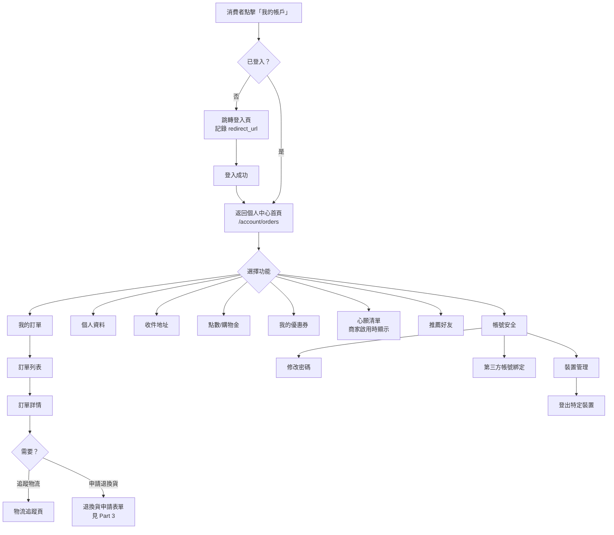
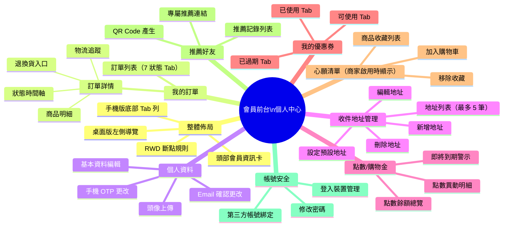
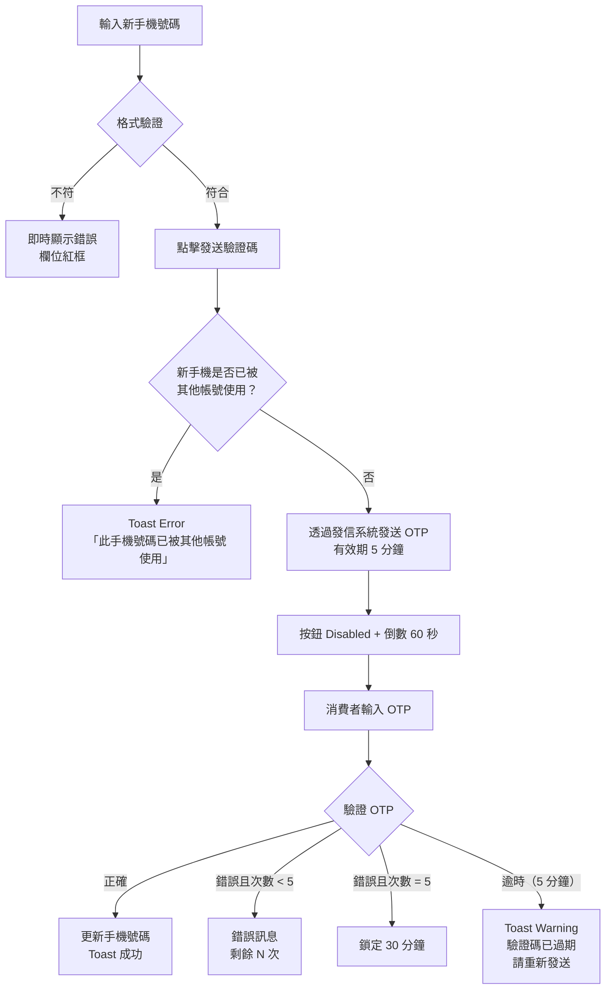
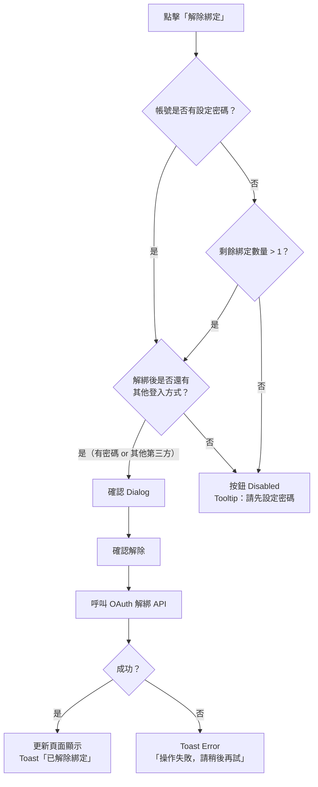
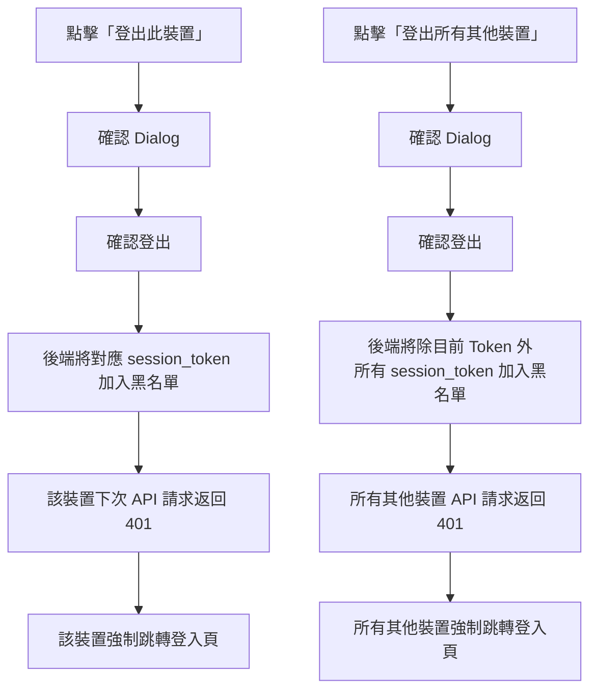

## 版本更新紀錄

| 版本 | 日期 | 修改內容 | 修改人 |
|------|------|----------|--------|
| v1.3 | 2026/05/27 | 3-8：§6.5 點數/購物金頁新增「待扣除點數」狀態卡（`points_owed > 0` 時顯示，白話說明文字，對標 91APP 三端透明化規格）；3-12：§6.7 心願清單確認以商品層級為粒度（非 SKU），`variant_id` v1.0 不使用，加入購物車時才選規格，補充缺貨規格的 UX 處理說明 | Una |
| v1.4 | 2026/05/28 | §8.5 DB Schema：移除 SQL 語法，改以業務語言欄位需求表（Markdown 表格）呈現 | Una |
| v1.2 | 2026/05/21 | 連動 Part4 v1.2 + Part6 v1.5：§6.5 點數/購物金頁新增「待入帳」狀態預留欄位（訂單完成前的回饋預覽）；明定會員端**不顯示**任何應收／註銷資訊（依 Part4 §6.6C 決議）；Mode B 負餘額相關 UI 預留說明 | Una |
| v1.1 | 2026/05/04 | 修正使用者角色邊界錯誤：移除所有消費者前台中對 Evomni 方案名稱（啟航方案／進階電商包）的直接暴露；心願清單改以後端 `wishlist_enabled` 旗標控制顯示，未啟用時導覽項目不渲染；等值購物金改以 `points_exchange_rate` 非 null 為顯示條件 | Una |
| v1.0 | 2026/05/04 | 初稿建立 | Una |

# Evomni — 會員前台個人中心 產品需求文件 (PRD) v1.3

## 1. 文件資訊

| 屬性 | 內容 |
| --- | --- |
| 模組名稱 | 會員前台個人中心（Member Account Center） |
| 版本 | v1.3 |
| 日期 | 2026/05/27 |
| 作者 | Una |
| 所屬方案 | 電商啟航方案 + 進階電商包（部分功能進階專屬） |
| 前置文件 | `Evomni_Part6_會員管理_PRD.md`（後台會員管理）、`Evomni_第三方登入_PRD.md`（OAuth 綁定）、`Evomni_Part3_訂單管理_PRD.md`（訂單狀態機） |
| 關聯文件（v1.2 新增） | [Part4 行銷活動 PRD](Evomni_Part4_行銷活動_PRD.md)、[優惠計算引擎技術規格 PRD](Evomni_優惠計算引擎_技術規格_PRD.md) |
| 需求來源 | 2026/05/04 Una 補充指示：前台會員登入後個人頁面完整規格、**Part4 v1.2 連動需求** |
| 文件狀態 | v1.2 連動版 |
| 開發階段 | 階段一（電商啟航方案：5–8 月） |

> **📌 工程師實作說明：** 本文件以需求定義為主。文中所列技術規格（DB Schema、API 路由、資料結構等）為規劃建議，反映 PM 對系統的理解；工程師可依技術判斷調整實作方式。如有重大架構變更，請於 Git commit 說明原因，並同步更新本文件，保持版控一致。

> **📌 與 Part 6 §6.6 的關係：** `Evomni_Part6_會員管理_PRD.md` §6.6 已定義前台會員中心的頁面清單與部分欄位規格（個人資料欄位驗證、OTP 流程、點數概覽、推薦連結）。本文件為其 **Figma Ready 完整展開版**，補足所有缺漏的子頁面 UI/UX 規格，兩份文件並存互補，不重複、不矛盾。

---

## 2. 目標與功能總覽

### 2.1 核心願景與相依性

**核心問題：**
消費者完成購買後，沒有一個集中的自助管理入口可以查訂單、管理個資、使用點數與優惠券，只能透過客服或郵件處理，造成商家客服負擔高、消費者體驗差。

**解決方案：**
建立完整的「會員前台個人中心」，讓消費者登入後能自助完成所有帳號相關操作，減少非必要客服接觸，同時提升對平台的黏著度。

**Evomni 價值對應：**
- 消費者自助率提升 → 商家客服成本降低
- 個人中心做為後續行銷再觸達的資料蒐集場域（生日、標籤、消費紀錄）
- 點數與優惠券頁促進回購，心願清單增加轉換機會

**系統相依性：**

| 相依模組 | 用途 |
| --- | --- |
| Part 6 會員管理（後台） | 讀取會員等級、點數餘額、分眾標籤、黑名單狀態 |
| Part 3 訂單管理 | 讀取訂單列表、訂單狀態、退換貨申請入口 |
| Part 4 行銷活動 | 讀取已領優惠券列表、優惠券使用狀態 |
| 第三方登入 PRD | 顯示第三方帳號綁定狀態（LINE/Google/FB）、解綁流程 |
| 發信系統 | OTP 驗證信、Email 更改確認信 |
| 媒體庫 | 會員頭像上傳 |
| 會員認證模組 | Session 管理、裝置 Token、登出操作 |

### 2.2 功能總覽表

本文件涵蓋消費者登入後的個人中心全部 9 個頁面，依照側邊導覽的排列順序呈現。

| 主功能模組 | 子功能項目 | 功能目的 | 功能詳細描述 | 影響之使用者 |
| --- | --- | --- | --- | --- |
| 整體佈局框架 | 全局框架（頭部 + 側邊導覽） | 統一的個人中心入口 | 桌面版左側導覽列 + 內容區；手機版底部 Tab 列；頭部顯示頭像、姓名、等級、點數 | 消費者 |
| 整體佈局框架 | RWD 斷點設計 | 跨裝置可用性 | Desktop ≥1024px / Tablet 768–1023px / Mobile ≤767px 三段式響應佈局 | 消費者 |
| 我的訂單 | 訂單列表 | 快速瀏覽所有訂單 | 依狀態分 Tab（全部/待付款/待出貨/已出貨/已完成/已取消/退換貨申請中）；每筆訂單卡片顯示商品縮圖、金額、狀態、操作按鈕 | 消費者 |
| 我的訂單 | 訂單詳情 | 查看單一訂單完整資訊 | 狀態時間軸、商品明細、收件人、付款方式、物流資訊、金額計算、退換貨歷程 | 消費者 |
| 我的訂單 | 物流追蹤 | 即時追蹤包裹進度 | 嵌入物流商追蹤連結或物流狀態 Timeline；超商取貨顯示取件門市與取件期限 | 消費者 |
| 我的訂單 | 退換貨申請入口 | 消費者自助申請退換 | 訂單詳情頁底部入口，點擊後帶入訂單資訊進入 Part 3 退換貨申請表單 | 消費者 |
| 個人資料 | 基本資料編輯 | 維護個人基本資訊 | 姓名/手機/Email/生日/性別，含手機 OTP 更改流程、Email 確認連結；詳見 Part 6 §6.6.B | 消費者 |
| 個人資料 | 大頭照上傳 | 個人化識別 | 上傳頭像圖片（PNG/JPG，≤2MB），未上傳時以姓名首字母顯示 | 消費者 |
| 收件地址管理 | 地址列表 | 管理多筆常用地址 | 最多 5 筆；設定預設地址；結帳時自動帶入預設地址 | 消費者 |
| 收件地址管理 | 新增 / 編輯 / 刪除地址 | 維護收件地址 | 縣市 / 區 / 街道三欄；新增、行內編輯、刪除含確認彈窗 | 消費者 |
| 點數/購物金 | 點數餘額總覽 | 了解目前可用點數 | 點數餘額、等值購物金換算（進階方案）、即將到期點數警示 | 消費者 |
| 點數/購物金 | 點數異動明細 | 查詢點數歷史記錄 | 依時間排序的完整點數增減紀錄，含原因說明 | 消費者 |
| 我的優惠券 | 優惠券錢包 | 管理已領優惠券 | Tab 分可使用/已使用/已過期；每張優惠券顯示折扣條件、到期日、適用限制 | 消費者 |
| 心願清單 | 商品收藏 | 追蹤有興趣商品 | 收藏商品列表；可直接加入購物車；商品下架時顯示提示；此功能是否顯示由商家後台設定決定 | 消費者 |
| 推薦好友 | 推薦連結與記錄 | 分享推薦獲取點數 | 專屬推薦連結 + QR Code；推薦記錄列表；詳見 Part 6 §6.6.D | 消費者 |
| 帳號安全 | 修改密碼 | 保護帳號安全 | 驗證現有密碼後設定新密碼；密碼強度即時提示 | 消費者 |
| 帳號安全 | 第三方帳號綁定管理 | 管理 OAuth 登入方式 | 顯示 LINE/Google/FB 綁定狀態；可綁定或解綁；至少保留一種登入方式 | 消費者 |
| 帳號安全 | 登入裝置管理 | 偵測異常登入 | 列出目前所有有效登入裝置；可遠端登出特定裝置或全部裝置 | 消費者 |

---

## 3. 全局功能流程

消費者從前台任意頁面點擊「我的帳戶」後，系統驗證登入狀態，若未登入則跳轉登入頁（完成後返回），若已登入則進入個人中心。



**黑名單會員流程例外：** 黑名單會員可正常瀏覽個人中心（訂單、資料、點數），但進入購物車 → 結帳時會被攔截，詳見 Part 6 §6.7.C。

---

## 4. 功能結構圖



---

## 5. 使用者故事

| ID | 角色 | 使用者故事 |
| --- | --- | --- |
| US-01 | 消費者 | 身為消費者，我想要在手機上快速查看我的所有訂單狀態，以便不用聯絡客服就能知道包裹到哪了。 |
| US-02 | 消費者 | 身為消費者，我想要在訂單詳情頁直接點一下進入退換貨申請，以便整個流程不超過 3 分鐘。 |
| US-03 | 消費者 | 身為消費者，我想要管理最多 5 筆常用收件地址，並設定預設地址，以便結帳時不用每次重新輸入。 |
| US-04 | 消費者 | 身為消費者，我想要看到我的點數餘額和即將到期點數提示，以便在過期前使用它。 |
| US-05 | 消費者 | 身為消費者，我想要在優惠券頁面集中查看我所有的優惠券，以便結帳時知道我有哪些可以用。 |
| US-06 | 消費者 | 身為消費者，我想要收藏有興趣的商品，並在心願清單頁一鍵加入購物車，以便不用重新搜尋商品。 |
| US-07 | 消費者 | 身為消費者，我想要安全地更改我的手機號碼，並透過 OTP 驗證確認是本人，以便帳號資料保持正確。 |
| US-08 | 消費者 | 身為消費者，我想要查看哪些裝置目前登入了我的帳號，並能遠端登出可疑裝置，以便保護我的帳號安全。 |
| US-09 | 消費者 | 身為消費者，我想要管理我的 LINE/Google/FB 帳號綁定，以便決定哪些快速登入方式要保留。 |
| US-10 | 消費者 | 身為消費者，我想要取得我的專屬推薦連結並分享給朋友，以便我們雙方都能獲得點數獎勵。 |

---

## 6. UI/UX 與詳細功能需求

### 6.1 整體佈局框架

#### A. 核心使用者流程

消費者點擊網站 Header 右上角「我的帳戶」圖示 → 驗證登入 → 進入個人中心，預設停在「我的訂單」頁。

#### B. 介面佈局與元件拆解（Figma Ready）

**整體三層結構：**
```
[網站全域 Header（含 Logo、商品搜尋、購物車）]
  ↓
[個人中心 Wrapper]
  ┌─────────────────────────────────────────────────┐
  │  [會員資訊卡頭部]（橫向通欄）                      │
  ├─────────────┬───────────────────────────────────┤
  │  左側導覽   │  內容區                             │
  │  220px      │  flex-1                             │
  │             │                                     │
  │             │                                     │
  └─────────────┴───────────────────────────────────┘
[網站全域 Footer]
```

**會員資訊卡頭部（`<div class="member-header">`）：**

```
┌─────────────────────────────────────────────────────────────┐
│  [頭像 40x40 圓形]  [姓名 16px font-weight:600]             │
│                     [等級 Badge Tag]  [點數：XXX 點]         │
└─────────────────────────────────────────────────────────────┘
```

| 元素 | 規格 |
| --- | --- |
| 頭像 | `40x40px`，`border-radius: 50%`；未上傳時：`#409EFF` 背景 + 白色姓名首字母（大寫）；有頭像時顯示圖片 |
| 姓名 | `font-size: 16px`，`font-weight: 600`，`color: #303133` |
| 等級 Badge | `<el-tag class="!rounded-full" size="small">`；顏色對應等級設定（見 Part 6 §6.3）；無等級系統時不顯示 |
| 點數快覽 | `font-size: 14px`，`color: #606266`；文字：「X 點」；點擊跳轉 `/account/points`；商家有啟用點數功能時顯示 |
| 頭部容器 | `background: #FFFFFF`；`border-bottom: 1px solid #DCDFE6`；`padding: 24px 32px` |

**左側導覽（Desktop，`<el-menu :default-active="activeMenu" mode="vertical">`）：**

| 順序 | 選單項目 | 路由 | 備註 |
| --- | --- | --- | --- |
| 1 | 📦 我的訂單 | `/account/orders` | 預設進入頁 |
| 2 | 👤 個人資料 | `/account/profile` | |
| 3 | 📍 收件地址 | `/account/addresses` | |
| 4 | 🎁 點數/購物金 | `/account/points` | |
| 5 | 🎟 我的優惠券 | `/account/coupons` | |
| 6 | ❤️ 心願清單 | `/account/wishlist` | 僅在商家後台已啟用心願清單功能時顯示；未啟用則此項目不出現於導覽 |
| 7 | 👥 推薦好友 | `/account/referral` | |
| 8 | 🔒 帳號安全 | `/account/security` | |
| — | 登出 | — | 底部，`color: #F56C6C`；點擊觸發確認 Dialog |

元件規格：
- 寬度：`220px`，`background: #FFFFFF`，`border-right: 1px solid #DCDFE6`
- 當前選中項：`background: #F5F7FA`，左邊框 `3px solid #303133`
- Hover：`background: #F5F7FA`
- 字級：`14px`，`color: #303133`

#### C. RWD 斷點規格

| 斷點 | 尺寸 | 佈局變化 |
| --- | --- | --- |
| Desktop | ≥ 1024px | 左側導覽 220px 完整展示 + 內容區 |
| Tablet | 768px–1023px | 左側導覽收合為 60px icon-only 模式；Hover 顯示文字 Tooltip |
| Mobile | ≤ 767px | 左側導覽隱藏；改為頁面底部固定 Tab 列（5 個主要項目：訂單 / 個人資料 / 點數 / 優惠券 / 更多） |

**手機版底部 Tab 列：**

```
┌────────────────────────────────────────────┐
│  📦訂單   👤個人資料   🎁點數   🎟優惠券   ≡更多  │
└────────────────────────────────────────────┘
```

- 高度：`56px`；`background: #FFFFFF`；`border-top: 1px solid #DCDFE6`；`position: fixed; bottom: 0`
- 「更多」點擊展開 Bottom Sheet，顯示：心願清單、收件地址、推薦好友、帳號安全、登出

#### D. 防呆機制與錯誤預防

- 未登入直接訪問 `/account/*` 任何路由 → 301 跳轉 `/login?redirect=/account/orders`
- 登出確認：`<el-message-box>` 文字：「確定要登出帳號嗎？」；按鈕：取消 / 確定登出（`type="danger"`）
- Session 過期（後端回傳 401）→ 清除本地 Token → Toast 提示「登入已逾期，請重新登入」→ 跳轉登入頁
- 心願清單功能由後端 API 回傳是否啟用（`wishlist_enabled: boolean`）；未啟用時前端直接不渲染該導覽項目，路由 `/account/wishlist` 返回 404 並重導向 `/account/orders`

---

### 6.2 我的訂單頁

**路由：** `/account/orders`（列表）、`/account/orders/:orderId`（詳情）

#### A. 核心使用者流程

消費者進入「我的訂單」→ 依狀態 Tab 篩選 → 點擊任一訂單卡片進入詳情 → 可查看物流進度或發起退換貨申請。

#### B. 介面佈局與元件拆解（Figma Ready）

**訂單列表頁**

```
[頁面標題：我的訂單]

[狀態 Tab 列]
 全部  待付款(N)  待出貨(N)  已出貨(N)  已完成(N)  已取消  退換貨申請中(N)

[搜尋列]
 [🔍 搜尋訂單編號或商品名稱 _______________]

[訂單卡片列表]
  ─────────────────────────────────────────────
  訂單編號：#EC-20260504-0001   下單日期：2026/05/04
                                [狀態 Tag：待出貨]
  [商品縮圖 60x60] 商品名稱（超過一行省略）     NT$ 1,280
  [商品縮圖 60x60] 商品名稱                    共 2 件
  （超過 3 件：顯示 +N 件）
                          [查看訂單] [申請退換貨] 等操作按鈕
  ─────────────────────────────────────────────
```

**狀態 Tab 規格：**

| Tab | 顯示條件 | 右上角數字 Badge |
| --- | --- | --- |
| 全部 | 所有訂單 | 不顯示 |
| 待付款 | `status = pending_payment` | 未付款訂單數，`color: #E6A23C` |
| 待出貨 | `status = paid / processing` | 待處理訂單數 |
| 已出貨 | `status = shipped` | 在途訂單數 |
| 已完成 | `status = completed` | 不顯示 |
| 已取消 | `status = cancelled` | 不顯示 |
| 退換貨申請中 | 有進行中退換貨申請 | 申請中件數，`color: #F56C6C` |

**訂單卡片操作按鈕（依狀態）：**

| 訂單狀態 | 操作按鈕 |
| --- | --- |
| 待付款 | [繼續付款]（`type="primary"`）[取消訂單]（`type="default"`） |
| 待出貨 / 備貨中 | [查看訂單] |
| 已出貨 | [查看物流]（`type="primary"`）[確認收貨] |
| 已完成 | [查看訂單] [申請退換貨] [再次購買] |
| 已取消 | [查看訂單] |
| 退換貨申請中 | [查看申請進度] |

所有按鈕：`<el-button class="!rounded-none" size="small">`

**Empty State（該 Tab 無訂單時）：**
```
[插圖：空箱子]
「目前沒有[待付款]訂單」
[前往購物] 按鈕（type="primary"）
```

---

**訂單詳情頁**（`/account/orders/:orderId`）

```
[← 返回我的訂單]    訂單編號：#EC-20260504-0001

[訂單狀態時間軸]
  ● 訂單建立  ● 付款完成  ● 備貨中  ◎ 已出貨  ○ 完成
  2026/05/04  2026/05/04  2026/05/05  2026/05/06  —

[收件人資訊]
  姓名：○○○  手機：09XX-XXX-XXX  
  地址：台北市大安區○○路○○號

[付款資訊]
  付款方式：信用卡（末四碼 1234）
  付款狀態：已付款  付款時間：2026/05/04 14:32

[物流資訊]
  物流商：黑貓宅急便  追蹤號碼：123456789  [查看物流]
  預計到貨：2026/05/07

[商品明細]
  ┌──────────────────────────────────────────┐
  │ [縮圖] 商品名稱                           │
  │        規格：顏色/黑色  尺寸/M  數量：1  │
  │                              NT$ 1,080    │
  ├──────────────────────────────────────────┤
  │ [縮圖] 商品名稱                           │
  │        規格：尺寸/L  數量：2              │
  │                              NT$ 400      │
  └──────────────────────────────────────────┘

[金額計算]
  商品小計：NT$ 1,480
  運費：NT$ 60
  優惠券折扣：- NT$ 100
  ─────────────────
  訂單總計：NT$ 1,440

[退換貨申請按鈕]  （已完成訂單才顯示，7 天內）
  [申請退換貨]（type="warning"，帶入訂單 ID 進入 Part 3 申請表單）
```

**訂單狀態時間軸規格（`<el-steps>`）：**

| 步驟 | 顯示文字 | 完成顯示 | 當前顯示 | 未到達 |
| --- | --- | --- | --- | --- |
| 1 | 訂單建立 | ✅ `#67C23A` | — | ○ `#DCDFE6` |
| 2 | 付款完成 | ✅ `#67C23A` | — | ○ `#DCDFE6` |
| 3 | 備貨中 | ✅ `#67C23A` | ⏳ `#409EFF` | ○ `#DCDFE6` |
| 4 | 已出貨 | ✅ | ⏳ | ○ |
| 5 | 訂單完成 | ✅ | ⏳ | ○ |

取消訂單：步驟列不顯示，改顯示紅色說明文字：「此訂單已於 YYYY/MM/DD 取消，原因：[原因]」

**[查看物流] 操作：**
- 若物流商有追蹤 URL：新分頁開啟物流商官網追蹤頁
- 若系統有物流狀態回傳：展開內嵌 Timeline，顯示各配送節點時間

**申請退換貨按鈕顯示條件：**
- `status = completed` AND 訂單完成日期距今 ≤ 7 天
- 超過 7 天：按鈕不顯示（不顯示說明文字，避免爭議）
- 已有進行中申請：按鈕改為「查看申請進度」

#### C. 互動設計、狀態與系統反饋

- 點擊「確認收貨」：`<el-message-box confirm>` 文字：「確認您已收到此訂單的商品？確認後訂單狀態將更新為完成。」
- 點擊「取消訂單」（待付款狀態）：彈窗說明「訂單取消後不可恢復，確定要取消嗎？」；取消成功後 Toast「訂單已取消」，Tab 自動切換至「已取消」
- 點擊「再次購買」：將訂單商品全部加入購物車（若商品已下架或刪除則跳過，並提示「部分商品已下架，無法加入購物車」）

#### D. 防呆機制與錯誤預防

- 訂單 ID 不存在或不屬於本會員：顯示 404 狀態，文字：「找不到此訂單，請確認訂單編號是否正確。」 + [返回我的訂單] 按鈕
- 搜尋無結果：「找不到符合「○○」的訂單」 + [清除搜尋]

---

### 6.3 個人資料頁

**路由：** `/account/profile`

#### A. 核心使用者流程

消費者進入「個人資料」→ 看到目前已填資料 → 點擊欄位編輯 → 儲存或取消。更改手機需額外 OTP 驗證；更改 Email 需點擊確認信連結。

#### B. 介面佈局與元件拆解（Figma Ready）

```
[頁面標題：個人資料]

[大頭照區塊]
  [圓形頭像 80x80]
  [點擊上傳]  [移除]（有頭像時才顯示）
  說明文字：「支援 JPG、PNG，檔案大小不超過 2MB」

[資料表單]
  姓名 *         [________________]
  手機號碼 *     [09XX-XXX-XXX___]  [更改手機] 連結
  Email *        [___@___.com____]  [更改 Email] 連結
  生日            [年 ▼] [月 ▼] [日 ▼]  ⓘ「生日設定後不可自行更改」
  性別            ○ 男  ○ 女  ○ 不透露

[收件地址快覽]
  預設地址：台北市大安區○○路○○號  [管理地址 →]

                              [取消] [儲存變更]
```

**各欄位元件規格：**

| 欄位 | 元件 | Placeholder | 驗證規則 | 錯誤訊息 |
| --- | --- | --- | --- | --- |
| 姓名 | `<el-input>` | 請輸入您的姓名 | 必填；最多 20 字 | 「姓名為必填欄位」/ 「姓名不可超過 20 個字」 |
| 手機號碼 | `<el-input>` disabled（只讀顯示） | — | 需透過「更改手機」流程修改 | — |
| Email | `<el-input>` disabled（只讀顯示） | — | 需透過「更改 Email」流程修改 | — |
| 生日 - 年 | `<el-select>` | 年 | 選填；範圍：今年 -100 至今年 -7 | 「年齡需在 7 歲以上」 |
| 生日 - 月 | `<el-select>` | 月 | 選填 | — |
| 生日 - 日 | `<el-select>` | 日 | 選填；依月份自動調整天數 | — |
| 性別 | `<el-radio-group>` | — | 選填 | — |

**生日欄位 Info Tooltip 完整文案：**
> 「生日設定後如需修改，請聯絡營運輔導顧問協助處理。每個帳號每年僅可修改一次。」

**大頭照上傳規格（`<el-upload>`）：**

| 狀態 | 說明 |
| --- | --- |
| 未上傳 | 顯示「姓名首字母」佔位圓形；底部顯示上傳按鈕 |
| 上傳中 | 圓形內顯示進度 spinner |
| 上傳成功 | 顯示新頭像；Toast「頭像已更新」 |
| 檔案過大 | Toast Error「檔案大小不可超過 2MB，請重新選擇」 |
| 格式錯誤 | Toast Error「僅支援 JPG 或 PNG 格式」 |
| 移除 | 確認 Dialog：「確定移除頭像？移除後將顯示預設圖示。」 |

---

**更改手機號碼流程（6 步驟）：**

1. 點擊「更改手機」→ 展開內嵌區塊（不跳頁）
2. 輸入新手機號碼（`<el-input>` type="tel"，placeholder：「請輸入新的手機號碼」）
3. 點擊「發送驗證碼」→ 按鈕進入 Disabled + 倒數 60 秒狀態：「重新發送（58）」
4. 輸入 6 位數 OTP（`<el-input>` maxlength="6"，placeholder：「請輸入驗證碼」）
5. 點擊「確認更改」→ 驗證通過 → 更新成功，Toast「手機號碼已更新」
6. OTP 錯誤：「驗證碼錯誤，請重新確認，剩餘 N 次嘗試機會」；超過 5 次：「驗證次數超過上限，請於 30 分鐘後再試」

**更改 Email 流程（3 步驟）：**

1. 點擊「更改 Email」→ 展開輸入框
2. 輸入新 Email → 點擊「發送確認信」→ 成功提示：「確認信已寄出至 [新Email]，請點擊信件中的連結完成驗證，連結 24 小時內有效。」
3. 消費者點擊信件連結 → 系統驗證 Token → 更新 Email → 跳轉頁面顯示「Email 已成功更新」

#### C. 互動設計、狀態與系統反饋

- 「儲存變更」按鈕：未有任何修改時 Disabled；有修改時 Normal
- 儲存成功：Toast「個人資料已更新」，持續 3 秒
- 儲存失敗（網路錯誤）：Toast Error「儲存失敗，請稍後再試」

#### D. 防呆機制與錯誤預防

- 離開頁面時若有未儲存變更：`beforeRouteLeave` 觸發確認 Dialog：「您有尚未儲存的變更，確定要離開嗎？」
- 新手機號碼格式驗證：即時（blur 事件）；不符合 `09XXXXXXXX` 格式 → 欄位紅框 + 「請輸入有效的台灣手機號碼格式，例：0912345678」
- 新 Email 格式驗證：即時；不符合 Email 格式 → 「請輸入有效的電子信箱格式，例：name@example.com」

---

### 6.4 收件地址管理

**路由：** `/account/addresses`

#### A. 核心使用者流程

消費者進入「收件地址」→ 查看已儲存地址列表 → 可新增、編輯、刪除地址，或設定某筆為預設地址。

#### B. 介面佈局與元件拆解（Figma Ready）

```
[頁面標題：收件地址]
說明文字：「最多可儲存 5 筆收件地址。結帳時將自動帶入預設地址。」

[已儲存地址列表]
  ┌──────────────────────────────────────────────────────┐
  │  [預設] 台北市大安區○○路○○號 2 樓                   │
  │  王小明  0912-345-678                                  │
  │                              [設為預設]（灰色，已是預設）[編輯] [刪除]  │
  ├──────────────────────────────────────────────────────┤
  │  台中市西屯區○○路○○號                               │
  │  王小明  0912-345-678                                  │
  │                              [設為預設]（藍色）[編輯] [刪除]        │
  └──────────────────────────────────────────────────────┘

[+ 新增地址]（按鈕；已達 5 筆時 Disabled + Tooltip：「已達上限 5 筆，請先刪除不需要的地址」）
```

**地址卡片規格：**

| 元素 | 規格 |
| --- | --- |
| 預設標籤 | `<el-tag class="!rounded-full" type="primary" size="small">`；文字「預設」 |
| 地址文字 | `font-size: 14px`，`color: #303133` |
| 聯絡人資訊 | `font-size: 13px`，`color: #606266` |
| 操作按鈕 | `<el-button size="small" class="!rounded-none">`；設為預設 `type="primary"` / 編輯 `type="default"` / 刪除 `type="danger"` |

**新增/編輯地址表單（`<el-dialog>` 或展開卡片）：**

| 欄位 | 元件 | 驗證規則 | 錯誤訊息 |
| --- | --- | --- | --- |
| 聯絡人姓名 | `<el-input>` | 必填；最多 20 字 | 「請輸入收件人姓名」 |
| 手機號碼 | `<el-input>` | 必填；台灣手機格式 | 「請輸入有效的手機號碼」 |
| 縣市 | `<el-select>` | 必填 | 「請選擇縣市」 |
| 行政區 | `<el-select>` | 必填；依縣市連動 | 「請選擇行政區」 |
| 詳細地址 | `<el-input>` | 必填；最多 100 字 | 「請輸入詳細地址」 |
| 設為預設 | `<el-checkbox>` | 選填；新增時預設不勾 | — |

縣市/行政區：前端 JSON 靜態資料；選縣市後區下拉自動更新。

#### C. 互動設計、狀態與系統反饋

- 點擊「設為預設」：即時更新，舊的預設地址預設標籤消失，新的出現；Toast「已更新預設地址」
- 點擊「刪除」：`<el-message-box confirm>` 文字：「確定刪除此地址？刪除後不可恢復。」
- 刪除預設地址：確認框增加說明：「此為您的預設地址，刪除後請重新設定預設地址。」
- 儲存地址成功：Dialog 關閉，Toast「地址已儲存」

#### D. 防呆機制與錯誤預防

- 刪除唯一一筆地址時：正常允許刪除（不強制保留地址）
- 超過 5 筆限制時：新增按鈕 Disabled，`<el-tooltip content="已達上限 5 筆，請先刪除不需要的地址">`

---

### 6.5 點數/購物金頁

**路由：** `/account/points`

**備註：** 本節為 Part 6 §6.6.C 的完整 Figma Ready 展開版。

#### A. 核心使用者流程

消費者進入「點數/購物金」→ 查看餘額與即將到期點數 → 瀏覽完整點數異動明細。

#### B. 介面佈局與元件拆解（Figma Ready）

```
[頁面標題：點數/購物金]

[點數總覽卡片區]
  ┌─────────────────────────┐  ┌──────────────────────────────┐
  │  可用點數                │  │  即將到期（30 天內）（若有）   │
  │  1,250 點               │  │  ⚠️ 80 點 將於 2026/05/30 到期 │
  │  [去使用點數 →]          │  │  [立即使用 →]                  │
  └─────────────────────────┘  └──────────────────────────────┘

  [待入帳卡片 — v1.2 新增，若有則顯示]
  ┌─────────────────────────┐
  │  待入帳點數              │
  │  💫 200 點               │
  │  訂單完成後發放          │
  │  [查看訂單 →]            │
  └─────────────────────────┘

  [若商家已設定購物金兌換比率則顯示]
  等值購物金：NT$ 125（依兌換比率 10:1 換算）

[點數異動明細]
  [篩選：全部 ▼] [本月 ▼]

  ┌───────────────────────────────────────────────────────────┐
  │ 日期           原因             點數變化   累計餘額        │
  ├───────────────────────────────────────────────────────────┤
  │ 2026/05/04    訂單 #EC-0001 消費回饋   + 125 點   1,250 點 │
  │ 2026/04/28    推薦好友獎勵             + 50 點    1,125 點 │
  │ 2026/04/20    訂單 #EC-0089 使用點數  - 100 點    1,075 點 │
  └───────────────────────────────────────────────────────────┘

  [顯示更多]（分頁或 Load more）
```

**點數總覽卡片規格：**

| 元素 | 規格 |
| --- | --- |
| 可用點數卡 | `background: #FFFFFF`；`border: 1px solid #DCDFE6`；`padding: 24px`；數字 `font-size: 28px`，`font-weight: 700`，`color: #303133` |
| 即將到期卡 | `background: #FFF8E1`（淡黃）；`border: 1px solid #E6A23C`；`⚠️` icon；文字 `color: #E6A23C` |
| 等值購物金 | 後端 API 回傳 `points_exchange_rate`（兌換比率）不為 null 時顯示；`font-size: 14px`，`color: #606266`；Tooltip：「依商店設定的點數兌換比率換算，實際使用時請依結帳頁顯示為準。」 |
| 即將到期卡 | 30 天內有到期點數才顯示；無則不顯示此卡片 |
| 待入帳卡（v1.2 新增）| `background: #F0F9FF`（淡藍）；`border: 1px solid #409EFF`；`💫` icon；文字 `color: #303133`；顯示條件：「目前有訂單狀態為『已送達』或『已完成 < 7 天』且尚未發放回饋」時顯示；數值來源：依該等訂單的預估回饋總和；無則不顯示此卡片 |

**待扣除點數（`points_owed`）消費者端顯示（3-8 決議）：**

若消費者帳號存在 `points_owed > 0`（因回饋追回差額造成的點數欠款），在點數總覽卡片區顯示以下狀態卡：

```
[待扣除點數卡片]（背景 #FFF8E1，border #E6A23C）
  ⚠️  待扣除點數
  您有 {N} 點待扣除，當您的點數餘額足夠時將自動扣除。
```

- 卡片僅在 `points_owed > 0` 時顯示；`points_owed = 0` 則不渲染
- 說明文字使用白話，**不暴露「欠款」「應收」等後台術語**
- 業界對標：91APP 前台同樣三端全顯示待扣除點數狀態，透明化減少客訴

**v1.2 重要規範 — 會員端不顯示應收／註銷資訊（連動 Part4 v1.2 §6.6C / Part6 v1.5 §6.11）：**

- 會員交易明細與點數/購物金頁面**完全不顯示**：
  - ❌ 應收記錄（餘額不足時系統暫扣的差額）
  - ❌ 應收註銷（6 個月過期後系統勾消的記錄）
  - ❌ 任何「-N 應收註銷」「-N 待扣回饋」之類負向交易
- 退款追回扣回的點數**正常顯示**（例：「退款扣回 -100 點」），這是會員確實可見的交易
- 若商家未來啟用 Mode B（負餘額模式，後端 v1.3）：
  - 可用點數欄位可能顯示負值（例：「可用點數 -50 點」）
  - 此時需顯示「待扣回饋說明」浮層：「您的回饋餘額不足以扣回退款金額，差額將於下次新增回饋時優先扣抵」
  - Mode B UI 細部規格詳見 [Part4 後續擴充規劃 §E-05](Evomni_Part4_行銷活動_後續擴充規劃_PRD.md)

**點數異動明細 Table 規格：**

| 欄位 | 規格 |
| --- | --- |
| 日期 | `YYYY/MM/DD`，`color: #606266` |
| 原因 | 最多 30 字；若含訂單號可點擊連結至訂單詳情 |
| 點數變化 | 正數：`+ N 點`，`color: #67C23A`；負數：`- N 點`，`color: #F56C6C` |
| 累計餘額 | `color: #303133` |

篩選：
- 全部 / 點數獲得 / 點數使用 / 點數到期
- 本月 / 近 3 個月 / 近 6 個月 / 自訂時間區間

**Empty State（無異動紀錄）：**
「目前沒有點數紀錄。購物消費後可獲得回饋點數！」 + [前往購物] 按鈕

#### C. 互動設計、狀態與系統反饋

- 即將到期「立即使用」按鈕：導向商品列表頁，不觸發其他行為
- 點數明細「去使用點數」：導向商品列表頁
- 分頁採「載入更多」模式（`<el-button>` 置底），每次載入 20 筆

#### D. 防呆機制與錯誤預防

- API 讀取失敗時：顯示 Error State「點數資料載入失敗，請重新整理頁面」

---

### 6.6 我的優惠券頁

**路由：** `/account/coupons`

#### A. 核心使用者流程

消費者進入「我的優惠券」→ 查看可使用優惠券 → 了解使用條件 → 前往購物使用。

#### B. 介面佈局與元件拆解（Figma Ready）

```
[頁面標題：我的優惠券]

[狀態 Tab 列]
  可使用(N)   已使用   已過期

[優惠券卡片列表]
  ┌──────────────────────────────────────────────────────────┐
  │  [左側色塊]  折 NT$100         到期：2026/06/30           │
  │              消費滿 NT$500 可用                            │
  │              適用範圍：全館商品                            │
  │                                          [立即使用 →]     │
  ├──────────────────────────────────────────────────────────┤
  │  [左側色塊]  9折 折扣           到期：2026/05/31 ⚠️即將到期  │
  │              消費滿 NT$800 可用                            │
  │              適用範圍：指定商品分類                         │
  │              ⓘ「不適用已折扣商品」                         │
  │                                          [立即使用 →]     │
  └──────────────────────────────────────────────────────────┘
```

**優惠券卡片規格：**

| 元素 | 規格 |
| --- | --- |
| 左側色塊 | 寬 `8px`；可使用：`#409EFF`；即將到期（7 天內）：`#E6A23C`；已使用：`#909399`；已過期：`#909399` |
| 折扣金額文字 | `font-size: 18px`，`font-weight: 700` |
| 條件說明 | `font-size: 13px`，`color: #606266` |
| 到期日 | 7 天內：`color: #E6A23C` + `⚠️`；其他：`color: #909399` |
| 使用限制 Tooltip | `<el-tooltip>` 完整文案，如：「此優惠券不適用於已折扣商品、加購商品及禮物卡。」 |
| 立即使用按鈕 | `<el-button type="primary" class="!rounded-none" size="small">`；點擊導向商品列表頁（若有指定分類則帶分類篩選）|

**已使用 Tab 卡片：**
- 左側色塊 `#909399`
- 顯示使用時間：「已於 YYYY/MM/DD 使用（訂單 #EC-XXXX）」
- 無操作按鈕

**已過期 Tab 卡片：**
- 左側色塊 `#909399`
- 顯示過期日期：「已於 YYYY/MM/DD 到期」
- 無操作按鈕

**Empty State：**
- 可使用 Tab 無券：「目前沒有可使用的優惠券」 + [前往領券活動]（若商家有設定活動頁則顯示連結，否則不顯示）
- 已使用 Tab 無券：「還沒有使用過的優惠券紀錄」
- 已過期 Tab 無券：「沒有過期的優惠券紀錄」

#### C. 互動設計、狀態與系統反饋

- Tab 數字 Badge：顯示可使用張數；0 張時不顯示數字
- 「立即使用」點擊後：進入商品頁，優惠券不會自動套用（需在結帳頁手動選擇），這是設計決策——不強迫套用，讓消費者自行決定

#### D. 防呆機制與錯誤預防

- 已使用 / 已過期的優惠券卡片視覺降灰（`opacity: 0.6`），不提供「立即使用」操作，防止消費者誤以為仍可使用

---

### 6.7 心願清單

**路由：** `/account/wishlist`

**顯示條件：** 由後端 API 回傳 `wishlist_enabled: true` 時，前端才渲染心願清單導覽項目與頁面。若商家未啟用此功能，前端不顯示導覽項目，直接存取路由 `/account/wishlist` 時返回 404 並重導向 `/account/orders`。消費者不會看到任何關於「功能受限」的訊息。

**心願清單粒度：商品層級（3-12 決議）**
- 心願清單以**商品**（`product_id`）為收藏單位，不到 SKU 規格層（`variant_id`）
- 消費者點擊「加入購物車」時，才選擇規格（顏色、尺寸等）
- 即使商品特定 SKU 缺貨，心願清單仍保留該商品；消費者加入購物車時可選擇有庫存的規格
- DB：`wishlists` 表中 `variant_id` 欄位**不使用**（保留欄位但 v1.0 寫入 `NULL`）

#### A. 核心使用者流程

消費者在商品頁點擊「收藏」圖示 → 商品加入心願清單（商品層級，不分規格）→ 進入個人中心「心願清單」查看所有收藏 → 可點擊加入購物車（展開規格選擇）或移除。

#### B. 介面佈局與元件拆解（Figma Ready）

```
[頁面標題：心願清單]
說明文字：「N 件商品」

[商品格狀列表 Grid 3 欄（桌面）/ 2 欄（平板）/ 1 欄（手機）]
  ┌────────────────────┐  ┌────────────────────┐
  │  [商品圖 1:1]       │  │  [商品圖 1:1]       │
  │  商品名稱           │  │  ❌ 此商品已下架      │
  │  NT$ 1,280         │  │  商品名稱           │
  │  [加入購物車]        │  │  [移除收藏]         │
  │  [移除 ×]          │  │                    │
  └────────────────────┘  └────────────────────┘
```

**商品卡規格：**

| 元素 | 規格 |
| --- | --- |
| 商品圖片 | `aspect-ratio: 1/1`，`object-fit: cover`；下架商品加半透明遮罩 `rgba(0,0,0,0.4)` + 「已下架」文字 |
| 商品名稱 | 最多 2 行，超過省略 |
| 售價 | `font-weight: 600`，`color: #303133` |
| 加入購物車按鈕 | `<el-button type="primary" class="!rounded-none">`；有庫存才顯示；無庫存改為「已售完，到貨通知」（連結至 Part 2 貨到通知功能） |
| 移除按鈕 | 右上角 `×` 圖示，`color: #909399`；Hover `color: #F56C6C`；點擊無確認彈窗，直接移除並 Toast「已從心願清單移除」 |
| 已下架 | 無加入購物車按鈕；僅保留移除按鈕 |

**批次操作列（選取模式）：**
- 長按任意商品卡 → 進入多選模式 → 顯示 Checkbox
- 底部出現固定操作列：「已選 N 件」 [加入購物車] [移除]

**Empty State（心願清單為空）：**
```
[插圖：愛心空容器]
「還沒有收藏任何商品」
「逛逛商品時點擊 ❤️ 圖示就能加入心願清單」
[前往購物] 按鈕（type="primary"）
```

#### C. 互動設計、狀態與系統反饋

- 點擊「加入購物車」成功：Toast「已加入購物車」+ 右上角購物車數量 +1 動畫
- 加入購物車失敗（已售完）：Toast Warning「此商品目前已售完，無法加入購物車」
- 商品有多種規格（顏色/尺寸等）：**所有商品一律**先展開規格選擇浮層（`<el-drawer>` 或 Bottom Sheet），讓消費者選擇規格後再加入購物車（心願清單不記錄規格，必須在此步驟選擇）
- 若商品特定規格缺貨：消費者可選擇其他有庫存的規格；若所有規格均缺貨改顯示「已售完，到貨通知」

#### D. 防呆機制與錯誤預防

- 商家刪除商品後，心願清單中顯示「此商品已下架」，不自動從清單移除（讓消費者自行決定是否刪除，保留歷史收藏紀錄）
- 最大收藏數量：無上限（不設硬性限制，避免影響體驗）

---

### 6.8 推薦好友頁

**路由：** `/account/referral`

**備註：** 本節為 Part 6 §6.6.D 的完整 Figma Ready 展開版。

#### A. 核心使用者流程

消費者進入「推薦好友」→ 取得專屬推薦連結 → 分享給朋友 → 查看推薦記錄與獲得點數。

#### B. 介面佈局與元件拆解（Figma Ready）

```
[頁面標題：推薦好友]

[說明區塊]
  [🎁 推薦說明圖示]
  「推薦好友加入，雙方各獲 50 點！」
  細節說明：「好友完成首次購物後，雙方同時獲得點數回饋。推薦點數將於好友訂單出貨後 3 個工作天內入帳。」

[我的推薦連結]
  https://shop.example.com/ref/[member-id]
  [複製連結]（按鈕）  [分享至 LINE]（按鈕）

[我的 QR Code]
  [QR Code 圖片 160x160]
  [下載 QR Code]（連結）

[推薦統計]
  ┌──────────────────────────────────────────────────────┐
  │  已推薦人數        已完成首購        累計獲得點數        │
  │      5 人              3 人             150 點         │
  └──────────────────────────────────────────────────────┘

[推薦記錄 Table]
  加入日期   是否已首購   獲得點數
  2026/04/20   ✅ 已首購    + 50 點
  2026/04/15   ⏳ 待首購    —
```

**推薦連結區塊規格：**

| 元素 | 規格 |
| --- | --- |
| 連結輸入框 | `<el-input>` readonly；`background: #F5F7FA` |
| 複製連結按鈕 | `<el-button class="!rounded-none">`；點擊後 icon 變為 ✅，文字改為「已複製」，2 秒後恢復 |
| 分享至 LINE | `<el-button class="!rounded-none" style="background: #06C755; color: #fff">`；點擊開啟 LINE 分享 URL |
| QR Code | 使用 `qrcode.js` 前端生成；包含完整推薦連結 |
| 下載 QR Code | 點擊觸發 canvas.toBlob → 下載 PNG 檔，檔名：`evomni-referral-qrcode.png` |

**推薦記錄 Table 規格：**

| 欄位 | 說明 |
| --- | --- |
| 加入日期 | `YYYY/MM/DD` |
| 是否已首購 | `<el-tag class="!rounded-full">` ✅ 已首購（`type="success"`）/ ⏳ 待首購（`type="warning"`） |
| 獲得點數 | 已首購：`+ N 點`（`color: #67C23A`）；待首購：`—` |
| 被推薦人姓名 | **不顯示**（隱私保護；只顯示匿名）|

**Empty State（尚未推薦任何人）：**
「還沒有推薦記錄，快把專屬連結分享給好友吧！」

#### C. 互動設計、狀態與系統反饋

- 推薦連結：若商家關閉推薦功能，整個推薦頁改為顯示「目前商店尚未開放推薦好友功能」提示卡，不顯示連結

#### D. 防呆機制與錯誤預防

- 推薦連結不可被用於自己帳號（後端驗證：推薦人 ID 不可等於被推薦人 ID）
- 同一被推薦人不可被多人推薦（以先完成首次消費的推薦連結為準；後續推薦人不計入）

---

### 6.9 帳號安全頁

**路由：** `/account/security`

#### A. 核心使用者流程

消費者進入「帳號安全」→ 可依需求執行：修改密碼、管理第三方帳號綁定、查看並登出其他裝置。

#### B. 介面佈局與元件拆解（Figma Ready）

```
[頁面標題：帳號安全]

━━━━━━━━━━━━━━━━━━━━━━━━━━━━━━━━
[區塊一：修改密碼]

  目前密碼     [__________________]  👁
  新密碼       [__________________]  👁
  [密碼強度：弱 / 中 / 強  ────────── 進度條]
  確認新密碼   [__________________]  👁

                              [取消] [確認修改密碼]

━━━━━━━━━━━━━━━━━━━━━━━━━━━━━━━━
[區塊二：第三方帳號綁定]

  LINE    ✅ 已綁定（@username）  [解除綁定]
  Google  ✅ 已綁定（email@g.com） [解除綁定]
  Facebook ○ 未綁定              [立即綁定]

━━━━━━━━━━━━━━━━━━━━━━━━━━━━━━━━
[區塊三：登入裝置管理]

  目前裝置（本機）
  Chrome on macOS  |  IP: 1.2.3.4  |  2026/05/04 14:32  |  [本機，無法登出]

  其他已登入裝置
  Safari on iPhone  |  IP: 5.6.7.8  |  2026/05/03 09:12  |  [登出此裝置]
  Chrome on Windows |  IP: 9.10.11.12 | 2026/04/28 18:00 |  [登出此裝置]

  [登出所有其他裝置]（危險操作，type="danger"）

━━━━━━━━━━━━━━━━━━━━━━━━━━━━━━━━
[區塊四：刪除帳號（Danger Zone）]
  說明：「刪除帳號後，您的個人資料、訂單紀錄、點數將永久無法復原。」
  [申請刪除帳號]（文字連結，`color: #F56C6C`；點擊彈出確認流程）
```

---

**修改密碼規格：**

| 欄位 | 元件 | 驗證規則 | 錯誤訊息 |
| --- | --- | --- | --- |
| 目前密碼 | `<el-input type="password" show-password>` | 必填 | 「請輸入目前密碼」 |
| 新密碼 | `<el-input type="password" show-password>` | 必填；長度 8–30；需含英文+數字 | 「密碼需為 8–30 個字元，且須包含英文字母與數字」 |
| 確認新密碼 | `<el-input type="password" show-password>` | 必填；需與新密碼一致 | 「兩次輸入的密碼不相同，請重新確認」 |

**密碼強度進度條：**
- 弱（僅英或僅數字，<8碼）：`color: #F56C6C`，進度 33%
- 中（英+數字，8碼以上）：`color: #E6A23C`，進度 66%
- 強（英+數字+符號，12碼以上）：`color: #67C23A`，進度 100%
- 進度條寬度動態變化（CSS transition 300ms）

修改密碼成功：Toast「密碼已更新，請重新登入」→ 1.5 秒後清除所有 Session → 跳轉至登入頁

---

**第三方帳號綁定規格：**

| 狀態 | 顯示內容 | 操作按鈕 |
| --- | --- | --- |
| 已綁定 | `✅` icon + 平台名稱 + 綁定帳號（Email 或 displayName） | [解除綁定]（`type="danger" plain`） |
| 未綁定 | `○` icon + 平台名稱 + 「未綁定」 | [立即綁定]（`type="primary"` plain） |

「解除綁定」確認 Dialog：「確定解除與 LINE 的帳號綁定？解除後將無法使用 LINE 快速登入。」

**安全驗證機制：** 若消費者僅有第三方登入（無設定密碼），且僅剩一個第三方綁定 → [解除綁定] 按鈕 Disabled + Tooltip：「請先設定密碼，再解除最後一個第三方帳號綁定，以確保您能繼續登入帳號。」

---

**登入裝置管理規格：**

| 欄位 | 說明 |
| --- | --- |
| 裝置資訊 | User-Agent 解析：瀏覽器名稱 + 作業系統；無法解析時顯示「未知裝置」 |
| IP 位置 | 顯示 IP；Hover 顯示 Tooltip：「IP 位置僅供參考，實際位置可能因網路環境而有差異」 |
| 最後活動時間 | `YYYY/MM/DD HH:mm` |
| 本機 | 標示「目前使用中」`<el-tag class="!rounded-full" type="success" size="small">`；無登出按鈕 |
| 其他裝置 | [登出此裝置]（`<el-button size="small" type="danger" plain class="!rounded-none">`） |

「登出所有其他裝置」確認 Dialog：「確定要登出其他所有裝置？此裝置的登入狀態不受影響。」

---

**刪除帳號流程（三步驟確認）：**

1. 點擊「申請刪除帳號」→ Dialog 顯示影響說明：
   > 「刪除帳號後，以下資料將永久移除，無法復原：個人資料、收件地址、點數餘額、優惠券、心願清單。您的訂單紀錄將保留 3 年以符合法規要求（不顯示於前台）。」

2. 要求輸入 Email 確認：`<el-input>` Placeholder：「請輸入您的 Email 以確認刪除」

3. 點擊「確認刪除帳號」→ 系統寄出刪除確認信 → 消費者點擊信件中連結 → 帳號進入「待刪除」狀態（30 天冷靜期）→ 30 天後系統自動刪除。30 天內若重新登入視為取消刪除申請。

#### C. 互動設計、狀態與系統反饋

- 各區塊為獨立可收合的 Section（`<el-collapse>`）；預設全部展開
- 每個區塊有視覺分隔線（`border-top: 1px solid #DCDFE6`）

#### D. 防呆機制與錯誤預防

- 輸入「目前密碼」錯誤時，不透露「密碼錯誤」（防社工攻擊），統一顯示：「目前密碼驗證失敗，請重新輸入」
- 5 次密碼輸入錯誤 → 鎖定 30 分鐘：「由於多次輸入錯誤，此操作已暫時鎖定，請於 30 分鐘後再試」
- 新密碼不可與目前密碼相同：即時驗證，錯誤訊息：「新密碼不可與目前密碼相同」

---

## 7. 細部邏輯流程圖

### 7.1 手機號碼 OTP 更改邏輯



### 7.2 第三方帳號解綁安全檢查



### 7.3 裝置登出邏輯



---

## 8. 非功能性需求

### 8.1 效能需求

| 功能 | 目標回應時間 |
| --- | --- |
| 訂單列表初始載入（20 筆）| ≤ 1 秒 |
| 訂單詳情頁 | ≤ 0.8 秒 |
| 點數明細（20 筆）| ≤ 1 秒 |
| 優惠券列表 | ≤ 0.8 秒 |
| 心願清單（首屏 12 件）| ≤ 1 秒 |
| OTP 發送 API | ≤ 2 秒 |
| 裝置列表載入 | ≤ 0.5 秒 |

### 8.2 安全性需求

- 所有 `/account/*` API 必須驗證 JWT Token；401 返回時前端強制清除 Token 並跳轉登入
- OTP：6 位數隨機數字；有效期 5 分鐘；每支手機每分鐘最多發送 1 次（速率限制）；5 次錯誤鎖定 30 分鐘
- Email 更改驗證連結：含一次性 Token（UUID v4）；有效期 24 小時；使用後即失效
- 裝置 Session：`session_tokens` 儲存 Token Hash（SHA-256），不儲存明文
- 密碼修改：舊密碼驗證失敗不透露原因；連續失敗 5 次鎖定 30 分鐘
- 刪除帳號：30 天冷靜期；冷靜期間重新登入自動取消刪除申請
- CSRF 保護：所有 POST/PUT/DELETE 請求需含 `X-CSRF-TOKEN` Header

### 8.3 資料一致性

- 點數餘額：從後台 `point_balance` 快取欄位讀取（見 Part 6 §8.5.5），非即時計算
- 訂單狀態：前端每次進入頁面時從 API 拉取最新狀態，不使用本地快取
- 優惠券狀態：結帳時後端進行最終驗證，前台顯示為參考值，不可作為使用依據
- 心願清單：與商品表 `JOIN`，商品下架狀態即時反映

### 8.4 瀏覽器/裝置支援

| 環境 | 規格 |
| --- | --- |
| 桌面瀏覽器 | Chrome、Edge、Firefox、Safari 最新兩個版本 |
| 行動裝置 | iOS Safari 15+；Android Chrome 最新版 |
| 最小螢幕寬度 | 375px（iPhone SE 尺寸） |
| RWD | 三段式響應（375px / 768px / 1024px 斷點） |

### 8.5 DB Schema（建議規格）

#### wishlists（心願清單，新增）

| 欄位 | 業務說明 |
| --- | --- |
| id | 主鍵，自動遞增 |
| member_id | 對應會員，會員刪除時連帶清除（CASCADE） |
| product_id | 收藏的商品 |
| variant_id | 指定 SKU 規格（選填；v1.0 不使用，加入購物車時才選規格） |
| created_at | 收藏時間；同一會員對同一商品/規格組合唯一 |

#### member_sessions（登入裝置 Session 管理，新增）

| 欄位 | 業務說明 |
| --- | --- |
| id | 主鍵，自動遞增 |
| member_id | 對應會員，會員刪除時連帶清除（CASCADE） |
| token_hash | JWT Token 的 SHA-256 雜湊值，用於黑名單比對；不儲存明文 Token |
| device_info | 裝置說明，由 User-Agent 解析而來，例如「Chrome on macOS」（選填） |
| ip_address | 登入來源 IP（IPv4 或 IPv6，選填） |
| last_active_at | 最後活躍時間，每次請求時自動更新 |
| created_at | Session 建立時間 |
| is_revoked | 是否已失效（0 = 有效，1 = 已登出或列入黑名單） |

#### member_delete_requests（帳號刪除申請，新增）

| 欄位 | 業務說明 |
| --- | --- |
| id | 主鍵，自動遞增 |
| member_id | 申請刪除的會員，會員刪除時連帶清除（CASCADE） |
| requested_at | 提出申請的時間 |
| confirm_token | UUID v4，用於 Email 確認連結；點擊後才進入冷靜期計時 |
| confirmed_at | 會員點擊 Email 確認的時間（選填） |
| scheduled_delete_at | 預計執行刪除的時間（Email 確認後 + 30 天冷靜期，選填） |
| cancelled_at | 冷靜期內會員重新登入取消申請的時間（選填） |
| status | 申請狀態：`pending_confirm`（等待 Email 確認）、`scheduled`（已確認，等待 30 天到期）、`cancelled`（已取消）、`completed`（已完成刪除） |

#### member_addresses（收件地址，已存於 Part 6，確認欄位齊全）

> 若 Part 6 尚未建立，建議包含以下欄位：

| 欄位 | 業務說明 |
| --- | --- |
| id | 主鍵，自動遞增 |
| member_id | 對應會員，會員刪除時連帶清除（CASCADE） |
| recipient_name | 收件人姓名，必填 |
| phone | 收件人電話，必填 |
| city | 縣市，必填 |
| district | 區鄉鎮，必填 |
| address | 詳細地址，必填 |
| is_default | 是否為預設地址（0 = 否，1 = 是） |
| created_at | 建立時間 |
| updated_at | 最後更新時間，修改時自動更新 |

### 8.6 前台路由清單

| 路由 | 頁面 | 備註 |
| --- | --- | --- |
| `/account` | 重定向至 `/account/orders` | |
| `/account/orders` | 我的訂單列表 | |
| `/account/orders/:orderId` | 訂單詳情 | |
| `/account/profile` | 個人資料 | |
| `/account/addresses` | 收件地址管理 | |
| `/account/points` | 點數/購物金 | |
| `/account/coupons` | 我的優惠券 | |
| `/account/wishlist` | 心願清單 | 商家啟用時顯示；未啟用則 404 重導向 `/account/orders` |
| `/account/referral` | 推薦好友 | |
| `/account/security` | 帳號安全 | |

---

## 與團隊溝通摘要

- 這份 PRD 是關於**消費者前台個人中心**，補足了 Part 6 §6.6 原本只有架構框架、缺少完整 UI 規格的問題
- **設計師**這邊需要注意：整份文件是 Figma Ready 規格，從 ASCII 佈局圖、元件類型、所有狀態、錯誤文案到色票都已指定，可直接對應 Element Plus 元件做視覺稿
- **工程師**前端這邊需要注意：共 9 個子頁面、10 條前台路由，RWD 三段式（375/768/1024px），手機版底部 Tab 列需用 `position: fixed` 處理，注意不遮擋內容區
- **工程師**後端這邊需要注意：新增 3 張 DB 表（`wishlists`、`member_sessions`、`member_delete_requests`）；OTP 速率限制需要 Redis；裝置 Session 管理需要 Token 黑名單機制
- 本文件依賴的前置模組：Part 3 訂單管理（退換貨申請表單）、Part 6 會員管理後台（點數/等級資料來源）、第三方登入 PRD（OAuth 解綁 API）
- **心願清單**功能是否開放由後端 API 控制（`wishlist_enabled`）；前端根據此旗標決定是否渲染導覽項目，未啟用時路由返回 404 並重導向，**不顯示任何方案相關說明給消費者**
- **刪除帳號**功能有 30 天冷靜期設計，請後端確認 Cron Job 清理邏輯
- ⚠️ 本次新增文件已同步更新 Master PRD §4.2、§6.1 子文件索引、§8 版本紀錄，並在 Part 6 §6.6 加入「詳見本文件」備註
- ⚠️ 本文件已納入 Git 版控。技術規格（DB Schema、API 設計）為需求導向的建議，工程師可依技術判斷調整實作，重大變更請回寫文件。

### v1.2 連動 Part4 v1.2 變更要點

- §6.5 點數/購物金頁新增「待入帳」卡片（淡藍底 + 💫 icon）
- §6.5 明定會員端**完全不顯示**應收／註銷資訊（依 Part4 §6.6C / Part6 v1.5 §6.11 決議）
- §6.5 補充 Mode B（負餘額，後端 v1.3）的待擴充 UI 規範與說明浮層
- **設計取向待定（v1.3 啟用 Mode B 時討論）**：負值顯示樣式、說明浮層觸發時機與文案
- **後續擴充提示**：Mode B 完整 UI 規格詳見 [Part4 後續擴充規劃 §E-05](Evomni_Part4_行銷活動_後續擴充規劃_PRD.md)
