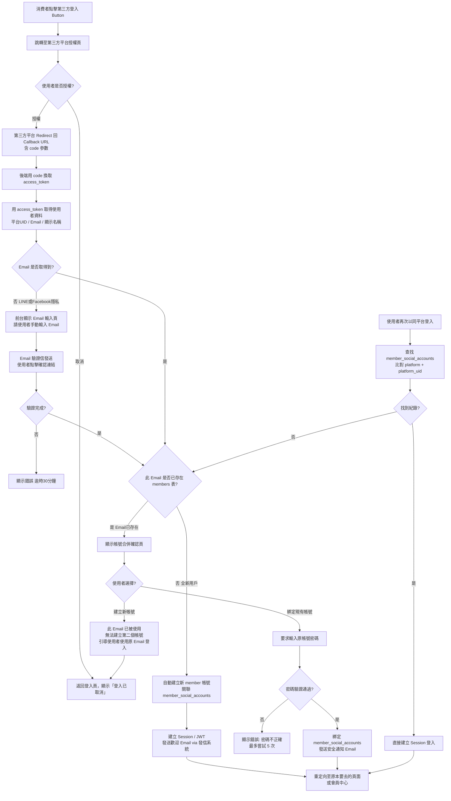
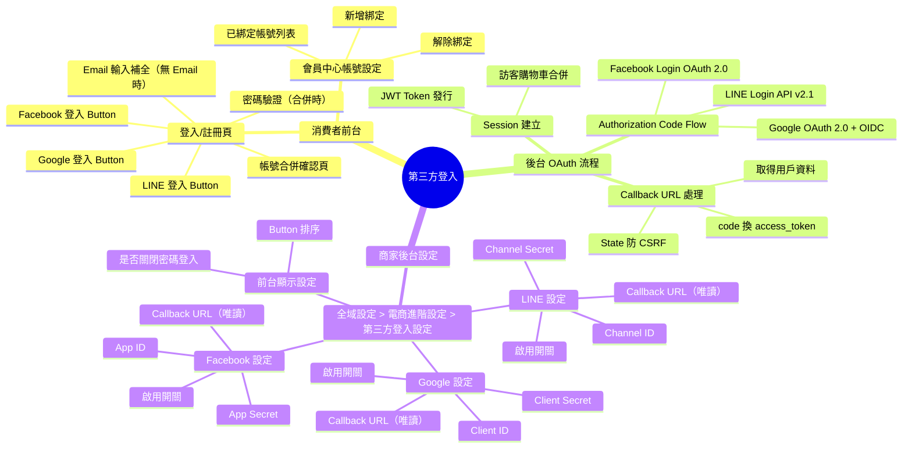
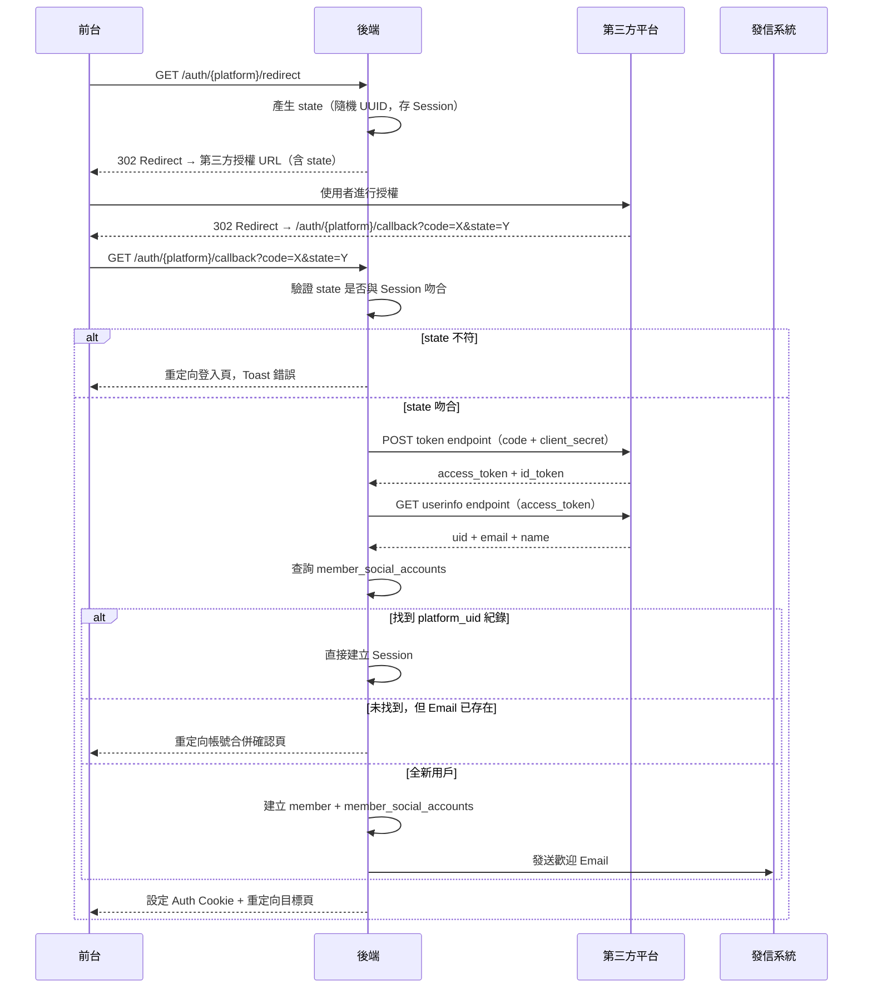
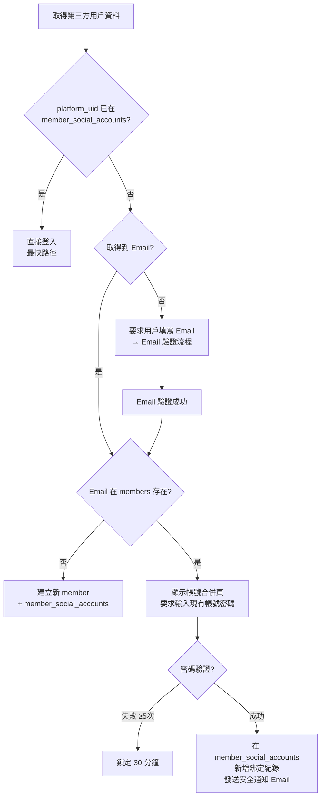

## 版本更新紀錄

| 版本 | 日期 | 修改內容 | 修改人 |
|------|------|----------|--------|
| v1.1 | 2026/05/27 | 3-10：§8.4 LINE LIFF 支援確認納入 v1.0，補完前台偵測邏輯（`liff.isInClient()` / User-Agent 判斷）、LIFF SDK 登入流程、後台 LIFF App ID 欄位說明；3-11：新增 §6.6 Social-only 模式既有密碼會員遷移流程（切換前檢查、阻擋說明、批次綁定邀請信、寬限期設定 1–90 天、自動啟用與逾期處理） | Una |
| v1.2 | 2026/05/28 | §8.5 資料庫補充規格：移除 SQL 語法，改以業務語言欄位需求表（Markdown 表格）呈現 | Una |
| v1.0 | 2026/04/28 | 初稿建立 | 廖紫茵（Claude 依授權產出）|

# Evomni - 第三方登入（LINE / Google / Facebook）產品需求文件 (PRD) v1.1

## 1. 文件資訊

| 屬性 | 內容 |
| --- | --- |
| 版本 | v1.1 |
| 日期 | 2026/05/27 |
| 需求來源 | Evomni 新電商系統 Master PRD v1.2（§3.2 系統第三方整合 P1 待補）|
| 文件狀態 | v1.1 — 補完 LINE LIFF v1.0 支援規格（3-10）；新增 Social-only 模式密碼會員遷移流程（3-11） |
| 作者 | Una |
| 開發時程 | 階段一 5–8月（電商啟航方案）/ 階段二 9–12月（進階電商包）|

---

## 2. 目標與功能總覽

### 2.1 核心願景與相依性

**核心問題：** 電商結帳流程中，「需要先註冊帳號」是最大的放棄率來源之一。台灣消費者最常用的社群帳號是 LINE（市佔率最高）、Google、Facebook，若提供一鍵第三方登入，可大幅降低帳號建立摩擦、提升轉換率。

**解決方案：** 在消費者登入/註冊頁新增 LINE / Google / Facebook 登入按鈕，透過標準 OAuth 2.0 / OIDC 流程取得使用者身份，並與 Evomni 電商會員系統整合：新用戶自動建立會員帳號；已有帳號的用戶可綁定現有帳號。後台提供每個商家獨立的 App 憑證設定頁。

**Evomni 價值對應：** 三個社群平台登入均為兩方案標配，直接影響消費者購物流程的第一步，也是吸引新客加入會員的關鍵觸點。

**系統相依性：**
- `會員認證模組（Evomni 主程式）`：商家登入沿用；本文件僅涉及**消費者（End-User）**的第三方登入
- `Part 6 會員管理`：第三方登入成功後建立或更新 `members` 表；社群帳號綁定資料存於 `member_social_accounts` 表
- `發信系統 發信模組`：新帳號建立時發送歡迎 Email；帳號綁定/解綁時發送安全通知 Email
- `Part 3 訂單管理`：登入後的 Session 供結帳流程使用；訪客購物車在登入後合併

---

### 2.2 功能總覽表

> 第三方登入提供 LINE、Google、Facebook 三種社群帳號快速進入電商系統的管道，並包含後台商家的憑證設定與啟停控制。

| 主功能模組 | 子功能項目 | 功能目的 | 功能詳細描述 | 影響之使用者 |
| --- | --- | --- | --- | --- |
| 消費者登入流程 | LINE 快速登入 | 使用 LINE 帳號一鍵登入/註冊 | 前台登入頁顯示「以 LINE 登入」Button；點擊後跳轉 LINE 授權頁；授權完成後取得 LINE User ID + Email + 顯示名稱；自動建立或綁定會員帳號；LINE Login API v2.1 | 消費者 |
| 消費者登入流程 | Google 快速登入 | 使用 Google 帳號一鍵登入/註冊 | 前台登入頁顯示「以 Google 登入」Button；使用 Google Identity Services（GIS）或 OAuth 2.0 重定向流程；取得 Google Account ID + Email + 顯示名稱 | 消費者 |
| 消費者登入流程 | Facebook 快速登入 | 使用 Facebook 帳號一鍵登入/註冊 | 前台登入頁顯示「以 Facebook 登入」Button；使用 Facebook Login SDK（OAuth 2.0）；取得 Facebook UID + Email + 顯示名稱 | 消費者 |
| 消費者登入流程 | 新帳號自動建立 | 第一次第三方登入時自動建立會員帳號 | 若第三方平台提供的 Email 在系統中不存在，自動建立新會員帳號（名稱=社群顯示名稱、Email=社群 Email、密碼=無）；若社群平台未提供 Email（Facebook 隱私設定），引導使用者手動輸入 Email | 消費者 |
| 消費者登入流程 | 現有帳號綁定 | 社群帳號與已有 Email 帳號合併 | 若第三方 Email 已存在於系統，顯示「此 Email 已有帳號，是否綁定此 {平台} 帳號？」確認後需輸入原帳號密碼驗證身份，才允許綁定；綁定後兩種方式均可登入 | 消費者 |
| 帳號管理 | 社群帳號綁定管理 | 消費者自行管理已綁定的社群帳號 | 會員中心「帳號設定」頁顯示已綁定的社群帳號列表（LINE / Google / Facebook）；可新增綁定（點擊後走 OAuth 流程）；可解除綁定（需確認，且至少保留一種登入方式）| 消費者 |
| 後台設定 | 第三方登入憑證設定 | 商家在後台設定各平台的 OAuth App 憑證 | 全域設定 > 電商進階設定 > 第三方登入設定頁；各平台獨立設定區塊；設定 Client ID / Client Secret / Callback URL（唯讀自動產生）；Toggle 啟用/停用各平台；停用後前台隱藏對應 Button | 商家管理員 |
| 後台設定 | 登入方式顯示設定 | 控制前台登入頁的顯示選項 | 後台可設定：是否僅允許第三方登入（關閉 Email/密碼登入）；各平台 Button 的顯示順序；Button 樣式（品牌色按鈕 or 統一白底按鈕）| 商家管理員 |

---

## 3. 全局功能流程



**流程說明：**

第三方登入的核心邏輯是「以平台 UID 為主鍵，以 Email 為橋接」。第一次登入用 Email 判斷是否為現有用戶；後續登入直接用平台 UID（`member_social_accounts.platform_uid`）快速匹配，不依賴 Email（因為使用者可能更改 Email）。

帳號合併時採「防禦性設計」：必須輸入原帳號密碼驗證身份，防止有人利用相同 Email 的第三方帳號劫持他人帳號。

---

## 4. 功能結構圖



---

## 5. 使用者故事

**作為消費者，** 我想要在結帳時直接點擊「以 LINE 登入」跳過填寫帳號密碼的步驟，以便於快速完成購物，不因為「需要先註冊」而放棄購買。

**作為消費者，** 我想要在已有 Email 帳號的情況下，將我的 Google 帳號綁定到現有帳號，以便於下次可以用 Google 登入，而不用記得密碼。

**作為消費者，** 我想要在「帳號設定」頁面看到目前有哪些社群帳號已綁定，並可以解除不再使用的綁定，以便於管理我的帳號安全。

**作為商家管理員，** 我想要在後台設定 LINE Login 的 Channel ID 和 Channel Secret，以便於讓我的消費者可以使用 LINE 快速登入，提升結帳轉換率。

**作為商家管理員，** 我想要停用 Facebook 登入（因為我的客群不常用 Facebook），以便於讓登入頁面更簡潔，不顯示多餘的選項。

---

## 6. UI/UX 與詳細功能需求

### 6.1 前台登入/註冊頁的第三方登入區塊

#### A. 核心使用者流程

消費者到達登入/註冊頁（可能來自：直接進入、結帳時被引導、點擊「會員登入」） → 看到 Email 登入表單（上方）+ 分隔線「或」+ 第三方登入按鈕列（下方） → 點擊第三方 Button → OAuth 流程 → 回到頁面。

#### B. 介面佈局與元件拆解（Figma Ready）

**登入頁整體佈局（含第三方登入）：**

```
┌────────────────────────────────────────┐
│  歡迎回來                                │
│                                        │
│  [Email 輸入框]                          │
│  [密碼輸入框]          [忘記密碼?]        │
│  [登入 Button — 主要操作]                │
│                                        │
│  還沒有帳號？[立即註冊]                   │
│                                        │
│  ─────────── 或 ──────────────          │
│                                        │
│  [🟢 以 LINE 登入]                       │
│  [🔵 以 Google 登入]                     │
│  [🔷 以 Facebook 登入]                   │
│                                        │
└────────────────────────────────────────┘
```

**第三方登入 Button 元件規格：**

| 平台 | Button 樣式 | Icon | 文字 |
| --- | --- | --- | --- |
| LINE | 背景 `#06C755`，文字白色，`!rounded-none` | LINE 官方 Logo SVG | 以 LINE 登入 |
| Google | 背景白色，邊框 `#DCDFE6`，文字 `#303133`，`!rounded-none` | Google 官方 G Logo SVG | 以 Google 登入 |
| Facebook | 背景 `#1877F2`，文字白色，`!rounded-none` | Facebook 官方 f Logo SVG | 以 Facebook 登入 |

- Button 寬度：100%（撐滿容器）
- Button 高度：44px（比一般 Element Plus 預設高 4px，符合手機觸控靶）
- 各 Button 間距：8px
- 停用的平台（後台關閉）：Button 不渲染（不顯示），非 Disabled 態
- 所有平台均停用時：「或」分隔線及以下區塊整個隱藏

**Button Loading 狀態：**
- 點擊後立即進入 Loading 態（`<el-button :loading="true">`）
- 文字改為「正在連接 {平台名稱}…」
- 防止重複點擊

**「或」分隔線元件：**
```html
<div class="flex items-center gap-3 my-4">
  <div class="flex-1 border-t border-gray-200"></div>
  <span class="text-sm text-gray-400">或</span>
  <div class="flex-1 border-t border-gray-200"></div>
</div>
```

#### C. 互動設計、狀態與系統反饋

- OAuth 授權完成後的重定向：若消費者是在結帳流程中被要求登入，登入完成後應重定向回結帳頁（`redirect_to` Query Parameter 保存目標 URL），不可跳到會員中心
- `redirect_to` 允許的網域必須在白名單內（僅允許同網域，防 Open Redirect 攻擊）
- 登入成功後合併訪客購物車：詳見 Part 4 行銷活動 PRD §8.5.2（購物車合併邏輯）

#### D. 防呆機制與錯誤預防

- 第三方平台授權回來的 Callback URL 帶有 `state` 參數（防 CSRF），後端必須驗證 `state` 是否與 Session 中的值吻合，不符者拒絕並顯示：「登入流程出現異常，請重試」
- 授權被拒（使用者點「取消授權」）：Toast 提示「登入已取消，請重試或使用 Email 登入」
- 第三方平台服務不可用時：Toast 提示「{平台名稱} 登入目前暫時無法使用，請使用 Email 登入或稍後再試」

---

### 6.2 Email 補全頁（無 Email 情境）

#### A. 核心使用者流程

當 Facebook 或 LINE 授權回來的使用者資料中未包含 Email → 系統顯示中間頁要求使用者輸入 Email → 發送驗證信 → 使用者點擊信中連結確認 → 完成帳號建立。

#### B. 介面佈局與元件拆解（Figma Ready）

**Email 補全頁面：**

```
┌──────────────────────────────────────────┐
│  [平台 Logo]  已連接 {平台名稱}             │
│                                          │
│  您好，{顯示名稱}！                         │
│  為了完成帳號建立，請提供您的 Email 地址。   │
│                                          │
│  [Email 輸入框]                            │
│  Placeholder: 請輸入您的 Email 地址          │
│                                          │
│  [發送驗證信 Button]                        │
│                                          │
│  ─ 您的 Email 僅用於訂單通知，不會外洩 ─     │
└──────────────────────────────────────────┘
```

| 元件 | 規格 |
| --- | --- |
| Email 輸入框 | `<el-input type="email">` Required；即時格式驗證（regex `/.+@.+\..+/`）；格式錯誤顯示「請輸入有效的電子信箱格式」|
| 發送驗證信 Button | 主要操作 Button；Click 後進入 Loading + 文字改為「發送中…」；發送成功後切換為驗證信說明頁 |
| 驗證信等待頁 | 顯示「驗證信已發送至 {email}」+ 倒數計時 60 秒「重新發送（{N} 秒後可重送）」Button；收不到可點「重新發送」|
| 驗證連結逾時 | 驗證連結有效期 30 分鐘；逾時後顯示「驗證連結已過期，請重新發起登入」+ Button 「重新登入」|

#### C. 互動設計、狀態與系統反饋

- 此頁面需保持 OAuth 臨時 Token（存於 Session 中），使用者完成 Email 驗證後才繼續進行帳號建立流程；若 Session 過期（超過 10 分鐘未完成），顯示「登入流程已逾時，請重新登入」

#### D. 防呆機制與錯誤預防

- 輸入的 Email 若已存在於系統（`members` 表），不直接建立新帳號，改進入**帳號合併確認流程**（見 §6.3）
- 同一 IP 在 1 小時內嘗試 5 個不同 Email 地址，進行速率限制（Rate Limit），顯示「請求次數過多，請稍後再試」

---

### 6.3 帳號合併確認頁

#### A. 核心使用者流程

第三方登入回來的 Email 已存在於系統 → 顯示帳號合併確認頁 → 使用者確認綁定 → 輸入原帳號密碼驗證 → 綁定完成。

#### B. 介面佈局與元件拆解（Figma Ready）

**帳號合併確認頁：**

```
┌──────────────────────────────────────────────────────┐
│  🔗 找到現有帳號                                       │
│                                                      │
│  您的 {平台名稱} 帳號的 Email（{email}）               │
│  在我們系統中已有一個帳號。                             │
│                                                      │
│  您想要將此 {平台名稱} 帳號連接到現有帳號嗎？            │
│  連結後，您可以用 {平台名稱} 或 Email/密碼兩種方式登入。  │
│                                                      │
│  [請輸入現有帳號的密碼]                                 │
│  Placeholder: 請輸入您帳號的密碼                        │
│                                                      │
│  [確認綁定 Button]      [取消，不綁定]                  │
│                                                      │
│  ─── 不記得密碼？[發送密碼重設信] ───                    │
└──────────────────────────────────────────────────────┘
```

| 元件 | 規格 |
| --- | --- |
| 帳號顯示 | 顯示部分遮蔽的 Email（如 `te***@gmail.com`）保護帳號隱私 |
| 密碼輸入框 | `<el-input type="password" show-password>` Required；5 次密碼錯誤後鎖定 30 分鐘 |
| 確認綁定 Button | 主要操作；Loading 態文字：「驗證中…」|
| 取消按鈕 | 次要按鈕；點擊後返回登入頁；不建立任何帳號 |
| 發送密碼重設信 | 文字連結；點擊後透過 發信系統 發送密碼重設信至對應 Email；Toast：「密碼重設信已發送，請查收 Email 後回來繼續操作」|

#### C. 互動設計、狀態與系統反饋

- 綁定成功後：Toast「{平台名稱} 帳號已成功綁定！」+ 透過 發信系統 發送安全通知 Email（主旨：「您的帳號已新增 {平台名稱} 登入方式」，內含撤銷連結，點擊可解綁）
- 密碼驗證失敗：「密碼不正確，您還有 {N} 次嘗試機會」（紅色提示，不消失）
- 5 次失敗後鎖定：「帳號已暫時鎖定 30 分鐘，請稍後再試或使用密碼重設功能」

#### D. 防呆機制與錯誤預防

- 此頁面的 OAuth 臨時狀態存在 Server-side Session，不暴露在 URL 參數中，防止惡意構造請求
- 帳號鎖定狀態下「確認綁定」Button 設為 Disabled

---

### 6.4 會員中心帳號設定（消費者端）

#### A. 核心使用者流程

消費者登入後進入「會員中心 > 帳號設定」→ 可看到「社群帳號連結」卡片 → 顯示目前已/未綁定的各平台狀態 → 點擊「連結」走 OAuth 流程新增綁定 → 點擊「解除連結」解綁（需確認）。

#### B. 介面佈局與元件拆解（Figma Ready）

**社群帳號連結卡片：**

```
┌─────────────────────────────────────────────────────┐
│  社群帳號連結                                         │
│                                                     │
│  🟢 LINE          已連結（LINE 顯示名稱）  [解除連結]  │
│  🔵 Google        尚未連結               [連結帳號]   │
│  🔷 Facebook      已連結（Facebook 名稱） [解除連結]  │
└─────────────────────────────────────────────────────┘
```

| 元件 | 規格 |
| --- | --- |
| 各平台列 | 平台 Logo Icon（24×24px）+ 平台名稱 + 連結狀態（已連結 / 尚未連結）+ 操作 Button |
| 已連結顯示 | 顯示該平台帳號的顯示名稱（如：LINE 的顯示名稱 or Google 的姓名）；文字顏色 `#606266` |
| 「連結帳號」Button | 次要操作 Button（`plain` 樣式）；點擊後走 OAuth 授權流程；若後台停用此平台，Button 隱藏 |
| 「解除連結」Button | `text` type Button，危險色 `#F56C6C`；點擊後進確認對話框 |

**解除連結確認對話框：**

```
確定要解除 {平台名稱} 帳號的連結嗎？

解除後，您將無法再使用此 {平台名稱} 帳號登入。
請確認您有其他登入方式（Email/密碼 或 其他社群帳號）可以繼續使用帳號。

[取消]  [確定解除連結]
```

#### C. 互動設計、狀態與系統反饋

- 解除連結成功後：Toast「{平台名稱} 帳號連結已解除」+ 透過 發信系統 發送安全通知 Email（「您的帳號已移除 {平台名稱} 登入方式」）
- 新增連結成功後：Toast「{平台名稱} 帳號已成功連結！」

#### D. 防呆機制與錯誤預防

- **最後一種登入方式保護：** 若消費者目前只剩一種登入方式（如只有 LINE 連結，沒有設定密碼），「解除連結」Button 設為 Disabled + Tooltip：「無法解除連結，因為您目前沒有設定帳號密碼。請先設定密碼後再解除連結。」
- 無密碼會員（純社群登入建立的帳號）在帳號設定頁額外顯示「設定帳號密碼」區塊，引導建立密碼備用

---

### 6.5 後台第三方登入憑證設定頁

#### A. 核心使用者流程

商家管理員進入「全域設定 > 電商進階設定 > 第三方登入設定」→ 看到各平台設定區塊 → 填入 App 憑證 → 開啟啟用 Toggle → 儲存。

#### B. 介面佈局與元件拆解（Figma Ready）

**頁面佈局：**
- 麵包屑：全域設定 > 電商進階設定 > 第三方登入設定
- 頁面說明文字：「設定第三方登入後，消費者可在您的商店使用社群帳號快速登入。各平台的 App 憑證需在對應的開發者平台申請。」
- 各平台獨立設定卡片（`<el-card>`）

**LINE Login 設定卡片：**

```
┌──────────────────────────────────────────────────────────────────┐
│  🟢 LINE Login                                      ● 已啟用      │
│                                                                  │
│  前往 LINE 開發者後台申請 LINE Login Channel 並取得以下憑證：       │
│  [前往 LINE Developers Console ↗]                                 │
│                                                                  │
│  Channel ID       [________________] ℹ LINE Login Channel ID     │
│  Channel Secret   [________________] ℹ 點擊顯示                   │
│  Callback URL     [https://xxx.com/auth/line/callback] [複製]     │
│  （唯讀，請在 LINE Developers Console 填入此 URL）                  │
│  LINE LIFF App ID [________________] ℹ 在 LINE App 內開啟時使用   │
│  （選填；填入後啟用 LIFF 登入，消費者在 LINE App 內無需跳出即可登入）│
│                                                                  │
│  [測試連線]  [儲存]                                                │
└──────────────────────────────────────────────────────────────────┘
```

**Google OAuth 2.0 設定卡片：**

```
┌──────────────────────────────────────────────────────────────────┐
│  🔵 Google Login                                    ○ 未啟用      │
│                                                                  │
│  前往 Google Cloud Console 建立 OAuth 2.0 用戶端 ID：              │
│  [前往 Google Cloud Console ↗]                                    │
│                                                                  │
│  用戶端 ID     [________________] ℹ OAuth 2.0 Client ID          │
│  用戶端密碼   [________________] ℹ 點擊顯示                        │
│  授權重新導向 URI [https://xxx.com/auth/google/callback] [複製]    │
│  （唯讀，請在 Google Cloud Console 填入此 URI）                     │
│                                                                  │
│  [測試連線]  [儲存]                                                │
└──────────────────────────────────────────────────────────────────┘
```

**Facebook Login 設定卡片（同樣結構）：**
- 欄位：應用程式 ID（App ID）、應用程式密鑰（App Secret）、有效的 OAuth 重定向 URI（唯讀）

**各平台通用元件規格：**

| 元件 | 規格 |
| --- | --- |
| 啟用 Toggle | `<el-switch>`；標籤：「啟用 / 停用」；停用時卡片主體進入半透明（`opacity: 0.6`）但仍可填寫 |
| Client ID / App ID | `<el-input>` Placeholder：「請輸入 {欄位名稱}」；輸入後自動 trim 空白字元 |
| Client Secret / App Secret | `<el-input type="password" show-password>`；顯示時解密呈現；後端 AES-256-GCM 加密儲存（與串接設定 PRD 一致）|
| Callback URL | `<el-input>` `disabled`（唯讀）；右側「複製」Button（點擊後 Clipboard API 複製，Toast「已複製」）|
| 外部連結 | `<el-link target="_blank">` 帶 ↗ icon |
| 測試連線 Button | 次要操作 Button；點擊後模擬走一次 OAuth 授權流程的 Token 交換步驟（不含使用者授權）；成功：Toast 綠色「連線測試成功，憑證有效」；失敗：Toast 紅色「連線失敗：{錯誤訊息}，請檢查憑證是否正確」|
| 儲存 Button | 主要操作 Button；成功：Toast「設定已儲存」；憑證 AES 加密後寫入 `integration_settings` 表 |

**前台顯示設定區塊：**

```
┌──────────────────────────────────────────────────────┐
│  前台登入頁設定                                        │
│                                                      │
│  Button 顯示順序  [拖曳排序：LINE / Google / Facebook]  │
│                                                      │
│  ○ 同時顯示 Email 登入和社群帳號登入（預設）            │
│  ○ 僅顯示社群帳號登入（關閉 Email/密碼登入）            │
│                                                      │
│  [儲存]                                              │
└──────────────────────────────────────────────────────┘
```

> ⚠️ 「僅顯示社群帳號登入」啟用時，系統顯示警告：「關閉 Email 登入後，若消費者沒有 LINE/Google/Facebook 帳號將無法登入。請確認此設定符合您的客群需求。」

**切換至 Social-only 模式前的密碼會員遷移檢查（3-11 決議）：**

商家嘗試切換至「僅顯示社群帳號登入」模式時，系統在儲存前執行以下檢查：

1. 後端掃描 `members` 表，計算「純密碼登入會員數」（無任何 `member_social_accounts` 紀錄、且帳號 `status = active` 的會員）
2. 若計算結果 > 0，**阻擋切換**，顯示以下說明文字（`<el-alert type="warning">`）：

```
您有 {N} 位會員尚未綁定社群帳號，啟用此模式後他們將無法登入。
請先引導這些會員完成綁定，或設定寬限期後自動啟用。
```

3. 提供兩個選項按鈕：
   - **[寄送綁定邀請信]**（`type="primary"`）：觸發批次 Email，發送至所有純密碼會員，說明須在指定截止日前綁定社群帳號，否則屆時帳號將無法登入
   - **[設定寬限期並預約啟用]**（`type="default"`）：展開寬限期設定（見下）

**寬限期設定規格：**

| 欄位 | 元件 | 預設值 | 驗證規則 |
|------|------|--------|---------|
| 寬限天數 | `<el-input-number>` min=1 max=90 | 30 天 | 必填；範圍 1–90 天 |
| 預計啟用日期 | 唯讀顯示（今日 + 寬限天數自動計算）| — | — |

- 商家設定寬限期並確認後，Social-only 模式**不立即啟用**，在預計啟用日期自動切換
- 寬限期間：Email/密碼登入維持可用；系統每日提醒排程可發提示信（可選）
- 到達啟用日後：系統自動將 `login_mode` 切換為 `social_only`；尚未綁定的純密碼帳號在下次登入時顯示：「此商店目前僅支援社群帳號登入，請使用 LINE / Google / Facebook 登入，或聯繫客服協助處理。」

**批次綁定邀請信規格（透過發信系統）：**

| 項目 | 內容 |
|------|------|
| 主旨 | 「{shop_name} 提醒您：請在 {deadline} 前綁定社群帳號」 |
| 信件說明 | 說明商家即將開放社群帳號登入模式、截止日後帳號需用社群帳號登入；提供綁定入口連結（導向會員中心「帳號安全 → 第三方帳號綁定」頁）|
| 收件對象 | 所有純密碼登入會員（無 `member_social_accounts` 紀錄者）|
| 寄送時機 | 商家手動觸發，或排程在寬限期到期前 7 天自動補寄一封 |

4. 若純密碼會員數 = 0：直接顯示原有的啟用警告（「關閉 Email 登入後…」），無需遷移流程，商家可直接確認儲存

#### C. 互動設計、狀態與系統反饋

- 憑證格式驗證：Channel ID 應為純數字（LINE）；Client ID 應包含 `.apps.googleusercontent.com`（Google，選擇性驗證）；儲存時前端不做強制格式驗證，以後端「測試連線」結果為準
- 任一平台啟用且未填憑證時儲存：Toast 警告「{平台名稱} 已啟用但憑證未填寫，前台將無法使用此登入方式，請確認後儲存」

#### D. 防呆機制與錯誤預防

- 啟用平台但 Callback URL 尚未在對應開發者平台設定時，系統無法代為設定，後台以 Info 提示：「請確認您已在 {平台名稱} 開發者後台將此 Callback URL 加入允許清單，否則登入流程會失敗」
- 儲存後若下方有後台同仁仍登入中，不影響其 Session

---

## 7. 細部邏輯流程圖

### 7.1 Authorization Code Flow（後端處理）



### 7.2 安全性決策樹



---

## 8. 非功能性需求

### 8.1 效能需求

| 指標 | 目標 |
| --- | --- |
| OAuth Redirect 到第三方平台（後端處理）| ≤ 200ms |
| Callback 處理（code 換 token + 查詢 DB）| ≤ 1 秒 |
| 「測試連線」API 回應 | ≤ 3 秒 |

### 8.2 安全性需求

- **CSRF 防護：** OAuth `state` 參數為隨機 UUID，存於 Server-side Session（不存 Cookie）；Callback 時必須驗證，不符則拒絕
- **Open Redirect 防護：** `redirect_to` 參數只允許同網域 URL；後端正規化 URL 並驗證 Host
- **密碼暴力破解防護：** 帳號合併頁密碼驗證 5 次失敗鎖定 30 分鐘；鎖定記錄存 Redis（`account_lock:{member_id}`）
- **API 憑證加密：** Client Secret / App Secret / Channel Secret 使用 AES-256-GCM 加密後儲存於 `integration_settings` 表（與串接設定 PRD 加密規格一致）
- **HTTPS Only：** 所有 OAuth Callback URL 必須為 HTTPS；本地開發環境例外（`localhost`）
- **Token 安全：** access_token 不存入 DB；僅在 Callback 處理過程中使用，使用後即捨棄

### 8.3 資料一致性

- 帳號建立與 `member_social_accounts` 寫入在同一 Transaction
- 解除綁定時，若該 Session 是透過此社群帳號建立的，需在解綁後強制要求重新登入（清除現有 Token）

### 8.4 瀏覽器/裝置支援

- OAuth 流程使用標準瀏覽器重定向（`302 Redirect`），不使用 Popup 視窗（Safari 在 Popup 模式下有 ITP 限制）

**LINE LIFF 支援（3-10 決議，v1.0 納入）：**

LINE 登入在不同瀏覽器環境下採不同實作路徑：

| 環境 | 偵測方法 | 登入方式 |
|------|---------|---------|
| LINE App 內建瀏覽器（LIFF 環境）| 偵測 `window.liff.isInClient()` 或 User-Agent 含 `Line/` | 使用 LINE LIFF SDK 完成登入（`liff.login()`），不跳出 LINE App；避免 Safari ITP 問題 |
| 外部瀏覽器（Chrome、Safari 等）| 非 LIFF 環境 | 標準 OAuth 2.0 重定向流程（`302 Redirect`）|

實作說明：
- 前台頁面載入時初始化 `liff.init({ liffId: 'xxx' })`
- 若在 LIFF 環境且使用者未登入，呼叫 `liff.login()` → 取得 `accessToken` → 後端驗證 → 建立 Session
- 若不在 LIFF 環境，走現有標準 OAuth redirect 流程
- LIFF App ID 由商家在後台「LINE Login 設定」頁填入（新增欄位：「LINE LIFF App ID」）
- **目的**：台灣消費者大量在 LINE App 內開啟購物連結，LIFF 允許在 LINE 內完成登入不需跳出，提升轉換率；同時解決 Safari ITP 在 LINE 內建瀏覽器的跨站 Cookie 限制

### 8.5 資料庫補充規格

#### member_social_accounts（社群帳號綁定）

| 欄位 | 業務說明 |
| --- | --- |
| id | 主鍵，自動遞增 |
| member_id | 對應會員，關聯 members |
| platform | 第三方平台：`line`、`google`、`facebook` |
| platform_uid | 第三方平台的使用者唯一識別碼；同平台同 UID 只能綁定一個帳號 |
| platform_name | 第三方平台的顯示名稱（選填） |
| platform_email | 第三方平台提供的 Email，可能與帳號 Email 不同（選填） |
| linked_at | 綁定時間 |
| last_login_at | 最後一次透過此平台登入的時間（選填） |
| created_at | 記錄建立時間 |

#### oauth_states（OAuth 臨時 State，可改用 Redis TTL 10 分鐘）

| 欄位 | 業務說明 |
| --- | --- |
| state | UUID，作為主鍵；防 CSRF 用的一次性隨機值 |
| platform | 對應平台：`line`、`google`、`facebook` |
| redirect_to | OAuth 完成後的回跳網址（選填） |
| created_at | 建立時間；後端驗證時需確認未超過有效期 |

#### member_security_logs（帳號安全事件記錄）

| 欄位 | 業務說明 |
| --- | --- |
| id | 主鍵，自動遞增 |
| member_id | 對應會員 |
| event_type | 事件類型：`social_linked`（綁定社群帳號）、`social_unlinked`（解除綁定）、`password_changed`（修改密碼）、`login_failed`（登入失敗）、`account_locked`（帳號鎖定） |
| detail | 事件補充資訊，JSON 格式，例如 `{"platform": "line", "ip": "1.2.3.4"}` |
| ip_address | 操作來源 IP（IPv4 或 IPv6） |
| created_at | 事件發生時間 |

---

## 與團隊溝通摘要

- 這次的規格是關於**第三方登入（LINE / Google / Facebook）**，解決消費者結帳時不想填帳號密碼的問題，台灣市場 LINE 最優先
- **工程師這邊需要注意**：OAuth 流程一定要用 Server-side `state` 防 CSRF，不能用 URL 傳；帳號合併時密碼驗證 5 次失敗要 Redis 鎖定 30 分鐘；access_token 不存 DB，用完即丟；LINE 在 LINE App 內建瀏覽器時要判斷是否要用 LIFF SDK
- **設計師這邊需要注意**：LINE Button 用官方綠色 `#06C755`，Google Button 要白底黑字（Google Brand Guidelines 規定），Facebook Button 用 `#1877F2`；Button 高度 44px 而不是標準 40px（考慮手機觸控）；OAuth 回來後若需要補 Email 或帳號合併，不能直接跳頁，要有中間引導頁保持脈絡
- **這個模組依賴**：Part 6 會員管理（`members` 表、`member_social_accounts` 表）；發信系統 發信（安全通知 Email）；Part 3 訂單管理（訪客購物車合併邏輯）
- **商家後台的設定頁**在「全域設定 > 電商進階設定 > 第三方登入設定」，每個平台各自有 Callback URL 唯讀欄位，要讓商家很容易複製去貼到開發者後台
- **v1.1 新增（3-10）**：LINE LIFF 支援**已確認納入 v1.0**。台灣消費者大量透過 LINE 分享連結開啟商品頁，LIFF 讓消費者在 LINE App 內即可完成登入不需跳出，同時解決 Safari ITP 的跨站 Cookie 限制。實作重點：前台頁面載入時初始化 `liff.init()`，偵測到 LIFF 環境時呼叫 `liff.login()` 取得 accessToken → 後端驗證 → 建立 Session；商家須在後台「LINE Login 設定」填入 LIFF App ID。
- **v1.1 新增（3-11）**：Social-only 模式啟用前必須執行密碼會員遷移檢查（§6.5 前台顯示設定）。有純密碼會員時阻擋切換，商家需完成綁定邀請信發送或設定寬限期（1–90 天）後才能自動啟用，確保現有會員不會在不知情的情況下失去登入能力。
