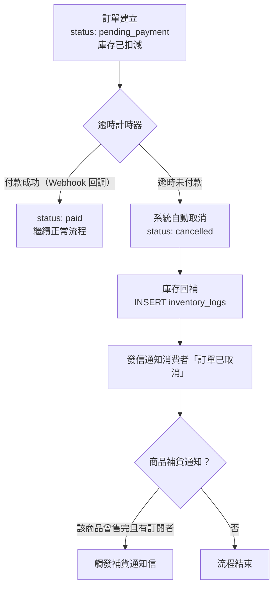

## 版本更新紀錄

| 版本 | 日期 | 修改內容 | 修改人 |
|------|------|----------|--------|
| v1.7 | 2026/06/03 | 依議題 2026-05-22-order-status-closed-tooltip-text §2.1 §2.2 §2.4 §7.1：訂單終態重設計——原 closed（全額退款）拆分為 refunded（全額退款完成）與 closed（商家強制終結）；cancelled 明確限定為出貨前取消；新增 order_refunds.triggered_by 值 pre_shipment_cancel | Una |
| v1.6 | 2026/06/01 | 依議題 2026-05-20-portal-repurchase-stock-check-timing §5.1.2：「再次購買」庫存策略改採即時扣 hold，與一般商品頁共用同一套 hold 邏輯（取代原決議 19-2 不扣 hold 方案） | Una |
| v1.5 | 2026/05/29 | 依議題 2026-05-20-product-pending-order-definition §2.2：移除「商品刪除阻擋」使用場景；改採 Snapshot 模式（order_items 快照），商品可隨時軟刪；更新文件說明 | Una |
| v1.4 | 2026/05/28 | §5.4.2 移除 SQL 偽代碼；改以步驟清單說明訂單建立原子性流程（鎖庫存、校驗、扣減、建單、提交） | Una |
| v1.3 | 2026/05/28 | 19-1：§3 範圍與邊界補入「不開放後台清空購物車」說明（訂單建立後系統自動清空）；19-2：§5.1.2 補齊「再次購買」加入購物車的庫存檢查策略（不即時扣hold，結帳時統一校驗）| Una |
| v1.2 | 2026/05/28 | 11-1：0 元訂單跳過金流直接標示付款完成（新增於 §5.6）；11-2：訪客 Email 與既有會員相符時的非阻擋式提示規格（新增 §5.7.2）；11-3：付款逾時設定與購物車挽回觸發設定正式拆分為兩個獨立參數（§5.5.1 更新），連動更新全域設定 PRD | Una |
| v1.1 | 2026/05/22 | CC-1～CC-5 五項決策全數定案並寫入規格：CC-1 訪客結帳後完整流程（確認信內容 / 後續通知 / 查詢驗證方式）；CC-2 購物車過期時間維持現行設定；CC-3 一頁式商店共用主站結帳流程（新增 §5.8）；CC-4 0 元商品結帳強制登入（新增於 §5.1.2）；CC-5 一頁式商店優惠套用規則（優惠碼 + 點數 + 集點 ✅，自動促銷 ❌，含商業情境說明）；§8.1 待確認事項全數關閉 | Una |
| v1.0 | 2026/05/22 | 初稿建立：購物車機制、結帳步驟流程、庫存鎖定、逾時機制、訂單建立觸發；含 A3「進行中訂單」定義（§2.2）、訂單狀態完整定義（§2.3）；整合原散落於 Part3 / Part4 / 會員前台 PRD 的結帳規格為單一事實來源 | Una |

---

# Evomni — 購物車與結帳流程 產品需求文件 (PRD)

## 1. 文件資訊

| 屬性 | 內容 |
| --- | --- |
| 版本 | v1.7 |
| 日期 | 2026/06/03 |
| 作者 | Una |
| 文件狀態 | v1.7 — §2.1 訂單終態重設計：refunded（全額退款完成）/ closed（商家強制終結），cancelled 明確限定為出貨前取消 |
| 需求來源 | open_issues.yaml A2（購物車與結帳流程無獨立 PRD）、A3（進行中訂單定義）、Part3 訂單管理 PRD §3.1、Part4 行銷活動 PRD、會員前台個人中心 PRD |
| 對應方案 | 電商啟航方案 ✅ / 進階電商包 ✅ |
| 開發時程 | 階段一 5–8月（電商啟航方案）|
| 關聯文件 | [Part3 訂單管理 PRD](Evomni_Part3_訂單管理_PRD.md)、[Part4 行銷活動 PRD](Evomni_Part4_行銷活動_PRD.md)、[優惠計算引擎技術規格 PRD](Evomni_優惠計算引擎_技術規格_PRD.md)、[金物流串接規格 PRD](../inputs/prd/02_獨立功能/Evomni_金物流串接規格_PRD.md)、[全域設定：電商設定 PRD](Evomni_全域設定_電商設定_PRD.md) |

> **📌 本文件的定位：**
> 本文件為「結帳流程」的**單一事實來源（SSOT）**，定義購物車機制、結帳步驟邏輯、庫存鎖定時機、逾時取消機制，以及訂單建立觸發條件。
>
> 本文件「不」定義以下內容（各有所屬 PRD）：
> - 優惠計算規則與計算順序 → 見[優惠計算引擎技術規格 PRD](Evomni_優惠計算引擎_技術規格_PRD.md)
> - 運費費率表、物流商設定 → 見[金物流串接規格 PRD](../inputs/prd/02_獨立功能/Evomni_金物流串接規格_PRD.md)
> - 訂單建立後的狀態生命週期、退換貨 → 見 [Part3 訂單管理 PRD](Evomni_Part3_訂單管理_PRD.md)
> - 電子發票 API 串接細節 → 見 [Part3 訂單管理 PRD §6.6](Evomni_Part3_訂單管理_PRD.md)

---

## 2. 訂單狀態定義（跨模組參考基準）

> 本節為 **A3 議題定案**，提供跨模組共用的訂單狀態定義。所有涉及訂單狀態判斷的邏輯（訂單列表計數、報表邊界）均以本節為依據。

### 2.1 訂單主狀態（完整定義）

訂單主狀態採**線性生命週期**設計。退款記錄、部分退款為獨立附加事件，不影響主狀態（見 §2.4）。

| 狀態值 | 中文說明 | 是否為最終態 |
|--------|----------|:---:|
| `pending_payment` | 待付款（付款期限內） | ❌ |
| `paid` | 已付款 | ❌ |
| `processing` | 商家確認 / 備貨中 | ❌ |
| `shipped` | 已出貨 | ❌ |
| `delivering` | 配送中 | ❌ |
| `delivered` | 已到貨（待消費者確認） | ❌ |
| `completed` | 交易完成（消費者確認 or 7 天後自動） | ✅ |
| `cancelled` | 已取消（出貨前取消，含付款前後及逾期未付款自動取消） | ✅ |
| `refunded` | 全額退款完成（出貨後走退換貨流程，全額退款完成後系統自動轉入） | ✅ |
| `closed` | 強制終結（商家人工關閉異常訂單，如買家失聯、地址錯誤、糾紛處理完畢） | ✅ |

**狀態轉移規則：**

```
pending_payment ──付款成功──→ paid
pending_payment ──逾時/取消──→ cancelled

paid ──商家確認──→ processing
paid ──取消申請──→ cancelled（觸發退款）

processing ──出貨──→ shipped
processing ──取消申請──→ cancelled（觸發退款）

shipped ──物流更新──→ delivering
delivering ──送達──→ delivered

delivered ──消費者確認 或 7天後自動──→ completed
completed ──全額退款完成──→ refunded

（任何進行中狀態申請退換貨且退款完成（全額），進入 refunded）
（商家可將任何狀態的訂單強制關閉，進入 closed）
```

> ⚠️ 已出貨（`shipped`）及之後的狀態不得直接取消；需先走退換貨申請流程，全額退款完成後才進入 `refunded`；如為異常訂單（買家失聯等），商家可人工強制關閉進入 `closed`。

### 2.2 「進行中訂單」定義（A3 定案）

**定義：「進行中訂單」= 尚未進入最終態的訂單**

| 判斷方式 | SQL 邏輯 |
|----------|----------|
| 進行中 | `status NOT IN ('completed', 'cancelled', 'refunded', 'closed')` |
| 最終態（非進行中）| `status IN ('completed', 'cancelled', 'refunded', 'closed')` |

**使用場景：**

| 場景 | 邏輯說明 |
|------|----------|
| **後台訂單列表「進行中」Tab 計數** | `SELECT COUNT(*) FROM orders WHERE status NOT IN ('completed', 'cancelled', 'refunded', 'closed')` |
| **業務報表** | 各報表依自身目的獨立定義計算邊界，不直接套用本定義（避免與 GMV 計算混淆） |

> ℹ️ **商品刪除不再使用「進行中訂單」判斷。** 改採 Snapshot 模式：訂單成立時即保留下單當下的完整商品資訊（名稱、規格、售價、圖片），商品可隨時軟刪除，歷史訂單資料不受影響。詳見 [Part2 商品中心 PRD §8.2](Evomni_Part2_商品中心_PRD.md)。

### 2.3 退換貨子流程狀態

退換貨有**獨立狀態機**，儲存於 `return_orders` 表，不寫入訂單主狀態。

→ 完整退換貨狀態機定義見 [Part3 訂單管理 PRD §7.1](Evomni_Part3_訂單管理_PRD.md)

### 2.4 退款記錄（部分退款）

部分退款以**事件記錄**方式處理，不影響訂單主狀態：

- 每筆退款在 `order_refunds` 表寫入一筆記錄（金額、品項、原因、時間）
- 訂單主狀態**不因部分退款改變**，繼續原本的生命週期
- 當 `SUM(order_refunds.amount) = orders.total` 時，系統自動將訂單狀態轉為 `refunded`

---

## 3. 範圍與邊界

**本 PRD 涵蓋：**
- 購物車機制（加入、移除、數量更新、過期）
- 庫存鎖定時機與釋放機制
- 結帳步驟流程（收件資訊 → 付款方式 → 發票 → 確認送出）
- 優惠套用時序（摘要，計算細節參照優惠計算引擎 PRD）
- 訂單建立觸發條件
- 付款逾時取消機制（依付款方式分流）
- 訪客結帳支援

**本 PRD 不涵蓋（各有所屬 PRD）：**

| 不涵蓋項目 | 所屬文件 |
|------------|----------|
| 優惠計算 11 步驟細節 | 優惠計算引擎技術規格 PRD |
| 運費費率表、超商取貨設定 | 金物流串接規格 PRD |
| 信用卡 / LINE Pay / ATM 金流 API 細節 | 金物流串接規格 PRD |
| 電子發票 API（綠界）| Part3 訂單管理 PRD §6.6 |
| 訂單建立後的管理操作 | Part3 訂單管理 PRD |
| 退換貨申請與退款計算 | Part3 訂單管理 PRD §6.3 |
| 一頁式商店結帳 | 一頁式商店 PRD（優惠與點數套用規則見本文 §5.6） |
| **後台代為清空購物車介面（決議 19-1：不開放）** | 購物車清空僅由訂單建立後系統自動觸發，不在後台提供「代客清空購物車」功能 |

---

## 4. 使用者與情境

| 使用者 | 情境 |
|--------|------|
| 消費者（會員，已登入）| 瀏覽商品 → 加入購物車 → 登入確認 → 帶入預設地址 → 選擇付款方式 → 確認送出 |
| 消費者（訪客，未登入）| 瀏覽商品 → 加入購物車（存 localStorage）→ 結帳前要求登入或訪客填資料 → 完成結帳 |
| 消費者（登入後合併購物車）| 訪客加入購物車 → 登入 → 訪客購物車合併至會員購物車 |
| 商家管理員（後台手動開單）| 後台手動建立訂單，不走前台結帳流程 → 見 Part3 訂單管理 PRD §6.7 |

---

## 5. 功能需求

### 5.1 購物車機制

#### 5.1.1 購物車儲存方式

| 使用者類型 | 儲存位置 | 過期時間 |
|------------|----------|----------|
| 訪客（未登入）| 瀏覽器 localStorage | 7 天（最後操作時間起算，每次異動重設計時）|
| 會員（已登入）| 資料庫 `cart_items` 表 | 30 天（最後操作時間起算） |

**訪客登入後購物車合併規則：**

1. 登入後，系統比對訪客 localStorage 與會員 DB 購物車
2. 相同商品 SKU：**取較大的數量**（不相加，防止庫存超賣）
3. 訪客有、會員無的商品：合併進會員購物車（庫存不足的項目標示警示，不移除）
4. 合併完成後清空 localStorage

#### 5.1.2 加入購物車行為

**庫存軟性檢查（非鎖定）：**
加入購物車時，系統讀取當前庫存數量做**即時軟性檢查**：

| 情境 | 行為 |
|------|------|
| 加入數量 ≤ 剩餘庫存 | 正常加入，無提示 |
| 加入數量 > 剩餘庫存（庫存 > 0）| 加入成功，但顯示「僅剩 N 件」黃色警示 |
| 庫存 = 0（售完）| 按鈕顯示「已售完」，禁止加入 |
| 商品未上架 / 已下架 | 按鈕不顯示，或顯示「商品已下架」 |

> ⚠️ 庫存在此時**不鎖定**。實際庫存扣減發生於**訂單建立時**（見 §5.4）。

**數量上限規則：**
- 每個 SKU 在購物車中的數量上限：`MIN(99, 商品最大購買數量設定, 當前庫存數量)`
- 若商品設定「每人最大購買數量」，加入購物車時即判斷此次累計購買量

**「再次購買」加入購物車的庫存檢查（依議題 2026-05-20-portal-repurchase-stock-check-timing 決議，取代原決議 19-2）：**
- 會員個人中心「再次購買」按鈕將商品加入購物車時，**與一般商品頁加入購物車共用同一套 hold 邏輯，即時扣 hold 庫存**
- 不另立獨立機制；TTL、Race Condition 保護均沿用購物車標準 hold 規格（見 §5.4）
- 決策理由：再次購買的老客有明確購買意圖（有別於一般瀏覽），若結帳時才告知庫存不足，對這群高意圖用戶的體感傷害明顯高於一般訪客；前置 hold 能有效降低挫敗感

**0 元商品（CC-4 定案）：**
- 訪客可將 0 元商品加入購物車，不阻擋
- 訪客進入結帳頁時，系統偵測購物車含 0 元商品 → 強制要求登入後才可完成結帳
- 顯示提示橫幅：「免費商品需登入後才可完成結帳，登入也可累積點數回饋」附「登入」按鈕
- 登入後返回結帳頁，購物車內容保留
- **設計理由**：訪客無固定身份，無法準確執行「每人限購 N 件」規則；登入後以 `member_id` 做限購驗證，與業界 SHOPLINE、91App 等平台做法一致

#### 5.1.3 購物車頁商品狀態同步

購物車頁面載入時，系統重新驗證每個購物車品項的庫存與上架狀態：

| 情境 | 顯示處理 |
|------|----------|
| 商品已下架 / 刪除 | 標示「商品已下架」，標灰色，禁止結帳；消費者手動移除後才可繼續 |
| 庫存不足（購物車數量 > 剩餘庫存）| 標示「庫存不足，已自動調整為 N 件」，自動將數量調整為剩餘庫存數 |
| 商品恢復上架 / 補貨 | 自動解除警示狀態（下次載入購物車時反映） |

#### 5.1.4 購物車優惠計算

購物車頁面即時顯示優惠套用後的預估金額：

- 計算引擎依 11 步驟計算（詳見[優惠計算引擎技術規格 PRD §3](Evomni_優惠計算引擎_技術規格_PRD.md)）
- 運費於**選擇配送方式後**才帶入計算（購物車頁顯示「運費另計」）
- 優惠計算結果為預估值，最終金額以結帳確認頁為準

---

### 5.2 結帳流程總覽

結帳採**單頁式分區結構**（非多步驟跳頁），消費者在同一頁面由上往下完成所有填寫，最後點擊「確認送出」。

```
購物車頁 → [結帳頁] → 付款頁（外部金流）→ 訂單確認頁
                         ↑ 貨到付款直接進入
```

**結帳頁區塊順序（由上往下）：**

```
① 商品確認區       （購物車品項摘要，唯讀）
② 收件資訊區       （地址、收件人、手機）
③ 配送方式區       （依收件地址篩選可選選項）
④ 優惠 / 折扣碼區  （輸入折扣碼、點數使用）
⑤ 發票設定區       （個人載具 / 公司 / 捐贈）
⑥ 付款方式區       （信用卡、LINE Pay、ATM、貨到付款）
⑦ 訂單摘要（側欄） （即時更新金額，含運費 + 優惠明細）
⑧ 確認送出按鈕
```

---

### 5.3 結帳各區塊規格

#### 5.3.1 商品確認區

- 唯讀，顯示購物車所有品項：商品圖（40×40px）、名稱、規格、數量、小計
- 若有加購品，獨立顯示於主品項下方（標示「加購商品」）
- 顯示「修改購物車」連結，點擊返回購物車頁

#### 5.3.2 收件資訊區

**會員已登入：**
- 自動帶入預設收件地址（來自[會員前台個人中心 PRD §收件地址管理](Evomni_會員前台個人中心_PRD.md)）
- 可切換至其他已儲存地址（下拉選擇），或手動輸入新地址
- 「儲存為常用地址」核取框（選填，勾選後加入地址簿）

**訪客：**
- 直接填寫收件資訊（無地址下拉），欄位與會員相同

| 欄位 | 元件 | 驗證 |
|------|------|------|
| 收件人姓名 | `<el-input>` | 必填；最多 20 字 |
| 手機號碼 | `<el-input>` | 必填；台灣手機格式 `09XXXXXXXX` |
| Email | `<el-input>` | 必填；有效 Email 格式（用於寄送訂單確認信）|
| 縣市 | `<el-select>` | 必填 |
| 鄉鎮市區 | `<el-select>` 聯動 | 必填 |
| 詳細地址 | `<el-input>` | 必填；最多 80 字 |
| 配送備註 | `<el-input type="textarea">` | 選填；最多 200 字 |

> 超商取貨時，收件資訊區替換為「選擇門市」流程（呼叫金流商超商地圖 API，見[金物流串接規格 PRD](../inputs/prd/02_獨立功能/Evomni_金物流串接規格_PRD.md)）

#### 5.3.3 配送方式區

- 依「收件地址縣市」與「商品設定」動態篩選可選的配送方式
- 顯示各配送方式的運費（達免運門檻時顯示「免運費」）
- 配送方式選定後，訂單摘要側欄即時更新運費

→ 運費計算規則、物流商選項見[金物流串接規格 PRD](../inputs/prd/02_獨立功能/Evomni_金物流串接規格_PRD.md)

#### 5.3.4 優惠 / 折扣碼區

**折扣碼輸入：**
- `<el-input>` + 「套用」按鈕
- 套用成功：顯示折扣碼名稱與折扣金額，右側「× 移除」
- 套用失敗：`<el-alert type="error">` 顯示失敗原因（不顯示「代碼不存在」以外的系統細節）

**失敗原因對應文字：**

| 系統狀態 | 顯示文字 |
|----------|----------|
| 代碼不存在 | 優惠代碼無效，請確認後重新輸入 |
| 未達門檻 | 此優惠需消費滿 NT$X 才可使用 |
| 已使用過 | 此優惠代碼已使用過 |
| 超過使用期限 | 此優惠代碼已過期 |
| 不適用此商品 | 購物車中無符合此優惠的商品 |

**點數折抵（進階電商包 + 啟航方案均支援，依後台設定開關）：**
- 顯示目前可用點數（已登入才顯示）
- 輸入欲折抵點數，即時計算折抵金額（`等值購物金換算率` 見[Part6 §6.8](Evomni_Part6_會員管理_PRD.md)）
- 未登入結帳不顯示此區塊（無法折抵）

→ 完整優惠套用計算順序見[優惠計算引擎技術規格 PRD §3](Evomni_優惠計算引擎_技術規格_PRD.md)

#### 5.3.5 發票設定區

| 選項 | 元件 | 額外欄位 |
|------|------|----------|
| 個人（雲端載具）| `<el-radio>` | 載具條碼：`/XXXXXXX` 格式驗證 |
| 個人（自然人憑證）| `<el-radio>` | 憑證條碼：`P-XXXXXXXXXXXXXXXX` 格式驗證 |
| 公司用途 | `<el-radio>` | 統一編號（8 位數字）+ 發票抬頭（最多 30 字）|
| 捐贈 | `<el-radio>` | 愛心碼（3–7 位數字）|

→ 發票開立 API 細節見 [Part3 訂單管理 PRD §6.6](Evomni_Part3_訂單管理_PRD.md)

#### 5.3.6 付款方式區

- 顯示商家已啟用的付款方式（後台設定）
- 依當前購物車金額過濾（如 AFTEE 有最低/最高金額限制）
- 貨到付款：若配送方式選超商取貨，視超商廠商而定是否可選貨到付款

**可用付款方式（v1.0）：**
信用卡、LINE Pay、ATM 虛擬帳號、超商代碼、貨到付款

→ 各付款方式的 API 串接規格見[金物流串接規格 PRD](../inputs/prd/02_獨立功能/Evomni_金物流串接規格_PRD.md)

#### 5.3.7 訂單摘要側欄（即時更新）

```
商品小計           NT$ X,XXX
優惠折扣           - NT$ XXX   （折扣碼名稱 or 活動名稱）
點數折抵           - NT$ XXX
運費              NT$ XXX      （未選配送方式時顯示「待選擇」）
─────────────────────────────
結帳金額           NT$ X,XXX
```

- 每次修改優惠碼、點數、配送方式，側欄即時重新計算
- 結帳金額 = 0 元時，「確認送出」按鈕仍可點擊（適用全折扣 / 贈品訂單）

---

### 5.4 庫存鎖定機制

#### 5.4.1 庫存扣減時機

| 時間點 | 動作 | 說明 |
|--------|------|------|
| 加入購物車 | 無扣減 | 軟性庫存檢查，不鎖定庫存（見 §5.1.2）|
| **確認送出（訂單建立）** | **實際扣減庫存** | 在同一 DB Transaction 內完成扣減 + 訂單建立 |
| 付款成功 / 失敗 | 無再次異動 | 庫存已在訂單建立時扣減，不因付款結果再次調整 |
| 訂單取消 / 逾時未付 | 庫存回補 | 見 §5.5 |
| 退貨驗收通過 | 庫存回補 | 見 [Part3 訂單管理 PRD §6.4](Evomni_Part3_訂單管理_PRD.md) |

> ⚠️ 工程師注意：訂單建立時若庫存扣減失敗（Race Condition），應 rollback 整個 Transaction，不建立訂單，並向消費者顯示「商品已售完，請調整購物車後重試」。

#### 5.4.2 Race Condition 保護

訂單建立需在原子操作內依序完成以下步驟，任一步驟失敗則全部回滾：

1. 鎖定目標 SKU 的庫存記錄，防止並發超賣
2. 確認庫存數量 ≥ 訂購數量；若不足則中止並回傳「商品已售完」
3. 扣減庫存
4. 建立訂單主記錄與明細
5. 全部成功後提交

---

### 5.5 付款逾時取消機制

#### 5.5.1 逾時設定（依付款方式）

> **⚠️ 設定拆分說明（11-3 定案）：** 本系統有兩個獨立的時間設定，功能不同，需分開配置：
> - **`payment_timeout_minutes`**（付款逾時）：訂單建立後，線上金流的付款等待上限，超過即自動取消訂單並釋放庫存。預設 **30 分鐘**。
> - **`cart_recovery_trigger_hours`**（挽回觸發）：購物車閒置超過此時間，觸發「購物車挽回」行銷旅程。預設 **1 小時**。
>
> 兩者在「全域設定 > 電商進階設定」中分別設定，互不影響。

| 付款方式 | `orders.expires_at`（從訂單建立起算）| 設定參數 |
|----------|--------------------------------------|----------|
| 信用卡 / LINE Pay | 預設 30 分鐘（由 `payment_timeout_minutes` 控制）| 全域設定 > 電商進階設定 |
| ATM 虛擬帳號 / 超商代碼 | 72 小時（固定，不受 `payment_timeout_minutes` 影響）| — |
| 貨到付款 | `NULL`（永不逾時）| — |

#### 5.5.2 逾時取消流程



**Race Condition 保護（逾時取消 Job）：**

```sql
BEGIN TRANSACTION;
SELECT * FROM orders
WHERE id = ? AND status = 'pending_payment' AND expires_at <= NOW()
FOR UPDATE;
-- 若已被 Webhook 更新為 paid → 查無結果 → 直接 ROLLBACK，不執行取消
UPDATE orders SET status = 'cancelled' WHERE id = ? AND status = 'pending_payment';
COMMIT;
```

---

### 5.6 訂單建立觸發條件

消費者點擊「確認送出」後，系統依序執行：

```
1. 前端驗證所有必填欄位
2. 呼叫後端訂單建立 API
   ├── 重新驗證購物車商品（上架狀態 + 庫存）
   ├── 重新計算優惠金額（防止前端竄改）
   ├── 扣減庫存（Transaction，含 Race Condition 保護）
   ├── 建立 orders 記錄（status: pending_payment）
   ├── 建立 order_items 記錄
   └── 鎖定優惠使用（標記折扣碼為已使用）
3. 清空購物車（DB + localStorage）
4. 依付款方式分流：
   ├── **結帳金額 = 0 元（全折扣 / 贈品訂單）** → 跳過金流，直接標示 `status: paid`，進入訂單確認頁（11-1 定案）
   ├── 線上金流 → 導向金流付款頁（外部）
   └── 貨到付款 → 直接進入訂單確認頁（status: processing）
```

**優惠重新驗證邏輯：**
- 後端在訂單建立前重新跑一次優惠計算引擎（防止消費者在購物車停留期間，優惠條件已失效）
- 若計算結果與前端送來的金額不一致，以後端計算結果為準，不阻擋訂單建立，但記錄差異 log
- 若優惠完全失效（如折扣碼已被他人搶先使用），顯示提示讓消費者重新確認

#### 5.6.1 付款完成後（金流 Webhook 回調）

付款成功 Webhook 收到後：
1. 驗證 Webhook 來源合法性
2. 更新訂單狀態：`pending_payment` → `paid`
3. 自動呼叫電子發票 API（見 [Part3 §6.6](Evomni_Part3_訂單管理_PRD.md)）
4. 發送「訂單確認信」至消費者 Email
5. 後台出現新訂單通知

付款失敗 / 消費者關閉付款頁：
- 訂單維持 `pending_payment`，等待逾時取消 Job 處理
- 消費者可在「我的訂單」頁點擊「重新付款」（產生新的付款連結，訂單不變）

---

### 5.7 訪客結帳

訪客（未登入）可完成結帳，但有以下限制：

| 功能 | 訪客 | 登入會員 |
|------|------|----------|
| 加入購物車 | ✅（localStorage）| ✅（DB）|
| 結帳下單 | ✅（需填收件資訊）| ✅（可帶入地址簿）|
| 使用折扣碼 | ✅ | ✅ |
| 點數折抵 | ❌ | ✅ |
| 集點回饋 | ❌ | ✅（需登入才發放）|
| 查詢訂單 | ✅（訂單號 + 手機末四碼）| ✅（會員中心）|

→ 訪客訂單查詢機制見 [Part3 訂單管理 PRD §6.5](Evomni_Part3_訂單管理_PRD.md)

**訪客結帳提示：**
進入結帳頁時，若未登入，顯示提示橫幅：
「已有帳號？登入以享有點數回饋與地址快速填入」（附「登入」按鈕，登入後返回結帳頁並合併購物車）

#### 5.7.1 訪客結帳後流程（CC-1 定案）

訪客完成結帳後，Email 為主要溝通與驗證管道，所有通知均寄至結帳時填寫的 Email 欄位。

**① 訂單確認信（結帳完成後立即發送）**

| 內容項目 | 說明 |
|----------|------|
| 主旨 | `【商家名稱】感謝您的訂購！訂單 #ORD-XXXXXXXX 已成立` |
| 訂單摘要 | 商品名稱 / 規格 / 數量 / 金額明細（含折扣 / 運費）|
| 收件資訊 | 收件人 / 手機（末四碼遮蔽）/ 地址 |
| 付款狀態 | 「待付款」（線上金流）/ 「已成立」（貨到付款）|
| 訂單查詢方式 | 說明文字：「輸入訂單編號 #ORD-XXXXXXXX 及手機末四碼，即可隨時查詢訂單狀態」附查詢連結 |
| 發票說明 | 依消費者選擇（雲端載具 / 捐贈碼 / 公司用途）說明發票寄送方式 |

**② 後續狀態通知信**

| 觸發時機 | 通知內容 |
|----------|----------|
| 付款成功（線上金流 Webhook）| 付款確認通知、發票說明 |
| 商家出貨 | 出貨通知、物流追蹤號、預計到貨時間 |
| 商品配送中（物流更新）| 物流進度更新（依物流商 API 支援度而定）|
| 訂單完成 | 感謝通知；若有會員推薦連結可加入邀請入會文字 |
| 訂單取消 | 取消原因說明、退款時程（如有）|

> 所有通知信規格（寄件名稱、範本格式）見 [Part3 訂單管理 PRD §6 通知](Evomni_Part3_訂單管理_PRD.md) 與 [Part6 §6.12 通知信管理](Evomni_Part6_會員管理_PRD.md)

**③ 訂單查詢驗證**

訪客可使用「訂單編號 + 手機號碼末四碼」隨時查詢訂單狀態，無需帳號：
→ 完整查詢流程與安全防護規格見 [Part3 訂單管理 PRD §6.5](Evomni_Part3_訂單管理_PRD.md)

**④ 退換貨申請**

訪客可從訂單查詢結果頁發起退換貨申請（需再次驗證訂單號 + 手機末四碼）：
→ 退換貨流程見 [Part3 訂單管理 PRD §6.3](Evomni_Part3_訂單管理_PRD.md)

**⑤ 訪客轉會員（引導，非強制）**

訂單確認信與訂單確認頁底部，附「立即加入會員」引導：
- 文字：「下次購物更快速！用此 Email 建立帳號，即可查看所有訂單紀錄並累積點數」
- 點擊後帶入已知 Email，前往[前台會員登入 PRD](Evomni_前台會員登入_PRD.md) 的「Email 驗證註冊」流程
- 原訂單資料保留，不因是否轉換影響訂單狀態

#### 5.7.2 訪客 Email 與既有會員帳號衝突處理（11-2 定案）

訪客在結帳頁填寫 Email 時，若系統偵測到該 Email 已對應一個現有會員帳號，採**非阻擋式**提示設計：

**① 提示時機**

消費者填寫 Email 欄位並離焦（`blur`）時，後端即時查詢是否有對應的會員帳號。若有，在 Email 欄位下方顯示非阻擋式訊息橫幅（`<el-alert type="info">`）：

```
ℹ 此 Email 已有會員帳號，登入後可享點數回饋與快速帶入資料
   [登入]                [繼續訪客結帳]
```

| 元件 | 規格 |
|------|------|
| 橫幅容器 | `<el-alert type="info" :closable="false">`；背景 `#ECF5FF`；邊條 `#409EFF` |
| 說明文字 | 「此 Email 已有會員帳號，登入後可享點數回饋與快速帶入資料」|
| [登入] 按鈕 | `<el-button type="primary" size="small">`；點擊後跳轉 `/login?redirect=/checkout`，登入後返回並合併購物車 |
| [繼續訪客結帳] | `<el-button type="default" size="small">`；點擊後關閉提示橫幅，繼續訪客結帳流程 |

**② 訪客選擇繼續結帳後的規則**

| 規則 | 說明 |
|------|------|
| 訂單建立方式 | 以「訪客訂單」建立，不歸戶至既有會員帳號 |
| 點數 | 不累積（與訪客結帳一般邏輯相同）|
| 訂單查詢 | 訪客使用訂單號 + Email 查詢（見 [Part3 §6.5](Evomni_Part3_訂單管理_PRD.md)）|
| 訂單歸戶 | 不自動合併；消費者事後登入會員帳號，訂單也不補歸入（避免隱私疑慮）|

**③ 設計理由**

- **非阻擋**：訪客結帳是合法的購買方式，不強迫登入，以免提高棄單率
- **引導登入**：提供明確的登入誘因（點數 + 快速填資料），讓有意願的消費者自然選擇升級為會員訂單
- **不合併**：訪客下單後的訂單不自動合併至會員帳號，避免在未經授權的情況下關聯他人訂單資料

---

### 5.8 一頁式商店結帳規則（CC-3 + CC-5 定案）

#### 5.8.1 結帳流程共用主站（CC-3）

一頁式商店（LP）的結帳流程**共用主站購物車與結帳流程**，不另建獨立結帳系統。

**理由**：消費者在 LP 與主站的結帳體驗一致，不會因入口不同而遇到不同的欄位、驗證邏輯或通知方式，降低操作困惑與棄單率。

**差異點僅在 UI 佈局**：LP 結帳頁採 LP 自身的視覺設計（Grape.js 範本），但後端業務邏輯、表單欄位、驗證規則、庫存鎖定時機、逾時機制、通知信全部與主站一致。

→ LP 結帳頁 UI 規格見一頁式商店 PRD（結帳頁區段）

#### 5.8.2 LP 優惠套用規則（CC-5）

LP 結帳時，優惠計算引擎**只執行以下步驟**，其餘步驟略過：

| 計算引擎步驟 | LP 是否執行 | 說明 |
|---|:---:|---|
| Step 1 加購優惠 | ✅ | LP 若有設定加購品，正常套用 |
| Step 2 促銷折扣 | ❌ | 自動觸發促銷不套用，避免干擾 LP 定價 |
| Step 3 全店 / 會員等級折扣 | ❌ | 同上 |
| Step 4 自訂折扣 | ❌ | 同上 |
| Step 5 購物金折抵 | ✅ | 消費者主動使用已有購物金 |
| Step 6 點數折抵 | ✅ | 消費者主動使用已有點數（需登入）|
| Step 7–8 贈品優惠 | ❌ | 全站贈品活動不套用至 LP |
| Step 9 免運優惠 | ✅ | LP 商家可設定 LP 專屬免運門檻 |
| Step 10 消費集點 | ✅ | 訂單完成後正常累點（需登入）|
| Step 11 回饋活動 | ✅ | 正常發放（需登入）|
| **優惠碼輸入** | ✅ | 消費者主動輸入，正常驗證與套用 |

→ 完整 11 步驟計算定義見[優惠計算引擎技術規格 PRD §3](Evomni_優惠計算引擎_技術規格_PRD.md)

**商業情境說明（設計理由）：**

| 情境 | 說明 |
|------|------|
| **KOL / 網紅行銷** | 商家給 KOL 粉絲專屬優惠碼（如 `KOLIN200`），LP 支援優惠碼輸入，讓每次合作成效可被追蹤。若自動全站折扣也套用，商家無法區分「KOL 帶單的折扣成本」與「原有促銷成本」，影響 ROI 計算 |
| **既有會員再行銷** | LP 讓既有會員使用已累積的點數折抵，增加回購誘因；點數是「已賺取的資產」，不允許使用等於剝奪消費者權益，且有損會員黏著度 |
| **新品 / 限量發售定價保護** | 商家在 LP 設定的售價是精算後的數字。若後台同時有「全店88折」，自動套用後售價超出商家預期，影響毛利率與定價策略一致性 |
| **集點延伸黏著** | LP 訂單完成後正常集點，讓消費者知道「在這裡買也能累點」，提升跨渠道的會員黏著度 |

**限制規則（明確條件）：**

| 項目 | 規則 |
|------|------|
| 優惠碼 | 需符合一般使用條件（有效期、適用商品範圍、使用次數上限）；若優惠碼設定「僅限特定分類」而 LP 商品不符，系統回傳不適用提示 |
| 點數折抵 | 僅限已登入會員；折抵後結帳金額不得低於 NT$1（LP 商品不允許用點數折成 0 元）|
| 集點 / 回饋 | 訂單完成後依正常規則發放；訪客（未登入）不集點 |
| 自動促銷 | 完全不套用，包含：全店折扣、會員等級折扣、滿額折扣、買 X 享 Y、指定商品促銷 |
| 訂單顯示 | LP 訂單出現在會員前台「我的訂單」，與主站訂單並列，標示來源為「一頁式商店」|
| 退換貨 | LP 訂單走主站退換貨流程，規則一致（見 [Part3 §6.3](Evomni_Part3_訂單管理_PRD.md)）|

---

## 6. 介面與互動規格

### 6.1 購物車頁（前台）

**頁面類型：** LIST（固定資料，無搜尋篩選）

**頁面結構：**
```
[頁首] 購物車（N 件商品）
[購物車品項區]          [訂單摘要側欄]
  [品項卡片 × N]          商品小計 NT$ X,XXX
  [空購物車 Empty State]   優惠折扣 - NT$ XXX
[繼續購物] 按鈕           運費     待選擇
                          ─────────
                          小計     NT$ X,XXX
                          [前往結帳] 按鈕
```

**品項卡片：**

| 元素 | 規格 |
|------|------|
| 商品圖 | 80×80px，點擊連至商品頁 |
| 商品名稱 + 規格 | 名稱最多 2 行；規格以 `<el-tag size="small">` |
| 數量調整 | `<el-input-number>` min=1，max=MIN(99, 庫存) |
| 刪除 | 垃圾桶 icon，點擊後確認彈窗 |
| 庫存警示 | 黃色文字「僅剩 N 件」（庫存 ≤ 5 時顯示）|
| 商品下架標示 | 灰色蒙層 + 「商品已下架」文字 + 「移除」按鈕 |

**Empty State（購物車為空）：**
- 插圖 + 文字「您的購物車是空的」
- 「繼續購物」按鈕（返回商品列表）

#### 防呆機制

- 購物車有下架商品時，「前往結帳」按鈕 Disabled，Tooltip：「請先移除已下架的商品」
- 購物車完全為空時，「前往結帳」按鈕 Disabled

---

### 6.2 結帳頁（前台）

**頁面類型：** FORM（純操作，無語系切換、無 SEO 頁籤）

**RWD 佈局：**
- Desktop（≥1024px）：左欄（2/3）填寫區 + 右欄（1/3）訂單摘要側欄（sticky）
- Mobile（≤767px）：單欄，訂單摘要折疊於頁面底部，「確認送出」按鈕固定於底部 sticky bar

**確認送出按鈕：**
- Loading 狀態：按鈕 Disabled + spinner，防止重複送出
- 成功後：清空購物車，導向付款頁（線上金流）或訂單確認頁（貨到付款）

**訂單確認頁（付款完成後）：**
```
[成功 icon] 訂單已成立！
訂單編號：ORD-XXXXXXXX
感謝您的購買，確認信已寄至 xxx@xxx.com

[查看訂單] 按鈕 → 會員中心訂單詳情（已登入）
           → 訪客查詢頁（訪客）
[繼續購物] 按鈕
```

---

## 7. 資料規格

### 7.1 資料表

**`carts`（會員購物車主表）**

| 欄位 | 型別 | 說明 |
|------|------|------|
| `id` | BIGINT UNSIGNED | PK |
| `member_id` | BIGINT UNSIGNED | FK → members.id |
| `updated_at` | TIMESTAMP | 最後操作時間（過期計算基準）|
| `expires_at` | TIMESTAMP | 30 天後過期（由 updated_at + 30天計算）|

**`cart_items`（購物車品項）**

| 欄位 | 型別 | 說明 |
|------|------|------|
| `id` | BIGINT UNSIGNED | PK |
| `cart_id` | BIGINT UNSIGNED | FK → carts.id |
| `product_id` | BIGINT UNSIGNED | FK → products.id |
| `variant_id` | BIGINT UNSIGNED | FK → product_variants.id（無規格填 null）|
| `quantity` | SMALLINT UNSIGNED | 購買數量 |
| `addon_parent_item_id` | BIGINT UNSIGNED | 加購品時填入主品 cart_item_id，否則 null |
| `created_at` | TIMESTAMP | |
| `updated_at` | TIMESTAMP | |

**`order_refunds`（退款記錄）**

| 欄位 | 型別 | 說明 |
|------|------|------|
| `id` | BIGINT UNSIGNED | PK |
| `order_id` | BIGINT UNSIGNED | FK → orders.id |
| `amount` | INT UNSIGNED | 退款金額（整數，新台幣）|
| `refund_type` | ENUM | `partial` / `full` |
| `reason` | VARCHAR(200) | 退款原因描述 |
| `triggered_by` | ENUM | `return_order`（退換貨）/ `manual`（手動）/ `pre_shipment_cancel`（出貨前取消）|
| `reference_id` | BIGINT UNSIGNED | 對應 return_orders.id（若有）|
| `created_at` | TIMESTAMP | |

### 7.2 API 建議（參考）

| API | 方法 | 說明 |
|-----|------|------|
| `POST /api/cart/items` | POST | 加入購物車 |
| `PATCH /api/cart/items/{id}` | PATCH | 更新品項數量 |
| `DELETE /api/cart/items/{id}` | DELETE | 移除品項 |
| `GET /api/cart` | GET | 取得購物車（含即時庫存驗證 + 優惠計算）|
| `POST /api/cart/merge` | POST | 訪客購物車合併至會員（登入後呼叫）|
| `POST /api/orders` | POST | 訂單建立（含庫存扣減 Transaction）|
| `GET /api/orders/{id}/payment-url` | GET | 取得付款連結（逾時未付時重新付款）|

---

## 8. 待確認事項與版本紀錄

### 8.1 待確認事項

> 本文件所有 CC 議題均已定案，無待確認事項。

| # | 議題 | 狀態 | 定案內容 |
|---|------|:---:|------|
| CC-1 | 訪客結帳後流程是否完整 | ✅ 定案 | 訪客可結帳；Email 為主要溝通管道；補入訂單確認信規格、後續通知清單、查詢驗證方式、退換貨入口、訪客轉會員引導（見 §5.7.1）|
| CC-2 | 購物車過期時間設定 | ✅ 定案 | 維持現行設定：訪客 localStorage 7 天；會員 DB 30 天 |
| CC-3 | 一頁式商店結帳是否共用主站流程 | ✅ 定案 | 共用，後端邏輯 / 欄位 / 驗證 / 通知全一致；僅 UI 佈局由 LP 範本決定（見 §5.8.1）|
| CC-4 | 0 元商品訪客限購認定方式 | ✅ 定案 | 0 元商品結帳強制登入；訪客可加入購物車但進入結帳頁時跳出登入提示；登入後以 `member_id` 做限購驗證（見 §5.1.2）|
| CC-5 | 一頁式商店優惠 / 積點套用範圍 | ✅ 定案 | 優惠碼 / 點數折抵 / 集點 ✅；自動促銷（全店折扣 / 會員等級 / 滿額折扣等）❌；含商業情境說明與明確限制條件（見 §5.8.2）|

### 8.2 版本紀錄

| 版本 | 日期 | 修改內容 | 修改人 |
|------|------|----------|--------|
| v1.2 | 2026/05/28 | 11-1 定案：0 元訂單（全折扣 / 贈品）跳過金流，直接標示 `status: paid`（§5.6 更新）；11-2 定案：訪客 Email 與既有會員相符時顯示非阻擋式提示，訪客可選擇繼續結帳（訂單不歸戶、不累積點數），新增 §5.7.2；11-3 定案：付款逾時設定（`payment_timeout_minutes`，預設 30 分鐘）與購物車挽回觸發設定（`cart_recovery_trigger_hours`，預設 1 小時）正式拆分為兩個獨立參數（§5.5.1 更新），全域設定 PRD 連動更新 | Una |
| v1.1 | 2026/05/22 | CC-1～CC-5 五項決策全數定案並寫入規格：CC-1 訪客結帳後完整流程（確認信內容 / 後續通知 / 查詢驗證方式）；CC-2 購物車過期時間維持現行設定；CC-3 一頁式商店共用主站結帳流程（新增 §5.8）；CC-4 0 元商品結帳強制登入（新增於 §5.1.2）；CC-5 一頁式商店優惠套用規則（優惠碼 + 點數 + 集點 ✅，自動促銷 ❌，含商業情境說明）；§8.1 待確認事項全數關閉 | Una |
| v1.0 | 2026/05/22 | 初稿建立：購物車機制、結帳步驟流程、庫存鎖定、逾時機制、訂單建立觸發；含 A3「進行中訂單」定義（§2.2）、訂單狀態完整定義（§2.3）；整合原散落於 Part3 / Part4 / 會員前台 PRD 的結帳規格為單一事實來源 | Una |
| v1.7 | 2026/06/03 | 依議題 2026-05-22-order-status-closed-tooltip-text §2.1 §2.2 §2.4 §7.1：訂單終態重設計——refunded（全額退款完成）/ closed（商家強制終結），cancelled 限定出貨前取消，新增 order_refunds.triggered_by 值 pre_shipment_cancel | Una |
