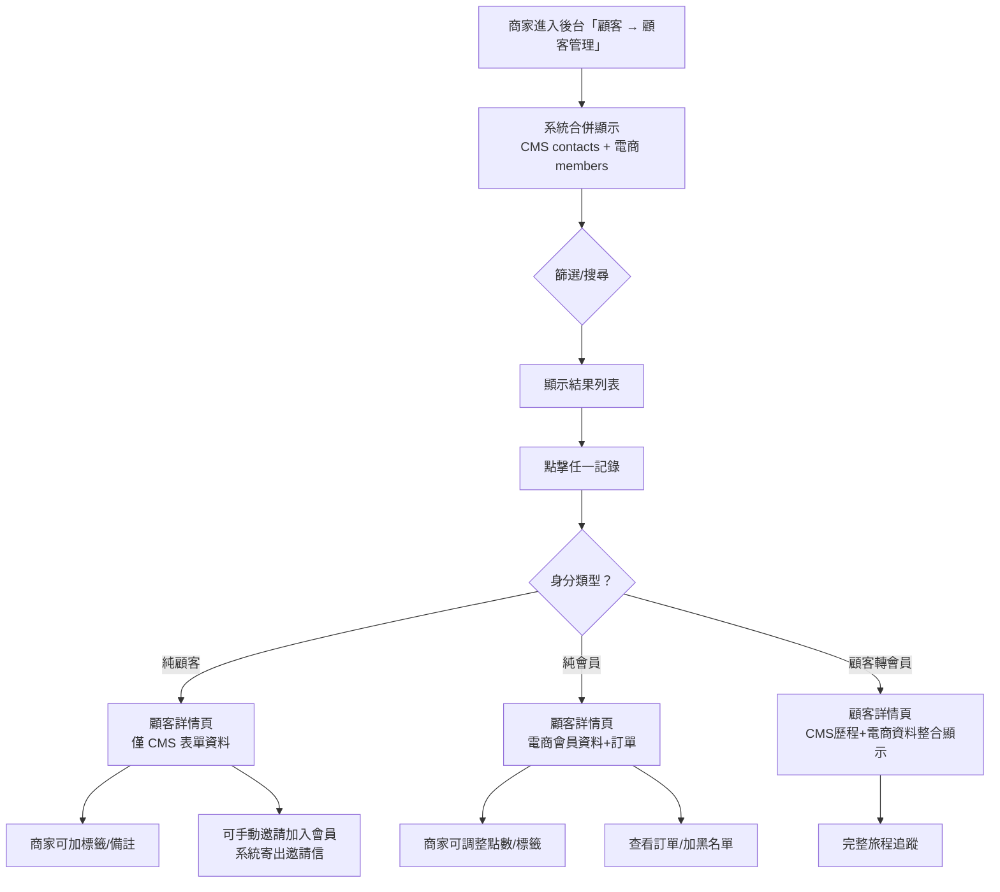
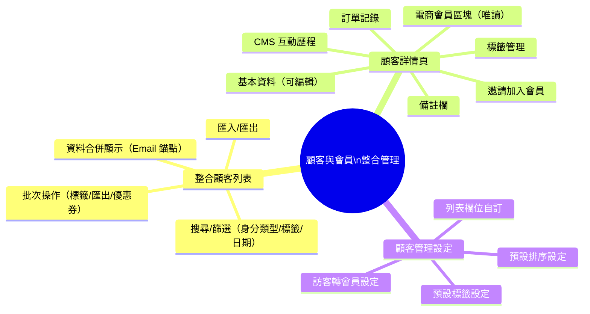
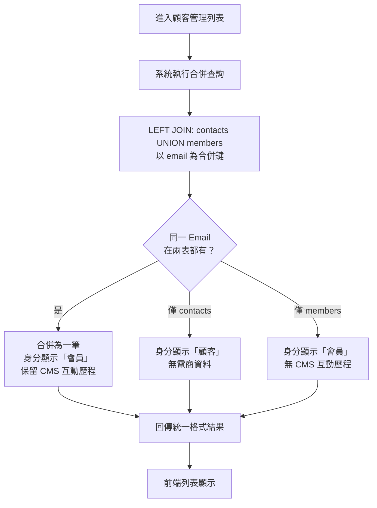
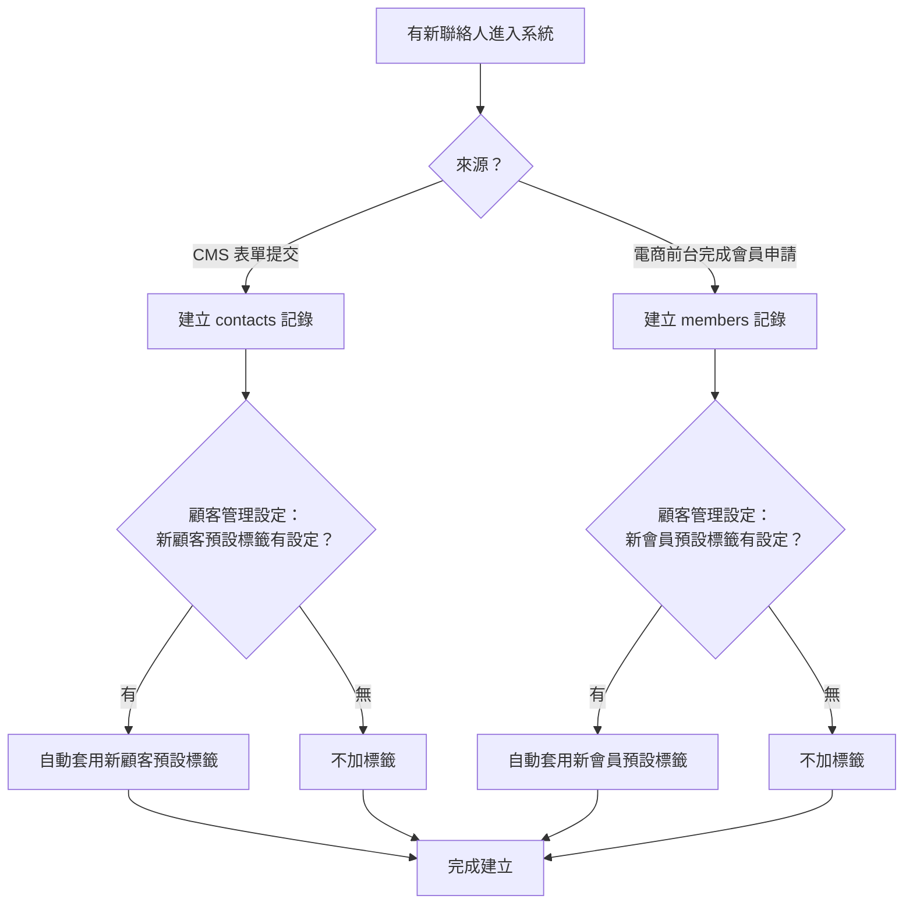

# Evomni — 顧客與會員整合管理 產品需求文件 (PRD)

## 1. 文件資訊

| 屬性 | 內容 |
| --- | --- |
| 模組名稱 | 顧客與會員整合管理（Unified Customer & Member Management） |
| 版本 | v1.6 |
| 文件狀態 | v1.6 — 依議題 2026-05-20-customer-tag-cms-vs-ecommerce-scope §6.1 §6.2：系統自動標籤不對純 CMS 顧客顯示，後端統一過濾 |
| 所屬方案 | 電商啟航方案 + 進階電商包（開啟電商模組後自動生效） |
| 所屬後台路徑 | 顧客 → 顧客管理 |
| 前置文件 | `Evomni_Part6_會員管理_PRD.md`（電商會員後台）、`Evomni_形象產品與電商商品整合架構規劃.md`（CRM 資料橋接）|
| 需求來源 | 2026/05/04 Una：CMS 顧客管理與電商會員應整合在同一後台頁面；統一用詞規範 |
| 開發階段 | 階段一（5–8 月） |

> **📌 工程師實作說明：** 本文件以需求定義為主。文中所列技術規格（DB Schema、API 路由、資料結構等）為規劃建議，反映 PM 對系統的理解；工程師可依技術判斷調整實作方式。如有重大架構變更，請於 Git commit 說明原因，並同步更新本文件，保持版控一致。

---

## 版本更新紀錄

| 版本 | 日期 | 修改內容 | 修改人 |
|------|------|----------|--------|
| v1.6 | 2026/05/29 | 依議題 2026-05-20-customer-tag-cms-vs-ecommerce-scope §6.1 §6.2：補充系統自動標籤不對純 CMS 顧客顯示，後端統一過濾 | Una |
| v1.0 | 2026/05/04 | 初稿建立：整合顧客列表（合併查詢 / Email 錨點 / 身分 Tag）、顧客詳情頁（6 個區塊）、顧客管理設定（欄位自訂 / 預設排序）；用詞統一規範 | Una |
| v1.1 | 2026/05/22 | 整理入 outputs/；補齊 §6.3 缺漏的兩個設定區塊：【區塊三：訪客轉會員設定】（自動連結 / 邀請冷卻 / 邀請標籤）、【區塊四：預設標籤】（新顧客 / 新會員預設標籤）；§8.4 DB Schema 補充 `customer_settings` 資料表；§7 新增 §7.3 預設標籤套用流程圖 | Una |

---

## 用詞統一規範（全系統適用）

> ⚠️ 本節定義的術語適用於所有 Evomni PRD、後台介面、前台介面、客服話術。

| 術語 | 定義 | 資料來源 | 顯示 Tag 顏色 |
| --- | --- | --- | --- |
| **顧客** | 曾透過 CMS 表單（詢問單、報名、聯絡）留下聯絡資料，但**尚未申請並通過電商會員註冊**的聯絡人 | CMS `contacts` 表 | `#606266`（灰） |
| **會員** | 已在電商前台完成**會員申請並通過驗證**（Email 驗證或簡訊 OTP）的消費者 | 電商 `members` 表 | `#409EFF`（藍） |
| **顧客轉會員** | 原為顧客（CMS contacts），後來完成電商會員申請，同 Email 已被系統連結 | 兩表均有記錄 | 顯示「會員」tag + 附加「曾為顧客」說明 |

**不使用的術語（請在系統內全面替換）：**
- ❌ 「用戶」→ 改為「顧客」或「會員」
- ❌ 「客戶」（在後台顯示中）→ 改為「顧客」或「會員」
- ❌ Part 6 中的「顧客管理中心」標題 → 後台 UI 改為「顧客管理」（與 CMS 左側選單名稱保持一致）

---

## 2. 產品背景與目標

### 2.1 核心願景與相依性

**核心問題：**
Evomni 同時擁有 CMS 形象站（有顧客資料）與電商模組（有會員資料），兩套資料目前分開管理，導致：
1. 商家在顧客管理看不到電商購買記錄
2. 商家在電商後台看不到 CMS 詢問/互動歷程
3. 同一個人被重複算成兩筆資料
4. 「顧客」「會員」術語混用導致操作困惑

**解決方案：**
以 **Email 為唯一識別錨點**，將 CMS `contacts` 資料與電商 `members` 資料整合顯示在 Evomni 後台的「顧客管理」頁面。同一個 Email 只顯示一筆記錄，以「身分類型」欄位區分。

**Evomni 價值對應：**
- 商家用一個頁面就能看到完整的顧客/會員資料
- 形象站問過的潛在客，在轉換為電商會員後能追蹤完整旅程
- 分眾行銷時可以同時針對「只是顧客」的族群做精準引導（轉換會員）

**系統相依性：**

| 相依模組 | 用途 |
| --- | --- |
| CMS 顧客管理（現有） | 讀取 `contacts` 表：姓名、Email、電話、公司、表單來源、標籤 |
| Part 6 電商會員管理 | 讀取 `members` 表：等級、點數、消費記錄、電商標籤 |
| Part 3 訂單管理 | 在顧客詳情頁顯示訂單列表 |
| Part 4 行銷活動 | 分眾篩選後發送優惠券 |
| 發信系統 | 顧客/會員匯出後寄送報表信；邀請加入會員信 |

### 2.2 功能總覽表

開啟電商模組後，CMS 原有「顧客管理」頁面自動升級為「整合顧客管理」，同時顯示 CMS 顧客與電商會員資料。

| 主功能模組 | 子功能項目 | 功能目的 | 功能詳細描述 | 影響之使用者 |
| --- | --- | --- | --- | --- |
| 整合顧客列表 | 統一列表顯示 | 一處管理所有聯絡人 | 同時顯示 CMS 顧客（表單聯絡人）與電商會員，同 Email 合併為一筆；「身分類型」欄位標示區別 | 商家管理員 |
| 整合顧客列表 | 搜尋與篩選 | 快速定位目標顧客/會員 | 多條件篩選：關鍵字（姓名/Email/電話/公司）、標籤（可多選）、狀態、身分類型（顧客/會員/全部）、加入/註冊日期 | 商家管理員 |
| 整合顧客列表 | 批次操作 | 提升管理效率 | 批次加標籤、批次匯出、（進階方案）批次發優惠券 | 商家管理員 |
| 整合顧客列表 | 匯出與匯入 | 資料交換 | 匯出為 Excel/CSV；匯入為 CSV 格式新增顧客基本資料 | 商家管理員 |
| 顧客詳情頁 | 基本資料區塊 | 查看聯絡人資訊 | 顯示 CMS 表單留下的姓名/Email/電話/公司；可編輯 | 商家管理員 |
| 顧客詳情頁 | 電商會員區塊 | 查看電商購買資訊 | 若已是電商會員：顯示等級、點數餘額、累計消費金額、購買次數、最後購買日 | 商家管理員 |
| 顧客詳情頁 | 訂單記錄區塊 | 追蹤購買歷程 | 列出所有電商訂單（僅會員有此區塊）；可點擊連結至訂單詳情 | 商家管理員 |
| 顧客詳情頁 | CMS 互動歷程 | 查看表單提交記錄 | 列出此 Email 所有 CMS 表單提交紀錄（詢問單/報名/聯絡），含提交時間與內容摘要 | 商家管理員 |
| 顧客詳情頁 | 標籤管理 | 自定義分眾 | 新增/移除自定義標籤；系統自動標籤唯讀顯示 | 商家管理員 |
| 顧客詳情頁 | 備註欄 | 內部客服備忘 | 純文字備注，僅後台可見，不對顧客/會員顯示 | 商家管理員 |
| 顧客管理設定 | 列表欄位設定 | 自訂列表欄位 | 可選擇在列表中顯示哪些欄位（Email/電話/公司/標籤/最後訂單日/累計消費等）| 商家管理員 |
| 顧客管理設定 | 訪客轉會員設定 | 控制顧客升級為會員的行為 | 自動連結開關、邀請冷卻時間說明、邀請後自動標記標籤設定 | 商家管理員 |
| 顧客管理設定 | 預設標籤 | 自動標記新進顧客/會員 | 設定系統在新顧客或新會員建立時自動套用的初始標籤 | 商家管理員 |

---

## 3. 範圍與邊界

**涵蓋：**
- CMS `contacts` 與電商 `members` 的整合顯示（後台視角）
- 整合顧客列表（搜尋 / 篩選 / 批次操作 / 匯出匯入）
- 顧客詳情頁（基本資料 / 電商資料 / 訂單 / CMS 歷程 / 標籤 / 備註 / 邀請加入會員）
- 顧客管理設定頁（列表欄位 / 預設排序 / 訪客轉會員設定 / 預設標籤）
- 用詞統一規範（顧客 / 會員定義）

**不涵蓋：**
- 電商前台的會員中心（見 `Evomni_會員前台個人中心_PRD.md`）
- 會員等級制度 / 點數規則（見 `Evomni_Part6_會員管理_PRD.md`）
- 前台登入 / 忘記密碼流程（見 `Evomni_前台會員登入_PRD.md`）
- 會員分眾旅程觸發（見 `Evomni_Part4_行銷活動_PRD.md`）

---

## 4. 使用者與情境

| 使用者角色 | 主要情境 |
| --- | --- |
| 商家管理員 | 每日查看新進顧客/會員；搜尋特定人員後台備註；批次匯出名單給行銷團隊 |
| 商家客服 | 接到詢問時查找顧客資料，確認購買記錄與 CMS 互動歷程 |
| 行銷人員 | 篩選「只是顧客但尚未成為會員」的族群，批次發出邀請信 |

### 使用者故事

| ID | 角色 | 使用者故事 |
| --- | --- | --- |
| US-01 | 商家管理員 | 身為管理員，我想要在同一個頁面看到所有曾聯絡過我們的人（無論是表單詢問還是電商購買），以便不用切換兩個不同的功能才能了解一個人的完整歷史。 |
| US-02 | 商家管理員 | 身為管理員，我想要看到「顧客」和「會員」的區別，以便我能針對還沒成為電商會員的 CMS 顧客，主動寄出邀請加入。 |
| US-03 | 商家管理員 | 身為管理員，當我搜尋一個 Email 時，我只想看到一筆記錄而不是兩筆，以便清楚看到這個人的完整資料。 |
| US-04 | 商家管理員 | 身為管理員，我想要在顧客詳情頁看到這個人在 CMS 表單問過什麼、以及在電商買過什麼，以便客服回覆時有完整脈絡。 |
| US-05 | 行銷人員 | 身為行銷人員，我想要用篩選器篩出「只是顧客但還不是會員」的聯絡人，以便批次寄送轉換邀請。 |

---

## 5. 功能流程

### 5.1 全局功能流程



**資料合併邏輯：**
- 系統以 **Email 為唯一識別錨點**
- 同一 Email 若在 `contacts` 和 `members` 都有記錄 → 合併為一筆，身分類型顯示「會員」，CMS 互動歷程仍保留
- `contacts` 有但 `members` 沒有 → 身分類型「顧客」
- `members` 有但 `contacts` 沒有（直接從電商前台註冊）→ 身分類型「會員」，無 CMS 互動歷程區塊

### 5.2 功能結構圖



---

## 6. 介面與互動規格

> **頁面類型判斷（evomni-ux-spec R1）**
> - §6.1 整合顧客列表：**LIST**（大量資料型）→ 搜尋框 ✅、篩選器 ✅、分頁器 ✅、批次操作 ✅
> - §6.2 顧客詳情頁：**FORM**（純操作型）→ 無搜尋/篩選/分頁；儲存按鈕在各區塊行內
> - §6.3 顧客管理設定：**SETTINGS** → 無搜尋/篩選/分頁；儲存按鈕在頁面底部

### 6.1 整合顧客列表頁

**後台路徑：** 顧客 → 顧客管理
**路由：** `/members`（沿用現有路由，後端資料來源擴充為合併查詢）

#### A. 核心使用者流程

進入「顧客管理」→ 系統顯示合併後的顧客+會員列表 → 篩選/搜尋定位目標 → 點擊查看詳情 → 編輯/操作。

#### B. 介面佈局與元件拆解

```
[頁面標題：顧客管理]  [麵包屑：顧客 / 顧客管理]

[篩選區塊]
  關鍵字                     標籤（可多選）          狀態              身分類型
  [輸入姓名/Email/電話/公司]   [請選擇標籤▼]          [請選擇狀態▼]     [全部 ▼]

  加入/註冊日期
  [開始日期] 至 [結束日期]                          [清除篩選]  [搜尋]（primary）

[列表右上角]  [匯出全部]（plain）  [匯入]（plain）

[資料列表]
  ☐  Email ↕     聯絡人姓名 ↕   電話      身分     加入日期 ↕    最後登入 ↕   標籤     操作
  ☐  email@...   王小明          0912...   [會員]   2026-03-20    2026-05-01   [test]   查看
  ☐  form@...    李大方          0987...   [顧客]   2026-02-15    —            —        查看
  ☐  both@...    陳志明          0955...   [會員]   2026-01-10    2026-04-28   [VIP]    查看

[分頁器]  總計 N 筆 ｜ 每頁顯示 [20▾] ｜ ‹ 頁碼 › ｜ 前往第 [__] 頁
```

**搜尋框規格：** placeholder「輸入姓名、Email 或電話搜尋，例如：0912-345-678」；支援 Enter 觸發；有清除 ✕ 按鈕。

**「身分」欄位 Tag 規格：**

| 身分類型 | Tag 樣式 | 邏輯 |
| --- | --- | --- |
| 顧客 | `<el-tag type="info" size="small">顧客</el-tag>`（圓角、灰色）| `contacts` 有記錄，`members` 無對應 Email |
| 會員 | `<el-tag type="primary" size="small">會員</el-tag>`（圓角、藍色）| `members` 有記錄（無論是否也有 `contacts` 記錄）|

**「狀態」篩選選項：** 全部 / 正常 / 停用（管理員手動停用）/ **系統自動停用**（登入異常，系統觸發）/ 黑名單

> 「系統自動停用」對應 `members.status = 'disabled'` 且 `member_logs` 最近一筆 `action = 'system_auto_suspended'`；「停用（手動）」對應 `action = 'admin_disabled'`。兩者在列表均顯示「停用」Tag，但篩選時可分開過濾，方便管理員批量審核系統觸發的異常帳號。

**「身分類型」篩選選項：** 全部 / 顧客（僅 CMS 表單聯絡人）/ 會員（有電商帳號，含曾為顧客者）

**列表預設排序：** 加入日期由新至舊。

**表格欄位規格：**

| 欄位 | 寬度 | 說明 |
| --- | --- | --- |
| Checkbox | 40px | 批次操作用 |
| Email | 200px | 可排序；可點擊進入詳情 |
| 聯絡人姓名 | 120px | 可排序；顯示 `—` 若未填 |
| 電話 | 120px | 列表中遮蔽中間 4 碼（`0912-****-78`）；顯示 `—` 若未填 |
| 身分 | 80px | Tag 規格見上方 |
| 加入日期 | 160px | 可排序；格式 `YYYY-MM-DD HH:mm`；顧客以 CMS 表單提交時間，會員以 `members.created_at` |
| 最後登入日期 | 160px | 可排序；顧客（無登入）顯示 `—` |
| 標籤 | 120px | 顯示最多 2 個 Tag，超過顯示 `+N`；Hover 顯示全部 Tooltip；電商系統自動標籤僅對有電商消費記錄的會員顯示（後端統一過濾，詳見下方說明） |
| 操作 | 60px | [查看]（`color: #409EFF`）；≤ 2 個操作，直接顯示文字按鈕 |

> **系統自動標籤顯示範圍（依議題 2026-05-20-customer-tag-cms-vs-ecommerce-scope 與 2026-05-20-system-tag-flag-on-evo-tags 決議）：** 電商系統自動標籤（新客、活躍客、高價值客、沉睡客、流失客、品類愛好者）僅對具備電商消費行為的會員計算與顯示，不套用於純 CMS 顧客（無電商消費記錄者）；過濾邏輯由後端統一執行，所有標籤顯示介面行為保持一致，不由各前端頁面個別判斷（避免新增標籤顯示入口時遺漏過濾邏輯）。

**批次操作列（勾選後出現）：**
```
已選 N 筆  [加標籤]  [匯出已選]  [（進階電商包）發送優惠券]           取消選取
```

#### C. 搜尋邏輯

- 關鍵字搜尋：跨 `contacts.name`、`contacts.email`、`contacts.phone`、`contacts.company`、`members.name`、`members.email`、`members.phone` 聯合搜尋
- 標籤篩選：同時篩選 CMS 標籤和電商會員標籤
- 日期篩選：顧客以 `contacts.created_at`；會員以 `members.created_at`；兩表都有時以較早的時間為準

#### D. 匯出規格

點擊「匯出全部」或「匯出已選」後，Toast 顯示「報表產生中，完成後將寄送至您的信箱」。

匯出欄位（Excel）：

| 欄位 | 顧客 | 會員 |
| --- | --- | --- |
| Email | ✅ | ✅ |
| 姓名 | ✅ | ✅ |
| 電話 | ✅（完整號碼）| ✅ |
| 公司 | ✅（CMS）| — |
| 身分類型 | ✅ | ✅ |
| 加入日期 | ✅ | ✅ |
| 最後登入日期 | — | ✅ |
| 累計消費金額 | — | ✅ |
| 購買次數 | — | ✅ |
| 點數餘額 | — | ✅ |
| 會員等級 | — | ✅（進階電商包）|
| 標籤 | ✅ | ✅ |

#### E. CSV 匯入規格（決議 17-1）

點擊「匯入」Button → 彈出匯入 Dialog，依以下規格執行 Upsert 邏輯。

**檔案限制：**
- 格式：CSV（UTF-8 編碼，含標題列）
- 單次上限：5,000 筆 / 10 MB（超過顯示錯誤，拆批處理）

**欄位驗證規則：**

| 欄位 | 格式驗證 | 違規處理 |
| --- | --- | --- |
| Email | RFC 5321 標準格式（如 `name@example.com`）| 格式不符 → 跳過此列 + 列入錯誤報告 |
| 手機 | 台灣09開頭10碼（如 `0912345678`）或含國碼格式（`+886912345678`）| 格式不符 → 跳過此列 + 列入錯誤報告 |
| 姓名 | 最長 50 字元 | 超長 → 截斷至 50 字元，無需跳過 |
| 公司 | 最長 100 字元 | 超長 → 截斷至 100 字元，無需跳過 |
| 標籤 | 逗號分隔多個標籤（如 `VIP,已邀請`）| 空白標籤忽略；超長標籤名稱截斷（50字元）|

**Upsert 邏輯（Email 已存在時的衝突處理）：**

| 資料類型 | 行為 |
| --- | --- |
| 個人資料（姓名 / 手機 / 公司）| **覆蓋更新**：CSV 的值取代現有值；若 CSV 欄位空白則保留現有值，不清空 |
| 標籤 | **合併疊加**：CSV 帶來的新標籤與現有標籤合併；既有標籤保留不刪除；重複標籤不重複建立 |

> **標籤邏輯設計說明：** 系統**不提供「標籤全部取代」選項**，目的是避免商家誤操作清空既有標籤（例如：只想補上新標籤，卻不小心把先前人工標記的 VIP / 黑名單等標籤清除）。若需移除特定標籤，請在詳情頁逐一操作。

**匯入結果報告：**

匯入完成後顯示 Dialog：
```
匯入完成
  ✅ 成功新增：[N] 筆
  🔁 成功更新：[N] 筆
  ❌ 跳過（格式錯誤）：[N] 筆

[下載錯誤報告 CSV]   [關閉]
```
- 「下載錯誤報告 CSV」：含原始列號、Email 欄位值、錯誤原因描述

**Email 不存在時（新建）：** 以 CSV 提供的欄位建立新 `contacts` 記錄，`registration_source = 'csv_import'`。

---

#### F. 空狀態

- **真空狀態（無任何資料）：** [圖示] 「目前尚無顧客或會員資料」 / 「顧客從 CMS 表單聯絡後自動加入；會員在前台完成註冊後出現」
- **篩選後無結果：** 「找不到符合條件的顧客/會員，試試調整篩選條件」 / [清除篩選] 連結

**頁面右上角 Info ⓘ：** Tooltip 說明「同一 Email 在 CMS 顧客與電商會員中只計算一筆，身分以電商會員為優先。」

---

### 6.2 顧客詳情頁

**路由：** `/members/:id`

#### A. 核心使用者流程

從列表點擊「查看」→ 進入詳情頁 → 各區塊依身分類型動態顯示 → 可進行操作（編輯/標籤/備註/邀請/黑名單）

#### B. 介面佈局與元件拆解

**頁面整體結構：**
```
[← 返回顧客管理]

┌──────────────────────────────────────────────────────────────────┐
│  [頭像 40×40]  王小明                                             │
│                [會員] tag  [高價值客] tag  [VIP] tag              │
│                Email：email@example.com                          │
│                電話：0912-345-678                                 │
│  [編輯基本資料]  [加入黑名單]（danger plain）                      │
└──────────────────────────────────────────────────────────────────┘

【區塊一：基本資料】（純顧客 + 會員均顯示）
【區塊二：電商會員資訊】（會員才顯示）
【區塊三：訂單記錄】（會員才顯示）
【區塊四：CMS 互動歷程】（有 CMS 表單記錄才顯示）
【區塊五：標籤管理】（均顯示）
【區塊六：備註欄】（均顯示）
【邀請加入會員區塊】（純顧客才顯示）
```

---

**【區塊一：基本資料】**

| 欄位 | 說明 |
| --- | --- |
| 姓名 | 可編輯；顧客來自 `contacts.name`，會員來自 `members.name` |
| Email | 唯讀（Email 為識別錨點，不允許在後台修改） |
| 電話 | 可編輯；詳情頁顯示完整號碼 |
| 公司 | 可編輯；CMS 表單欄位；會員無此欄位時留空 |
| 加入來源 | 唯讀；顯示邏輯：(a) CMS 來源 → 從 `evo_customer_form_submissions` 取此 Email 最早的一筆表單提交，顯示表單類型與日期（例：「CMS 聯絡表單（2026/02/15）」）；(b) 電商來源 → 依 `members.registration_source` 欄位顯示（`self_register`：「電商前台自行註冊（2026/03/20）」；`admin_created`：「後台手動建立（2026/04/01）」；`csv_import`：「CSV 批次匯入（2026/04/05）」；`social_login`：由 `social_accounts` 表取得第三方來源，如「第三方登入 Google（2026/03/21）」）；顧客轉會員時同時顯示兩者 |

「編輯基本資料」：點擊展開行內編輯；[儲存] [取消]；儲存後 Toast「資料已更新」。

---

**【區塊二：電商會員資訊】**（`members` 有記錄才顯示）

```
┌──────────────────────────────────────────────────────────────────┐
│ 電商會員資訊                                                       │
├─────────────┬────────────────────────────────────────────────────┤
│ 會員等級     │ 一般會員（進階電商包才顯示等級名稱與圖示）             │
│ 點數餘額     │ 1,250 點  [查看明細 →]                              │
│ 累計消費     │ NT$ 28,400  ⓘ（Tooltip：僅計算已完成訂單）           │
│ 購買次數     │ 15 次  ⓘ（Tooltip：僅計算已完成訂單）                │
│ 最後購買日   │ 2026/04/28                                         │
│ 帳號狀態     │ [正常]（綠）/ [停用]（灰）/ [黑名單]（紅）            │
│ 加入日期     │ 2026/03/20                                         │
└─────────────┴────────────────────────────────────────────────────┘
```

---

**【區塊三：訂單記錄】**（`members` 有記錄才顯示）

```
訂單記錄  [查看全部訂單 →]（連結至訂單管理頁，帶入此會員篩選）

  訂單編號            日期          金額           狀態
  #EC-20260428-001    2026/04/28   NT$ 1,800      [已完成]
  #EC-20260410-002    2026/04/10   NT$ 3,200      [已完成]
  #EC-20260320-003    2026/03/20   NT$ 580        [已取消]
  （列出最近 5 筆；更多請點「查看全部訂單」）
```

訂單編號可點擊跳轉至訂單詳情；狀態使用 `<el-tag>`。

---

**【區塊四：CMS 互動歷程】**（`contacts` 有記錄才顯示）

```
CMS 互動歷程（N 筆表單提交記錄）

  時間               表單類型       內容摘要（前 50 字）
  2026/02/15 14:20   聯絡表單       「請問貴公司的方案費用是...」
  2026/01/03 09:05   產品詢問單     「我想了解 XXX 產品的規格...」
  （顯示最近 5 筆；[查看全部] 連結至 CMS 表單記錄）
```

---

**【區塊五：標籤管理】**（均顯示）

```
標籤

  系統自動標籤（唯讀）：
  [活躍客] [高價值客]

  商家自定義標籤（可編輯）：
  [VIP] [test] ×
  [+ 新增標籤]（<el-select> 選擇既有或輸入建立新標籤）
```

> **純 CMS 顧客的系統自動標籤顯示規則（依議題 2026-05-20-customer-tag-cms-vs-ecommerce-scope 決議）：** 純 CMS 顧客（無電商消費記錄者）不顯示任何電商系統自動標籤；「系統自動標籤（唯讀）」區塊僅在該顧客具備電商消費行為後方才出現並計算。過濾邏輯由後端統一執行（見 §6.1 說明），不由前端個別判斷。

---

**【區塊六：備註欄】**（均顯示）

```
內部備註（不對顧客/會員顯示）

  [______________________________________]
  [____________________________________]（textarea）

  最後更新：2026/04/20 by 管理員 A  [儲存備註]
```

> **備註欄設計說明（決議 17-5）：** 備註採**覆寫單欄位**模式，不保留歷史版本。修改備註時，舊值不可追溯。若需操作紀錄，可從 `audit_log` 查閱（依系統全局 audit log 策略）。本期不另建 append-only 備註記錄表；若未來客服需求升級，列 Phase 2 重新評估。

---

**【邀請加入會員】**（身分為「顧客」才顯示）

```
┌──────────────────────────────────────────────────────────────────┐
│ 💡 此顧客尚未成為電商會員                                          │
│    寄送邀請信，引導顧客在電商前台完成會員申請。                     │
│                          [寄送邀請加入會員信]（type="primary"）    │
└──────────────────────────────────────────────────────────────────┘
```

**邀請信規格：**
- 信件主旨：「[商店名稱] 邀請您加入會員，享受專屬優惠！」
- 信件內容：包含一鍵前往電商前台註冊的連結（連結有效期 30 天）
- 點擊發送後：Toast「邀請信已寄出至 [Email]」；同時記錄發送時間在備註欄（自動附加，不覆蓋原備註）
- 同一位顧客每 7 天只能發送一次（冷卻期）；超過限制時按鈕 disabled + Tooltip：「已於 N 天前寄出邀請，請等待 N 天後再寄」
- 邀請信發送者名稱：顯示商家名稱（非 Evomni）

#### C. 防呆機制

- 嘗試訪問不存在的記錄 ID：顯示「找不到此顧客/會員記錄」+ [返回顧客管理]
- 邀請對象已是會員：邀請按鈕不顯示，顯示「此顧客已完成電商會員申請」

---

### 6.3 顧客管理設定頁

**後台路徑：** 顧客 → 設定
**路由：** `/members/settings`
**頁面類型：** SETTINGS → 儲存按鈕在頁面底部；無搜尋/篩選/分頁

#### 介面佈局與元件拆解

```
[頁面標題：顧客管理設定]

━━━━━━━━━━━━━━━━━━━━━━━━━━━━━━━━━━━━━━
【區塊一：列表欄位設定】
━━━━━━━━━━━━━━━━━━━━━━━━━━━━━━━━━━━━━━

選擇顧客管理列表中要顯示的欄位（最多顯示 8 個）：

  ☑ Email（必選，不可關閉）
  ☑ 聯絡人姓名
  ☑ 電話
  ☑ 身分
  ☑ 加入日期
  ☑ 最後登入日期
  ☐ 公司
  ☐ 累計消費金額（僅會員有資料）
  ☐ 購買次數（僅會員有資料）
  ☑ 標籤
  ☑ 操作

━━━━━━━━━━━━━━━━━━━━━━━━━━━━━━━━━━━━━━
【區塊二：預設排序】
━━━━━━━━━━━━━━━━━━━━━━━━━━━━━━━━━━━━━━

  依 [加入日期 ▼]  [由新至舊 ▼]

━━━━━━━━━━━━━━━━━━━━━━━━━━━━━━━━━━━━━━
【區塊三：訪客轉會員設定】
━━━━━━━━━━━━━━━━━━━━━━━━━━━━━━━━━━━━━━

自動連結相同 Email 帳號
  ● 啟用（預設）— 當電商會員 Email 與 CMS 顧客 Email 相同時，自動合併為同一筆記錄
  ○ 停用 — 顧客與會員分別顯示（不建議，可能造成重複記錄）
  ⚠️ 停用後，新產生的同 Email 記錄不再自動合併；已合併的記錄維持不變。

邀請冷卻期（說明用，不可修改）
  ℹ 為避免騷擾顧客，同一位顧客每 7 天最多發送 1 封邀請信。此設定由系統固定，不可調整。

邀請後自動加標籤
  已邀請標籤：[請輸入或選擇標籤▼]
  說明：寄出邀請信後，自動在該顧客的標籤欄新增此標籤（例如「已邀請入會」）。
        留空則不自動加標籤。

━━━━━━━━━━━━━━━━━━━━━━━━━━━━━━━━━━━━━━
【區塊四：預設標籤】
━━━━━━━━━━━━━━━━━━━━━━━━━━━━━━━━━━━━━━

說明：設定後，每當有新的顧客或會員進入系統時，系統會自動套用您指定的標籤。
      不填則新進人員不自動加標籤。

  新顧客預設標籤（透過 CMS 表單聯絡後自動加入）：
  [請輸入或選擇標籤，可多選▼]  [已選標籤顯示為 Tag 可移除]

  新會員預設標籤（在電商前台完成會員申請後自動加入）：
  [請輸入或選擇標籤，可多選▼]  [已選標籤顯示為 Tag 可移除]

  ℹ 預設標籤會在建立時套用，不影響既有顧客/會員。
    若需批次加標籤至既有資料，請使用列表頁的「批次操作 → 加標籤」。

  ⚙️ 工程師注意（阻塞點，決議 23-3）：「新顧客預設標籤」的觸發點在 CMS 主程式裡（CMS 表單新建聯絡人時觸發），不在電商系統控制範圍。需要 **CMS 主程式維護者協調**，在新建聯絡人成功後呼叫電商 API（`POST /api/customer-settings/apply-default-tags`），才能套用商家設定的預設標籤。若 CMS 側未實作此 Hook，「新顧客預設標籤」設定對從 CMS 表單新增的聯絡人無效（CSV 匯入和後台手動建立不受此影響，由電商側直接套用）。

━━━━━━━━━━━━━━━━━━━━━━━━━━━━━━━━━━━━━━

                                        [取消]（plain）  [儲存設定]（primary）
```

**欄位驗證：**
- 列表欄位最多 8 個：若已勾選 8 個，其餘 checkbox disabled + Tooltip「最多只能顯示 8 個欄位」
- 標籤輸入：支援選擇既有標籤或輸入新建；Enter 確認；重複標籤自動去重

**儲存行為：**
1. 點擊「儲存設定」→ 前端驗證
2. 驗證通過 → 按鈕 loading（spinner），文字改「儲存中...」
3. 成功 → Toast「✅ 設定已儲存」（右上角，3 秒消失）
4. 失敗 → Toast「❌ 儲存失敗，請稍後再試」（5 秒不自動消失）

---

## 7. 細部邏輯流程圖

### 7.1 資料合併查詢邏輯



### 7.2 邀請加入會員流程

```mermaid
graph TD
    A[商家點擊「寄送邀請加入會員信」] --> B{此 Email 最近 7 天\n是否已發送邀請？}
    B -- 是 --> C[按鈕 disabled\nTooltip 顯示剩餘天數]
    B -- 否 --> D[透過發信系統寄出邀請信\n寄件者名稱 = 商家名稱]
    D --> E[記錄發送時間至 contacts.invite_sent_at]
    E --> E2{設定頁有啟用\n邀請後自動加標籤？}
    E2 -- 是 --> E3[自動套用設定的邀請標籤]
    E2 -- 否 --> F[Toast「邀請信已寄出至 [Email]」]
    E3 --> F
    F --> G[顧客收信點擊連結]
    G --> H{Token 是否在有效期（30天）內？}
    H -- 過期 --> H2[前台顯示「此邀請連結已失效，請聯繫商家重新寄送」]
    H -- 有效 --> I[前往電商前台註冊頁\n帶入 Email 預填]
    I --> J[完成驗證後成為會員]
    J --> K[自動連結設定若啟用：\n合併為「會員」身分顯示]
```

> **邀請 Token 過期策略（決議 17-6）：** 採**被動驗證**——Token 到期後不主動排程更新 `status`；當消費者實際點擊連結時，系統才檢查 Token 有效期並標記失效。此設計較簡單，且對商家後台統計影響有限（有效期30天，誤差可接受）。

### 7.3 預設標籤套用流程



---

## 8. 資料與技術規格

### 8.1 效能需求

| 功能 | 目標回應時間 |
| --- | --- |
| 列表初始載入（20 筆合併查詢） | ≤ 1.5 秒 |
| 搜尋關鍵字回應 | ≤ 1 秒 |
| 顧客詳情頁載入 | ≤ 1 秒 |
| 批次匯出（最大 5,000 筆）| 非同步；後台處理後寄送信箱 |

### 8.2 安全性需求

- 電話號碼：列表中遮蔽中間 4 碼（`0912-****-78`）；詳情頁完整顯示
- 後台帳號需有「顧客管理」**讀取**權限才能查看列表；需**編輯**權限才能修改資料
- 批次匯出需留下操作 Log（誰匯出、時間、筆數）
- Email 欄位唯讀，不允許在後台修改（唯一識別錨點）

### 8.3 資料一致性

- `contacts` 和 `members` 各自保持獨立表，後端合併查詢透過 Email JOIN
- 在後台顧客管理修改「姓名」：純顧客改 `contacts.name`；純會員改 `members.name`；顧客轉會員同時更新兩表
- 電商消費資料（累計金額、購買次數）從 `orders` 即時計算，不做快取

### 8.4 DB Schema

**顧客（contacts）表補充欄位需求（電商整合用，CMS 原表擴充）：**

| 欄位 | 業務說明 |
|------|---------|
| 關聯會員 | 若該顧客已轉換為電商會員，記錄對應的會員 ID；未轉換時為空 |
| 轉換時間 | 顧客升級為電商會員的時間點 |
| 最近邀請發送時間 | 最近一次發送邀請加入會員信的時間；用於 7 天冷卻期判斷 |

**會員（members）表補充欄位需求（決議 17-3）：**

| 欄位 | 業務說明 |
|------|---------|
| 帳號建立來源 | 四種值：self_register（前台自行完成表單註冊）/ admin_created（後台手動建立）/ csv_import（CSV 批次匯入）/ social_login（第三方登入首次建立）；預設 self_register |

**標籤（evo_customer_tags）表補充欄位需求（決議 17-2）：**

| 欄位 | 業務說明 |
|------|---------|
| 適用範圍 | 三種值：customer（僅顯示於 CMS 顧客）/ member（僅顯示於電商會員）/ all（兩者均顯示）；預設 all；用於避免電商自動標籤誤顯示於純 CMS 顧客 |

**顧客管理設定表（customer_settings）資料需求：**

全店共用一份設定（單一記錄），所有後台人員共用同一套欄位設定：

| 欄位 | 業務說明 | 預設值 |
|------|---------|--------|
| 自動連結 Email | 新訂單訪客與既有顧客/會員自動以 Email 對比合併的開關 | 開啟 |
| 邀請後自動加標籤 | 發送邀請信後自動套用的標籤 ID；不設定時為空 | 無 |
| 新顧客預設標籤 | 新建顧客時自動套用的標籤 ID 清單（JSON 陣列）| 無 |
| 新會員預設標籤 | 新建會員時自動套用的標籤 ID 清單（JSON 陣列）| 無 |
| 列表顯示欄位 | 顧客列表的欄位顯示設定（全店共用，JSON 格式）| 系統預設 |
| 列表排序欄位 | 預設排序欄位 | 建立時間 |
| 列表排序方向 | asc / desc | desc |

### 8.5 後台路由清單

| 路由 | 頁面 | 備註 |
| --- | --- | --- |
| `/members` | 整合顧客管理列表 | 原 CMS 顧客管理頁，擴充為合併顯示 |
| `/members/:id` | 顧客/會員詳情頁 | id 可為 contact_id 或 member_id；API 自行判斷 |
| `/members/settings` | 顧客管理設定 | 欄位顯示 / 訪客轉會員設定 / 預設標籤 |

### 8.6 通知信預覽規格（決議 17-7）

顧客管理相關通知信（如邀請加入會員信）的後台預覽功能規格：

| 項目 | 規格 |
| --- | --- |
| 預覽資料源 | 共用 `evo_customer_email_templates` 表的既有模板 |
| 預覽變數填值 | 帶入商店設定的實際值（商家名稱、客服 Email、商店首頁 URL 等），而非假資料 |
| Sample 變數維護 | 由 NT 發信模組維護（`{{member_name}}` 等模板變數定義不在此 PRD 範圍內）|
| 「寄送測試信」功能 | **Phase 2**（v1.0 僅提供預覽視窗）|

### 8.7 API 端點（建議參考）

| Method | 路徑 | 說明 |
| --- | --- | --- |
| GET | `/api/members` | 合併查詢列表；支援 `?keyword=&identity=&status=&tag_ids=&date_from=&date_to=&page=&per_page=` |
| GET | `/api/members/:id` | 顧客/會員詳情；依 id 類型（contact or member）回傳對應欄位 |
| PUT | `/api/members/:id` | 更新基本資料（姓名/電話/公司）|
| POST | `/api/members/:id/invite` | 寄送邀請加入會員信；7 天冷卻期檢查 |
| POST | `/api/members/:id/tags` | 新增標籤 |
| DELETE | `/api/members/:id/tags/:tag_id` | 移除標籤 |
| PUT | `/api/members/:id/notes` | 更新備註 |
| POST | `/api/members/export` | 非同步匯出；成功後寄信 |
| POST | `/api/members/import` | CSV 批次匯入；回傳 `{success, updated, skipped, errors[{row, email, reason}]}` |
| GET | `/api/customer-settings` | 取得顧客管理設定 |
| PUT | `/api/customer-settings` | 更新顧客管理設定 |

---

## 9. 待確認事項與版本紀錄

### 9.1 待確認事項

| # | 問題 | 影響範圍 | 狀態 |
| --- | --- | --- | --- |
| CM-1 | 停用「自動連結相同 Email」後，既有已合併記錄的處理方式？ | §6.3 訪客轉會員設定 / DB | ✅ **定案** — 停用後僅影響**新增**的記錄；既有已合併的記錄維持不變，不會自動拆分 |
| CM-2 | 預設標籤是否支援多語系標籤名稱？（若商家使用多語系，標籤顯示語言如何決定）| §6.3 預設標籤 | ✅ **定案** — **v1.x 暫不列入**：多國語系後台尚未開發，標籤目前為單語系文字；**後續規劃**：若未來推出多國語系後台，預設標籤須配套語系包管理（每個標籤可設定各語系顯示名稱），屆時需評估 `customer_settings.new_contact_tag_ids` / `new_member_tag_ids` 的資料結構是否需要擴充為多語系對應表 |

### 9.2 版本更新紀錄

| 版本 | 日期 | 修改內容 | 修改人 |
|------|------|----------|--------|
| v1.6 | 2026/05/29 | 依議題 2026-05-20-customer-tag-cms-vs-ecommerce-scope §6.1 §6.2：補充系統自動標籤不對純 CMS 顧客顯示，後端統一過濾 | Una |
| v1.0 | 2026/05/04 | 初稿建立：整合顧客列表（合併查詢 / Email 錨點 / 身分 Tag）、顧客詳情頁（6 個區塊）、顧客管理設定（欄位自訂 / 預設排序）；用詞統一規範 | Una |
| v1.5 | 2026/05/28 | §8.4 移除 SQL 語法（ALTER TABLE contacts/members/evo_customer_tags、CREATE TABLE customer_settings）；改以業務欄位需求表描述；保留欄位業務說明與決議編號標註 | Una |
| v1.4 | 2026/05/28 | 實施七項議題決議：17-1 §6.1.E 補齊 CSV 匯入完整規格（5,000筆/10MB/RFC Email/台灣手機/姓名50字/公司100字；個人資料覆蓋更新；標籤合併疊加、不提供取代選項）；17-2 §8.4 `evo_customer_tags.applicable_to` 欄位（customer/member/all）；17-3 §6.2【區塊一】加入來源欄位邏輯 + `members.registration_source` 欄位；17-4 確認 `customer_settings` 全店共用（id=1）；17-5 備註覆寫無歷史追蹤（§6.2 說明補入）；17-6 邀請 Token 被動驗證（§7.2 流程圖更新）；17-7 §8.6 通知信預覽規格（共用 templates + 實際商店值；測試信 Phase 2）；§8.7 API 端點新增 import endpoint | Una |
| v1.3 | 2026/05/22 | §6.1 整合顧客列表「狀態」篩選選項新增「系統自動停用」：區分管理員手動停用（admin_disabled）與登入異常系統自動停用（system_auto_suspended），方便管理員批量審核異常帳號；連動 Evomni_前台會員登入_PRD §5.4 帳號鎖定機制 | Una |
| v1.2 | 2026/05/22 | §9.1 關閉兩項待確認事項：CM-1 ✅ 停用自動連結後既有已合併記錄維持不變；CM-2 ✅ 預設標籤 v1.x 暫不支援多語系，後續規劃說明補入（待多國語系後台開發時配套語系包管理）| Una |
| v1.1 | 2026/05/22 | 整理入 outputs/；補齊 §6.3 缺漏的兩個設定區塊：【區塊三：訪客轉會員設定】（自動連結 / 邀請冷卻說明 / 邀請後自動加標籤）、【區塊四：預設標籤】（新顧客 / 新會員預設標籤）；§8.4 DB Schema 補充 `customer_settings` 資料表；§7 新增 §7.3 預設標籤套用流程圖；CM-1、CM-2 兩項待確認事項 | Una |

---

## 與團隊溝通摘要

**變更要點：**
- 這份 PRD 是關於**將 CMS 顧客管理（表單聯絡人）和電商會員整合在同一個後台頁面**，以 Email 為唯一識別錨點合併顯示
- v1.1 補齊 §6.3 顧客管理設定頁的兩個缺漏區塊：「訪客轉會員設定」（自動連結開關 + 邀請後自動加標籤）與「預設標籤」（新顧客/新會員的初始標籤設定）

**影響範圍：**
- `Evomni_顧客與會員整合管理_PRD.md`（本文件，v1.0 → v1.1）
- Master PRD §6.2 索引條目需同步版本號

**待 PM 決策：**
- CM-1：停用「自動連結」後，既有已合併記錄是否維持不變？（建議維持）
- CM-2：預設標籤是否需要支援多語系顯示？

**重要注意事項（工程師）：** 顧客列表是跨 `contacts` + `members` 兩張表的合併查詢，以 Email 為鍵做 UNION；`contacts` 表需補 `member_id` 和 `invite_sent_at` 兩個欄位；新增 `customer_settings` 單 Row 設定表

**設計師注意：** §6.3 設定頁為 SETTINGS 類型，儲存按鈕只在頁面底部；「自動連結相同 Email」停用選項需加警示文字；預設標籤選擇器支援多選 + 建立新標籤
