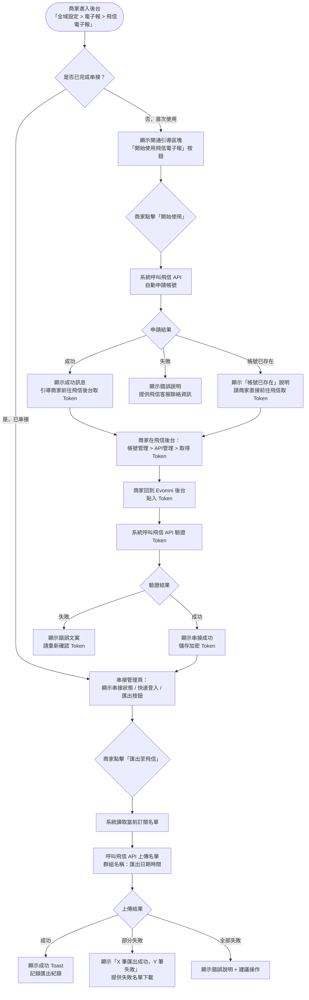
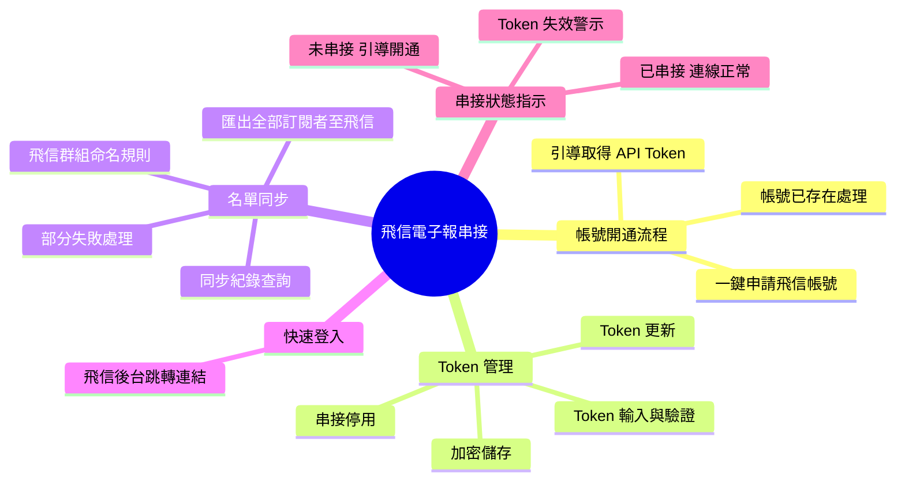
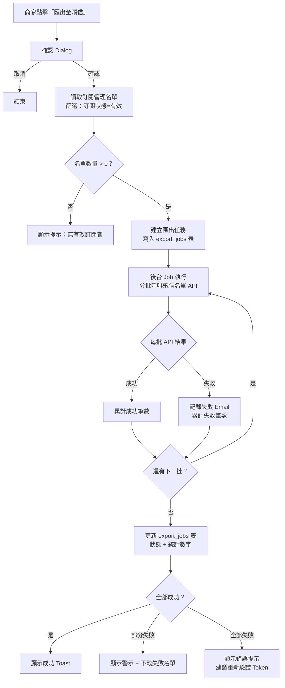
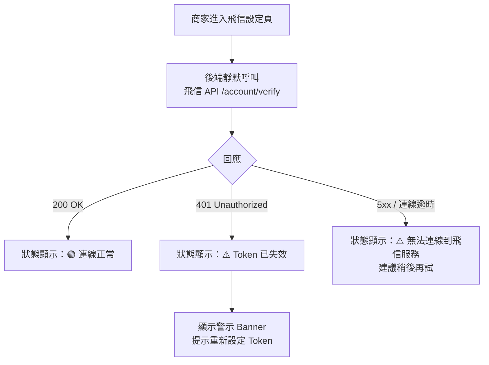

# 版本更新紀錄

| 版本 | 日期 | 修改內容 | 修改人 |
|------|------|----------|--------|
| v1.0 | 2026/05/05 | 初稿建立：飛信電子報一鍵開通、Token 串接、名單同步、快速登入完整規格 | Una |
| v1.1 | 2026/05/21 | 連動 Part4 v1.2 §6.6D：新增 §6.5「應收註銷前 30 天挽回通知」會員旅程觸發點與通知範本規格 | Una |
| v1.2 | 2026/05/27 | 依 §六串接設定決議更新：(6-9) Log 保留期限定案為 90 天；新增待討論標記：6-7 訂閱者名單資料源（開發阻塞點）、6-8 失敗 CSV 欄位範圍 | Una |
| v1.6 | 2026/06/02 | §6.3 移除 ⚠️ 待確認項，改為工程師實作備註（error_code 映射屬實作細節，不需 PM 介入確認） | Una |
| v1.5 | 2026/06/02 | 依議題 2026-05-21-flyxin-failed-emails-csv-fields §6.3：失敗名單 CSV 欄位定案為 Email + 姓名 + 失敗原因（中文）；新增失敗原因中文對照表 | Una |
| v1.4 | 2026/06/02 | 依議題 2026-05-21-flyxin-subscriber-source §5（名單同步 Feature）：訂閱者名單資料來源確認為 CMS 主程式現有「電子報訂閱名單」模組（行銷管理 > 電子報訂閱名單），非 evo_customers；移除開發阻塞標記；待 CMS 維護者確認技術串接方式 | Una |
| v1.3 | 2026/05/28 | §8.4 DB Schema 建議：移除 SQL 語法，改以業務語言欄位需求表（Markdown 表格）呈現 | Una |

---

# Evomni — 飛信電子報串接 產品需求文件 (PRD) v1.6

## 1. 文件資訊

| 屬性 | 內容 |
| --- | --- |
| 版本 | v1.6 |
| 日期 | 2026/06/02 |
| 作者 | Una |
| 需求來源 | Webtech2 飛信電子報說明文件（吳毓祥 2024-09-05）；廖紫茵需求；**Part4 行銷活動 PRD v1.2 連動需求** |
| 文件狀態 | **v1.6** — §6.3 失敗原因對照表改為工程師實作備註，移除 ⚠️ PM 待確認項 |
| 對應方案 | 電商啟航方案 ✅（可加費串接）/ 進階電商包 ✅（標配，開通即可用） |
| 關聯文件 | [Part4 行銷活動 PRD](Evomni_Part4_行銷活動_PRD.md)、[Part6 會員管理 PRD](Evomni_Part6_會員管理_PRD.md)、[優惠計算引擎技術規格 PRD](Evomni_優惠計算引擎_技術規格_PRD.md) |
| 開發時程 | 階段二 9–12月（進階電商包標配開發） |
| 特別說明 | 飛信電子報為第三方服務（必迅軟體），商家需自行向飛信申請帳號；Evomni 提供串接介面與名單同步工具，不代管飛信帳號。網站需有設定正式域名才能申請飛信。|

> **📌 工程師實作說明：** 本文件以需求定義為主。文中所列技術規格（DB Schema、API 路由、資料結構等）為規劃建議，反映 PM 對系統的理解；工程師可依技術判斷調整實作方式。如有重大架構變更，請於 Git commit 說明原因，並同步更新本文件，保持版控一致。

---

## 2. 目標與功能總覽

### 2.1 核心願景與相依性

**核心問題：**
電商商家在做 EDM 行銷時，面臨兩個痛點：一、系統內建的電子報發送能力有限（依賴商家自設 SMTP，大量發送易被判垃圾信）；二、需要大量、高頻率發送 EDM 時，沒有可靠的專業工具串接，每次都要手動匯出名單再上傳到第三方工具，流程繁瑣、容易遺漏最新名單。

**解決方案：**
整合飛信電子報服務，讓商家在 Evomni 後台完成：一鍵申請飛信帳號 → 貼入 API Token 完成串接 → 一鍵將當前訂閱者名單同步到飛信系統 → 快速跳轉到飛信後台發送 EDM。整個流程不需要商家自己研究飛信 API，Evomni 代為處理帳號創建與名單傳送。

**Evomni 價值對應：**
- 進階電商包差異化功能：標配飛信串接讓進階方案的 EDM 行銷能力更完整
- 降低商家學習成本：不需要自行串接 API，一鍵申請 + 貼 Token 即完成
- 名單自動同步：避免商家忘記更新飛信名單，確保 EDM 名單與電商系統保持一致

**系統相依性：**

| 依賴模組 | 用途 |
| --- | --- |
| 電子報訂閱管理（Evomni 主程式）| 提供訂閱者名單（email、姓名、訂閱狀態）作為同步來源 |
| Part 6 會員管理 | 會員的電子報訂閱偏好設定，影響哪些會員被納入同步範圍 |
| 飛信電子報 API | 帳號申請 API、名單上傳 API、Token 驗證 API（由飛信提供）|
| 發信系統（NT 模組）| 本 PRD 不取代 NT 模組，兩者並存：NT 負責系統通知信，飛信負責大量 EDM |

---

### 2.2 功能總覽表

| 主功能模組 | 子功能項目 | 功能目的 | 功能詳細描述 | 影響之使用者 |
| --- | --- | --- | --- | --- |
| 帳號開通 | 一鍵申請飛信帳號 | 降低商家開通門檻 | 商家在後台點擊「開始使用飛信電子報」，系統以商家的店家 Email / 網站域名呼叫飛信帳號申請 API，自動創建飛信帳號；完成後引導商家到飛信後台取得 API Token | 商家管理員 |
| Token 串接 | API Token 輸入與驗證 | 完成系統與飛信的授權連結 | 商家將飛信後台取得的 Token 貼入 Evomni 後台，系統呼叫飛信 API 驗證 Token 有效性，成功後顯示「串接成功」並記錄 Token | 商家管理員 |
| 名單同步 | 一鍵匯出訂閱者至飛信 | 確保飛信系統使用最新名單 | 後台「電子報訂閱管理」頁提供「匯出至飛信」按鈕，系統將當下有效訂閱者名單（email、姓名）透過飛信 API 上傳，飛信系統建立名為「匯出時間戳記」的名單群組 | 商家管理員 |

> **依議題 2026-05-21-flyxin-subscriber-source 決議（2026/06/02）：**
> 訂閱者名單資料來源確認為 **CMS 主程式現有「電子報訂閱名單」模組**（後台路徑：行銷管理 > 電子報訂閱名單）。此為獨立訂閱表，非 `evo_customers`，不限電商會員身份，任何人均可訂閱。
>
> ⚠️ **待 CMS 主程式維護者確認（技術對齊）：**
> 1. 訂閱表名稱與欄位結構（Email、訂閱日期等欄位的實際命名）
> 2. 電商後台讀取此表的介接方式：直接 DB 讀取 vs 主程式提供 internal API
>
> 確認後請更新本規格並將議題改為 resolved。
| 快速登入 | 飛信後台快速跳轉 | 減少商家在系統間切換的摩擦 | 後台提供「前往飛信後台」連結按鈕，點擊後以新分頁開啟飛信系統登入頁（或若 Token 支援 SSO 則自動登入） | 商家管理員 |
| 串接狀態管理 | Token 更新 / 停用串接 | 維護串接連結的有效性 | 商家可重新設定 Token 或停用飛信串接；停用後「匯出至飛信」按鈕隱藏，但歷史名單不在飛信端刪除 | 商家管理員 |
| 同步紀錄 | 歷次匯出記錄查詢 | 讓商家了解名單同步狀況 | 後台顯示每次「匯出至飛信」的操作時間、匯出筆數、成功/失敗狀態，保留最近 30 筆記錄 | 商家管理員 |

---

## 3. 全局功能流程



---

## 4. 功能結構圖



---

## 5. 使用者故事

| # | 角色 | 故事 |
| --- | --- | --- |
| US-01 | 商家管理員 | 身為商家管理員，我想要點一個按鈕就完成飛信帳號申請，以便我不需要自己去飛信官網填表單。 |
| US-02 | 商家管理員 | 身為商家管理員，我想要將 Evomni 的電子報訂閱者名單一鍵同步到飛信系統，以便我可以直接在飛信後台選用最新名單發送 EDM，不需要手動匯出 CSV 再上傳。 |
| US-03 | 商家管理員 | 身為商家管理員，我想要在後台看到「前往飛信後台」按鈕，以便我可以快速跳轉到飛信系統發信，不需要自己去找飛信的網址。 |
| US-04 | 商家管理員 | 身為商家管理員，我想要查看過去每次名單匯出的時間和成功筆數，以便我確認上次匯出是什麼時候，以及是否有失敗的情況。 |
| US-05 | 商家管理員 | 身為商家管理員，如果我的飛信 Token 過期了，我想要系統提醒我 Token 已失效並引導我更新，以便我不需要等到發信失敗才發現問題。 |

---

## 6. UI/UX 與詳細功能需求

### 6.1 飛信電子報串接設定頁

#### A. 核心使用者流程

後台「全域設定」→「電子報」→「飛信電子報設定」→ 首次使用點「開始使用飛信電子報」→ 取得 Token → 貼入完成串接 → 日後回到此頁管理。

**頁面路徑：** 全域設定 > 電子報 > 飛信電子報設定

#### B. 未串接狀態介面

```
[頁面標題] 飛信電子報串接設定

[狀態 Banner — 淡灰背景]
🔗 尚未與飛信電子報完成串接

[說明文字]
飛信電子報是台灣專業的 EDM 發送服務，適合大量、高頻率的電子報發送。
串接後可將 Evomni 的訂閱者名單一鍵同步到飛信系統。

[注意事項 — `<el-alert type="info">`]
• 網站需已設定正式域名（非測試網域）才能申請飛信帳號
• 飛信帳號費用由飛信電子報方案決定，與 Evomni 方案費用分開計費
• 如有費用或使用問題，請直接聯繫飛信客服

[主要按鈕]
[開始使用飛信電子報]  `<el-button type="primary" class="!rounded-none" size="large">`
```

**點擊「開始使用飛信電子報」後的 Loading 狀態：**
- 按鈕變為 Loading（`<el-button loading>`）
- 文字改為「申請中，請稍候…」

**申請成功後顯示（`<el-result icon="success">`）：**
```
✅ 飛信帳號申請成功！

接下來請完成以下步驟取得 API Token：

[步驟引導區塊 — 帶編號]
① 前往您的信箱，使用飛信寄出的帳號密碼登入飛信後台
   [前往飛信後台登入] `<el-link>` 開新分頁
② 登入後，點擊右上角「帳號管理」→「API 管理」→「顯示 Token」
③ 輸入密碼確認後，複製 Token 代碼
④ 回到此頁，將 Token 貼入下方欄位

[Token 輸入欄位 — 立即顯示]
```

**帳號已存在時顯示（`<el-alert type="warning">`）：**
```
⚠️ 此網站的帳號在飛信系統中已存在。
請直接前往飛信後台登入，取得 API Token 後貼入下方欄位即可完成串接。
[前往飛信後台] `<el-link>` 開新分頁
```

**申請失敗時顯示（`<el-alert type="error">`）：**
```
❌ 帳號申請失敗（錯誤代碼：{code}）
可能原因：域名尚未生效、或服務暫時無法使用。
請稍後再試，或聯繫飛信客服：support@flydove.net
```

#### C. Token 輸入區塊

```
[區塊標題] 貼入 API Token

[欄位說明文字] 請從飛信後台「帳號管理 > API 管理」取得您的 Token 代碼

| 欄位 | 元件 | 驗證規則 |
| API Token | `<el-input>` type="textarea" rows=3 | 必填；長度需 > 20 字元；Placeholder：「貼入從飛信後台複製的 API Token」|

[驗證連線按鈕] `<el-button type="primary" class="!rounded-none">`
文字：「驗證並完成串接」

[驗證中 Loading 狀態]
文字改為「驗證中…」，按鈕 disabled

[驗證成功 → 立即切換到「已串接」狀態頁面]
[驗證失敗 → `<el-alert type="error">`]
❌ Token 驗證失敗。請確認：
  1. 是否完整複製了 Token（頭尾不可有空格）
  2. Token 是否已過期（飛信 Token 需定期更新）
  請重新取得 Token 後再試。
```

**驗證錯誤文案：**
- Token 欄位空白：「請填入 API Token 才能進行驗證」
- Token 長度不足：「Token 格式異常，請確認是否完整複製」

---

### 6.2 已串接狀態頁面

#### B. 介面佈局

```
[頁面標題] 飛信電子報串接設定

[串接狀態 Banner — 淡綠背景 #F0FFF4]
🟢 已與飛信電子報完成串接
串接時間：2026/05/05 14:32
[前往飛信後台]  `<el-button type="default" class="!rounded-none">` 開新分頁

[快速操作區塊 — `<el-row :gutter="16">`]

[左卡] Token 管理
  狀態：✅ 連線正常（若 Token 失效則顯示 ❌ Token 已失效）
  [重新設定 Token]  `<el-button type="default" class="!rounded-none">`
  點擊後顯示確認 dialog：「重新設定 Token 將斷開目前串接。確定繼續？」→ 確認後回到 Token 輸入狀態
  [停用飛信串接]  `<el-button type="danger" plain class="!rounded-none">`
  點擊後顯示確認 dialog：「確定停用？停用後「匯出至飛信」功能將無法使用，您在飛信系統的帳號與名單不受影響。」

[右卡] 使用說明
  ℹ️ 停用串接不會刪除您在飛信系統的帳號或名單
  ℹ️ Token 若過期，系統將在下次匯出時顯示警示
  ℹ️ 飛信電子報發送費用請洽飛信官方客服
```

---

### 6.3 名單同步功能（電子報訂閱管理頁）

**頁面路徑：** 全域設定 > 電子報 > 訂閱管理

#### B. 匯出至飛信按鈕（新增至現有頁面工具列）

```
[現有工具列末端新增]
[匯出至飛信]  `<el-button type="default" class="!rounded-none">`

※ 已完成串接才顯示此按鈕；未串接則隱藏（不灰化，避免用戶困惑）
```

**點擊「匯出至飛信」觸發確認 Dialog（`<el-message-box>`）：**
```
確認匯出
將匯出 {N} 筆有效訂閱者至飛信電子報系統。
在飛信系統中，此批名單將以「{YYYY-MM-DD HH:mm} 匯出」命名儲存。

[取消]  [確認匯出]
```

**匯出中狀態：**
- 按鈕顯示 Loading
- Toast 提示：「正在匯出 {N} 筆名單至飛信，請稍候…」

**匯出成功 Toast（`<el-message type="success">`）：**
「✅ 已成功將 {N} 筆訂閱者匯出至飛信電子報系統。飛信後台中可使用名單：『{YYYY-MM-DD HH:mm} 匯出』」

**部分失敗（`<el-alert type="warning">`，顯示在頁面頂端）：**
```
⚠️ 匯出部分完成：{成功N} 筆匯出成功，{失敗M} 筆匯出失敗。
[下載失敗名單 CSV]  `<el-link>`
```

> **依議題 2026-05-21-flyxin-failed-emails-csv-fields 決議（2026/06/02）：**
> 失敗名單 CSV 欄位定案為 **Email + 姓名 + 失敗原因（中文）**。

**失敗名單 CSV 規格：**

| 欄位 | 說明 |
| --- | --- |
| Email | 匯出失敗的電子郵件地址 |
| 姓名 | 訂閱者姓名（商家識別用；若訂閱表無姓名欄位則留空）|
| 失敗原因 | 系統翻譯後的中文說明（見下方對照）|

**失敗原因中文對照（系統翻譯，不顯示飛信原始錯誤碼）：**

| 情境 | CSV 顯示文字 |
| --- | --- |
| Email 格式無效 | Email 格式無效，請確認後重新上傳 |
| 已退訂飛信名單 | 此 Email 已退訂，無法加入名單 |
| 已存在於飛信名單 | 此 Email 已存在名單中，略過 |
| 飛信 API 逾時 | 上傳逾時，建議重新嘗試 |
| 其他飛信回傳錯誤 | 上傳失敗（飛信系統錯誤），請聯繫客服 |

> 失敗原因由系統翻譯為中文顯示（不對商家暴露飛信原始錯誤碼）。工程師實作時依 `doc/error/code#customer_list` 對照各 error_code，映射至上表各情境的中文說明；若實際錯誤碼有增刪，調整對照表即可

**全部失敗（`<el-alert type="error">`）：**
```
❌ 匯出失敗。可能原因：飛信 API Token 已過期或網路連線問題。
請前往「飛信電子報設定」頁重新驗證 Token 後再試。
[前往設定]  `<el-link>`
```

---

### 6.4 匯出紀錄查詢（飛信設定頁下方）

```
[區塊標題] 匯出紀錄

[Table — 最近 30 筆]
| 欄位       | 寬度   | 說明 |
| 匯出時間   | 160px | YYYY/MM/DD HH:mm |
| 匯出筆數   | 100px | 成功匯出的名單筆數 |
| 狀態       | 100px | `<el-tag>` 成功（綠）/ 部分失敗（橘）/ 失敗（紅）|
| 飛信群組名 | 200px | 例：2026-05-05 14:32 匯出 |
| 操作       | 100px | 「查看詳情」— 展開顯示失敗名單（若有）|

[空狀態 Empty State]
圖示：📋
文字：「尚未有匯出記錄」
說明：「點擊『匯出至飛信』按鈕，將訂閱者名單同步至飛信電子報系統」
```

#### C. 互動設計

- Token 失效偵測：每次商家進入飛信設定頁，系統靜默呼叫飛信 API 驗證 Token 有效性；若失效，狀態 Banner 變為橘色警示：「⚠️ Token 已失效，請重新設定 Token 才能使用匯出功能」
- 匯出為非同步操作（大量名單可能需要數秒），使用後台 Job 處理，完成後更新匯出紀錄，若商家已離開頁面，下次進入時可在紀錄中看到結果

#### D. 防呆機制與錯誤預防

- 未完成串接時，「匯出至飛信」按鈕完全隱藏，避免商家點到後看到錯誤
- 若訂閱者名單為 0 筆，點擊「匯出至飛信」前顯示提示：「目前沒有有效訂閱者可匯出」，不送出 API 請求
- Token 重新設定前的確認 Dialog 必須明確說明後果（串接中斷）

---

### 6.5 應收餘額註銷前挽回通知（v1.1 新增，連動 Part4 v1.2 §6.6D）

> 依 2026-05-21 補充會議議題 2 + Andy（客服）提議：應收餘額將於 6 個月後註銷前 30 天，自動發送挽回通知，鼓勵會員回購使其新回饋優先抵扣應收。
>
> 通知範本由本 PRD 定義；觸發時機與資料來源由 [Part4 §6.6D](Evomni_Part4_行銷活動_PRD.md) 標示。

#### A. 觸發條件

- 資料來源：`reward_receivable_records` 表（由優惠計算引擎維護）
- 觸發時機：`expires_at - 30 天 = TODAY` 的記錄（每日排程於商家設定的發送時間執行，預設 10:00）
- 過濾條件：
  - `status = 'pending'`（未抵扣未註銷）
  - 同一會員 30 天內已發送過 → 跳過（去重，防止重複擾民）
- 通知管道：Email（必發） + LINE（若會員已綁定）

#### B. Email 範本規格

**主旨：** 「{會員姓名}，您有 NT$XX 回饋即將失效，回購使用最划算 🎁」

**Email 內容：**

```
[問候]
Hi {會員姓名}，
您有一筆 NT$XX 的回饋金（點數）將於 {expires_at_date} 失效。

[說明區塊（淡藍底）]
💡 怎麼使用？
下次回購完成訂單時，系統將自動以新獲得的回饋優先抵扣這筆即將失效的金額，
您不需要做任何特別操作。

[CTA 按鈕]
[前往購物，鎖住這筆回饋] → 商店首頁

[小字提示]
若您未在 {expires_at_date} 前回購，此筆回饋將自動失效，無法復原。

[底部]
此通知由 Evomni 系統自動發送，您可於會員中心調整通知偏好。
```

**Email 設計要點（依會員前台 PRD 規範）：**
- **不顯示**「應收記錄」「應收註銷」等技術詞
- 改用會員看得懂的「回饋即將失效」「自動扣抵」
- CTA 文案訴求行動（鎖住）而非說明（查看）

#### C. LINE 訊息範本（若會員已綁定 LINE）

**訊息類型：** Flex Message

```json
{
  "type": "bubble",
  "header": {
    "contents": [
      {"type": "text", "text": "🎁 您有回饋即將失效", "weight": "bold"}
    ]
  },
  "body": {
    "contents": [
      {"type": "text", "text": "{會員姓名} 您好"},
      {"type": "text", "text": "您的 NT${金額} 回饋將於 {失效日} 失效"},
      {"type": "text", "text": "回購完成訂單時將自動抵扣，不需特別操作", "size": "sm", "color": "#888"}
    ]
  },
  "footer": {
    "contents": [
      {
        "type": "button",
        "action": {
          "type": "uri",
          "label": "前往購物",
          "uri": "{商店首頁 URL}"
        },
        "style": "primary",
        "color": "#409EFF"
      }
    ]
  }
}
```

#### D. 後台設定（商家可調整）

**路徑：** 飛信電子報設定 → 自動化通知 → 應收餘額挽回通知

| 欄位 | 元件 | 預設值 |
|------|------|--------|
| 啟用通知 | `<el-switch>` | ON |
| 提前天數 | `<el-input-number>` | 30 天（範圍 7–60 天） |
| 發送時間 | `<el-time-picker>` | 10:00 |
| Email 主旨自訂 | `<el-input>` | 預設範本（如上） |
| Email 內文自訂 | `<el-input type="textarea">` | 預設範本（如上） |
| LINE 訊息自訂 | `<el-input type="textarea">` | 預設範本（如上） |

#### E. 觸發紀錄與成效追蹤

- 寫入 `marketing_journey_logs`（同 Part4 §8.5.5）：
  - `journey_type = 'receivable_reminder'`
  - `cooldown_ends_at = NOW() + 30 days`
- 成效追蹤連動 Part5 §6.4「自動化旅程成效表格」：旅程名稱新增「應收挽回通知」
- 觸發轉換判定：通知發送後 30 天內，會員下單 → 計入「最終轉換訂單數」

#### F. 邊界情境

| 情境 | 處理 |
|------|------|
| 會員已綁定 LINE 但 LINE 推播失敗 | Email 仍正常發送，LINE 失敗寫入 `marketing_push_logs` |
| 會員未綁定 Email（純 LINE 註冊）| 僅發 LINE |
| 應收記錄在通知發送後立即被抵扣 | 通知已發出不可收回；下次有應收記錄才再觸發 |
| 商家後台關閉此通知 | 已排程的當日批次仍會發送完，次日起停止 |
| Mode B 商家（後端 v1.3 啟用後）| 應收記錄會轉為負餘額，本通知**不再觸發**；改由「負餘額提醒通知」（v1.3 規劃）取代 |

---

## 7. 細部邏輯流程圖

### 7.1 名單匯出詳細流程



### 7.2 Token 失效偵測機制



---

## 8. 非功能性需求

### 8.1 效能需求

| 項目 | 標準 |
| --- | --- |
| Token 驗證 API 呼叫 | ≤ 3 秒回應；逾時顯示錯誤 |
| 名單匯出（後台 Job）| 每批 100 筆，總時間視名單規模；不阻塞前台操作 |
| 匯出紀錄查詢 | ≤ 1 秒（最近 30 筆，無複雜查詢）|
| 飛信後台狀態確認（進頁面時）| ≤ 2 秒；逾時則跳過，不阻塞頁面渲染 |

### 8.2 安全性需求

| 項目 | 規格 |
| --- | --- |
| API Token 儲存 | AES-256 加密儲存；不在任何前端 HTML/JS 中暴露 |
| Token 顯示 | 設定頁面僅顯示「已設定（最後更新時間）」，不顯示 Token 內容 |
| 匯出操作權限 | 僅「擁有者」及「管理員」角色可執行匯出 |
| 名單資料傳輸 | 所有與飛信 API 的通訊使用 HTTPS；訂閱者 Email 在傳輸過程中不落地 |

### 8.3 資料一致性

- 匯出至飛信的名單以「執行當下」的訂閱者快照為準，中途有新訂閱者不影響本次匯出
- 匯出記錄（`flydove_export_logs`）在 Job 完成後才更新狀態，確保記錄準確
- 若商家同時點擊兩次「匯出至飛信」，系統需鎖定防止重複執行（Redis 分散式鎖，有效期 10 分鐘）
- **Log 保留期限（6-9 定案）**：`flydove_export_logs` 保留 **90 天**，逾期由排程自動清除。理由：記錄包含個人資料（email 地址），依個資最小化原則不需長期保存。後台匯出紀錄頁頂部須顯示提示：「匯出記錄保留最近 90 天。」

### 8.4 DB Schema 建議

#### flydove_settings（飛信串接設定）

| 欄位 | 業務說明 |
| --- | --- |
| id | 主鍵，自動遞增 |
| store_id | 所屬商家，每間商家僅一筆設定（唯一約束） |
| api_token | 飛信 API Token，以 AES-256 加密儲存，不可明文暴露（選填） |
| status | 串接狀態：`connected`（已連線）、`disconnected`（未連線）、`token_invalid`（Token 無效） |
| connected_at | 成功連線時間（選填） |
| last_verified_at | 最後一次驗證 Token 有效性的時間（選填） |
| created_at | 記錄建立時間 |
| updated_at | 最後更新時間，修改時自動更新 |

#### flydove_export_logs（匯出紀錄）

> ⚠️ Log 保留期限（6-9 定案）：`flydove_export_logs` 保留 **90 天**，逾期由排程自動清除。理由：記錄包含個人資料（Email 地址），依個資最小化原則不需長期保存。後台匯出紀錄頁頂部須顯示提示：「匯出記錄保留最近 90 天。」

| 欄位 | 業務說明 |
| --- | --- |
| id | 主鍵，自動遞增 |
| store_id | 所屬商家 |
| total_count | 本次匯出的訂閱者總筆數 |
| success_count | 成功同步至飛信的筆數 |
| failed_count | 同步失敗的筆數 |
| failed_emails | 失敗的 Email 清單，JSON 陣列格式（選填） |
| flydove_group_name | 在飛信系統對應的群組名稱（選填） |
| status | 匯出狀態：`pending`（排隊中）、`processing`（執行中）、`success`（全部成功）、`partial_failed`（部分失敗）、`failed`（全部失敗） |
| triggered_by | 操作人的後台使用者 ID（選填） |
| created_at | Job 建立時間 |
| completed_at | Job 完成時間（選填） |

### 8.5 瀏覽器/裝置支援

| 環境 | 要求 |
| --- | --- |
| 後台設定頁 | Chrome 110+、Edge 110+、Firefox 110+；桌機最低 1280px |
| 飛信後台（第三方）| 由飛信負責，本系統僅提供跳轉連結 |

---

## 與團隊溝通摘要

- 這次的規格是關於**飛信電子報串接**，讓進階電商包商家可以在後台一鍵開通飛信帳號、貼 Token 完成串接，以及將訂閱者名單一鍵同步到飛信系統發 EDM
- **工程師這邊需要注意：**
  1. 飛信 API Token 必須 AES-256 加密儲存，不可暴露在前端
  2. 名單匯出為後台異步 Job，分批（每批 100 筆）呼叫飛信 API，避免大量名單造成 timeout
  3. 防止重複匯出：用 Redis 鎖（有效期 10 分鐘）避免商家連點兩次觸發重複 Job
  4. 進入飛信設定頁時靜默驗證 Token 有效性，但不阻塞頁面渲染（可背景異步執行）
  5. 帳號申請時使用的是商家的店家 Email 與網站域名，需確認從哪個欄位取得
- **設計師這邊需要注意：**
  1. 未串接 vs. 已串接是兩個完全不同的介面狀態，需設計兩套 UI
  2. 開通引導流程的步驟說明要視覺清晰（可參考類似「安裝步驟」風格），商家可能不熟悉 API Token 的概念
  3. 匯出至飛信的按鈕放在「訂閱管理」頁的工具列，需確認現有頁面佈局是否有空間
- 這個模組依賴 **電子報訂閱管理（Evomni 主程式）**（名單來源）以及**飛信電子報 API**（外部服務）
- 此功能**電商啟航方案為可加費串接**，**進階電商包為標配**；方案判斷邏輯需在功能開關層處理，進階方案用戶進入此頁直接看到開通引導，啟航方案用戶看到「升級進階電商包以使用飛信電子報串接」的升級 CTA
- ⚠️ 本文件已納入 Git 版控。技術規格（DB Schema、API 設計）為需求導向的建議，工程師可依技術判斷調整實作，重大變更請回寫文件。
- ⚠️ 本次新增文件已連動更新 Master PRD §4.2、§6.2、§7、§8。

### v1.1 連動 Part4 v1.2 變更要點

- §6.5 新增「應收餘額註銷前 30 天挽回通知」會員旅程觸發點
- 提供 Email + LINE 完整範本，**會員端不顯示「應收記錄」「應收註銷」等技術詞**，改用會員可懂的「回饋即將失效」「自動扣抵」
- 後台設定（飛信電子報設定 → 自動化通知）：商家可調整提前天數、發送時間、範本內容
- 觸發紀錄連動 `marketing_journey_logs`，成效追蹤連動 Part5 §6.4 自動化旅程成效表格
- **Mode B（負餘額後端，後端 v1.3）啟用後**：本通知不再觸發，由「負餘額提醒通知」取代（v1.3 規劃，詳見 [後續擴充規劃 §E-05](Evomni_Part4_行銷活動_後續擴充規劃_PRD.md)）
