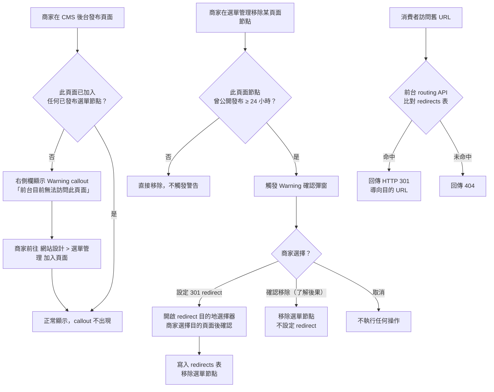
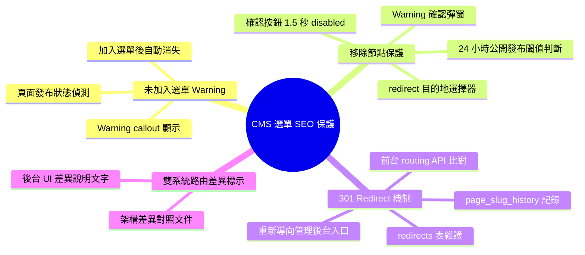
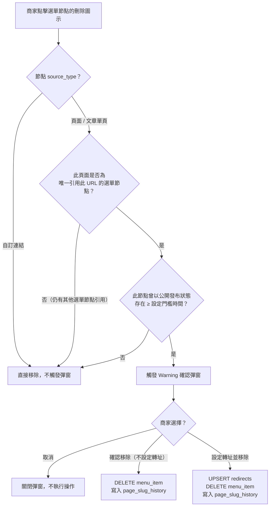
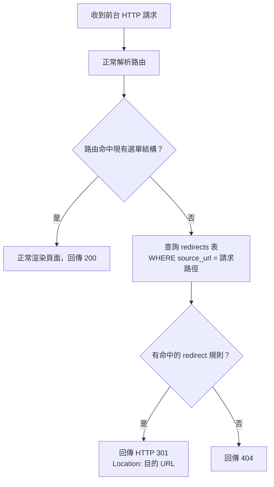

## 版本更新紀錄

| 版本 | 日期 | 修改內容 | 修改人 |
|------|------|----------|--------|
| v1.0 | 2026/05/04 | 初稿建立；來源：虛擬開發會議決議（SEO 保護機制 + 雙系統路由邏輯差異文件化） | Una |

# Evomni — CMS 選單 SEO 保護機制與路由邏輯規格 產品需求文件 (PRD)

## 1. 文件資訊

| 屬性 | 內容 |
| --- | --- |
| 模組名稱 | CMS 選單 SEO 保護機制（Menu SEO Guard） |
| 所屬系統 | Evomni 主程式 — CMS 形象網站模組（非電商專屬） |
| 前置文件 | `WebtechONE-選單架構優化.pdf`（WTO 選單管理規格，Neil 著）、`Evomni_形象產品與電商商品整合架構規劃.md` |
| 需求來源 | 2026/05/04 虛擬開發會議決議；客服高頻問題（CMS 頁面發布後前台找不到、選單移除後 SEO 404 損失） |
| 文件狀態 | v1.0 首次完整規格 |
| 開發優先序 | P1（配合 WTO 選單管理功能上線同步實作） |

> **📌 工程師實作說明：** 本文件以需求定義為主。文中所列技術規格（DB Schema、API 路由、資料結構等）為規劃建議，反映 PM 對系統的理解；工程師可依技術判斷調整實作方式。如有重大架構變更，請於 Git commit 說明原因，並同步更新本文件，保持版控一致。

> **📌 架構邊界說明：** 本文件涵蓋的功能屬於 CMS 形象網站的選單管理模組範疇，由 WTO 架構設計（Neil）主導。本文件補充 SEO 保護機制、UI 警告規格，以及 CMS 與電商商品路由邏輯差異的正式文件化。**「CMS 頁面是否應在不加入選單的情況下也擁有獨立 URL」此架構議題尚未定案，需另與 WTO 團隊確認，本文件不涵蓋。**

---

## 2. 目標與功能總覽

### 2.1 核心願景與相依性

**核心問題：**

WTO 選單管理的設計哲學是「內容創建與導覽分離」——CMS 頁面必須加入選單管理才會產生前台路由（URL）。這個設計本身是合理的，但在兩個邊界情境下造成真實損失：

1. **商家發布頁面後找不到**：商家在 CMS 後台點擊「發布」，以為頁面已上線，實際上頁面沒有加入選單，前台完全無法訪問，也沒有任何警告提示。此為客服高頻問題。
2. **選單移除後 SEO 404 損失**：商家整理選單時將頁面節點移除，該頁面的前台 URL 立即失效。若該 URL 已被 Google 收錄（已有 SEO 積累），變成 404 後將導致搜尋引擎降權，客戶直到查看 Google Search Console 才發現。

此外，CMS 頁面與電商商品的路由啟用邏輯完全不同（詳見 §2.2），需要在後台 UI 明確標示，避免商家在同一套後台中產生操作混亂。

**解決方案：**

不更動 WTO 路由核心架構，在以下三個 UI 觸發點加入保護機制：

1. CMS 頁面發布時，若未加入選單，顯示明顯的 Warning callout
2. 選單管理移除頁面節點時，觸發警告彈窗，提供 301 redirect 設定選項
3. 技術層面建立 `page_slug_history` 與 `redirects` 表支援 redirect 機制

**系統相依性：**

| 相依模組 | 用途 |
| --- | --- |
| WTO 選單管理（`menu_items` table） | 判斷頁面是否已加入選單；觸發移除警告 |
| CMS 頁面管理（`pages` table） | 讀取頁面發布狀態；顯示 callout |
| 前台 routing API | 比對 `redirects` 表，命中則回傳 HTTP 301 |

### 2.2 雙系統路由邏輯差異對照（正式文件化）

> **⚠️ 重要架構差異：CMS 形象網站與電商商品的前台路由啟用邏輯根本不同，商家管理員需要理解兩套規則。**

| 維度 | CMS 形象網站（頁面） | 電商商品（商品中心） |
| --- | --- | --- |
| **前台路由啟用方式** | 頁面**必須加入選單管理**才會產生前台 URL；僅發布（Published）不代表有 URL | 商品**已上架即自動啟用**前台 URL（`/products/{slug}`），不需加入選單管理 |
| **發布但未加入選單** | 前台完全無法訪問，URL 不存在 | 不適用（電商商品無此概念） |
| **已下架 / 移除選單後的 URL** | 選單移除後 URL 立即失效（404）；本 PRD 新增 redirect 保護機制 | URL 保留頁面，顯示「此商品目前無法購買」；SEO 權重不中斷 |
| **架構設計理念** | 內容創建與導覽結構分離（WTO 設計哲學） | 商品上架即代表交易宣告，URL 由交易狀態直接決定 |
| **設計原因** | CMS 頁面是導覽型內容，由設計師透過選單管理定義網站架構 | 電商商品是交易型內容，消費者透過分類頁/搜尋找商品，不依賴選單導覽 |

### 2.3 功能總覽表

本文件涵蓋三個新增功能點，均屬 CMS 選單管理的 SEO 保護補強。

| 主功能模組 | 子功能項目 | 功能目的 | 功能詳細描述 | 影響之使用者 |
| --- | --- | --- | --- | --- |
| CMS 頁面管理 | 未加入選單警告 callout | 即時提醒商家頁面沒有前台路徑 | 頁面發布且未加入任何已發布選單節點時，後台編輯頁右側欄顯示 Warning callout；加入選單後自動消失 | 商家管理員 |
| 選單管理 | 移除頁面節點警告彈窗 | 防止商家無意間讓已收錄 URL 變成 404 | 移除曾以公開發布狀態存在超過 24 小時的頁面節點時，觸發確認彈窗，說明 URL 即將失效，提供設定 301 redirect 的選項 | 商家管理員 |
| 選單管理 | 301 Redirect 設定 | 保護已被 Google 收錄的舊 URL | 商家可在移除節點時或事後在「SEO 設定 > 重新導向管理」設定 301 redirect 目的地；前台 API 命中 redirects 表時回傳 301 | 商家管理員、消費者（透明感知）|

---

## 3. 全局功能流程



---

## 4. 功能結構圖



---

## 5. 使用者故事

| ID | 角色 | 故事 |
| --- | --- | --- |
| US-01 | 商家管理員 | 身為商家管理員，我想要在發布 CMS 頁面後立刻知道這個頁面是否有前台 URL，以便於不用透過客服才發現頁面根本沒有上線。 |
| US-02 | 商家管理員 | 身為商家管理員，我想要在移除選單頁面節點前被告知這個動作會讓 URL 消失，並讓我選擇是否設定轉址，以便於不因誤操作損失 SEO 積累。 |
| US-03 | 商家管理員 | 身為商家管理員，我想要能設定舊 URL 自動轉址到新頁面，以便於整理網站架構時不讓消費者和搜尋引擎遇到死連結。 |
| US-04 | 消費者 | 身為消費者，當我點擊舊的書籤或搜尋結果連結時，我想要被自動引導到對應的新頁面而不是看到 404，以便於不流失購買意願。 |

---

## 6. UI/UX 與詳細功能需求

### 6.1 CMS 頁面發布：未加入選單 Warning Callout

#### A. 核心使用者流程

商家在 CMS 頁面編輯頁點擊「發布」→ 系統判斷此頁面是否加入至少一個「公開發布」狀態的選單節點 → 若否，在右側輔助欄顯示 Warning callout → 商家前往選單管理加入後，callout 自動消失。

#### B. 介面佈局與元件拆解（Figma Ready）

**Warning Callout 規格：**

```
[右側輔助欄 — 商品狀態卡片正下方]

┌─────────────────────────────────────────┐
│ ⚠️  此頁面尚未加入選單管理               │
│                                         │
│ 目前前台沒有可訪問的網址，消費者和搜    │
│ 尋引擎無法找到此頁面。                  │
│                                         │
│ 請至 網站設計 > 選單管理 將此頁面加入   │
│ 導覽結構，才能讓頁面在前台生效。        │
│                                         │
│ [前往選單管理 →]                        │
└─────────────────────────────────────────┘
```

| 元件 | 規格 |
| --- | --- |
| Callout 容器 | `<el-alert type="warning" :closable="false" show-icon>`；`background: #FDF6EC`；`border: 1px solid #E6A23C`；`border-radius: 0`；`padding: 16px` |
| 標題文字 | 「此頁面尚未加入選單管理」；`font-weight: 600`；`color: #E6A23C` |
| 說明文字 | `font-size: 13px`；`color: #606266`；`line-height: 1.6` |
| CTA 連結 | `<el-link type="warning">`；文字：「前往選單管理 →」；點擊開啟新分頁至 `/admin/website/menu` |
| 消失條件 | 頁面儲存時後端回傳 `menu_status: linked`，前端即時隱藏 callout（不需重新整理頁面）|
| 顯示條件 | `page.status = 'published'` AND `page.menu_links_count = 0`（即無任何已發布選單節點引用此頁面）|

#### C. 互動設計、狀態與系統反饋

- Callout 不可手動關閉（`closable: false`），只能透過加入選單使其消失
- 草稿狀態的頁面不顯示此 callout（因為草稿本來就不應該有前台路徑）
- 頁面加入選單後，下次進入編輯頁時 callout 不出現；若之後從所有選單移除，再次進入時重新顯示

#### D. 防呆機制與錯誤預防

- `menu_links_count` 應為後端即時計算值（JOIN `menu_items` WHERE `source_type = 'page'` AND `source_id = page.id` AND `status = 'published'`），不使用快取，確保資料準確
- 若頁面被加入多個選單節點，只要其中一個為「公開發布」即視為已有前台路徑，callout 消失

---

### 6.2 選單管理：移除節點 Warning 確認彈窗

#### A. 核心使用者流程

商家在選單管理點擊某頁面節點的刪除（🗑️）圖示 → 系統判斷觸發條件 → 若符合，彈出 Warning 確認彈窗 → 商家選擇「設定 301 redirect」或「確認移除（了解後果）」或「取消」。

#### B. 觸發條件判斷

| 條件 | 是否觸發 Warning 彈窗 |
| --- | --- |
| 頁面節點曾以「公開發布」狀態存在 ≥ 24 小時 | ✅ 觸發 |
| 頁面節點剛加入選單，公開發布時間 < 24 小時 | ❌ 不觸發，直接移除 |
| 選單節點類型為「自訂連結」 | ❌ 不觸發（外部連結無頁面 URL 可保護）|
| 選單節點類型為「文章分類 / 產品分類」 | ⚠️ 另行評估（分類列表頁的 URL 保護規則，本期暫不涵蓋）|

> **邏輯說明：** 24 小時門檻代表這個 URL 已有足夠時間被搜尋引擎爬蟲發現並收錄，因此需要保護。門檻值可由後台全域設定調整（預設 24 小時），見 §6.4。

#### C. 介面佈局與元件拆解（Figma Ready）

**Warning 確認彈窗：**

```
┌─────────────────────────────────────────────────┐
│  ⚠️  移除此選單項目將使頁面網址失效              │
│─────────────────────────────────────────────────│
│                                                 │
│  您即將移除「[頁面名稱]」的選單連結。            │
│                                                 │
│  此頁面的網址（/[slug]）目前已公開，             │
│  若被 Google 等搜尋引擎收錄，移除後將            │
│  出現 404 錯誤，可能影響搜尋排名。              │
│                                                 │
│  建議您在移除前設定「301 永久轉址」，            │
│  將舊網址導向其他頁面，保護 SEO 積累。          │
│                                                 │
│  ┌─────────────────────────────────────────┐   │
│  │  轉址目的地（選填）                      │   │
│  │  [請選擇目的頁面 ▼]                     │   │
│  └─────────────────────────────────────────┘   │
│                                                 │
│  [取消]  [確認移除（不設定轉址）]  [設定轉址並移除] │
└─────────────────────────────────────────────────┘
```

| 元件 | 規格 |
| --- | --- |
| 彈窗容器 | `<el-dialog>` width: `520px`；`title`: 空（標題整合進內容）；`close-on-click-modal: false` |
| 警告標題 | `font-size: 16px`；`font-weight: 600`；`color: #E6A23C`；⚠️ icon 左對齊 |
| 說明文字 | `font-size: 14px`；`color: #606266`；`line-height: 1.8` |
| 頁面名稱 | 粗體顯示（`font-weight: 600`），從選單節點的 `label` 欄位取得 |
| 轉址目的地選擇器 | `<el-select filterable placeholder="請選擇目的頁面">` 動態載入所有「已加入選單且公開發布」的頁面清單；支援關鍵字篩選；Value 為目的頁面的 URL slug |
| 取消按鈕 | `<el-button>` 次要樣式；點擊關閉彈窗，不執行任何操作 |
| 確認移除按鈕 | `<el-button type="danger" class="!rounded-none">`；文字：「確認移除（不設定轉址）」；**前 1.5 秒 disabled**（強制閱讀），disabled 期間顯示倒數：「確認移除（1.5s）」→「確認移除（0.5s）」→ 啟用 |
| 設定轉址並移除按鈕 | `<el-button type="primary" class="!rounded-none">`；選擇目的地後才啟用；點擊後寫入 redirects 表並移除節點 |

#### D. 互動設計、狀態與系統反饋

- 「設定轉址並移除」按鈕在目的地選擇器為空時保持 Disabled，Tooltip：「請先選擇轉址目的頁面」
- 選擇目的地為「首頁」時允許（首頁 slug 為 `/`）
- 操作成功後 Toast（`success`）：「已移除選單項目並設定轉址。舊網址將自動導向所選頁面。」
- 若只移除不設定轉址，Toast（`warning`）：「已移除選單項目。請注意，舊網址（/[slug]）將無法訪問。」

#### E. 防呆機制與錯誤預防

- 轉址目的地不可選擇「當前正在移除的頁面本身」（防止自我迴圈）
- 若同一舊 URL 已存在 redirect 紀錄，寫入時執行 upsert（更新目的地，不重複建立）
- 頁面已被多個選單節點引用時，移除其中一個節點不觸發彈窗（因為頁面仍有其他選單路徑，URL 不會失效）；只有當這是「最後一個引用此頁面的選單節點」時才觸發

---

### 6.3 301 Redirect 前台路由機制

#### A. 核心使用者流程

消費者或搜尋引擎訪問舊 URL → 前台 routing API 在返回 404 之前先查詢 `redirects` 表 → 若命中，回傳 HTTP 301 並帶上目的 URL → 瀏覽器自動跳轉至新頁面。

#### B. 後台重新導向管理入口

位置：`網站設計 > SEO 設定 > 重新導向管理`（獨立子頁面）

功能：商家可不透過移除選單流程，直接手動新增、編輯、刪除 redirect 規則。

| 元件 | 規格 |
| --- | --- |
| 列表欄位 | 來源 URL / 目的 URL / 建立時間 / 建立方式（手動 / 自動-選單移除）/ 操作（編輯、刪除）|
| 新增按鈕 | `<el-button type="primary" class="!rounded-none">`；開啟側抽屜（Drawer）填寫規則 |
| 來源 URL 輸入 | `<el-input>` Placeholder：`/old-page-slug`；僅接受相對路徑；不可與現有規則重複 |
| 目的 URL 輸入 | `<el-select filterable>` 從現有頁面選擇，或切換為「自訂 URL」模式輸入絕對路徑 |
| 刪除確認 | `<el-message-box>` 文字：「刪除後，原網址將不再自動轉址，確定刪除？」|

#### C. 互動設計、狀態與系統反饋

- 來源 URL 重複時，驗證即時回饋：「此來源網址已有轉址規則，儲存後將覆蓋原有設定」
- 支援批次刪除（勾選多筆 + 刪除）
- 頁面載入時顯示轉址規則總數：「共 N 條轉址規則」

---

### 6.4 全域 SEO 保護設定

位置：`全域設定 > 網站設計 > SEO 保護`

| 設定項目 | 元件 | 說明 |
| --- | --- | --- |
| 選單移除警告門檻 | `<el-select>`；選項：1 小時 / 6 小時 / 24 小時（預設）/ 72 小時 / 永遠提示 | 頁面公開發布超過此時間後移除選單，才觸發警告彈窗 |

---

## 7. 細部邏輯流程圖

### 7.1 移除節點觸發條件判斷



### 7.2 前台 Routing 301 比對邏輯



---

## 8. 非功能性需求

### 8.1 效能需求

| 操作 | 目標回應時間 |
| --- | --- |
| 移除節點觸發條件判斷（API） | ≤ 200ms |
| 前台 redirect 表比對 | ≤ 50ms（建議對 `redirects.source_url` 建立索引）|
| 轉址目的地選擇器載入 | ≤ 500ms |

### 8.2 安全性需求

- 自訂連結的來源 URL 與目的 URL 輸入欄位需進行 XSS 過濾
- redirect 目的地若為外部網址，需在後台顯示警告：「轉址目的地為外部網址，請確認連結正確」
- 只有被授權的管理員角色可新增、編輯、刪除 redirect 規則

### 8.3 DB Schema 建議

```sql
-- 頁面歷史路由記錄
CREATE TABLE page_slug_history (
  id              BIGINT UNSIGNED AUTO_INCREMENT PRIMARY KEY,
  page_id         BIGINT UNSIGNED NOT NULL,
  slug            VARCHAR(500) NOT NULL COMMENT '完整前台路徑，如 /about/brand-story',
  menu_item_id    BIGINT UNSIGNED NULL COMMENT '產生此路徑的選單節點 ID',
  published_at    TIMESTAMP NULL COMMENT '此路徑首次公開發布時間',
  removed_at      TIMESTAMP NULL COMMENT '從選單移除的時間',
  created_at      TIMESTAMP DEFAULT CURRENT_TIMESTAMP,
  INDEX idx_page_id (page_id),
  INDEX idx_slug (slug)
);

-- 301 轉址規則
CREATE TABLE redirects (
  id              BIGINT UNSIGNED AUTO_INCREMENT PRIMARY KEY,
  source_url      VARCHAR(500) NOT NULL UNIQUE COMMENT '來源路徑（相對路徑，如 /old-page）',
  target_url      VARCHAR(1000) NOT NULL COMMENT '目的路徑或完整 URL',
  redirect_type   TINYINT UNSIGNED DEFAULT 301 COMMENT '轉址類型（目前固定 301）',
  created_by      ENUM('manual', 'menu_removal') DEFAULT 'manual',
  created_at      TIMESTAMP DEFAULT CURRENT_TIMESTAMP,
  updated_at      TIMESTAMP DEFAULT CURRENT_TIMESTAMP ON UPDATE CURRENT_TIMESTAMP,
  INDEX idx_source_url (source_url)
);

-- 全域 SEO 保護設定（寫入現有 shop_settings 表）
INSERT INTO shop_settings (key, value, type) VALUES
  ('menu_removal_warning_threshold_hours', '24', 'integer');
```

### 8.4 已知限制

- **既有 404 頁面無法回溯**：`page_slug_history` 僅記錄本機制上線後的行為，上線前已失效的舊 URL 無法自動補建 redirect 規則，需商家手動至「重新導向管理」補設
- **分類列表頁保護**：文章分類、產品分類的列表頁 URL 保護邏輯本期不涵蓋，另行評估
- **架構議題待確認**：「CMS 頁面是否應在不加入選單的情況下也擁有獨立 URL」需與 WTO 團隊（Neil）另開討論，若結論改變，本 PRD 的 Warning callout 邏輯需對應修正

### 8.5 瀏覽器/裝置支援

後台管理功能支援主流瀏覽器（Chrome、Firefox、Safari、Edge）最新兩個主要版本。

---

## 與團隊溝通摘要

- 這次規格是在回應客服高頻問題（CMS 頁面發布找不到 + 選單整理誤殺 SEO）後制定的，核心原則是：**不動 WTO routing 架構，在 UI 層加保護機制**
- 工程師後端需要新建兩張表：`page_slug_history` 和 `redirects`；前台 routing API 在查無路由時新增一層 `redirects` 比對
- 設計師注意：移除節點的警告彈窗中，「確認移除」按鈕有 1.5 秒 disabled 強制閱讀的互動設計，需在 Figma 標注此行為
- 本規格與 WTO 選單架構規格（Neil 著）並行，本文件補充 SEO 保護層；若 WTO 架構有更新，請同步確認本文件的觸發條件是否仍然適用
- **未解決的架構議題**（需另開會議）：CMS 頁面的前台 URL 是否應該脫離選單管理獨立存在，目前雙系統（CMS vs 電商）路由邏輯不一致，長期需要對齊方向
- ⚠️ 本文件為新建，已同步通知 Master PRD 需更新 §6.2 獨立規格索引
