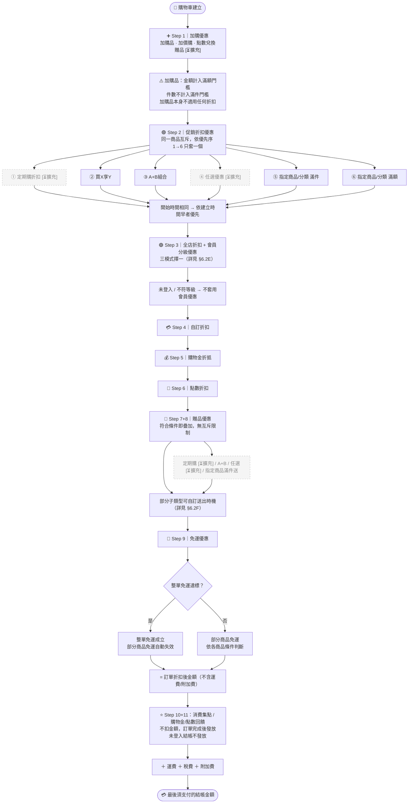
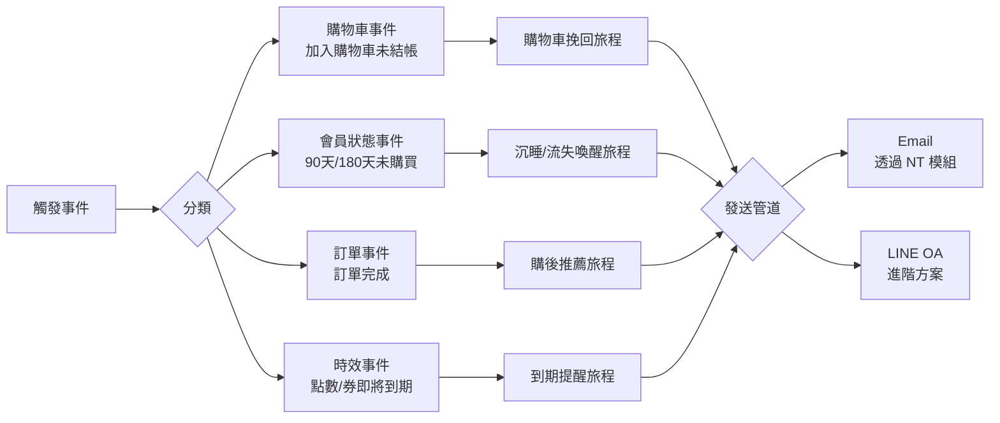
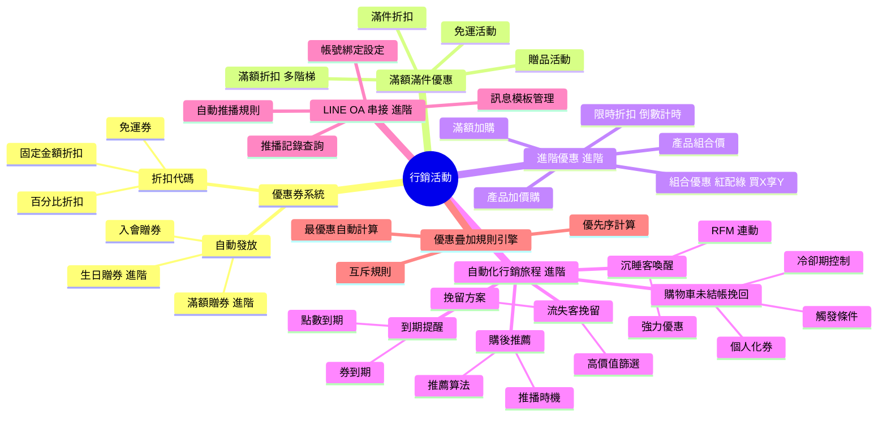
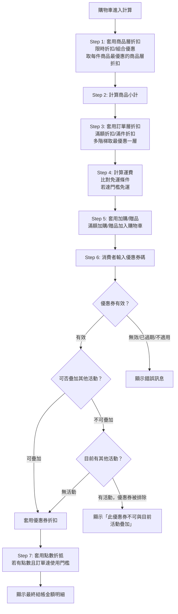
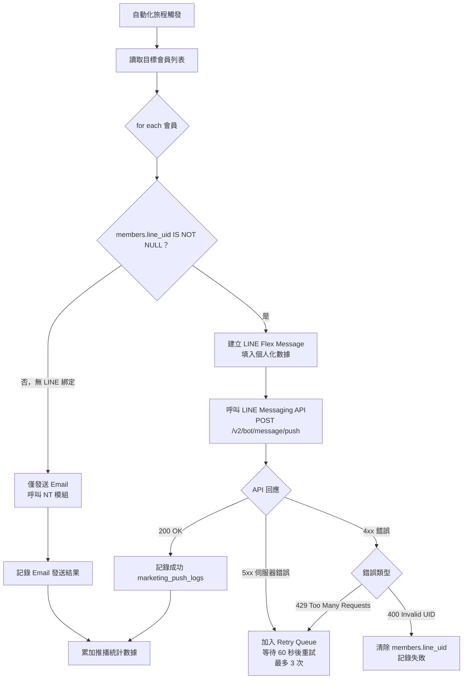

## 版本更新紀錄

| 版本 | 日期 | 修改內容 | 修改人 |
|------|------|----------|--------|
| v1.0 | 2026/04/27 | 初稿建立 | Una |
| v1.1 | 2026/05/19 | 依 promotion_rules_checklist.md（參考 SHOPLINE 2025.08 版計算規則）補充：§3.1 優惠計算完整 11 步驟與流程圖（取代原 5 層架構）；§3.3 優惠類型色標視覺規範；§6.2D 促銷折扣互斥優先序；§6.2E 全店折扣 + 會員分級三模式；§6.2F 贈品送出時機設定；§6.2G 免運優先序與計算基準；§6.6 回饋活動規格（新增）；§6.7 結帳頁金額明細顯示規格（新增）；§8.5 新增 6–9 工程師補充說明 | Una |
| v1.3 | 2026/05/21 | 新增進階電商包功能方案鎖定 UI 規格（依 plan-and-upgrade §13）：§6.2A 加購/組合優惠 Tab 鎖定行為（灰色 + 🔒 + popover）；§6.3 自動化行銷旅程整頁 Banner + Sidebar 鎖定規格；§6.4 LINE OA 串接整頁 Banner + 設定欄位 disabled 規格 | Una |
| v1.2 | 2026/05/21 | 依 2026-05-21 主會議 + 補充會議決議補強；新增 §6.2H 加購品分區、§6.2I 會員回饋負餘額開通、§6.2J 加購退款邊界、§6.6C 應收餘額對帳報表、§6.6D 應收註銷挽回通知（移交飛信）、§7 邊界情境彙整、§8.5.10～12 工程師補充；修改 §6.2D 衝突警示雙軌、§6.2F 贈品共用上限完整規格、§6.2G 免運計算基準前台揭露、§6.6B 雙模式追回（Mode A 預設 + Mode B 介面）、§6.7 加購分區 + 免運 ⓘ；新增關聯文件「優惠計算引擎技術規格 PRD」「Part4 後續擴充規劃 PRD」 | Una |

# Evomni — 行銷活動 產品需求文件 (PRD) v1.2

## 1. 文件資訊

| 屬性 | 內容 |
| --- | --- |
| 版本 | v1.3 |
| 日期 | 2026/05/21 |
| 需求來源 | Master PRD v1.0 Chapter 5（P0）、方案規格 V1.1、PRD V3 §3.2.7、**SHOPLINE 2025.08 版優惠計算規則檢核**（`inputs/prd/promotion_rules_checklist.md`） |
| 文件狀態 | **v1.3** — 新增進階電商包功能 plan-lock UI 規格（§6.2A Tab 鎖定、§6.3 自動化旅程整頁鎖定、§6.4 LINE OA 整頁鎖定）|
| 作者 | Una |
| 對應方案 | 電商啟航方案 ✅（基礎行銷）/ 進階電商包 ✅（自動化行銷 + LINE 串接） |
| 關聯文件 | [優惠計算引擎技術規格 PRD](Evomni_優惠計算引擎_技術規格_PRD.md)、[Part4 後續擴充規劃 PRD](Evomni_Part4_行銷活動_後續擴充規劃_PRD.md) |
| 特別說明 | LINE OA 為進階電商包的主要推播管道（PM 定案，2026/05/22）；§6.4 完整規格化 LINE Messaging API 串接設定、消費者授權流程、推播記錄查詢；技術實作細節由工程師評估 |
| 開發時程 | 階段一 5–8月（電商啟航方案）/ 階段二 9–12月（進階電商包）|

---

## 2. 目標與功能總覽

### 2.1 核心願景與相依性

**核心問題：**
PRD V3 的行銷活動模組定義了優惠券類型和滿額優惠規則，但以下四大自動化核心邏輯完全空白：
1. 購物車未結帳挽回的觸發條件、冷卻期、LINE/Email 發送邏輯
2. 沉睡客與流失客自動喚醒的觸發判斷 + RFM 連動
3. 購後關聯商品自動推薦的推薦算法觸發點
4. 點數/優惠券即將到期的促購提醒觸發

這四個功能全部屬於「進階電商包」專屬，是本方案最核心的差異化賣點。

**系統相依性（串接的 Evomni 模組）：**

| 模組 | 用途 |
| --- | --- |
| NT（發信模組） | 所有 Email 行銷觸發的實際發信介面；開信/點擊數據回傳 |
| Part 6 會員管理 | 分眾標籤（沉睡/流失/高價值）；點數到期資料；等級資料 |
| Part 3 訂單管理 | 購物車資料；訂單完成事件；退換貨事件 |
| Part 5 數據中心 | RFM 分群計算結果；購物車轉換漏斗數據 |
| LINE OA API | 進階電商包：自動化 LINE 訊息推播（需商家綁定 LINE Official Account）|
| ML（媒體庫） | 行銷 Email 內嵌商品圖片；Banner 圖片 |

---

### 2.2 功能總覽表

| 主功能模組 | 子功能項目 | 方案歸屬 | 功能目的 | 功能詳細描述 | 影響之使用者 |
| --- | --- | --- | --- | --- | --- |
| 優惠券系統 | 折扣代碼（活動贈券） | 兩方案共有 | 拉新與促購 | 商家建立折扣碼，消費者結帳時輸入；支援百分比/固定金額/免運；可設定使用次數、有效期、指定商品/分類 | 商家管理員、消費者 |
| 優惠券系統 | 入會贈券 | 兩方案共有 | 歡迎新會員 | 新會員完成帳號啟用後，系統自動發放設定的優惠券至會員帳戶 | 消費者 |
| 優惠券系統 | 滿額贈券 | 進階電商包 | 鼓勵提高客單價 | 訂單滿額後自動發放下次使用的優惠券（非折抵本筆訂單） | 消費者 |
| 優惠券系統 | 生日贈券 | 進階電商包 | 會員關懷 | 會員生日月份第一天自動發放生日優惠券，NT 同步發送生日祝福信 | 消費者 |
| 滿額/滿件優惠 | 滿額/滿件贈品 | 兩方案共有 | 帶動銷量 | 訂單達金額或件數門檻，自動加入贈品（指定商品）至購物車 | 消費者 |
| 滿額/滿件優惠 | 免運活動 | 兩方案共有 | 降低消費阻力 | 訂單達金額門檻自動免除運費；可設定時間範圍、適用商品/分類 | 消費者 |
| 滿額/滿件優惠 | 滿額折扣 | 兩方案共有 | 階梯式促購 | 訂單金額達門檻享折扣（百分比 or 固定金額），可設多階梯 | 消費者 |
| 滿額/滿件優惠 | 滿件折扣 | 兩方案共有 | 鼓勵多件購買 | 同款或指定分類商品買 N 件享折扣 | 消費者 |
| 進階優惠（進階電商包）| 滿額加購 | 進階電商包 | 提升客單價 | 訂單達門檻可以優惠價加購指定商品 | 消費者 |
| 進階優惠（進階電商包）| 產品加價購 | 進階電商包 | 帶動配件銷售 | 商品頁/購物車顯示可加價購的配件商品 | 消費者 |
| 進階優惠（進階電商包）| 產品組合價 | 進階電商包 | 組合銷售 | 指定多款商品組合一起購買享優惠價，庫存各自管理 | 消費者 |
| 進階優惠（進階電商包）| 限時折扣 | 進階電商包 | 製造購買緊迫感 | 商品指定時間區間內打折，商品頁顯示倒數計時 | 消費者 |
| 進階優惠（進階電商包）| 組合優惠（紅配綠/買X享Y）| 進階電商包 | 交叉銷售 | 指定 A 類商品 + B 類商品組合購買享優惠；或買 X 件享特定折扣 | 消費者 |
| 自動化行銷旅程 | 購物車未結帳挽回 | 進階電商包 | 提升結帳轉換率 | 加入購物車 N 小時未結帳，自動觸發 Email/LINE 推播含個人化優惠券 | 消費者 |
| 自動化行銷旅程 | 沉睡客喚醒 | 進階電商包 | 挽回沉睡會員 | 會員 90 天未購買，自動觸發喚醒 Email/LINE，帶專屬優惠 | 消費者 |
| 自動化行銷旅程 | 流失客挽留 | 進階電商包 | 挽回高價值流失客 | 高價值流失客（180 天未購 + RFM 高等級）觸發強力挽留優惠 | 消費者 |
| 自動化行銷旅程 | 購後推薦再行銷 | 進階電商包 | 帶動回購 | 訂單完成 N 天後，依購買商品類型推薦相關商品 + LINE/Email 推播 | 消費者 |
| 自動化行銷旅程 | 點數/優惠券到期提醒 | 進階電商包 | 促進到期前消費 | 點數或優惠券距到期 N 天，自動觸發提醒 Email/LINE | 消費者 |
| LINE OA 串接 | LINE 帳號綁定設定 | 進階電商包 | 前置配置 | 商家後台設定 LINE Channel Secret / Channel Access Token | 商家管理員 |
| LINE OA 串接 | 自動推播規則管理 | 進階電商包 | 控制 LINE 推播行為 | 商家可設定每個自動化旅程是否啟用 LINE 推播，及推播訊息模板 | 商家管理員 |

---

## 3. 全局功能流程

### 3.1 優惠計算完整順序（11 步驟）

> ⚠️ **重要**：系統依序判定購物車商品金額/件數是否達到各層優惠門檻，**每一層以上一層折後金額為計算基準**（非全部基於原價）。

> 📌 **計算邏輯主規格**：本章節描述商家後台對應的計算順序概念。**完整計算邏輯、邊界規則、API 介面契約**請參照 [優惠計算引擎技術規格 PRD §3](Evomni_優惠計算引擎_技術規格_PRD.md)，作為跨 Part3／Part4／Part5／Part6 的單一事實來源。

**計算順序（由上而下依序套用）：**

```
Step 1.  加購品 / 購物車加價購 / 點數兌換贈品
          ↳ 加購品金額計入全店滿額門檻；件數【不計入】滿件門檻
          ↳ 加購品本身不適用任何折扣（% 數或固定金額均不適用）

Step 2.  促銷折扣優惠（同一商品互斥，依優先序只套一個）
          ① 買X享Y  ② A+B組合
          ③ 指定商品/分類 滿件  ④ 指定商品/分類 滿額
          ↳ 開始時間相同的活動 → 依活動「建立時間早者」優先
          ↳ 買X享Y / A+B的金額及件數均計入全店門檻

Step 3.  會員分級預設優惠（詳見 §6.2E）
          ↳ 未登入 / 不符等級 → 不套用會員優惠

Step 4.  自訂折扣

Step 5.  購物金折抵

Step 6.  點數折扣

Step 7.  贈品優惠（符合條件即疊加，無互斥）
          ↳ 定期購 / A+B / 任選 / 指定商品分類 滿件送 / 指定商品分類 滿額送
          ↳ 部分子類型可自訂送出時機（詳見 §6.2F）

Step 8.  全店滿件送贈品（折扣後贈送）/ 全店滿額送贈品（可自訂：折扣後 or 折抵後）

Step 9.  免運優惠（整單優先，整單成立後部分商品免運自動失效）
          ↳ 全店 / 指定分類 整單免運；部分商品免運
          ↳ 計算基準可自訂（詳見 §6.2G）
─────────────────────────────────────
= 訂單優惠折扣後金額（不含運費/附加費）

Step 10. 消費集點（★ 不扣金額，影響集點計算）
Step 11. 回饋活動：購物金/點數回饋（★ 不扣金額，訂單完成後發放）
          ↳ 未登入結帳 → 不發放
─────────────────────────────────────
＋ 運費（若未達免運門檻）
＋ 稅費 / 附加費
= 最後須支付的結帳金額
```

**完整計算流程圖（Mermaid）：**



> 流程圖中 `[⏳擴充]` 與虛線節點為後續階段擴充功能，本階段不實作。完整規劃請見 [Part4 後續擴充規劃 PRD §3](Evomni_Part4_行銷活動_後續擴充規劃_PRD.md)。

**疊加規則摘要：**

| 規則 | 說明 |
| --- | --- |
| 同類型促銷折扣（Step 2）| 同一商品互斥，只帶入優先序最高的一個 |
| 不同 Step 之間 | 可疊加，依序套用 |
| 商家可設定不可疊加 | 優惠券可設「不可與任何活動疊加」開關（預設 OFF）|
| 贈品優惠 | 全部可疊加，無互斥限制 |

---

### 3.3 優惠類型色標視覺規範（後台 UI 規格）

> 後台所有優惠活動列表、活動設定頁，必須以色標 Tag 區分優惠類型，讓商家一眼識別活動性質。

| 色標 | 類型 | 後台 Tag 色碼 | 包含活動 |
|------|------|-------------|---------|
| 🔵 灰藍 | 加購優惠 | `#909399`（灰藍）| 加購品、購物車加價購、點數兌換贈品 |
| 🟣 紫 | 促銷優惠 | `#9B59B6`（紫）| 定期購折扣、買X享Y、A+B組合、任選優惠、指定商品/分類滿件/滿額 |
| 🟢 綠 | 折抵優惠 | `#67C23A`（綠）| 全店折扣、會員分級預設優惠、自訂折扣、購物金折抵、點數折扣 |
| 🟡 黃 | 贈品優惠 | `#E6A23C`（黃）| 各類贈品活動 |
| 🟠 橘 | 免運優惠 | `#E6581A`（橘）| 所有免運活動 |
| 🔴 粉紅 | 回饋活動 | `#F56C6C`（粉紅）| 消費集點、購物金回饋、點數回饋 |

**UI 規格：**
- 後台活動列表：每列最左側顯示色標 `<el-tag>` 類型標籤
- 同一頁面存在多種類型時，依色標排序（加購→促銷→折抵→贈品→免運→回饋）
- 新增活動時，表單頂部顯示「此活動屬於 [類型色標]」提示，讓商家確認分類

---

### 3.2 自動化行銷旅程觸發總覽



---

## 4. 功能結構圖



---

## 5. 使用者故事

| # | 角色 | 故事 |
| --- | --- | --- |
| US-01 | 商家管理員 | 身為商家管理員，我想要建立一個「滿 NT$3,000 送 NT$300 折扣券（下次使用）」的活動，以便鼓勵消費者回購。 |
| US-02 | 消費者 | 身為消費者，我想要在購物車頁面清楚看到目前離「免運門檻」還差多少金額，以便我決定是否加購。 |
| US-03 | 商家管理員 | 身為商家管理員，我想要設定購物車加入商品後 1 小時未結帳即自動發送挽回 Email + LINE，以便不讓潛在訂單流失。 |
| US-04 | 商家管理員 | 身為商家管理員，我想要設定「購物車挽回」功能每個會員每 7 天只觸發一次，以便不打擾消費者造成反感。 |
| US-05 | 商家管理員 | 身為商家管理員，我想要設定「90 天未購買的沉睡會員自動發送 9 折優惠券」的旅程，以便喚回這批會員。 |
| US-06 | 消費者 | 身為消費者，我想要在訂單完成 3 天後收到「根據我購買的商品推薦的相關商品」Line 訊息，以便發現可能需要的商品。 |
| US-07 | 商家管理員 | 身為商家管理員，我想要在 LINE OA 後台設定 Channel Access Token，以便電商系統可以透過我的官方帳號推播訊息。 |
| US-08 | 消費者 | 身為消費者，我想要在我的優惠券即將於 7 天後到期時收到 LINE 提醒，以便我不會忘記使用。 |
| US-09 | 商家管理員 | 身為商家管理員，我想要查看每個自動化旅程的觸發次數、Email 開信率、LINE 點擊率、最終轉換率，以便評估效果。 |
| US-10 | 商家管理員 | 身為商家管理員，我想要設定「任選 A 區商品 + B 區商品組合購買折 NT$200」的紅配綠活動，以便清庫存並帶動配件銷售。 |

---

## 6. UI/UX 與詳細功能需求

### 6.1 優惠券管理（後台）

#### A. 核心使用者流程
後台「行銷活動」→「優惠券管理」→ 查看優惠券列表 → 新增/編輯優惠券。

#### B. 優惠券列表頁

**頁面結構：**
```
[頁面標題：優惠券管理]
[Tab 列]  [折扣代碼] [自動發放券]
[工具列]  [搜尋框] [狀態篩選] [類型篩選] [新增優惠券]
[優惠券 Table]
```

**Table 欄位：**

| 欄位 | 寬度 | 說明 |
| --- | --- | --- |
| 券名稱/代碼 | 200px | 顯示券名稱；折扣代碼另起一行以 `code style` 顯示 |
| 類型 | 100px | `<el-tag>` 百分比折扣/固定金額/免運 |
| 折扣內容 | 120px | 文字描述，例：折 10% / 折 NT$200 |
| 有效期 | 160px | 開始 ~ 結束日期；已到期顯示「已到期」Tag（紅色）|
| 使用上限 / 已使用 | 120px | 例：100 / 已使用 32；無上限顯示「無上限」|
| 發放對象 | 120px | 全體會員 / 指定等級 / 指定標籤 / 手動發放 |
| 狀態 | 100px | `<el-tag>` 進行中（綠）/ 未開始（灰）/ 已到期（紅）/ 已停用（灰）|
| 操作 | 120px | 編輯 / 停用 / 複製 |

#### C. 新增/編輯優惠券表單（`<el-dialog>` 或獨立頁面）

**基本設定區塊：**

| 欄位 | 元件 | 驗證規則 |
| --- | --- | --- |
| 券名稱 | `<el-input>` | 必填；最多 50 字；Placeholder：「例：新年感謝折扣券」|
| 優惠類型 | `<el-radio-group>` | 必選：百分比折扣 / 固定金額折扣 / 免運 |
| 折扣數值 | `<el-input-number>` | 必填；百分比：1-99 整數；固定金額：min 1；免運此欄隱藏 |
| 最高折扣上限（百分比） | `<el-input-number>` | 選填；設定後折扣金額不超過此值；Tooltip：「例：設定 9 折且上限 NT$500，消費 NT$10,000 也最多折 NT$500」|
| 優惠券代碼 | `<el-input>` + 「自動生成」按鈕 | 必填；英數字 4-20 碼；自動生成 8 碼英數組合；唯一性驗證（重複顯示：「此代碼已被使用，請更換」）|

**使用條件區塊：**

| 欄位 | 元件 | 說明 |
| --- | --- | --- |
| 最低訂單金額 | `<el-input-number>` NT$ | 選填；預設 0（無門檻）；Tooltip：「消費者訂單金額需達到此金額才可使用」|
| 適用商品/分類 | `<el-radio>` + 選擇器 | 選項：全部商品 / 指定分類 / 指定商品；選「指定」後顯示搜尋選擇器 |
| 排除商品 | `<el-select>` 多選 | 選填；顯示「此券不適用商品」（輸入商品名稱搜尋）|
| 可否與其他優惠疊加 | `<el-switch>` | 預設 OFF（不可疊加）；開啟代表此券可與任何活動疊加 |

**發放設定區塊：**

| 欄位 | 元件 | 說明 |
| --- | --- | --- |
| 有效期 | `<el-date-picker>` type="daterange" | 必填；開始日期不可早於今天 |
| 發放方式 | `<el-radio-group>` | 手動輸入代碼 / 自動發放（入會/生日/滿額）|
| 使用次數上限（全站） | `<el-input-number>` | 選填；0 代表無上限 |
| 每人使用次數上限 | `<el-input-number>` | 必填；預設 1；最大 99 |
| 發放對象（自動發放時）| `<el-select>` | 全體會員 / 指定等級 / 指定分眾標籤 |

---

### 6.2 滿額/滿件優惠設定（後台）

#### A. 活動列表

**路徑：** 後台「行銷活動」→「滿額/滿件優惠」

**Tab 分類：** 贈品活動 / 免運活動 / 折扣活動 / 加購活動（進階）/ 組合優惠（進階）

**方案鎖定呈現規格（啟航方案使用者）：**
- 「加購活動」和「組合優惠」Tab 以灰色樣式顯示，Tab 右側加 🔒 icon
- 點擊後不切換頁籤內容，改以 `<el-popover>` 顯示：「此功能屬於進階電商包。如需開通，歡迎聯繫營運輔導顧問。」+ `[聯繫營運輔導顧問]` text link
- 進階電商包使用者：Tab 正常顯示，無鎖定效果

#### B. 建立活動通用欄位

| 欄位 | 元件 | 驗證規則 |
| --- | --- | --- |
| 活動名稱 | `<el-input>` | 必填；最多 50 字 |
| 活動期間 | `<el-date-picker>` type="datetimerange" | 必填 |
| 適用方案 | `<el-checkbox-group>` | 選填；可限定僅特定會員等級 |
| 適用商品範圍 | `<el-radio>` + 選擇器 | 全部商品 / 指定分類 / 指定商品 |
| 活動說明（前台顯示）| `<el-input type="textarea">` | 選填；最多 100 字；顯示於購物車旁說明文字 |
| 是否啟用 | `<el-switch>` | 預設 OFF，手動開啟生效 |

#### C. 各類活動特殊欄位

**贈品活動額外欄位：**

| 欄位 | 元件 | 說明 |
| --- | --- | --- |
| 條件類型 | `<el-radio>` | 滿 NT$X 送贈品 / 滿 N 件送贈品 |
| 條件數值 | `<el-input-number>` | 必填 |
| 贈品商品 | 商品搜尋選擇器（`<el-select>` 遠端搜尋）| 必填；贈品商品需有庫存；贈品單價建議設為 NT$0 |
| 贈品數量 | `<el-input-number>` | 必填；最少 1 |
| 贈品庫存不足時 | `<el-radio>` | 自動停止送贈品（推薦）/ 繼續但不發贈品 |

**限時折扣額外欄位（進階電商包）：**

| 欄位 | 元件 | 說明 |
| --- | --- | --- |
| 折扣類型 | `<el-radio>` | 百分比折扣 / 固定金額折扣 |
| 折扣數值 | `<el-input-number>` | 必填 |
| 前台倒數計時顯示 | `<el-switch>` | 開啟後商品頁顯示「距活動結束 HH:MM:SS」倒數 |
| 顯示原價劃除 | `<el-switch>` | 開啟後在折扣價旁顯示原價（劃除樣式）|

**組合優惠（紅配綠）額外欄位（進階電商包）：**

| 欄位 | 元件 | 說明 |
| --- | --- | --- |
| A 組商品 | 分類 or 商品多選 | 紅組；例：上衣系列 |
| B 組商品 | 分類 or 商品多選 | 綠組；例：褲子系列 |
| 優惠條件 | `<el-radio>` | A + B 各一件享折扣 / A + B 各一件享固定金額折扣 |
| 優惠數值 | `<el-input-number>` | 必填 |

---

### 6.2D 促銷折扣互斥規則與優先序（Step 2 計算邏輯補充）

> ⚠️ 工程師必讀：§3.1 Step 2 的互斥規則詳細規格如下

**六種促銷折扣子類型的優先序（同一商品只帶入一個）：**

| 優先序 | 子類型 | 對應功能 |
|--------|--------|---------|
| 1（最高）| 定期購折扣優惠 | 定期購商品專屬折扣 |
| 2 | 買X享Y折扣優惠 | 指定商品買 X 件享 Y 折/固定金額 |
| 3 | A+B 組合折扣優惠 | 紅配綠組合購買享優惠 |
| 4 | 任選優惠折扣優惠 | 任選 N 件享折扣 |
| 5 | 指定商品/分類 滿件優惠 | 指定範圍購滿 N 件享折扣 |
| 6（最低）| 指定商品/分類 滿額優惠 | 指定範圍滿 NT$X 享折扣 |

**同時間活動衝突處理：**
- 若多個活動開始時間相同，依活動「建立時間較早者」優先帶入

#### 6.2D.1 後台衝突警示時機（v1.2 新增）

> 依 2026-05-21 會議決議：採「即時警告 + 列表頁長期標示」**雙軌**。

**雙軌規格：**

**(a) 活動建立／編輯時的即時警示**
- 觸發點：商家於活動建立或編輯頁點擊「儲存」時
- 掃描範圍：僅掃描 `status IN ('active', 'scheduled')` 的活動，`status = 'draft'` 不掃（避免商家草稿一堆誤觸發）
- 衝突判定：適用商品有重疊 AND 時間範圍有重疊 AND 同優先序
- 警示形式：`<el-message-box type="warning">` 彈窗，**不阻擋儲存**
- 警示內容範例：「⚠️ 此活動將與『夏日清倉 9 折』於 2026/06/01 起重疊。系統將依建立時間先後決定實際套用的活動。」
- 提供「我了解，繼續儲存」「修改活動」兩個選項

**(b) 活動列表頁長期標示**
- 衝突活動於列表「狀態」欄位旁加 ⚠️ 角標
- Hover 顯示衝突活動名稱清單
- 衝突活動其中一個下架後，角標自動消失

**驗收項目：**
1. 衝突活動其中一個下架後，列表標示需自動消失
2. 建立時間相同的活動，警告需明示「依建立時間早者優先套用」這條規則

**後台 UI 規格：**
- 活動列表「當前狀態」欄，顯示「實際套用中」（綠）或「被覆蓋」（灰）標籤
- 衝突活動加 ⚠️ 角標於狀態欄旁
- 前台商品頁：顯示目前套用的促銷標籤名稱（不顯示被覆蓋的活動）

**Schema 影響：**
- `marketing_activities` 表新增 `conflict_with_activity_ids JSON DEFAULT NULL` 欄位（由排程或儲存事件計算更新）
- 對應 index：`(status, applicable_scope, start_at, end_at)`

**門檻計算補充：**
- 買X享Y / A+B組合 / 任選優惠的商品金額及件數均計入全店優惠的「滿額」與「滿件」門檻
- 加購品金額計入全店「滿額」門檻，但**件數不計入**「滿件」門檻

---

### 6.2E 全店折扣優惠 + 會員分級預設優惠（Step 3 計算邏輯補充）

> 商家須在「電商基本設定 > 促銷規則設定」中選定三種模式之一，影響全站所有訂單計算。

**三種套用模式（三擇一）：**

| 模式 | 名稱 | 套用規則 | 適用情境 |
|------|------|---------|---------|
| 🅐 | 選最優者 | 全店折扣 vs 會員分級優惠，自動取折扣金額較大者套用 | 大多數品牌適用的預設模式 |
| 🅑 | 全店疊最後 + 會員優惠 | 全店折扣套用後，再疊加會員分級預設優惠 | 希望全店活動和會員優惠雙重加碼 |
| 🅒 | 全店疊多組 + 會員優惠 | 多個全店折扣活動可同時疊加，再加上會員分級預設優惠 | 複雜促銷活動期（謹慎使用）|

**未登入 / 不符等級的處理：**
- 消費者未登入 → 不套用任何會員分級預設優惠
- 消費者登入但不符合任何等級條件 → 不套用會員優惠，仍套用全店折扣

**結帳頁明細：** 需分別顯示「全店折扣」與「會員折扣」兩個來源標籤（不可合併為一行）

**後台設定頁位置：** 行銷活動 → 促銷規則設定 → 全店折扣套用模式（單選，變更時顯示確認提醒）

---

### 6.2F 贈品優惠送出時機設定（Step 7+8 細節規格）

> 贈品優惠符合條件即疊加，不互斥。部分子類型支援「送出時機」自訂。

| 子類型 | 可自訂送出時機 | 選項 |
|--------|-------------|------|
| 定期購贈品 | ❌ 固定 | — |
| A+B 組合贈品 | ❌ 固定 | — |
| 任選優惠贈品 | ❌ 固定 | — |
| 指定商品/分類 滿件送贈品 | ❌ 固定 | — |
| 指定商品/分類 滿額送贈品 | ✅ 可自訂 | 折扣前 / 折扣後 / 購物金點數折抵後 |
| 全店滿件送贈品 | ❌ 固定 | 折扣後贈送 |
| 全店滿額送贈品 | ✅ 可自訂 | 折扣後 / 購物金點數折抵後 |

**後台 UI：**
- 支援自訂時機的活動，設定頁顯示 `<el-radio-group>`：「門檻計算時機」
  - `折扣前金額達標即送（較寬鬆）`
  - `折扣後金額達標才送（較嚴格）`（全店滿額送、指定分類滿額送的預設值）
  - `購物金/點數折抵後金額達標才送（最嚴格）`
- Tooltip 說明：「舉例：訂單原價 NT$1,500，折扣後 NT$1,200，折抵後 NT$1,000。設定滿 NT$1,100 送贈品：選『折扣後』✅ 可送，選『折抵後』❌ 不送」

**贈品庫存不足時：** 依活動設定（停止送贈品 or 繼續但不發）執行，前台顯示「此贈品庫存不足，已自動移除」。

#### 6.2F.1 贈品同時觸發上限（v1.2 新增）

> 依 2026-05-21 補充會議議題 3 + PM 補充裁決：採「方案 B 增強版」—— 共用上限 + 各活動單獨設定 + 純視覺差異 + 白話用詞。

##### A. 後台共用上限設定

**位置**：行銷活動 → 行銷設定 → **贈品同時觸發上限（共用）**

| 欄位 | 元件 | 規格 |
|------|------|------|
| 共用上限數值 | `<el-input-number>` | 預設值 10；範圍 1–15（系統硬上限） |
| 提示文字 | 純文字 | 「所有活動如果沒有自己設定，會用這個數字」 |

##### B. 各活動單獨設定

活動建立頁的「贈品上限」欄位：

| 欄位 | 元件 | 規格 |
|------|------|------|
| 贈品上限 | `<el-input-number>` | 選填；不填即用共用上限 |
| placeholder | 純文字 | 「不填 = 使用共用上限 10」（10 為當前共用上限值） |
| 上限值範圍 | — | 1–15 |

##### C. 活動列表頁呈現規格

採**純視覺差異**（無 badge、無 icon、無 tooltip）：

| 狀態 | 視覺 |
|------|------|
| 使用共用上限 | 常規字重 / 文字色 `#888`（淺灰） |
| 單獨設定 | **粗體** / 文字色 `#1f1f1f`（深黑） |

- 表頭加註小字「★ 加粗為單獨設定」（協助色弱使用者）
- 無 hover tooltip

##### D. 批次操作

- 活動列表頁支援「篩選 + 全選 + 批次設定上限」
- 批次設定彈窗：選擇「使用共用上限」或「設定為 X」
- 商家活動數 > 100 時的批次操作分頁邏輯待 UI/UX + 前端評估

##### E. 錯誤訊息白話化

範例：商家在某活動單獨設定 20（超過硬上限 15）：

```
❌ 超過系統可接受上限 15
你在「行銷設定 → 贈品上限」填的共用上限是 10，
這個活動可以單獨設定 1～15 之間的數字。
```

##### F. 系統執行行為

| 情境 | 系統行為 |
|------|---------|
| 觸發贈品數 ≤ 共用上限／單獨設定值 | 正常發放 |
| 觸發贈品數 > 設定值且 ≤ 硬上限 15 | 後端 log warning，前端正常發放 |
| 觸發贈品數 > 硬上限 15 | 前端阻擋，提示「已達系統上限」|

##### G. 用詞規範（PRD 全文一致）

| 禁用詞 | 改用 |
|--------|------|
| 全域預設 / 全域預設值 | 共用上限 |
| fallback | （不出現，改用敘述語） |
| override / 覆寫 | 單獨設定 |

##### H. 前台購物車贈品顯示

| 情境 | Desktop | Mobile |
|------|---------|--------|
| 1～5 組贈品 | 全部展開為完整卡片 | 1～3 組全展開 |
| 6 組以上 | 第 6 組起折疊為可點擊「+N 項贈品」卡片 | 第 4 組起折疊 |

折疊卡片需保留：
- 整體贈品總數
- 可點擊展開的視覺提示（向下箭頭）
- 點擊後展開完整列表，再次點擊可收起
- 贈品商品在購物車清單中獨立顯示（標示「贈品」Tag，非正常商品品項，不計入金額）

> 📌 **後續擴充提示**：本章節提及的「贈品共用上限排程切換」屬於後續階段擴充功能，本階段不實作。完整規劃請見 [Part4 後續擴充規劃 PRD §E-04](Evomni_Part4_行銷活動_後續擴充規劃_PRD.md)。

---

### 6.2G 免運優惠優先序與計算基準（Step 9 細節規格）

> ⚠️ 工程師必讀：整單免運與部分商品免運有嚴格的優先序，不可同時套用。

**免運子類型與優先序：**

| 優先序 | 子類型 | 計算基準可自訂 |
|--------|--------|-------------|
| 1（最高）| 全店滿件整單免運 | ❌ 固定 |
| 1（最高）| 全店滿額整單免運 | ✅ 折扣後 / 購物金點數折抵後 |
| 1（最高）| 指定商品/分類 滿件整單免運 | ❌ 固定 |
| 1（最高）| 指定商品/分類 滿額整單免運 | ✅ 折扣後 / 購物金點數折抵後 |
| 2（最低）| 部分商品免運 | ❌ 固定（依商品設定）|

**優先序規則：**
- 系統**先判斷整單免運**條件（全店或指定分類）
- 整單免運條件成立 → **部分商品免運自動失效**，不再套用，前台不顯示部分商品的免運標籤
- 多個整單免運活動同時成立 → 全部生效（訂單整單免運，不重複計算）

**計算基準說明（可自訂者）：**
- `折扣後金額`：訂單金額扣除 Step 2-4 折扣後的金額（不含購物金/點數折抵）
- `購物金點數折抵後金額`：再扣除 Step 5-6 折抵後的金額（較嚴格）

**前台購物車顯示：**
- 未達整單免運：顯示「距免運還差 NT$XXX」（依活動設定的計算基準即時更新）
- 達整單免運：顯示「✅ 您已享有免運優惠」，部分商品免運標籤不顯示

#### 6.2G.1 前台計算基準揭露規格（v1.2 新增）

> 依 2026-05-21 會議決議：主文案維持簡潔，加 ⓘ 圖示揭露計算基準；後台選項旁也加 tooltip 說明。

##### A. 前台「距免運還差」顯示

```
距免運還差 NT$XXX ⓘ
                  ↑ 圖示位置：金額後方、行高內對齊
```

| 裝置 | 互動 |
|------|------|
| Desktop | hover ⓘ → 顯示 tooltip |
| Mobile | tap ⓘ → 顯示 toast 2 秒 |

##### B. Tooltip 文案

依商家在後台設定的計算基準動態顯示：

| 後台設定 | 前台 tooltip 文字 |
|---------|----------------|
| 折扣後金額 | 免運門檻依折扣後金額計算 |
| 折抵後金額 | 免運門檻依購物金/點數折抵後金額計算 |

##### C. 後台選項旁 tooltip

行銷活動 → 免運活動設定頁，「計算基準」欄位旁加 ⓘ 圖示：

```
計算基準：[折扣後金額 ▼] ⓘ ← hover 顯示說明
```

Tooltip 內容：
> 折扣後金額：訂單金額扣除促銷、會員、自訂折扣後的金額（不含購物金/點數折抵）
> 折抵後金額：再扣除購物金、點數折抵後的金額（較嚴格）
> 舉例：訂單原價 1,500，折扣後 1,200，折抵後 1,000。若免運門檻設 1,100：選「折扣後」✅ 達標、選「折抵後」❌ 未達標

##### D. 即時同步規格

- 商家後台切換計算基準 → 前台 tooltip 文字必須即時更新，不可 cache 舊文案
- 實作建議：tooltip 文案隨 API response 同步回傳，不寫死於前端

---

### 6.2H 加購品視覺隔離規格（v1.2 新增）

> 依 2026-05-21 會議議題 4 決議：購物車與訂單詳情頁採獨立分區。

#### A. 購物車頁面分區規格

```
┌─ 商品 ───────────────────────────────┐
│ [商品卡片 1]                          │
│ [商品卡片 2]                          │
└──────────────────────────────────────┘

┌─ 加購商品 ────────────────────────── ┐   ← 區塊標題
│  ┌────────────────────────────────┐  │   ← 淡灰底（#f5f5f5）
│  │ [加購品卡片 1]                  │  │
│  │ [加購品卡片 2]                  │  │
│  └────────────────────────────────┘  │
└──────────────────────────────────────┘
```

| 規格 | 說明 |
|------|------|
| 分區背景 | 淡灰底色 `#f5f5f5` |
| 區塊標題 | 「加購商品」固定文字 |
| 卡片標籤 | **不再加「加購」標籤**（避免重複資訊） |
| 折扣顯示 | 加購品卡片不顯示任何折扣標籤（即使該品在其他情境會有折扣） |
| 數量控制 | 加購品數量可調整（依加購活動設定的可購上限） |
| 移除 | 加購品可獨立移除，不影響原商品 |

#### B. 訂單詳情頁分區規格

同步購物車分區邏輯（[Part3 訂單管理 PRD](../inputs/prd/01_核心模組/Evomni_Part3_訂單管理_PRD.md) §6.2 需同步修訂）。

#### C. 結帳頁明細顯示（連動 §6.7）

§6.7 結帳頁金額明細顯示結構需新增「加購商品」分區，金額計算位置：
- 加購品金額計入 `購物車商品金額` 總計
- 加購品金額計入「滿額」門檻判斷
- 加購品件數不計入「滿件」門檻判斷（§3.1 Step 1 規則）

---

### 6.2I 會員回饋負餘額（Mode B）商家自助開通設定（v1.2 新增）

> 依 PM 補充裁決：採商家自助開通；v1.2 完成開通設定 UI + audit log，**後端 Mode B 邏輯排 v1.3**。
>
> 📌 **後續擴充提示**：本章節對應的 Mode B 後端實作屬後續階段擴充，本階段僅提供開通設定 UI。完整規劃請見 [Part4 後續擴充規劃 PRD §E-05](Evomni_Part4_行銷活動_後續擴充規劃_PRD.md)。

#### A. 後台位置

**設定 → 行銷設定 → 進階功能 → 會員回饋負餘額**

#### B. 介面元素

| 元素 | 規格 |
|------|------|
| Toggle 開關 | 預設關閉（Mode A）；開啟即切換 Mode B |
| 警示說明 | 開關上方固定顯示警告框（`<el-alert type="warning">`）：「開啟後，會員回饋追回時若餘額不足將顯示為負值，可能引起客訴。建議先諮詢營運顧問。」 |
| 二次確認彈窗 | 點擊開啟時跳 `<el-message-box>`，必須勾選「我已了解負餘額可能造成的會員體驗影響」才能確認 |
| 開通／關閉記錄 | audit log 記錄誰、什麼時候開／關，便於事後追查（顯示位置：操作日誌）|
| 已開通狀態 | 設定頁顯示「目前模式：負餘額模式」`<el-tag type="success">`；後台首頁也加小提示 |

#### C. 切換規則（v1.2 預留設計，後端 v1.3 完成）

| 情境 | 系統行為（v1.3） |
|------|----------------|
| Mode A → Mode B | 既有「應收記錄」自動轉換為負餘額（直接寫入會員錢包）|
| Mode B → Mode A | 既有負餘額會員 → 視為「應收記錄」，餘額顯示回 0 |
| 切換時通知 | 已有負餘額會員需發站內通知告知模式變更 |

#### D. v1.2 範圍說明

v1.2 僅實作開通介面，後端切換邏輯預留 schema 空間但不執行：
- 後台 toggle 可開關，但實際發放／追回邏輯仍走 Mode A（應收記錄）
- 開通狀態存於 `system_settings.negative_balance_allowed`，v1.2 不影響實際邏輯
- 商家可預先了解此功能，並表達啟用意願供後續評估

#### E. v1.3 啟動條件

詳見 [Part4 後續擴充規劃 PRD §E-05](Evomni_Part4_行銷活動_後續擴充規劃_PRD.md)。

---

### 6.2J 加購退款邊界規格（v1.2 新增）

> 依 2026-05-21 補充會議議題 4 決議：**不重算原折扣 + 退款單揭露文案**。

#### A. 基本規則

訂單一旦完成視為定案，退款時：

| 規則 | 說明 |
|------|------|
| 退款金額 | 僅退加購品本身金額 |
| 原訂單折扣 | **不重算、不解除** |
| 點數回饋 | 不回扣（保留原回饋）|
| 滿額門檻 | 不重新判定 |

#### B. 退款單揭露文案

退款單下方固定位置顯示說明文案：

```
因加購品退回，原訂單滿額條件 NT$XXX 已未達成，差額由商家承擔。
```

- 文案來源：v1.2 系統內建固定（未來可編輯性詳見 [優惠計算引擎 §8.3](Evomni_優惠計算引擎_技術規格_PRD.md) 設計取向待定）
- 文案定稿流程：Andy（客服）主筆 → PM Lee + Eva 共審 → v1.2 上線前定稿
- 顯示時機：當退款動作的原訂單包含加購品且加購品「金額」是促成滿額門檻達成的關鍵時

#### C. 6 條邊界情境（測試案例必涵蓋）

| # | 情境 | 預期行為 |
|---|------|---------|
| 1 | 加購品有達原始門檻 + 退加購品 | 不影響原折扣（無揭露文案） |
| 2 | 加購品有達原始門檻 + 退原商品 | 原商品退了，加購品條件破壞，加購品改為加購未成立的處理（細部規格待開發前討論） |
| 3 | 加購品「金額」幫助達滿額門檻 + 退加購品 | 不解除原折扣 + 顯示揭露文案 |
| 4 | 加購品「件數」幫助達滿件門檻 | 規則 §一明說件數不計入，此條 N/A |
| 5 | 部分退款（退一半加購品數量） | 比例退款；揭露文案視差額是否仍存在決定 |
| 6 | 多筆加購品 + 退其中一筆 | 不觸發重算 |

#### D. 跨 PRD 連動

- [Part3 訂單管理 §6.3C](../inputs/prd/01_核心模組/Evomni_Part3_訂單管理_PRD.md) 需同步補退款計算規格
- [優惠計算引擎 §6.4](Evomni_優惠計算引擎_技術規格_PRD.md) 已收錄此規則作為跨模組共用邏輯

> 📌 **後續擴充提示**：本章節提及的「揭露文案商家可編輯」屬於後續階段擴充功能，本階段不實作。完整規劃請見 [Part4 後續擴充規劃 PRD §E-06](Evomni_Part4_行銷活動_後續擴充規劃_PRD.md)。

---

### 6.3 自動化行銷旅程（進階電商包）

**後台路徑：** 「行銷活動」→「自動化行銷」

**方案鎖定呈現規格（啟航方案使用者，依 plan-and-upgrade §13）：**

- **Sidebar**：「自動化行銷」選單項目灰色顯示，右側加 🔒 icon；點擊後 Tooltip（不跳頁）：「此功能屬於進階電商包。如需開通，歡迎聯繫營運輔導顧問。」+ `[聯繫營運輔導顧問]` text link
- **功能頁頂部 Banner**（若直接瀏覽 URL 進入）：
  ```
  背景：#F0F9FF，左側 3px 藍色邊條，padding 12px 16px
  [ⓘ] 此功能屬於「進階電商包」，您目前使用的是「電商啟航方案」。
       如需升級或了解進階功能，歡迎聯繫我們的營運輔導顧問。
       [聯繫營運輔導顧問]（text link）
  ```
- **旅程卡片**：啟航方案下所有旅程卡片的「啟用開關」為 disabled 狀態，hover 提示「進階電商包功能」

**頁面結構：**
```
[頁面標題：自動化行銷旅程]
[旅程卡片列表]（每個旅程一張卡片）
  每張卡片：旅程名稱 / 說明 / 觸發次數（本月）/ 轉換率 / [啟用開關] [設定按鈕]
```

---

#### 6.3.1 購物車未結帳挽回旅程（⚠️ P0 核心規格）

**旅程說明：** 消費者將商品加入購物車但未完成結帳時，在指定時間後自動觸發挽回訊息（Email + LINE），並可選擇自動附上專屬折扣券。

##### A. 觸發條件設定

| 設定欄位 | 元件 | 預設值 | 驗證規則 |
| --- | --- | --- | --- |
| 旅程啟用開關 | `<el-switch>` | OFF | — |
| 觸發等待時間 | `<el-input-number>` + `<el-select>` 分鐘/小時 | 1 小時 | 必填；最短 30 分鐘；最長 24 小時 |
| 觸發條件 | 固定邏輯，不可修改 | — | 購物車有商品 AND 未進入結帳流程 AND 等待時間已過 |
| 冷卻期 | `<el-input-number>` 天 | 7 天 | 必填；每個會員在冷卻期內不重複觸發；最短 1 天；最長 90 天 |
| 是否附上優惠券 | `<el-switch>` | OFF | — |
| 附上的優惠券 | `<el-select>`（選現有優惠券）| — | 「是否附上優惠券」開啟時必填 |
| 最低購物車金額 | `<el-input-number>` NT$ | 0（不限） | 選填；低於此金額的購物車不觸發 |

##### B. 觸發邏輯規格（⚠️ 工程師必讀）

**觸發判斷流程（後端排程，每 5 分鐘執行）：**

```
1. 查詢所有「有商品 + 最後更新時間距今 >= 觸發等待時間 + 尚未觸發過本次旅程」的購物車
2. 對每個購物車：
   a. 確認 member_id 非空（訪客購物車不觸發）
   b. 確認該 member_id 在冷卻期內未觸發過此旅程（查 marketing_triggers 表）
   c. 確認購物車金額 >= 最低購物車金額設定
3. 符合條件者：
   a. 產生個人化挽回連結（含 cart recovery token，有效期 48 小時）
   b. 若有設定優惠券：為該會員產生一次性優惠券（或發放至帳戶）
   c. 呼叫 NT 模組發送 Email
   d. 若商家已綁定 LINE OA 且會員已綁定 LINE：呼叫 LINE OA API 發送訊息
   e. 寫入 marketing_triggers 表記錄（member_id, journey_type, triggered_at）
4. 消費者點擊挽回連結：還原購物車 + 套用優惠券（若有）
5. 消費者完成結帳：記錄轉換事件
```

**Cart Recovery Token 安全規格：**
- Token 格式：UUID v4
- 儲存：`cart_recovery_tokens` 表（token, member_id, cart_snapshot_json, expires_at, used）
- 有效期：48 小時
- 使用後標記 `used = true`，不可重複使用
- 點擊連結恢復購物車時，若商品已售完，顯示「部分商品已售完，已更新購物車」提示

##### C. Email 模板規格

**信件主旨（後台可設定）：**
- 預設：「🛒 您有商品等待帶走！」
- 可插入變數：`{會員姓名}`、`{購物車商品數}`、`{購物車金額}`

**Email 內容區塊（後台可編輯）：**

```
[問候區塊]
  Hi {會員姓名}，您的購物車還有 {N} 件商品正在等您！
[商品列表區塊]（最多顯示 3 件，超過顯示「+N 件」）
  商品縮圖 | 商品名稱 | 規格 | 單價
[優惠區塊（若有）]
  🎁 我們為您準備了專屬優惠！使用代碼 {折扣碼} 可享 X 折優惠
  有效期：{到期日}
[CTA 按鈕]
  [立即結帳] 連結至 cart recovery 連結
[警示文字]（小字）
  此連結有效期為 48 小時
```

##### D. LINE OA 訊息模板規格

**訊息類型：** Flex Message（卡片型）

**訊息結構：**

```json
{
  "type": "bubble",
  "header": {
    "type": "box",
    "contents": [
      {"type": "text", "text": "🛒 您的購物車有商品等您！", "size": "sm", "weight": "bold"}
    ]
  },
  "body": {
    "type": "box",
    "contents": [
      {"type": "text", "text": "{會員姓名} 您好", "size": "sm"},
      {"type": "text", "text": "購物車共 {N} 件商品，總計 NT${金額}", "size": "sm"},
      // 商品列表（最多 2 件）
      {
        "type": "image",
        "url": "{商品縮圖 URL}",
        "aspectRatio": "20:13"
      },
      {"type": "text", "text": "{商品名稱}", "size": "sm"},
      // 優惠碼（若有）
      {"type": "text", "text": "🎁 輸入 {折扣碼} 享 X 折", "color": "#F56C6C", "size": "sm"}
    ]
  },
  "footer": {
    "type": "box",
    "contents": [
      {
        "type": "button",
        "action": {
          "type": "uri",
          "label": "立即結帳",
          "uri": "{cart recovery 連結}"
        },
        "style": "primary",
        "color": "#303133"
      }
    ]
  }
}
```

---

#### 6.3.2 沉睡客與流失客自動喚醒旅程（⚠️ P0 核心規格）

**旅程說明：** 依 Part 6 會員管理的自動標籤（沉睡客：90-180 天未購；流失客：>180 天未購），自動觸發喚醒旅程。

##### A. 設定欄位

| 設定欄位 | 元件 | 說明 |
| --- | --- | --- |
| 旅程啟用開關 | `<el-switch>` | 沉睡客旅程和流失客旅程各自獨立設定 |
| 觸發條件 | 固定：連動 Part 6 沉睡/流失標籤 | 由每日排程計算；標籤更新時觸發 |
| 冷卻期 | `<el-input-number>` 天，預設 30 天 | 同一會員 30 天內不重複觸發 |
| 發送時間 | `<el-time-picker>` | 預設 10:00；避免深夜打擾 |
| 沉睡喚醒優惠券 | `<el-select>` 選優惠券 | 選填；建議設定 9 折或 NT$50 折扣 |
| 流失挽留優惠券 | `<el-select>` 選優惠券 | 選填；建議設定更強力的優惠 |
| RFM 連動（流失旅程）| `<el-switch>` | 開啟後，流失旅程只針對「RFM 高價值分群」觸發（避免對低價值流失客過度行銷）|

##### B. 觸發邏輯規格

**沉睡客觸發（每日排程，於設定發送時間執行）：**

```
1. 從 Part 6 取得當日標籤更新後的「沉睡客」會員列表
2. 過濾冷卻期（查 marketing_triggers 表）
3. 符合條件者：發送沉睡喚醒 Email + LINE（同購物車挽回的發送流程）
4. 寫入 marketing_triggers 記錄
```

**流失客觸發（每日排程，連動 RFM）：**

```
1. 從 Part 6 取得「流失客」標籤會員列表
2. 若開啟 RFM 連動：進一步篩選 RFM 分群中 R ≤ 4 個月（近期有消費過但現在流失）的會員
3. 過濾冷卻期
4. 觸發流失挽留旅程
```

##### C. Email/LINE 訊息模板規格

**沉睡喚醒 Email 主旨：**「{會員姓名}，我們想念您！回來看看有什麼新品 🎁」

**流失挽留 Email 主旨：**「{會員姓名}，我們為您保留了一份專屬優惠」

**LINE 訊息：** Flex Message（同購物車挽回格式），CTA 按鈕導至商店首頁或指定分類頁

---

#### 6.3.3 購後關聯商品自動推薦旅程（⚠️ P0 核心規格）

**旅程說明：** 訂單完成後 N 天，系統依消費者購買的商品類型，推薦相關商品（例：買了相機推薦相機包、記憶卡）。

##### A. 設定欄位

| 設定欄位 | 元件 | 說明 |
| --- | --- | --- |
| 旅程啟用開關 | `<el-switch>` | — |
| 觸發等待時間 | `<el-input-number>` 天，預設 3 天 | 訂單完成後 N 天觸發 |
| 推薦商品來源 | `<el-radio>` | 自動算法 / 手動設定交叉銷售規則 |
| 冷卻期 | `<el-input-number>` 天，預設 14 天 | 同一會員 14 天內不重複 |
| 是否附上優惠券 | `<el-switch>` | 選填 |

##### B. 推薦商品算法規格

**推薦算法（依優先序選擇）：**

| 優先序 | 算法 | 說明 |
| --- | --- | --- |
| 1 | 手動交叉銷售規則 | 商家在商品後台設定「購買此商品的人也常買：[商品列表]」|
| 2 | 分類關聯推薦 | 推薦同分類下近 30 天最熱銷的前 3 件商品（排除已購過的）|
| 3 | 全站熱銷推薦 | 若無同分類商品，推薦全站近 30 天熱銷前 5 件（排除已購過的）|

**排除規則：**
- 已購過的商品不推薦（查該會員所有已完成訂單）
- 庫存 = 0 的商品不推薦
- 已下架商品不推薦

##### C. LINE/Email 模板規格

**Email 主旨：**「您可能也需要這些 🛍️」

**Email 內容：**

```
[問候]：感謝您最近購買了 {商品名稱}！
[推薦區塊]：根據您的購買，我們為您推薦...
  [商品卡片 x 3]：圖片 / 名稱 / 價格 / [加入購物車] 按鈕
[CTA]：[瀏覽更多商品]
```

---

#### 6.3.4 點數/優惠券到期提醒旅程（⚠️ P0 核心規格）

**旅程說明：** 點數或優惠券即將到期時，主動提醒消費者趁期限前使用。

##### A. 設定欄位

| 設定欄位 | 元件 | 說明 |
| --- | --- | --- |
| 點數到期提醒啟用 | `<el-switch>` | — |
| 點數到期提醒提前天數 | `<el-input-number>` 天，預設 30 天 | 與 Part 6 點數設定同步（若 Part 6 已設定，此處同步顯示）|
| 優惠券到期提醒啟用 | `<el-switch>` | — |
| 優惠券到期提醒提前天數 | `<el-input-number>` 天，預設 7 天 | 最短 1 天；最長 30 天 |

##### B. 觸發邏輯規格

**點數到期提醒（由 Part 6 每日排程觸發，回調至此旅程）：**
- Part 6 排程在偵測到「N 天後到期的點數批次」時，呼叫行銷旅程 API
- 行銷旅程執行 Email + LINE 發送
- 同一到期批次只通知一次

**優惠券到期提醒（每日排程）：**
- 每日掃描會員帳戶中 `expires_at` 距今 ≤ 提醒天數 的優惠券
- 未通知過者（`reminder_sent_at IS NULL`）：觸發通知，更新 `reminder_sent_at`

---

### 6.4 LINE OA 串接設定（進階電商包）

**方案鎖定呈現規格（啟航方案使用者，依 plan-and-upgrade §13）：**

- **Sidebar**：「LINE OA 設定」選單項目灰色顯示，右側加 🔒 icon；點擊後 Tooltip（不跳頁）：「此功能屬於進階電商包。如需開通，歡迎聯繫營運輔導顧問。」+ `[聯繫營運輔導顧問]` text link
- **功能頁頂部 Banner**（若直接瀏覽 URL 進入）：
  ```
  背景：#F0F9FF，左側 3px 藍色邊條，padding 12px 16px
  [ⓘ] 此功能屬於「進階電商包」，您目前使用的是「電商啟航方案」。
       如需開通，歡迎聯繫我們的營運輔導顧問。
       [聯繫營運輔導顧問]（text link）
  ```
- **設定欄位**：啟航方案下所有輸入欄位 disabled，[驗證連線] 按鈕 disabled

#### A. 後台 LINE OA 設定頁

**路徑：** 後台「行銷活動」→「LINE OA 設定」（或「全域設定 > 電商進階設定 > LINE OA 設定」）

**設定欄位：**

| 欄位 | 元件 | 驗證規則 |
| --- | --- | --- |
| LINE Channel ID | `<el-input>` | 必填；數字字串 |
| LINE Channel Secret | `<el-input>` type="password" | 必填；儲存後顯示 `****`，提供「重新設定」按鈕 |
| LINE Channel Access Token | `<el-input>` type="password" | 必填；儲存後顯示 `****` |
| [驗證連線] 按鈕 | `<el-button type="primary">` | 點擊後呼叫 LINE API 驗證 Token 有效性，顯示成功/失敗結果 |
| Webhook URL | `<el-input>` disabled | 系統自動產生；消費者在 LINE 點擊連結後的 Webhook 接收位址 |

**驗證成功顯示：**
`<el-alert type="success">` 「LINE OA 連線成功！帳號名稱：{OA 名稱}，粉絲數：{N}人」

**驗證失敗顯示：**
`<el-alert type="error">` 「連線失敗，錯誤碼：{code}。請確認 Channel Access Token 是否正確，並確保 LINE OA 已啟用 Messaging API。」

#### B. LINE 推播授權機制

消費者需同意接收 LINE 推播，才可觸發 LINE 訊息：

1. 消費者在前台「個人資料」頁，顯示「LINE 推播通知」區塊
2. 點擊「綁定 LINE」→ 導向 LINE 授權頁（OAuth）
3. 消費者同意後，系統取得消費者的 LINE UID，儲存至 `members.line_uid`
4. 往後自動化旅程觸發時，先確認 `members.line_uid IS NOT NULL` 才發送 LINE

**取消推播：**
消費者可在「個人資料」頁點擊「解除 LINE 綁定」→ 清除 `members.line_uid`，往後不再發送 LINE 訊息。

#### C. 推播記錄查詢（後台）

**路徑：** 後台「行銷活動」→「推播記錄」

**Table 欄位：**

| 欄位 | 說明 |
| --- | --- |
| 發送時間 | `YYYY/MM/DD HH:mm` |
| 旅程名稱 | 購物車挽回/沉睡喚醒/流失挽留/購後推薦/到期提醒 |
| 發送管道 | Email / LINE |
| 發送對象（數量）| N 人 |
| 成功發送 | N 人 |
| 失敗/退信 | N 人 |
| 開信/點擊率（Email）| X% |
| 點擊率（LINE）| X% |
| 最終轉換（下單）| N 人（X%）|

---

### 6.6 回饋活動（Step 10+11，兩方案共有基礎 / 進階電商包完整版）

> ⚠️ 回饋活動**不影響結帳金額**，是訂單完成後的事後發放機制。

#### A. 回饋活動子類型

| 子類型 | 方案歸屬 | 觸發條件 | 發放時機 |
|--------|---------|---------|---------|
| 消費回饋點數 | 兩方案共有 | 每筆完成訂單依比例回饋（商家設定換算比率）| 訂單狀態 → 「完成」後發放 |
| 消費集點 | 進階電商包 | 訂單達集點門檻（可設定每 NT$X 集 1 點）| 訂單狀態 → 「完成」後發放 |
| 購物金回饋 | 進階電商包 | 依折扣後金額達到門檻後發放購物金 | 訂單狀態 → 「完成」後發放 |
| 點數回饋 | 兩方案共有 | 推薦新會員首購、生日回饋等指定事件 | 各事件觸發後即時發放 |

**發放時機精確定義（【註六】）：**
- 購物金回饋、消費集點：訂單狀態由「已送達」→「完成」時觸發（消費者確認收貨或 7 天後自動完成）
- 未登入完成結帳的訂單：**不觸發任何回饋**
- 訂單退款/取消後的回饋追回規則（見 §6.6B）

#### B. 回饋活動退款追回規則（⚠️ 工程師必讀）

> v1.2 修訂：依 2026-05-21 主會議議題 5 + 補充會議議題 2 決議，改為**雙模式**規格（Mode A 預設、Mode B 後端 v1.3）。

**雙模式對照：**

| 情境 | Mode A（v1.2 預設）| Mode B（v1.2 開通介面已具備、後端 v1.3）|
|------|-------------------|----------------------------------|
| 全額退款 | 全額追回 | 同 Mode A |
| 部分退款 | 依比例追回：`原回饋 × (退款金額 / 訂單原始金額)` | 同 Mode A |
| 餘額充足 | 直接從會員錢包扣回 | 同 Mode A |
| 餘額不足 | 扣到 0 為止，差額記「應收記錄」 | 直接顯示負餘額 |
| 退貨後尚未發放（訂單未完成）| 不發放、無需追回 | 同 Mode A |

**應收記錄規格（v1.2 新增）：**

```sql
CREATE TABLE reward_receivable_records (
  id              BIGINT AUTO_INCREMENT PRIMARY KEY,
  member_id       BIGINT NOT NULL,
  amount          DECIMAL(10,2) NOT NULL COMMENT '應收金額（正數）',
  type            ENUM('points', 'wallet') NOT NULL,
  source_order_id BIGINT NOT NULL,
  status          ENUM('pending', 'recovered', 'voided') DEFAULT 'pending',
  created_at      DATETIME DEFAULT CURRENT_TIMESTAMP,
  expires_at      DATETIME NOT NULL COMMENT 'created_at + 6 個月',
  recovered_at    DATETIME DEFAULT NULL,
  voided_at       DATETIME DEFAULT NULL,
  INDEX idx_member_status (member_id, status)
);
```

**應收抵扣邏輯：**
- 會員下次取得新回饋時，引擎先檢查 `pending` 應收記錄
- 新回饋金額優先抵扣應收，剩餘部分才入會員錢包
- 抵扣完的應收記錄 status 改為 `recovered`

**註銷邏輯：**
- 每日排程掃描 `expires_at < NOW() AND status = 'pending'` 的記錄
- 註銷規則：**以「應收產生日 + 6 個月」為準**（非最後訂單日）
- 註銷時 status 改為 `voided`，並寫入 audit log

**既有 DB 補充：**
```sql
-- member_point_logs 表需增加 reference_type 和 reference_id
ALTER TABLE member_point_logs ADD COLUMN reference_type ENUM('order','refund','manual','expiry') NOT NULL;
ALTER TABLE member_point_logs ADD COLUMN reference_id BIGINT DEFAULT NULL;
-- 退款追回紀錄：reference_type = 'refund'，amount 為負數
```

#### C. 後台回饋活動設定頁

**路徑：** 行銷活動 → 回饋活動設定

**設定欄位：**

| 欄位 | 元件 | 說明 |
|------|------|------|
| 消費回饋點數比率 | `<el-input-number>` | 每消費 NT$X 回饋 1 點；0 = 停用 |
| 購物金回饋門檻 | `<el-input-number>` NT$ | 訂單達此金額後發放購物金；0 = 每筆均發放 |
| 購物金回饋金額 | `<el-input-number>` NT$ | 達門檻後發放的固定購物金金額 |
| 回饋計算基準 | `<el-radio>` | 依折扣後金額 / 依原始訂單金額（建議：折扣後）|
| 是否允許部分退款追回 | `<el-switch>` | 開啟後啟動 §6.6B 部分退款追回邏輯 |

#### D. 結帳頁回饋預覽（前台）

- 消費者已登入時，結帳頁底部顯示：「完成此訂單後將獲得 XX 點 / NT$XX 購物金」
- 未登入時不顯示此提示（不觸發回饋）
- 顯示時機：訂單金額計算完成後（使用折扣後金額計算預計回饋）

#### 6.6C 商家後台應收餘額異動報表（v1.2 新增）

> 依 2026-05-21 補充會議議題 2 決議：商家端**不顯示**應收，僅商家後台對帳報表顯示。

##### A. 路徑

**行銷活動 → 回饋活動設定 → 應收餘額對帳報表**（或整合於 Part5 數據中心）

##### B. 報表規格

**分欄：**
| 欄位 | 說明 |
|------|------|
| 日期 | 報表日 |
| 實際發放 | 該日發放給會員的點數/購物金總額 |
| 實際扣抵 | 該日從會員錢包追回的總額 |
| 應收註銷 | 該日因 6 個月過期而註銷的應收總額 |
| 應收餘額（期末）| 該日所有 `status = pending` 的應收總額 |

**資料來源：** `reward_receivable_daily_snapshot` 表（由優惠計算引擎提供，詳見 [優惠計算引擎 §7.4](Evomni_優惠計算引擎_技術規格_PRD.md)）

**視覺化建議：** 交由 Part5 數據中心呈現「應收餘額異動」趨勢圖

##### C. 會員端規範

> ⚠️ 會員交易明細**不顯示**任何應收／註銷資訊，所有應收處理對會員透明。

#### 6.6D 應收註銷前挽回通知（v1.2 移交飛信 PRD）

> 依 2026-05-21 補充會議議題 2 決議：「註銷前 30 天挽回通知」不寫進 Part4，移交為飛信電子報 PRD 的會員旅程觸發點。

- 觸發條件：應收記錄 `expires_at - 30 天 = NOW()`
- 通知範本由飛信 PRD 定義
- 本章節僅列出觸發點作為連動需求

---

### 6.7 結帳頁金額明細顯示規格（前台 UI）

> 消費者在結帳頁必須能清楚看到每一層折扣的來源與金額。

#### A. 金額明細顯示結構（v1.2 修訂）

```
購物車商品金額          NT$ X,XXX
  ┌── 一般商品 ──────────────────
  │  - 商品 A
  │  - 商品 B
  ├── 加購商品（淡灰底）────────  ← v1.2 新增分區（§6.2H）
  │  - 加購品 X
  │  - 加購品 Y
  └─────────────────────────────
  ─ [促銷活動名稱]     - NT$ XXX       ← Step 2 促銷折扣（顯示活動名稱）
  ─ [全店折扣名稱]     - NT$ XXX       ← Step 3 全店折扣（顯示活動名稱）
  ─ [會員折扣 Lv.X]   - NT$ XXX       ← Step 3 會員分級優惠（顯示等級名稱）
  ─ 自訂折扣           - NT$ XXX       ← Step 4
  ─ 購物金折抵         - NT$ XXX       ← Step 5
  ─ 點數折抵           - NT$ XXX       ← Step 6（顯示折抵點數數量）
  🎁 贈品：[贈品商品名] NT$ 0          ← Step 7+8（獨立列出，不計入金額）
  ─────────────────────────────────
  = 訂單折扣後金額      NT$ X,XXX
  + 運費 ⓘ             NT$ XXX（或「免運」）  ← v1.2 新增 ⓘ 揭露計算基準（§6.2G）
  + 稅費               NT$ XX
  ─────────────────────────────────
  = 最後須支付金額      NT$ X,XXX
```

#### B. 顯示規則

| 規則 | 說明 |
|------|------|
| 每折扣項目需顯示來源標籤 | 使用活動名稱（非類型名稱），例：「夏日清倉 9 折」而非「全店折扣」|
| 贈品獨立列出 | 贈品不混入商品品項，金額為 NT$0，標示「🎁 贈品」Tag |
| 購物金/點數折抵後運費重算 | 購物金折抵（Step 5）或點數折抵（Step 6）完成後，免運門檻需依更新後金額重新判斷 |
| 「距免運還差」動態提示 | 依活動設定的計算基準（折扣後 or 折抵後）即時計算並顯示，購物金/點數輸入後即時更新 |
| 未套用的折扣不顯示 | 若某層無折扣，該行不顯示（不顯示 NT$0 的折扣行）|
| 回饋預覽 | 已登入者在最後須支付金額下方顯示「完成後獲得 XX 點/NT$XX 購物金」灰色提示文字 |
| 加購品分區（v1.2 新增）| 在「購物車商品金額」展開項中獨立分區，淡灰底（§6.2H 規範） |
| 距免運提示加 ⓘ（v1.2 新增）| 「距免運還差 NT$XXX ⓘ」（§6.2G.1 規範） |
| 加購品不顯示折扣（v1.2 新增）| 加購品列項旁不顯示任何折扣標籤 |

---

### 6.5 購物車頁面優惠進度提示（前台）

消費者在購物車頁面，必須看到當前適用的優惠及距下一層優惠的差距：

**購物車優惠進度條（`<el-progress>`）：**

```
[免運進度條]
目前消費：NT$ X,XXX
還差 NT$ XXX 即可享免運！
[=====     ] 70%

[下一階優惠提示]
再消費 NT$ XXX 享 9 折優惠
```

- 已達到的優惠：顯示 ✅ + 優惠說明
- 贈品活動：顯示「再消費 NT$X 可獲贈 [贈品名稱]」

---

### 6.8 邊界情境與測試案例彙整（v1.2 新增）

> 依 Eva（QA）建議，本期 PRD 將高風險邊界情境集中於本章，便於 QA 撰寫測試案例。

| # | 情境 | 來源章節 | 預期行為 |
|---|------|---------|---------|
| 1 | 同一商品符合多個促銷折扣 | §6.2D | 依優先序 1→6 取一；前台顯示套用活動名 |
| 2 | 開始時間相同的多個活動 | §6.2D | `created_at` 早者優先 |
| 3 | 未登入顧客結帳 | §6.2E、§6.6 | 不套用會員優惠、不發放回饋 |
| 4 | 加購品 + 全店滿件門檻 | §3.1、§6.2H | 件數不計入、金額計入 |
| 5 | 整單免運 + 部分商品免運同時成立 | §6.2G | 整單優先，部分免運不顯示／不套用 |
| 6 | 贈品「折抵後」設定但顧客未折抵 | §6.2F | 依當下金額判斷，條件不成立則不送 |
| 7 | 回饋活動訂單取消／部分退款 | §6.6B | Mode A 應收記錄、Mode B 負餘額（v1.3）|
| 8 | A+B 組合件數計入滿件門檻 | §6.2D | 計入全店滿件門檻 |
| 9 | 加購品退款解除原折扣 | §6.2J | 不重算 + 揭露文案 |
| 10 | 多組贈品超過軟上限 10 | §6.2F | 後端 log warning；超過硬上限 15 前端阻擋 |
| 11 | 加購品有達原始門檻 + 退原商品 | §6.2J #2 | 加購品條件破壞處理（待開發前細部討論） |
| 12 | 部分退加購品數量 | §6.2J #5 | 比例退款，揭露文案視差額判斷 |
| 13 | Mode A 應收餘額未抵扣即過期 | §6.6B | 註銷並寫 audit log，會員端不顯示 |

---

## 7. 細部邏輯流程圖

### 7.1 優惠套用優先序計算流程



### 7.2 LINE OA 發送完整流程



---

## 8. 非功能性需求

### 8.1 效能需求

| 項目 | 標準 |
| --- | --- |
| 優惠計算（購物車更新）| ≤ 500ms；每次更新購物車重新計算所有優惠 |
| 購物車挽回排程（每 5 分鐘）| 每次執行 ≤ 2 分鐘完成（10 萬活躍購物車以內）|
| LINE 推播批次速率 | 遵守 LINE API 限制：500 messages/second；超過限制使用 multicast API 分批發送 |
| 沉睡/流失旅程每日排程 | 00:00 ~ 02:00 完成 |
| 優惠券有效性驗證（結帳時）| ≤ 200ms |

### 8.2 安全性需求

| 項目 | 規格 |
| --- | --- |
| Cart Recovery Token | UUID v4；48 小時有效；使用後失效；不可重複使用 |
| LINE Channel Secret | 加密儲存（AES-256）；不可在前端顯示 |
| LINE Channel Access Token | 加密儲存；API 呼叫時解密使用；禁止在 Log 中出現 |
| 優惠券代碼唯一性 | DB 唯一索引；建立時驗證衝突 |
| 推播權限 | 消費者明確同意（opt-in）才可發送 LINE；取消後立即停止 |

### 8.3 資料一致性

- 優惠套用必須在訂單建立的 Transaction 內完成，確保優惠券「使用次數」和「會員已使用記錄」同步扣減
- LINE 推播失敗不影響主業務流程（Email 和 LINE 發送異步執行）
- Cart Recovery Token 使用後在同一 Transaction 內標記 `used = true`，防止並發重複使用

### 8.4 瀏覽器/裝置支援

| 環境 | 要求 |
| --- | --- |
| 後台 | Chrome 110+、Edge 110+、Firefox 110+；桌機最低 1280px |
| 前台購物車/優惠顯示 | 手機（375px+）、平板（768px+）、桌機；RWD |

---

## 8.5 工程師確認補充（v1.1 更新，2026/04/28）

### 8.5.1 購物車挽回計時：以最後一次異動時間為準

`carts` 表必須有 `last_updated_at DATETIME` 欄位，每次購物車有任何變動（新增/刪除/修改數量）時更新。購物車挽回旅程的觸發計時從 `last_updated_at` 起算，不是從第一次加入商品起算。

### 8.5.2 訪客購物車不觸發挽回旅程

**v1.0 明確規格**：購物車挽回旅程**僅針對已登入會員的購物車**，訪客（Cookie/Session 購物車）不觸發。

訪客在同一 Session 中登入後，購物車合併為會員購物車，**合併後的會員購物車**才納入挽回監控（計時從合併時重新開始）。

### 8.5.3 優惠券使用的 Race Condition 防護

使用 DB 唯一索引保證冪等性：

```sql
CREATE TABLE coupon_usages (
  id           BIGINT AUTO_INCREMENT PRIMARY KEY,
  coupon_id    BIGINT NOT NULL,
  member_id    BIGINT NOT NULL,
  order_id     BIGINT NOT NULL,
  used_at      DATETIME DEFAULT CURRENT_TIMESTAMP,
  UNIQUE KEY uq_coupon_member (coupon_id, member_id)  -- 每人每券限一次
);
```

結帳時嘗試 INSERT，若 Duplicate Key → 回傳 `409 COUPON_ALREADY_USED`。全域使用次數限制用 Redis `INCR coupon:{id}:usage_count` 原子操作。

### 8.5.4 優惠 5 層計算基準：每層以上一層折後金額為基準

**決策**：每一層的計算基準都是上一層折後的金額（非全部基於原價）。

滿額門檻判斷亦以折後金額為準（較嚴格）。例：原價 1,000 元，Layer 1 限時折扣後 900 元，「滿 1,000 才折」的活動**不適用**（因折後為 900 元）。

### 8.5.5 行銷旅程去重表正式 Schema

```sql
CREATE TABLE marketing_journey_logs (
  id              BIGINT AUTO_INCREMENT PRIMARY KEY,
  member_id       BIGINT NOT NULL,
  journey_type    ENUM('cart_recovery','sleep_wakeup','churn_winback',
                       'post_purchase','points_expiry','coupon_expiry'),
  triggered_at    DATETIME DEFAULT CURRENT_TIMESTAMP,
  cooldown_ends_at DATETIME NOT NULL,
  channel         ENUM('email','line','both'),
  reference_id    BIGINT DEFAULT NULL,
  result          ENUM('sent','failed','skipped'),
  INDEX idx_member_journey (member_id, journey_type, cooldown_ends_at)
);
```

去重查詢：`WHERE member_id = ? AND journey_type = ? AND cooldown_ends_at > NOW()`

---

### 8.5.6 促銷折扣同一商品互斥的 Race Condition

同一商品同時符合多個促銷折扣活動（Step 2）時，系統**在結帳時才計算**（非加入購物車時），確保即時套用最新活動狀態。

```
計算邏輯（後端 service 層）：
1. 取得購物車中各商品的所有適用活動
2. 依優先序 1→6 排序；相同優先序則依 created_at ASC 排序
3. 取第一個（最高優先）活動套用到該商品
4. 不符合任何活動 → 商品按原價計算
```

前台商品頁顯示：目前套用的促銷標籤（活動名稱），若有多個活動存在但只套一個，不顯示其他活動標籤。

### 8.5.7 全店滿額整單免運的即時更新

消費者在購物車輸入購物金/點數折抵時，免運門檻計算基準若為「購物金點數折抵後金額」，需即時重新判斷免運條件並更新前台顯示：

- 前端：監聽購物金/點數 input change 事件 → 觸發 debounce 500ms → 重新呼叫優惠計算 API
- 後端：優惠計算 API 接收當前購物金/點數輸入值，重新計算 Step 9 免運條件

### 8.5.8 多組贈品同時達標的購物車處理

```sql
-- 贈品以獨立行項存入購物車，不影響正常商品計算
cart_items:
  product_id  INT
  quantity    INT
  unit_price  DECIMAL(10,2)
  is_gift     TINYINT(1) DEFAULT 0   -- 1 = 贈品，不計入金額
  gift_activity_id  BIGINT           -- 關聯的贈品活動 ID
```

贈品庫存不足時：依活動設定處理，並在 cart_items 中標記 `is_available = 0`，前台顯示「此贈品庫存不足，已自動移除」。

### 8.5.9 回饋活動與訂單退款的原子性保護

回饋追回（§6.6B）需在退款 Transaction 內完成，確保退款金額和回饋扣回同步：

```
BEGIN TRANSACTION
  1. 呼叫金流退款 API
  2. IF 成功：
       a. 更新訂單狀態 = 退款完成
       b. 計算追回點數/購物金（依退款比例）
       c. 寫入 member_point_logs（amount 為負數，reference_type = 'refund'）
       d. 更新 members.point_balance / wallet_balance
       e. 餘額不足時寫入 reward_receivable_records（Mode A）/ 直接記負餘額（Mode B，v1.3）
  3. COMMIT / ROLLBACK
```

### 8.5.10 應收記錄抵扣的 Transaction 保護（v1.2 新增）

```
新回饋發放 BEGIN TRANSACTION
  1. 取得會員 pending 應收記錄總額 R
  2. 新回饋金額 N：
     IF N >= R: 抵扣全部應收（status → recovered），剩餘 (N - R) 入錢包
     IF N < R:  部分抵扣（按 FIFO 抵扣最早的應收記錄）
  3. 寫入 member_point_logs / member_wallet_logs
  4. COMMIT
```

### 8.5.11 贈品上限的前後端校驗（v1.2 新增）

- **後端**：訂單建立時最終校驗，超過硬上限 15 直接拒絕（回傳 `GIFT_LIMIT_EXCEEDED`）
- **前端**：購物車計算時即時校驗，超過該活動單獨設定值（或共用上限）→ 後端 log warning 但前端正常顯示；超過硬上限 → 前端阻擋並提示

### 8.5.12 negative_balance_allowed v1.2 行為（v1.2 新增）

- 設定可開可關，但 v1.2 引擎完全忽略此設定，所有計算走 Mode A
- 開關事件寫 audit log，提供未來 v1.3 上線時統計商家意願
- 確保 v1.2 → v1.3 升級時，已開啟的商家可無痛切換

---

## 與團隊溝通摘要

### v1.2 變更要點

- 依 SHOPLINE 2025.08 規則檢核 + 兩場跨組會議決議補強 Part4：新增 5 個章節（§6.2H 加購分區、§6.2I 負餘額開通、§6.2J 加購退款、§6.6C 應收對帳報表、§6.6D 挽回通知移交、§6.8 邊界情境彙整）；修改 6 個章節（§3.1 流程圖 + 引擎連結、§6.2D 衝突警示雙軌、§6.2F 贈品共用上限、§6.2G 免運 ⓘ、§6.6B 雙模式追回、§6.7 加購分區）；新增 §8.5.10～12 工程補充；新增 2 份關聯文件（優惠計算引擎技術規格、Part4 後續擴充規劃）
- 設計取向待定項目集中於 [優惠計算引擎 §8](Evomni_優惠計算引擎_技術規格_PRD.md)，3 處於開發前與工程師討論確認

### 跨 PRD 連動清單

| PRD | 連動修訂內容 |
|-----|-------------|
| Part3 訂單管理 | §6.3C 加購退款 6 條邊界；訂單詳情頁加購分區（§6.2H） |
| Part5 數據中心 | 應收餘額異動視覺化（連動 §6.6C） |
| Part6 會員管理 | §6.6 會員錢包雙模式；`negative_balance_allowed` 設定 |
| 會員前台個人中心 | 「待入帳」「待扣回饋」UI 狀態預留（v1.3 啟用） |
| 飛信電子報 | 應收註銷前 30 天挽回通知 ticket |
| Master PRD | §6 子文件索引新增引擎 + 後續擴充規劃兩份；§8 版本紀錄補一筆 |

### 設計師連動（v1.2 新增 4 份設計稿需求）

1. 衝突警示彈窗 + 列表角標
2. 贈品折疊卡片（Desktop / Mobile 兩版）
3. 距免運 ⓘ tooltip（Desktop hover / Mobile toast）
4. 加購品分區（購物車 + 結帳頁）

### 工程師重點（含 v1.2 新增）

1. 購物車挽回的排程每 5 分鐘執行一次，要注意不要因為執行時間過長導致「重複觸發」問題，建議加 distributed lock（Redis）防止排程重疊
2. LINE Messaging API 有速率限制（500 msg/sec），超過時需使用 multicast API 分批發送
3. Cart Recovery Token 的並發保護：同一 Token 可能被點擊兩次（雙擊），需在 DB 用 SELECT FOR UPDATE 鎖定避免重複使用
4. 優惠套用的計算邏輯（§7.1 流程圖）必須完整實作優先序，不可自行調整順序
5. LINE Channel Access Token 的加密存儲是安全性要求，需確認 Laravel 的加密設定（`APP_KEY`）
6. **v1.2 新增**：`reward_receivable_records` 表的應收抵扣需在新回饋發放 Transaction 內完成（§8.5.10）
7. **v1.2 新增**：`negative_balance_allowed` 設定變更需 audit log；v1.2 只記錄不執行 Mode B 邏輯（§8.5.12）
8. **v1.2 新增**：贈品上限「共用 vs 單獨設定」需於前端動態判斷視覺差異
9. **v1.2 新增**：加購品分區需在 cart / order detail 兩個前端 component 同步實作
10. **v1.2 新增**：`marketing_activities.conflict_with_activity_ids` 由排程或儲存事件計算更新，前端不直接寫入

### 設計師重點（含 v1.2 新增）

1. 前台購物車頁的「優惠進度條」是重要轉換設計，進度條和文案要讓消費者「想再多買一點」
2. 限時折扣的倒數計時（HH:MM:SS）需用前端 JavaScript 即時更新，設計時預留計時數字的固定寬度避免版面跳動
3. 自動化行銷旅程後台的「旅程卡片列表」要清楚顯示每個旅程的開關和本月數據

### 依賴模組

本模組依賴 **Part 6 會員管理**（分眾標籤、點數到期資料）、**Part 3 訂單管理**（購物車資料、訂單完成事件）、**NT 發信模組**（Email 發送）

### 關鍵待確認事項

- ~~LINE Open API 串接可行性~~ ✅ **已定案（2026/05/22）**：LINE OA 為進階電商包主要推播管道，方向確定，工程師評估技術實作細節；§6.4 規格依此前提全數生效
- 引擎 PRD §8 三項設計取向待定（開票事件 webhook、會計期間欄位、退款文案可編輯預留 schema）於開發前與工程師討論確認
