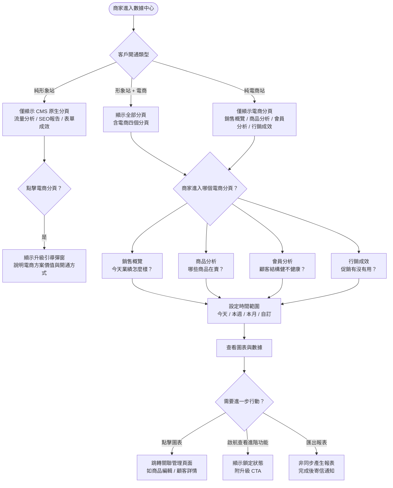
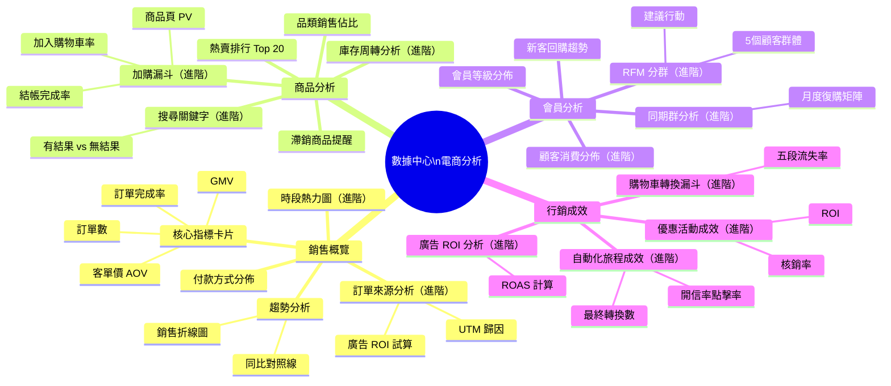
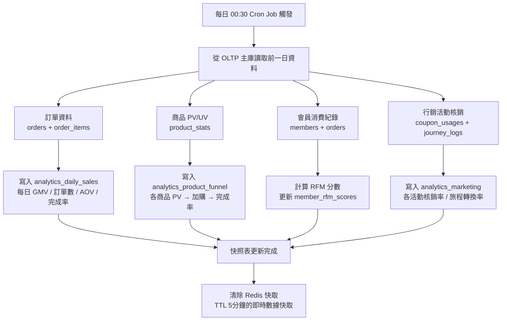
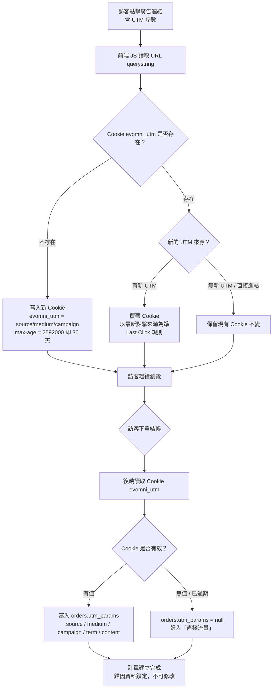
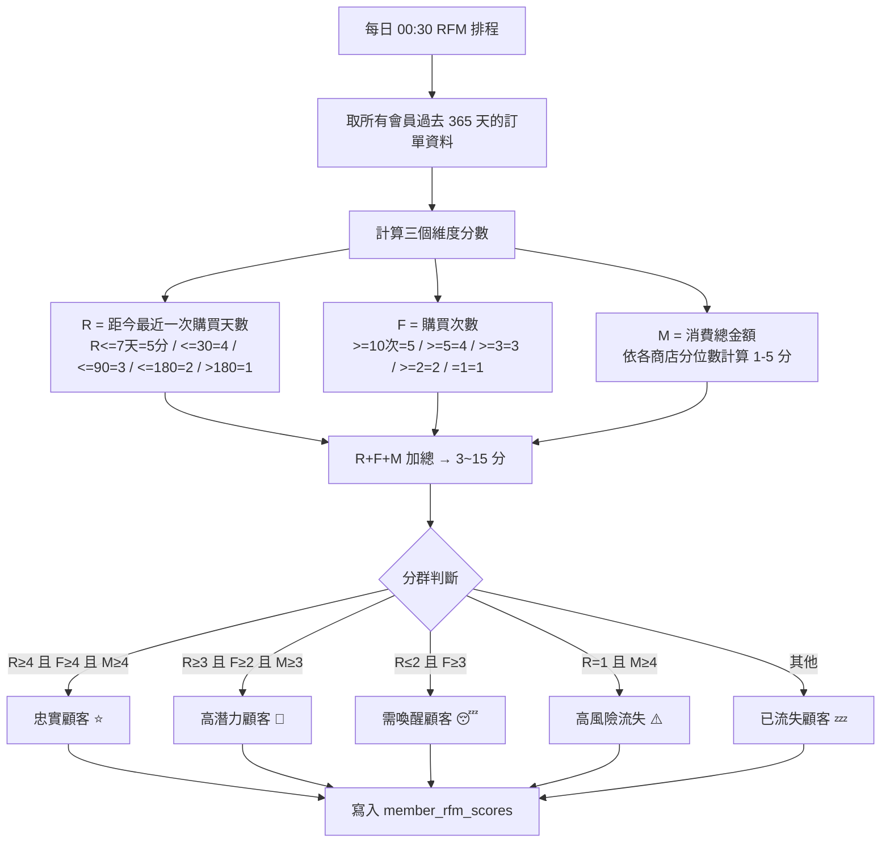
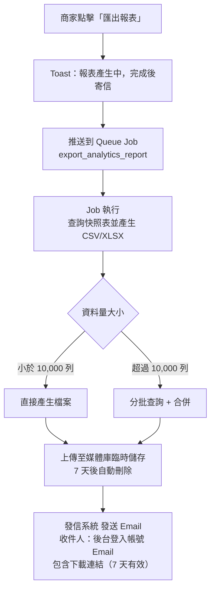

## 版本更新紀錄

| 版本 | 日期 | 修改內容 | 修改人 |
|------|------|----------|--------|
| v2.2 | 2026/05/21 | 連動 Part4 v1.2：§6.4 行銷成效新增「應收餘額異動分析」區塊，視覺化呈現會員回饋追回的 Mode A 應收記錄趨勢（資料來源 `reward_receivable_daily_snapshot` 表，由優惠計算引擎提供） | Una |
| v2.1 | 2026/05/04 | §6.4 廣告 ROI 補入完整歸因邏輯規格：Last Click 模型、30 天視窗、多次點擊覆蓋規則、Cookie 機制、已知限制（跨裝置/無痕/Cookie 清除）；§7 新增 UTM 歸因流程圖；已知限制明確標注供後台 UI 設計師處理 | Claude（依廖紫茵授權產出）|
| v2.0 | 2026/05/04 | 全面改寫：模組更名為「數據中心」；新增同期群分析、購物車漏斗深度展開、廣告 ROI、商品加購漏斗、時段熱力圖、訂單來源分析、商品搜尋分析；補齊啟航 vs 進階功能分層；加入 site_mode 動態分頁邏輯與升級引導；完整 OLAP 架構說明與 DB Schema | Claude（依廖紫茵授權產出）|
| v1.0 | 2026/04/29 | 初稿：銷售概覽 / 商品分析 / 會員分析（含 RFM 5 分群）/ 行銷成效 四頁完整 UI/UX 規格 | Claude（依廖紫茵授權產出）|

# Evomni - 數據中心 產品需求文件 (PRD) v2.2

## 1. 文件資訊

| 屬性 | 內容 |
| --- | --- |
| 版本 | v2.2 |
| 日期 | 2026/05/21 |
| 需求來源 | Master PRD Part 5 + 後台左側導覽架構規劃 v1.1 + 舊版 PRD v1.1（2025/12/05）+ 市場電商分析需求調研、**Part4 行銷活動 PRD v1.2 連動需求** |
| 文件狀態 | v2.2 連動版 — 配合 Part4 v1.2 雙模式回饋追回，新增應收餘額異動視覺化 |
| 作者 | Una |
| 對應方案 | 電商啟航方案 ✅（基礎報表）/ 進階電商包 ✅（完整分析 + 進階洞察）|
| 關聯文件 | [Part4 行銷活動 PRD](Evomni_Part4_行銷活動_PRD.md)、[優惠計算引擎技術規格 PRD](Evomni_優惠計算引擎_技術規格_PRD.md) |
| 開發時程 | 階段一 5–8月（電商啟航方案基礎報表）/ 階段二 9–12月（進階電商包完整分析）|
| 撰寫視角 | 行銷人員 / 商家老闆看得懂的白話文 + FAE 架構安全性 + UI/UX 可操作性 |

> **📌 工程師實作說明：** 本文件以需求定義為主。文中所列技術規格（DB Schema、API 路由、資料結構等）為規劃建議，反映 PM 對系統的理解；工程師可依技術判斷調整實作方式。如有重大架構變更，請於 Git commit 說明原因，並同步更新本文件，保持版控一致。

> **📌 數據中心架構說明：** 數據中心是 Evomni 後台的統一分析入口。CMS 形象站的流量分析、SEO 報告、表單成效為 CMS 原生功能，本 PRD **不涵蓋** CMS 原生分頁（由 CMS 團隊維護）。本 PRD **僅涵蓋** 電商模組新增的四個分頁：銷售概覽、商品分析、會員分析、行銷成效。

---

## 2. 目標與功能總覽

### 2.1 核心願景與相依性

**核心問題：**
商家每天操作訂單、上架商品、設定促銷，但不知道整體數字——哪些商品在賺錢、哪些顧客值得花力氣維繫、哪個促銷根本沒人用、購物車在哪一步流失最多人。沒有數據，所有決策靠直覺。

**解決方案：**
提供一套「行銷人員看得懂」的電商數據後台。指標名稱用白話文、每個圖表附文字結論、Tooltip 說明「這個數字為什麼重要」——讓沒有數據背景的商家老闆也能一眼看懂、馬上採取行動。

**Evomni 價值對應：**
- 數據中心是進階電商包的核心差異化賣點，以「靠數據驅動高成長」作為主張
- 基礎報表是啟航方案的必要功能，讓商家從開店第一天就能追蹤成績
- 數據可視化程度直接影響商家對平台的依賴程度與續約意願

**系統相依性：**

| 依賴模組 | 依賴資料 | 說明 |
| --- | --- | --- |
| 訂單管理（Part 3）| 訂單金額、狀態、時間、商品、UTM | 銷售概覽與行銷成效的核心資料來源 |
| 商品中心（Part 2）| 商品名稱、分類、庫存、PV/UV、加購紀錄 | 商品分析頁的品項與漏斗資料 |
| 會員管理（Part 6）| 會員等級、消費紀錄、標籤、加入日期 | 會員分析頁的顧客分群資料 |
| 行銷活動（Part 4）| 優惠券核銷、旅程觸發紀錄、Email 事件 | 行銷成效頁的活動績效資料 |
| 發信系統 | 開信率、點擊率事件回傳 | 行銷成效中旅程成效追蹤 |
| 廣告投放工具 | UTM 歸因資料（orders.utm_params）| 流量來源分析 + 廣告 ROI 計算 |
| 數據中心（CMS 原生）| 流量分析、SEO 報告、表單成效 | 同一後台左側選單入口，分頁並列但資料獨立 |

> ⚠️ **FAE 架構強制要求：** 數據中心頁面涉及大量跨表聚合查詢（GROUP BY + JOIN）。**嚴禁直接查詢 OLTP 主庫**。實作方案：每日 00:30 排程將前日資料彙整至 `analytics_*` 快照表；當日即時數據（今日銷售）設快取 TTL 5 分鐘；毛利資料（cost_price 相關）僅「擁有者」與「管理員」角色可查看；所有匯出功能一律非同步處理（背景產生 → 寄信通知）。

---

### 2.2 功能總覽表

> 數據中心的電商分析分為四個頁面（Tab），各頁面在後台以 Tab 切換呈現。啟航方案商家看到基礎版（進階功能加鎖顯示 `🔒`）；進階電商包商家解鎖全部功能。

| 主功能頁面 | 子功能項目 | 功能目的 | 功能詳細描述 | 方案 | 影響之使用者 |
| --- | --- | --- | --- | --- | --- |
| **銷售概覽** | 核心指標卡片 | 一眼掌握業績現況 | GMV、訂單數、客單價（AOV）、訂單完成率四卡片，各附上期漲跌比較 | 啟航＋進階 | 商家管理員 |
| 銷售概覽 | 銷售趨勢折線圖 | 看業績高低峰規律 | 每日銷售金額趨勢折線圖；可疊加上期同比對照線；切換「金額 / 筆數」視角 | 啟航＋進階 | 商家管理員 |
| 銷售概覽 | 付款方式分佈 | 了解顧客結帳偏好 | 圓餅圖呈現各金流渠道佔比與金額 | 啟航＋進階 | 商家管理員 |
| 銷售概覽 | 時段熱力圖 | 找出最佳促銷時間 | 以週×時段的熱力矩陣呈現下單集中時段（深色=高），供商家決定投廣告和排推播的最佳時間 | 進階 🔒 | 行銷人員 |
| 銷售概覽 | 訂單來源分析 | 知道顧客從哪裡來 | 依 UTM source/medium/campaign 分群顯示各來源的訂單數、金額、轉換率；附廣告 ROI 試算（需填入廣告花費） | 進階 🔒 | 行銷人員 |
| **商品分析** | 熱賣 Top 20 排行 | 快速找到明星商品 | 按銷售量或銷售金額排行前 20，附商品縮圖、庫存剩餘量、毛利率（有成本價時顯示）| 啟航＋進階 | 商家管理員 |
| 商品分析 | 滯銷商品提醒 | 早發現早清倉 | 列出設定期間銷量低於門檻的商品；附快速連結前往商品編輯頁 | 啟航＋進階 | 商家管理員 |
| 商品分析 | 品類銷售佔比 | 看哪個分類最賺錢 | 長條圖顯示各商品分類的銷售金額佔比與成長率 | 啟航＋進階 | 商家管理員 |
| 商品分析 | 商品加購漏斗 | 找出轉換效率差的商品 | 商品頁 PV → 加入購物車 → 完成購買，三段漏斗；標出「看的人多但買的少」的商品，提示可能需要改圖或調整售價 | 進階 🔒 | 行銷人員 |
| 商品分析 | 搜尋關鍵字分析 | 知道顧客在找什麼 | 前台站內搜尋的熱門關鍵字排行；標示「有結果」vs「無結果」比例；無結果的關鍵字提示商家考慮補充商品 | 進階 🔒 | 商家管理員、行銷人員 |
| 商品分析 | 庫存周轉分析 | 評估庫存健康程度 | 各商品的庫存周轉天數（平均庫存 ÷ 日均銷量）；標記過高庫存（積壓風險）與過低庫存（斷貨風險） | 進階 🔒 | 商家管理員 |
| **會員分析** | 新客/回購趨勢 | 看成長動能是否健康 | 折線圖呈現每日新客數與回購客數；計算回購率（回購顧客 ÷ 有購買顧客）| 啟航＋進階 | 商家管理員 |
| 會員分析 | 會員等級分佈 | 了解顧客結構 | 圓餅圖顯示各會員等級的人數占比與消費貢獻佔比 | 啟航＋進階 | 商家管理員 |
| 會員分析 | 顧客消費分佈 | 找出高價值顧客特徵 | 依消費金額區間分群顯示顧客數分佈；列出消費金額 Top 20 顧客（可一鍵跳轉顧客詳情頁）| 進階 🔒 | 行銷人員 |
| 會員分析 | 同期群（Cohort）分析 | 追蹤不同加入批次的留存與復購 | 以矩陣熱力圖呈現每月新加入會員在後續各月的復購率；幫助判斷哪個時期獲取的會員品質最好 | 進階 🔒 | 行銷人員 |
| 會員分析 | RFM 顧客價值分群 | 自動把顧客分類對症下藥 | 依最近購買時間（R）/ 購買頻率（F）/ 消費金額（M）自動將顧客分為 5 群：忠實顧客 / 高潛力顧客 / 需喚醒 / 高風險流失 / 已流失；每群顯示人數、平均 LTV、建議行動 | 進階 🔒 | 行銷人員 |
| **行銷成效** | 購物車轉換漏斗 | 找出流失最嚴重的環節 | 漏斗圖呈現：商品頁瀏覽 → 加入購物車 → 進入結帳 → 填寫資料 → 完成付款，五段各步驟人數與流失率；標示最大流失點 | 進階 🔒 | 行銷人員 |
| 行銷成效 | 優惠活動成效 | 知道哪個促銷真的有效 | 列出所有行銷活動的使用次數、核銷率、帶動訂單金額、ROI；自動標記效益最高與最差的活動 | 進階 🔒 | 行銷人員 |
| 行銷成效 | 廣告 ROI 分析 | 算出每塊廣告費的報酬 | 填入各渠道廣告花費後，系統計算 ROAS（廣告帶動銷售金額 ÷ 廣告花費）；依 UTM campaign 對應；呈現各廣告活動的訂單數、銷售額、ROAS | 進階 🔒 | 行銷人員 |
| 行銷成效 | 自動化旅程成效 | 了解自動訊息有沒有用 | 每條自動化旅程（購物車挽回/沉睡喚醒/購後推薦/到期提醒）的觸發次數、開信率、點擊率、最終轉換訂單數 | 進階 🔒 | 行銷人員 |

---

## 3. 全局功能流程



---

## 4. 功能結構圖



---

## 5. 使用者故事

**作為商家老闆，** 我想要進入數據中心就能看到今天和本月的 GMV、訂單數，以便於用手機確認今日業績是否達標，不需要翻訂單列表自己加總。

**作為行銷人員，** 我想要看到哪些商品「瀏覽很多但轉換很差」的漏斗資料，以便於優先優化這些商品的主圖和描述，把流量變成訂單。

**作為行銷人員，** 我想要看到 RFM 分群的結果，以便於對「沉睡中的高價值顧客」直接觸發喚醒旅程，不用自己手動篩選會員。

**作為行銷人員，** 我想要填入每個廣告活動的花費後看到 ROAS，以便於判斷哪個渠道最值得加碼投放，不用自己在 Google 試算表上算。

**作為商家管理員，** 我想要看到下單最集中的時段熱力圖，以便於決定每週推播和廣告投放的最佳時間，而不是隨機亂發。

**作為商家管理員，** 我想要看到同期群分析，以便於了解不同月份加入的會員在之後幾個月的復購率，確認我的獲客品質是否在改善。

**作為商家老闆，** 我想要匯出本月完整銷售報表，以便於寄給財務夥伴做月度對帳，而不是手動截圖或複製貼上。

---

## 6. UI/UX 與詳細功能需求

### 6.0 通用框架（所有電商分頁共用）

#### A. 頁面框架

**頂部控制列（每個電商分頁共用）：**

| 元件 | 規格 |
| --- | --- |
| 頁面 Tab | `<el-tabs>` 水平 Tab：銷售概覽 / 商品分析 / 會員分析 / 行銷成效；啟航方案的進階 Tab 顯示 `🔒` 後綴 + 點擊跳出升級彈窗 |
| 時間範圍選擇器 | `<el-date-picker type="daterange">`；快選按鈕：今天 / 昨天 / 本週 / 本月 / 上月 / 近 7 天 / 近 30 天 / 近 90 天 / 自訂；預設「本月」|
| 與上期比較 Toggle | `<el-switch>` 標籤：「顯示同期對照」；開啟後圖表疊加上期資料（虛線） |
| 匯出報表 | `<el-button class="!rounded-none">` 標籤：「匯出報表」；點擊後 Toast：「報表產生中，完成後將寄送至您的信箱 📧」（一律非同步，不支援即時下載）|
| 最後更新時間 | 頁面右上角灰色小字：「資料更新至 YYYY/MM/DD 00:30」；今日資料附「（即時，5 分鐘快取）」標示 |

**通用空資料狀態（Empty State）：**
- 選取時間範圍內無任何訂單時：顯示空狀態圖示 + 文字「所選時間範圍內沒有資料。若剛開店，請等到有訂單後再查看。」
- 功能需要設定後才能顯示（如廣告 ROI 需先填廣告花費）：顯示「此功能需要先設定 X，前往設定 →」的 callout

**進階功能鎖定狀態（啟航方案用戶）：**
```
[區塊標題] 🔒 進階功能

╔══════════════════════════════════════╗
║  [圖表模糊預覽或示意圖]              ║
║                                      ║
║  🔒 此功能屬於「進階電商包」專屬功能  ║
║  ✅ [功能亮點 1]                     ║
║  ✅ [功能亮點 2]                     ║
║  ✅ [功能亮點 3]                     ║
║                                      ║
║  [聯繫營運輔導顧問]（primary button）║
╚══════════════════════════════════════╝
```
使用 `<el-card>` + 疊加半透明遮罩（`background: rgba(255,255,255,0.85)`）；內部圖表呈現模糊預覽（`filter: blur(4px)`）讓商家知道有什麼但看不清楚，創造升級動機。按鈕文字：「聯繫營運輔導顧問」，禁止使用「升級方案」「立即升級」等用語（依 plan-and-upgrade §13）。

---

### 6.1 銷售概覽

#### A. 核心使用者流程

商家進入數據中心 → 預設停留在「銷售概覽」Tab → 選擇時間範圍 → 一眼看到四個核心指標卡片和趨勢折線圖 → 點擊感興趣的維度深入查看。

#### B. 介面佈局與元件拆解（Figma Ready）

**佈局：** 4 卡片橫排 → 銷售趨勢折線圖（大，佔滿寬度）→ 下方兩欄：付款方式圓餅圖（左）+ 時段熱力圖（右，進階）→ 訂單來源分析（進階，全寬）

**四個核心指標卡片：**

| 指標 | 計算方式 | 顯示格式 | Tooltip 說明 |
| --- | --- | --- | --- |
| 總銷售金額（GMV）| SUM（已完成訂單金額）| `NT$ X,XXX,XXX` | 「已完成訂單的商品金額總和（不含取消/退款訂單）」|
| 訂單筆數 | COUNT（已完成訂單）| `X,XXX 筆` | 「完成付款且未取消的訂單數」|
| 平均客單價（AOV）| GMV ÷ 訂單筆數 | `NT$ X,XXX` | 「每筆訂單的平均金額。提高客單價可讓相同流量產生更多收入」|
| 訂單完成率 | 已完成訂單 ÷ 建立訂單（含已取消）| `XX.X%` | 「從建立訂單到完成付款的比率。過低（<60%）可能代表結帳流程有問題或金流不穩定」|

每個卡片底部顯示：`↑ XX.X% 較上期` 或 `↓ XX.X% 較上期`，漲為綠色（`#67C23A`），跌為紅色（`#F56C6C`），持平為灰色（`#909399`）。

**銷售趨勢折線圖：**

| 元件 | 規格 |
| --- | --- |
| 圖表類型 | 折線圖（recharts LineChart 或類似庫）；X 軸為日期；Y 軸為銷售金額 |
| 視角切換 | `<el-radio-group>` 按鈕式：「銷售金額」/ 「訂單筆數」；切換時 Y 軸單位同步更新 |
| 同期對照線 | 開啟「顯示同期對照」後，以虛線疊加上期同一時段數據；Hover 時顯示當期 vs 上期數值對比 Tooltip |
| Hover Tooltip | 顯示：日期 + 當日金額/筆數 + 相較前日變化 |
| 最高點標注 | 自動標注折線最高點，顯示「最高：NT$XX,XXX（MM/DD）」|

**付款方式分佈圓餅圖：**
- `<el-card>` 卡片包裝；右側顯示圖例（渠道名稱 + 金額 + 百分比）
- Hover 扇形顯示詳細 Tooltip：渠道名稱 / 訂單數 / 金額 / 佔比

**時段熱力圖（進階 🔒）：**
- 7 列（週一至週日）× 24 欄（00:00–23:00）的矩陣
- 顏色深淺表示該時段的訂單密度（從 `#F5F7FA` 淡藍到 `#409EFF` 深藍）
- Hover 顯示：「週X XX:00–XX:59 / 訂單數：N 筆 / 銷售金額：NT$X,XXX」
- 圖表下方顯示文字結論：「您的訂單最集中在 [週X] [XX:00–XX:00]，建議在此時段發送行銷推播效果最佳」

**訂單來源分析（進階 🔒）：**

| 欄位 | 說明 |
| --- | --- |
| 來源（UTM Source）| Google / Facebook / Instagram / LINE / 直接流量 / 其他 |
| 媒介（UTM Medium）| CPC / organic / email / social / referral |
| 訂單數 | COUNT |
| 銷售金額 | SUM |
| 平均客單價 | 銷售金額 ÷ 訂單數 |
| 轉換率 | 完成訂單 ÷ 來源 Session（需搭配 GA4 資料，無資料時顯示 N/A）|
| 廣告 ROI（ROAS）| 銷售金額 ÷ 廣告花費；花費需在此頁手動填入 |

廣告花費輸入：表格上方設「設定廣告花費」Button，點擊後開啟 Drawer，可為每個 UTM Campaign 輸入「廣告花費（NT$）」；儲存後系統計算 ROAS。

#### C. 互動設計、狀態與系統反饋

- 切換時間範圍後，頁面所有圖表同步更新（Loading Skeleton 動畫）
- 卡片數字增加時，使用數字滾動動畫（1 秒內從 0 滾到目標值）
- 趨勢折線圖 Loading 中：顯示骨架屏（`<el-skeleton>` 波紋效果）

#### D. 防呆機制與錯誤預防

- 自訂日期範圍不可超過 365 天（超過時顯示：「最長可查詢 365 天的資料範圍」）
- 日期範圍結束日期必須晚於開始日期
- 訂單來源未設定 UTM 的訂單統計於「直接流量」欄位

---

### 6.2 商品分析

#### A. 核心使用者流程

進入「商品分析」Tab → 預設顯示熱賣 Top 20 + 品類佔比 → 可切換查看滯銷商品 / 加購漏斗（進階）/ 搜尋分析（進階）/ 庫存周轉（進階）。

#### B. 介面佈局與元件拆解（Figma Ready）

**佈局：** 熱賣排行表格（全寬，最重要）→ 品類銷售佔比（全寬）→ 滯銷商品提醒（全寬）→ 商品加購漏斗（進階）→ 搜尋關鍵字（進階）→ 庫存周轉（進階）

**熱賣 Top 20 排行表格：**

| 欄位 | 說明 |
| --- | --- |
| 排名 | 1–20 數字 badge |
| 商品名稱 + 縮圖 | 點擊跳轉商品編輯頁（新分頁）|
| 銷售數量 | 選定時間範圍內已完成訂單的商品數量 |
| 銷售金額 | 銷售數量 × 售價（SUM）|
| 毛利率 | `(售價 - 成本價) / 售價`；僅擁有者 / 管理員可見；無成本價時顯示「—」|
| 庫存剩餘 | 目前庫存量；低庫存時紅色 `⚠` |
| 操作 | 「查看商品」Button |

排序切換：`<el-radio-group>` 按鈕式「依銷售數量排序」/ 「依銷售金額排序」

**品類銷售佔比：**
- `<el-tabs>` 切換：「圓餅圖」/ 「長條圖」
- 圓餅圖：各分類名稱 + 銷售額 + 百分比
- 長條圖：X 軸分類名稱，Y 軸銷售金額；每個長條顯示成長率百分比標注

**滯銷商品提醒：**
- 篩選條件：`<el-input-number>` 輸入「低於 X 件銷售量視為滯銷」（預設 0 件）
- 表格：商品名稱 / 庫存量 / 選定期間銷量 / 最後一筆訂單日期 / 「前往商品頁」快速連結
- 右上角「批次加入促銷」Button：勾選後可快速跳轉行銷活動建立頁，預填商品清單

**商品加購漏斗（進階 🔒）：**

漏斗圖（倒三角形）顯示各階段人數，每階段右側顯示流失率：
```
商品頁瀏覽      100%   X,XXX 人
    ↓ 流失 XX%
加入購物車       XX%   X,XXX 人
    ↓ 流失 XX%
完成購買         XX%   X,XXX 人
```
商品維度篩選：可選特定商品查看其個別漏斗（預設顯示全站聚合數據）。

文字結論：「您的主要流失點在「加入購物車 → 完成購買」階段，流失率 XX%，建議檢查：結帳步驟是否過長、運費是否過高、是否有更多付款方式選擇。」

**搜尋關鍵字分析（進階 🔒）：**

| 欄位 | 說明 |
| --- | --- |
| 搜尋關鍵字 | 顧客在前台搜尋框輸入的關鍵字 |
| 搜尋次數 | COUNT |
| 有搜尋結果 | 比例（有商品命中）|
| 無搜尋結果 | 比例（0 件商品命中）；紅色標示提醒 |
| 建議 | 無結果關鍵字附「考慮新增此關鍵字的商品，或在相關商品的 SEO 設定中加入此關鍵字」|

**庫存周轉分析（進階 🔒）：**

| 欄位 | 說明 |
| --- | --- |
| 商品名稱 | 點擊跳轉庫存管理 |
| 庫存數量 | 目前庫存 |
| 日均銷量 | 選定期間 SUM 銷量 ÷ 天數 |
| 庫存周轉天數 | 庫存 ÷ 日均銷量；若日均銷量 = 0 則顯示「—（無銷售）」|
| 健康狀態 | 綠色 OK（14–90天）/ 紅色警示 `⚠`（>90 天，積壓）/ 橘色注意（<7 天，快斷貨）|

---

### 6.3 會員分析

#### A. 核心使用者流程

進入「會員分析」Tab → 預設顯示新客/回購趨勢 + 等級分佈 → 進階用戶可查看消費分佈、同期群矩陣、RFM 分群 → 對 RFM 群體執行行銷行動。

#### B. 介面佈局與元件拆解（Figma Ready）

**新客/回購趨勢折線圖：**
- 雙線折線圖：新客（藍色實線）/ 回購客（橘色實線）
- X 軸日期；Y 軸人數；Hover 顯示當日新客數/回購客數
- 卡片左上方顯示：回購率 = 「回購客 ÷ 有購買顧客 × 100%」；Tooltip：「回購率 30% 以上為健康水準，電商行業平均約 25%」

**會員等級分佈：**
- 圓餅圖：各等級名稱 + 人數 + 佔比
- 右側補充：各等級的「消費金額佔比」長條圖（視覺化呈現高等級會員的價值集中度）

**顧客消費分佈（進階 🔒）：**
- 橫向長條圖：X 軸人數，Y 軸消費區間（0–500元 / 500–1,000元 / 1,000–3,000元 / 3,000–10,000元 / 10,000元以上）
- 表格：消費金額 Top 20 顧客（Email 部分遮蔽，如 `te***@gmail.com`）+ 消費金額 + 訂單數 + 最後購買日 + 「查看顧客」連結

**同期群分析（進階 🔒）：**

以月份矩陣（Cohort Matrix）熱力圖呈現：

```
          加入當月  +1月   +2月   +3月  ... +12月
2026/01     100%   30%    22%    18%  ...   8%
2026/02     100%   28%    20%    16%  ...    -
2026/03     100%   32%    24%     -   ...    -
```

- 顏色：從白色（0%）到深藍色（100%），越深代表復購率越高
- Hover 顯示：「2026/01 加入的顧客，第 2 個月回購率 30%（N 人）」
- 圖表下方文字說明：「較深的橫列代表該批顧客品質較好，建議觀察這批顧客是從哪個渠道獲取的，加大該渠道投入」

**RFM 顧客價值分群（進階 🔒）：**

系統每日 00:30 計算各會員的 R/F/M 分數，自動歸類為 5 群：

| 群體名稱 | 定義 | 建議行動 | 顯示樣式 |
| --- | --- | --- | --- |
| 🌟 忠實顧客 | R 高（近期有購買）+ F 高（購買頻繁）+ M 高（金額高）| 發送感謝禮 / VIP 專屬優惠 / 邀請評價 | 金色 Tag |
| 🚀 高潛力顧客 | R 高 + F 中 + M 中 | 發送升等提醒 / 推薦高單價商品 | 藍色 Tag |
| 😴 需喚醒顧客 | R 低（一段時間未購買）+ F 中/高 | 發送「好久不見」優惠券 / 透過自動化旅程觸發 | 橘色 Tag |
| ⚠️ 高風險流失 | R 很低 + M 曾經高 | 立即發送個人化優惠，避免永久流失 | 紅色 Tag |
| 💤 已流失顧客 | 極長時間未購買 | 最後一搏優惠；若無回應接受流失 | 灰色 Tag |

各群顯示卡片：人數、平均 LTV、平均距上次購買天數、建議行動文字。

**執行行動按鈕（每個 RFM 群組卡片下方）：**
- 「發送行銷旅程」→ 跳轉行銷中心 > 自動化旅程，預填此 RFM 群體為受眾
- 「發送優惠券」→ 跳轉行銷中心 > 優惠券管理，預填受眾篩選條件
- 「匯出名單」→ CSV 包含 Email + 分群標籤（非同步寄信）

#### C. 互動設計、狀態與系統反饋

- RFM 分群結果每日 00:30 自動更新；頁面顯示「分群資料更新至 YYYY/MM/DD」
- 同期群矩陣若資料不足 2 個月，顯示：「同期群分析需要至少 2 個月的訂單資料才能計算，目前資料尚不足」
- 顧客 Email 在報表中一律部分遮蔽（前 2 字元 + *** + @domain），防止個資外洩

---

### 6.4 行銷成效

#### A. 核心使用者流程

進入「行銷成效」Tab → 預設顯示購物車轉換漏斗（最重要的行銷洞察）→ 下方依序查看優惠活動、廣告 ROI、旅程成效。

**注意：行銷成效整頁為進階電商包功能，啟航方案用戶看到鎖定狀態。**

#### B. 介面佈局與元件拆解（Figma Ready）

**購物車轉換漏斗（全寬，最重要）：**

漏斗圖五個階段，顯示人數與流失率：

| 階段 | 說明 | 數據來源 |
| --- | --- | --- |
| 商品頁瀏覽 | 訪問至少一個商品詳情頁的 UV | `product_stats.uv` |
| 加入購物車 | 執行「加入購物車」事件的 UV | 購物車事件 log |
| 進入結帳 | 開啟結帳頁的 UV | 結帳頁進入 log |
| 填寫訂單資訊 | 完成收件地址填寫並進入付款頁的 UV | 訂單建立 log |
| 完成付款 | 付款成功、訂單狀態更新為已付款的 UV | 訂單 log |

每兩段之間顯示流失人數與流失率，最大流失點以紅色高亮。

文字結論（自動生成）：「您的購物車主要流失發生在「[X 階段] → [Y 階段]」，流失 XX%。可能原因：[依流失點提供對應建議]。」

**優惠活動成效表格：**

| 欄位 | 說明 |
| --- | --- |
| 活動名稱 | 連結至行銷中心對應活動 |
| 活動類型 | 優惠券 / 滿額折扣 / 限時折扣 / 組合優惠 |
| 期間 | 活動起訖日期 |
| 使用次數 | 核銷筆數 |
| 核銷率 | 使用次數 ÷ 發放數量（優惠券）|
| 帶動訂單金額 | 使用此活動的訂單 GMV |
| 折扣優惠金額 | 此活動給出的折扣總金額 |
| ROI | 帶動訂單金額 ÷ 折扣金額；Tooltip：「每投入 NT$1 折扣帶動的銷售金額，≥3 為良好表現」|
| 效益標記 | 自動標記：`<el-tag type="success">` 最佳活動 / `<el-tag type="danger">` 低效活動 |

**廣告 ROI 分析：**

| 欄位 | 說明 |
| --- | --- |
| UTM Campaign | 廣告活動名稱 |
| UTM Source | 廣告平台（Google / Meta / LINE）|
| 訂單數 | 依 UTM 歸因的完成訂單數 |
| 銷售金額 | 依 UTM 歸因的訂單 GMV |
| 廣告花費 | 手動填入（NT$）；填入後自動計算 ROAS |
| ROAS | 銷售金額 ÷ 廣告花費；≥2 綠色，1–2 橘色，<1 紅色 |
| 廣告花費設定 | 每個 Campaign 右側「設定花費」icon，點擊 inline 輸入 |

> ℹ️ **說明文字（`<el-alert type="info">`）：**「廣告 ROI 計算依賴 UTM 參數歸因。若廣告未設定 UTM，訂單來源將無法正確歸因。建議使用廣告投放工具的 UTM 網址生成器為每個廣告活動建立帶有 UTM 的連結。」

**📌 歸因邏輯規格（FAE 實作說明，不顯示於後台 UI）：**

| 規則 | 內容 | 說明 |
| --- | --- | --- |
| 歸因模型 | **最後點擊歸因（Last Click）** | 訂單金額歸因於下單前最後一個帶有 UTM 參數的點擊來源；這是業界最常見的預設模型，與 Google Analytics 預設行為一致 |
| 歸因視窗 | **30 天** | 訪客點擊廣告後，30 天內完成的訂單均歸因於該廣告；超過 30 天後重新點擊才更新來源 |
| 多次點擊處理 | 以最後一次點擊的 UTM 為準 | 例：訪客先點 Google 廣告、3 天後又點 LINE 廣告後才下單 → 訂單歸因於 LINE（最後點擊）；Google 那筆點擊的歸因資格被覆蓋 |
| 跨 Session 追蹤 | Cookie（`evomni_utm`，30 天有效期）| 首次帶 UTM 進站時寫入 Cookie；每次新的 UTM 點擊覆蓋舊值；Cookie 過期或被清除則歸因失效 |
| 無 UTM 的訂單 | 歸入「**直接流量**」| 直接輸入網址、書籤、無參數的 LINE 分享連結、App 內嵌頁皆屬此類；不應與廣告來源混計 |
| 跨裝置 | **不支援**（已知限制）| 用戶在手機點廣告、桌機下單，兩者無法關聯 → 訂單歸入直接流量；建議在後台說明文字中標注此限制 |

> **工程師實作備忘：**
> - UTM 參數在訪客進站時由前端 JS 讀取 URL querystring，寫入 `document.cookie`（`evomni_utm`，`max-age=2592000`，即 30 天）
> - 結帳時，後端從 Cookie 或 Request Header 讀取 UTM 值，寫入 `orders.utm_params`（JSON 欄位），格式：`{"source": "facebook", "medium": "cpc", "campaign": "summer2026", "term": "", "content": ""}`
> - `orders.utm_params` 寫入後不可更動（審計用途），即使商家事後修改廣告投放設定也不影響歷史訂單歸因

**自動化旅程成效表格：**

| 欄位 | 說明 |
| --- | --- |
| 旅程名稱 | 購物車挽回 / 沉睡喚醒 / 流失挽留 / 購後推薦 / 到期提醒 |
| 觸發次數 | 旅程被啟動的總次數 |
| Email 開信率 | 開信次數 ÷ 發送次數 |
| Email 點擊率 | 點擊次數 ÷ 開信次數 |
| 最終轉換訂單數 | 收到訊息後 7 天內完成購買的訂單數 |
| 轉換率 | 最終轉換訂單數 ÷ 觸發次數 |
| 帶動金額 | 轉換訂單的 GMV |
| 旅程連結 | 「查看旅程設定」→ 跳轉行銷中心 |

**應收餘額異動分析（v2.2 新增，連動 Part4 v1.2 §6.6C 與 §6.11）：**

> 連動 Part4 v1.2 雙模式回饋追回：當會員退款追回時餘額不足，差額會記入「應收記錄」並於 6 個月後註銷。本區塊讓商家了解整體應收餘額的健康度。

**呈現結構（兩部分）：**

【1】指標卡片組（四張卡片橫向排列）

| 卡片 | 指標 | 計算邏輯 | 顏色判斷 |
|------|------|---------|---------|
| 實際發放（本月）| NT$ X,XXX | SUM(該月發放回饋金額) | — |
| 實際扣抵（本月）| NT$ X,XXX | SUM(該月成功從會員錢包扣回金額) | — |
| 應收註銷（本月）| NT$ X,XXX | SUM(該月因 6 個月過期而註銷的應收金額) | ≥ 發放 10% 顯示紅色（提示薅羊毛風險高）|
| 應收餘額（當前）| NT$ X,XXX | 所有 `status = pending` 的應收金額總和 | — |

【2】趨勢折線圖（全寬，預設顯示近 90 天）

```
[折線圖 ECharts]
  X 軸：日期（依篩選器：日 / 週 / 月）
  Y 軸：NT$
  三條線：
    🟢 實際發放      ─── 該日發放回饋金額
    🟠 實際扣抵      ─── 該日從會員錢包成功扣回金額
    🔴 應收註銷      ─── 該日因過期而註銷的金額
  陰影區域：應收餘額（期末）— 灰底填充
```

**資料來源：**
- 表：`reward_receivable_daily_snapshot`（由 [優惠計算引擎 §7.4](Evomni_優惠計算引擎_技術規格_PRD.md) 提供）
- 欄位：`snapshot_date / issued_amount / recovered_amount / voided_amount / pending_balance`
- 寫入時機：每日 02:00 系統排程

**Tooltip 與下鑽：**
- Hover 任一日期點 → 顯示當日四個指標的具體數值
- 點擊「應收註銷」紅色高峰 → 下鑽至 Part4 §6.6C「應收餘額對帳報表」對應日期的明細

**自動文字結論（依當月數據生成）：**
- 若應收註銷 / 實際發放 > 10%：「⚠️ 本月應收註銷比例偏高（X%），建議檢視回饋活動門檻或考慮啟用負餘額模式（詳見行銷活動 → 進階功能）」
- 若應收餘額月增長 > 20%：「📈 應收餘額快速累積中（本月 +X%），代表會員退款後未回購比例偏高，建議搭配挽回通知活動」
- 若 Mode B 已開通：顯示「💡 您已啟用負餘額模式，本報表僅供參考」

**顯示條件（條件式自動顯示，無需 toggle）：**

```sql
IF EXISTS (
    SELECT 1 FROM marketing_activities
    WHERE type IN ('points_reward', 'wallet_reward', 'consumption_points')
      AND status = 'active'
) THEN 顯示應收餘額異動分析區塊
ELSE 整個區塊隱藏（連標題都不顯示）
```

- 商家「有啟用任何回饋活動」→ 自動顯示
- 商家「未啟用任何回饋活動」→ 自動隱藏（避免空圖表）
- 與 [Part4 §6.2I](Evomni_Part4_行銷活動_PRD.md) 商家自助開通的設計哲學一致：**功能跟著需求自動展開**，不額外增加 toggle

---

### 6.5 數據中心入口（site_mode 動態分頁邏輯）

依客戶開通的服務類型，數據中心顯示不同的 Tab 組合：

| 客戶類型 | 顯示的分頁 |
| --- | --- |
| 純形象站（CMS Only）| 流量分析、SEO 報告、表單成效（CMS 原生，本 PRD 不涵蓋）|
| 形象站 + 電商（Hybrid）| 流量分析、SEO 報告、表單成效（CMS）＋ 銷售概覽、商品分析、會員分析、行銷成效（電商）|
| 純電商站 | 銷售概覽、商品分析、會員分析、行銷成效（電商）|

判斷邏輯由後端 API 回傳：
```json
{
  "site_mode": "hybrid",
  "analytics_tabs": {
    "cms_traffic": true,
    "cms_seo": true,
    "cms_forms": true,
    "ecommerce_sales": true,
    "ecommerce_products": true,
    "ecommerce_members": true,
    "ecommerce_marketing": true
  }
}
```
前端依此 JSON 動態渲染 Tab 列，未開通的電商 Tab 不顯示（不是顯示鎖定，而是完全隱藏）。

**升級引導彈窗（純形象站用戶點擊電商 Tab）：**
> 若系統設計上純形象站仍能看到電商 Tab 入口（如作為行銷露出），點擊時顯示 `<el-dialog>` 彈窗：
> - 標題：「解鎖電商數據分析」
> - 內容：「開通電商方案後，即可查看銷售趨勢、商品轉換率、顧客 RFM 分群等電商專屬分析報表。」
> - 按鈕：「聯絡營運輔導顧問了解電商方案」（Primary）/ 「先不了解」（取消）

---

## 7. 細部邏輯流程圖

### 7.1 OLAP 快照寫入邏輯



### 7.2 UTM 歸因邏輯（Last Click，30 天視窗）



**已知限制（需在後台 UI 標注）：**
- 跨裝置不支援：手機點廣告、桌機下單，視為直接流量
- Cookie 遭清除：30 天內清除 Cookie 後，後續訂單視為直接流量
- 無痕模式：Session 結束 Cookie 即清除，無法跨 Session 歸因

### 7.3 RFM 分群計算邏輯



### 7.3 非同步匯出邏輯



---

## 8. 非功能性需求

### 8.1 效能需求

| 指標 | 目標 | 說明 |
| --- | --- | --- |
| 頁面初次載入（切換 Tab）| ≤ 1.5 秒 | 讀取快照表，嚴禁查詢 OLTP 主庫 |
| 圖表渲染（切換時間範圍）| ≤ 500ms | 快取 TTL 5 分鐘 |
| RFM 分群頁面載入 | ≤ 2 秒 | 讀預計算結果表 |
| 報表匯出（佇列中）| ≤ 5 分鐘 | 非同步，超時發信告知 |
| 同期群矩陣渲染 | ≤ 1 秒 | 預計算每月 Cohort 結果 |

### 8.2 安全性需求

- 數據中心僅「擁有者」與「管理員」角色可存取；「操作員」角色不可查看任何銷售金額數據
- 毛利率欄位（cost_price 相關）僅「擁有者」可見；管理員僅見毛利率，不見成本價
- 顧客 Email 在報表中一律部分遮蔽（顯示 `te***@gmail.com`）；匯出 CSV 可選「匯出完整資料（需擁有者角色）」

### 8.3 資料一致性

- 數據來源分兩層：快照表（延遲至次日更新）+ Redis 即時快取（TTL 5 分鐘，顯示今日數據）
- 快照表寫入失敗時，後台顯示：`<el-alert type="warning">「資料尚未更新，顯示截至前日的數據」`
- 時間以商家設定的時區為準（全域設定 > 電商基本設定 > 時區）

### 8.4 瀏覽器/裝置支援

- 數據中心為桌機專用功能；不要求手機最佳化
- 支援 Chrome / Edge / Safari 最近兩版；最小解析度 1440px 寬（數據圖表需要足夠空間）

### 8.5 資料庫補充規格

```sql
-- 每日銷售快照
CREATE TABLE analytics_daily_sales (
    id             BIGINT UNSIGNED AUTO_INCREMENT PRIMARY KEY,
    date           DATE NOT NULL,
    gmv            DECIMAL(15,2) DEFAULT 0,
    order_count    INT DEFAULT 0,
    aov            DECIMAL(10,2) DEFAULT 0,
    completion_rate DECIMAL(5,4) DEFAULT 0,  -- 完成率 0.0000 ~ 1.0000
    new_customer_count INT DEFAULT 0,
    returning_customer_count INT DEFAULT 0,
    UNIQUE KEY uniq_date (date),
    INDEX idx_date (date)
);

-- 商品分析快照（每日）
CREATE TABLE analytics_product_stats (
    id             BIGINT UNSIGNED AUTO_INCREMENT PRIMARY KEY,
    date           DATE NOT NULL,
    product_id     BIGINT UNSIGNED NOT NULL,
    pv             INT DEFAULT 0,
    uv             INT DEFAULT 0,
    add_to_cart_count INT DEFAULT 0,
    order_count    INT DEFAULT 0,
    gmv            DECIMAL(12,2) DEFAULT 0,
    UNIQUE KEY uniq_date_product (date, product_id),
    INDEX idx_product_id (product_id),
    INDEX idx_date (date)
);

-- 會員 RFM 分群（每日更新）
CREATE TABLE member_rfm_scores (
    id             BIGINT UNSIGNED AUTO_INCREMENT PRIMARY KEY,
    member_id      BIGINT UNSIGNED NOT NULL UNIQUE,
    r_score        TINYINT UNSIGNED NOT NULL,   -- 1-5
    f_score        TINYINT UNSIGNED NOT NULL,   -- 1-5
    m_score        TINYINT UNSIGNED NOT NULL,   -- 1-5
    rfm_total      TINYINT UNSIGNED NOT NULL,   -- 3-15
    segment        ENUM('loyal','potential','sleepy','at_risk','lost') NOT NULL,
    ltv            DECIMAL(12,2) DEFAULT 0,
    last_order_date DATE NULL,
    order_count    INT DEFAULT 0,
    total_spent    DECIMAL(12,2) DEFAULT 0,
    calculated_at  DATETIME DEFAULT CURRENT_TIMESTAMP ON UPDATE CURRENT_TIMESTAMP,
    INDEX idx_segment (segment),
    INDEX idx_ltv (ltv)
);

-- 行銷活動成效快照（每日）
CREATE TABLE analytics_marketing_performance (
    id                  BIGINT UNSIGNED AUTO_INCREMENT PRIMARY KEY,
    date                DATE NOT NULL,
    campaign_type       ENUM('coupon','fullorder','timelimited','bundle','journey') NOT NULL,
    campaign_id         BIGINT UNSIGNED NOT NULL,
    trigger_count       INT DEFAULT 0,
    conversion_count    INT DEFAULT 0,
    email_open_count    INT DEFAULT 0,
    email_click_count   INT DEFAULT 0,
    gmv_attributed      DECIMAL(12,2) DEFAULT 0,
    discount_amount     DECIMAL(10,2) DEFAULT 0,
    UNIQUE KEY uniq_date_campaign (date, campaign_type, campaign_id),
    INDEX idx_campaign_id (campaign_id)
);

-- 廣告花費設定（手動填入）
CREATE TABLE analytics_ad_spend (
    id             BIGINT UNSIGNED AUTO_INCREMENT PRIMARY KEY,
    utm_campaign   VARCHAR(255) NOT NULL,
    utm_source     VARCHAR(100),
    utm_medium     VARCHAR(100),
    spend_date     DATE NOT NULL,
    spend_amount   DECIMAL(10,2) NOT NULL,
    created_by     BIGINT UNSIGNED,
    created_at     DATETIME DEFAULT CURRENT_TIMESTAMP,
    updated_at     DATETIME DEFAULT CURRENT_TIMESTAMP ON UPDATE CURRENT_TIMESTAMP,
    UNIQUE KEY uniq_campaign_date (utm_campaign, spend_date)
);

-- 同期群分析快照（每月計算一次）
CREATE TABLE analytics_cohort_monthly (
    id             BIGINT UNSIGNED AUTO_INCREMENT PRIMARY KEY,
    cohort_month   DATE NOT NULL,          -- 會員加入月份（YYYY-MM-01）
    analysis_month DATE NOT NULL,          -- 分析月份（YYYY-MM-01）
    cohort_size    INT NOT NULL,           -- 該期加入的會員數
    returning_count INT NOT NULL,          -- 在 analysis_month 有購買的人數
    retention_rate DECIMAL(5,4) NOT NULL,  -- returning_count / cohort_size
    UNIQUE KEY uniq_cohort_analysis (cohort_month, analysis_month),
    INDEX idx_cohort_month (cohort_month)
);

-- v2.2 新增：應收餘額每日快照（連動 Part4 v1.2 §6.6C / 引擎 §7.4）
-- 寫入方主規格位於優惠計算引擎，本表為 Part5 視覺化資料來源
CREATE TABLE reward_receivable_daily_snapshot (
    id              BIGINT UNSIGNED AUTO_INCREMENT PRIMARY KEY,
    snapshot_date   DATE NOT NULL,
    issued_amount   DECIMAL(15,2) DEFAULT 0  COMMENT '該日發放回饋總額',
    recovered_amount DECIMAL(15,2) DEFAULT 0 COMMENT '該日成功扣回總額',
    voided_amount   DECIMAL(15,2) DEFAULT 0  COMMENT '該日應收註銷總額',
    pending_balance DECIMAL(15,2) DEFAULT 0  COMMENT '該日結算後應收餘額',
    UNIQUE KEY uniq_snapshot_date (snapshot_date),
    INDEX idx_snapshot_date (snapshot_date)
);
```

---

## 與團隊溝通摘要

- 這次規格是「數據中心」模組（電商部分），包含四個分頁：銷售概覽、商品分析、會員分析、行銷成效；CMS 原生的流量分析/SEO報告/表單成效不在本 PRD 範圍內

- **工程師重點：**
  1. 數據中心**嚴禁**直接查詢 OLTP 主庫做聚合，必須使用每日快照表（`analytics_*`）；今日即時數據走 Redis 快取，TTL 5 分鐘
  2. RFM 分群需要每日 00:30 排程更新 `member_rfm_scores` 表；M 分數依各商店自己的消費分位數計算，不是固定門檻
  3. 同期群矩陣需每月計算一次並寫入 `analytics_cohort_monthly`；不要即時計算
  4. 所有匯出功能一律走 Queue Job + 發信通知，不支援即時下載
  5. 購物車轉換漏斗需要各步驟埋點（加入購物車事件、結帳頁進入事件）；若 product_stats 目前只有 PV/UV，還需要補「加購事件」的 log 記錄
  6. 廣告 ROI 中的廣告花費是商家手動填入，存在 `analytics_ad_spend` 表；ROAS = `orders.utm_params` 歸因金額 ÷ 廣告花費

- **設計師重點：**
  1. 進階功能鎖定狀態：用**模糊預覽**（blur 4px）疊加半透明遮罩，不是空白或隱藏，讓啟航用戶看到「有什麼」但看不清楚，製造升級欲望
  2. 時段熱力圖用藍色系深淺（`#F5F7FA` 到 `#409EFF`），顏色要夠直覺
  3. 同期群矩陣是專業圖表，需要有說明文字告訴商家「如何閱讀這張圖」
  4. 所有圖表都要附「文字結論」（自動生成的一句話白話建議），不能只有圖

- 這個模組依賴：訂單管理（Part 3）、商品中心（Part 2）、會員管理（Part 6）、行銷活動（Part 4）、發信系統、廣告投放工具，需等以上模組的資料結構穩定後才能開發

- ⚠️ 本文件已納入 Git 版控。技術規格（DB Schema、快照表設計）為需求導向的建議，工程師可依技術判斷調整，重大變更請回寫文件並同步更新 Master PRD §6.1

### v2.2 連動 Part4 v1.2 變更要點

- §6.4 行銷成效新增「應收餘額異動分析」區塊（4 指標卡 + 趨勢折線圖 + 自動文字結論）
- §8.5 新增 `reward_receivable_daily_snapshot` 表 schema（資料寫入方為優惠計算引擎，本表為視覺化來源）
- 「應收註銷」紅色高峰可下鑽至 Part4 §6.6C 對帳報表對應日期明細
- **設計取向待定（開發前與工程師討論確認）**：daily snapshot 表是否加 `fiscal_period` 欄位讓商家依會計年度切資料，詳見 [優惠計算引擎 §8.2](Evomni_優惠計算引擎_技術規格_PRD.md)
