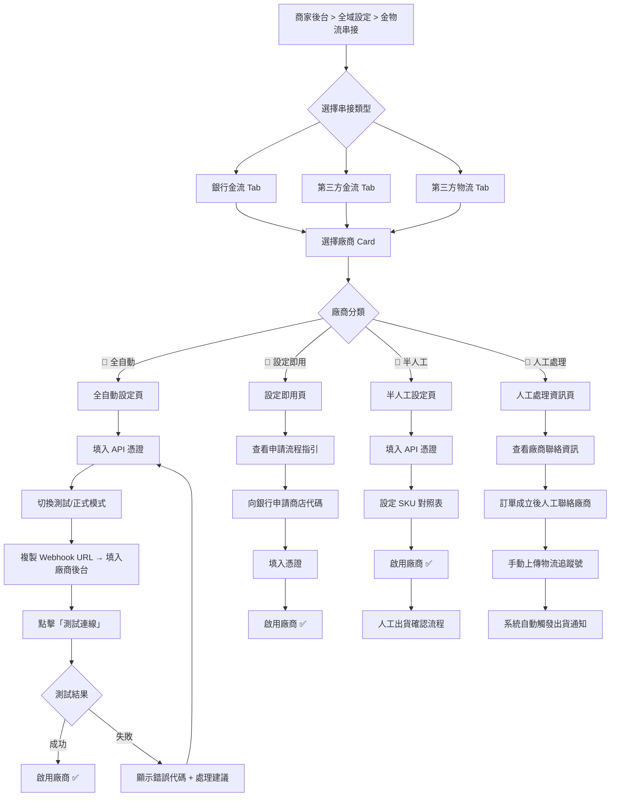
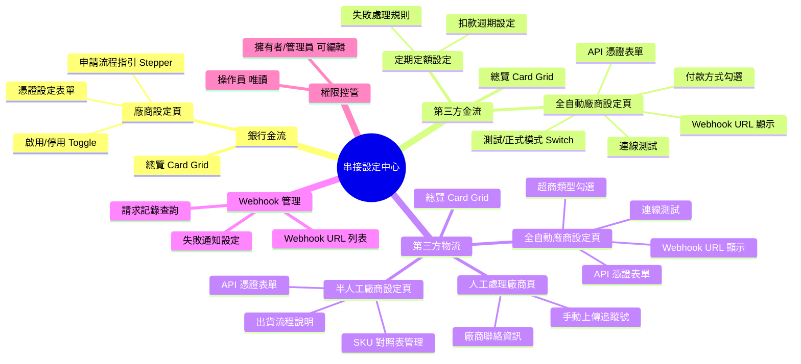
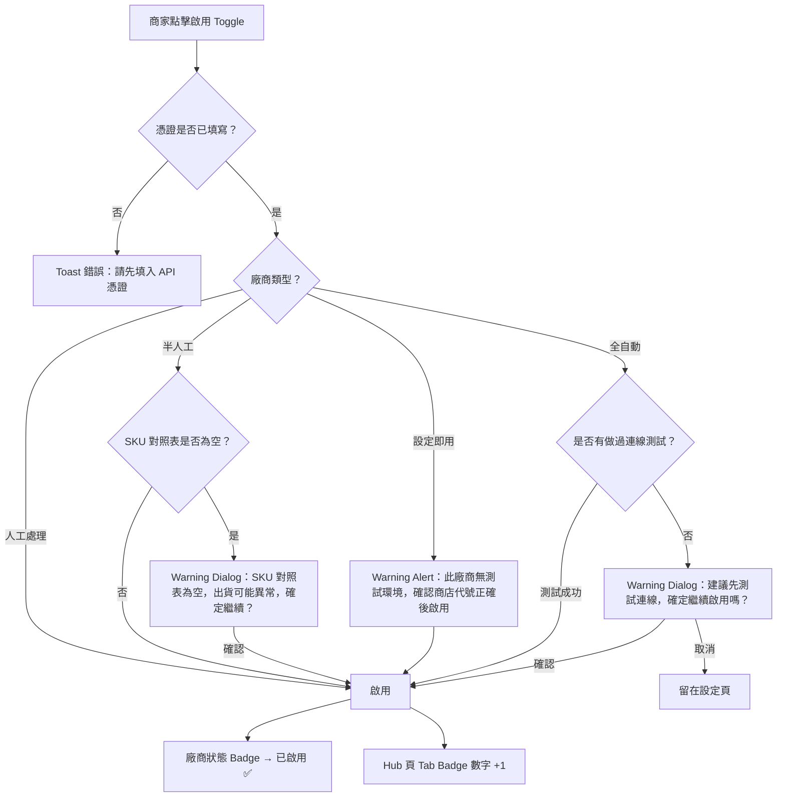
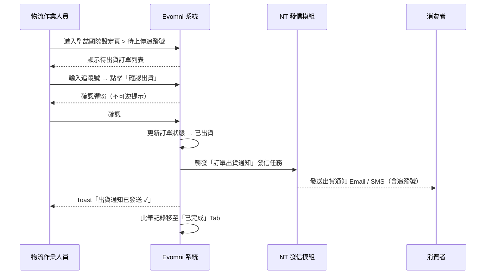
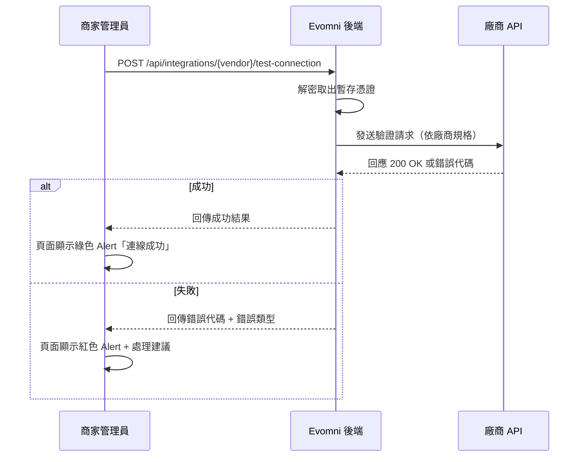

# Evomni — 串接設定後台管理介面 產品需求文件 (PRD) v1.0

## 1. 文件資訊

| 屬性 | 內容 |
| --- | --- |
| 版本 | v1.0 |
| 日期 | 2026/04/28 |
| 需求來源 | Evomni 串接廠商清單（銀行金流×14、第三方金流×14、第三方物流×7）；廖紫茵口述需求 |
| 文件狀態 | 🟢 初版完成，待設計師 Figma |
| 相關文件 | `Evomni_金物流串接規格_PRD.md`（API 技術規格，本文件不重複 API 細節） |
| 開發時程 | 階段一 5–8月（電商啟航方案）/ 階段二 9–12月（進階電商包）|

> **文件範圍說明**：本 PRD 規格化「商家操作後台的串接設定介面」——即商家如何在後台啟用、設定、測試各金物流廠商。API 技術實作細節（CheckMacValue、Webhook 驗簽等）請見 `Evomni_金物流串接規格_PRD.md`。

---

## 2. 目標與功能總覽

### 2.1 核心願景與相依性

**核心問題：** 電商商家需串接多家金流、物流廠商，但各家開通流程、憑證格式、測試方式差異極大，若沒有統一後台管理介面，商家設定成本高、出錯率高，客服協助難度也高。

**解決方案：** 建立「串接設定中心（Integration Hub）」，提供統一的視覺語言與操作流程，讓商家無論設定哪家廠商，都能依循相同的心智模型完成設定。

**Evomni 價值對應：**
- 降低商家開通成本 → 提升方案轉換率
- 統一 Webhook URL 管理 → 減少客服工單量
- 廠商狀態儀表板 → 金流異常即時可見

**系統相依性：**
| 依賴模組 | 說明 |
| --- | --- |
| Part 3 訂單管理 | 訂單付款狀態更新依賴金流 Webhook |
| Part 2 溫層重量運費設定 | 物流費率設定與物流廠商啟用連動 |
| 金物流串接規格 PRD | 本介面對應的後端 API 實作規格 |
| UA（商家帳號） | 設定權限控管，僅「擁有者/管理員」可操作串接設定 |

---

### 2.2 廠商分類：系統自動 vs. 人工處理（專業判斷）

> 本節為 PM 專業判斷，工程師依此決定各廠商的後台 UI 模板類型。

| 分類代號 | 說明 | 特徵 |
| --- | --- | --- |
| 🤖 **全自動** | 廠商提供完整沙箱 + REST API，商家填入憑證後系統全程自動處理付款/物流 | 可做連線測試、有測試/正式模式切換 |
| 🔧 **設定即用** | 商家需先向銀行/廠商人工申請商店代碼，申請完成後填入系統憑證，交易由對方 SDK/API 處理 | 無沙箱、無連線測試按鈕，僅憑證表單 |
| 🤝 **半人工** | API 存在但流程需人工確認某些步驟（如：倉庫確認備貨、手動上傳追蹤號） | 有 API 憑證設定 + 人工作業指引 |
| 👤 **人工處理** | 系統僅記錄訂單資訊，實際物流/付款流程由內部人員電話/Email 協調廠商 | 無憑證設定，提供廠商聯絡資訊 + 手動上傳單號 |

#### 銀行金流（14家）

| # | 廠商名稱 | 分類 | 判斷依據 |
| --- | --- | --- | --- |
| 1 | 永豐銀行（豐收款） | 🔧 設定即用 | 永豐豐收款有 REST API，但商家需先向永豐申請商店代碼與 API 憑證，無公開沙箱 |
| 2 | 兆豐銀行 | 🔧 設定即用 | 兆豐提供電商金流收款，商家申請後填入特店代號 |
| 3 | 國泰世華 | 🔧 設定即用 | 國泰世華 e 化收單，申請後獲得商店代碼與金鑰 |
| 4 | 玉山銀行 | 🔧 設定即用 | 玉山 e 支付，商家申請後填入憑證 |
| 5 | 華南銀行 | 🔧 設定即用 | 傳統銀行收單，人工申請 + 憑證填入 |
| 6 | 富邦銀行 | 🔧 設定即用 | 富邦 momo 收單體系，申請後取得憑證 |
| 7 | 彰化銀行 | 🔧 設定即用 | 傳統銀行收單，人工申請 + 憑證填入 |
| 8 | 聯合信用卡中心 | 🔧 設定即用 | NCCC 統一信用卡收單規格，多銀行共用入口，有完整 API 但需人工申請特店代號 |
| 9 | 第一銀行 | 🔧 設定即用 | 第一銀行電商收款，申請後取得憑證 |
| 10 | 合作金庫 | 🔧 設定即用 | 傳統銀行收單，申請後填入憑證 |
| 11 | 聯邦銀行 | 🔧 設定即用 | 聯邦銀行電商金流，申請後填入憑證 |
| 12 | 元大銀行（僅支付寶） | 👤 人工處理 | 支付寶台灣業務已大幅萎縮，無公開電商 API，需透過元大銀行人工協調；系統保留顯示但標示「需聯繫 Evomni 客服開通」 |
| 13 | 中國信託 | 🔧 設定即用 | 中信 CTBC Pay，有完整 API，申請後取得商店代碼 |
| 14 | 台新銀行 | 🔧 設定即用 | Richart Pay 電商收款，申請後取得憑證 |

#### 第三方金流（14家）

| # | 廠商名稱 | 分類 | 判斷依據 |
| --- | --- | --- | --- |
| 1 | 綠界科技 | 🤖 全自動 | 完整沙箱、REST API，ECPay 為台灣電商第一大第三方金流，文件完整 |
| 2 | 綠界科技-定期定額扣款 | 🤖 全自動 | ECPay 定期扣款 API，啟用需商家另外申請信用卡定扣服務 |
| 3 | 藍新科技 | 🤖 全自動 | 完整沙箱、NewebPay REST API，文件完整 |
| 4 | 紅陽科技 | 🤖 全自動 | SunTech Pay，有 API 與沙箱環境 |
| 5 | 客樂得 | 🤖 全自動 | Cherri Pay，支援 iPass Money + 多元支付，有 API |
| 6 | 歐付寶 | 🤖 全自動 | AllPay（綠界集團旗下），API 規格與 ECPay 相近 |
| 7 | 萬事達 | 🔧 設定即用 | Mastercard 不直接提供電商 API，商家需透過收單銀行申請 Mastercard 商家資格，後台僅需啟用對應銀行的 MC 收款方式；此欄為輔助說明頁 |
| 8 | smilepay 速買配 | 🤖 全自動 | 有 API，支援超商代碼、虛擬帳號、信用卡等 |
| 9 | PayPal | 🤖 全自動 | PayPal REST API，支援沙箱，完整文件，適合跨境電商 |
| 10 | AFTEE 先享後付 | 🤖 全自動 | AFTEE API，需商家申請審核（1-3 工作天），審核通過後系統全自動 |
| 11 | LINE Pay | 🤖 全自動 | LINE Pay Online API，有沙箱，兩段式授權（Request → Confirm） |
| 12 | PchomePAY 支付連 | 🤖 全自動 | 支付連 API，申請後取得 App ID / Secret |
| 13 | 網際威信 | 🔧 設定即用 | 老牌收單機構，介面較舊，需商家人工申請，無公開現代 API 沙箱，申請後填入憑證 |
| 14 | 街口支付 | 🤖 全自動 | Jkopay 電商 API，有申請流程，通過後可使用 API |

#### 第三方物流（7家）

| # | 廠商名稱 | 分類 | 判斷依據 |
| --- | --- | --- | --- |
| 1 | 綠界科技 | 🤖 全自動 | ECPay 物流 API，支援 7-11、全家、萊爾富超商取貨，有沙箱 |
| 2 | 藍新科技 | 🤖 全自動 | 藍新物流 API，支援超商物流 |
| 3 | 紅陽科技 | 🤖 全自動 | 紅陽科技物流 API，支援超商配送 |
| 4 | 統一數網 | 🤖 全自動 | iMe 物流 API，統一超商旗下，支援 7-11 超商取貨 |
| 5 | 低溫超取_聖喆國際 | 👤 人工處理 | 聖喆國際（Sendjie）專做低溫宅配，無公開 API，訂單需由內部物流人員電話/Email 通知廠商、手動上傳冷鏈追蹤號 |
| 6 | 倉儲物流_BOXFUL 任意存 | 🤝 半人工 | BOXFUL 提供倉儲出貨 API，但需倉儲合約在前，出貨確認後系統可獲取追蹤號；部分流程（入庫確認）需人工 |
| 7 | 倉儲物流_ECFIT | 🤝 半人工 | ECFIT 為 SaaS ERP，提供倉儲出貨 webhook；需商家自行設定 ECFIT 側的品項對照，初始對接需人工協調 |

---

### 2.3 功能總覽表

本 PRD 涵蓋以下後台功能頁面與元件：

| 主功能模組 | 子功能項目 | 功能目的 | 功能詳細描述 | 影響之使用者 |
| --- | --- | --- | --- | --- |
| 串接設定中心 | 串接總覽 Hub 頁 | 提供所有廠商的啟用狀態一覽 | Card Grid 顯示全部廠商，依「銀行金流 / 第三方金流 / 第三方物流」Tab 分類；顯示啟用狀態、連線健康度 | 商家管理員 |
| 串接設定中心 | 廠商狀態 Badge | 即時反映串接健康狀態 | 5 種狀態：未設定 / 設定中 / 已啟用 / 已停用 / 連線異常；異常時 Badge 變紅並顯示最後錯誤代碼 | 商家管理員 |
| 全自動廠商設定 | 憑證設定表單 | 讓商家填入第三方金流憑證 | 依廠商顯示對應欄位（MerchantID / HashKey / HashIV / App ID / Secret 等）；所有 Secret 類欄位顯示為 `●●●●●●` 遮罩 | 商家管理員 |
| 全自動廠商設定 | 測試/正式模式切換 | 區隔沙箱與正式環境 | Toggle 切換「測試模式（沙箱）」與「正式模式（Live）」；測試模式時頂部顯示黃色警示 Banner | 商家管理員 |
| 全自動廠商設定 | 連線測試 | 驗證憑證是否正確 | 點擊「測試連線」→ 系統對廠商 API 發送驗證請求 → 顯示成功/失敗結果與錯誤代碼 | 商家管理員 |
| 全自動廠商設定 | Webhook URL 顯示 | 讓商家複製 Webhook 網址填入廠商後台 | 唯讀欄位顯示本系統的 Webhook URL；一鍵複製按鈕；每個廠商各自獨立 URL | 商家管理員 |
| 全自動廠商設定 | 啟用付款方式選擇 | 同一廠商可能支援多種付款方式 | 多選 Checkbox：信用卡一次 / 分期 / ATM 虛擬帳號 / 超商代碼 / LINE Pay 等（依廠商能力顯示）| 商家管理員 |
| 設定即用廠商設定 | 銀行憑證設定 | 讓商家填入銀行核發的商店代碼 | 表單含商店代碼、API 金鑰、加密 Key 等；說明文字標示「請向銀行申請後填入，Evomni 不協助申請」 | 商家管理員 |
| 設定即用廠商設定 | 申請流程指引 | 引導商家完成銀行申請 | Stepper 元件顯示申請步驟；每步驟含說明文字與「查看說明」超連結（指向銀行官方頁面） | 商家管理員 |
| 人工處理廠商設定 | 廠商聯絡資訊 | 提供商家人工協調所需的聯絡方式 | 顯示廠商客服電話、Email、服務時間；不提供 API 設定欄位 | 商家管理員、物流人員 |
| 人工處理廠商設定 | 手動上傳物流單號 | 讓操作人員回填物流追蹤號至訂單 | 依訂單號查詢 → 填入追蹤號 → 系統觸發「出貨通知」簡訊/信件給消費者 | 物流作業人員 |
| 半人工廠商設定 | 倉儲設定與品項對照 | 設定 BOXFUL / ECFIT 倉庫代碼與商品 SKU 對照 | 表格型設定：本系統 SKU ↔ 倉儲廠商 SKU 對照；支援 CSV 批次匯入 | 商家管理員 |
| 半人工廠商設定 | 出貨確認流程 | 半人工出貨作業流程說明 | Timeline 元件說明：下單 → 系統通知廠商 → 廠商備貨確認 → 系統取得追蹤號 → 通知消費者；每步驟標示由「系統自動」或「人工確認」執行 | 商家管理員 |
| Webhook 管理 | Webhook 記錄查詢 | 供商家與客服排查付款問題 | 依廠商、時間範圍篩選；顯示每筆請求的狀態碼、Payload 摘要、回應時間；失敗記錄標紅 | 商家管理員 |
| 定期定額設定 | 定期扣款設定（綠界） | 設定循環訂閱付款參數 | 扣款週期（月/季/年）、失敗重試次數、失敗處理方式（暫停/取消訂閱）；需商家另外向 ECPay 申請定扣服務 | 商家管理員 |
| 權限控管 | 串接設定權限鎖 | 避免非授權人員更改金流設定 | 僅「擁有者」與「管理員」角色可進入串接設定；「操作員」角色可查看狀態但無法編輯 | 商家管理員 |

---

## 3. 全局功能流程



---

## 4. 功能結構圖



---

## 5. 使用者故事

**US-01**　身為商家管理員，我想要在串接設定中心一眼看到所有金物流廠商的啟用狀態，以便於快速發現哪些串接設定異常需要處理。

**US-02**　身為商家管理員，我想要在設定綠界科技時能切換到測試模式做沙箱測試，以便於在正式上線前驗證付款流程正確無誤。

**US-03**　身為商家管理員，我想要系統直接提供 Webhook URL 讓我複製貼至廠商後台，以便於省去手動輸入錯誤的困擾。

**US-04**　身為商家管理員，我想要設定銀行金流時有清楚的申請步驟說明，以便於知道要去哪裡申請商店代碼，而不用打電話給客服詢問。

**US-05**　身為物流作業人員，我想要在系統中手動輸入聖喆國際（低溫超取）的物流追蹤號，以便於系統自動觸發出貨通知給消費者，不需要我另外去聯絡消費者。

**US-06**　身為商家管理員，我想要設定 BOXFUL 倉儲時能上傳 SKU 對照 CSV，以便於批次對應本系統商品與倉庫 SKU，不需要逐一手動填入。

**US-07**　身為商家管理員，我想要在測試連線失敗時看到清楚的錯誤原因與解決建議，以便於自行排查問題，不需要每次都開工單給 Evomni 客服。

**US-08**　身為商家管理員，我想要啟用綠界科技定期定額扣款時能設定扣款失敗的處理方式（暫停/取消訂閱），以便於控制因付款失敗導致的服務中斷風險。

**US-09**　身為商家擁有者，我想要限制只有管理員以上才能修改串接設定，以便於避免操作員誤改金流憑證造成付款異常。

**US-10**　身為商家管理員，我想要查詢 Webhook 請求記錄，以便於在訂單付款狀態異常時，確認是否為廠商回呼失敗造成的問題。

---

## 6. UI/UX 與詳細功能需求

### 6.1 串接設定中心（Hub 總覽頁）

#### A. 核心使用者流程

1. 商家進入「後台 > 全域設定 > 金物流串接」
2. 頁面預設顯示「第三方金流」Tab（最高使用頻率）
3. 看到所有廠商的 Card，依「已啟用 / 未設定 / 連線異常」排序
4. 點擊任一 Card 進入該廠商設定頁

#### B. 介面佈局與元件拆解（Figma Ready）

**頁面 Header**
- 麵包屑：全域設定 > 金物流串接
- 頁面標題：`串接設定`（H2，`#303133`，20px Bold）
- 說明文字：`管理您的金流與物流串接廠商，啟用後即可在結帳流程中使用。`（14px，`#606266`）

**Tab 列（Element Plus `<el-tabs>`）**
- Tab 1：銀行金流（顯示已啟用數量 Badge，如：`銀行金流 3`）
- Tab 2：第三方金流（同上）
- Tab 3：第三方物流（同上）
- Active Tab 下方藍色底線（`#409EFF`）

**廠商 Card Grid**
- 每行 4 欄（桌機），響應式調整為 2 欄（平板）
- Card 元件：`<el-card>` + 白底 + `border: 1px solid #DCDFE6` + 無圓角（`!rounded-none`）
- Card 內容：
  - 廠商 Logo（40×40px，灰底底板 `#F5F7FA` padding 8px）
  - 廠商名稱（16px Semibold，`#303133`）
  - 廠商類型標籤（`<el-tag class="!rounded-full">`，銀行金流=藍、第三方金流=紫、物流=綠）
  - 狀態 Badge（見下方狀態說明）
  - 底部操作區：`設定` 按鈕（`<el-button type="primary" class="!rounded-none" size="small">`）

**狀態 Badge 規格（`<el-badge>`）**

| 狀態 | Badge 色 | 文字 | 觸發條件 |
| --- | --- | --- | --- |
| 未設定 | `#909399`（灰） | 未設定 | 尚未填入任何憑證 |
| 設定中 | `#E6A23C`（警告黃） | 設定中 | 憑證已填但尚未啟用 |
| 已啟用 | `#67C23A`（綠） | 已啟用 | 啟用 Toggle = ON |
| 已停用 | `#909399`（灰） | 已停用 | 啟用 Toggle = OFF（曾設定過） |
| 連線異常 | `#F56C6C`（紅） | 連線異常 | 最近一次 Webhook 回呼失敗 / 連線測試失敗 |

**搜尋欄**（全文搜尋廠商名稱，`<el-input>` Placeholder：`搜尋廠商名稱`）

#### C. 互動設計、狀態與系統反饋

- **空 Tab**：若某類別（如：物流）完全未設定，顯示空白頁引導文案：「尚未設定任何物流串接，點擊廠商卡片開始設定。」+ 插畫 icon
- **連線異常 Card**：Card 頂部顯示紅色細線（4px 高），懸停（Hover）時 Tooltip 顯示：`最近一次連線失敗：[錯誤代碼] — [時間]`
- **Hover 效果**：Card 整體 `box-shadow: 0 4px 12px rgba(0,0,0,0.08)`

#### D. 防呆機制與錯誤預防

- 權限不足（操作員角色）：所有 Card 的「設定」按鈕顯示 `🔒 需管理員權限`（`#909399`，Disabled 狀態），點擊時 Toast：「您沒有修改串接設定的權限，請聯繫帳號擁有者。」

---

### 6.2 全自動廠商設定頁（通用模板）

> **適用廠商**：綠界科技、藍新科技、紅陽科技、客樂得、歐付寶、smilepay、PayPal、AFTEE、LINE Pay、PchomePAY、街口支付、綠界物流、藍新物流、紅陽物流、統一數網

#### A. 核心使用者流程

1. 從 Hub 頁點擊廠商 Card 的「設定」→ 進入廠商設定頁
2. 查看廠商基本資訊與申請連結
3. 填入 API 憑證
4. 切換至測試模式，複製 Webhook URL 至廠商後台
5. 點擊「測試連線」驗證憑證正確性
6. 測試成功後切換至正式模式 → 啟用

#### B. 介面佈局與元件拆解（Figma Ready）

**頁面 Header**
- 麵包屑：串接設定 > [廠商名稱]
- 廠商 Logo（64×64px）+ 廠商全名（H2）+ 類型 Tag + 狀態 Badge
- 右上角：「啟用/停用」Toggle（`<el-switch>`，Label：`啟用串接`；OFF 時頁面整體降彩度 opacity: 0.6 提示）

**區塊一：廠商資訊（Collapse 可收合，預設展開）**

| 欄位 | 說明 |
| --- | --- |
| 支援付款方式 | 多選 `<el-checkbox-group>`（依廠商動態渲染，例如：信用卡一次付清、分期 3/6/12 期、ATM 虛擬帳號、超商代碼等）|
| 廠商申請頁連結 | `<el-link type="primary">` 開新視窗，文字：「前往 [廠商名稱] 申請商家帳號」|
| 技術文件連結 | `<el-link>` 開新視窗，文字：「查看 API 串接文件」|

**區塊二：API 憑證設定（`<el-form>`）**

> 各廠商欄位不同，下表為對應關係：

| 廠商 | 欄位 1 | 欄位 2 | 欄位 3 | 欄位 4 |
| --- | --- | --- | --- | --- |
| 綠界科技 | 特店編號 MerchantID | HashKey | HashIV | — |
| 藍新科技 | 商店代號 MerchantID | HashKey | HashIV | — |
| 紅陽科技 | 商店代號 | 加密金鑰 | — | — |
| 客樂得 | App ID | App Key | — | — |
| 歐付寶 | 特店編號 | HashKey | HashIV | — |
| smilepay | 速配碼 | 驗證碼 | — | — |
| PayPal | Client ID | Client Secret | — | — |
| AFTEE | API Token | — | — | — |
| LINE Pay | Channel ID | Channel Secret Key | — | — |
| PchomePAY | App ID | App Secret | — | — |
| 街口支付 | Store ID | API Key | — | — |
| 綠界物流 | 特店編號 | HashKey | HashIV | — |
| 藍新物流 | 商店代號 | HashKey | HashIV | — |
| 統一數網 | 廠商代號 | API Token | — | — |

**表單欄位通用規格：**
- 元件：`<el-input>`，Label 在上方
- Secret/Key 欄位：`type="password"` + 右側眼睛 icon 切換顯示（`<el-icon><View /></el-icon>`）
- Placeholder：`請輸入 [欄位名稱]`
- 驗證：必填，不可為空格
- 錯誤訊息：`[欄位名稱] 不能為空` / `格式不符，請確認複製來源`

**區塊三：測試/正式模式切換**
- 元件：`<el-radio-group>` 排成 2 個大按鈕樣式
  - 選項一：`🧪 測試模式（沙箱）`—— 不會真實扣款
  - 選項二：`🚀 正式模式（Live）`—— 實際收款，確認所有設定正確後再啟用
- 選擇「測試模式」時，頁面頂部顯示橘黃色 Alert Banner：`目前為沙箱測試環境，所有交易不會實際收款。`
- 切換至「正式模式」時觸發 `<el-dialog>` 確認彈窗：「確認要切換至正式模式嗎？切換後所有交易將進行真實收款。」按鈕：「確認切換」（紅色）/ 「取消」

**區塊四：Webhook 設定**
- 標題：`Webhook 設定`（Sub-section H4）
- 說明文字：`請將以下 URL 複製至 [廠商名稱] 後台的 Webhook 通知設定欄位，系統將透過此網址接收付款結果通知。`
- Webhook URL 欄位：`<el-input readonly>`，右側「複製」Button（點擊後 Toast：`已複製到剪貼簿 ✓`）
- URL 格式：`https://[商家網域]/api/webhooks/payment/[廠商代號]`

**區塊五：連線測試**
- 按鈕：`測試連線`（`<el-button type="default" class="!rounded-none">`）
- 點擊後：Loading 狀態，按鈕文字變「測試中…」
- 成功結果：`<el-alert type="success">` 顯示：`連線成功！廠商 API 回應正常，憑證驗證通過。`
- 失敗結果：`<el-alert type="error">` 顯示：
  - `連線失敗：[錯誤代碼]`
  - 常見錯誤對照說明（見 §6.2D）

**底部操作列（Fixed Bar）**
- 左側：`上次儲存時間：[時間戳]`（`#909399`，12px）
- 右側：「取消」Button（Secondary）+ 「儲存設定」Button（Primary `#303133`）
- 儲存後 Toast：`設定已儲存 ✓`
- 有未儲存變更時，離頁觸發 `<el-dialog>` 提示：「您有未儲存的設定，確認要離開嗎？」

#### C. 互動設計、狀態與系統反饋

- **首次進入未填憑證**：憑證欄位顯示 Placeholder，區塊三（測試/正式切換）與區塊五（連線測試）呈 Disabled 狀態，並顯示提示：`請先填入 API 憑證後才能測試連線`
- **AFTEE 特殊說明**：憑證欄位上方顯示 Info Box（淺藍底 `#ecf5ff`）：`AFTEE 先享後付需先向廠商申請審核，審核通過（約 1-3 工作天）後廠商將寄送 API Token。`
- **LINE Pay 特殊說明**：Info Box 說明「LINE Pay 採兩段式授權，消費者點擊付款後需跳轉至 LINE Pay 確認畫面。」

#### D. 防呆機制與錯誤預防

**連線測試失敗代碼對照表（系統顯示在 Alert 中）**

| 錯誤類型 | 顯示訊息 | 建議處理 |
| --- | --- | --- |
| 憑證格式錯誤 | `API 金鑰格式不符，請確認是否完整複製` | 返回廠商後台重新複製 |
| 憑證驗證失敗（401） | `商店代號或金鑰錯誤，請確認填入正確的憑證` | 確認商店代號與 HashKey/HashIV 是否輸入正確 |
| 連線逾時 | `無法連線至廠商伺服器（逾時），請稍後再試` | 稍後重試或確認廠商服務狀態 |
| 測試環境憑證用於正式模式 | `偵測到沙箱憑證，請切換至「測試模式」後再測試，或取得正式環境憑證` | 切換模式 |

---

### 6.3 設定即用廠商設定頁（銀行金流通用模板）

> **適用廠商**：銀行金流 13 家（永豐、兆豐、國泰世華、玉山、華南、富邦、彰化、聯合信用卡中心、第一銀行、合作金庫、聯邦、中國信託、台新）

#### A. 核心使用者流程

1. 進入廠商設定頁 → 看到申請流程 Stepper
2. 依指引完成銀行人工申請（系統外作業）
3. 取得商店代號後回到系統填入憑證
4. 啟用

#### B. 介面佈局與元件拆解（Figma Ready）

**頁面 Header**（同 §6.2 規格，移除「連線測試」按鈕區）

**區塊一：申請流程指引（`<el-steps>` 垂直 Stepper）**

> 步驟文字依銀行自訂，通用模板如下：

- **Step 1**：`前往 [銀行名稱] 官網申請電商收款服務`（附外部連結按鈕「前往申請」）
- **Step 2**：`簽署合約，等待銀行審核（約 5-10 工作天）`
- **Step 3**：`取得商店代碼與 API 金鑰`（附說明：「通常由銀行業務以 Email 傳送」）
- **Step 4**：`將商店代碼填入下方設定表單 → 啟用`

Stepper 狀態：全部預設為「未完成」（`process`），商家自行確認，無法自動偵測銀行端狀態。

**區塊二：憑證設定表單**（同 §6.2 規格，移除沙箱/測試模式切換）

> 注意：銀行金流無公開沙箱環境，後台不提供連線測試按鈕。頁面顯示說明：
> `銀行金流不提供沙箱環境，請填入真實商店代碼後直接啟用。首次建議以小金額測試交易確認串接正確。`

**區塊三：Webhook URL**（同 §6.2 規格）

**特殊廠商：萬事達（Mastercard）**
- 不顯示憑證表單，改顯示說明 Card（淺黃底 `#fdf6ec`，橘色邊框）：
  ```
  ⚠️  萬事達 (Mastercard) 不直接提供電商 API
  Mastercard 信用卡收款需透過您已串接的銀行或第三方金流廠商啟用。
  建議在下方廠商中啟用信用卡「Mastercard」付款方式：
  ✓ 綠界科技 → 信用卡
  ✓ 藍新科技 → 信用卡
  ✓ 各銀行金流 → 刷卡收款（已含 Mastercard 網路）
  ```
- 操作建議按鈕：「前往設定綠界科技」（Secondary Button）

#### C. 互動設計、狀態與系統反饋

- 「啟用」Toggle 上方顯示橘色提示：`此廠商不提供連線測試，啟用前請確認商店代號與金鑰正確。`
- **元大銀行（僅支付寶）** 顯示說明卡片：
  ```
  ⚠️  此功能需人工開通
  元大銀行支付寶台灣業務需透過 Evomni 客服申請。
  請聯繫 Evomni 業務團隊以開通此功能。
  ```
  不顯示憑證表單。

#### D. 防呆機制與錯誤預防

- 若商家直接填入疑似測試用的假值（如 `test123`、`abc`），儲存時顯示 Warning Toast：`您填入的商店代號較短，請確認是否為完整的銀行核發代號。`（非強制阻擋，僅警示）

---

### 6.4 人工處理廠商設定頁

> **適用廠商**：低溫超取_聖喆國際

#### A. 核心使用者流程

**路徑 A（設定廠商）：**
1. 進入廠商頁 → 查看廠商聯絡資訊與作業流程
2. 啟用此廠商（Toggle ON = 結帳時顯示此物流選項）

**路徑 B（手動上傳追蹤號）：**
1. 進入廠商頁 > 「手動上傳追蹤號」區塊
2. 輸入訂單號 → 查詢 → 填入追蹤號 → 系統觸發出貨通知

#### B. 介面佈局與元件拆解（Figma Ready）

**頁面 Header**（移除「連線測試」，移除「API 憑證」區塊）
- 廠商 Logo + 名稱 + 說明文字：`此廠商採人工協調出貨，系統不直接對接廠商 API。`
- 說明 Banner（淡橘底 `#fef0e6`）：`啟用後，結帳頁將顯示「低溫宅配（聖喆國際）」選項。訂單成立後，請依以下流程通知廠商出貨，並手動在系統填入物流追蹤號。`

**區塊一：作業流程（`<el-timeline>`）**

- **步驟 1**：`消費者下單完成` → 系統自動（`<el-tag>系統自動</el-tag>`）
- **步驟 2**：`物流人員聯繫聖喆國際確認取件` → 人工作業（`<el-tag type="warning">人工</el-tag>`）
- **步驟 3**：`廠商出貨，取得冷鏈追蹤單號` → 人工作業（`<el-tag type="warning">人工</el-tag>`）
- **步驟 4**：`在本系統填入追蹤號（見下方）` → 人工作業（`<el-tag type="warning">人工</el-tag>`）
- **步驟 5**：`系統自動發送「您的訂單已出貨」通知給消費者` → 系統自動

**區塊二：廠商聯絡資訊 Card**

| 欄位 | 內容 |
| --- | --- |
| 廠商名稱 | 聖喆國際股份有限公司 |
| 服務電話 | （填入廠商實際電話） |
| 服務信箱 | （填入廠商實際 Email） |
| 服務時間 | 週一至週五 09:00–18:00 |
| 備註 | （可由商家自行備註業務聯絡人姓名等） |

**區塊三：手動上傳物流追蹤號（`<el-table>` + 行內編輯）**

- 頁籤：`待上傳追蹤號 (N)` / `已完成`
- 表格欄位：訂單號 / 消費者姓名 / 商品名稱 / 付款時間 / 追蹤號（可編輯欄位）/ 操作
- 「追蹤號」欄位：空白顯示 `<el-input placeholder="輸入追蹤號">`；填入後顯示「確認出貨」按鈕
- 點擊「確認出貨」：
  - 確認彈窗：「確認上傳追蹤號 [號碼] 並發送出貨通知給消費者 [姓名]？」
  - 確認後：Toast「出貨通知已發送 ✓」；此筆記錄移至「已完成」Tab
- 批次操作：勾選多筆 → 「批次輸入追蹤號」（彈出批次上傳 Dialog，支援 Excel/CSV 匯入）

#### C. 互動設計、狀態與系統反饋

- 「待上傳追蹤號」Tab 的 Badge 數字超過 10 時，頁面 Title 旁顯示紅色 Dot 提醒
- 訂單超過 48 小時未上傳追蹤號，該列背景變淡紅色 `#fef0f0`，追蹤號欄位旁顯示 `⚠️ 已超過 48 小時`

#### D. 防呆機制與錯誤預防

- 確認出貨後不可反悔（出貨通知已寄出），點擊「確認出貨」的確認 Dialog 標題標示「⚠️ 此操作不可逆」

---

### 6.5 半人工廠商設定頁（倉儲物流）

> **適用廠商**：BOXFUL 任意存、ECFIT

#### A. 核心使用者流程

1. 填入 API 憑證 → 連線測試
2. 設定 SKU 對照表（本系統 SKU ↔ 倉庫 SKU）
3. 啟用
4. 訂單出貨：系統推送訂單至倉儲廠商 → 廠商出貨後回呼追蹤號 → 系統自動通知消費者
5. 若廠商未回呼追蹤號（例外情況）→ 人工上傳補救

#### B. 介面佈局與元件拆解（Figma Ready）

**區塊一：API 憑證設定**（同 §6.2 規格，含連線測試）

**區塊二：倉庫資訊設定**
- 倉庫代碼（`<el-input>`，Placeholder：`向廠商取得倉庫代碼`）
- 預設出貨倉（若多倉庫，`<el-select>` 下拉選擇）

**區塊三：SKU 對照表管理**

- 說明文字：`請將本系統的商品 SKU 對應至倉儲廠商的 SKU，以便下單時系統正確通知倉庫揀貨。`
- 表格欄位：本系統 SKU / 商品名稱 / 倉儲廠商 SKU / 最後更新時間 / 操作（編輯/刪除）
- 操作按鈕：
  - `+ 新增對照`（逐筆新增）
  - `批次匯入`（CSV 格式，支援下載模板，格式：`系統SKU,倉儲SKU`）
  - `下載對照表`（匯出目前設定為 CSV）
- 未對照的 SKU：表格頂部顯示 Warning Banner：`有 [N] 個商品 SKU 尚未對照，可能導致訂單出貨異常。` + 「前往設定」按鈕

**區塊四：出貨確認流程說明**（`<el-timeline>`，半人工版）

- 步驟 1：消費者下單 → 系統自動
- 步驟 2：系統推送訂單至 [倉儲廠商] API → 系統自動
- 步驟 3：倉庫備貨、出貨 → 廠商作業
- 步驟 4：廠商回呼物流追蹤號至本系統 → 系統自動接收
- 步驟 5：系統發送出貨通知至消費者 → 系統自動
- 步驟 6（例外）：若廠商未回呼，可至「追蹤號管理」手動補填 → 人工補救

**區塊五：追蹤號手動補填**（`<el-collapse>` 預設收合，例外情況才用）
- 同 §6.4 的「手動上傳物流追蹤號」設計

#### C. 互動設計、狀態與系統反饋

- SKU 對照表為空時，「儲存設定」按鈕旁顯示 Warning：`SKU 對照表為空，啟用後可能無法正確通知倉庫出貨。`（非阻擋，僅警示）

#### D. 防呆機制與錯誤預防

- CSV 批次匯入：若 CSV 格式錯誤（欄位數不符），顯示 Error Dialog 指出第幾行有問題
- 若新增對照時輸入的「本系統 SKU」不存在於商品資料，欄位即時紅框並提示：`找不到此 SKU，請確認商品中心是否已建立此商品`

---

### 6.6 定期定額設定（綠界科技 — 信用卡定扣）

> **適用廠商**：綠界科技-定期定額扣款（僅在進階電商包方案顯示）

#### A. 核心使用者流程

1. 需先完成「綠界科技（一般金流）」設定並啟用
2. 進入定期定額子頁面 → 設定扣款參數 → 啟用

#### B. 介面佈局與元件拆解（Figma Ready）

**前提條件 Banner**（若一般版綠界科技尚未啟用，顯示鎖定狀態）：
`🔒 此功能需先啟用「綠界科技」一般金流後才可設定。` + `前往設定` 按鈕

**扣款參數設定表單**

| 欄位 | 元件類型 | 選項/說明 |
| --- | --- | --- |
| 扣款週期 | `<el-radio-group>` | 每月 / 每季 / 每半年 / 每年 |
| 扣款日 | `<el-select>` | 1-28（不可選 29/30/31 以避免月份不一致問題，Tooltip 說明原因）|
| 失敗重試次數 | `<el-input-number>` min=0 max=5 | Tooltip：`付款失敗後，系統將在 [N] 天後重試，最多重試 N 次` |
| 失敗後處理方式 | `<el-radio-group>` | 暫停訂閱（保留訂單，待消費者更新付款方式）/ 自動取消訂閱 |
| 失敗通知 | `<el-checkbox>` | 勾選後，付款失敗時發送 Email 通知消費者 |

**啟用前說明 Alert**（淡紅底）：
`啟用定期定額扣款前，請確認已向綠界科技申請「定期定額扣款」加值服務，此服務需額外申請且可能有附加費用。`

#### C. 互動設計、狀態與系統反饋

- 選擇「自動取消訂閱」時，右側出現淡黃色提示：`選擇此選項後，消費者若付款失敗將自動取消訂閱，無法復原，請謹慎選擇。`

---

### 6.7 Webhook 管理頁

#### A. 核心使用者流程

1. 後台 > 全域設定 > 金物流串接 > Webhook 管理
2. 查看所有廠商的 Webhook URL 清單
3. 篩選查詢 Webhook 請求記錄（排查問題用）

#### B. 介面佈局與元件拆解（Figma Ready）

**Tab 一：Webhook URL 清單**

- 表格欄位：廠商名稱 / 串接類型 / Webhook URL（可複製）/ 狀態（正常/異常）/ 最後收到請求時間
- 每列右側「複製 URL」icon 按鈕

**Tab 二：請求記錄**

- 篩選列：廠商下拉選（All / 各廠商）/ 狀態（全部 / 成功 / 失敗）/ 時間範圍（DatePicker）
- 表格欄位：時間 / 廠商 / 請求類型 / 狀態碼 / 訂單號 / 耗時（ms）/ 操作（查看詳情）
- 失敗記錄：整列背景 `#fef0f0`
- 點擊「查看詳情」→ 側邊 Drawer 展開，顯示：Request Header、Request Body（截斷顯示前 1000 字元）、Response Body

**Tab 三：失敗通知設定**

- `<el-switch>` 啟用「Webhook 失敗時寄送 Email 通知」
- 通知信箱：`<el-input>` 可填入多個（Enter 分隔）
- 觸發條件：連續失敗 [N] 次（`<el-input-number>` min=1 max=10）

#### D. 防呆機制與錯誤預防

- 記錄保留 90 天，超過自動清除；頁面頂部提示：`Webhook 記錄保留最近 90 天。`

---

## 7. 細部邏輯流程圖

### 7.1 廠商啟用/停用判定流程



### 7.2 手動上傳追蹤號流程



### 7.3 全自動廠商連線測試流程



---

## 8. 非功能性需求

### 8.1 效能需求

| 指標 | 要求 |
| --- | --- |
| 串接設定 Hub 頁載入 | ≤ 1.5 秒（含所有廠商狀態查詢）|
| 連線測試回應 | ≤ 10 秒（前端設定 10s timeout，逾時顯示連線逾時訊息）|
| Webhook 請求記錄查詢 | ≤ 2 秒（最多 90 天記錄）|
| SKU 對照表 CSV 匯入 | ≤ 5 秒（≤ 5,000 行）|

### 8.2 安全性需求

| 需求 | 規格 |
| --- | --- |
| API 憑證儲存 | HashKey / Secret 等敏感欄位存入資料庫前必須加密（AES-256）；API 回傳時永遠遮罩，不回傳明文 |
| 權限驗證 | 所有串接設定的 API endpoints 必須驗證角色（`role = owner OR admin`），否則回傳 403 |
| Webhook URL 唯一性 | 每家廠商的 Webhook URL 包含 UUID token（`/api/webhooks/payment/{uuid}/{vendor}`），避免 URL 枚舉 |
| 連線測試速率限制 | 同一廠商連線測試限 5 次/分鐘，超過返回 429 + Toast：「測試過於頻繁，請稍後再試」|

### 8.3 資料一致性

- 廠商設定啟用/停用操作需寫入 `integration_logs` 表留存異動記錄（操作人員 ID、時間、變更內容）
- 廠商 Toggle 停用時，不得中斷進行中的交易；僅對新訂單的付款選項隱藏此廠商
- SKU 對照表更新後，不影響已成立的訂單出貨邏輯（已成立訂單已快照 SKU 資訊）

### 8.4 瀏覽器/裝置支援

- 桌機優先（Chrome 120+、Safari 17+、Firefox 120+、Edge 120+）
- 平板裝置（iPad Pro）適配（Card Grid 從 4 欄變 2 欄）
- 不強制要求手機版（串接設定為後台管理功能，非高頻手機使用場景）

### 8.5 方案限制

| 功能 | 電商啟航方案 | 進階電商包 |
| --- | --- | --- |
| 銀行金流（全 14 家） | ✅ | ✅ |
| 第三方金流（全 14 家，含 LINE Pay、PayPal） | ✅ | ✅ |
| 第三方物流（綠界/藍新/紅陽/統一數網） | ✅ | ✅ |
| 低溫超取_聖喆國際 | ✅ | ✅ |
| 倉儲物流（BOXFUL / ECFIT） | ❌ | ✅ |
| 綠界科技-定期定額扣款 | ❌ | ✅ |

> 啟航方案商家進入倉儲物流或定期定額設定頁時，顯示升級 Banner：`此功能為進階電商包專屬。🔒 升級後即可使用。` + 「了解升級方案」Button

---

## 與團隊溝通摘要

- **這份規格是關於「串接設定後台管理介面」**，解決的是商家設定金物流廠商時介面不一致、設定困難、出錯難排查的問題。API 技術細節（CheckMacValue、Webhook 驗簽）請見 `Evomni_金物流串接規格_PRD.md`。
- **工程師這邊需要注意**：廠商分類共 4 種（全自動/設定即用/半人工/人工處理），對應 4 套不同的後台 UI 模板，請依本文件 §2.2 的分類表實作不同頁面；所有 Secret 欄位入庫前 AES-256 加密，回傳一律遮罩。
- **設計師這邊需要注意**：Hub 總覽頁的廠商 Card Grid 共 35 家廠商（14+14+7），需考慮 Logo 尺寸統一（建議廠商 Logo 統一 40×40px 灰底容器）；「人工處理」廠商的 Timeline 元件需設計「系統自動」vs「人工」兩種節點樣式。
- **倉儲物流（BOXFUL / ECFIT）與定期定額扣款**是進階電商包專屬功能，啟航方案需顯示升級鎖定 Banner。
- **聖喆國際（低溫超取）** 無 API，整個後台介面設計為「人工流程輔助工具」，重點是讓物流人員能快速批次上傳追蹤號並觸發消費者通知，非技術性的憑證設定。
- **待確認事項**：進階版金流「自選 6 種」的廠商清單（議題 #2）尚未定義，本 PRD 按全清單實作，待方案確認後再加上方案鎖定邏輯。
