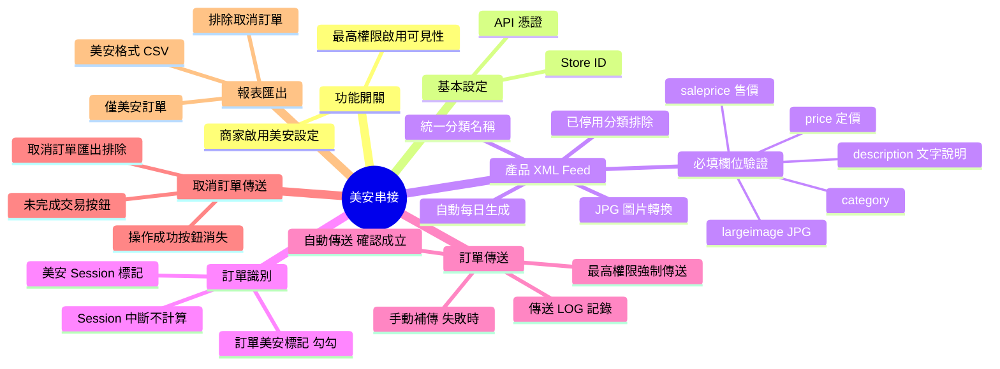
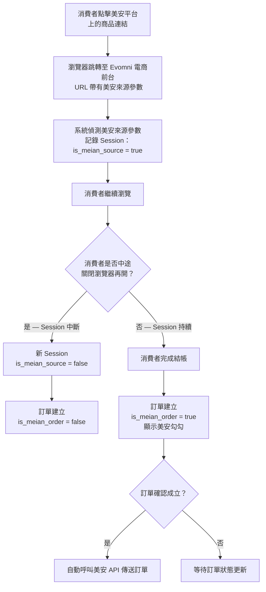
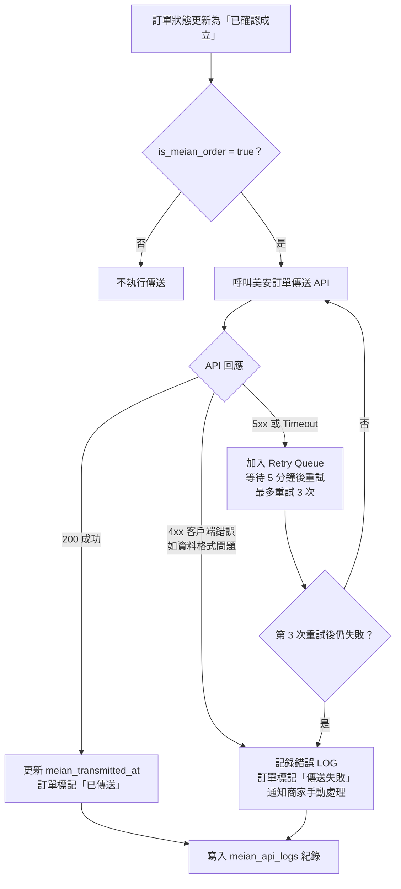
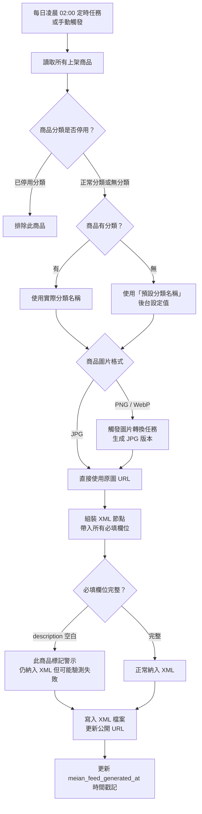

# 版本更新紀錄

| 版本 | 日期 | 修改內容 | 修改人 |
|------|------|----------|--------|
| v1.0 | 2026/05/05 | 初稿建立：美安產品 XML Feed、訂單傳送、取消訂單、報表匯出、訂單識別完整規格 | Claude（依廖紫茵授權產出）|

---

# Evomni — 美安串接 產品需求文件 (PRD)

## 1. 文件資訊

| 屬性 | 內容 |
| --- | --- |
| 版本 | v1.0 |
| 日期 | 2026/05/05 |
| 需求來源 | Webtech2 行銷外掛美安說明文件（吳毓祥）；美安常見問題 QA（翁欣瑜 2022-12-01）；廖紫茵需求 |
| 文件狀態 | ✅ 初版完成 |
| 對應方案 | 電商啟航方案 ✅（可加費串接）/ 進階電商包 ✅（可加費串接） |
| 開發時程 | 按商家需求開通，不綁定特定開發階段 |
| 特別說明 | 美安（Market America）為特殊分銷平台，透過美安導入網站下單的消費者須由美安判定為美安訂單，Evomni 需正確識別並傳送訂單資料；最高權限需先啟用美安功能，商家才能在後台看到此選項。美安產品圖僅接受 JPG 格式。|

> **📌 工程師實作說明：** 本文件以需求定義為主。文中所列技術規格（DB Schema、API 路由、資料結構等）為規劃建議，反映 PM 對系統的理解；工程師可依技術判斷調整實作方式。如有重大架構變更，請於 Git commit 說明原因，並同步更新本文件，保持版控一致。

---

## 2. 目標與功能總覽

### 2.1 核心願景與相依性

**核心問題：**
美安平台的會員（IBO）會帶消費者到客戶網站消費，美安需要取得對應的訂單資料（包含：哪些訂單是從美安導入、訂單金額、商品資訊）以計算佣金。現有流程需要商家手動操作、手動匯出報表，容易出錯，且美安的驗測流程對產品資料格式有嚴格要求（XML 格式、JPG 圖片、必填欄位等），稍有不符就無法通過美安驗測。

**解決方案：**
系統層級自動處理三大核心任務：一、產品 XML Feed 自動生成（依美安格式規範，圖片自動轉 JPG）；二、訂單自動識別（透過美安跳轉流程偵測美安來源訂單，標記美安勾勾）；三、訂單資料自動傳送至美安 API（新訂單建立後自動觸發，異常時可手動補傳）。減少商家手動操作、降低美安驗測失敗率。

**Evomni 價值對應：**
- 擴展商家客源：美安 IBO 網絡帶來額外分銷渠道
- 加費串接收入：美安串接為 Evomni 額外加費服務
- 降低客服工單：自動化訂單傳送減少手動操作錯誤

**系統相依性：**

| 依賴模組 | 用途 |
| --- | --- |
| Part 2 商品中心 | 商品資料來源（名稱、分類、定價、售價、圖片、說明）用於生成 XML Feed |
| Part 3 訂單管理 | 訂單建立事件觸發傳送；訂單詳情頁新增美安操作按鈕 |
| 媒體庫 | 商品圖片 URL 來源；美安限 JPG，系統需轉檔處理 |
| UTM 追蹤（廣告投放工具）| 美安導入訂單透過 UTM 參數識別；需與廣告投放工具的 UTM 記錄機制整合 |

---

### 2.2 功能總覽表

| 主功能模組 | 子功能項目 | 功能目的 | 功能詳細描述 | 影響之使用者 |
| --- | --- | --- | --- | --- |
| 美安功能開關 | 最高權限啟用美安功能 | 控制美安功能對商家的可見性 | Evomni 內部人員（最高權限）先在後台為特定商家啟用美安功能後，商家才能在「全域設定」看到美安設定入口；避免未申請美安的商家誤啟用 | Evomni 內部人員 |
| 美安基本設定 | 美安 Store ID / API 憑證設定 | 建立系統與美安的通訊連結 | 商家填入美安提供的 Store ID 及 API 憑證，系統儲存後用於後續訂單傳送與 XML Feed 生成 | 商家管理員 |
| 產品 XML Feed | 自動生成美安格式 XML | 讓美安系統能取得商品目錄 | 系統依美安 XML 規範自動生成商品目錄 XML；每日定時更新；圖片自動轉換為 JPG（美安要求）；已停用分類的商品不出現在 XML 中 | Evomni 系統（定時執行）|
| 產品 XML Feed | 統一分類名稱設定 | 解決無分類商品的 XML 必填問題 | 若商品未設定分類，美安 XML 的 `<category>` 欄位將為空（驗測不通過）；後台提供「美安預設分類名稱」輸入框，無分類商品統一使用此名稱填入 `<category>` | 商家管理員 |
| 美安訂單識別 | 美安來源訂單自動標記 | 區分美安訂單與一般訂單 | 消費者從美安平台點擊連結導入網站時，系統在 Session 中記錄美安來源標記；該消費者在同一 Session 完成的訂單，自動標記為「美安訂單」並顯示美安勾勾 | 消費者（操作）、商家管理員（查看）|
| 美安訂單傳送 | 訂單自動傳送至美安 | 讓美安系統收到訂單以計算佣金 | 訂單狀態進入「已確認成立」時，系統自動呼叫美安 API 傳送訂單資料；傳送結果記錄在訂單詳情 | Evomni 系統（自動）|
| 美安訂單傳送 | 手動補傳訂單 | 異常時補救機制 | 若自動傳送失敗，商家在訂單詳情頁可點擊「重新傳送至美安」；最高權限人員可在任意訂單手動觸發傳送 | 商家管理員、Evomni 內部人員 |
| 取消訂單傳送 | 傳送未完成交易訂單 | 告知美安此訂單已取消 | 商家在已取消訂單的詳情頁點擊「傳送未完成交易至美安」，系統呼叫美安 API 標記此訂單為未完成；操作成功後按鈕消失，避免重複操作 | 商家管理員 |
| 美安報表匯出 | 美安格式訂單報表匯出 | 提供美安指定格式的訂單數據 | 在訂單管理頁提供「匯出美安報表」功能，僅匯出標記為美安訂單且非取消狀態的訂單；格式依美安規範 | 商家管理員 |
| 訂單 LOG | 美安 API 通訊記錄 | 異常排查依據 | 每次傳送/取消傳送的 API Request / Response 完整記錄；Evomni 內部人員可查看 LOG URL 協助排查 | Evomni 內部人員 |

---

## 3. 全局功能流程

```mermaid
flowchart TD
    subgraph 商品層
        A1[Part 2 商品中心\n商品資料] --> A2[每日定時任務\n生成美安 XML Feed]
        A2 --> A3[美安圖片轉 JPG\n若原圖非 JPG]
        A3 --> A4[XML 公開 URL\n提供給美安定期抓取]
    end

    subgraph 訂單層
        B1([消費者從美安平台\n點擊連結進入網站]) --> B2[系統記錄美安 Session 標記\n時效：瀏覽器不關閉為止]
        B2 --> B3[消費者瀏覽/選購商品]
        B3 --> B4{是否關閉網頁後\n重新從購物車結帳？}
        B4 -->|是 - 中斷美安 Session| B5[訂單不標記為美安\n依美安規定]
        B4 -->|否 - 持續同 Session| B6[完成結帳]
        B6 --> B7[訂單建立\n標記 is_meian_order = true]
        B7 --> B8{訂單達確認成立狀態}
        B8 --> B9[自動呼叫美安 API\n傳送訂單資料]
        B9 --> B10{傳送結果}
        B10 -->|成功| B11[訂單詳情顯示\n✅ 美安訂單已傳送\n傳送時間記錄]
        B10 -->|失敗| B12[訂單詳情顯示\n❌ 美安傳送失敗\n顯示「重新傳送」按鈕]
    end

    subgraph 取消層
        C1[商家操作訂單取消] --> C2[訂單詳情頁\n顯示「傳送未完成交易至美安」按鈕]
        C2 --> C3[商家點擊按鈕]
        C3 --> C4[呼叫美安 API\n標記未完成交易]
        C4 --> C5{傳送成功？}
        C5 -->|是| C6[按鈕消失\n顯示「已傳送取消，時間：XXXX」]
        C5 -->|否| C7[顯示錯誤\n可重試]
    end
```



---

## 4. 功能結構圖



---

## 5. 使用者故事

| # | 角色 | 故事 |
| --- | --- | --- |
| US-01 | 商家管理員 | 身為商家管理員，我想要系統自動生成符合美安格式的 XML，以便美安能定期抓取我的商品目錄，不需要我手動整理 XML 格式。 |
| US-02 | 商家管理員 | 身為商家管理員，我想要後台顯示哪些訂單是美安訂單（打勾標記），以便我可以清楚區分美安與非美安的訂單。 |
| US-03 | 商家管理員 | 身為商家管理員，我想要訂單確認成立後系統自動傳送給美安，以便我不需要每筆訂單手動操作傳送，避免漏傳。 |
| US-04 | 商家管理員 | 身為商家管理員，我想要在已取消的美安訂單上點擊「傳送未完成交易」，讓美安知道這筆不算，以便取消訂單不會影響美安的佣金計算。 |
| US-05 | 商家管理員 | 身為商家管理員，我想要匯出美安格式的報表，以便需要時能提交給美安的窗口核對數據。 |
| US-06 | Evomni 內部人員 | 身為 Evomni 內部人員，我想要查看美安 API 的通訊 LOG，以便在商家反映訂單傳送異常時，我可以提供 LOG URL 給美安窗口排查。 |
| US-07 | 商家管理員 | 身為商家管理員，我想要在美安訂單傳送失敗時看到明確的錯誤提示和「重新傳送」按鈕，以便不需要聯繫 Evomni 就能自行補傳。 |

---

## 6. UI/UX 與詳細功能需求

### 6.1 美安基本設定頁

#### A. 核心使用者流程

後台「全域設定」→「美安串接設定」（需最高權限先啟用才顯示此選單項目）→ 填入 Store ID 與 API 憑證 → 儲存 → XML Feed URL 顯示，可提供給美安設定定期抓取。

**頁面路徑：** 全域設定 > 美安串接設定

#### B. 介面佈局與元件拆解

```
[頁面標題] 美安串接設定

[說明 Banner — 淡灰背景]
美安（Market America）串接可讓美安 IBO 的導購訂單自動被系統識別並傳送至美安平台。
串接完成後，系統將自動維護產品 XML Feed 並識別美安來源的訂單。
```

**§ 1 API 連線設定區塊：**

| 欄位 | 元件 | 驗證規則 | 說明 |
| --- | --- | --- | --- |
| 美安 Store ID | `<el-input>` | 必填；Placeholder：「請填入美安提供的 Store ID」 | Tooltip：「由美安窗口提供，通常為英數字組合」 |
| API Access Key | `<el-input>` type="password" | 必填；儲存後顯示 `****`，提供「重新設定」按鈕 | Tooltip：「由美安窗口提供的 API 存取金鑰」 |
| API Secret Key | `<el-input>` type="password" | 必填；同上 | 同上 |

**儲存成功 Toast：** 「✅ 美安串接設定已儲存」
**儲存失敗 Toast：** 「❌ 儲存失敗，請確認網路連線後重試」

---

**§ 2 產品 XML Feed 設定區塊：**

```
[區塊標題] 產品目錄 XML Feed

[XML Feed URL 唯讀欄位]
https://yourstore.com/api/meian/product-feed.xml
[複製網址] `<el-button size="small">`

[說明文字 — 小字灰色]
此 URL 提供給美安設定定期自動抓取。系統每日凌晨 02:00 自動更新 XML 資料。

[最後更新時間] 顯示：最後更新：2026/05/05 02:00:13

[手動刷新 XML] `<el-button type="default" class="!rounded-none">`
說明（小字）：「若剛剛修改了商品資料，可點此立即重新生成 XML，無需等待每日排程」
```

**統一分類名稱設定（解決無分類商品問題）：**

| 欄位 | 元件 | 驗證規則 | 說明 |
| --- | --- | --- | --- |
| 美安預設分類名稱 | `<el-input>` | 選填；最多 50 字；Placeholder：「例：精選商品」 | 說明文字：「若商品未設定分類，美安 XML 的 category 欄位將使用此名稱。若商品已設定分類，以實際分類名稱優先。」 |

---

**§ 3 XML 欄位對應說明（唯讀說明區塊）：**

```
[區塊標題] XML 必填欄位對應說明
[顯示格式：灰色說明文字，不可編輯]

| 美安 XML 欄位    | 對應 Evomni 欄位              | 備註                                          |
|------------------|-------------------------------|-----------------------------------------------|
| <category>       | 商品中心 > 分類               | 無分類者用上方「預設分類名稱」填入             |
| <largeimage>     | 商品第一張圖片                | 僅使用 JPG 格式；系統自動將 PNG/WebP 轉為 JPG  |
| <price>          | 商品 > 定價（原價）           | 必須設定定價才能生成 XML；定價=MSRP           |
| <saleprice>      | 商品 > 售價（實際交易金額）   | 若只設定定價未設定售價，商品無法下單           |
| <description>    | 商品 > 基本資料 > 產品說明    | 需包含純文字（不可只有圖片/影片）             |
| <name>           | 商品名稱                      | —                                             |
| <url>            | 商品前台頁面 URL              | 系統自動生成                                  |

⚠️ 注意：商品說明如果只有圖片或影片（無文字），美安 XML 驗測將不通過。
請確認每件商品至少有一段文字說明。
```

---

### 6.2 訂單列表頁：美安訂單標記

**修改位置：** Part 3 訂單管理 > 訂單列表頁

新增識別欄位：

| 新增欄位 | 位置 | 樣式 | 說明 |
| --- | --- | --- | --- |
| 美安標記 | 訂單 Table 新增一欄（寬 80px） | `<el-tag type="success" class="!rounded-full">` 美安 | 僅美安訂單顯示此 Tag；一般訂單此欄空白 |

**訂單列表篩選條件新增：**
在現有篩選工具列新增：
```
[訂單來源] `<el-select>` 
選項：全部 / 美安訂單 / 一般訂單
```

---

### 6.3 訂單詳情頁：美安操作區塊

**修改位置：** Part 3 訂單管理 > 訂單詳情頁（美安訂單才顯示此區塊）

#### B. 美安資訊卡片（`<el-card>`，置於訂單詳情頁下方）

```
[卡片標題] 美安訂單資訊

[狀態區]
美安識別：✅ 此為美安來源訂單

[傳送狀態依情況顯示以下之一]

─── 狀態 A：自動傳送成功 ───
美安訂單狀態：✅ 已傳送至美安
傳送時間：2026/05/05 14:32:01
[查看傳送 LOG]  `<el-link>` （僅最高權限可見）

─── 狀態 B：自動傳送失敗 ───
美安訂單狀態：❌ 傳送失敗
錯誤訊息：{美安 API 回傳的錯誤描述}
[重新傳送至美安]  `<el-button type="primary" class="!rounded-none">`
[查看傳送 LOG]  `<el-link>` （僅最高權限可見）

─── 狀態 C：尚未傳送（訂單未確認成立）───
美安訂單狀態：⏳ 等待訂單確認成立後自動傳送

─── 狀態 D：訂單已取消，可傳送未完成交易 ───
美安訂單狀態：✅ 已傳送至美安（原確認成立訂單）
[傳送未完成交易至美安]  `<el-button type="warning" class="!rounded-none">`
說明（小字）：「點擊後系統將通知美安此訂單已取消，按鈕點擊後將消失。」

─── 狀態 E：已傳送取消 ───
美安訂單狀態：✅ 已傳送至美安
取消通知：已傳送未完成交易（{YYYY/MM/DD HH:mm}）
```

**「重新傳送至美安」點擊後：**
- 按鈕顯示 Loading
- 成功：更新為狀態 A，Toast：「✅ 已成功傳送至美安」
- 失敗：保持狀態 B，Toast：「❌ 傳送失敗：{錯誤描述}，請稍後再試」

**「傳送未完成交易至美安」點擊前確認 Dialog：**
```
確認傳送取消通知
確定要通知美安此訂單（#XXXXXX）已取消？
操作成功後，此按鈕將消失，無法重複操作。

[取消]  [確認傳送]
```

**最高權限額外操作（在任意訂單詳情頁，無論是否為美安訂單）：**
```
[最高權限操作區塊 — 僅最高權限可見]
[手動傳送此訂單至美安]  `<el-button type="default" class="!rounded-none">`
說明：「用於補傳自動識別失敗的訂單，或特殊情況的人工補傳」
```

#### C. 防呆機制

- 「傳送未完成交易至美安」按鈕一經成功操作即消失，後端同時加 `meian_cancel_sent = true` 防止重複呼叫 API
- 「重新傳送」有每分鐘最多 3 次的速率限制，超過顯示：「操作過於頻繁，請 1 分鐘後再試」
- 手動傳送（最高權限）有確認 Dialog，需輸入「確認」文字後才能執行

---

### 6.4 美安報表匯出

**修改位置：** Part 3 訂單管理 > 訂單列表頁 > 工具列

```
[工具列末端新增]
[匯出美安報表]  `<el-button type="default" class="!rounded-none">`
（說明小字）：僅匯出美安訂單，且排除已取消訂單
```

**點擊後確認 Dialog：**
```
確認匯出美安報表
將匯出 {N} 筆美安訂單資料（已排除取消訂單）

[篩選時間範圍（選填）]
`<el-date-picker type="daterange">` Placeholder：「不選則匯出全部歷史記錄」

[取消]  [確認匯出]
```

**匯出成功 Toast：** 「✅ 美安報表已開始生成，完成後將寄送至您的信箱 📧」（大量資料採非同步）

**匯出欄位（美安格式 CSV）：**

| 欄位名稱 | 說明 |
| --- | --- |
| Order ID | Evomni 訂單編號 |
| Order Date | 訂單建立時間（YYYY-MM-DD HH:mm:ss）|
| Customer Name | 消費者姓名 |
| Customer Email | 消費者 Email |
| Product SKU | 商品 SKU 編號 |
| Product Name | 商品名稱 |
| Quantity | 購買數量 |
| Unit Price | 商品售價 |
| Order Total | 訂單金額（不含運費）|
| Shipping Fee | 運費 |
| Grand Total | 訂單總金額 |
| Meian Transmitted | 美安傳送時間 |

---

## 7. 細部邏輯流程圖

### 7.1 美安訂單識別邏輯



### 7.2 美安訂單自動傳送與重試邏輯



### 7.3 XML Feed 生成流程



---

## 8. 非功能性需求

### 8.1 效能需求

| 項目 | 標準 |
| --- | --- |
| XML Feed 生成（定時）| 每日凌晨 02:00 執行，需在 30 分鐘內完成（含圖片轉換）|
| 手動刷新 XML | 後台顯示 Loading，最長 60 秒；逾時顯示錯誤 |
| 訂單自動傳送 | 訂單確認成立後 ≤ 60 秒內呼叫美安 API |
| 美安 API 呼叫超時設定 | 10 秒超時 → 進入 Retry Queue |
| 美安報表匯出 | 非同步處理，完成後 Email 通知商家 |

### 8.2 安全性需求

| 項目 | 規格 |
| --- | --- |
| API Access Key / Secret Key | AES-256 加密儲存；不在前端暴露 |
| XML Feed URL | 公開 URL，無需認證（美安定期爬取），但路由不可猜測（含 store hash）|
| 最高權限操作 | 手動傳送、查看 LOG 僅最高權限帳號可執行 |
| 傳送取消通知 | 操作後立即 `meian_cancel_sent = true`，後端幕等性保護防止 API 重複呼叫 |

### 8.3 資料一致性

- 訂單傳送 API 呼叫採 Idempotency Key（訂單 ID），防止重複傳送計算兩次佣金
- `meian_transmitted_at` 與 `meian_cancel_sent` 更新需在 DB Transaction 內與訂單狀態更新同步
- 圖片轉 JPG 不影響網站前台顯示的原始圖片，另存一份 JPG 版本供 XML 使用

### 8.4 DB Schema 建議

```sql
-- 美安串接設定
CREATE TABLE meian_settings (
  id              BIGINT AUTO_INCREMENT PRIMARY KEY,
  store_id        BIGINT NOT NULL,
  enabled         TINYINT(1) DEFAULT 0,
  store_id_meian  VARCHAR(100) DEFAULT NULL COMMENT '美安 Store ID',
  access_key      TEXT DEFAULT NULL COMMENT 'AES-256 加密',
  secret_key      TEXT DEFAULT NULL COMMENT 'AES-256 加密',
  default_category VARCHAR(100) DEFAULT NULL COMMENT '無分類商品的預設分類名稱',
  feed_generated_at DATETIME DEFAULT NULL,
  created_at      DATETIME DEFAULT CURRENT_TIMESTAMP,
  updated_at      DATETIME DEFAULT CURRENT_TIMESTAMP ON UPDATE CURRENT_TIMESTAMP,
  UNIQUE KEY uq_store (store_id)
);

-- 訂單美安欄位（新增至 orders 表）
ALTER TABLE orders ADD COLUMN is_meian_order TINYINT(1) DEFAULT 0;
ALTER TABLE orders ADD COLUMN meian_transmitted_at DATETIME DEFAULT NULL;
ALTER TABLE orders ADD COLUMN meian_transmit_status ENUM('pending','success','failed') DEFAULT 'pending';
ALTER TABLE orders ADD COLUMN meian_cancel_sent TINYINT(1) DEFAULT 0;
ALTER TABLE orders ADD COLUMN meian_cancel_sent_at DATETIME DEFAULT NULL;

-- 美安 API 通訊紀錄
CREATE TABLE meian_api_logs (
  id              BIGINT AUTO_INCREMENT PRIMARY KEY,
  store_id        BIGINT NOT NULL,
  order_id        BIGINT DEFAULT NULL,
  action          ENUM('transmit_order','cancel_order','manual_transmit') NOT NULL,
  request_body    JSON DEFAULT NULL,
  response_body   JSON DEFAULT NULL,
  http_status     SMALLINT DEFAULT NULL,
  success         TINYINT(1) DEFAULT 0,
  error_message   TEXT DEFAULT NULL,
  triggered_by    BIGINT DEFAULT NULL COMMENT 'NULL=自動，有值=手動操作的 user_id',
  created_at      DATETIME DEFAULT CURRENT_TIMESTAMP,
  INDEX idx_store_order (store_id, order_id),
  INDEX idx_created (created_at)
);
```

### 8.5 瀏覽器/裝置支援

| 環境 | 要求 |
| --- | --- |
| 後台設定頁 / 訂單詳情頁 | Chrome 110+、Edge 110+、Firefox 110+；桌機最低 1280px |
| XML Feed | 對美安爬蟲公開，無瀏覽器限制 |

---

## 與團隊溝通摘要

- 這次的規格是關於**美安串接**，解決商家與美安分銷平台對接的全流程需求：產品 XML Feed 自動生成、美安訂單自動識別與傳送、取消訂單通知、美安報表匯出
- **工程師這邊需要注意：**
  1. **美安訂單識別依賴 Session 連續性**，消費者若中途關閉瀏覽器再從購物車結帳，不算美安訂單（美安的規定）；Session 中斷後的結帳需清除美安標記
  2. **XML 圖片必須是 JPG**，系統需在生成 XML 時自動將 PNG/WebP 商品主圖轉換為 JPG 格式另存，不影響前台顯示
  3. **訂單傳送 Idempotency**：使用訂單 ID 作為 Idempotency Key，防止重試時重複計算佣金
  4. **取消通知冪等性**：`meian_cancel_sent = true` 後，後端禁止再次呼叫取消 API（即使前端按鈕殘留也無效）
  5. 美安的「最高權限才能啟用」這個控制邏輯，需在 Evomni 主程式的後台功能開關層實作，不是商家自己的設定
- **設計師這邊需要注意：**
  1. 訂單詳情頁的「美安訂單資訊卡片」有 5 種狀態（成功/失敗/等待/可取消/已取消），每種狀態的顯示內容不同，需要設計師一一確認
  2. 美安報表匯出的「篩選時間範圍」是選填的，空白代表匯出全部；需設計清楚的預設狀態說明
  3. 訂單列表新增的「美安」Tag，建議使用成功綠色，小圓角 Tag，不要過於醒目
- 這個模組依賴 **Part 2 商品中心**（XML Feed 商品資料）、**Part 3 訂單管理**（訂單狀態事件、詳情頁）
- **此功能兩方案均為可加費串接**，後台功能開關需先由最高權限啟用商家才能看到此設定頁
- ⚠️ 本文件已納入 Git 版控。技術規格（DB Schema、API 設計）為需求導向的建議，工程師可依技術判斷調整實作，重大變更請回寫文件。
- ⚠️ 本次新增文件已連動更新 Master PRD §4.2、§6.2、§7、§8。
