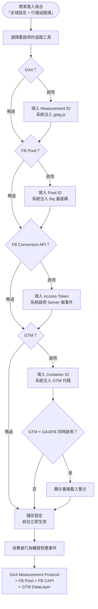
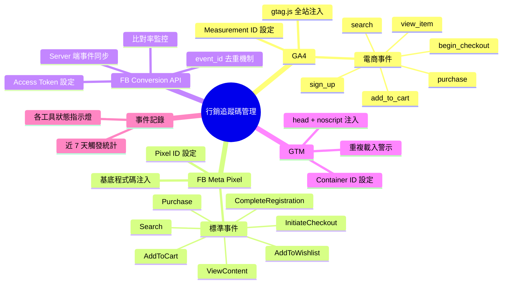
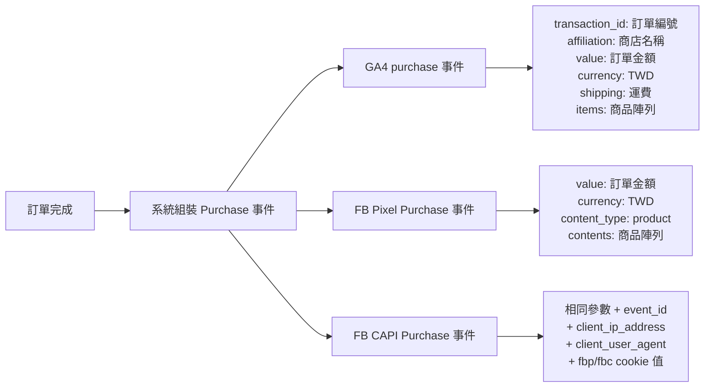

# 版本更新紀錄

| 版本 | 日期 | 修改內容 | 修改人 |
|------|------|----------|--------|
| v1.0 | 2026/05/05 | 初稿建立：GA4、FB Meta Pixel、FB Conversion API、GTM 完整規格 | Claude（依廖紫茵授權產出）|

---

# Evomni — 行銷追蹤碼管理 產品需求文件 (PRD)

## 1. 文件資訊

| 屬性 | 內容 |
| --- | --- |
| 版本 | v1.0 |
| 日期 | 2026/05/05 |
| 需求來源 | Webtech2 行銷外掛說明文件（吳毓祥 2025-08-15）、廖紫茵需求 |
| 文件狀態 | ✅ 初版完成 |
| 對應方案 | 電商啟航方案 ✅ / 進階電商包 ✅（兩方案皆含，商家自行開啟） |
| 開發時程 | 階段一 5–8月（電商啟航方案）/ 階段二 9–12月（進階電商包）|
| 特別說明 | GTM 一旦啟用，商家可透過 GTM 自行安裝其他第三方服務；後台需警示避免重複載入。Omnichat 不在本 PRD 規格範圍內。|

> **📌 工程師實作說明：** 本文件以需求定義為主。文中所列技術規格（DB Schema、API 路由、資料結構等）為規劃建議，反映 PM 對系統的理解；工程師可依技術判斷調整實作方式。如有重大架構變更，請於 Git commit 說明原因，並同步更新本文件，保持版控一致。

---

## 2. 目標與功能總覽

### 2.1 核心願景與相依性

**核心問題：**
商家開店後第一件事就是安裝 GA4、FB 像素追蹤轉換，但各平台的追蹤碼安裝方式不同、事件參數格式各異，稍有錯誤就導致數據失真。手動埋設追蹤碼對非工程師背景的商家是高門檻，且每次系統更版都可能失效。

**解決方案：**
提供「行銷追蹤碼管理」後台設定頁，商家只需填入 Measurement ID / Pixel ID / GTM Container ID，系統自動將對應的追蹤碼注入全站，並正確帶入各標準電商事件的參數。商家不需碰任何程式碼，即可完成完整的轉換追蹤設定。

**Evomni 價值對應：**
- 商家黏著度提升：追蹤碼設定完成後商家不易換平台
- 減少客服需求：系統自動維護，不因系統更版導致追蹤碼失效
- 提升廣告成效：精準事件數據讓商家廣告投放更有效率，進而增加續約意願

**系統相依性：**

| 依賴模組 | 用途 |
| --- | --- |
| Part 2 商品中心 | 商品資訊（ID、名稱、分類、價格）注入 ViewContent / AddToCart 事件 |
| Part 3 訂單管理 | 訂單完成事件注入 Purchase 事件（訂單金額、商品清單、運費）|
| Part 6 會員管理 | 會員完成註冊觸發 CompleteRegistration 事件 |
| 心願清單（進階）| 加入追蹤清單觸發 AddToWishlist 事件 |
| 前台搜尋功能 | 搜尋結果頁觸發 Search 事件 |

---

### 2.2 功能總覽表

以下涵蓋四大追蹤工具的設定與事件注入能力。各工具可獨立啟用，互不干擾。

| 主功能模組 | 子功能項目 | 功能目的 | 功能詳細描述 | 影響之使用者 |
| --- | --- | --- | --- | --- |
| GA4 追蹤設定 | Measurement ID 設定 | 建立 Google Analytics 數據管道 | 商家填入 GA4 Measurement ID（G-XXXXXXXX），系統自動注入 gtag.js 到全站 `<head>`，觸發 page_view 事件 | 商家管理員 |
| GA4 追蹤設定 | 電商事件自動注入 | 追蹤消費者購物行為 | 系統自動在對應頁面/動作觸發 view_item、add_to_cart、begin_checkout、purchase、search 事件，並帶入完整 GA4 格式參數 | 商家管理員 |
| FB Meta Pixel | Pixel ID 設定 | 建立 Meta 廣告轉換追蹤 | 商家填入 Meta Pixel ID（16位數字），系統自動注入 Pixel 基底程式碼到全站 `<head>`，觸發 PageView 事件 | 商家管理員 |
| FB Meta Pixel | 電商事件自動注入 | 追蹤消費者完整購物漏斗 | 系統在對應觸發點注入 ViewContent、AddToCart、InitiateCheckout、Purchase、Search、CompleteRegistration、AddToWishlist 事件，含 currency/value 參數 | 商家管理員 |
| FB Conversion API | CAPI 設定 | 補強 iOS14 後像素追蹤缺口 | 商家填入 Meta Business Access Token，系統於 Server 端同步傳送事件至 Meta Conversions API，event_id 去重防止與瀏覽器像素重複計算 | 商家管理員 |
| FB Conversion API | 事件去重機制 | 確保數據準確性 | Browser Pixel 與 CAPI 使用相同 event_id（UUID v4），Meta 自動去重；商家在 Meta Events Manager 可看到「比對率」指標 | 商家管理員 |
| GTM 設定 | Container ID 設定 | 提供彈性追蹤碼管理容器 | 商家填入 GTM Container ID（GTM-XXXXXXX），系統注入 GTM 頭部程式碼（`<head>`）與 body noscript 備援語法；啟用後商家可自行在 GTM 介面管理其他追蹤碼 | 商家管理員 |
| GTM 設定 | 重複載入警示 | 防止數據污染 | 若商家同時啟用 GTM 且也填入 GA4/FB Pixel ID，系統顯示警示：「您已啟用 GTM，若 GTM 內也有安裝 GA4 或 FB 像素，請擇一使用以避免重複觸發」 | 商家管理員 |
| 事件記錄查詢 | 近期觸發記錄 | 協助商家確認追蹤碼是否正常 | 後台顯示最近 7 天各事件的觸發筆數（僅統計，非原始 log），供商家初步確認設定是否生效 | 商家管理員 |

---

## 3. 全局功能流程



**各事件在前台的觸發對應：**

| 觸發位置 / 行為 | GA4 事件 | FB Pixel 事件 | 帶入參數 |
| --- | --- | --- | --- |
| 任何頁面載入 | page_view | PageView | page_location, page_title |
| 商品詳情頁瀏覽 | view_item | ViewContent | item_id, item_name, item_category, price, currency（TWD），content_type: 'product' |
| 點擊「加入購物車」| add_to_cart | AddToCart | item_id, item_name, item_category, item_variant, quantity, price, currency |
| 進入結帳步驟2 | begin_checkout | InitiateCheckout | value（購物車總額）, currency, items 清單 |
| 訂單付款成功頁 | purchase | Purchase | transaction_id, value（訂單金額）, currency, shipping（運費）, items 清單（各含 id/name/category/variant/quantity/price）|
| 搜尋結果頁 | search | Search | search_term（使用者查詢關鍵字）|
| 完成會員註冊 | sign_up | CompleteRegistration | currency, value（固定為 0）|
| 加入心願清單（進階）| add_to_wishlist | AddToWishlist | item_id, item_name, currency, value |
| 瀏覽文章頁（選填）| page_view | ViewContent（content_name: 文章標題）| 後台可設定是否對文章頁發送事件 |

---

## 4. 功能結構圖



---

## 5. 使用者故事

| # | 角色 | 故事 |
| --- | --- | --- |
| US-01 | 商家管理員 | 身為商家管理員，我想要只填入 GA4 Measurement ID，即讓系統自動追蹤所有電商事件，以便我不需要請工程師手動埋碼就能在 Google Analytics 看到完整數據。 |
| US-02 | 商家管理員 | 身為商家管理員，我想要填入 FB Pixel ID，讓 Facebook 能追蹤消費者的購買行為，以便我的廣告可以做再行銷與轉換優化。 |
| US-03 | 商家管理員 | 身為商家管理員，我想要同時啟用 FB Pixel 和 FB Conversion API，讓 iOS14 以後那些被 Safari 封鎖的轉換事件也能被 Server 端補上，以便廣告成效報表更準確。 |
| US-04 | 商家管理員 | 身為商家管理員，我想要填入 GTM Container ID，讓我可以在 GTM 後台自行管理追加的第三方工具（如 Hotjar、Clarity 等），以便不需要每次都麻煩工程師。 |
| US-05 | 商家管理員 | 身為商家管理員，我想要在後台看到各追蹤工具的「近 7 天觸發筆數」，以便我能初步確認追蹤碼設定是否已正確生效。 |
| US-06 | 商家管理員 | 身為商家管理員，如果我同時啟用 GTM 又填了 GA4 Measurement ID，我想要系統提醒我可能重複載入，以便我能主動去 GTM 裡確認是否已有另一個 GA4 標籤。 |

---

## 6. UI/UX 與詳細功能需求

### 6.1 行銷追蹤碼管理頁（後台主設定頁）

#### A. 核心使用者流程

後台「全域設定」→「行銷追蹤碼」→ 看到四個工具的設定卡片 → 依需求分別啟用並填入憑證 → 儲存 → 前台立即生效。

#### B. 介面佈局與元件拆解

**頁面路徑：** 全域設定 > 行銷追蹤碼管理

**頁面標題區塊：**
```
[頁面標題] 行銷追蹤碼管理
[說明文字] 在此設定 GA4、Meta Pixel、GTM 等行銷追蹤工具。填入 ID 後系統將自動安裝追蹤碼，無需手動埋設程式碼。
[警示 callout — 淡藍背景 #EBF5FF]
⚠️ 若您先前已在網站 <head> 手動埋設過 GA4 或 FB 像素追蹤碼，請先移除，避免重複觸發導致數據失真。
```

**四個工具設定卡片（`<el-card>`，縱向排列）：**

每張卡片結構一致：
- 卡片標題列：工具 logo icon + 工具名稱 + `<el-switch>` 啟用開關
- 卡片主體（開關 ON 才展開）：欄位設定區
- 卡片底部：[儲存此設定] `<el-button type="primary" class="!rounded-none">`

---

**卡片 1：Google Analytics 4**

| 欄位 | 元件 | 驗證規則 | 說明 |
| --- | --- | --- | --- |
| 啟用 GA4 | `<el-switch>` | — | 預設 OFF；開啟後展開下方設定 |
| Measurement ID | `<el-input>` | 必填；格式 G-[A-Z0-9]{1,10}；不符合格式即時紅框提示 | Placeholder：「G-XXXXXXXXXX」；右側顯示 ❓ icon，hover 顯示 Tooltip：「在 Google Analytics 後台 > 管理 > 資料串流中取得」 |
| 文章頁發送事件 | `<el-switch>` | — | 預設 OFF；開啟後文章詳情頁也會觸發 page_view 事件；說明文字（小字）：「適合有內容行銷策略的商家，開啟後可追蹤部落格文章的瀏覽數據」 |

**驗證錯誤文案：**
- ID 格式錯誤：「請輸入正確的 GA4 Measurement ID 格式，應為 G- 開頭後接字母數字（例：G-ABC123456）」
- 欄位空白：「請填入 Measurement ID 才能啟用 GA4 追蹤」

**儲存成功 Toast：** 「✅ GA4 設定已儲存，追蹤碼將於頁面重新整理後在前台生效」
**儲存失敗 Toast：** 「❌ 儲存失敗，請確認網路連線後重試」

---

**卡片 2：Meta（Facebook）Pixel**

| 欄位 | 元件 | 驗證規則 | 說明 |
| --- | --- | --- | --- |
| 啟用 Meta Pixel | `<el-switch>` | — | 預設 OFF |
| Pixel ID | `<el-input>` | 必填；格式：純數字，15–16 位 | Placeholder：「例：1234567890123456」；Tooltip：「在 Meta Events Manager > 資料來源中取得您的 Pixel ID」 |
| 幣別設定 | `<el-select>` | 預設 TWD | 選項：TWD / USD / HKD；說明：「將帶入所有 Purchase、ViewContent 等含金額事件的 currency 參數中」 |

**驗證錯誤文案：**
- Pixel ID 非純數字：「Pixel ID 應為 15–16 位的純數字，請確認後重新輸入」
- 欄位空白：「請填入 Meta Pixel ID 才能啟用像素追蹤」

**儲存成功 Toast：** 「✅ Meta Pixel 設定已儲存」

---

**卡片 3：Meta Conversion API（FB 轉換 API）**

> ⚠️ 此卡片在 Meta Pixel 未啟用時，整張卡片 Disabled（灰化），標題下方顯示提示文字：「需先啟用 Meta Pixel 才能使用 Conversion API」。

| 欄位 | 元件 | 驗證規則 | 說明 |
| --- | --- | --- | --- |
| 啟用 Conversion API | `<el-switch>` | Meta Pixel 啟用後才可操作 | — |
| Access Token | `<el-input>` type="password" | 必填；長度 > 50 字元（Meta Token 通常極長）；儲存後顯示 `****`，提供「重新設定」按鈕 | Placeholder：「貼入您的 Meta Business Access Token」；Tooltip：「在 Meta Events Manager > 設定 > Conversions API > 產生存取權杖中取得」 |

**說明區塊（卡片說明文字，淡灰背景 `#F5F7FA`）：**
```
💡 關於 Conversion API
iOS 14 後 Safari 封鎖 Cookie，部分轉換事件無法透過瀏覽器像素捕捉。
Conversion API 從 Server 端傳送事件，可補回遺失的轉換數據。
系統會自動為每個事件加上相同的 event_id，Meta 將自動去除重複，
您在 Meta Events Manager 可觀察「比對率」是否達到 70% 以上。
```

**驗證錯誤文案：**
- Token 過短：「Access Token 格式異常，請確認是否完整複製」

---

**卡片 4：Google Tag Manager（GTM）**

| 欄位 | 元件 | 驗證規則 | 說明 |
| --- | --- | --- | --- |
| 啟用 GTM | `<el-switch>` | — | 預設 OFF |
| Container ID | `<el-input>` | 必填；格式 GTM-[A-Z0-9]{4,8} | Placeholder：「GTM-XXXXXXX」；Tooltip：「在 Google Tag Manager 後台，點擊右上角的 Container ID 可複製」 |

**重複載入警示（`<el-alert type="warning">`，儲存後判斷）：**
條件：GTM 啟用 AND（GA4 啟用 OR FB Pixel 啟用）時出現：
```
⚠️ 注意：您同時啟用了 GTM 與 GA4/Meta Pixel。
如果 GTM 容器內也安裝了相同工具，事件將重複觸發導致數據失真。
建議：擇一方式使用，避免同時透過本系統與 GTM 安裝相同追蹤碼。
```

**驗證錯誤文案：**
- Container ID 格式錯誤：「請輸入正確的 GTM Container ID，格式應為 GTM- 開頭（例：GTM-ABC1234）」

---

**頁面底部：事件觸發統計**

```
[區塊標題] 近 7 天事件觸發統計
[說明] 以下為系統記錄的事件觸發次數，供您確認追蹤碼設定是否生效。實際數據請以 GA4 / Meta Events Manager 後台為準。

[統計 Table]
| 事件名稱           | 對應 GA4 事件      | 對應 FB Pixel 事件     | 近 7 天觸發次數 |
| 商品頁瀏覽         | view_item          | ViewContent            | 1,234 次       |
| 加入購物車         | add_to_cart        | AddToCart              | 456 次         |
| 開始結帳           | begin_checkout     | InitiateCheckout       | 123 次         |
| 完成購買           | purchase           | Purchase               | 89 次          |
| 站內搜尋           | search             | Search                 | 678 次         |
| 完成會員註冊       | sign_up            | CompleteRegistration   | 34 次          |
| 加入心願清單       | add_to_wishlist    | AddToWishlist          | 67 次          |
```
- 若某工具未啟用，對應欄位顯示「未啟用」（灰色文字）
- 若統計資料載入失敗，顯示「－」

#### C. 互動設計、狀態與系統反饋

- **啟用開關切換（ON → 設定欄位展開）：** 使用 `<el-collapse-transition>` 動畫展開，無跳頁
- **各卡片獨立儲存：** 每個工具各自有儲存按鈕，修改一個工具不影響其他
- **儲存後狀態燈：** 卡片標題旁顯示狀態 Tag — `已啟用`（綠色 `<el-tag type="success">`）/ `未啟用`（灰色）/ `設定中`（藍色）
- **設定生效時機：** 後端儲存成功後，系統清除前台快取，下一個前台請求立即生效（不需等待部署）

#### D. 防呆機制與錯誤預防

- 啟用開關 ON 但欄位空白，點儲存時：開關自動回 OFF + 欄位紅框 + 錯誤提示
- 密碼型欄位（Access Token）：顯示「重新設定」按鈕而非直接顯示內容
- 刪除設定（關閉開關 + 儲存）前顯示 `<el-message-box confirm>`：「確定停用 GA4 追蹤？關閉後追蹤碼將從前台移除，歷史數據不受影響。」

---

## 7. 細部邏輯流程圖

### 7.1 FB Conversion API 事件去重流程

```mermaid
graph TD
    A[消費者行為觸發\n例：完成購買] --> B[前端產生 event_id\nUUID v4]
    B --> C[Browser 端：fbq 像素發送事件\n帶入 eventID: event_id]
    B --> D[系統同時呼叫後端 API\n帶入 event_id 與事件參數]
    D --> E[後端：呼叫 Meta Conversions API\nGraph API POST /v18.0/{pixel-id}/events\n帶入相同 event_id]
    C --> F[Meta 伺服器]
    E --> F
    F --> G{相同 event_id？}
    G -->|是| H[Meta 自動去重\n僅計算一次]
    G -->|否| I[分別計算兩次\n可能重複]
    H --> J[Events Manager 顯示\n正確轉換數]
```

### 7.2 事件參數完整規格（Purchase 事件，最複雜）



---

## 8. 非功能性需求

### 8.1 效能需求

| 項目 | 標準 |
| --- | --- |
| 追蹤碼注入 | 採異步載入（async defer），不阻塞頁面渲染 |
| FB CAPI 呼叫 | 後端異步佇列發送，不影響訂單建立的主流程回應時間 |
| 事件觸發 | 前台事件觸發後 ≤ 100ms 完成 dataLayer push |
| 設定儲存 | ≤ 1 秒完成儲存並清除前台快取 |
| 統計查詢（7天） | ≤ 2 秒（可用快取，每小時更新一次） |

### 8.2 安全性需求

| 項目 | 規格 |
| --- | --- |
| FB Access Token | 加密儲存（AES-256）；不在前端任何 HTML/JS 中暴露；僅在後端呼叫 CAPI 時解密使用 |
| GTM Container ID | 非敏感資訊，可明文儲存，但僅後台可修改 |
| 設定修改權限 | 僅「擁有者」及「管理員」角色可修改行銷追蹤碼設定；「編輯員」以下角色唯讀 |
| CAPI IP 傳遞 | 從 Request headers 取得 `X-Forwarded-For` 作為 client_ip_address；不儲存至 DB |

### 8.3 資料一致性

- GA4 與 FB Pixel 事件應盡可能在同一次前台觸發中同步發送，避免時序差異
- FB CAPI 發送失敗不影響主業務流程，採非同步佇列重試（最多 3 次，間隔 30 秒）
- `event_id` 生成後存入 Session（非 DB），頁面關閉即失效

### 8.4 DB Schema 建議

```sql
CREATE TABLE marketing_tracking_settings (
  id            BIGINT AUTO_INCREMENT PRIMARY KEY,
  store_id      BIGINT NOT NULL,
  ga4_enabled   TINYINT(1) DEFAULT 0,
  ga4_measurement_id VARCHAR(50) DEFAULT NULL,
  ga4_track_article  TINYINT(1) DEFAULT 0,
  fb_pixel_enabled   TINYINT(1) DEFAULT 0,
  fb_pixel_id   VARCHAR(20) DEFAULT NULL,
  fb_currency   ENUM('TWD','USD','HKD') DEFAULT 'TWD',
  fb_capi_enabled    TINYINT(1) DEFAULT 0,
  fb_capi_token      TEXT DEFAULT NULL COMMENT 'AES-256 加密儲存',
  gtm_enabled   TINYINT(1) DEFAULT 0,
  gtm_container_id   VARCHAR(20) DEFAULT NULL,
  created_at    DATETIME DEFAULT CURRENT_TIMESTAMP,
  updated_at    DATETIME DEFAULT CURRENT_TIMESTAMP ON UPDATE CURRENT_TIMESTAMP,
  UNIQUE KEY uq_store (store_id)
);

-- 事件觸發統計（每小時 batch 更新，非 real-time）
CREATE TABLE marketing_tracking_event_stats (
  id          BIGINT AUTO_INCREMENT PRIMARY KEY,
  store_id    BIGINT NOT NULL,
  event_name  VARCHAR(50) NOT NULL,
  stat_date   DATE NOT NULL,
  trigger_count INT DEFAULT 0,
  updated_at  DATETIME DEFAULT CURRENT_TIMESTAMP ON UPDATE CURRENT_TIMESTAMP,
  UNIQUE KEY uq_store_event_date (store_id, event_name, stat_date)
);
```

### 8.5 瀏覽器/裝置支援

| 環境 | 要求 |
| --- | --- |
| 後台設定頁 | Chrome 110+、Edge 110+、Firefox 110+；桌機最低 1280px |
| 前台事件注入 | 支援 ES6+ 的所有現代瀏覽器（Chrome/Firefox/Safari/Edge 最近兩個大版本） |

---

## 與團隊溝通摘要

- 這次的規格是關於**行銷追蹤碼管理模組**，解決商家需要手動埋追蹤碼的痛點，由系統自動注入 GA4、FB Pixel、FB Conversion API、GTM 四項工具
- **工程師這邊需要注意：**
  1. FB Conversion API 的 Access Token 必須 AES-256 加密儲存，絕對不能在前端暴露
  2. FB CAPI 與 Browser Pixel 的事件去重機制依賴相同的 `event_id`（UUID v4），前端生成後同步傳給後端，後端在 CAPI 呼叫中帶入
  3. GTM 與 GA4/FB Pixel 同時啟用時的警示邏輯需要在後台設定頁的 JS 中即時判斷（儲存時 + 頁面載入時）
  4. 追蹤碼注入採異步方式（`async defer`），避免影響前台頁面載入速度
  5. 事件觸發統計採每小時 batch 更新到 `marketing_tracking_event_stats`，不需要 real-time
- **設計師這邊需要注意：**
  1. 四個工具的設定卡片建議縱向排列，啟用開關在卡片右上角
  2. FB CAPI 卡片在 FB Pixel 未啟用時需要視覺上的 Disabled 狀態（整卡灰化）
  3. 重複載入警示使用 `<el-alert type="warning">` 橘色樣式，明顯但不恐嚇
- 這個模組依賴 **Part 2 商品中心**（商品參數）、**Part 3 訂單管理**（Purchase 事件）、**Part 6 會員管理**（CompleteRegistration 事件）
- **Omnichat 不在本 PRD 規格範圍內，請勿在此模組加入 Omnichat 相關設定入口**
- ⚠️ 本文件已納入 Git 版控。技術規格（DB Schema、API 設計）為需求導向的建議，工程師可依技術判斷調整實作，重大變更請回寫文件。
- ⚠️ 本次新增文件已連動更新 Master PRD §4.2、§6.2、§7、§8。
