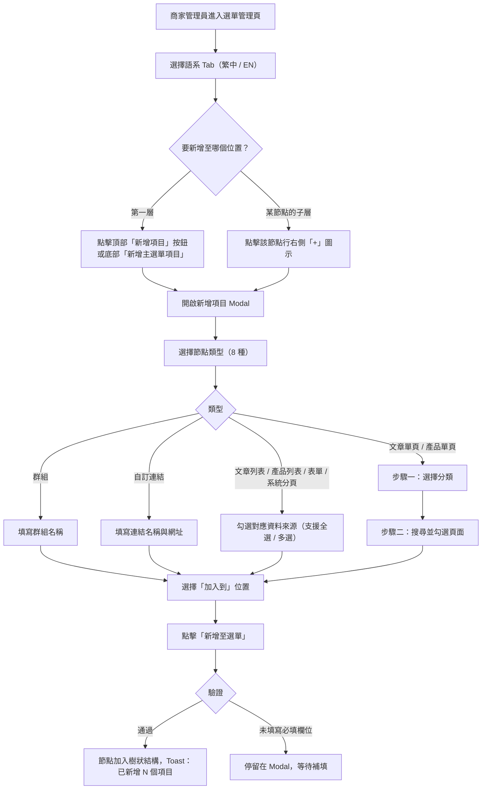
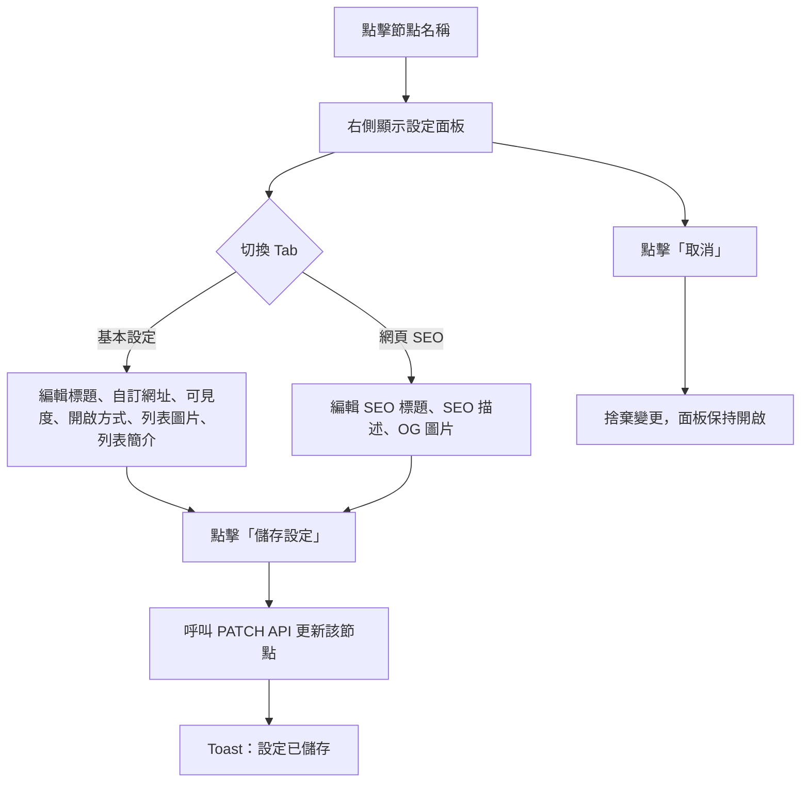
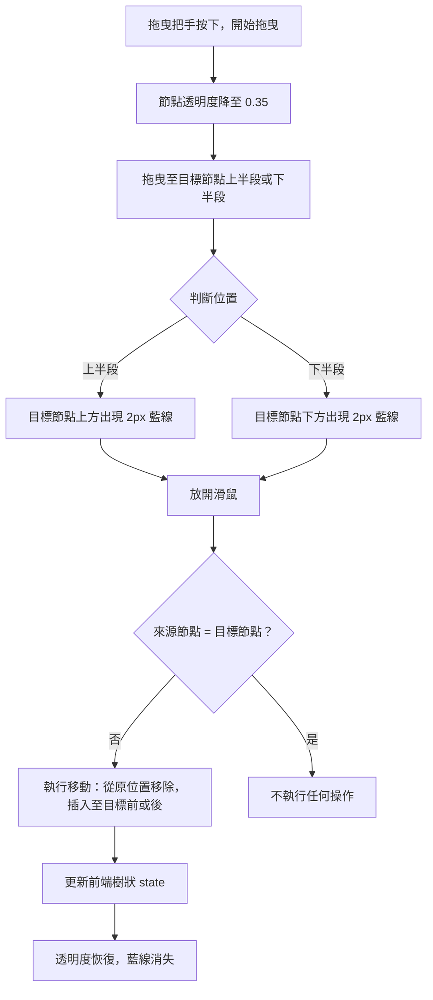

## 版本更新紀錄

| 版本 | 日期 | 修改內容 | 修改人 |
| --- | --- | --- | --- |
| v1.1 | 2026/05/29 | §4.6 匯入匯出補齊：新增操作步驟、檔案類型規格、JSON 結構範例、多層驗證規則、錯誤情境對照表及注意事項 | Neil（Claude 依授權產出）|
| v1.0 | 2026/05/29 | 初稿建立（依 Prototype `components/pages/PageWebsiteDesign.jsx` 回推產出）| Neil（Claude 依授權產出）|

# Evomni — 選單管理 產品需求文件 (PRD) v1.0

## 1. 文件資訊

| 屬性 | 內容 |
| --- | --- |
| 版本 | v1.0 |
| 日期 | 2026/05/29 |
| 需求來源 | Prototype `components/pages/PageWebsiteDesign.jsx`、`SPEC/選單管理-工程規格.md` v3.0 |
| 文件狀態 | 初稿（依 Prototype 回推，工程規格已先行完整化）|
| 相依 PRD | `Evomni_CMS選單SEO保護與路由邏輯_PRD.md`（前台渲染邏輯）|
| 作者 | Neil（Claude 依授權產出）|
| 開發時程 | 階段一 5–8月（電商啟航方案）|

---

## 2. 目標與功能總覽

### 2.1 核心願景與相依性

**核心問題：**
電商網站的前台導覽選單需要由商家自行維護，但若沒有統一的後台管理介面，商家每次要新增頁面連結、調整選單順序或管理多語系選單，都必須透過工程師改程式碼，導致上線週期長、靈活性差，且容易在多語系情境下出現選單內容不一致的問題。

**解決方案：**
提供後台選單管理模組，讓商家管理員可以在不動程式碼的情況下，以視覺化拖曳介面建立並維護前台導覽選單的樹狀結構，支援 8 種節點類型、多語系管理、可見度控制，以及 JSON 格式的匯入匯出。

**Evomni 價值對應：**
選單管理是電商網站形象建立的第一道關卡。商家能自主維護選單意味著上線後的日常維運不需要工程師介入，大幅降低後期維護成本，同時讓行銷活動（如節慶促銷頁面的上架與下架）可以即時反映在導覽列上。

**系統相依性：**

| 模組 | 相依說明 |
| --- | --- |
| 文章管理模組 | 選單節點類型「文章列表」和「文章單頁」需讀取文章分類與文章資料，作為節點對應的內容來源 |
| 產品中心 | 選單節點類型「產品列表」和「產品單頁」需讀取產品分類與產品資料 |
| 表單管理 | 選單節點類型「表單」需讀取表單清單，作為節點對應的表單頁面 |
| 系統分頁管理 | 選單節點類型「系統分頁」需讀取系統固定頁面清單（隱私權政策、服務條款等）|
| 頁面設計器 | 「群組」、「自訂連結」、「文章列表」、「產品列表」、「系統分頁」類型的節點可連結至頁面設計器編輯版面 |
| 前台路由系統 | 選單儲存後前台依樹狀結構渲染導覽列，渲染邏輯詳見 `Evomni_CMS選單SEO保護與路由邏輯_PRD.md` |

---

### 2.2 功能總覽表

| 主功能模組 | 子功能項目 | 功能目的 | 功能詳細描述 | 影響之使用者 |
| --- | --- | --- | --- | --- |
| 選單樹管理 | 以 Modal 新增節點 | 建立選單項目 | 提供 8 種節點類型選擇（群組、自訂連結、文章列表、文章單頁、產品列表、產品單頁、表單、系統分頁），各類型有對應的動態表單欄位，批次勾選後一次新增多個節點 | 商家管理員 |
| 選單樹管理 | 拖曳排序 | 調整選單順序與層級 | 以 HTML5 拖曳 API 調整節點在同語系樹中的位置，拖曳時顯示 2px 藍色定位線，放開後即時更新前端狀態 | 商家管理員 |
| 選單樹管理 | 節點可見度控制 | 臨時隱藏選單項目 | 每個節點有獨立的眼睛圖示切換前台可見度；隱藏時節點名稱顯示刪除線，不影響直接輸入網址訪問 | 商家管理員 |
| 選單樹管理 | 刪除節點 | 移除不需要的選單項目 | 刪除節點同時刪除其所有子節點，操作前無需額外確認，僅以 Toast 回饋 | 商家管理員 |
| 節點設定 | 基本設定面板 | 編輯節點屬性 | 點擊節點名稱後，右側顯示設定面板，可設定標題、自訂網址、前台可見度、開啟方式（換頁或另開新視窗）、列表圖片、列表簡介，以及頁面設計入口連結 | 商家管理員 |
| 節點設定 | SEO 設定面板 | 為每個節點設定搜尋引擎優化資訊 | 設定 SEO 標題、SEO 描述、社群分享圖片（OG 圖片）；欄位留空時系統使用頁面預設值 | 商家管理員 |
| 多語系管理 | 語系 Tab 切換 | 分別管理不同語系的選單 | 繁中與 EN 選單各自獨立，切換 Tab 時右側設定面板清空，顯示對應語系的樹狀結構 | 商家管理員 |
| 多語系管理 | 語系可見度開關 | 整批控制整個語系的前台顯示 | 每個語系有全域可見度開關（Switch），關閉後該語系整個選單對前台訪客不顯示，不論各節點的個別可見度設定 | 商家管理員 |
| 多語系管理 | 複製 / 貼上選單架構 | 快速建立另一語系的選單結構 | 透過三點 Kebab 選單複製目前語系的完整樹狀結構，切換語系後貼上；貼上時遞迴將所有節點的可見度設為隱藏，避免未翻譯內容意外顯示 | 商家管理員 |
| 匯入匯出 | JSON 匯出 | 備份選單資料或跨站複製 | 將當前語系的選單匯出為 JSON 檔案，格式化排版，檔名含語系代碼與日期 | 商家管理員 |
| 匯入匯出 | JSON 匯入 | 還原備份或複製他站選單 | 上傳 JSON 檔案後覆蓋當前語系的選單；驗證格式為陣列，格式錯誤時顯示錯誤 Toast | 商家管理員 |

---

## 3. 全局功能流程

### 3.1 新增選單節點主流程



### 3.2 節點設定與儲存流程



### 3.3 拖曳排序流程



---

## 4. 詳細功能規格

### 4.1 頁面整體佈局

#### 頁面說明

路徑：後台側邊選單 > 網站設計 > 選單管理

頁面分為三個區域：頂部工具列、左側卡片（選單樹，佔寬 40%）、右側卡片（節點設定面板，佔寬 60%）。

```
[頁面標題：選單管理]  [麵包屑：網站設計 / 選單管理]   [匯入] [匯出]
[操作說明橫幅（深灰底 #606266，白字）]
┌─────────────────────────────┬──────────────────────────────────────┐
│  左側卡片 (40%)             │  右側卡片 (60%)                      │
│                             │                                      │
│  [繁中] [EN]  顯示中 Switch │  設定面板（選取節點後顯示）          │
│  選單架構 [···] [新增項目]  │  或                                  │
│  提示文字                   │  空狀態提示                          │
│  ─────────────────────────  │                                      │
│  選單樹（節點列表）          │                                      │
│  [新增主選單項目]（底部）    │                                      │
└─────────────────────────────┴──────────────────────────────────────┘
```

#### 操作說明橫幅

固定於頁面頂部（匯入匯出按鈕下方），背景 `#606266`，白字，說明三項操作重點，不可關閉。

---

### 4.2 選單樹（左側卡片）

#### 語系 Tab 列

| 元素 | 說明 |
| --- | --- |
| Tab 按鈕（繁中 / EN）| 點擊切換語系；切換時清空右側設定面板（selectedId 清空）|
| 可見度文字 | 顯示「顯示中」或「已隱藏」，跟隨 Switch 狀態 |
| 可見度 Switch | 控制該語系整個選單的前台顯示（langVisible 全域開關）|

#### 樹狀列表工具列

| 元素 | 說明 |
| --- | --- |
| 「選單架構」標題 | 靜態文字標籤 |
| 三點 Kebab 按鈕（···）| 展開浮動選單，選項：「複製架構」、「貼上架構」（剪貼板空時灰色不可點擊）|
| 「新增項目」按鈕 | 主要樣式，開啟新增 Modal，預設加入至第一層（defaultParent 為 null）|

提示文字（工具列下方）：「可拖曳列項調整順序；點擊名稱進入設定」

#### 樹狀節點 Row

節點列高 48px，由左至右排列以下元素：

| 位置 | 元素 | 行為說明 |
| --- | --- | --- |
| 1 | 拖曳把手（6 點圖示）| cursor: grab，觸發 HTML5 拖曳 |
| 2 | 展開 / 折疊箭頭 | 有子節點時顯示，點擊 toggle；無子節點時佔位（visibility: hidden）|
| 3 | 節點名稱（flex: 1）| 點擊設定 selectedId，右側顯示設定面板；visible=false 時顯示刪除線與灰色 |
| 4 | 類型標籤（Badge）| 依 type 顯示對應顏色（見 §4.2 類型顏色表）|
| 5 | 可見度圖示（眼睛）| 點擊切換 node.visible；隱藏時顯示警告橙色（#E6A23C），顯示時灰色 |
| 6 | 新增子項目（+）| 開啟新增 Modal，defaultParent 設為該節點 ID |
| 7 | 刪除（垃圾桶）| 刪除節點及其所有子節點 |

**節點視覺狀態：**

| 狀態 | 背景 | 左側邊框 | 名稱顏色 | 額外樣式 |
| --- | --- | --- | --- | --- |
| 正常 | `#FFFFFF` | transparent | `#303133` | — |
| Hover | `#F5F7FA` | transparent | `#303133` | — |
| 已選取（Active）| `#ECF5FF` | 2px solid `#409EFF` | `#409EFF` | font-weight 500 |
| 拖曳中 | `#FFFFFF` | — | — | opacity 0.35 |
| visible = false | `#FFFFFF` | transparent | `#909399` | text-decoration: line-through |

**縮排規則：** padding-left = 12 + depth × 22（px）

#### 節點類型顏色表

| type | 中文名稱 | 文字色 | 背景色 |
| --- | --- | --- | --- |
| `group` | 群組 | `#909399` | `#F5F5F5` |
| `link` | 自訂連結 | `#E6A23C` | `#FDF6EC` |
| `article-list` | 文章列表 | `#409EFF` | `#ECF5FF` |
| `article-page` | 文章單頁 | `#409EFF` | `#ECF5FF` |
| `product-list` | 產品列表 | `#67C23A` | `#F0F9EB` |
| `product-page` | 產品單頁 | `#67C23A` | `#F0F9EB` |
| `form` | 表單 | `#9B59B6` | `#F5EEFB` |
| `system-page` | 系統分頁 | `#303133` | `#F5F7FA` |

#### 底部新增按鈕

樣式：`border-top: 1px dashed #DCDFE6`，藍色文字，hover 背景 `#ECF5FF`。
行為：等同「新增項目」按鈕（defaultParent = null）。

#### 空語系狀態

當語系選單為空陣列時顯示：
- 主文：「此語系尚未建立選單」
- 副文：「點擊『新增項目』或『複製架構』開始建立」

---

### 4.3 新增項目 Modal

#### Modal 規格

固定大小 800 × 660px，垂直置中，背景遮罩 `rgba(0,0,0,0.4)`，點擊遮罩關閉。

#### 類型選擇格（Grid 4 欄 × 2 列）

顯示 8 種類型，每格為可點擊卡片：

- 未選中：白底，邊框 `#DCDFE6`，文字 `#606266`
- 已選中：邊框改為類型對應顏色（1.5px solid），背景改為類型對應 bg 色，文字改為類型對應顏色

#### 各類型動態表單

**群組（group）：**
- 群組名稱（必填 Text Input，placeholder: 輸入前台顯示的群組文字）

**自訂連結（link）：**
- 連結名稱（必填 Text Input，placeholder: 顯示於前台的名稱）
- 連結網址（必填 Text Input，placeholder: https://...）

**文章列表 / 產品列表 / 表單 / 系統分頁：**
- 顯示 Checkbox 清單，含全選 Header Row（支援全選 / 全不選 / indeterminate 三態）
- 全選 Header：背景 `#FAFBFC`，右側顯示「已選 N / M 項」
- 清單最大高度 280px，超出可捲動
- 已勾選列背景 `#ECF5FF`

**文章單頁 / 產品單頁（兩步驟選擇）：**

步驟一 — 選擇分類：
- 列表顯示所有分類，每行含分類名稱與資料筆數（格式：「N 筆 →」）
- 點擊分類進入步驟二，hover 背景 `#ECF5FF`

步驟二 — 選擇頁面（在步驟一選定分類後）：
- 顯示「← 返回分類」按鈕（藍色文字）
- 搜尋框（關鍵字即時過濾，onChange 觸發，無需按 Enter）
- Checkbox 清單（同上，支援全選三態）

#### 「加入到」下拉選單（所有類型均顯示）

選項：
- 第一層（主選單）— value: root
- 各頂層節點名稱 — value: nodeId（依當前語系樹動態產生）

由節點列「+」按鈕觸發時，預設選中對應父節點。

#### Modal 送出規格

| 欄位 | 驗證規則 |
| --- | --- |
| 群組名稱 | 必填，空白時不送出 |
| 連結名稱 | 必填，空白時不送出 |
| 連結網址 | 必填，空白時不送出 |
| 其他類型（多選）| 至少需勾選 1 項，否則不送出 |

送出成功：
- 每個勾選項目新增為一個節點，初始值 `{ visible: true, openMode: 'same', children: [] }`
- 關閉 Modal
- Toast：「已新增 N 個項目」（success）

---

### 4.4 節點設定面板（右側卡片）

#### 空狀態（未選取節點）

置中顯示佔位圖示（半透明）與文字：
- 主文：「選擇左側選單項目以編輯設定」
- 副文：「點擊項目名稱即可進入設定頁面」

#### Panel Header

```
[節點名稱 H2]  [類型標籤（帶色彩邊框）]
[基本設定] [網頁 SEO]   ← Tab bar，active 下底線 #409EFF
```

#### 基本設定 Tab

**A. 內容連結提示橫幅（僅限 article-page / product-page / form）**

顯示於所有欄位之前，背景 `#ECF5FF`，邊框 `#B3D8FF`：

| type | 顯示模組名稱 | 橫幅說明 |
| --- | --- | --- |
| `article-page` | 文章管理 | 此項目連結至文章內容頁，頁面版面由文章管理模組控制。在此僅設定選單顯示名稱、網址與可見度等屬性。|
| `product-page` | 產品中心 | 此項目連結至產品內容頁，頁面版面由產品中心模組控制。在此僅設定選單顯示名稱、網址與可見度等屬性。|
| `form` | 表單管理 | 此項目連結至表單頁面，表單欄位與設計由表單管理模組控制。在此僅設定選單顯示名稱、網址與可見度等屬性。|

橫幅右側有「前往 [模組名稱] 編輯」按鈕。

**B. 欄位定義**

| 欄位名稱 | 元件 | 說明 | 必填 |
| --- | --- | --- | --- |
| 標題 | Text Input | 前台選單顯示名稱 | 是 |
| 自訂網址 | Text Input | 覆蓋系統自動產生路徑；留空使用系統路徑 | 否（placeholder: /about-us）|
| 前台可見度 | Switch + 說明列 | 控制該節點是否顯示於選單；說明文字：「僅影響選單顯示；直接輸入網址仍可瀏覽」| — |
| 開啟方式 | Radio Group（卡片式）| 換頁（same）/ 另開新視窗（new）| — |
| 列表圖片 | 上傳區（拖放框）| 顯示於列表頁的縮圖；說明：「建議 800×450，JPG / PNG / WebP」| 否 |
| 列表簡介 | Textarea（4 行）| 顯示於列表頁的摘要文字 | 否 |
| 頁面設計 | 說明列 + 按鈕（「開啟設計器」）| 連結至頁面設計器；**不顯示於 article-page / product-page / form** | — |

**開啟方式選項（卡片式 Radio）：**
- 換頁（value: same）— 說明文字：「在相同視窗開啟」
- 另開新視窗（value: new）— 說明文字：「以新分頁開啟連結」
- 選中卡片邊框改為 `#409EFF`，背景 `#ECF5FF`

#### 網頁 SEO Tab

| 欄位名稱 | 元件 | Placeholder | Helper 文字 |
| --- | --- | --- | --- |
| SEO 標題 | Text Input | 留空將使用頁面標題 | 建議 30–60 個字元 |
| SEO 描述 | Textarea（4 行）| 留空將使用頁面摘要 | 建議 70–160 個字元 |
| 社群分享圖片（OG 圖片）| 上傳區（拖放框）| 點擊上傳 OG 圖片（建議 1200×630）| — |

#### 設定面板 Footer（兩個 Tab 共用）

- 「儲存設定」（primary 樣式）：呼叫 PATCH API 更新節點；成功後 Toast「設定已儲存」
- 「取消」（secondary 樣式）：捨棄當前面板的未儲存變更，面板保持開啟

---

### 4.5 拖曳排序

#### 技術方式

HTML5 Drag and Drop API：`draggable`、`onDragStart`、`onDragOver`、`onDrop`、`onDragEnd`，事件均在節點 Row 的 div 層設定，`e.stopPropagation()` 防止冒泡。

#### 行為規格

| 事件 | 行為 |
| --- | --- |
| dragStart | 記錄 draggingId；`dataTransfer.effectAllowed = 'move'`；節點 opacity 降至 0.35 |
| dragOver | 計算 e.clientY 相對於目標節點高度中線決定 pos（before / after）；更新 dragOver state；`e.preventDefault()` |
| dragLeave | 清空 dragOver state |
| drop | 執行 wmMove（srcId, dstId, pos）；清空拖曳狀態 |
| dragEnd | 清空 draggingId 與 dragOver |

#### 視覺回饋

- 拖曳中節點：opacity 0.35，transition 0.15s
- 目標位置 before：目標節點上方出現 position: absolute 的 2px 藍線（`#409EFF`），left 對齊縮排位置
- 目標位置 after：目標節點下方出現 2px 藍線

#### 移動限制

- 不可拖曳至自身（srcId = dstId 時跳過）
- 跨語系不可拖曳（拖曳僅作用於當前語系的樹）

---

### 4.6 JSON 匯入匯出

#### 匯出

| 屬性 | 規格 |
| --- | --- |
| 觸發 | 頁面右上角「匯出」按鈕 |
| 範圍 | 當前語系（menus[lang]）|
| 格式 | JSON，美化排版（JSON.stringify(data, null, 2)）|
| 編碼 | UTF-8 |
| 檔名 | `menu-{lang}-{YYYY-MM-DD}.json`（例：`menu-zh-2026-05-29.json`）|
| 機制 | Blob + URL.createObjectURL + 隱形 `<a>` 點擊下載 + revokeObjectURL |
| Toast | 選單已匯出（success）|

**操作步驟：**

1. 進入選單管理頁，確認當前所在語系 Tab（繁中 / EN）
2. 點擊右上角「匯出」按鈕
3. 瀏覽器自動下載 JSON 檔案
4. 頁面顯示 Toast「選單已匯出」

**匯出 JSON 結構說明：**

匯出內容為當前語系的完整選單樹，格式為 MenuNode 節點陣列（含子節點遞迴巢狀）。範例結構如下：

```json
[
  {
    "id": "node-001",
    "name": "關於我們",
    "type": "group",
    "visible": true,
    "openMode": "same",
    "children": [
      {
        "id": "node-002",
        "name": "公司介紹",
        "type": "article-page",
        "visible": true,
        "openMode": "same",
        "sourceId": "article-cat-01",
        "children": []
      }
    ]
  }
]
```

#### 匯入

| 屬性 | 規格 |
| --- | --- |
| 觸發 | 頁面右上角「匯入」按鈕（背後為 hidden `<input type="file" accept=".json">`）|
| 接受檔案類型 | 僅接受 `.json` 副檔名；作業系統檔案選擇器僅顯示 JSON 檔案 |
| 檔案編碼 | UTF-8 |
| 檔案大小上限 | 建議上限 5 MB（超出時前端顯示 warning Toast，仍可繼續匯入）|
| 解析 | FileReader.readAsText → JSON.parse |
| 驗證 | 多層驗證（見「驗證規則」表）|
| 行為 | 成功後以匯入資料**立即覆蓋**當前語系選單（menus[lang] = data）；操作無法復原，前端不顯示確認對話框 |
| Toast 成功 | 選單已匯入（success）|
| Toast 失敗 | 見「錯誤情境」表 |

**操作步驟：**

1. 進入選單管理頁，切換至目標語系 Tab（繁中 / EN）
2. 點擊右上角「匯入」按鈕，系統開啟作業系統檔案選擇器
3. 選擇 `.json` 格式的選單備份檔（由本系統「匯出」功能產生，或符合下方格式規範的自訂 JSON）
4. 系統以 FileReader 讀取檔案內容（UTF-8 文字）
5. 執行多層驗證（見下表）
6. 驗證通過後，當前語系選單立即被匯入資料覆蓋
7. 顯示 Toast 通知操作結果

**驗證規則（多層，依序執行）：**

| 層級 | 驗證項目 | 失敗行為 |
| --- | --- | --- |
| 第一層 | 檔案副檔名為 `.json` | 檔案選擇器限制，不符合類型的檔案無法選取 |
| 第二層 | FileReader 可讀取為文字（無讀取例外）| 顯示 error Toast：「檔案讀取失敗，請確認檔案未損毀」|
| 第三層 | JSON.parse 不拋出例外（合法 JSON 語法）| 顯示 error Toast：「檔案格式錯誤，請上傳正確的 JSON 檔案」|
| 第四層 | 解析結果為陣列（Array.isArray = true）| 顯示 error Toast：「檔案格式錯誤，請上傳正確的 JSON 檔案」|

**錯誤情境說明：**

| 錯誤類型 | 常見原因 | Toast 訊息 |
| --- | --- | --- |
| 檔案讀取失敗 | 檔案損毀或作業系統存取權限問題 | 檔案讀取失敗，請確認檔案未損毀 |
| 無效 JSON 語法 | 手動編輯 JSON 時格式破損（漏逗號、多引號等）| 檔案格式錯誤，請上傳正確的 JSON 檔案 |
| 根結構非陣列 | 匯入了物件格式的 JSON 或其他系統的匯出檔 | 檔案格式錯誤，請上傳正確的 JSON 檔案 |

**注意事項：**

- 匯入操作立即覆蓋當前語系選單且**無法復原**；建議在匯入前先使用「匯出」功能備份現有資料
- 系統僅驗證最外層為陣列，不逐節點檢查各欄位型別；若節點資料異常，前台渲染結果可能不如預期
- 匯入資料中的 sourceId（文章、產品、表單對應 ID）若在目標站台不存在，節點仍會建立，但前台連結可能導向 404
- 匯入成功後，選單樹狀態僅更新於前端；仍需透過整頁儲存機制（PUT API）才會寫入後端

---

### 4.7 語系架構複製 / 貼上

| 操作 | 說明 |
| --- | --- |
| 複製架構 | 將當前語系的完整樹狀結構深拷貝（deep copy）存入 menuClipboard state；Toast：「選單架構已複製」|
| 貼上架構 | 將 menuClipboard 貼入當前語系，遞迴將所有節點 visible 設為 false；Toast：「選單架構已貼上（預設全部隱藏）」|
| 跨語系操作 | 支援（先切換語系 Tab 再貼上）|
| 剪貼板狀態 | menuClipboard 為 null 時，「貼上架構」選項灰色不可點擊 |

---

## 5. 商業規則與限制

1. 語系可見度（langVisible）為語系層級全域開關，關閉時該語系整個選單對前台訪客不顯示，不論個別節點的 visible 設定為何，兩個層級獨立運作。
2. 節點 visible = false 時，節點在前台選單中不顯示，但直接輸入該頁面網址仍可正常訪問。
3. 刪除節點時，其所有子節點（不論層級深度）一併刪除。
4. 複製 / 貼上架構後，所有節點預設 visible = false，需手動逐節點開啟，防止未翻譯內容意外顯示於前台。
5. 「文章單頁」與「產品單頁」類型的節點不顯示「頁面設計」按鈕，改以模組連結橫幅提示，因其版面由對應模組管理，不在選單管理範圍內控制。
6. 「表單」類型的節點同上，版面由表單管理模組控制。
7. 拖曳排序不可跨語系操作，各語系樹相互獨立。
8. 自訂網址（url）在貼上架構時原樣複製，不自動調整語系路徑前綴（如 /en/about）；如需調整，商家需手動修改各節點設定。此行為待 PM 確認後可調整。
9. 匯入 JSON 後立即覆蓋當前語系的選單，操作無法復原，前端不設確認對話框（依賴匯出功能作為備份機制）。
10. 拖曳操作後僅更新前端 state，不立即送 API；待商家完成所有調整後，由整頁儲存機制統一送出。整頁儲存觸發時機待工程師與 PM 確認（可為：自動偵測離頁 + 確認儲存；或加入明確「儲存選單」按鈕）。

---

## 6. 非功能需求

| 需求類型 | 規格說明 |
| --- | --- |
| 效能 | 選單樹頁面載入（含 100 個節點以內）< 1 秒；設定面板儲存 API 回應 < 0.5 秒 |
| 安全性 | 所有 API 需驗證商家 Token（使用者認證模組），無效 Token 返回 401；節點 ID 不可被猜測枚舉（使用 UUID 或類似不連續 ID）|
| 相容性 | Chrome 110+、Edge 110+、Firefox 110+；桌機為主，最低寬度 1280px；HTML5 拖曳不支援觸控裝置，觸控替代方案待定 |
| 可及性 | WCAG 2.1 AA；類型標籤不可單純以顏色區分（需搭配文字標籤）；鍵盤可操作（Tab 導覽、Enter 確認、Esc 關閉 Modal）|
| 資料一致性 | 節點設定儲存（PATCH）與整棵樹儲存（PUT）為獨立操作，不可互相干擾；前端 state 以樹狀結構為單一來源，所有操作均更新同一 state |

---

## 7. 技術備忘（供工程師參考，可依技術判斷調整）

### 7.1 建議 DB Schema

```sql
-- 選單樹（以相鄰列表 Adjacency List 儲存，支援遞迴查詢）
CREATE TABLE menu_nodes (
    id            CHAR(36)     NOT NULL PRIMARY KEY,          -- UUID
    site_id       BIGINT       NOT NULL,                      -- 所屬電商站
    lang          VARCHAR(10)  NOT NULL,                      -- 語系碼（zh / en 等）
    parent_id     CHAR(36)     NULL REFERENCES menu_nodes(id) ON DELETE CASCADE,
    type          VARCHAR(20)  NOT NULL,                      -- group / link / article-list / article-page / product-list / product-page / form / system-page
    name          VARCHAR(100) NOT NULL,                      -- 前台顯示名稱
    url           VARCHAR(500) NULL,                          -- 自訂網址（僅 link 類型必填）
    visible       BOOLEAN      NOT NULL DEFAULT TRUE,
    open_mode     VARCHAR(10)  NOT NULL DEFAULT 'same',       -- same / new
    sort_order    INT          NOT NULL DEFAULT 0,
    source_id     CHAR(36)     NULL,                          -- 對應文章分類 / 產品分類 / 表單 / 系統頁面 ID
    list_image    VARCHAR(500) NULL,                          -- 列表縮圖 URL（媒體庫路徑）
    list_desc     TEXT         NULL,                          -- 列表簡介
    seo_title     VARCHAR(200) NULL,
    seo_desc      TEXT         NULL,
    og_image      VARCHAR(500) NULL,
    created_at    TIMESTAMP    NOT NULL DEFAULT CURRENT_TIMESTAMP,
    updated_at    TIMESTAMP    NOT NULL DEFAULT CURRENT_TIMESTAMP ON UPDATE CURRENT_TIMESTAMP,
    INDEX idx_site_lang (site_id, lang),
    INDEX idx_parent (parent_id),
    INDEX idx_sort (site_id, lang, parent_id, sort_order)
);

-- 語系可見度全域設定
CREATE TABLE menu_lang_settings (
    site_id    BIGINT      NOT NULL,
    lang       VARCHAR(10) NOT NULL,
    visible    BOOLEAN     NOT NULL DEFAULT TRUE,
    PRIMARY KEY (site_id, lang)
);
```

> 工程師注意：若樹狀層級超過 5 層或節點總數超過 500，建議評估改用 Nested Set Model 或 ltree（PostgreSQL）以提升查詢效能。

### 7.2 建議 API 路由

| 方法 | 路由 | 說明 |
| --- | --- | --- |
| GET | `/api/menus?lang={lang}` | 取得指定語系的完整選單樹（含巢狀子節點）|
| PUT | `/api/menus?lang={lang}` | 儲存整棵選單樹（覆蓋，含順序）|
| PATCH | `/api/menus/{lang}/nodes/{id}` | 更新單一節點的設定欄位（設定面板儲存）|
| GET | `/api/menus/export?lang={lang}` | 匯出指定語系的選單為 JSON |
| POST | `/api/menus/import?lang={lang}` | 匯入 JSON 覆蓋指定語系 |
| PUT | `/api/menus/lang-settings` | 更新語系可見度設定（langVisible）|
| GET | `/api/article-categories` | 取得文章分類清單（新增 Modal 用）|
| GET | `/api/article-categories/{id}/pages` | 取得分類下的文章單頁清單 |
| GET | `/api/product-categories` | 取得產品分類清單 |
| GET | `/api/product-categories/{id}/pages` | 取得分類下的產品單頁清單 |
| GET | `/api/forms` | 取得表單清單 |
| GET | `/api/system-pages` | 取得系統分頁清單 |

**儲存策略說明：**

後端提供兩種儲存模式：
1. `PUT /api/menus?lang={lang}`：一次性覆蓋儲存整棵樹（含順序與巢狀關係），適用於拖曳排序後的整批儲存
2. `PATCH /api/menus/{lang}/nodes/{id}`：只更新單一節點的欄位值，適用於設定面板儲存

前端以前者為主儲存機制，後者用於設定面板的即時儲存。整頁儲存的觸發時機由前端決定（建議選項：離頁前自動偵測 + 確認對話框）。

---

## 8. 待確認與未定案事項

| # | 問題 | 影響範圍 | 負責人 | 截止日 |
| --- | --- | --- | --- | --- |
| 1 | 整頁儲存觸發時機：應加入「儲存選單」按鈕讓商家手動觸發，還是偵測離頁時自動提醒儲存？ | 前端 UX、PUT API 呼叫時機 | PM + 前端工程師 | 待定 |
| 2 | 自訂網址（url）複製架構時，是否需要依語系自動調整路徑前綴（如 /en/about）？ | 複製架構功能邏輯 | PM | 待定 |
| 3 | 開啟方式中「換頁」的正式文案：建議改為「同視窗開啟」，待 PM 最終確認詞彙 | UI 文案 | PM | 待定 |
| 4 | 觸控裝置的拖曳替代方案：HTML5 拖曳不支援觸控，是否需要在手機版後台提供拖曳替代操作（如長按拖曳或移動按鈕）？ | 手機瀏覽相容性 | PM + 前端工程師 | 待定 |
| 5 | 巢狀層級上限：目前 Prototype 無限制，是否需要設定最大巢狀層級（建議上限 3–5 層）以避免前台渲染困難？ | 前台選單渲染、後台 UI | PM | 待定 |
| 6 | 批量刪除：是否需要支援多選節點後批量刪除？ | 操作效率 | PM | 待定 |
| 7 | 展開 / 收合全部：是否需要一鍵展開所有節點 / 收合所有節點的按鈕？ | 操作便利性 | PM | 待定 |

---

## 9. 原型連結

- 整合版（正式開發依據）：`index.html` → 後台側邊選單 > 網站設計 > 選單管理（路由：`website-menu`，元件：`components/pages/PageWebsiteDesign.jsx`）
- 工程規格文件：`SPEC/選單管理-工程規格.md` v3.0（含完整 Layout 尺寸、顏色值、縮排規則）
- 獨立測試版（已棄用，與整合版設計不同）：`html/選單管理.html`
